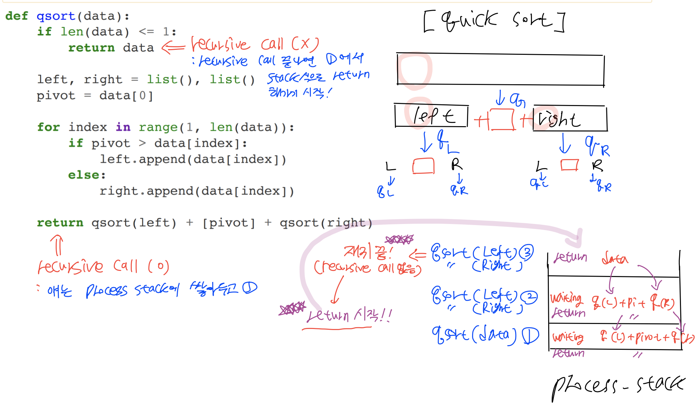

### 1. 퀵 정렬 (quick sort)
* <font color='#BF360C'>정렬 알고리즘의 꽃</font>
* 기준점(pivot 이라고 부름)을 정해서, 기준점보다 작은 데이터는 왼쪽(left), 큰 데이터는 오른쪽(right) 으로 모으는 함수를 작성함
* 각 왼쪽(left), 오른쪽(right)은 재귀용법을 사용해서 다시 동일 함수를 호출하여 위 작업을 반복함
* 함수는 왼쪽(left) + 기준점(pivot) + 오른쪽(right) 을 리턴함


```python
from IPython.display import Image
```


```python
Image("/Users/kimjeongseob/Desktop/패캠 강의/알고리즘기술면접강의자료/0. 연습 노트북/0.qsort.png")
```





### 2. Quick sort example


```python
def qsort(data):
    
    left,right=list(),list()
    
    if len(data)<=1:
        return data
    
    else:
        pivot = data[0]
        for i in range(1,len(data)):
            if data[i] < pivot:
                left.append(data[i])
            else:
                right.append(data[i])
                
        return qsort(left) + [pivot] + qsort(right)
```


```python
import random

data_list = random.sample(range(100), 10)

qsort(data_list)
```


    [1, 29, 31, 34, 39, 59, 82, 86, 88, 97]


### 3. Quick sort example

- using list comprehension


```python
def qsort(data):
    
    left,right=list(),list()
    
    if len(data)<=1:
        return data
    
    else:
        pivot = data[0]
        
        left = [data[i] for i in range(1,len(data)) if data[i] < pivot]
        right = [data[i] for i in range(1,len(data)) if data[i] >= pivot]
        
        return qsort(left) + [pivot] + qsort(right)
```


```python
import random

data_list = random.sample(range(100), 10)

qsort(data_list)
```


    [14, 18, 21, 24, 55, 63, 68, 76, 89, 92]


