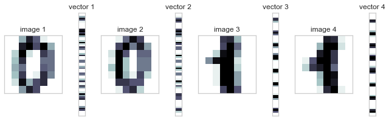

# 1. 벡터와 벡터의 곱셈 - Dot product


```python
x = np.array([[1], [2], [3]])
y = np.array([[4], [5], [6]])

print(x.T@y,np.dot(x.T,y),sep = '\n')
```

    [[32]]
    [[32]]


# 2. 유사도 - MNIST image data Dot product


```python
from sklearn.datasets import load_digits
import matplotlib.gridspec as gridspec

digits = load_digits()
d1 = digits.images[0]
d2 = digits.images[10]
d3 = digits.images[1]
d4 = digits.images[11]
v1 = d1.reshape(64, 1)
v2 = d2.reshape(64, 1)
v3 = d3.reshape(64, 1)
v4 = d4.reshape(64, 1)

plt.figure(figsize=(9, 9))
gs = gridspec.GridSpec(1, 8, height_ratios=[1],
                       width_ratios=[9, 1, 9, 1, 9, 1, 9, 1])
for i in range(4):
    plt.subplot(gs[2 * i])
    plt.imshow(eval("d" + str(i + 1)), aspect=1,
               interpolation='nearest', cmap=plt.cm.bone_r)
    plt.grid(False)
    plt.xticks([])
    plt.yticks([])
    plt.title("image {}".format(i + 1))
    plt.subplot(gs[2 * i + 1])
    plt.imshow(eval("v" + str(i + 1)), aspect=0.25,
               interpolation='nearest', cmap=plt.cm.bone_r)
    plt.grid(False)
    plt.xticks([])
    plt.yticks([])
    plt.title("vector {}".format(i + 1))
plt.tight_layout()
plt.show()
```





```python
# 0이미지와 0이미지의 내적 = 유사할수록 내적 값이 큼 (코사인 유사도는 내적값과 비례)

v1.T @ v2
```


    array([[3064.]])


```python
# 1이미지와 1이미지의 내적 = 유사할수록 내적 값이 큼 (코사인 유사도는 내적값과 비례)

v3.T @ v4
```


    array([[3661.]])


```python
# 1이미지와 0이미지의 내적 = 유사할수록 내적 값이 큼 (코사인 유사도는 내적값과 비례)

v3.T @ v1
```


    array([[1866.]])


```python
# 0이미지와 1이미지의 내적 = 유사할수록 내적 값이 큼 (코사인 유사도는 내적값과 비례)

v2.T @ v4
```


    array([[2479.]])


# 3. 행렬과 행렬의 곱셈 - Dot product


```python
A = np.array([[1, 2, 3], [4, 5, 6]])
B = np.array([[1, 2], [3, 4], [5, 6]])

print(A @ B)
```

    [[22 28]
     [49 64]]


# 4. 행렬의 교환법칙 확인


```python
A @ B
```


    array([[22, 28],
           [49, 64]])


```python
B @ A
```


    array([[ 9, 12, 15],
           [19, 26, 33],
           [29, 40, 51]])


# 5. 행렬 연산(평균 값 특징행렬로 변환) - 붓꽃 데이터 활용 


```python
from sklearn.datasets import load_iris
X = load_iris().data
```


```python
X.shape
```


    (150, 4)


```python
X_ = pd.DataFrame(X,index=range(1,150+1),columns=[1,2,3,4])
X_.head(5)
```


<div>
<style scoped>
    .dataframe tbody tr th:only-of-type {
        vertical-align: middle;
    }

    .dataframe tbody tr th {
        vertical-align: top;
    }

    .dataframe thead th {
        text-align: right;
    }
</style>
<table border="1" class="dataframe">
  <thead>
    <tr style="text-align: right;">
      <th></th>
      <th>1</th>
      <th>2</th>
      <th>3</th>
      <th>4</th>
    </tr>
  </thead>
  <tbody>
    <tr>
      <td>1</td>
      <td>5.1</td>
      <td>3.5</td>
      <td>1.4</td>
      <td>0.2</td>
    </tr>
    <tr>
      <td>2</td>
      <td>4.9</td>
      <td>3.0</td>
      <td>1.4</td>
      <td>0.2</td>
    </tr>
    <tr>
      <td>3</td>
      <td>4.7</td>
      <td>3.2</td>
      <td>1.3</td>
      <td>0.2</td>
    </tr>
    <tr>
      <td>4</td>
      <td>4.6</td>
      <td>3.1</td>
      <td>1.5</td>
      <td>0.2</td>
    </tr>
    <tr>
      <td>5</td>
      <td>5.0</td>
      <td>3.6</td>
      <td>1.4</td>
      <td>0.2</td>
    </tr>
  </tbody>
</table>
</div>


```python
X_bar = (1/X.shape[0])*np.ones([150,1]) @ np.ones([150,1]).T @ X
X_bar = pd.DataFrame(X_bar,index=range(1,150+1),columns=[1,2,3,4])
X_bar.head(5)
```


<div>
<style scoped>
    .dataframe tbody tr th:only-of-type {
        vertical-align: middle;
    }

    .dataframe tbody tr th {
        vertical-align: top;
    }

    .dataframe thead th {
        text-align: right;
    }
</style>
<table border="1" class="dataframe">
  <thead>
    <tr style="text-align: right;">
      <th></th>
      <th>1</th>
      <th>2</th>
      <th>3</th>
      <th>4</th>
    </tr>
  </thead>
  <tbody>
    <tr>
      <td>1</td>
      <td>5.843333</td>
      <td>3.057333</td>
      <td>3.758</td>
      <td>1.199333</td>
    </tr>
    <tr>
      <td>2</td>
      <td>5.843333</td>
      <td>3.057333</td>
      <td>3.758</td>
      <td>1.199333</td>
    </tr>
    <tr>
      <td>3</td>
      <td>5.843333</td>
      <td>3.057333</td>
      <td>3.758</td>
      <td>1.199333</td>
    </tr>
    <tr>
      <td>4</td>
      <td>5.843333</td>
      <td>3.057333</td>
      <td>3.758</td>
      <td>1.199333</td>
    </tr>
    <tr>
      <td>5</td>
      <td>5.843333</td>
      <td>3.057333</td>
      <td>3.758</td>
      <td>1.199333</td>
    </tr>
  </tbody>
</table>
</div>


```python

```


```python

```
