# 1. Data representation

### 1.1 Data representation using numpy

1. scikit-learn dataset 중 붓꽃(petal) 데이터 $x_{2}$(petal width)에 대한 벡터 변수 x2 를 만들기


```python
from sklearn.datasets import load_iris
```


```python
# 데이터 추출

data = load_iris()
data.data[:5]
```


    array([[5.1, 3.5, 1.4, 0.2],
           [4.9, 3. , 1.4, 0.2],
           [4.7, 3.2, 1.3, 0.2],
           [4.6, 3.1, 1.5, 0.2],
           [5. , 3.6, 1.4, 0.2]])


```python
# print(data.DESCR)
```


```python
data.feature_names
```


    ['sepal length (cm)',
     'sepal width (cm)',
     'petal length (cm)',
     'petal width (cm)']


```python
data.target_names
```


    array(['setosa', 'versicolor', 'virginica'], dtype='<U10')


```python
# 붓꽃 데이터 파악을 위한 임시적인 데이터프레임 생성
_ = pd.DataFrame(data.data,columns=data.feature_names)
_
```


<div>
<style scoped>
    .dataframe tbody tr th:only-of-type {
        vertical-align: middle;
    }

    .dataframe tbody tr th {
        vertical-align: top;
    }

    .dataframe thead th {
        text-align: right;
    }
</style>
<table border="1" class="dataframe">
  <thead>
    <tr style="text-align: right;">
      <th></th>
      <th>sepal length (cm)</th>
      <th>sepal width (cm)</th>
      <th>petal length (cm)</th>
      <th>petal width (cm)</th>
    </tr>
  </thead>
  <tbody>
    <tr>
      <th>0</th>
      <td>5.1</td>
      <td>3.5</td>
      <td>1.4</td>
      <td>0.2</td>
    </tr>
    <tr>
      <th>1</th>
      <td>4.9</td>
      <td>3.0</td>
      <td>1.4</td>
      <td>0.2</td>
    </tr>
    <tr>
      <th>2</th>
      <td>4.7</td>
      <td>3.2</td>
      <td>1.3</td>
      <td>0.2</td>
    </tr>
    <tr>
      <th>3</th>
      <td>4.6</td>
      <td>3.1</td>
      <td>1.5</td>
      <td>0.2</td>
    </tr>
    <tr>
      <th>4</th>
      <td>5.0</td>
      <td>3.6</td>
      <td>1.4</td>
      <td>0.2</td>
    </tr>
    <tr>
      <th>...</th>
      <td>...</td>
      <td>...</td>
      <td>...</td>
      <td>...</td>
    </tr>
    <tr>
      <th>145</th>
      <td>6.7</td>
      <td>3.0</td>
      <td>5.2</td>
      <td>2.3</td>
    </tr>
    <tr>
      <th>146</th>
      <td>6.3</td>
      <td>2.5</td>
      <td>5.0</td>
      <td>1.9</td>
    </tr>
    <tr>
      <th>147</th>
      <td>6.5</td>
      <td>3.0</td>
      <td>5.2</td>
      <td>2.0</td>
    </tr>
    <tr>
      <th>148</th>
      <td>6.2</td>
      <td>3.4</td>
      <td>5.4</td>
      <td>2.3</td>
    </tr>
    <tr>
      <th>149</th>
      <td>5.9</td>
      <td>3.0</td>
      <td>5.1</td>
      <td>1.8</td>
    </tr>
  </tbody>
</table>
<p>150 rows × 4 columns</p>
</div>


```python
# 데이터의 기초통계량 확인

_.describe()
```


<div>
<style scoped>
    .dataframe tbody tr th:only-of-type {
        vertical-align: middle;
    }

    .dataframe tbody tr th {
        vertical-align: top;
    }

    .dataframe thead th {
        text-align: right;
    }
</style>
<table border="1" class="dataframe">
  <thead>
    <tr style="text-align: right;">
      <th></th>
      <th>sepal length (cm)</th>
      <th>sepal width (cm)</th>
      <th>petal length (cm)</th>
      <th>petal width (cm)</th>
    </tr>
  </thead>
  <tbody>
    <tr>
      <th>count</th>
      <td>150.000000</td>
      <td>150.000000</td>
      <td>150.000000</td>
      <td>150.000000</td>
    </tr>
    <tr>
      <th>mean</th>
      <td>5.843333</td>
      <td>3.057333</td>
      <td>3.758000</td>
      <td>1.199333</td>
    </tr>
    <tr>
      <th>std</th>
      <td>0.828066</td>
      <td>0.435866</td>
      <td>1.765298</td>
      <td>0.762238</td>
    </tr>
    <tr>
      <th>min</th>
      <td>4.300000</td>
      <td>2.000000</td>
      <td>1.000000</td>
      <td>0.100000</td>
    </tr>
    <tr>
      <th>25%</th>
      <td>5.100000</td>
      <td>2.800000</td>
      <td>1.600000</td>
      <td>0.300000</td>
    </tr>
    <tr>
      <th>50%</th>
      <td>5.800000</td>
      <td>3.000000</td>
      <td>4.350000</td>
      <td>1.300000</td>
    </tr>
    <tr>
      <th>75%</th>
      <td>6.400000</td>
      <td>3.300000</td>
      <td>5.100000</td>
      <td>1.800000</td>
    </tr>
    <tr>
      <th>max</th>
      <td>7.900000</td>
      <td>4.400000</td>
      <td>6.900000</td>
      <td>2.500000</td>
    </tr>
  </tbody>
</table>
</div>


```python
# 데이터의 기초통계량 확인 (왜도)
# 확인 결과 : 심하진 않지만, 우측으로 비대칭임을 확인할 수 있음

_['petal width (cm)'].skew()
```


    -0.10296674764898116


```python
# 데이터의 기초통계량 확인 (첨도)
# 확인 결과 : 심하진 않지만, 정규분포 보다 모멘트 중심으로 쏠려있는 것을 확인

_['petal width (cm)'].kurtosis()
```


    -1.340603996612646


```python
# 특징 벡터로 변환하기 위한 reshape 진행

x2 = data.data[:,3]
x2 = x2.reshape(-1,150)
x2.shape
```


    (1, 150)


```python
# histogram 시각화를 위한 Series로 저장(because : 기존의 2차원 이상의 array데이터는 plt.hist()로 시각화 불가능)

x2_series = pd.Series(x2[0])
x2_series
```


    0      0.2
    1      0.2
    2      0.2
    3      0.2
    4      0.2
          ... 
    145    2.3
    146    1.9
    147    2.0
    148    2.3
    149    1.8
    Length: 150, dtype: float64


```python
# histogram으로 데이터 시각화

%matplotlib inline
plt.hist(x2_series)
plt.title('petal width(cm)')
plt.xlabel('petal width(cm)')
plt.ylabel('number of object')
plt.show()
```


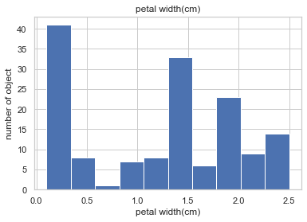


```python
# kernel distritubion 시각화

sns.distplot(x2_series)
```


    <matplotlib.axes._subplots.AxesSubplot at 0x1a200e3a90>


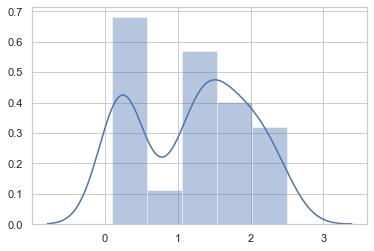


```python
sns.kdeplot(x2_series)
```


    <matplotlib.axes._subplots.AxesSubplot at 0x1a20535c10>


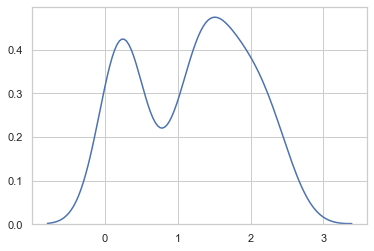


```python
# iris 데이터 전체 분포 확인

# species 데이터 추가 위한 전처리
# 1. series로 species 실수형 데이터 가져오기 (category 타입)
# 2. 실수 category -> 문자 category로 변환 ( .cat.rename_catories([ ]))

species = pd.Series(data.target, dtype='category')
species = species.cat.rename_categories(data.target_names)
species
```


    0         setosa
    1         setosa
    2         setosa
    3         setosa
    4         setosa
             ...    
    145    virginica
    146    virginica
    147    virginica
    148    virginica
    149    virginica
    Length: 150, dtype: category
    Categories (3, object): [setosa, versicolor, virginica]


```python
# species 데이터 추가

_['species'] = species
_
```


<div>
<style scoped>
    .dataframe tbody tr th:only-of-type {
        vertical-align: middle;
    }

    .dataframe tbody tr th {
        vertical-align: top;
    }

    .dataframe thead th {
        text-align: right;
    }
</style>
<table border="1" class="dataframe">
  <thead>
    <tr style="text-align: right;">
      <th></th>
      <th>sepal length (cm)</th>
      <th>sepal width (cm)</th>
      <th>petal length (cm)</th>
      <th>petal width (cm)</th>
      <th>species</th>
    </tr>
  </thead>
  <tbody>
    <tr>
      <th>0</th>
      <td>5.1</td>
      <td>3.5</td>
      <td>1.4</td>
      <td>0.2</td>
      <td>setosa</td>
    </tr>
    <tr>
      <th>1</th>
      <td>4.9</td>
      <td>3.0</td>
      <td>1.4</td>
      <td>0.2</td>
      <td>setosa</td>
    </tr>
    <tr>
      <th>2</th>
      <td>4.7</td>
      <td>3.2</td>
      <td>1.3</td>
      <td>0.2</td>
      <td>setosa</td>
    </tr>
    <tr>
      <th>3</th>
      <td>4.6</td>
      <td>3.1</td>
      <td>1.5</td>
      <td>0.2</td>
      <td>setosa</td>
    </tr>
    <tr>
      <th>4</th>
      <td>5.0</td>
      <td>3.6</td>
      <td>1.4</td>
      <td>0.2</td>
      <td>setosa</td>
    </tr>
    <tr>
      <th>...</th>
      <td>...</td>
      <td>...</td>
      <td>...</td>
      <td>...</td>
      <td>...</td>
    </tr>
    <tr>
      <th>145</th>
      <td>6.7</td>
      <td>3.0</td>
      <td>5.2</td>
      <td>2.3</td>
      <td>virginica</td>
    </tr>
    <tr>
      <th>146</th>
      <td>6.3</td>
      <td>2.5</td>
      <td>5.0</td>
      <td>1.9</td>
      <td>virginica</td>
    </tr>
    <tr>
      <th>147</th>
      <td>6.5</td>
      <td>3.0</td>
      <td>5.2</td>
      <td>2.0</td>
      <td>virginica</td>
    </tr>
    <tr>
      <th>148</th>
      <td>6.2</td>
      <td>3.4</td>
      <td>5.4</td>
      <td>2.3</td>
      <td>virginica</td>
    </tr>
    <tr>
      <th>149</th>
      <td>5.9</td>
      <td>3.0</td>
      <td>5.1</td>
      <td>1.8</td>
      <td>virginica</td>
    </tr>
  </tbody>
</table>
<p>150 rows × 5 columns</p>
</div>


```python
sns.pairplot(_,hue = 'species')
```


    <seaborn.axisgrid.PairGrid at 0x1a2203b110>


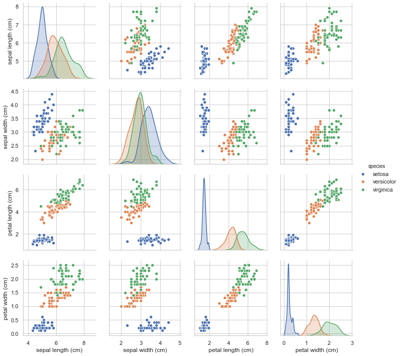


2. MNIST digit images(숫자 이미지) 추출 및 특징벡터화 작업

    - 본래 2차원 이미지 데이터(8 by 8)를 1차원 특징벡터화(64 by 1)


```python
from sklearn.datasets import load_digits
```


```python
digit = load_digits()
```


```python
print(digit.DESCR)
```

    .. _digits_dataset:
    
    Optical recognition of handwritten digits dataset
    --------------------------------------------------
    
    **Data Set Characteristics:**
    
        :Number of Instances: 5620
        :Number of Attributes: 64
        :Attribute Information: 8x8 image of integer pixels in the range 0..16.
        :Missing Attribute Values: None
        :Creator: E. Alpaydin (alpaydin '@' boun.edu.tr)
        :Date: July; 1998
    
    This is a copy of the test set of the UCI ML hand-written digits datasets
    https://archive.ics.uci.edu/ml/datasets/Optical+Recognition+of+Handwritten+Digits
    
    The data set contains images of hand-written digits: 10 classes where
    each class refers to a digit.
    
    Preprocessing programs made available by NIST were used to extract
    normalized bitmaps of handwritten digits from a preprinted form. From a
    total of 43 people, 30 contributed to the training set and different 13
    to the test set. 32x32 bitmaps are divided into nonoverlapping blocks of
    4x4 and the number of on pixels are counted in each block. This generates
    an input matrix of 8x8 where each element is an integer in the range
    0..16. This reduces dimensionality and gives invariance to small
    distortions.
    
    For info on NIST preprocessing routines, see M. D. Garris, J. L. Blue, G.
    T. Candela, D. L. Dimmick, J. Geist, P. J. Grother, S. A. Janet, and C.
    L. Wilson, NIST Form-Based Handprint Recognition System, NISTIR 5469,
    1994.
    
    .. topic:: References
    
      - C. Kaynak (1995) Methods of Combining Multiple Classifiers and Their
        Applications to Handwritten Digit Recognition, MSc Thesis, Institute of
        Graduate Studies in Science and Engineering, Bogazici University.
      - E. Alpaydin, C. Kaynak (1998) Cascading Classifiers, Kybernetika.
      - Ken Tang and Ponnuthurai N. Suganthan and Xi Yao and A. Kai Qin.
        Linear dimensionalityreduction using relevance weighted LDA. School of
        Electrical and Electronic Engineering Nanyang Technological University.
        2005.
      - Claudio Gentile. A New Approximate Maximal Margin Classification
        Algorithm. NIPS. 2000.


```python
digit.data[1].shape
```


    (64,)


```python
# image 데이터 shape 확인 : 8 by 8, 1797개의 이미지

digit.images.shape
```


    (1797, 8, 8)


```python
# 실제 확인 : 8 by 8 이미지 데이터(1개 이미지 당)

digit.images[0]
```


    array([[ 0.,  0.,  5., 13.,  9.,  1.,  0.,  0.],
           [ 0.,  0., 13., 15., 10., 15.,  5.,  0.],
           [ 0.,  3., 15.,  2.,  0., 11.,  8.,  0.],
           [ 0.,  4., 12.,  0.,  0.,  8.,  8.,  0.],
           [ 0.,  5.,  8.,  0.,  0.,  9.,  8.,  0.],
           [ 0.,  4., 11.,  0.,  1., 12.,  7.,  0.],
           [ 0.,  2., 14.,  5., 10., 12.,  0.,  0.],
           [ 0.,  0.,  6., 13., 10.,  0.,  0.,  0.]])


```python
# 데이터 reshape 전처리 : 특징벡터 저장 위함
# 'd'라는 리스트 타입에 64,1 이미지 데이터 저장

d = []
for i in range(10):
    d.append(digit.images[i].reshape(64,-1))
len(d[0])
```


    64


```python
# 8 by 8 이미지 데이터 시각화

plt.figure(figsize=(15,10))
for i in range(10):
    plt.subplot(1,10,i+1)
    plt.imshow(digit.images[i],cmap=plt.cm.bone_r)
    plt.grid(False)
    plt.xticks([])
    plt.yticks([])
    plt.title("image {}".format(i+1))

plt.show()
```


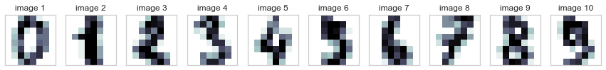


```python
# 64 by 1 특징벡터 시각화

plt.figure(figsize=(15,10))
for i in range(10):
    plt.subplot(1,10,i+1)
    plt.imshow(d[i],cmap=plt.cm.bone_r)
    plt.grid(False)
    plt.xticks([])
    plt.yticks([])
    plt.title("image {}".format(i+1))

plt.show()
```


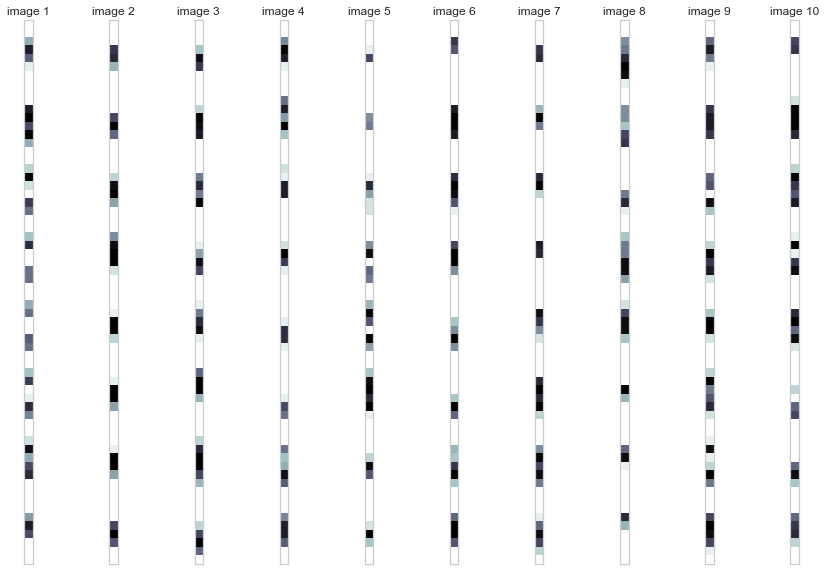


3. 3차원 텐서의 이미지 데이터 표현 

    - 2차원 행렬의 이미지 + 컬러 데이터(채널) 추가 = 3차원 데이터


```python
from scipy import misc
```


```python
img_rgb = misc.face()  # 컬러 이미지 로드
img_rgb.shape  # 데이터의 모양 : 각 이미지 당 3개의 채널(컬러) + 2차원 이미지 데이터(768 by 1024)
```


    (768, 1024, 3)


```python
# 1채널의 이미지 데이터

img_rgb[:,:,0]
```


    array([[121, 138, 153, ..., 119, 131, 139],
           [ 89, 110, 130, ..., 118, 134, 146],
           [ 73,  94, 115, ..., 117, 133, 144],
           ...,
           [ 87,  94, 107, ..., 120, 119, 119],
           [ 85,  95, 112, ..., 121, 120, 120],
           [ 85,  97, 111, ..., 120, 119, 118]], dtype=uint8)


```python
# original 이미지 시각화
plt.figure(figsize=(10,4))
plt.imshow(img_rgb,cmap=plt.cm.gray)
plt.grid(False)
plt.xticks([])
plt.yticks([])
plt.title("original image data")
plt.show()
```


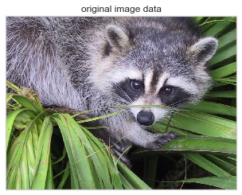


```python
# 각 채널 별(RGB값, 컬러) 이미지 시각화

plt.figure(figsize=(15,10))
for i in range(3):
    plt.subplot(1,3,i+1)
    plt.imshow(img_rgb[:,:,i],cmap=plt.cm.gray)
    plt.grid(False)
    plt.xticks([])
    plt.yticks([])
    plt.title("{} channel".format(i+1))
plt.show()
```


# 2. Matrix Calculation

```
1. A, B, C 세 회사의 주식은 각각 100만원, 80만원, 50만원이다. 이 주식을 각각 3주, 4주, 5주를 매수할 때 필요한 금액을 구하고자 한다.

(1) 주식의 가격과 수량을 각각  𝑝  벡터,  𝑛  벡터로 표시하고 넘파이로 코딩한다.

(2) 주식을 매수할 때 필요한 금액을 곱셈으로 표시하고 넘파이 연산으로 그 값을 계산한다.
```


```python
# 1.(1) 가격과 수량을 벡터로 표현

p = np.array([100,80,50])
n = np.array([3,4,5])
```


```python
# 1.(2) 주식 매수 금액을 곱셈으로 표현 + 넘파이 연산으로 매수금액 계산
# 결과 : 총 필요 매수금액 : 870만원

payment = p.T@n
payment
```


    870


2. 벡터  𝑥 의 평균 제거 벡터는 다음과 같이 계산함을 증명하라.

$$ 
\begin{align}
x - \dfrac{1}{N}\mathbf{1}_N^Tx \mathbf{1}^{}_N
\end{align}
$$


```python
Image('/Users/kimjeongseob/Desktop/Math/2. MML_code/image_김도형 연습문제 풀이/IMG_A8ABD7B550B6-1.jpeg')
```


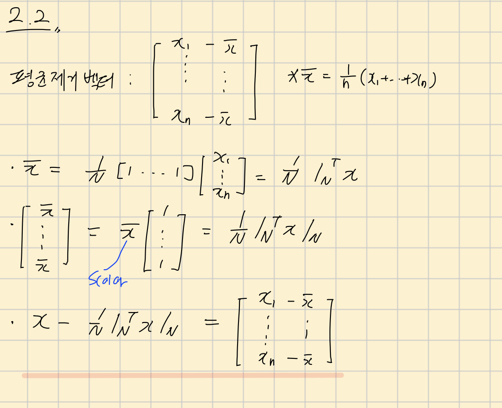


3. 다음 코드를 실행하면 MNIST 숫자 이미지 전체 데이터를 모두 벡터로 변환하여 하나의 넘파이 행렬 `X`를 만든다.
이 행렬을 이용하여 다음 문제를 풀어라.
```
from sklearn.datasets import load_digits
X = load_digits().data
```

(1) 내적을 이용하여 첫 번째 이미지와 10번째 이미지의 유사도를 구하라.

(2) 내적을 이용하여 모든 이미지의 조합에 대해 유사도를 구하라. 어떻게 구현하는 것이 효율적일까? (힌트 : 이 문제는 뒤에서 배울 행렬과 행렬의 곱셈을 이용한다.)


```python
Image('/Users/kimjeongseob/Desktop/Math/2. MML_code/image_김도형 연습문제 풀이/IMG_DD121B697835-1.jpeg')
```


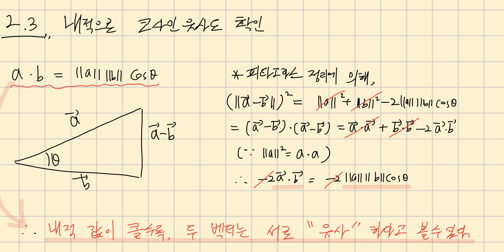


```python
from sklearn.datasets import load_digits
X = load_digits().data
img = load_digits()
```


```python
# 64 by 1 행벡터로 이미지 1,797개가 현재 X에 들어있음

X.shape
```


    (1797, 64)


```python
# (1) 내적을 이용하여 첫 번째 이미지와 10번째 이미지의 유사도를 구하라.

X[0]
```


    array([ 0.,  0.,  5., 13.,  9.,  1.,  0.,  0.,  0.,  0., 13., 15., 10.,
           15.,  5.,  0.,  0.,  3., 15.,  2.,  0., 11.,  8.,  0.,  0.,  4.,
           12.,  0.,  0.,  8.,  8.,  0.,  0.,  5.,  8.,  0.,  0.,  9.,  8.,
            0.,  0.,  4., 11.,  0.,  1., 12.,  7.,  0.,  0.,  2., 14.,  5.,
           10., 12.,  0.,  0.,  0.,  0.,  6., 13., 10.,  0.,  0.,  0.])


```python
X[9]
```


    array([ 0.,  0., 11., 12.,  0.,  0.,  0.,  0.,  0.,  2., 16., 16., 16.,
           13.,  0.,  0.,  0.,  3., 16., 12., 10., 14.,  0.,  0.,  0.,  1.,
           16.,  1., 12., 15.,  0.,  0.,  0.,  0., 13., 16.,  9., 15.,  2.,
            0.,  0.,  0.,  0.,  3.,  0.,  9., 11.,  0.,  0.,  0.,  0.,  0.,
            9., 15.,  4.,  0.,  0.,  0.,  9., 12., 13.,  3.,  0.,  0.])


```python
X[0].T@X[9]
```


    2807.0


```python
# (2) 내적을 이용하여 모든 이미지의 조합에 대해 유사도를 구하라. 
# 어떻게 구현하는 것이 효율적일까? : X@X.T

simil = X@X.T
simil
```


    array([[3070., 1866., 2264., ..., 2812., 3006., 2898.],
           [1866., 4209., 3432., ..., 3906., 3083., 3307.],
           [2264., 3432., 4388., ..., 4005., 3063., 3697.],
           ...,
           [2812., 3906., 4005., ..., 5092., 3729., 4598.],
           [3006., 3083., 3063., ..., 3729., 4316., 3850.],
           [2898., 3307., 3697., ..., 4598., 3850., 4938.]])


```python
sns.heatmap(X@X.T)
plt.show()
```


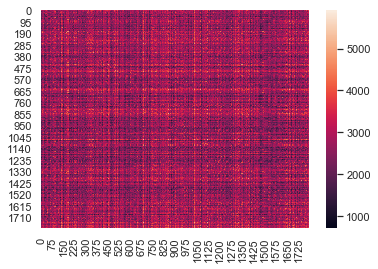


```python
# simil[0]의 내적값 탐색시작
# 만약 max값과 맞다면, 그때의 index출력 -> index+1 이미지가 가장 내적값이 높은 것

for i in range(len(simil[0])):
    if simil[0][i] == simil[0].max():
        print("{}번째 image가 가장 1번째 이미지와 코사인유사도가 높다.".format(i+1))
```

    161번째 image가 가장 1번째 이미지와 코사인유사도가 높다.


```python
# 실제 내적값이 높은 데이터 간 유사한가? 0 vs 8, 0 vs 1 의 내적값 비교를 통해 확인
# 만약, 내적 값에 따라 유사한지를 판단할 수 있으려면, 0 vs 8 내적값이 0 vs 1 내적값 보다는 커야할 것
```


```python
plt.imshow(img.images[0],cmap=plt.cm.bone_r)
```


    <matplotlib.image.AxesImage at 0x1a2447f5d0>


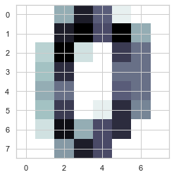


```python
plt.imshow(img.images[1],cmap=plt.cm.bone_r)
```


    <matplotlib.image.AxesImage at 0x1a225e9490>


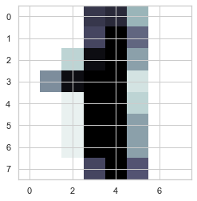


```python
plt.imshow(img.images[8],cmap=plt.cm.bone_r)
```


    <matplotlib.image.AxesImage at 0x1a24614390>


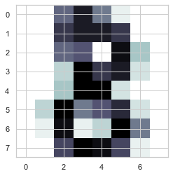


```python
_0 = img.images[0].reshape(64,-1)
_1 = img.images[1].reshape(64,-1)
_8 = img.images[8].reshape(64,-1)
```


```python
_0.T@_1
```


    array([[1866.]])


```python
# 결과, 1보다는 8과의 0의 내적값이 큰 것으로 보아, 어느정도 내적값을 통한 코사인유사도 근사가 일단은 유의미하게는 보임

_0.T@_8
```


    array([[2783.]])


```python
# 실제 코사인 유사도 계산 결과, 0은 1보다는 8과 유사한 것을 확인할 수 있음

((_0.T@_1)/(np.linalg.norm(_0)*np.linalg.norm(_1)))[0][0]
```


    0.5191023426414686


```python
((_0.T@_8)/(np.linalg.norm(_0)*np.linalg.norm(_8)))[0][0]
```


    0.7515122122359871


4. 벡터의 선형조합 : 두 이미지를 섞어놓는 morphing 효과 가능

    - olivetti faces data 활용 


```python
from sklearn.datasets import fetch_olivetti_faces
```


```python
img = fetch_olivetti_faces()
```


```python
# 64 by 64 image로 400장 존재

img.images.shape
```


    (400, 64, 64)


```python
plt.imshow(img.images[0],cmap=plt.cm.bone)
plt.grid(False)
plt.xticks([]);plt.yticks([])
plt.title("{} images".format(1),fontsize=30)
plt.show()
```


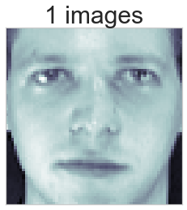


```python
plt.imshow(img.images[10],cmap=plt.cm.bone)
plt.grid(False)
plt.xticks([]);plt.yticks([])
plt.title("{} images".format(2),fontsize=30)
plt.show()
```


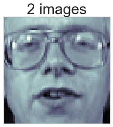


* morphing : 선형 조합을 통한 새로운 face image 조합
$$ 0.5image1 + 0.5image2$$


```python
new_f = 0.5*img.images[0] + 0.5*img.images[10]
plt.imshow(new_f,cmap=plt.cm.bone)
plt.grid(False)
plt.xticks([]);plt.yticks([])
plt.title("$ 0.5image1 + 0.5image2$",fontsize=30)
plt.show()
```


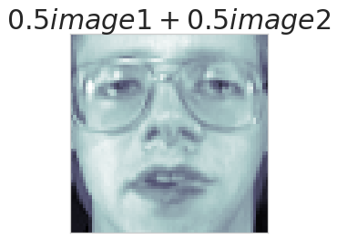


```python
f, ax = plt.subplots(1,3)

ax[0].imshow(img.images[0],cmap=plt.cm.bone)
ax[0].grid(False)
ax[0].set_xticks([]);ax[0].set_yticks([])
ax[0].set_title("1 images",fontsize=15)

ax[1].imshow(img.images[10],cmap=plt.cm.bone)
ax[1].grid(False)
ax[1].set_xticks([]);ax[1].set_yticks([])
ax[1].set_title("2 images",fontsize=15)

new_f = 0.5*img.images[0] + 0.5*img.images[10]
ax[2].imshow(new_f,cmap=plt.cm.bone)
ax[2].grid(False)
ax[2].set_xticks([]);ax[2].set_yticks([])
ax[2].set_title("$ 0.5image1 + 0.5image2$",fontsize=15)

plt.show()
```


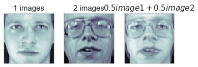

