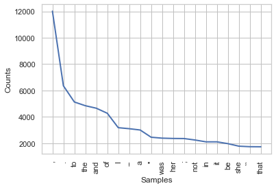
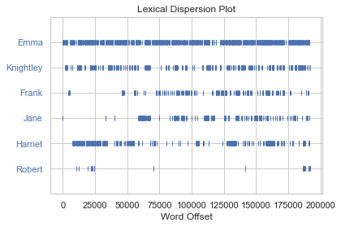
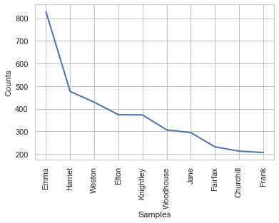
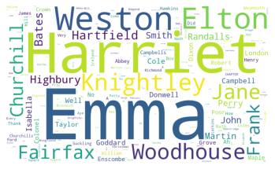
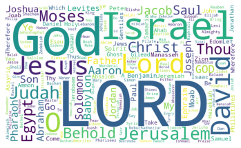

# 03.01.01 NLTK 자연어 처리 패키지

## 1. NLTK 패키지 설치
## 2. 샘플 말뭉치 다운로드
    - book, movie_reviews, punkt, stopwords


```python
import nltk
nltk.download("book")
nltk.download("movie_reviews")
nltk.download("punkt")
nltk.download("stopwords")
```

## 2-1. 구텐베르크 샘플 말뭉치 목록


```python
nltk.corpus.gutenberg.fileids()
```


    ['austen-emma.txt',
     'austen-persuasion.txt',
     'austen-sense.txt',
     'bible-kjv.txt',
     'blake-poems.txt',
     'bryant-stories.txt',
     'burgess-busterbrown.txt',
     'carroll-alice.txt',
     'chesterton-ball.txt',
     'chesterton-brown.txt',
     'chesterton-thursday.txt',
     'edgeworth-parents.txt',
     'melville-moby_dick.txt',
     'milton-paradise.txt',
     'shakespeare-caesar.txt',
     'shakespeare-hamlet.txt',
     'shakespeare-macbeth.txt',
     'whitman-leaves.txt']


## 2-2. 제인오스틴 - 엠마 말뭉치


```python
emma_raw = nltk.corpus.gutenberg.raw("austen-emma.txt")
print(emma_raw[:702])
```

    [Emma by Jane Austen 1816]
    
    VOLUME I
    
    CHAPTER I
    
    
    Emma Woodhouse, handsome, clever, and rich, with a comfortable home
    and happy disposition, seemed to unite some of the best blessings
    of existence; and had lived nearly twenty-one years in the world
    with very little to distress or vex her.
    
    She was the youngest of the two daughters of a most affectionate,
    indulgent father; and had, in consequence of her sister's marriage,
    been mistress of his house from a very early period.  Her mother
    had died too long ago for her to have more than an indistinct
    remembrance of her caresses; and her place had been supplied
    by an excellent woman as governess, who had fallen little short
    of a mother in affection.


## 3. 토큰화
    
    - 말뭉치(텍스트 데이터)를 "토큰"이라 불리는 작은 단위로 나누는 행위
    
    - 영어 : '단어'를 토큰으로 사용하는 경우가 일반적
    ex) I am a boy. = I + am + a + boy + .
    
    - 한국어 : 의미가 같은 정규화된 형태소
    ex) 나는 소년이다. = 나 + 는 + 소년 + 이 + 다 + .
    
    
    - 정규화 : 의미와 쓰임이 같은 단어를 같은 토큰으로 표시
    am I a boy? / Am I a boy? 의 'am'과 'Am' 은 같은 토큰
    I am / He is / you are ==>> am is are 는 be 라는 토큰으로 표시
    fly -> fly/v , fly/n ==>> 파리, 날다 라는 것 구분해서 토큰화
    
        1) 대소문자 통합
        2) 어간 추출
        3) 표제어 추출
        4) 품사 부착
        5) 불용어
        
        
        
     - 어간 추출(stemming) : 실제 의미는 같지만, 형태만 다른 경우, 어간과 접사 구분 후 접사 삭제 or 교체
         어간(stem) : 단어의 의미를 담고 있는 핵심 부분
         접사(affix) : 단어에 부가적인 의미를 주는 부분
         
         단순 알고리즘 사용 : PORTER 알고리즘, lancaster 알고리즘
             *사실, 표제어추출 알고리즘을 적용해야 정확하지만, 이는 복잡, 어려워서 일단 부정확하더라도 stemming으로
     we fly
     she flies  ==>> fly가 어간 ==>> fl 이라는 어간이 남음
     she flew 
     
     
     
     - 표제어추출(lemmatization) : wordnet (사전정보) 사용
     
     
     - 품사부착
        품사 = part of speech, POS : 명사, 동사, 형용사, 부사 ...
        동일한 철자 but, 다른 의미 => 다른 토큰화 필요
        ex) permit : 허가하다, 허가증 => 서로 다른 토큰화 필요
   
   
     - 불용어 (stopwords)
         : 분석의 필요성이 없는 단어. 모든 문서에 너무 자주 쓰이는 단어. 너무 드물게 나타나는 단어.
         ex) 관사(a, the, an), 조사(은,는,이,가, ~다)

## 3-1. 토큰화 실습

### 1) 토큰화

    - word_tokenize


```python
# emma_raw 의 일부 데이터 추출
sent = emma_raw[50:196]
print(sent)
```

    Emma Woodhouse, handsome, clever, and rich, with a comfortable home
    and happy disposition, seemed to unite some of the best blessings
    of existence


```python
# word_tokenize 메서드 적용
from nltk.tokenize import word_tokenize
word_tokenize(sent)
```


    ['Emma',
     'Woodhouse',
     ',',
     'handsome',
     ',',
     'clever',
     ',',
     'and',
     'rich',
     ',',
     'with',
     'a',
     'comfortable',
     'home',
     'and',
     'happy',
     'disposition',
     ',',
     'seemed',
     'to',
     'unite',
     'some',
     'of',
     'the',
     'best',
     'blessings',
     'of',
     'existence']


### 2) 어간추출 (stemming)

    - PorterStemmerLancasterStemmer


```python
from nltk import PorterStemmer, LancasterStemmer

st1 = PorterStemmer()
st2 = LancasterStemmer()

words = ["fly", "flies", "flying", "flew", "flown"]

print("Porter Stemmer   :", [st1.stem(w) for w in words])
print("Lancaster Stemmer:", [st2.stem(w) for w in words])
```

    Porter Stemmer   : ['fli', 'fli', 'fli', 'flew', 'flown']
    Lancaster Stemmer: ['fly', 'fli', 'fly', 'flew', 'flown']


### 3) 표제어추출 (lemmatizer)

    - WordNetLemmatizer


```python
from nltk.stem import WordNetLemmatizer

lm = WordNetLemmatizer()

[lm.lemmatize(w, pos="v") for w in words]    #pos 아규먼트 : 동사, 형용사 등 품사 명시 (v=동사)
```


    ['fly', 'fly', 'fly', 'fly', 'fly']


### 4) 품사 부착

    - 앞뒤의 문맥을 보며, 품사가 무엇인지 태깅해주는 것
    - pos_tag
    
    NNP: 단수 고유명사
    VB: 동사
    VBP: 동사 현재형
    TO: to 전치사
    NN: 명사(단수형 혹은 집합형)
    DT: 관형사


```python
from nltk.tag import pos_tag
sentence = "Emma refused to permit us to obtain the refuse permit"
tagged_list = pos_tag(word_tokenize(sentence))
tagged_list
```


    [('Emma', 'NNP'),
     ('refused', 'VBD'),
     ('to', 'TO'),
     ('permit', 'VB'),
     ('us', 'PRP'),
     ('to', 'TO'),
     ('obtain', 'VB'),
     ('the', 'DT'),
     ('refuse', 'NN'),
     ('permit', 'NN')]


### 5) tokenizer

    - pos_tag 된 상태로 토큰을 아예 만들어버림


```python
def tokenizer(doc):
    return ["/".join(p) for p in tagged_list]

tokenizer(sentence)
```


    ['Emma/NNP',
     'refused/VBD',
     'to/TO',
     'permit/VB',
     'us/PRP',
     'to/TO',
     'obtain/VB',
     'the/DT',
     'refuse/NN',
     'permit/NN']


## 4. NLTK 빈도분석

    2가지 클래스 사용
        1) Text 클래스
        2) FreqDist 클래스

### 4-1) Text 클래스

    - plot : 단어 빈도 그래프
    - dispersion_plot : 단어 위치 그래프
    - concordance : 단어 문맥 인쇄
    - similar : 유사 단어 인쇄
    - plot : 빈도 그래프

**step1) class 객체 생성**


```python
from nltk import Text

text = Text(word_tokenize(emma_raw))
text
```


    <Text: Emma by Jane Austen 1816>


**step2) 단어 빈도 그래프**


```python
# 가장 많이 사용되는 20개 단어의 빈도 그래프

text.plot(20)
```





**step3) 단어 위치**


```python
# 전체 스토리 중, 어느 위치 쯤 등장하는 지 확인 가능
# 소설 전체가 20만 단어로 이루어짐(, ! . 등 포함)
# Emma는 주인공이니, 전반적으로 지속적으로 등장함을 확인 가능

text.dispersion_plot(['Emma','Knightley','Frank','Jane','Harriet','Robert'])
```





**step4) 문맥 인쇄**

    문맥 : 지정한 단어 앞, 뒤에 사용된 단어
    concordance 메서드
    


```python
text.concordance('Emma')
```

    Displaying 25 of 855 matches:
    [ Emma by Jane Austen 1816 ] VOLUME I CHAPT
    ane Austen 1816 ] VOLUME I CHAPTER I Emma Woodhouse , handsome , clever , and 
    both daughters , but particularly of Emma . Between _them_ it was more the int
     friend very mutually attached , and Emma doing just what she liked ; highly e
    r own . The real evils , indeed , of Emma 's situation were the power of havin
    ding-day of this beloved friend that Emma first sat in mournful thought of any
    ing only half a mile from them ; but Emma was aware that great must be the dif
    y . It was a melancholy change ; and Emma could not but sigh over it , and wis
     the rest of her life at Hartfield . Emma smiled and chatted as cheerfully as 
    able to tell her how we all are . '' Emma spared no exertions to maintain this
     ' I have a great regard for you and Emma ; but when it comes to the question 
    ful , troublesome creature ! '' said Emma playfully . `` That is what you have
    e few people who could see faults in Emma Woodhouse , and the only one who eve
    is was not particularly agreeable to Emma herself , she knew it would be so mu
    g thought perfect by every body . `` Emma knows I never flatter her , '' said 
    t be a gainer . '' `` Well , '' said Emma , willing to let it pass -- '' you w
    re of meeting every day . '' `` Dear Emma bears every thing so well , '' said 
    ss her more than she thinks for . '' Emma turned away her head , divided betwe
    nd smiles . `` It is impossible that Emma should not miss such a companion , '
    en one matter of joy to me , '' said Emma , '' and a very considerable one -- 
    od to them , by interference . '' `` Emma never thinks of herself , if she can
    etter thing . Invite him to dinner , Emma , and help him to the best of the fi
     could not think , without pain , of Emma 's losing a single pleasure , or suf
     of her companionableness : but dear Emma was of no feeble character ; she was
    , was so just and so apparent , that Emma , well as she knew her father , was 


**step5) 유사단어 검색**

    지정한 단어의 문맥(앞과 뒤 단어)이 같은 단어를 출력
    similar 메서드
    


```python
# Emma 라는 단어와 문맥이 같은 단어 중, 가장 같은 단어 출력

text.similar('Emma',1)
```

    she


**step6) 공통 문맥 인쇄**

    지정한 2개 단어의 공통 문맥 인쇄
    common_contexts
    


```python
# 분석 결과, 'but emma was' 또는 'but she was'라는 문맥이 제일 많이 사용되었음

text.common_contexts(['Emma','She'],1)
```

    but_was


### 4-2) FreqDist 클래스

    - 문서에 사용된 토큰(단어)의 빈도수 출력
    - Text 클래스의 vocab 메서드
    - 토큰리스트를 넣어서 직접 만들 수 있음
    
        - N : 빈도(횟수)
        - freq : 빈도(%)
        - most_common : 최빈 단어
        - plot : 최빈 단어 플롯

**step1) FreqDist 클래스를 Text 클래스에서 생성**


```python
fd = text.vocab()
type(fd)
```


    nltk.probability.FreqDist


**step2) FreqDist클래스를 토큰 리스트 에서 생성**

    - Emma 말뭉치 -> 사람의 이름만 모아 FreqDist 클래스 객체 생성
    - NNP이면서, 실질적으로는 사람의 이름이 아닌 것은 제외


```python
from nltk import FreqDist
```


```python
stopwords = ["Mr","Mrs","Miss","Mr.","Mrs.","Dear"]
emma_tokens = pos_tag(word_tokenize(emma_raw))
name_list = [t[0] for t in emma_tokens if t[1] == 'NNP' and t[0] not in stopwords]
fd_name = FreqDist(name_list)
fd_name
```


    FreqDist({'Emma': 829, 'Harriet': 477, 'Weston': 429, 'Elton': 374, 'Knightley': 373, 'Woodhouse': 307, 'Jane': 295, 'Fairfax': 232, 'Churchill': 213, 'Frank': 207, ...})


**step3) 단어 빈도 분석**

    - FreqDist 클래스 : 전체 단어수, 특정 단어 출현 횟수/확률 계산 가능


```python
fd_name.N(), fd_name['Emma'], fd_name.freq('Emma')
```


    (6924, 829, 0.11972848064702483)


```python
fd_name.most_common(5)
```


    [('Emma', 829),
     ('Harriet', 477),
     ('Weston', 429),
     ('Elton', 374),
     ('Knightley', 373)]


```python
fd_name.plot(10)
```





    <matplotlib.axes._subplots.AxesSubplot at 0x141550490>


## 5. 워드 클라우드


```python
from wordcloud import WordCloud

wc = WordCloud(width=1000, height=600, background_color="white", random_state = 0)
plt.imshow(wc.generate_from_frequencies(fd_name))
plt.axis('off')
plt.show()
```





## 예제 : 소설 등장인물 이름 워드클라우드 제작

    - gutenberg corpus 중, "bible-kjv.txt" 제작


```python
# 1. corpus 다운로드

bible_raw = nltk.corpus.gutenberg.raw("bible-kjv.txt")

# # 2. 토큰화 및 포스 태깅

# bible = pos_tag(word_tokenize(bible_raw))

# def tokenizer(doc):
#     return ["/".join(p) for p in doc]

# tokenizer(bible)

# # 3. Text 클래스 객체 생성

# text_bible = Text(word_tokenize(bible_raw))

# # 4. FreqDist 클래스 객체 생성

# fd = text_bible.vocab()
# type(fd)
```


```python
# 5. 토큰 리스트 생성
stopwords = ["Mr","Mrs","Miss","Mr.","Mrs.","Dear"]
bible_tokens = pos_tag(word_tokenize(bible_raw))

# 6. 이름 리스트 생성
name_list = [name[0] for name in bible_tokens if name[1]=='NNP' and name[0] not in stopwords]
```


```python
# 7. FreqDist 클래스 객체 생성
fd_name = FreqDist(name_list)

# 8. 워드클라우드 생성
wc = WordCloud(width=1000, height=600, background_color="white", random_state = 0)
plt.imshow(wc.generate_from_frequencies(fd_name))
plt.axis('off')
plt.show()
```




