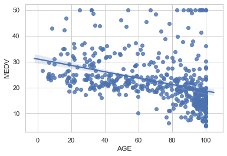
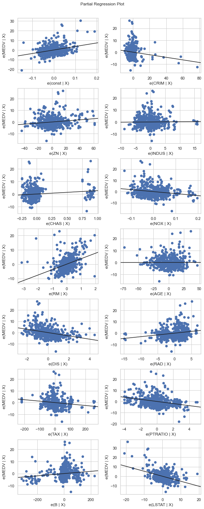
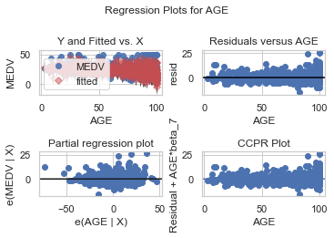

# 04.05 부분회귀

    - 각 독립변수의 순수한 종속변수와의 상관관계를 탐색

## 1. 부분회귀 플롯
    
    - 독립변수의 갯수가 많을 때 특정한 하나의 독립변수의 영향력을 시각화하는 방법이 부분회귀 플롯(Partial Regression Plot)
    - 보스턴 집값 데이터 예제


```python
from sklearn.datasets import load_boston
import statsmodels.api as sm

boston = load_boston()
dfX0 = pd.DataFrame(boston.data,columns = boston.feature_names)
dfx = sm.add_constant(dfX0)
dfy = pd.DataFrame(boston.target,columns = ['MEDV'])

df = pd.concat([dfx,dfy],axis=1)
df
```


<div>
<style scoped>
    .dataframe tbody tr th:only-of-type {
        vertical-align: middle;
    }

    .dataframe tbody tr th {
        vertical-align: top;
    }

    .dataframe thead th {
        text-align: right;
    }
</style>
<table border="1" class="dataframe">
  <thead>
    <tr style="text-align: right;">
      <th></th>
      <th>const</th>
      <th>CRIM</th>
      <th>ZN</th>
      <th>INDUS</th>
      <th>CHAS</th>
      <th>NOX</th>
      <th>RM</th>
      <th>AGE</th>
      <th>DIS</th>
      <th>RAD</th>
      <th>TAX</th>
      <th>PTRATIO</th>
      <th>B</th>
      <th>LSTAT</th>
      <th>MEDV</th>
    </tr>
  </thead>
  <tbody>
    <tr>
      <th>0</th>
      <td>1.0</td>
      <td>0.00632</td>
      <td>18.0</td>
      <td>2.31</td>
      <td>0.0</td>
      <td>0.538</td>
      <td>6.575</td>
      <td>65.2</td>
      <td>4.0900</td>
      <td>1.0</td>
      <td>296.0</td>
      <td>15.3</td>
      <td>396.90</td>
      <td>4.98</td>
      <td>24.0</td>
    </tr>
    <tr>
      <th>1</th>
      <td>1.0</td>
      <td>0.02731</td>
      <td>0.0</td>
      <td>7.07</td>
      <td>0.0</td>
      <td>0.469</td>
      <td>6.421</td>
      <td>78.9</td>
      <td>4.9671</td>
      <td>2.0</td>
      <td>242.0</td>
      <td>17.8</td>
      <td>396.90</td>
      <td>9.14</td>
      <td>21.6</td>
    </tr>
    <tr>
      <th>2</th>
      <td>1.0</td>
      <td>0.02729</td>
      <td>0.0</td>
      <td>7.07</td>
      <td>0.0</td>
      <td>0.469</td>
      <td>7.185</td>
      <td>61.1</td>
      <td>4.9671</td>
      <td>2.0</td>
      <td>242.0</td>
      <td>17.8</td>
      <td>392.83</td>
      <td>4.03</td>
      <td>34.7</td>
    </tr>
    <tr>
      <th>3</th>
      <td>1.0</td>
      <td>0.03237</td>
      <td>0.0</td>
      <td>2.18</td>
      <td>0.0</td>
      <td>0.458</td>
      <td>6.998</td>
      <td>45.8</td>
      <td>6.0622</td>
      <td>3.0</td>
      <td>222.0</td>
      <td>18.7</td>
      <td>394.63</td>
      <td>2.94</td>
      <td>33.4</td>
    </tr>
    <tr>
      <th>4</th>
      <td>1.0</td>
      <td>0.06905</td>
      <td>0.0</td>
      <td>2.18</td>
      <td>0.0</td>
      <td>0.458</td>
      <td>7.147</td>
      <td>54.2</td>
      <td>6.0622</td>
      <td>3.0</td>
      <td>222.0</td>
      <td>18.7</td>
      <td>396.90</td>
      <td>5.33</td>
      <td>36.2</td>
    </tr>
    <tr>
      <th>...</th>
      <td>...</td>
      <td>...</td>
      <td>...</td>
      <td>...</td>
      <td>...</td>
      <td>...</td>
      <td>...</td>
      <td>...</td>
      <td>...</td>
      <td>...</td>
      <td>...</td>
      <td>...</td>
      <td>...</td>
      <td>...</td>
      <td>...</td>
    </tr>
    <tr>
      <th>501</th>
      <td>1.0</td>
      <td>0.06263</td>
      <td>0.0</td>
      <td>11.93</td>
      <td>0.0</td>
      <td>0.573</td>
      <td>6.593</td>
      <td>69.1</td>
      <td>2.4786</td>
      <td>1.0</td>
      <td>273.0</td>
      <td>21.0</td>
      <td>391.99</td>
      <td>9.67</td>
      <td>22.4</td>
    </tr>
    <tr>
      <th>502</th>
      <td>1.0</td>
      <td>0.04527</td>
      <td>0.0</td>
      <td>11.93</td>
      <td>0.0</td>
      <td>0.573</td>
      <td>6.120</td>
      <td>76.7</td>
      <td>2.2875</td>
      <td>1.0</td>
      <td>273.0</td>
      <td>21.0</td>
      <td>396.90</td>
      <td>9.08</td>
      <td>20.6</td>
    </tr>
    <tr>
      <th>503</th>
      <td>1.0</td>
      <td>0.06076</td>
      <td>0.0</td>
      <td>11.93</td>
      <td>0.0</td>
      <td>0.573</td>
      <td>6.976</td>
      <td>91.0</td>
      <td>2.1675</td>
      <td>1.0</td>
      <td>273.0</td>
      <td>21.0</td>
      <td>396.90</td>
      <td>5.64</td>
      <td>23.9</td>
    </tr>
    <tr>
      <th>504</th>
      <td>1.0</td>
      <td>0.10959</td>
      <td>0.0</td>
      <td>11.93</td>
      <td>0.0</td>
      <td>0.573</td>
      <td>6.794</td>
      <td>89.3</td>
      <td>2.3889</td>
      <td>1.0</td>
      <td>273.0</td>
      <td>21.0</td>
      <td>393.45</td>
      <td>6.48</td>
      <td>22.0</td>
    </tr>
    <tr>
      <th>505</th>
      <td>1.0</td>
      <td>0.04741</td>
      <td>0.0</td>
      <td>11.93</td>
      <td>0.0</td>
      <td>0.573</td>
      <td>6.030</td>
      <td>80.8</td>
      <td>2.5050</td>
      <td>1.0</td>
      <td>273.0</td>
      <td>21.0</td>
      <td>396.90</td>
      <td>7.88</td>
      <td>11.9</td>
    </tr>
  </tbody>
</table>
<p>506 rows × 15 columns</p>
</div>


```python
model = sm.OLS(dfy,dfx)
result3 = model.fit()
```

**age - 집값 간 스캐터플롯**


```python
sns.regplot(x = "AGE", y = "MEDV", data = df)

# 마치 역의 상관관계가 있어 보인다.
```


    <matplotlib.axes._subplots.AxesSubplot at 0x12718e9d0>





**age - 집값 간 부분회귀 플롯**


```python
others = list(set(df.columns).difference(set(['MEDV','AGE'])))
p, resids = sm.graphics.plot_partregress('MEDV', 'AGE', others, data=df, obs_labels=False, ret_coords=True)
plt.show()

# 부분회귀 플롯 분석 결과, AGE 와 종속변수 간에는 상관관계가 없는 것으로 확인됨
```


**각 독립변수 - 집값 간 부분회귀 플롯**


```python
fig = plt.figure(figsize=(8, 20))
sm.graphics.plot_partregress_grid(result3,fig=fig)
```





**age - 집값 간 부분회귀 결과 : plot_regress_exog**


```python
fig = sm.graphics.plot_regress_exog(result3, "AGE")
plt.tight_layout(pad=4, h_pad=0.5, w_pad=0.5)
plt.show()
```




