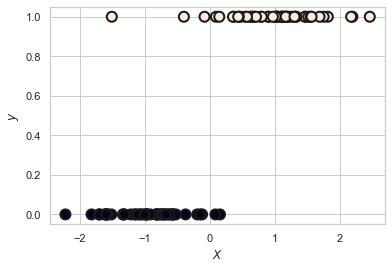
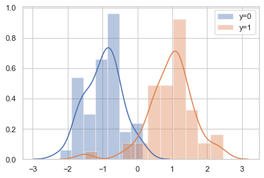
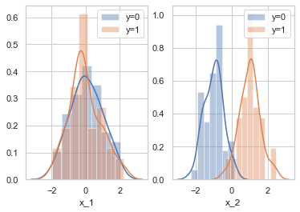
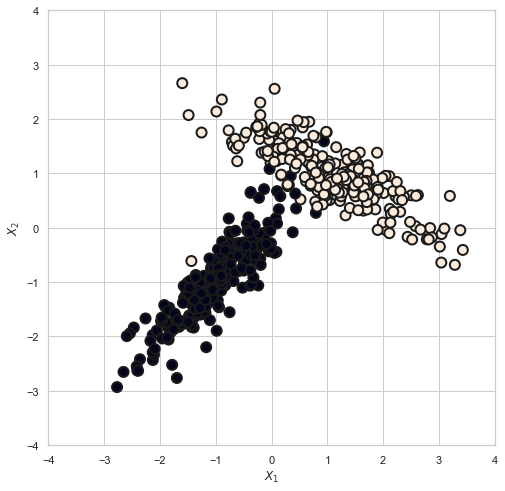
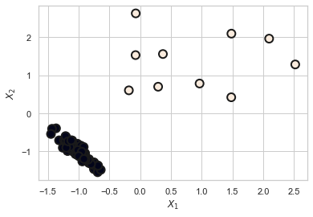
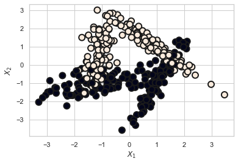
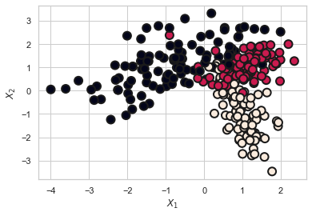
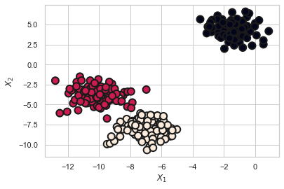
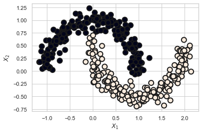
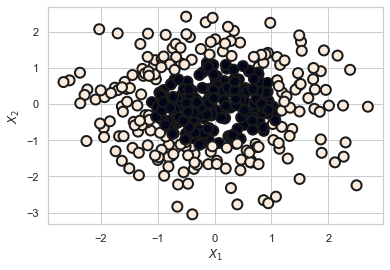

# 05.02 분류용 가상 데이터 생성


# make_classification 함수

```
make_classification


make_classification함수는 설정에 따른 분류용 가상 데이터를 생성하는 명령이다. 이 함수의 인수와 반환값은 다음과 같다.

인수:

n_samples : 표본 데이터의 수, 디폴트 100
n_features : 독립 변수의 수, 디폴트 20
n_informative : 독립 변수 중 종속 변수와 상관 관계가 있는 성분의 수, 디폴트 2
n_redundant : 독립 변수 중 다른 독립 변수의 선형 조합으로 나타나는 성분의 수, 디폴트 2
n_repeated : 독립 변수 중 단순 중복된 성분의 수, 디폴트 0
n_classes : 종속 변수의 클래스 수, 디폴트 2
n_clusters_per_class : 클래스 당 클러스터의 수, 디폴트 2
weights : 각 클래스에 할당된 표본 수
random_state : 난수 발생 시드


반환값:

X : [n_samples, n_features] 크기의 배열
독립 변수
y : [n_samples] 크기의 배열
종속 변수

```

### 1 . 독립변수 1개, 클래스 2개


```python
from sklearn.datasets import make_classification

X, y = make_classification(n_features=1, n_informative=1,
                           n_redundant=0, n_clusters_per_class=1, random_state=4)
plt.scatter(X, y, marker='o', c=y,
            s=100, edgecolor="k", linewidth=2)

plt.xlabel("$X$")
plt.ylabel("$y$")
plt.show()
```





```python
sns.distplot(X[y == 0], label="y=0")
sns.distplot(X[y == 1], label="y=1")
plt.legend()
plt.show()
```





### 2 . 독립변수 2개, 클래스 2개, 1개 독립변수만 종속변수와 상관


```python
X, y = make_classification(n_features=2, n_informative=1, n_redundant=0,
                           n_clusters_per_class=1, random_state=4)
plt.scatter(X[:, 0], X[:, 1], marker='o', c=y,
            s=100, edgecolor="k", linewidth=2)

plt.xlabel("$X_1$")
plt.ylabel("$X_2$")
plt.show()
```


```python
plt.subplot(121)
sns.distplot(X[y == 0, 0], label="y=0")
sns.distplot(X[y == 1, 0], label="y=1")
plt.legend()
plt.xlabel("x_1")
plt.subplot(122)
sns.distplot(X[y == 0, 1], label="y=0")
sns.distplot(X[y == 1, 1], label="y=1")
plt.legend()
plt.xlabel("x_2")
plt.show()
```





### 3. 독립변수 2개, 클래스 2개, 2개 독립변수만 종속변수와 상관


```python
plt.figure(figsize=(8, 8))
X, y = make_classification(n_samples=500, n_features=2, n_informative=2, n_redundant=0,
                           n_clusters_per_class=1, random_state=6)
plt.scatter(X[:, 0], X[:, 1], marker='o', c=y,
            s=100, edgecolor="k", linewidth=2)

plt.xlim(-4, 4)
plt.ylim(-4, 4)
plt.xlabel("$X_1$")
plt.ylabel("$X_2$")
plt.show()
```





### 4. 독립변수 2개, 클래스 2개
    - 클래스 별 데이터 갯수 차이 : weights 인수


```python
X, y = make_classification(n_features=2, n_informative=2, n_redundant=0,
                           n_clusters_per_class=1, weights=[0.9, 0.1], random_state=6)
val, cnt = np.unique(y, return_counts=True)
print("각 클래스별 데이터의 갯수 - {} 클래스 : {}, {} 클래스 : {}".format(val[0], cnt[0], val[1], cnt[1]))

plt.scatter(X[:, 0], X[:, 1], marker='o', c=y,
            s=100, edgecolor="k", linewidth=2)
plt.xlabel("$X_1$")
plt.ylabel("$X_2$")
plt.show()
```

    각 클래스별 데이터의 갯수 - 0 클래스 : 90, 1 클래스 : 10





### 4. 독립변수 2개, 클래스 2개
    - 클래스 내 군집 2개 : n_cluster_per_class 인수


```python
X2, Y2 = make_classification(n_samples=400, n_features=2, n_informative=2, n_redundant=0,
                             n_clusters_per_class=2, random_state=0)
plt.scatter(X2[:, 0], X2[:, 1], marker='o', c=Y2,
            s=100, edgecolor="k", linewidth=2)

plt.xlabel("$X_1$")
plt.ylabel("$X_2$")
plt.show()
```





### 4. 독립변수 2개, 클래스 2개
    - 다중 클래스 : n_classes 인수


```python
X, y = make_classification(n_samples=300, n_features=2, n_informative=2, n_redundant=0,
                           n_clusters_per_class=1, n_classes=3, random_state=0)
plt.scatter(X[:, 0], X[:, 1], marker='o', c=y,
            s=100, edgecolor="k", linewidth=2)

plt.xlabel("$X_1$")
plt.ylabel("$X_2$")
plt.show()
```





# make_blobs 함수

    - 가우시안 정규분포 활용한 데이터 생성
    - 보통, 클러스터링 데이터 생성에 사용
    
```
인수:

n_samples : 표본 데이터의 수, 디폴트 100
n_features : 독립 변수의 수, 디폴트 20
centers : 생성할 클러스터의 수 혹은 중심, [n_centers, n_features] 크기의 배열. 디폴트 3
cluster_std: 클러스터의 표준 편차, 디폴트 1.0
center_box: 생성할 클러스터의 바운딩 박스(bounding box), 디폴트 (-10.0, 10.0))


반환값:

X : [n_samples, n_features] 크기의 배열
독립 변수
y : [n_samples] 크기의 배열
종속 변수
```


### 1. 3개의 클러스터링 생성


```python
from sklearn.datasets import make_blobs

X, y = make_blobs(n_samples=300, n_features=2, centers=3, random_state=1)
plt.scatter(X[:, 0], X[:, 1], marker='o', c=y, s=100,
            edgecolor="k", linewidth=2)
plt.xlabel("$X_1$")
plt.ylabel("$X_2$")
plt.show()
```





# make_moons 함수

    - 초승달 모양의 클러스터링 데이터 2개 생성
    - 직선으로 분류할 수 없는 데이터
    
```
인수:
n_samples : 표본 데이터의 수, 디폴트 100
noise: 잡음의 크기. 0이면 정확한 반원을 이룸

```


```python
from sklearn.datasets import make_moons

X, y = make_moons(n_samples=400, noise=0.1, random_state=0)
plt.scatter(X[:, 0], X[:, 1], marker='o', c=y, s=100,
            edgecolor="k", linewidth=2)
plt.xlabel("$X_1$")
plt.ylabel("$X_2$")
plt.show()
```





# make_gaussian_quantiles

    - 다변수 정규분포 표본 데이터 생성
    - 다변수 정규분포 : 기대값 중심으로 원형 등고선 클래스
    
    - 타원형 경계선으로 분류 가능
    
```
인수:

mean: 기댓값 벡터
cov: 공분산 행렬
n_samples : 표본 데이터의 수, 디폴트 100
n_features : 독립 변수의 수, 디폴트 20
n_classes : 클래스의 수


반환값:

X : [n_samples, n_features] 크기의 배열
독립 변수
y : [n_samples] 크기의 배열
종속 변수
```


```python
from sklearn.datasets import make_gaussian_quantiles

X, y = make_gaussian_quantiles(n_samples=400, n_features=2, n_classes=2, random_state=0)
plt.scatter(X[:, 0], X[:, 1], marker='o', c=y, s=100,
            edgecolor="k", linewidth=2)
plt.xlabel("$X_1$")
plt.ylabel("$X_2$")
plt.show()
```




