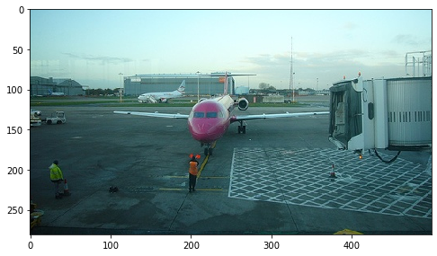
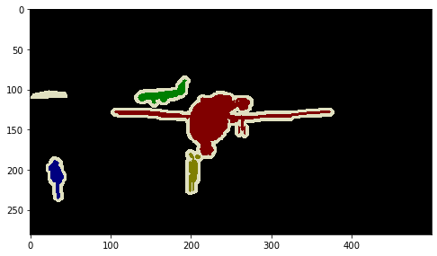
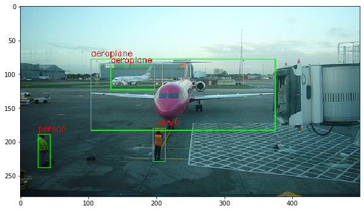

#### PASCAL VOC 2012 데이터 다운로드 받기


```python
# !wget http://host.robots.ox.ac.uk/pascal/VOC/voc2012/VOCtrainval_11-May-2012.tar
# !tar -xvf VOCtrainval_11-May-2012.tar -C ~/DLCV/data/voc
```


```python
# !ls ~/DLCV/data/voc/VOCdevkit/VOC2012
```


```python
# !ls ~/DLCV/data/voc/VOCdevkit/VOC2012/JPEGImages | head -n 5
```

#### JPEGImages 디렉토리에 있는 임의의 이미지 보기 


```python
import cv2
import matplotlib.pyplot as plt
%matplotlib inline

img = cv2.imread('../../data/voc/VOCdevkit/VOC2012/JPEGImages/2007_000032.jpg')
img_rgb = cv2.cvtColor(img, cv2.COLOR_BGR2RGB)
print('img shape:', img.shape)

plt.figure(figsize=(8, 8))
plt.imshow(img_rgb)
plt.show()

```

    
    Bad key "text.kerning_factor" on line 4 in
    /home/kimjeongseob/anaconda3/envs/tf113/lib/python3.6/site-packages/matplotlib/mpl-data/stylelib/_classic_test_patch.mplstyle.
    You probably need to get an updated matplotlibrc file from
    https://github.com/matplotlib/matplotlib/blob/v3.1.3/matplotlibrc.template
    or from the matplotlib source distribution


    img shape: (281, 500, 3)





#### Annotations 디렉토리에 있는 임의의 annotation 파일 보기


```python
!cat ~/DLCV/data/voc/VOCdevkit/VOC2012/Annotations/2007_000032.xml
```

    <annotation>
    	<folder>VOC2012</folder>
    	<filename>2007_000032.jpg</filename>
    	<source>
    		<database>The VOC2007 Database</database>
    		<annotation>PASCAL VOC2007</annotation>
    		<image>flickr</image>
    	</source>
    	<size>
    		<width>500</width>
    		<height>281</height>
    		<depth>3</depth>
    	</size>
    	<segmented>1</segmented>
    	<object>
    		<name>aeroplane</name>
    		<pose>Frontal</pose>
    		<truncated>0</truncated>
    		<difficult>0</difficult>
    		<bndbox>
    			<xmin>104</xmin>
    			<ymin>78</ymin>
    			<xmax>375</xmax>
    			<ymax>183</ymax>
    		</bndbox>
    	</object>
    	<object>
    		<name>aeroplane</name>
    		<pose>Left</pose>
    		<truncated>0</truncated>
    		<difficult>0</difficult>
    		<bndbox>
    			<xmin>133</xmin>
    			<ymin>88</ymin>
    			<xmax>197</xmax>
    			<ymax>123</ymax>
    		</bndbox>
    	</object>
    	<object>
    		<name>person</name>
    		<pose>Rear</pose>
    		<truncated>0</truncated>
    		<difficult>0</difficult>
    		<bndbox>
    			<xmin>195</xmin>
    			<ymin>180</ymin>
    			<xmax>213</xmax>
    			<ymax>229</ymax>
    		</bndbox>
    	</object>
    	<object>
    		<name>person</name>
    		<pose>Rear</pose>
    		<truncated>0</truncated>
    		<difficult>0</difficult>
    		<bndbox>
    			<xmin>26</xmin>
    			<ymin>189</ymin>
    			<xmax>44</xmax>
    			<ymax>238</ymax>
    		</bndbox>
    	</object>
    </annotation>


#### SegmentationObject 디렉토리에 있는 있는 임의의 maksing 이미지 보기 


```python
img = cv2.imread('../../data/voc/VOCdevkit/VOC2012/SegmentationObject/2007_000032.png')
img_rgb = cv2.cvtColor(img, cv2.COLOR_BGR2RGB)
print('img shape:', img.shape)

plt.figure(figsize=(8, 8))
plt.imshow(img_rgb)
plt.show()
```

    img shape: (281, 500, 3)





#### Annotation xml 파일에 있는 요소들을 파싱하여 접근하기

    - xmltodict 는 XML 파일을 parsing하여 Dictionary와 list형태로 변환해줌
    - xmltodict 설치 : conda install -c conda -forge xmltodict


```python
import xmltodict
```


```python
import os
import random

VOC_ROOT_DIR = os.path.join("../../data/voc/VOCdevkit/VOC2012/")
ANNO_DIR = os.path.join(VOC_ROOT_DIR,"Annotations")
JPEG_DIR = os.path.join(VOC_ROOT_DIR,"JPEGimages")
IMAGE_DIR = os.path.join(VOC_ROOT_DIR, "JPEGImages")

xml_files = os.listdir(ANNO_DIR)                       
print(xml_files[:5]); print(len(xml_files))
```

    ['2008_007279.xml', '2010_005972.xml', '2012_003581.xml', '2008_004452.xml', '2009_003508.xml']
    17125


```python
# !pip install lxml
import os
import xml.etree.ElementTree as ET

xml_file = os.path.join(ANNO_DIR, '2007_000032.xml')

# XML 파일을 Parsing 하여 Element 생성
tree = ET.parse(xml_file)
root = tree.getroot()

# image 관련 정보는 root의 자식으로 존재
image_name = root.find('filename').text
full_image_name = os.path.join(IMAGE_DIR, image_name)
image_size = root.find('size')
image_width = int(image_size.find('width').text)
image_height = int(image_size.find('height').text)

# 파일내에 있는 모든 object Element를 찾음.
objects_list = []
for obj in root.findall('object'):
    # object element의 자식 element에서 bndbox를 찾음. 
    xmlbox = obj.find('bndbox')
    # bndbox element의 자식 element에서 xmin,ymin,xmax,ymax를 찾고 이의 값(text)를 추출 
    x1 = int(xmlbox.find('xmin').text)
    y1 = int(xmlbox.find('ymin').text)
    x2 = int(xmlbox.find('xmax').text)
    y2 = int(xmlbox.find('ymax').text)
    
    bndbox_pos = (x1, y1, x2, y2)
    class_name=obj.find('name').text
    object_dict={'class_name': class_name, 'bndbox_pos':bndbox_pos}
    objects_list.append(object_dict)

print('full_image_name:', full_image_name,'\n', 'image_size:', (image_width, image_height))

for object in objects_list:
    print(object)

    
```

    full_image_name: ../../data/voc/VOCdevkit/VOC2012/JPEGImages/2007_000032.jpg 
     image_size: (500, 281)
    {'class_name': 'aeroplane', 'bndbox_pos': (104, 78, 375, 183)}
    {'class_name': 'aeroplane', 'bndbox_pos': (133, 88, 197, 123)}
    {'class_name': 'person', 'bndbox_pos': (195, 180, 213, 229)}
    {'class_name': 'person', 'bndbox_pos': (26, 189, 44, 238)}


#### Annotation내의 Object들의 bounding box 정보를 이용하여 Bounding box 시각화


```python
import cv2
import os
import xml.etree.ElementTree as ET

xml_file = os.path.join(ANNO_DIR, '2007_000032.xml')

tree = ET.parse(xml_file)
root = tree.getroot()

image_name = root.find('filename').text
full_image_name = os.path.join(IMAGE_DIR, image_name)

img = cv2.imread(full_image_name)
# opencv의 rectangle()는 인자로 들어온 이미지 배열에 그대로 사각형을 그려주므로 별도의 이미지 배열에 그림 작업 수행. 
draw_img = img.copy()
# OpenCV는 RGB가 아니라 BGR이므로 빨간색은 (0, 0, 255)
green_color=(0, 255, 0)
red_color=(0, 0, 255)

# 파일내에 있는 모든 object Element를 찾음.
objects_list = []
for obj in root.findall('object'):
    xmlbox = obj.find('bndbox')
    
    left = int(xmlbox.find('xmin').text)
    top = int(xmlbox.find('ymin').text)
    right = int(xmlbox.find('xmax').text)
    bottom = int(xmlbox.find('ymax').text)
    
    class_name=obj.find('name').text
    
    # draw_img 배열의 좌상단 우하단 좌표에 녹색으로 box 표시 
    # cv2.rectangle => left, top, right, bottom 은 integer 타입으로 들어가야 함
    cv2.rectangle(draw_img, (left, top), (right, bottom), color=green_color, thickness=1)
    # draw_img 배열의 좌상단 좌표에 빨간색으로 클래스명 표시
    cv2.putText(draw_img, class_name, (left, top - 5), cv2.FONT_HERSHEY_SIMPLEX, 0.4, red_color, thickness=1)

img_rgb = cv2.cvtColor(draw_img, cv2.COLOR_BGR2RGB)
plt.figure(figsize=(10, 10))
plt.imshow(img_rgb)
```


    <matplotlib.image.AxesImage at 0x7fa784035278>




