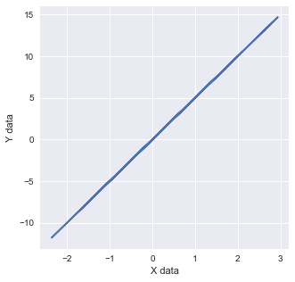
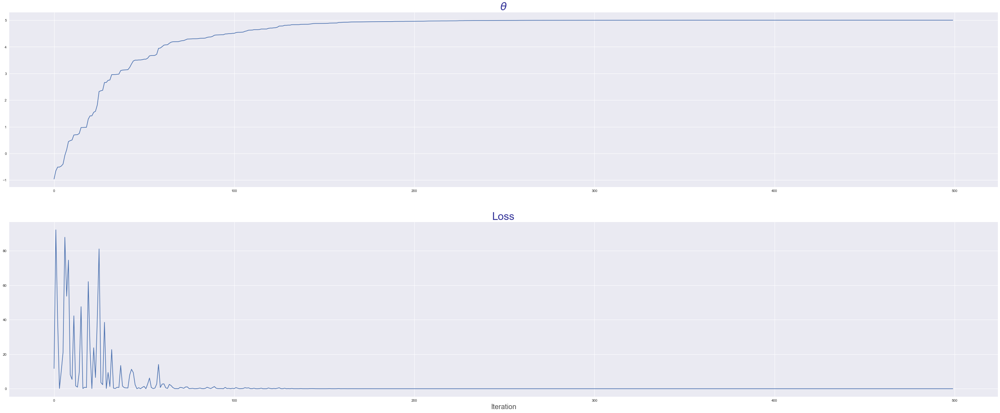
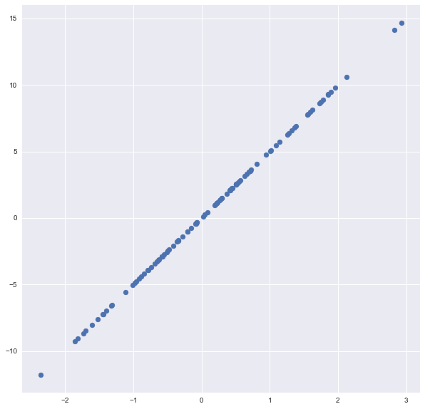
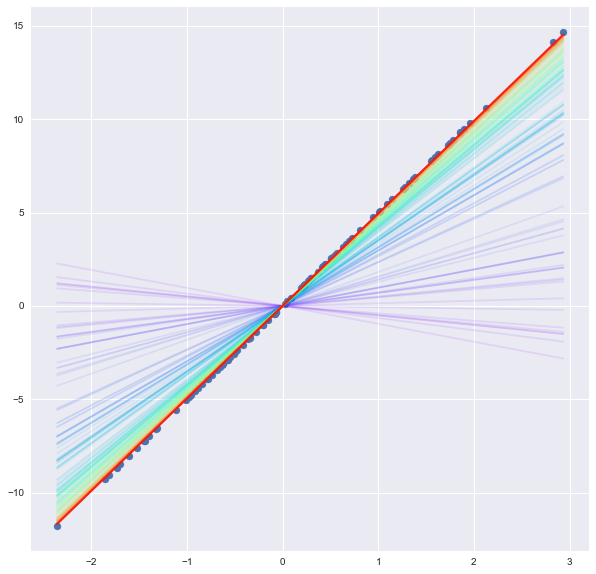

### 1. Dataset Preparation


```python
class dataset_generator:
    def __init__(self,feature_dim = 1,n_sample=100,noise=0):
        self._n_sample = n_sample
        self._noise = noise
        self._feature_dim = feature_dim
        
        self._coefficient = None
        self._init_set_coefficient()
        
    def _init_set_coefficient(self):
        self._coefficient = [1 for _ in range(self._feature_dim)] + [0]
        
    def set_n_sample(self,n_sample):
        self._n_sample = n_sample
        
    def set_noise(sefl,noise):
        self._noise = noise

    def set_coefficient(self,coefficient_list):
        self._coefficient = coefficient_list        
        
        
    def make_dataset(self):
        x_data = np.random.normal(0,1,size=(self._n_sample,self._feature_dim))
        
        y_data = np.zeros(shape=(self._n_sample,1))
        
        for feature_idx in range(self._feature_dim):
            # .reshape(-1,1) 을 붙이지 않으면, x_data가 (100,) 로 됨. 
            # .reshape(-1,1) 붙여서 (100,1)이 되어야 x_data에 broadcasting 가능
            y_data += self._coefficient[feature_idx]*x_data[:,feature_idx].reshape(-1,1)
            
        # bias 붙이기 (y_data에)
        y_data += self._coefficient[-1]
        # nosie 붙이기 (y_data에)
        y_data += self._noise * np.random.normal(0,1,size=(self._n_sample,1))
            
        return x_data,y_data
    
    
data_gen = dataset_generator(feature_dim=3)
data_gen.set_coefficient([2,-1,3,5])
x_data,y_data = data_gen.make_dataset()
print(x_data.shape,y_data.shape)
```

    (100, 3) (100, 1)


```python
class plus_node:
    def __init__(self):
        self._x, self._y = None, None
        self._z = None
        
    def forward(self,x,y):
        self._x, self._y = x, y
        self._z = self._x + self._y
        return self._z
    
    def backward(self,dz):
        return dz, dz
    
class minus_node:
    def __init__(self):
        self._x, self._y = None, None
        self._z = None
        
    def forward(self,x,y):
        self._x, self._y = x, y
        self._z = self._x - self._y
        return self._z
    
    def backward(self,dz):
        return dz, (-1)*dz
    
class mul_node:
    def __init__(self):
        self._x, self._y = None, None
        self._z = None
        
    def forward(self,x,y):
        self._x, self._y = x, y
        self._z = self._x * self._y
        return self._z
    
    def backward(self,dz):
        return dz*(self._y), dz*(self._x)
    
class square_node:
    def __init__(self):
        self._x = None
        self._z = None
        
    def forward(self,x):
        self._x = x
        self._z = self._x * self._x
        return self._z
    
    def backward(self,dz):
        return dz*2*self._x
    
class mean_node:
    def __init__(self):
        self._x = None
        self._z = None
        
    def forward(self,x):
        self._x = x
        self._z = np.mean(self._x)
        return self._z
    
    def backward(self,dz):
        dx = dz * (1/len(self._x)) * np.ones_like(self._x)
```


```python
dataset_gen = dataset_generator()
```


```python
# y = 5x + 0

dataset_gen.set_coefficient([5,0])
x_data, y_data = dataset_gen.make_dataset()
```


```python
%matplotlib inline

plt.figure(figsize=(5,5))
plt.xlabel("X data")
plt.ylabel("Y data")
plt.plot(x_data,y_data)
```


    [<matplotlib.lines.Line2D at 0x1a241559d0>]





### 2. Model implementation

mul -> minus -> square(= square loss)


```python
# model implementation : y = ax
node1 = mul_node()
```


```python
# sqaure error loss implementation
node2 = minus_node()
node3 = square_node()
```

### 3. Hyperparameter setting

- epochs, learning-rate, initial theta


```python
epochs = 5
lr = 0.01
th = -1
```


```python
loss_list = list()
th_list = list()
```

### 4. Learning Process


```python
for epoch in range(epochs):
    for data_idx in range(len(x_data)):
        x, y = x_data[data_idx], y_data[data_idx]
        
        z1 = node1.forward(th,x)
        z2 = node2.forward(y,z1)
        l = node3.forward(z2)
        
        dz2 = node3.backward(1)
        dy, dz1 = node2.backward(dz2)
        dth, dx = node1.backward(dz1) # dth = gradient
        
        th = th - lr*dth
        
        th_list.append(th)
        loss_list.append(l)
```

### 5. Result visualization


```python
fig, ax = plt.subplots(2,1, figsize=(50,20))
ax[0].plot(th_list)
ax[1].plot(loss_list)

title_font = {'size':30,'alpha':0.8,'color':'navy'}
label_font = {'size':20,'alpha':0.8}
plt.style.use('seaborn')

ax[0].set_title(r'$\theta$',fontdict=title_font)
ax[1].set_title('Loss',fontdict=title_font)
ax[1].set_xlabel('Iteration',fontdict=label_font)
```


    Text(0.5, 0, 'Iteration')





```python
import matplotlib.cm as cm

N_line = 200
cmap = cm.get_cmap('rainbow',lut = N_line)

for i in range(5):
    print(cmap(i))
```

    (0.5, 0.0, 1.0, 1.0)
    (0.4899497487437186, 0.015786242013636962, 0.9999688468941563, 1.0)
    (0.4798994974874372, 0.03156854976481053, 0.9998753895176573, 1.0)
    (0.46984924623115576, 0.04734298997155799, 0.9997196336934779, 1.0)
    (0.45979899497487436, 0.06310563131267365, 0.9995015891261738, 1.0)


```python
fig, ax = plt.subplots(1,1, figsize=(10,10))
ax.scatter(x_data,y_data)
```


    <matplotlib.collections.PathCollection at 0x1a243a7a50>





```python
%matplotlib inline

fig, ax = plt.subplots(1,1, figsize=(10,10))
ax.scatter(x_data,y_data)

# update되는 theta중 선두의 200개(N_line)만 선별
# plot할 x_range를 x_data의 최소 / 최대값으로 지정 -> 선을 plot할 때는 포인트 2개만 있으면 된다.
test_th = th_list[:N_line]
x_range = np.array([np.min(x_data),np.max(x_data)])

for line_idx in range(N_line):
    pred_line = np.array([x_range[0]*test_th[line_idx],
                         x_range[1]*test_th[line_idx]])
    ax.plot(x_range,pred_line,color=cmap(line_idx),alpha=0.1)
```




