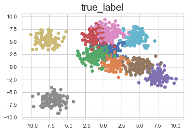
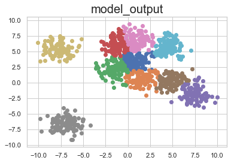

# 얕은 신경망을 이용한 다중 분류 문제


```python
import numpy as np
import matplotlib.pyplot as plt
```

## 함수 구현

### Sigmoid 함수
$sigmoid(x) = 1/(1+e^{-x})$


```python
def sigmoid(x):
    return 1/(1+np.exp(-1*x))
```


### Softmax 함수
$softmax(x)_i = e^{x_i}/\sum{e^{x_j}}$


```python
def softmax(x):
    e_x = np.exp(x)
    return e_x / np.sum(e_x)
```

## 네트워크 구조 정의


```python
# Define network architecture
class ShallowNN:
    def __init__(self,num_input,num_hidden,num_output):
        self.W_h = np.zeros((num_hidden,num_input),dtype = np.float32)
        self.b_h = np.zeros((num_input,),dtype = np.float32)
        self.W_o = np.zeros((num_output,num_hidden),dtype = np.float32)
        self.b_o = np.zeros((num_output,),dtype = np.float32)
    def __call__(self,x):
        h = sigmoid(np.matmul(self.W_h, x) + self.b_h)
        return softmax(np.matmul(self.W_o, h) + self.b_o)
```

## 데이터셋 가져오기, 정리하기


```python
# Import and organize dataset
dataset = np.load('ch2_dataset.npz')
inputs = dataset['inputs']
labels = dataset['labels']
```

## 모델 만들기


```python
# Create Model
model = ShallowNN(2,128,10)
```

## 사전에 학습된 파라미터 불러오기


```python
weights = np.load('ch2_parameters.npz')
model.W_h = weights['W_h']
model.b_h = weights['b_h']
model.W_o = weights['W_o']
model.b_o = weights['b_o']
```

## 모델 구동 및 결과 프린트


```python
outputs = list()

for pt, label in zip(inputs,labels):
    output = model(pt)
    outputs.append(np.argmax(output))
    print("예측class 정답class")
    print(np.argmax(output),label,sep='\t ')
outputs = np.stack(outputs,axis=0)
```

    예측class 정답class
    0	 0
    예측class 정답class
    0	 0
    예측class 정답class
    2	 0
    예측class 정답class
    0	 0
    예측class 정답class
    1	 0
    예측class 정답class
    0	 0
    예측class 정답class
    0	 0
    예측class 정답class
    0	 0
    예측class 정답class
    1	 0
    예측class 정답class
    0	 0
    예측class 정답class
    0	 0
    예측class 정답class
    0	 0
    예측class 정답class
    2	 0
    예측class 정답class
    3	 0
    예측class 정답class
    0	 0
    예측class 정답class
    0	 0
    예측class 정답class
    2	 0
    예측class 정답class
    0	 0
    예측class 정답class
    0	 0
    예측class 정답class
    0	 0
    예측class 정답class
    0	 0
    예측class 정답class
    0	 0
    예측class 정답class
    0	 0
    예측class 정답class
    2	 0
    예측class 정답class
    0	 0
    예측class 정답class
    2	 0
    예측class 정답class
    0	 0
    예측class 정답class
    0	 0
    예측class 정답class
    0	 0
    예측class 정답class
    0	 0
    예측class 정답class
    0	 0
    예측class 정답class
    0	 0
    예측class 정답class
    0	 0
    예측class 정답class
    1	 0
    예측class 정답class
    6	 0
    예측class 정답class
    0	 0
    예측class 정답class
    0	 0
    예측class 정답class
    0	 0
    예측class 정답class
    0	 0
    예측class 정답class
    0	 0
    예측class 정답class
    6	 0
    예측class 정답class
    0	 0
    예측class 정답class
    0	 0
    예측class 정답class
    0	 0
    예측class 정답class
    3	 0
    예측class 정답class
    0	 0
    예측class 정답class
    0	 0
    예측class 정답class
    0	 0
    예측class 정답class
    3	 0
    예측class 정답class
    0	 0
    예측class 정답class
    0	 0
    예측class 정답class
    0	 0
    예측class 정답class
    0	 0
    예측class 정답class
    0	 0
    예측class 정답class
    0	 0
    예측class 정답class
    6	 0
    예측class 정답class
    0	 0
    예측class 정답class
    0	 0
    예측class 정답class
    0	 0
    예측class 정답class
    0	 0
    예측class 정답class
    0	 0
    예측class 정답class
    0	 0
    예측class 정답class
    0	 0
    예측class 정답class
    0	 0
    예측class 정답class
    9	 0
    예측class 정답class
    0	 0
    예측class 정답class
    2	 0
    예측class 정답class
    6	 0
    예측class 정답class
    0	 0
    예측class 정답class
    0	 0
    예측class 정답class
    0	 0
    예측class 정답class
    0	 0
    예측class 정답class
    3	 0
    예측class 정답class
    0	 0
    예측class 정답class
    0	 0
    예측class 정답class
    2	 0
    예측class 정답class
    0	 0
    예측class 정답class
    0	 0
    예측class 정답class
    0	 0
    예측class 정답class
    0	 0
    예측class 정답class
    0	 0
    예측class 정답class
    0	 0
    예측class 정답class
    0	 0
    예측class 정답class
    1	 0
    예측class 정답class
    1	 0
    예측class 정답class
    0	 0
    예측class 정답class
    0	 0
    예측class 정답class
    0	 0
    예측class 정답class
    0	 0
    예측class 정답class
    0	 0
    예측class 정답class
    0	 0
    예측class 정답class
    9	 0
    예측class 정답class
    0	 0
    예측class 정답class
    0	 0
    예측class 정답class
    1	 0
    예측class 정답class
    0	 0
    예측class 정답class
    0	 0
    예측class 정답class
    0	 0
    예측class 정답class
    0	 0
    예측class 정답class
    0	 0
    예측class 정답class
    1	 1
    예측class 정답class
    5	 1
    예측class 정답class
    1	 1
    예측class 정답class
    1	 1
    예측class 정답class
    1	 1
    예측class 정답class
    1	 1
    예측class 정답class
    1	 1
    예측class 정답class
    1	 1
    예측class 정답class
    1	 1
    예측class 정답class
    1	 1
    예측class 정답class
    1	 1
    예측class 정답class
    1	 1
    예측class 정답class
    1	 1
    예측class 정답class
    1	 1
    예측class 정답class
    1	 1
    예측class 정답class
    1	 1
    예측class 정답class
    1	 1
    예측class 정답class
    1	 1
    예측class 정답class
    1	 1
    예측class 정답class
    1	 1
    예측class 정답class
    1	 1
    예측class 정답class
    1	 1
    예측class 정답class
    1	 1
    예측class 정답class
    1	 1
    예측class 정답class
    1	 1
    예측class 정답class
    1	 1
    예측class 정답class
    1	 1
    예측class 정답class
    1	 1
    예측class 정답class
    5	 1
    예측class 정답class
    1	 1
    예측class 정답class
    1	 1
    예측class 정답class
    2	 1
    예측class 정답class
    1	 1
    예측class 정답class
    0	 1
    예측class 정답class
    1	 1
    예측class 정답class
    1	 1
    예측class 정답class
    1	 1
    예측class 정답class
    1	 1
    예측class 정답class
    5	 1
    예측class 정답class
    1	 1
    예측class 정답class
    1	 1
    예측class 정답class
    1	 1
    예측class 정답class
    0	 1
    예측class 정답class
    1	 1
    예측class 정답class
    1	 1
    예측class 정답class
    1	 1
    예측class 정답class
    1	 1
    예측class 정답class
    1	 1
    예측class 정답class
    1	 1
    예측class 정답class
    1	 1
    예측class 정답class
    1	 1
    예측class 정답class
    1	 1
    예측class 정답class
    1	 1
    예측class 정답class
    1	 1
    예측class 정답class
    1	 1
    예측class 정답class
    0	 1
    예측class 정답class
    1	 1
    예측class 정답class
    1	 1
    예측class 정답class
    1	 1
    예측class 정답class
    2	 1
    예측class 정답class
    1	 1
    예측class 정답class
    0	 1
    예측class 정답class
    1	 1
    예측class 정답class
    1	 1
    예측class 정답class
    1	 1
    예측class 정답class
    1	 1
    예측class 정답class
    1	 1
    예측class 정답class
    1	 1
    예측class 정답class
    1	 1
    예측class 정답class
    1	 1
    예측class 정답class
    1	 1
    예측class 정답class
    1	 1
    예측class 정답class
    1	 1
    예측class 정답class
    1	 1
    예측class 정답class
    1	 1
    예측class 정답class
    1	 1
    예측class 정답class
    1	 1
    예측class 정답class
    1	 1
    예측class 정답class
    1	 1
    예측class 정답class
    1	 1
    예측class 정답class
    1	 1
    예측class 정답class
    1	 1
    예측class 정답class
    1	 1
    예측class 정답class
    2	 1
    예측class 정답class
    1	 1
    예측class 정답class
    1	 1
    예측class 정답class
    1	 1
    예측class 정답class
    1	 1
    예측class 정답class
    1	 1
    예측class 정답class
    1	 1
    예측class 정답class
    1	 1
    예측class 정답class
    1	 1
    예측class 정답class
    1	 1
    예측class 정답class
    1	 1
    예측class 정답class
    1	 1
    예측class 정답class
    1	 1
    예측class 정답class
    1	 1
    예측class 정답class
    1	 1
    예측class 정답class
    1	 1
    예측class 정답class
    1	 1
    예측class 정답class
    2	 2
    예측class 정답class
    0	 2
    예측class 정답class
    0	 2
    예측class 정답class
    2	 2
    예측class 정답class
    2	 2
    예측class 정답class
    2	 2
    예측class 정답class
    2	 2
    예측class 정답class
    2	 2
    예측class 정답class
    2	 2
    예측class 정답class
    2	 2
    예측class 정답class
    2	 2
    예측class 정답class
    2	 2
    예측class 정답class
    2	 2
    예측class 정답class
    2	 2
    예측class 정답class
    2	 2
    예측class 정답class
    2	 2
    예측class 정답class
    2	 2
    예측class 정답class
    2	 2
    예측class 정답class
    2	 2
    예측class 정답class
    3	 2
    예측class 정답class
    2	 2
    예측class 정답class
    2	 2
    예측class 정답class
    2	 2
    예측class 정답class
    2	 2
    예측class 정답class
    3	 2
    예측class 정답class
    2	 2
    예측class 정답class
    2	 2
    예측class 정답class
    2	 2
    예측class 정답class
    2	 2
    예측class 정답class
    0	 2
    예측class 정답class
    1	 2
    예측class 정답class
    0	 2
    예측class 정답class
    0	 2
    예측class 정답class
    2	 2
    예측class 정답class
    2	 2
    예측class 정답class
    0	 2
    예측class 정답class
    2	 2
    예측class 정답class
    2	 2
    예측class 정답class
    0	 2
    예측class 정답class
    0	 2
    예측class 정답class
    2	 2
    예측class 정답class
    2	 2
    예측class 정답class
    2	 2
    예측class 정답class
    2	 2
    예측class 정답class
    2	 2
    예측class 정답class
    2	 2
    예측class 정답class
    2	 2
    예측class 정답class
    0	 2
    예측class 정답class
    2	 2
    예측class 정답class
    2	 2
    예측class 정답class
    2	 2
    예측class 정답class
    2	 2
    예측class 정답class
    2	 2
    예측class 정답class
    2	 2
    예측class 정답class
    2	 2
    예측class 정답class
    0	 2
    예측class 정답class
    2	 2
    예측class 정답class
    2	 2
    예측class 정답class
    0	 2
    예측class 정답class
    2	 2
    예측class 정답class
    2	 2
    예측class 정답class
    2	 2
    예측class 정답class
    2	 2
    예측class 정답class
    2	 2
    예측class 정답class
    2	 2
    예측class 정답class
    1	 2
    예측class 정답class
    2	 2
    예측class 정답class
    2	 2
    예측class 정답class
    2	 2
    예측class 정답class
    2	 2
    예측class 정답class
    2	 2
    예측class 정답class
    2	 2
    예측class 정답class
    0	 2
    예측class 정답class
    2	 2
    예측class 정답class
    2	 2
    예측class 정답class
    2	 2
    예측class 정답class
    2	 2
    예측class 정답class
    2	 2
    예측class 정답class
    2	 2
    예측class 정답class
    2	 2
    예측class 정답class
    2	 2
    예측class 정답class
    2	 2
    예측class 정답class
    2	 2
    예측class 정답class
    2	 2
    예측class 정답class
    2	 2
    예측class 정답class
    2	 2
    예측class 정답class
    2	 2
    예측class 정답class
    2	 2
    예측class 정답class
    2	 2
    예측class 정답class
    2	 2
    예측class 정답class
    2	 2
    예측class 정답class
    2	 2
    예측class 정답class
    2	 2
    예측class 정답class
    2	 2
    예측class 정답class
    2	 2
    예측class 정답class
    2	 2
    예측class 정답class
    2	 2
    예측class 정답class
    2	 2
    예측class 정답class
    2	 2
    예측class 정답class
    2	 2
    예측class 정답class
    3	 3
    예측class 정답class
    0	 3
    예측class 정답class
    3	 3
    예측class 정답class
    3	 3
    예측class 정답class
    3	 3
    예측class 정답class
    3	 3
    예측class 정답class
    3	 3
    예측class 정답class
    3	 3
    예측class 정답class
    3	 3
    예측class 정답class
    3	 3
    예측class 정답class
    3	 3
    예측class 정답class
    6	 3
    예측class 정답class
    3	 3
    예측class 정답class
    3	 3
    예측class 정답class
    3	 3
    예측class 정답class
    6	 3
    예측class 정답class
    3	 3
    예측class 정답class
    0	 3
    예측class 정답class
    3	 3
    예측class 정답class
    3	 3
    예측class 정답class
    3	 3
    예측class 정답class
    3	 3
    예측class 정답class
    3	 3
    예측class 정답class
    3	 3
    예측class 정답class
    3	 3
    예측class 정답class
    3	 3
    예측class 정답class
    3	 3
    예측class 정답class
    3	 3
    예측class 정답class
    3	 3
    예측class 정답class
    3	 3
    예측class 정답class
    3	 3
    예측class 정답class
    6	 3
    예측class 정답class
    3	 3
    예측class 정답class
    6	 3
    예측class 정답class
    2	 3
    예측class 정답class
    0	 3
    예측class 정답class
    3	 3
    예측class 정답class
    3	 3
    예측class 정답class
    3	 3
    예측class 정답class
    3	 3
    예측class 정답class
    3	 3
    예측class 정답class
    3	 3
    예측class 정답class
    3	 3
    예측class 정답class
    3	 3
    예측class 정답class
    3	 3
    예측class 정답class
    3	 3
    예측class 정답class
    6	 3
    예측class 정답class
    3	 3
    예측class 정답class
    3	 3
    예측class 정답class
    6	 3
    예측class 정답class
    3	 3
    예측class 정답class
    3	 3
    예측class 정답class
    3	 3
    예측class 정답class
    3	 3
    예측class 정답class
    3	 3
    예측class 정답class
    3	 3
    예측class 정답class
    3	 3
    예측class 정답class
    3	 3
    예측class 정답class
    3	 3
    예측class 정답class
    0	 3
    예측class 정답class
    3	 3
    예측class 정답class
    3	 3
    예측class 정답class
    3	 3
    예측class 정답class
    6	 3
    예측class 정답class
    3	 3
    예측class 정답class
    3	 3
    예측class 정답class
    3	 3
    예측class 정답class
    0	 3
    예측class 정답class
    3	 3
    예측class 정답class
    3	 3
    예측class 정답class
    3	 3
    예측class 정답class
    3	 3
    예측class 정답class
    3	 3
    예측class 정답class
    3	 3
    예측class 정답class
    3	 3
    예측class 정답class
    3	 3
    예측class 정답class
    6	 3
    예측class 정답class
    3	 3
    예측class 정답class
    3	 3
    예측class 정답class
    3	 3
    예측class 정답class
    3	 3
    예측class 정답class
    3	 3
    예측class 정답class
    6	 3
    예측class 정답class
    3	 3
    예측class 정답class
    3	 3
    예측class 정답class
    3	 3
    예측class 정답class
    3	 3
    예측class 정답class
    3	 3
    예측class 정답class
    3	 3
    예측class 정답class
    3	 3
    예측class 정답class
    3	 3
    예측class 정답class
    3	 3
    예측class 정답class
    6	 3
    예측class 정답class
    3	 3
    예측class 정답class
    6	 3
    예측class 정답class
    3	 3
    예측class 정답class
    3	 3
    예측class 정답class
    3	 3
    예측class 정답class
    3	 3
    예측class 정답class
    3	 3
    예측class 정답class
    4	 4
    예측class 정답class
    4	 4
    예측class 정답class
    4	 4
    예측class 정답class
    4	 4
    예측class 정답class
    4	 4
    예측class 정답class
    4	 4
    예측class 정답class
    4	 4
    예측class 정답class
    4	 4
    예측class 정답class
    4	 4
    예측class 정답class
    4	 4
    예측class 정답class
    4	 4
    예측class 정답class
    4	 4
    예측class 정답class
    4	 4
    예측class 정답class
    4	 4
    예측class 정답class
    4	 4
    예측class 정답class
    4	 4
    예측class 정답class
    4	 4
    예측class 정답class
    4	 4
    예측class 정답class
    4	 4
    예측class 정답class
    4	 4
    예측class 정답class
    4	 4
    예측class 정답class
    4	 4
    예측class 정답class
    4	 4
    예측class 정답class
    4	 4
    예측class 정답class
    4	 4
    예측class 정답class
    4	 4
    예측class 정답class
    4	 4
    예측class 정답class
    4	 4
    예측class 정답class
    4	 4
    예측class 정답class
    4	 4
    예측class 정답class
    4	 4
    예측class 정답class
    4	 4
    예측class 정답class
    4	 4
    예측class 정답class
    4	 4
    예측class 정답class
    4	 4
    예측class 정답class
    4	 4
    예측class 정답class
    4	 4
    예측class 정답class
    4	 4
    예측class 정답class
    4	 4
    예측class 정답class
    5	 4
    예측class 정답class
    4	 4
    예측class 정답class
    4	 4
    예측class 정답class
    4	 4
    예측class 정답class
    4	 4
    예측class 정답class
    4	 4
    예측class 정답class
    4	 4
    예측class 정답class
    4	 4
    예측class 정답class
    4	 4
    예측class 정답class
    4	 4
    예측class 정답class
    4	 4
    예측class 정답class
    4	 4
    예측class 정답class
    4	 4
    예측class 정답class
    4	 4
    예측class 정답class
    4	 4
    예측class 정답class
    4	 4
    예측class 정답class
    4	 4
    예측class 정답class
    4	 4
    예측class 정답class
    4	 4
    예측class 정답class
    4	 4
    예측class 정답class
    4	 4
    예측class 정답class
    4	 4
    예측class 정답class
    4	 4
    예측class 정답class
    4	 4
    예측class 정답class
    4	 4
    예측class 정답class
    4	 4
    예측class 정답class
    4	 4
    예측class 정답class
    4	 4
    예측class 정답class
    4	 4
    예측class 정답class
    4	 4
    예측class 정답class
    4	 4
    예측class 정답class
    4	 4
    예측class 정답class
    4	 4
    예측class 정답class
    4	 4
    예측class 정답class
    4	 4
    예측class 정답class
    4	 4
    예측class 정답class
    4	 4
    예측class 정답class
    4	 4
    예측class 정답class
    4	 4
    예측class 정답class
    4	 4
    예측class 정답class
    4	 4
    예측class 정답class
    4	 4
    예측class 정답class
    4	 4
    예측class 정답class
    4	 4
    예측class 정답class
    4	 4
    예측class 정답class
    4	 4
    예측class 정답class
    4	 4
    예측class 정답class
    4	 4
    예측class 정답class
    4	 4
    예측class 정답class
    4	 4
    예측class 정답class
    4	 4
    예측class 정답class
    4	 4
    예측class 정답class
    4	 4
    예측class 정답class
    4	 4
    예측class 정답class
    4	 4
    예측class 정답class
    4	 4
    예측class 정답class
    4	 4
    예측class 정답class
    4	 4
    예측class 정답class
    4	 4
    예측class 정답class
    4	 4
    예측class 정답class
    4	 4
    예측class 정답class
    5	 5
    예측class 정답class
    5	 5
    예측class 정답class
    5	 5
    예측class 정답class
    5	 5
    예측class 정답class
    4	 5
    예측class 정답class
    5	 5
    예측class 정답class
    5	 5
    예측class 정답class
    5	 5
    예측class 정답class
    5	 5
    예측class 정답class
    5	 5
    예측class 정답class
    5	 5
    예측class 정답class
    5	 5
    예측class 정답class
    5	 5
    예측class 정답class
    5	 5
    예측class 정답class
    5	 5
    예측class 정답class
    5	 5
    예측class 정답class
    5	 5
    예측class 정답class
    5	 5
    예측class 정답class
    5	 5
    예측class 정답class
    4	 5
    예측class 정답class
    1	 5
    예측class 정답class
    5	 5
    예측class 정답class
    5	 5
    예측class 정답class
    5	 5
    예측class 정답class
    5	 5
    예측class 정답class
    5	 5
    예측class 정답class
    5	 5
    예측class 정답class
    5	 5
    예측class 정답class
    5	 5
    예측class 정답class
    5	 5
    예측class 정답class
    5	 5
    예측class 정답class
    5	 5
    예측class 정답class
    5	 5
    예측class 정답class
    5	 5
    예측class 정답class
    5	 5
    예측class 정답class
    5	 5
    예측class 정답class
    5	 5
    예측class 정답class
    5	 5
    예측class 정답class
    1	 5
    예측class 정답class
    5	 5
    예측class 정답class
    5	 5
    예측class 정답class
    5	 5
    예측class 정답class
    5	 5
    예측class 정답class
    4	 5
    예측class 정답class
    5	 5
    예측class 정답class
    5	 5
    예측class 정답class
    5	 5
    예측class 정답class
    5	 5
    예측class 정답class
    5	 5
    예측class 정답class
    5	 5
    예측class 정답class
    5	 5
    예측class 정답class
    5	 5
    예측class 정답class
    5	 5
    예측class 정답class
    5	 5
    예측class 정답class
    5	 5
    예측class 정답class
    5	 5
    예측class 정답class
    5	 5
    예측class 정답class
    5	 5
    예측class 정답class
    5	 5
    예측class 정답class
    5	 5
    예측class 정답class
    5	 5
    예측class 정답class
    5	 5
    예측class 정답class
    5	 5
    예측class 정답class
    4	 5
    예측class 정답class
    5	 5
    예측class 정답class
    5	 5
    예측class 정답class
    5	 5
    예측class 정답class
    5	 5
    예측class 정답class
    5	 5
    예측class 정답class
    5	 5
    예측class 정답class
    5	 5
    예측class 정답class
    4	 5
    예측class 정답class
    5	 5
    예측class 정답class
    5	 5
    예측class 정답class
    5	 5
    예측class 정답class
    5	 5
    예측class 정답class
    5	 5
    예측class 정답class
    5	 5
    예측class 정답class
    5	 5
    예측class 정답class
    5	 5
    예측class 정답class
    5	 5
    예측class 정답class
    5	 5
    예측class 정답class
    5	 5
    예측class 정답class
    5	 5
    예측class 정답class
    1	 5
    예측class 정답class
    5	 5
    예측class 정답class
    5	 5
    예측class 정답class
    5	 5
    예측class 정답class
    5	 5
    예측class 정답class
    5	 5
    예측class 정답class
    5	 5
    예측class 정답class
    1	 5
    예측class 정답class
    5	 5
    예측class 정답class
    5	 5
    예측class 정답class
    5	 5
    예측class 정답class
    5	 5
    예측class 정답class
    5	 5
    예측class 정답class
    5	 5
    예측class 정답class
    5	 5
    예측class 정답class
    5	 5
    예측class 정답class
    6	 6
    예측class 정답class
    3	 6
    예측class 정답class
    6	 6
    예측class 정답class
    6	 6
    예측class 정답class
    6	 6
    예측class 정답class
    6	 6
    예측class 정답class
    6	 6
    예측class 정답class
    6	 6
    예측class 정답class
    6	 6
    예측class 정답class
    3	 6
    예측class 정답class
    6	 6
    예측class 정답class
    6	 6
    예측class 정답class
    9	 6
    예측class 정답class
    6	 6
    예측class 정답class
    6	 6
    예측class 정답class
    6	 6
    예측class 정답class
    6	 6
    예측class 정답class
    6	 6
    예측class 정답class
    6	 6
    예측class 정답class
    6	 6
    예측class 정답class
    3	 6
    예측class 정답class
    6	 6
    예측class 정답class
    6	 6
    예측class 정답class
    6	 6
    예측class 정답class
    6	 6
    예측class 정답class
    6	 6
    예측class 정답class
    6	 6
    예측class 정답class
    3	 6
    예측class 정답class
    6	 6
    예측class 정답class
    6	 6
    예측class 정답class
    3	 6
    예측class 정답class
    6	 6
    예측class 정답class
    6	 6
    예측class 정답class
    6	 6
    예측class 정답class
    6	 6
    예측class 정답class
    6	 6
    예측class 정답class
    6	 6
    예측class 정답class
    6	 6
    예측class 정답class
    6	 6
    예측class 정답class
    6	 6
    예측class 정답class
    6	 6
    예측class 정답class
    0	 6
    예측class 정답class
    3	 6
    예측class 정답class
    6	 6
    예측class 정답class
    3	 6
    예측class 정답class
    6	 6
    예측class 정답class
    6	 6
    예측class 정답class
    6	 6
    예측class 정답class
    6	 6
    예측class 정답class
    6	 6
    예측class 정답class
    6	 6
    예측class 정답class
    6	 6
    예측class 정답class
    6	 6
    예측class 정답class
    6	 6
    예측class 정답class
    6	 6
    예측class 정답class
    6	 6
    예측class 정답class
    6	 6
    예측class 정답class
    6	 6
    예측class 정답class
    6	 6
    예측class 정답class
    6	 6
    예측class 정답class
    6	 6
    예측class 정답class
    6	 6
    예측class 정답class
    6	 6
    예측class 정답class
    6	 6
    예측class 정답class
    6	 6
    예측class 정답class
    6	 6
    예측class 정답class
    6	 6
    예측class 정답class
    6	 6
    예측class 정답class
    6	 6
    예측class 정답class
    6	 6
    예측class 정답class
    6	 6
    예측class 정답class
    3	 6
    예측class 정답class
    6	 6
    예측class 정답class
    6	 6
    예측class 정답class
    3	 6
    예측class 정답class
    6	 6
    예측class 정답class
    6	 6
    예측class 정답class
    6	 6
    예측class 정답class
    6	 6
    예측class 정답class
    6	 6
    예측class 정답class
    3	 6
    예측class 정답class
    6	 6
    예측class 정답class
    6	 6
    예측class 정답class
    6	 6
    예측class 정답class
    6	 6
    예측class 정답class
    6	 6
    예측class 정답class
    6	 6
    예측class 정답class
    6	 6
    예측class 정답class
    6	 6
    예측class 정답class
    6	 6
    예측class 정답class
    0	 6
    예측class 정답class
    6	 6
    예측class 정답class
    6	 6
    예측class 정답class
    6	 6
    예측class 정답class
    6	 6
    예측class 정답class
    6	 6
    예측class 정답class
    9	 6
    예측class 정답class
    6	 6
    예측class 정답class
    6	 6
    예측class 정답class
    6	 6
    예측class 정답class
    7	 7
    예측class 정답class
    7	 7
    예측class 정답class
    7	 7
    예측class 정답class
    7	 7
    예측class 정답class
    7	 7
    예측class 정답class
    7	 7
    예측class 정답class
    7	 7
    예측class 정답class
    7	 7
    예측class 정답class
    7	 7
    예측class 정답class
    7	 7
    예측class 정답class
    7	 7
    예측class 정답class
    7	 7
    예측class 정답class
    7	 7
    예측class 정답class
    7	 7
    예측class 정답class
    7	 7
    예측class 정답class
    7	 7
    예측class 정답class
    7	 7
    예측class 정답class
    7	 7
    예측class 정답class
    7	 7
    예측class 정답class
    7	 7
    예측class 정답class
    7	 7
    예측class 정답class
    7	 7
    예측class 정답class
    7	 7
    예측class 정답class
    7	 7
    예측class 정답class
    7	 7
    예측class 정답class
    7	 7
    예측class 정답class
    7	 7
    예측class 정답class
    7	 7
    예측class 정답class
    7	 7
    예측class 정답class
    7	 7
    예측class 정답class
    7	 7
    예측class 정답class
    7	 7
    예측class 정답class
    7	 7
    예측class 정답class
    7	 7
    예측class 정답class
    7	 7
    예측class 정답class
    7	 7
    예측class 정답class
    7	 7
    예측class 정답class
    7	 7
    예측class 정답class
    7	 7
    예측class 정답class
    7	 7
    예측class 정답class
    7	 7
    예측class 정답class
    7	 7
    예측class 정답class
    7	 7
    예측class 정답class
    7	 7
    예측class 정답class
    7	 7
    예측class 정답class
    7	 7
    예측class 정답class
    7	 7
    예측class 정답class
    7	 7
    예측class 정답class
    7	 7
    예측class 정답class
    7	 7
    예측class 정답class
    7	 7
    예측class 정답class
    7	 7
    예측class 정답class
    7	 7
    예측class 정답class
    7	 7
    예측class 정답class
    7	 7
    예측class 정답class
    7	 7
    예측class 정답class
    7	 7
    예측class 정답class
    7	 7
    예측class 정답class
    7	 7
    예측class 정답class
    7	 7
    예측class 정답class
    7	 7
    예측class 정답class
    7	 7
    예측class 정답class
    7	 7
    예측class 정답class
    7	 7
    예측class 정답class
    7	 7
    예측class 정답class
    7	 7
    예측class 정답class
    7	 7
    예측class 정답class
    7	 7
    예측class 정답class
    7	 7
    예측class 정답class
    7	 7
    예측class 정답class
    7	 7
    예측class 정답class
    7	 7
    예측class 정답class
    7	 7
    예측class 정답class
    7	 7
    예측class 정답class
    7	 7
    예측class 정답class
    7	 7
    예측class 정답class
    7	 7
    예측class 정답class
    7	 7
    예측class 정답class
    7	 7
    예측class 정답class
    7	 7
    예측class 정답class
    7	 7
    예측class 정답class
    7	 7
    예측class 정답class
    7	 7
    예측class 정답class
    7	 7
    예측class 정답class
    7	 7
    예측class 정답class
    7	 7
    예측class 정답class
    7	 7
    예측class 정답class
    7	 7
    예측class 정답class
    7	 7
    예측class 정답class
    7	 7
    예측class 정답class
    7	 7
    예측class 정답class
    7	 7
    예측class 정답class
    7	 7
    예측class 정답class
    7	 7
    예측class 정답class
    7	 7
    예측class 정답class
    7	 7
    예측class 정답class
    7	 7
    예측class 정답class
    7	 7
    예측class 정답class
    7	 7
    예측class 정답class
    7	 7
    예측class 정답class
    8	 8
    예측class 정답class
    8	 8
    예측class 정답class
    8	 8
    예측class 정답class
    8	 8
    예측class 정답class
    8	 8
    예측class 정답class
    8	 8
    예측class 정답class
    8	 8
    예측class 정답class
    8	 8
    예측class 정답class
    8	 8
    예측class 정답class
    8	 8
    예측class 정답class
    8	 8
    예측class 정답class
    8	 8
    예측class 정답class
    8	 8
    예측class 정답class
    8	 8
    예측class 정답class
    8	 8
    예측class 정답class
    8	 8
    예측class 정답class
    8	 8
    예측class 정답class
    8	 8
    예측class 정답class
    8	 8
    예측class 정답class
    8	 8
    예측class 정답class
    8	 8
    예측class 정답class
    8	 8
    예측class 정답class
    8	 8
    예측class 정답class
    8	 8
    예측class 정답class
    8	 8
    예측class 정답class
    8	 8
    예측class 정답class
    8	 8
    예측class 정답class
    8	 8
    예측class 정답class
    8	 8
    예측class 정답class
    8	 8
    예측class 정답class
    8	 8
    예측class 정답class
    8	 8
    예측class 정답class
    8	 8
    예측class 정답class
    8	 8
    예측class 정답class
    8	 8
    예측class 정답class
    8	 8
    예측class 정답class
    8	 8
    예측class 정답class
    8	 8
    예측class 정답class
    8	 8
    예측class 정답class
    8	 8
    예측class 정답class
    8	 8
    예측class 정답class
    8	 8
    예측class 정답class
    8	 8
    예측class 정답class
    8	 8
    예측class 정답class
    8	 8
    예측class 정답class
    8	 8
    예측class 정답class
    8	 8
    예측class 정답class
    8	 8
    예측class 정답class
    8	 8
    예측class 정답class
    8	 8
    예측class 정답class
    8	 8
    예측class 정답class
    8	 8
    예측class 정답class
    8	 8
    예측class 정답class
    8	 8
    예측class 정답class
    8	 8
    예측class 정답class
    8	 8
    예측class 정답class
    8	 8
    예측class 정답class
    8	 8
    예측class 정답class
    8	 8
    예측class 정답class
    8	 8
    예측class 정답class
    8	 8
    예측class 정답class
    8	 8
    예측class 정답class
    8	 8
    예측class 정답class
    8	 8
    예측class 정답class
    8	 8
    예측class 정답class
    8	 8
    예측class 정답class
    8	 8
    예측class 정답class
    8	 8
    예측class 정답class
    8	 8
    예측class 정답class
    8	 8
    예측class 정답class
    8	 8
    예측class 정답class
    8	 8
    예측class 정답class
    8	 8
    예측class 정답class
    8	 8
    예측class 정답class
    8	 8
    예측class 정답class
    8	 8
    예측class 정답class
    8	 8
    예측class 정답class
    8	 8
    예측class 정답class
    8	 8
    예측class 정답class
    8	 8
    예측class 정답class
    8	 8
    예측class 정답class
    8	 8
    예측class 정답class
    8	 8
    예측class 정답class
    8	 8
    예측class 정답class
    8	 8
    예측class 정답class
    8	 8
    예측class 정답class
    8	 8
    예측class 정답class
    8	 8
    예측class 정답class
    8	 8
    예측class 정답class
    8	 8
    예측class 정답class
    8	 8
    예측class 정답class
    8	 8
    예측class 정답class
    8	 8
    예측class 정답class
    8	 8
    예측class 정답class
    8	 8
    예측class 정답class
    8	 8
    예측class 정답class
    8	 8
    예측class 정답class
    8	 8
    예측class 정답class
    8	 8
    예측class 정답class
    8	 8
    예측class 정답class
    9	 9
    예측class 정답class
    9	 9
    예측class 정답class
    9	 9
    예측class 정답class
    9	 9
    예측class 정답class
    9	 9
    예측class 정답class
    9	 9
    예측class 정답class
    9	 9
    예측class 정답class
    9	 9
    예측class 정답class
    9	 9
    예측class 정답class
    9	 9
    예측class 정답class
    9	 9
    예측class 정답class
    9	 9
    예측class 정답class
    9	 9
    예측class 정답class
    9	 9
    예측class 정답class
    9	 9
    예측class 정답class
    9	 9
    예측class 정답class
    9	 9
    예측class 정답class
    9	 9
    예측class 정답class
    9	 9
    예측class 정답class
    9	 9
    예측class 정답class
    9	 9
    예측class 정답class
    9	 9
    예측class 정답class
    9	 9
    예측class 정답class
    9	 9
    예측class 정답class
    9	 9
    예측class 정답class
    9	 9
    예측class 정답class
    9	 9
    예측class 정답class
    9	 9
    예측class 정답class
    9	 9
    예측class 정답class
    9	 9
    예측class 정답class
    9	 9
    예측class 정답class
    9	 9
    예측class 정답class
    9	 9
    예측class 정답class
    9	 9
    예측class 정답class
    9	 9
    예측class 정답class
    6	 9
    예측class 정답class
    9	 9
    예측class 정답class
    6	 9
    예측class 정답class
    9	 9
    예측class 정답class
    9	 9
    예측class 정답class
    9	 9
    예측class 정답class
    9	 9
    예측class 정답class
    9	 9
    예측class 정답class
    9	 9
    예측class 정답class
    9	 9
    예측class 정답class
    9	 9
    예측class 정답class
    9	 9
    예측class 정답class
    9	 9
    예측class 정답class
    9	 9
    예측class 정답class
    9	 9
    예측class 정답class
    9	 9
    예측class 정답class
    9	 9
    예측class 정답class
    9	 9
    예측class 정답class
    9	 9
    예측class 정답class
    9	 9
    예측class 정답class
    9	 9
    예측class 정답class
    9	 9
    예측class 정답class
    9	 9
    예측class 정답class
    9	 9
    예측class 정답class
    9	 9
    예측class 정답class
    9	 9
    예측class 정답class
    9	 9
    예측class 정답class
    9	 9
    예측class 정답class
    9	 9
    예측class 정답class
    9	 9
    예측class 정답class
    9	 9
    예측class 정답class
    9	 9
    예측class 정답class
    9	 9
    예측class 정답class
    6	 9
    예측class 정답class
    9	 9
    예측class 정답class
    9	 9
    예측class 정답class
    9	 9
    예측class 정답class
    9	 9
    예측class 정답class
    9	 9
    예측class 정답class
    9	 9
    예측class 정답class
    9	 9
    예측class 정답class
    9	 9
    예측class 정답class
    9	 9
    예측class 정답class
    9	 9
    예측class 정답class
    9	 9
    예측class 정답class
    9	 9
    예측class 정답class
    9	 9
    예측class 정답class
    9	 9
    예측class 정답class
    9	 9
    예측class 정답class
    9	 9
    예측class 정답class
    9	 9
    예측class 정답class
    9	 9
    예측class 정답class
    9	 9
    예측class 정답class
    9	 9
    예측class 정답class
    9	 9
    예측class 정답class
    9	 9
    예측class 정답class
    9	 9
    예측class 정답class
    0	 9
    예측class 정답class
    9	 9
    예측class 정답class
    9	 9
    예측class 정답class
    9	 9
    예측class 정답class
    9	 9
    예측class 정답class
    9	 9
    예측class 정답class
    9	 9
    예측class 정답class
    9	 9


## 정답 클래스 스캐터 플랏


```python
%matplotlib inline
plt.figure()
# idx = {0, ... , 9} = label = {0, ... , 9}
for idx in range(10):
    mask = labels == idx
    
    # mask에는 각각 정답인 레이블의 idx가 저장됨(). 즉, idx=0일 땐, inputs의 레이블이 0인 애들만 True로 index가 반환됨
    # inputs(정답)의 label별 스캐터!
    plt.scatter(inputs[mask,0],inputs[mask,1])
plt.title("true_label",fontsize=20)
plt.show()
```





## 모델 출력 클래스 스캐터 플랏


```python
plt.figure()
for idx in range(10):
    mask = outputs == idx
    plt.scatter(inputs[mask,0], inputs[mask,1])
plt.title("model_output",fontsize=20)
plt.show()
```




