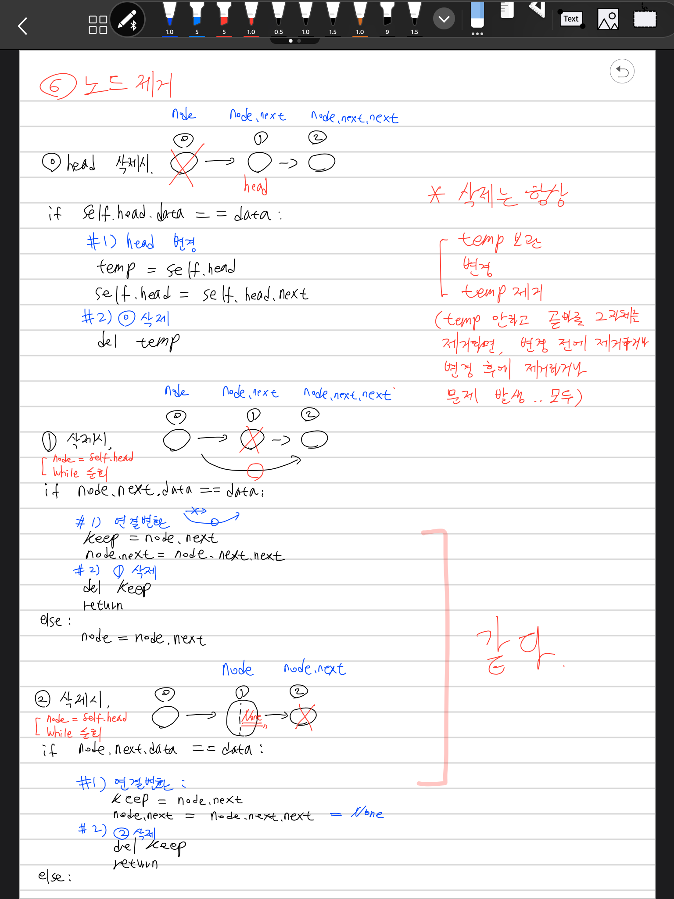
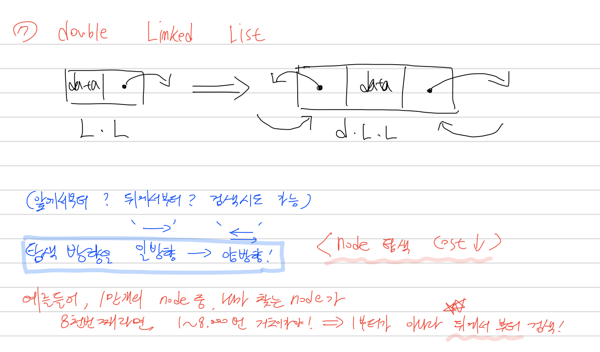
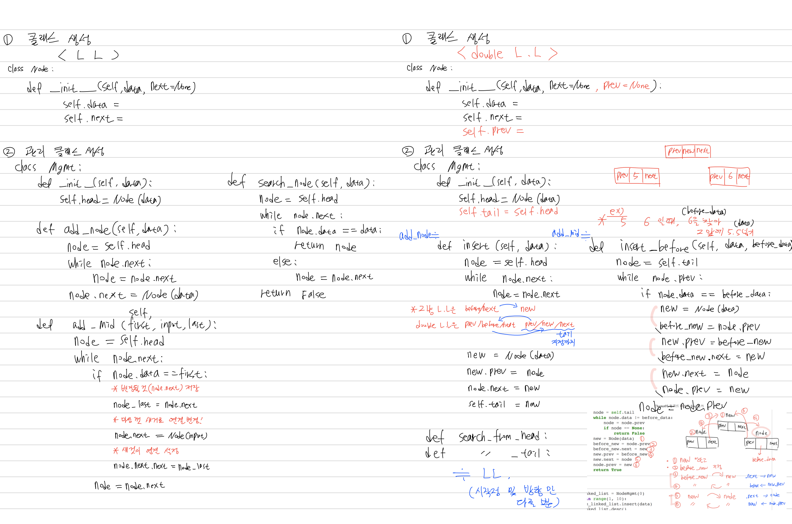

# Linked list

- 배열의 단점을 보완
- 배열의 단점 : 미리 연결된 공간을 예약해놓고 거기서 데이터 쓰고 읽음(추가/제거가 어려움)
- 링크드 리스트 : 미리 예약x. 필요할 때마다 데이터를 추가 제거 할 수 있는 구조

* 링크드 리스트 기본 구조와 용어
  - 노드(Node): 데이터 저장 단위 (데이터값, 포인터) 로 구성
  - 포인터(pointer): 각 노드 안에서, 다음이나 이전의 노드와의 연결 정보를 가지고 있는 공간

<br>
* 일반적인 링크드 리스트 형태


(출처: wikipedia, https://en.wikipedia.org/wiki/Linked_list)

* 장점
  - 미리 데이터 공간을 미리 할당하지 않아도 됨
    - 배열은 **미리 데이터 공간을 할당** 해야 함
* 단점
  - 연결을 위한 별도 데이터 공간이 필요하므로, 저장공간 효율이 높지 않음
  - 연결 정보를 찾는 시간이 필요하므로 접근 속도가 느림
  - 중간 데이터 삭제시, 앞뒤 데이터의 연결을 재구성해야 하는 부가적인 작업 필요

# 6. 특정 노드를 삭제

- head노드 삭제 (경우 1)
- 마지막노드 삭제 (경우 2)
- 중간노드 삭제 (경우 3)


```python
from IPython.display import Image
from IPython.core.display import HTML 
PATH = "/Users/kimjeongseob/Desktop/Github upload/0.Algorithms_daily/기타 이미지/"
Image(filename = PATH + "Linked_List 필기1.PNG", width=500, height=500)
```





```python
class Node:
    def __init__(self,data,next=None):
        self.data = data
        self.next = next
        
# 객체 추가, 순회출력 기능
# 자체적으로 첫 노드를 설정하도록 해야함. 이를 위해 Node 클래스를 활용
class Manage:
    def __init__(self,data):
        self.head = Node(data)
    
    def add(self,data):
        node = self.head
        while node.next:
            node = node.next
        node.next = Node(data)
        
    def desc(self):
        node = self.head
        while node.next:
            print(node.data)
            node = node.next
        print(node.data)
        
    def delete(self,data):
        # 헤드가 삭제할 노드라면
        if self.head.data == data:
            # 1) 헤드 변경
            temp = self.head
            self.head = self.head.next  #헤드 = 다음노드로 지정
            # 2) 노드 삭제
            del temp
        
        # 중간, 마지막 노드가 삭제할 노드라면
        # 중간 노드 삭제 시 : 삭제할 노드의 앞 노드 next가 다음 노드를 가리키고
        # 마지막 노드 삭제 시 : 앞 노드의 next가 None값이 되어야함
        else:
            node = self.head
            while node.next:
                # 중간, 마지막 노드가 삭제할 노드라면,
                if node.next.data == data:
                    # 1) 연결 변환
                    temp = node.next
                    node.next = node.next.next
                    # 2) 노드 삭제
                    del temp
                    return
                else:
                    node = node.next
```


```python
# 헤드노드 생성해 확인

testnode_1 = Manage(0)
testnode_1.desc()
```

    0


```python
# head를 삭제 (경우 1)

testnode_1.delete(0)
testnode_1.head
```


```python
# 다시 노드 생성

testnode_2 = Manage(0)
testnode_2.desc()
```

    0


```python
# 여러개의 노드 생성
for i in range(1,10):
    testnode_2.add(i)
testnode_2.desc()
```

    0
    1
    2
    3
    4
    5
    6
    7
    8
    9


```python
# 중간 노드를 삭제 (경우 2)
testnode_2.delete(4)
```


```python
testnode_2.desc()
```

    0
    1
    2
    3
    5
    6
    7
    8
    9


```python
# 마지막 노드를 삭제 (경우 3)
testnode_2.delete(9)
testnode_2.desc()
```

    0
    1
    2
    3
    5
    6
    7
    8


# 7. Double Linked List

* 더블 링크드 리스트(Doubly linked list) 기본 구조 
  - 이중 연결 리스트라고도 함
  - 장점: 양방향으로 연결되어 있어서 노드 탐색이 양쪽으로 모두 가능
  <br>

(출처: wikipedia, https://en.wikipedia.org/wiki/Linked_list)


```python
from IPython.display import Image
from IPython.core.display import HTML 
PATH = "/Users/kimjeongseob/Desktop/0. 데이터사이언스 스쿨/Study/0.Algorithms/기타 이미지/"
Image(filename = PATH + "DoubleLL_1.PNG", width=500, height=500)
```





```python
from IPython.display import Image
from IPython.core.display import HTML 
PATH = "/Users/kimjeongseob/Desktop/0. 데이터사이언스 스쿨/Study/0.Algorithms/기타 이미지/"
Image(filename = PATH + "DoubleLL_2.PNG", width=1000, height=500)
```





