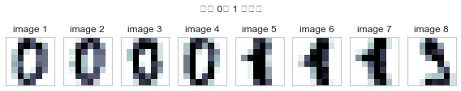
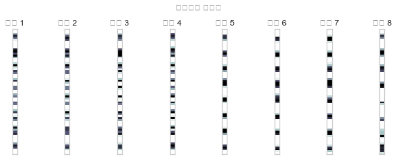
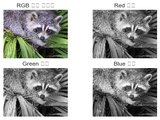

# 1. Numpy를 활용한 벡터 표현


```python
# 행으로 나타나지만, 실제로는 열벡터임을 기억

X = np.array([[1,2,3,4,5,6]])
X
```


    array([[1, 2, 3, 4, 5, 6]])


## 1-1) MNIST 숫자 이미지 데이터셋 -> 특징벡터화(열벡터)


```python
from sklearn.datasets import load_digits  # 패키지 임포트

digits = load_digits()  # 데이터 로드
samples = [0, 10, 20, 30, 1, 11, 21, 31]  # 선택된 이미지 번호
d = []
for i in range(8):
    d.append(digits.images[samples[i]])

plt.figure(figsize=(8, 2))
for i in range(8):
    plt.subplot(1, 8, i + 1)
    plt.imshow(d[i], interpolation='nearest', cmap=plt.cm.bone_r)
    plt.grid(False); plt.xticks([]); plt.yticks([])
    plt.title("image {}".format(i + 1))
plt.suptitle("숫자 0과 1 이미지")
plt.tight_layout()
plt.show()
```





```python
v = []
for i in range(8):
    v.append(d[i].reshape(64, 1))  # 벡터화
    
plt.figure(figsize=(8, 3))
for i in range(8):
    plt.subplot(1, 8, i + 1)
    plt.imshow(v[i], aspect=0.4,
               interpolation='nearest', cmap=plt.cm.bone_r)
    plt.grid(False); plt.xticks([]); plt.yticks([])
    plt.title("벡터 {}".format(i + 1))
plt.suptitle("벡터화된 이미지", y=1.05)
plt.tight_layout(w_pad=7)
plt.show()
```





# 2. Numpy를 활용한 행렬 표현


```python
A = np.array([[1,2,3],[4,5,6]])
A
```


    array([[1, 2, 3],
           [4, 5, 6]])


# 3. 텐서의 표현 - scipy 패키지 이미지 셋 활용


```python
from scipy import misc  # 패키지 임포트

img_rgb = misc.face()  # 컬러 이미지 로드
img_rgb.shape  # 데이터의 모양
```


    (768, 1024, 3)


```python
plt.subplot(221)
plt.imshow(img_rgb, cmap=plt.cm.gray)  # 컬러 이미지 출력
plt.axis("off")
plt.title("RGB 컬러 이미지")

plt.subplot(222)
plt.imshow(img_rgb[:, :, 0], cmap=plt.cm.gray)  # red 채널 출력
plt.axis("off")
plt.title("Red 채널")

plt.subplot(223)
plt.imshow(img_rgb[:, :, 1], cmap=plt.cm.gray)  # green 채널 출력
plt.axis("off")
plt.title("Green 채널")

plt.subplot(224)
plt.imshow(img_rgb[:, :, 2], cmap=plt.cm.gray)  # blue 채널 출력
plt.axis("off")
plt.title("Blue 채널")

plt.show()
```





# 4. 행렬의 전치연산


```python
A
```


    array([[1, 2, 3],
           [4, 5, 6]])


```python
A.T
```


    array([[1, 4],
           [2, 5],
           [3, 6]])


# 5. 기타 행렬 생성


```python
# 영벡터
np.zeros([2,2])
```


    array([[0., 0.],
           [0., 0.]])


```python
# 일벡터
np.ones([3,3])
```


    array([[1., 1., 1.],
           [1., 1., 1.],
           [1., 1., 1.]])


```python
# 대각행렬
A = []
for i in range(1,10+1):
    A.append(i)

np.diag(A)
```


    array([[ 1,  0,  0,  0,  0,  0,  0,  0,  0,  0],
           [ 0,  2,  0,  0,  0,  0,  0,  0,  0,  0],
           [ 0,  0,  3,  0,  0,  0,  0,  0,  0,  0],
           [ 0,  0,  0,  4,  0,  0,  0,  0,  0,  0],
           [ 0,  0,  0,  0,  5,  0,  0,  0,  0,  0],
           [ 0,  0,  0,  0,  0,  6,  0,  0,  0,  0],
           [ 0,  0,  0,  0,  0,  0,  7,  0,  0,  0],
           [ 0,  0,  0,  0,  0,  0,  0,  8,  0,  0],
           [ 0,  0,  0,  0,  0,  0,  0,  0,  9,  0],
           [ 0,  0,  0,  0,  0,  0,  0,  0,  0, 10]])


```python
# 항등행렬
np.eye(10)
```


    array([[1., 0., 0., 0., 0., 0., 0., 0., 0., 0.],
           [0., 1., 0., 0., 0., 0., 0., 0., 0., 0.],
           [0., 0., 1., 0., 0., 0., 0., 0., 0., 0.],
           [0., 0., 0., 1., 0., 0., 0., 0., 0., 0.],
           [0., 0., 0., 0., 1., 0., 0., 0., 0., 0.],
           [0., 0., 0., 0., 0., 1., 0., 0., 0., 0.],
           [0., 0., 0., 0., 0., 0., 1., 0., 0., 0.],
           [0., 0., 0., 0., 0., 0., 0., 1., 0., 0.],
           [0., 0., 0., 0., 0., 0., 0., 0., 1., 0.],
           [0., 0., 0., 0., 0., 0., 0., 0., 0., 1.]])


