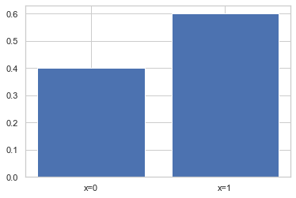
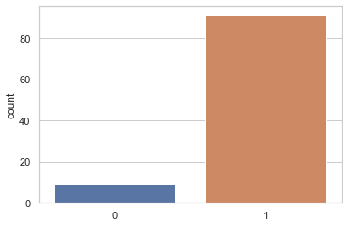
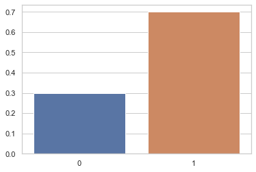
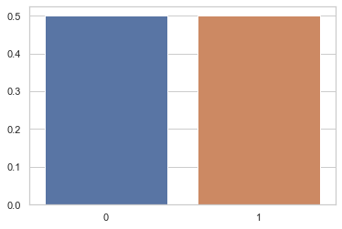
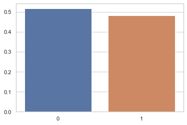
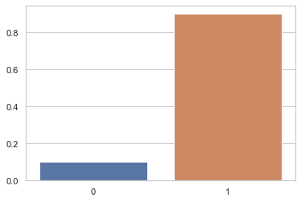
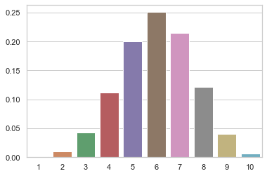
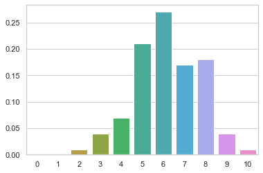
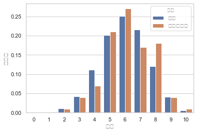
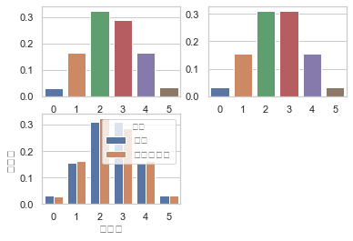

# 참고 : 확률분포 그리기

```
EX) 이항분포

1) 샘플링 없는 이론적 분포 그리기

    # 1. 확률변수 생성
    n = 10
    mu = 0.6
    rv = sp.stats.binom(n,mu)

    # 2. 확률변수 값 생성
    x = list(np.arange(1,n+1))

    # 3. 확률 값 생성
    y = rv.pmf(x)

    # 4. 확률분포 그리기
    sns.barplot(x,y)


2) 샘플링을 통한 시뮬레이션으로 분포 그리기

    # 1. 확률변수 생성
    n = 10
    mu = 0.6
    rv = sp.stats.binom(n,mu)

    # 2. 샘플링
    xx = rv.rvs(100,random_state=0)

    # 3. 확률변수 값 생성
    x = list(np.arange(0,n+1))

    # 4. 확률값 생성
    y = np.bincount(xx,minlength=n+1)/len(x)

    # 5. 확률분포 그리기
    sns.barplot(x,y)


```

# 1. Scipy.stats를 활용한 베르누이 확률변수 시뮬레이션

    - bernoulli클래스는 p(모수)를 인수로 갖는다.
    
    - 이론적으로 분포를 임의로 그려보기 vs 실제로 확률변수에서 표본을 샘플링 해 분포 그리기


```python
# 베르누이 확률분포 모수 mu = 0.6 지정

mu = 0.6
rv = sp.stats.bernoulli(mu)
```


```python
# 베르누이 확률분포 확률질량함수 생성 (1. 이론적으로 분포를 임의로 그려보기)

# 1. 베르누이 확률분포 확률변수 값 이진 생성
xx = [0,1]

# 2. 베르누이 확률분포 pmf 생성
plt.bar(xx,rv.pmf(xx))
plt.xticks([0, 1], ["x=0", "x=1"])
```


    ([<matplotlib.axis.XTick at 0x12679f690>,
      <matplotlib.axis.XTick at 0x12679f390>],
     [Text(0, 0, 'x=0'), Text(0, 0, 'x=1')])





```python
# 베르누이 확률분포 확률질량함수 생성 (2. 확률변수에서 무작위 샘플링 후 pmf생성 -> 시뮬레이션)

# 1. 베르누이 확률분포 확률변수(rv)에서 표본 샘플링(rvs)
x = rv.rvs(100,random_state=0)

# 2. 표본 값 분포 그리기
sns.countplot(x)
```


    <matplotlib.axes._subplots.AxesSubplot at 0x124ff1a90>





### 연습문제

- **샘플링을 통한 베르누이 분포 그리기** vs **샘플링 없이 이론적으로 베르누이 분포 그리기**


- 베르누이 확률분포의 모수가 다음과 같을 경우에 각각 표본을 생성한 후 기댓값과 분산을 구하고 앞의 예제와 같이 확률 밀도 함수와 비교한 바 플롯을 그린다. 표본 개수가 10개인 경우와 1000개인 경우에 대해 각각 위의 계산을 한다.

    - (1)  𝜇=0.5 
    - (2)  𝜇=0.9


```python
# (1) u = 0.5 / 10개 샘플링 분포

# 1. 확률변수 생성
mu = 0.5
rv = sp.stats.bernoulli(mu)

# 1. 표본 10개 샘플링
xx = rv.rvs(10,random_state=0)

# 2. 표본평균, 표본분산 구하기
average = xx.mean()
var = (xx.std(ddof=1))**2

print("표본평균 : {}, 표본분산 : {}".format(average,var))

# 3. 샘플링된 표본 분포 그리기
x = [0,1]
y = np.bincount(xx) / len(xx)
sns.barplot(x,y)
```

    표본평균 : 0.7, 표본분산 : 0.23333333333333334


    <matplotlib.axes._subplots.AxesSubplot at 0x1250dea90>





```python
# (2) u = 0.5 일 때, 이론적 베르누이 분포 pmf (샘플링 x)

# 1. 베르누이 확률변수 생성
rv = sp.stats.bernoulli(mu)

# 2. 샘플링 없이 확률변수 값 생성
x = [0,1]

# 3. 샘플링 없이 확률값 생성
y = rv.pmf(x)

# 4. 확률변수값 - 확률값 barplot
sns.barplot(x,y)
```


    <matplotlib.axes._subplots.AxesSubplot at 0x12438a4d0>





```python
# (3) u = 0.5 일 때, 1000개 샘플링 분포

# 1. 확률변수 생성
mu = 0.5
rv = sp.stats.bernoulli(mu)

# 2. 1000개 샘플링
xx = rv.rvs(1000,random_state=0)

# 3. 샘플링된 표본 분포 그리기
x = [0,1]
y = np.bincount(xx) / len(xx)
sns.barplot(x,y)
```


    <matplotlib.axes._subplots.AxesSubplot at 0x123bbd250>





```python
# (4) u = 0.5 일 때, 1000개 대상 이론적 베르누이 분포 pmf (샘플링 x)

# 1. 확률변수 생성
mu = 0.5
rv = sp.stats.bernoulli(mu)

# 2. 샘플링 없이 확률변수 값 생성
x = [0,1]

# 3. 샘플링 없이 확률값 생성
y = rv.pmf(x)

# 4. 확률 분포 그리기
sns.barplot(x,y)
```


    <matplotlib.axes._subplots.AxesSubplot at 0x124e9dcd0>


```python
# (5) u = 0.9 일 때, 10개 샘플링 분포

# 1. 확률변수 생성
mu = 0.9
rv = sp.stats.bernoulli(mu)

# 2. 샘플링
xx = rv.rvs(10,random_state=0)

# 3. 샘플링된 표본 분포 그리기
x = [0,1]
y = np.bincount(xx) / len(xx)
sns.barplot(x,y)
```


    <matplotlib.axes._subplots.AxesSubplot at 0x124f2d9d0>





```python
# (6) u = 0.9 일 때, 이론적 pmf (샘플링 x)

# 1. 확률변수 생성
mu = 0.9
rv = sp.stats.bernoulli(mu)

# 2. 샘플링 없이, 확률변수 값 생성
x = [0,1]

# 3. 샘플링 없이, 확률값 생성
y = rv.pmf(x)

# 4. 확률분포 그리기
sns.barplot(x,y)
```


    <matplotlib.axes._subplots.AxesSubplot at 0x1270b6c90>


# 2. Scipy.stats를 활용한 이항분포 확률변수 시뮬레이션

    - bernoulli클래스는 n, p를 모수로하여, 인수를갖는다.
    
    - 이론적으로 분포를 임의로 그려보기 vs 실제로 확률변수에서 표본을 샘플링 해 분포 그리기


```python
# (1)이항분포 확률변수 생성 및 분포 그리기 (샘플링 없이 이론적)

# 1. 확률변수 생성
n = 10
mu = 0.6
rv = sp.stats.binom(n,mu)

# 2. 확률변수 값 생성
x = list(np.arange(1,n+1))

# 3. 확률 값 생성
y = rv.pmf(x)

# 4. 확률분포 그리기
sns.barplot(x,y)
```


    <matplotlib.axes._subplots.AxesSubplot at 0x12755b7d0>





```python
# (2)이항분포 확률변수 생성 및 분포 그리기 (샘플링을 통한 시뮬레이션)


# 1. 확률변수 생성
n = 10
mu = 0.6
rv = sp.stats.binom(n,mu)

# 2. 샘플링
xx = rv.rvs(100,random_state=0)

# 3. 확률변수 값 생성
x = list(np.arange(0,n+1))

# 4. 확률값 생성
y = np.bincount(xx,minlength=n+1)/len(xx)

# 5. 확률분포 그리기
sns.barplot(x,y)
```


    <matplotlib.axes._subplots.AxesSubplot at 0x128e30850>





```python
df = pd.DataFrame({"이론" : rv.pmf(x), "시뮬레이션" : y}).stack()
df = df.reset_index()
df.columns = ["표본값", "유형", "확률값"]
df.pivot("표본값","유형","확률값")
df
```


<div>
<style scoped>
    .dataframe tbody tr th:only-of-type {
        vertical-align: middle;
    }

    .dataframe tbody tr th {
        vertical-align: top;
    }

    .dataframe thead th {
        text-align: right;
    }
</style>
<table border="1" class="dataframe">
  <thead>
    <tr style="text-align: right;">
      <th></th>
      <th>표본값</th>
      <th>유형</th>
      <th>확률값</th>
    </tr>
  </thead>
  <tbody>
    <tr>
      <th>0</th>
      <td>0</td>
      <td>이론</td>
      <td>0.000105</td>
    </tr>
    <tr>
      <th>1</th>
      <td>0</td>
      <td>시뮬레이션</td>
      <td>0.000000</td>
    </tr>
    <tr>
      <th>2</th>
      <td>1</td>
      <td>이론</td>
      <td>0.001573</td>
    </tr>
    <tr>
      <th>3</th>
      <td>1</td>
      <td>시뮬레이션</td>
      <td>0.000000</td>
    </tr>
    <tr>
      <th>4</th>
      <td>2</td>
      <td>이론</td>
      <td>0.010617</td>
    </tr>
    <tr>
      <th>5</th>
      <td>2</td>
      <td>시뮬레이션</td>
      <td>0.010000</td>
    </tr>
    <tr>
      <th>6</th>
      <td>3</td>
      <td>이론</td>
      <td>0.042467</td>
    </tr>
    <tr>
      <th>7</th>
      <td>3</td>
      <td>시뮬레이션</td>
      <td>0.040000</td>
    </tr>
    <tr>
      <th>8</th>
      <td>4</td>
      <td>이론</td>
      <td>0.111477</td>
    </tr>
    <tr>
      <th>9</th>
      <td>4</td>
      <td>시뮬레이션</td>
      <td>0.070000</td>
    </tr>
    <tr>
      <th>10</th>
      <td>5</td>
      <td>이론</td>
      <td>0.200658</td>
    </tr>
    <tr>
      <th>11</th>
      <td>5</td>
      <td>시뮬레이션</td>
      <td>0.210000</td>
    </tr>
    <tr>
      <th>12</th>
      <td>6</td>
      <td>이론</td>
      <td>0.250823</td>
    </tr>
    <tr>
      <th>13</th>
      <td>6</td>
      <td>시뮬레이션</td>
      <td>0.270000</td>
    </tr>
    <tr>
      <th>14</th>
      <td>7</td>
      <td>이론</td>
      <td>0.214991</td>
    </tr>
    <tr>
      <th>15</th>
      <td>7</td>
      <td>시뮬레이션</td>
      <td>0.170000</td>
    </tr>
    <tr>
      <th>16</th>
      <td>8</td>
      <td>이론</td>
      <td>0.120932</td>
    </tr>
    <tr>
      <th>17</th>
      <td>8</td>
      <td>시뮬레이션</td>
      <td>0.180000</td>
    </tr>
    <tr>
      <th>18</th>
      <td>9</td>
      <td>이론</td>
      <td>0.040311</td>
    </tr>
    <tr>
      <th>19</th>
      <td>9</td>
      <td>시뮬레이션</td>
      <td>0.040000</td>
    </tr>
    <tr>
      <th>20</th>
      <td>10</td>
      <td>이론</td>
      <td>0.006047</td>
    </tr>
    <tr>
      <th>21</th>
      <td>10</td>
      <td>시뮬레이션</td>
      <td>0.010000</td>
    </tr>
  </tbody>
</table>
</div>


```python
# 이론 및 시뮬레이션 비교 플롯

df = pd.DataFrame({"이론" : rv.pmf(x), "시뮬레이션" : y}).stack()
df = df.reset_index()
df.columns = ['표본','유형','확률값']
sns.barplot(x="표본",y='확률값',hue='유형',data=df)
```


    <matplotlib.axes._subplots.AxesSubplot at 0x1290a8510>





### 연습문제

이항 확률분포의 모수가 다음과 같을 경우에 각각 표본을 생성한 후 기댓값과 분산을 구하고 앞의 예제와 같이 확률밀도함수와 비교한 바 플롯을 그린다.

- 표본 개수가 10개인 경우와 1000개인 경우에 대해 각각 위의 계산을 한다.
    - (1)  𝜇=0.5 ,  𝑁=5 
    - (2)  𝜇=0.9 ,  𝑁=20


```python
# (1) u = 0.5, n=5, 표본 1000개

# 1. 확률변수 및 표본 생성
n = 5
mu = 0.5
rv = sp.stats.binom(n,mu)
xx = rv.rvs(1000,random_state=0)

# 2. 기댓값, 분산 구하기
print("기댓값 : {}, 분산 : {}".format(xx.mean(),xx.std(ddof=1)**2))

# 3. 시뮬레이션 결과 플롯
x = np.arange(0,n+1)
y = np.bincount(xx,minlength=n+1)/len(xx)

plt.subplot(221)
sns.barplot(x,y)

#4. 이론적 pmf값 출력
yy = rv.pmf(x)

plt.subplot(222)
sns.barplot(x,yy)

#5. 이론, 시뮬레이션 비교
df = pd.DataFrame({"이론":rv.pmf(x),"시뮬레이션":y}).stack()
df = df.reset_index()
df.columns = ["표본값","유형","확률값"]
plt.subplot(223)
sns.barplot(x="표본값",y="확률값",hue="유형",data=df)
```

    기댓값 : 2.488, 분산 : 1.2771331331331326


    <matplotlib.axes._subplots.AxesSubplot at 0x129f0e590>




