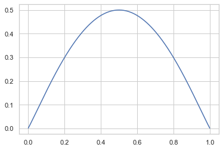

# 엔트로피

```

* 엔트로피 : 확률분포가 가지는 정보의 확신도 혹은 정보량을 수치로 표현한 것
    확률밀도가 특정 값에 몰려있으면 작은 엔트로피
    확률밀도가 골고루 퍼져있으면 큰 엔트로피
        
* 엔트로피 구하는 패키지

    sp.stats.entropy(p, base=2)

        
        
        
```

### 연습문제

- 베르누이분포에서 확률값  𝑃(𝑌=1) 은 0부터 1까지의 값을 가질 수 있다. 
- 각각의 값에 대해 엔트로피를 계산하여 가로축이  𝑃(𝑌=1) 이고 세로축이  𝐻[𝑌] 인 그래프를 그려라.


```python
# 가로축 = 가능한 베르누이 확률값 지정
p_y = np.linspace(0.001,1-0.001,10000)

# 세로축 = 엔트로피 값 계산
H = -(p_y*np.log2(p_y)*p_y + (1-p_y)*np.log2(1-p_y)*(1-p_y))

# 그래프 그리기
plt.plot(p_y,H)
```


    [<matplotlib.lines.Line2D at 0x12e25bb10>]





### 연습문제

(1) 데이터가 모두 60개가 있고 그 중  𝑌=0 인 데이터가 20개,  𝑌=1 인 데이터가 40개 있는 경우의 엔트로피를 계산하라.

(2) 데이터가 모두 40개가 있고 그 중  𝑌=0 인 데이터가 30개,  𝑌=1 인 데이터가 10개 있는 경우의 엔트로피를 계산하라.

(3) 데이터가 모두 20개가 있고 그 중  𝑌=0 인 데이터만 20개 있는 경우의 엔트로피를 계산하라.


```python
# (1) N = 60, 20 / 40 개, 엔트로피 계산

p = [2/6,  4/6]
sp.stats.entropy(p, base=2)
```


    0.9182958340544894


```python
# (2) N = 40, 30 / 10 개, 엔트로피 계산

p = [3/4,1/4]
sp.stats.entropy(p, base=2)
```


    0.8112781244591328


```python
# (3) N = 20, 20 / 0 개, 엔트로피 계산

p = [1,0]
sp.stats.entropy(p,base=2)
```


    0.0


# 1. 가변길이 인코딩

```

    - 엔트로피 : 본래 통신분야에서 데이터가 가지고 있는 정보량을 계산하기 위해 고안
    
    - 가변길이 인코딩 : 글자마다 인코딩하는 숫자가 다르기 때문에 '가변길이 인코딩'
    - 자주 나오는 글자, 데이터는 인코딩 시, 작은 수로 인코딩!
      ex) A = '0', B = '10', C = '110', D = '111'
    - 그 결과, 인코딩 결과 글자수가 줄어드는 효과
    
    - 가변길이 인코딩 결과 글자수 (전달되는) = 본래 글자수 * 엔트로피
        *엔트로피 : 각 글자들의 확률값의 엔트로피 그대로 계산
    
```    

### 연습문제

```
A, B, C, D, E, F, G, H의 8글자로 이루어진 문서가 있고 각각의 글자가 나올 확률이 다음과 같다고 가정하자.

{1/2, 1/4, 1/8, 1/16, 1/64, 1/64, 1/64, 1/64}

이 문서를 위한 가변길이 인코딩 방식을 서술하고 한 글자를 인코딩하는데 필요한 평균 비트수를 계산하라.

* 확률에 따른, 빈도수 별 알파벳 나열 : A > B > C > D > E, F, G, H
* 빈도수에 따른 가변길이 인코딩 실시

A = 0  *1비트
B = 10  *2비트
C = 110  *3비트
D = 1110  *4비트
E = 111100  *6비트
F = 111101
G = 111110
H = 111111

```


```python
# 1. 알파벳 별(변수 별) 확률값의 엔트로피 생성
H = sp.stats.entropy([1/2, 1/4, 1/8, 1/16, 1/64, 1/64, 1/64, 1/64], base=2)

# 2. 가변길이 인코딩 결과 글자 수 
result = 8 * H
result
```


    16.0


