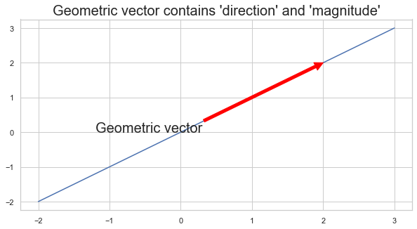

# 2. Linear Algebra - 1. Vectors


Linear Algebra가 다루는 Vector는 우리가 익숙한 geometric vector와 크게 다르지 않습니다. 

geometric vector는 데카르트 좌표계에서, direction과 magnitude를 갖는 arrow로 흔히 표현되곤 합니다.


```python
%matplotlib inline

X = [2,2]
xx = np.arange(-2,4)
yy = xx

plt.figure(figsize=(10,5))
plt.plot(xx,yy)
plt.annotate('Geometric vector',xy=(X[0],X[1]),xytext=(-1.2,0),arrowprops={'color':'red'},fontsize=20)
plt.title("Geometric vector contains 'direction' and 'magnitude'",fontsize=20)
plt.show()
```





Machine Learning(이하 "ML")은 데이터를 다루는 CS적 관점을 갖고 있습니다. 
따라서, 같은 대상(Vector)을 바라보는 관점도 살짝 다르게 접근할 수 있습니다.
Computer Science에선, computer langauge가 array라는 자료구조와 이를 처리하는 알고리즘을 갖고 있습니다.

Linear Algebra for ML 은 역시, 위와 같은 관점에서 **Vector를 array로 구현**해 접근합니다.
사실 본질적인 내용은 다른 것이 없고, 단지 array구조의 객체를 활용해 선형대수를 computer 연산 한다고 보면 될 것 같습니다.
    (python의 패키지인 Numpy를 활용해 연산, 구현하겠습니다.)


### 1) Array for Vectors

array = tuples of n real number
= n-dimensional real coordiante space(n차원의 실수좌표공간)를 구성 

예를 들어 $a$ 라는 Vector가 아래와 같다면

$$
\begin{aligned}
a= 
\begin{bmatrix}
1 \\
2 \\
3 \\
4 \\
\end{bmatrix}
\end{aligned}
$$


```python
a = np.array([1,2,3,4,5])
a
```


    array([1, 2, 3, 4, 5])


```python
a = np.array([[1],[2],[3]])
a
```


    array([[1],
           [2],
           [3]])


이와 같이 $a$ 벡터를 array로 표현할 수 있다.

