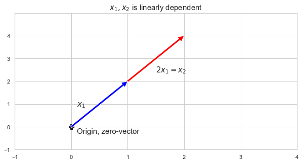

이번에는 선형대수에서 매우 중요한 개념인 "Linear Indepencence(선형독립)" 개념에 대해 살펴보겠습니다.

### 1. Linear Combination

먼저, Linear combination(선형조합) 개념에 대해 알아야 합니다. 선형독립의 정의가 선형조합을 바탕으로 하고 있기 때문이죠!

선형조합은 말그대로 Linear하게 조합한 것 입니다. MML에 따르면,

**Linear combination이란, "$V(v, +, \cdot)$ 내 vector(v)들의 Addition, Multiplication by scalar 연산으로 얻어낸 조합"**

라고 합니다!

즉, 아래와 같이 벡터들의 선형결합연산으로 조합해낸 상태를 말하는 것이죠!

$$ 
\begin{aligned}
v = c_1 x_1 + c_2 x_2 + \cdots + c_N x_N
\end{aligned}
$$

여기서, $v$는 $x$벡터들의 선형조합으로 만들어낸 것이라고 볼 수 있습니다. 당연하게도, $x$와 $v$는 같은 벡터공간 안에 있겠죠!? 

### 2. Linear Independence

선형독립의 정의는 위에서 본 선형조합의 식을 활용합니다.

$$ 
\begin{aligned}
0 = c_1 x_1 + c_2 x_2 + \cdots + c_N x_N
\end{aligned}
\tag{식 1}
$$

**식(1)과 같은 벡터들의 선형조합(Linear combination)이 zero-vector가**

**계수가 모두 0일 때$("c_{1} = ... = c_{n} = 0")$ "만" 가능하다면, 벡터$(x_{1} ... x_{n})$ 가 서로 Linearly independent 하다고 정의합니다.**


예를 들어, 다음 벡터 $x_1, x_2$는 선형독립입니다.

$$ 
\begin{aligned}
x_1 = \begin{bmatrix} 1 \\ 2 \end{bmatrix}, \;\;
x_2 = \begin{bmatrix} 3 \\ 3 \end{bmatrix}
\end{aligned}
$$

벡터 $x_1$은 두 원소의 크기가 다른데, 벡터 $x_2$는 두 원소의 크기가 같기 때문에 어떤 계수를 사용해도 $c_1x_1 + c_2x_2 = 0$을 만들 수 없습니다.


하지만, 다음 벡터 $x_1, x_2, x_3$는 선형종속입니다.

$$ 
\begin{aligned}
x_1 = \begin{bmatrix} 1 \\ 2 \end{bmatrix}, \;\;
x_2 = \begin{bmatrix} 3 \\ 3 \end{bmatrix}, \;\;
x_3 = \begin{bmatrix} 5 \\ 7 \end{bmatrix}
\end{aligned}
$$

이는 다음과 같은 식으로 증명할 수 있습니다.

$$ 
\begin{aligned}
2x_1  + x_2 - x_3 = 0
\end{aligned}
$$

파이썬으로 계산한 결과도 영벡터입니다.


```python
import numpy as np

x1 = np.array([1, 2])
x2 = np.array([3, 3])
x3 = np.array([10, 14])
2 * x1 + x2 - 0.5 * x3
```


    array([0., 0.])


### 3. Linear dependence

선형 종속인 경우는 도대체 어떤 경우인 걸까요? 선형 종속을 이해하면, 선형 독립인 경우를 이해하는 데 도움이 되지 않을까 합니다.

선형 종속인 경우, 선형 독립이 아니기 때문에 벡터는 다른 벡터들의 선형조합(Linear combination)으로 생성이 가능합니다!

$$ 
\begin{aligned}
v = c_1 x_1 + c_2 x_2 + \cdots + c_N x_N
\end{aligned}
$$

위와 같은 상황이 되는 것이죠!

예를 들어,
$$ x_{1} - 3x_{2} + x_{3} = 0$$
이라는 방정식이 있다면, 이 때의 $x_{1}, x_{2}, x_{3}$ 은 서로 선형 독립일까요?

아닙니다. 선형 종속입니다!

왜냐하면, 위의 식을 조금만 변형해보면,

$$ x_{1} = + 3x_{2} - x_{3}$$

로 변형이 가능하고, $x_{1}$ 벡터는 다른 벡터들의 조합으로 표현이 가능하다는 것이니까요!


```python
%matplotlib inline

plt.figure(figsize=(10,5))
plt.plot(0, 0, 'kP', ms=10)
plt.text(0.1,-0.3,"Origin, zero-vector",fontsize = 15)
w = np.array([1, 2])
x1 = np.array([1, 2]) * 2
plt.annotate('', xy=x1, xytext=(0, 0),arrowprops=dict(facecolor='red'))
plt.annotate('', xy=w, xytext=(0, 0),arrowprops=dict(facecolor='blue'))
plt.text(0.1, 0.9, "$x_{1}$",fontsize = 15)
plt.text(1.5, 2.4, "$2x_{1} = x_{2}$",fontsize = 15)
plt.xticks(np.arange(-3, 15))
plt.yticks(np.arange(-1, 5))
plt.xlim(-1, 4)
plt.ylim(-1, 5)
plt.title("$x_{1}, x_{2}$ is linearly dependent",fontsize=15)
plt.show()
```





위의 그림처럼, $x_{2}$는 $x_{1}$의 2배로 표현이 가능합니다. 2배를 스케일링하면 표현이 가능한 것이죠! 바로 선형결합 연산으로 표현이 가능하다는 바로 그것입니다! 고로, $x_{1}, x{2}$는 서로 선형 종속입니다!

도표에 벡터를 시각화해서 보니... 이해에 도움이 되셨지 않을까 싶습니다! 두 벡터 모두 하나의 선(line)에서 벗어나지 못하고 갇혀(종속)있는 것이죠. 두 벡터를 아무리 더하고 빼고, 스케일링해서 더하고 해줘도... 저 선을 벗어날 수 없습니다. 예를 들면, [3,3] 같은 벡터는 저 2개의 벡터로 표현할 수 없는 것이죠! 저 직선 위의 벡터만 표현이 가능합니다. 말 그대로 2개의 벡터는 선에 '종속'되어버린 것이죠..!

오늘은 간단하게 선형독립과, 선형종속의 의미에 대해 살펴보았습니다. 물론 더 많은 이야기 파생될 수 있는 개념이지만, 일단 오늘은 간단하게 개념에 대해서만 살펴보았습니다. 이후의 포스트에서 더 다양한 개념들을 살펴보면 좋겠네요! :)
