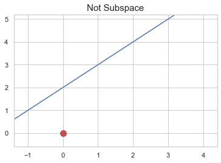

### 1. Vector Spaces

MML textbook에서는, Vector spaces를 다음과 같이 정의하고 있습니다.

"A real-valued vector space $V = (v,+, \cdot)$ is a set $v$ with two operations"
$$ + : V x V = V $$
$$ \cdot : R x V = V $$

Space(공간)에 대한 정의를 Group(군)으로 나타냈습니다.

Group은 **'closure', 'associativity', 'neutral element', 'inverse'** 4가지 성질을 만족해야 하므로
벡터 공간 내의 벡터들도 이러한 성질을 만족해야 합니다!

조금 더 쉽게 풀어보자면,

**Vector spaces** : N차원 내 존재하는 벡터들의 선형결합연산( $+$ : Addition, $\cdot$ : Multiplication by scalar )으로 만들어낼 수 있는 조합들의 Group으로 이해할 수 있을 것 같네요!


정말 간단하게는.. n차원 내 존재하는 모든 벡터들이 벡터공간을 이룬다고 쉽게 생각할 수 있겠습니다. 개념적으로는 선형결합연산으로 이룰 수 있는 군(group)으로 표현된 것일 뿐이죠. **물론, zero-vector도 벡터 공간 내에 포함되겠지요.** 선형결합연산으로 zero-vector를 포함하고 있으니까요!


### 2. Vector subspaces

Vector subspaces는 다음과 같이 정의합니다.

"$V = (v, +, \cdot)$, $U \subseteq V$ 일 때, $U(u, +, \cdot)$ 은 **Vector subspace이다.**"


"**Vector subspaces** : 벡터 공간 내 벡터들의 선형결합연산( Addition, Multiplication by scalar )으로 만들어낼 수 있는 작은 벡터공간" 정도로 이해할 수 있을 것 같습니다.

Vector subspaces는 정의에서도 느낄 수 있듯, 

예를 들어, 2차원 실좌표공간($R^{2}$) 내에선,

1. 원점(origin, (0,0)).
2. 원점을 지나는 직선
3. $R^{2}$ 상 표현 가능한 2-dimensional vector 

이 Vector subspace가될 수 있습니다. **주의할 것은 원점은 모든 부분공간의 부분집합이 됩니다. 원점이 포함되지 않는 부분공간(subspace)란 존재하지 않습니다.** 원점이 존재하지 않는다면, 그 부분공간은 원점에 대해 닫혀있지 않아 Group이 될 수 없기 때문입니다.(Group의 "Closure" 성질 위반, 부분공간이 되기 위해선, $+$, $\cdot$ 연산의 결과가 그 부분공간 내에 포함되어 있어야 하는 데, zero-vector가 없다면, 그 부분공간이 zero-vector가 연산의 결과가 되는 경우를 품지 못하는 경우가 발생하기 때문입니다.)

다음과 같은 직선은 부분공간이 아닙니다. 물론 2차원 공간 내 존재하는 벡터의 선형결합으로 이루어진 '공간(space)'이지만, zero-vector를 지나지 않기(포함하지 않기) 때문에, 모든 선형결합 연산의 결과에 닫혀(closed)있지 않아 Vector subspace로 볼 수 없습니다!


```python
%matplotlib inline

plt.xlim(-1.4, 4.4)
plt.ylim(-0.6, 5.2)
plt.plot([-2,-1,0,1,2,3,4],[0,1,2,3,4,5,6])
plt.plot(0, 0, 'ro', ms=10)
plt.title("Not Subspace",fontsize=15)
plt.show()
```





또 다른 예로, 3차원 실좌표공간($R^{3})을 생각해보자면,

1. 원점(origin, (0,0)
2. 원점을 지나는 직선
3. 원점을 갖는 평면
4. $R^{3}$상 표현 가능한 3-dimensional vector

가 Vector subspace가 될 수 있습니다.

### 3. Matrix subspace (column space)

벡터 외, 행렬에도 역시 부분공간(subspace)가 존재합니다.

벡터처럼, 선형결합 연산(Addition, Multiplication by scalar)으로 조합해낼 수 있는 공간입니다. 단지, 행렬의 column Vector가 만들어낸다는 차이점이 있을 뿐입니다.

행렬 내 column들의 선형결합으로 만들 수 있는 subspace가 바로 "column space"이자 Matrix의 subspace입니다!

예를 들면, 아래와 같은 행렬의 경우

$$
\begin{aligned}
\begin{bmatrix}
10 & 11 & 12\\
11 & 12 & 13\\
12 & 13 & 14\\
\end{bmatrix}
\end{aligned}
$$


$$
\begin{aligned}
c_{1}
\begin{bmatrix}
10\\
11\\
12\\
\end{bmatrix}
+
c_{2}
\begin{bmatrix}
11\\
12\\
13\\
\end{bmatrix}
+
c_{3}
\begin{bmatrix}
12\\
13\\
14\\
\end{bmatrix}
\end{aligned}
$$

와 같이 각 열벡터들의 선형결합으로 나타낼 수 있고, 이것이 곧 column space, subspace of Matrix를 이루게 된다.
