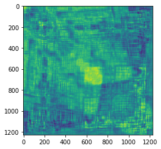
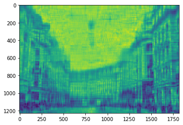

```python
import numpy as np
import scipy as sp
import pandas as pd
import matplotlib.pylab as plt
import seaborn as sns
import sklearn as sk
import statsmodels.api as sm
from sklearn.decomposition import PCA
import sympy
```


```python
from PIL import Image
img = Image.open("/Users/kimjeongseob/Desktop/기타/엽서용 사진/2.jpg").convert('L')
img
```


```python
A = np.array(img)
```


```python
# 대칭행렬이 아님

A.shape
```


    (1228, 1818)


```python
# 이미지를 잘라내서 정방행렬로 만듬

B = np.array(img.crop((0,0,1228,1228)))
```


```python
# 분산행렬로 대칭행렬화 함

B = B + B.T
```


```python
B
```


    array([[208, 204, 205, ...,  84,  97, 102],
           [204, 206, 212, ...,  81,  92,  98],
           [205, 212, 218, ...,  76,  87,  92],
           ...,
           [ 84,  81,  76, ..., 138, 139, 102],
           [ 97,  92,  87, ..., 139, 154, 133],
           [102,  98,  92, ..., 102, 133, 130]], dtype=uint8)


```python
# 고유분해

w, V = np.linalg.eig(B)
```


```python
# 대칭행렬 = 랭크1행렬의 합
# 붙여가면서 점점 원래 행렬롤 돌아가는 것을 알 수 있음

plt.imshow(np.real(w[0]*V[:,:1] @ V[:,:1].T)
           + np.real(w[1]*V[:,1:2] @ V[:,1:2].T)
           + np.real(w[2]*V[:,2:3] @ V[:,2:3].T)
           + np.real(w[3]*V[:,3:4] @ V[:,3:4].T)
           + np.real(w[4]*V[:,4:5] @ V[:,4:5].T)
           + np.real(w[5]*V[:,5:6] @ V[:,5:6].T)
           + np.real(w[6]*V[:,6:7] @ V[:,6:7].T)
           + np.real(w[7]*V[:,7:8] @ V[:,7:8].T)
           + np.real(w[8]*V[:,8:9] @ V[:,8:9].T)
           + np.real(w[9]*V[:,9:10] @ V[:,9:10].T)
           + np.real(w[10]*V[:,10:11] @ V[:,10:11].T)
           + np.real(w[11]*V[:,11:12] @ V[:,11:12].T)
           + np.real(w[12]*V[:,12:13] @ V[:,12:13].T)
           + np.real(w[13]*V[:,13:14] @ V[:,13:14].T)
           + np.real(w[14]*V[:,14:15] @ V[:,14:15].T)
           + np.real(w[15]*V[:,15:16] @ V[:,15:16].T)
           + np.real(w[16]*V[:,16:17] @ V[:,16:17].T)
           + np.real(w[17]*V[:,17:18] @ V[:,17:18].T))
plt.show()
```





```python
# 원래 사진에다가 특이값 분해로

U, S, VT = np.linalg.svd(A)
```


```python
# 전체 필요한 숫자 = 6* (1, 1228, 1818) = 압축. 중요한 정보만
# 특이값 분해도 결국엔 랭크-1행렬 합으로

plt.imshow(np.real(S[0]*U[:,:1]@VT[:1,:])
          +np.real(S[1]*U[:,1:2]@VT[1:2,:])
          +np.real(S[2]*U[:,2:3]@VT[2:3,:])
          +np.real(S[3]*U[:,3:4]@VT[3:4,:])
          +np.real(S[4]*U[:,4:5]@VT[4:5,:])
          +np.real(S[5]*U[:,5:6]@VT[5:6,:])
          +np.real(S[6]*U[:,6:7]@VT[6:7,:])
          +np.real(S[7]*U[:,7:8]@VT[7:8,:])
          +np.real(S[8]*U[:,8:9]@VT[8:9,:])
          +np.real(S[9]*U[:,9:10]@VT[9:10,:])
          +np.real(S[10]*U[:,10:11]@VT[10:11,:])
          +np.real(S[11]*U[:,11:12]@VT[11:12,:])
          +np.real(S[12]*U[:,12:13]@VT[12:13,:])
          +np.real(S[13]*U[:,13:14]@VT[13:14,:])
          +np.real(S[14]*U[:,14:15]@VT[14:15,:])
          +np.real(S[15]*U[:,15:16]@VT[15:16,:])
          +np.real(S[16]*U[:,16:17]@VT[16:17,:])
          +np.real(S[17]*U[:,17:18]@VT[17:18,:]))
plt.show()
```




