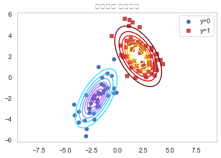
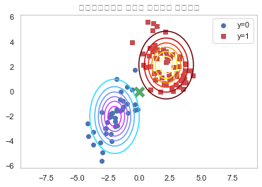
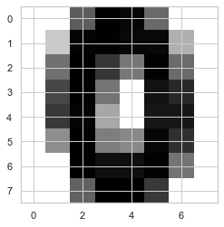
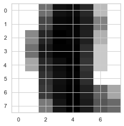
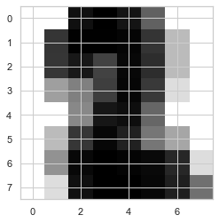
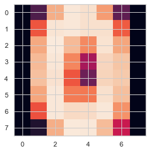
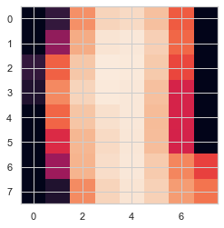
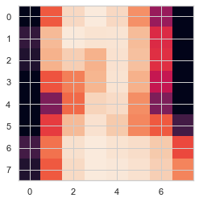
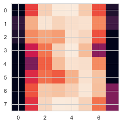

# 07.02 naive-bayes classification model

- conditional independence
- navie assumption
- likelihood model (데이터의 특징에 따라 정규분포, 베르누이, 다항분포)
    - 기존 가능도함수를 분리가능함수화 (나이브 가정(클래스 조건부 독립)에 따라)

```

[사이킷런에서 제공하는 나이브베이즈 모형]

사이킷런의 naive_bayes 서브패키지에서는 다음과 같은 세가지 나이브베이즈 모형 클래스를 제공한다.

GaussianNB: 정규분포 나이브베이즈
BernoulliNB: 베르누이분포 나이브베이즈
MultinomialNB: 다항분포 나이브베이즈

이 클래스들은 다양한 속성값 및 메서드를 가진다. 우선 사전 확률과 관련된 속성은 다음과 같다.


classes_
종속변수 Y의 클래스(라벨)


class_count_
종속변수 Y의 값이 특정한 클래스인 표본 데이터의 수


class_prior_
종속변수 Y의 무조건부 확률분포  𝑃(𝑌)  (정규분포의 경우에만)


class_log_prior_
종속변수 Y의 무조건부 확률분포의 로그  log𝑃(𝑌)  (베르누이분포나 다항분포의 경우에만)


[정규분포 나이브베이즈 모형]

가우시안 나이브베이즈 모형 GaussianNB은 가능도 추정과 관련하여 다음과 같은 속성을 가진다.

theta_: 정규분포의 기댓값  𝜇 
sigma_: 정규분포의 분산  𝜎2


[베르누이 나이브베이즈 모형]

베르누이분포 나이브베이즈 모형 클래스 BernoulliNB는 가능도 추정과 관련하여 다음 속성을 가진다.

feature_count_: 각 클래스  𝑘 에 대해  𝑑 번째 동전이 앞면이 나온 횟수  𝑁𝑑,𝑘 
feature_log_prob_: 베르누이분포 모수의 로그

```

# 1. 정규분포 나이브베이즈 모형


    - 데이터 : 실수, 클래스 마다 특정한 값 주면에서 발생할 경우
    - 정규분포 나이브베이즈 모형 : 정규분포 가능도모형을 적용한 나이브베이즈 모델
        - 정규분포 가능도 모형 : 다변수 정규분포 pdf에 조건부 독립 적용
        

**본래 다변수 정규분포 데이터**


```python
np.random.seed(0)
rv0 = sp.stats.multivariate_normal([-2, -2], [[1, 0.9], [0.9, 2]])
rv1 = sp.stats.multivariate_normal([2, 2], [[1.2, -0.8], [-0.8, 2]])
X0 = rv0.rvs(40)
X1 = rv1.rvs(60)
X = np.vstack([X0, X1])
y = np.hstack([np.zeros(40), np.ones(60)])

xx1 = np.linspace(-5, 5, 100)
xx2 = np.linspace(-5, 5, 100)
XX1, XX2 = np.meshgrid(xx1, xx2)
plt.grid(False)
plt.contour(XX1, XX2, rv0.pdf(np.dstack([XX1, XX2])), cmap=mpl.cm.cool)
plt.contour(XX1, XX2, rv1.pdf(np.dstack([XX1, XX2])), cmap=mpl.cm.hot)
plt.scatter(X0[:, 0], X0[:, 1], marker="o", c='b', label="y=0")
plt.scatter(X1[:, 0], X1[:, 1], marker="s", c='r', label="y=1")
plt.legend()
plt.title("데이터의 확률분포")
plt.axis("equal")
plt.show()
```





**본래 다변수 정규분포 -> 나이브 가정을 적용한 나이브베이즈 모형으로 해석**


```python
from sklearn.naive_bayes import GaussianNB
model_norm = GaussianNB().fit(X, y)
```


```python
model_norm.classes_
```


    array([0., 1.])


```python
model_norm.class_count_
```


    array([40., 60.])


```python
model_norm.class_prior_
```


    array([0.4, 0.6])


```python
model_norm.theta_[0], model_norm.sigma_[0]
```


    (array([-1.96197643, -2.00597903]), array([1.02398854, 2.31390497]))


```python
rv0 = sp.stats.multivariate_normal(model_norm.theta_[0], model_norm.sigma_[0])
rv1 = sp.stats.multivariate_normal(model_norm.theta_[1], model_norm.sigma_[1])

xx1 = np.linspace(-5, 5, 100)
xx2 = np.linspace(-5, 5, 100)
XX1, XX2 = np.meshgrid(xx1, xx2)
plt.grid(False)
plt.contour(XX1, XX2, rv0.pdf(np.dstack([XX1, XX2])), cmap=mpl.cm.cool)
plt.contour(XX1, XX2, rv1.pdf(np.dstack([XX1, XX2])), cmap=mpl.cm.hot)
plt.scatter(X0[:, 0], X0[:, 1], marker="o", c='b', label="y=0")
plt.scatter(X1[:, 0], X1[:, 1], marker="s", c='r', label="y=1")

x_new = [0, 0]
plt.scatter(x_new[0], x_new[1], c="g", marker="x", s=150, linewidth=5)
plt.legend()
plt.title("나이브베이즈로 추정한 데이터의 확률분포")
plt.axis("equal")
plt.show()
```





### 연습문제

붓꽃 분류문제를 가우시안 나이브베이즈 모형을 사용하여 풀어보자.

(1) 각각의 종이 선택될 사전확률을 구하라.

(2) 각각의 종에 대해 꽃받침의 길이, 꽃받침의 폭, 꽃잎의 길이, 꽃잎의 폭의 평균과 분산을 구하라.

(3) 학습용 데이터를 사용하여 분류문제를 풀고 다음을 계산하라.

- 분류결과표 
- 분류보고서


```python
from sklearn.datasets import load_iris
from sklearn.metrics import confusion_matrix
from sklearn.metrics import classification_report
from sklearn.naive_bayes import GaussianNB

# 1. 데이터 로드

iris = load_iris()
X = np.array(iris.data)
y = np.array(iris.target)

# 2. naive-bayes 학습
model = GaussianNB().fit(X, y)

# 3. 사전확률 구하기
model.class_prior_
```


    array([0.33333333, 0.33333333, 0.33333333])


```python
# 4. 각각의 종(class별) feature의 평균, 분산(모수)를 구하라

print(model.theta_[0], model.sigma_[0],'\n',model.theta_[1], model.sigma_[1],'\n',model.theta_[2], model.sigma_[2])
```

    [5.006 3.428 1.462 0.246] [0.121764 0.140816 0.029556 0.010884] 
     [5.936 2.77  4.26  1.326] [0.261104 0.0965   0.2164   0.038324] 
     [6.588 2.974 5.552 2.026] [0.396256 0.101924 0.298496 0.073924]


```python
# 5. 분류 결과표
y_pred = model.predict(X)
y_true = y
confusion_matrix(y_true, y_pred)
```


    array([[50,  0,  0],
           [ 0, 47,  3],
           [ 0,  3, 47]])


```python
# 6. 분류 리포트
print(classification_report(y_true, y_pred, target_names=iris.target_names))
```

                  precision    recall  f1-score   support
    
          setosa       1.00      1.00      1.00        50
      versicolor       0.94      0.94      0.94        50
       virginica       0.94      0.94      0.94        50
    
        accuracy                           0.96       150
       macro avg       0.96      0.96      0.96       150
    weighted avg       0.96      0.96      0.96       150
    


# 2. 베르누이 나이브베이즈 모형


    - 데이터 : 0 또는 1의 값 (이진분류)   
        ex) 특정 단어가 있고 없고가 데이터로 주어질 때 (BOW : feature: 특정 단어(토큰), row: 데이터마다 있고(1) 없고(0)) 
        
    - 베르누이분포 나이브베이즈 모형 : 베르누이 가능도 모형을 적용한 나이브베이즈 모델
        베르누이 가능도 모형 : 베르누이pdf에 조건부 독립 적용
   

**실습 : MNIST 숫자 분류문제**

```
(1) MNIST 숫자 분류문제에서 sklearn.preprocessing.Binarizer로 x값을 0, 1로 바꾼다
(값이 8 이상이면 1, 8 미만이면 0). 즉 흰색과 검은색 픽셀로만 구성된 이미지로 만든다(다음 코드 참조)

from sklearn.datasets import load_digits
digits = load_digits()
X = digits.data
y = digits.target
from sklearn.preprocessing import Binarizer
X = Binarizer(7).fit_transform(X)

이 이미지에 대해 베르누이 나이브베이즈 모형을 적용하자. 분류 결과를 분류보고서 형식으로 나타내라.
```


```python
# 1. 숫자 데이터 로드 + 이진화( binarizer ) : '이진화'는 베르누이 모형으로 사용해 분석하기 위해 임의로 가공한 것

from sklearn.datasets import load_digits
digits = load_digits()
X = digits.data
y = digits.target
from sklearn.preprocessing import Binarizer
X = Binarizer(7).fit_transform(X)
```


```python
# 2. 베르누이 모형으로 학습

from sklearn.naive_bayes import BernoulliNB
model_bern = BernoulliNB().fit(X, y)
```


```python
# 3. 베르누이 모형 분류 결과
# 분류보고서 형식

y_pred = model_bern.predict(X)
y_true = y
print(classification_report(y_true, y_pred))
```

                  precision    recall  f1-score   support
    
               0       0.99      0.97      0.98       178
               1       0.80      0.80      0.80       182
               2       0.91      0.90      0.91       177
               3       0.93      0.85      0.89       183
               4       0.96      0.94      0.95       181
               5       0.92      0.88      0.90       182
               6       0.97      0.96      0.97       181
               7       0.91      0.99      0.95       179
               8       0.80      0.82      0.81       174
               9       0.80      0.87      0.83       180
    
        accuracy                           0.90      1797
       macro avg       0.90      0.90      0.90      1797
    weighted avg       0.90      0.90      0.90      1797
    


```
이 이미지에 대해 베르누이 나이브베이즈 모형을 적용하자. 분류 결과를 분류보고서 형식으로 나타내라.

(2) BernoulliNB 클래스의 binarize 인수를 사용하여 같은 문제를 풀어본다.
```


```python
X2 = digits.data
model_bern2 = BernoulliNB(binarize=7).fit(X2, y)
y_pred2 = model_bern2.predict(X2)
print(classification_report(y_true, y_pred2))
```

                  precision    recall  f1-score   support
    
               0       0.99      0.97      0.98       178
               1       0.80      0.80      0.80       182
               2       0.91      0.90      0.91       177
               3       0.93      0.85      0.89       183
               4       0.96      0.94      0.95       181
               5       0.92      0.88      0.90       182
               6       0.97      0.96      0.97       181
               7       0.91      0.99      0.95       179
               8       0.80      0.82      0.81       174
               9       0.80      0.87      0.83       180
    
        accuracy                           0.90      1797
       macro avg       0.90      0.90      0.90      1797
    weighted avg       0.90      0.90      0.90      1797
    


```
(3) 계산된 모형의 모수 벡터 값을 각 클래스별로 8x8 이미지의 형태로 나타내라. 이 이미지는 무엇을 뜻하는가?
```


```python
# '계산된 모형의 모수 벡터 값' 확인
# 10개의 클래스, 8*8 데이터(각 클래스 당)를 64*1로 펼쳐놓은 것
# reshape -> 8*8 데이터로 복원 -> 이미지로 확인 (분류 결과를 확인하는 것)

model_bern.feature_log_prob_.shape
```


    (10, 64)


```python
# reshape -> 8*8 데이터로 복원

result = model_bern.feature_log_prob_.reshape(10,8,8)
result.shape
```


    (10, 8, 8)


```python
# 이미지로 확인 (분류 결과를 확인하는 것)
plt.imshow(result[0],cmap=plt.cm.binary)
```


    <matplotlib.image.AxesImage at 0x12c718490>





```python
plt.imshow(result[1],cmap=plt.cm.binary)
```


    <matplotlib.image.AxesImage at 0x12bf9a790>





```python
plt.imshow(result[2],cmap=plt.cm.binary)
```


    <matplotlib.image.AxesImage at 0x12bf64bd0>





# 3. 다항분포 나이브 베이즈 모형


    - 데이터 : k개 클래스
        ex) 특정 단어의 '빈도수' 체크 가능 (BOW : feature: 특정 단어(토큰), row: 빈도수) 
        
    - 다항분포 나이브베이즈 모형 : 다항분포 가능도 모형을 적용한 나이브베이즈 모델
        다항분포 가능도 모형 : 다항분포pdf에 조건부 독립 적용
   

### 연습문제

**1. MNIST 숫자 분류문제를 다항분포 나이브베이즈 모형을 사용하여 풀고 이진화(Binarizing)를 하여 베르누이 나이브베이즈 모형을 적용했을 경우와 성능을 비교하라.**


```python
# 1. 숫자 데이터 로드 : '이진화'하지 않음!

from sklearn.datasets import load_digits
digits = load_digits()
X = digits.data
y = digits.target
```


```python
# 2. 다항분포 모형으로 학습

from sklearn.naive_bayes import MultinomialNB
model_mul = MultinomialNB().fit(X, y)
```


```python
# 3. 다항분포 모형 분류 결과
# 분류보고서 형식
from sklearn.metrics import confusion_matrix
from sklearn.metrics import classification_report

y_pred = model_mul.predict(X)
y_true = y
print(classification_report(y_true, y_pred))
```

                  precision    recall  f1-score   support
    
               0       0.99      0.98      0.99       178
               1       0.87      0.75      0.81       182
               2       0.90      0.90      0.90       177
               3       0.99      0.87      0.93       183
               4       0.96      0.96      0.96       181
               5       0.97      0.86      0.91       182
               6       0.98      0.97      0.98       181
               7       0.89      0.99      0.94       179
               8       0.78      0.89      0.83       174
               9       0.76      0.88      0.82       180
    
        accuracy                           0.91      1797
       macro avg       0.91      0.91      0.91      1797
    weighted avg       0.91      0.91      0.91      1797
    


```python
# 4. 이미지로 나타내기

model_mul.feature_log_prob_.shape
```


    (10, 64)


```python
result_mul = model_mul.feature_log_prob_.reshape(10,8,8)
```


```python
plt.imshow(result_mul[0])
```


    <matplotlib.image.AxesImage at 0x11d5bb910>





```python
plt.imshow(result_mul[1])
```


    <matplotlib.image.AxesImage at 0x11fb667d0>





```python
plt.imshow(result_mul[2])
```


    <matplotlib.image.AxesImage at 0x11fcd9e10>





```python
plt.imshow(result_mul[3])
```


    <matplotlib.image.AxesImage at 0x11fe94b50>




