# 'Breast Cancer' data

- Breast Cancer 진단 데이터

```

**Data Set Characteristics:**

    :Number of Instances: 569

    :Number of Attributes: 30 numeric, predictive attributes and the class

    :Attribute Information:
        - radius (mean of distances from center to points on the perimeter)
        - texture (standard deviation of gray-scale values)
        - perimeter
        - area
        - smoothness (local variation in radius lengths)
        - compactness (perimeter^2 / area - 1.0)
        - concavity (severity of concave portions of the contour)
        - concave points (number of concave portions of the contour)
        - symmetry 
        - fractal dimension ("coastline approximation" - 1)
        
     - class:
                - WDBC-Malignant (음성)
                - WDBC-Benign (양성) 

```


```python
from sklearn.datasets import load_breast_cancer
cancer = load_breast_cancer()
print(cancer.DESCR)
```

    .. _breast_cancer_dataset:
    
    Breast cancer wisconsin (diagnostic) dataset
    --------------------------------------------
    
    **Data Set Characteristics:**
    
        :Number of Instances: 569
    
        :Number of Attributes: 30 numeric, predictive attributes and the class
    
        :Attribute Information:
            - radius (mean of distances from center to points on the perimeter)
            - texture (standard deviation of gray-scale values)
            - perimeter
            - area
            - smoothness (local variation in radius lengths)
            - compactness (perimeter^2 / area - 1.0)
            - concavity (severity of concave portions of the contour)
            - concave points (number of concave portions of the contour)
            - symmetry 
            - fractal dimension ("coastline approximation" - 1)
    
            The mean, standard error, and "worst" or largest (mean of the three
            largest values) of these features were computed for each image,
            resulting in 30 features.  For instance, field 3 is Mean Radius, field
            13 is Radius SE, field 23 is Worst Radius.
    
            - class:
                    - WDBC-Malignant
                    - WDBC-Benign
    
        :Summary Statistics:
    
        ===================================== ====== ======
                                               Min    Max
        ===================================== ====== ======
        radius (mean):                        6.981  28.11
        texture (mean):                       9.71   39.28
        perimeter (mean):                     43.79  188.5
        area (mean):                          143.5  2501.0
        smoothness (mean):                    0.053  0.163
        compactness (mean):                   0.019  0.345
        concavity (mean):                     0.0    0.427
        concave points (mean):                0.0    0.201
        symmetry (mean):                      0.106  0.304
        fractal dimension (mean):             0.05   0.097
        radius (standard error):              0.112  2.873
        texture (standard error):             0.36   4.885
        perimeter (standard error):           0.757  21.98
        area (standard error):                6.802  542.2
        smoothness (standard error):          0.002  0.031
        compactness (standard error):         0.002  0.135
        concavity (standard error):           0.0    0.396
        concave points (standard error):      0.0    0.053
        symmetry (standard error):            0.008  0.079
        fractal dimension (standard error):   0.001  0.03
        radius (worst):                       7.93   36.04
        texture (worst):                      12.02  49.54
        perimeter (worst):                    50.41  251.2
        area (worst):                         185.2  4254.0
        smoothness (worst):                   0.071  0.223
        compactness (worst):                  0.027  1.058
        concavity (worst):                    0.0    1.252
        concave points (worst):               0.0    0.291
        symmetry (worst):                     0.156  0.664
        fractal dimension (worst):            0.055  0.208
        ===================================== ====== ======
    
        :Missing Attribute Values: None
    
        :Class Distribution: 212 - Malignant, 357 - Benign
    
        :Creator:  Dr. William H. Wolberg, W. Nick Street, Olvi L. Mangasarian
    
        :Donor: Nick Street
    
        :Date: November, 1995
    
    This is a copy of UCI ML Breast Cancer Wisconsin (Diagnostic) datasets.
    https://goo.gl/U2Uwz2
    
    Features are computed from a digitized image of a fine needle
    aspirate (FNA) of a breast mass.  They describe
    characteristics of the cell nuclei present in the image.
    
    Separating plane described above was obtained using
    Multisurface Method-Tree (MSM-T) [K. P. Bennett, "Decision Tree
    Construction Via Linear Programming." Proceedings of the 4th
    Midwest Artificial Intelligence and Cognitive Science Society,
    pp. 97-101, 1992], a classification method which uses linear
    programming to construct a decision tree.  Relevant features
    were selected using an exhaustive search in the space of 1-4
    features and 1-3 separating planes.
    
    The actual linear program used to obtain the separating plane
    in the 3-dimensional space is that described in:
    [K. P. Bennett and O. L. Mangasarian: "Robust Linear
    Programming Discrimination of Two Linearly Inseparable Sets",
    Optimization Methods and Software 1, 1992, 23-34].
    
    This database is also available through the UW CS ftp server:
    
    ftp ftp.cs.wisc.edu
    cd math-prog/cpo-dataset/machine-learn/WDBC/
    
    .. topic:: References
    
       - W.N. Street, W.H. Wolberg and O.L. Mangasarian. Nuclear feature extraction 
         for breast tumor diagnosis. IS&T/SPIE 1993 International Symposium on 
         Electronic Imaging: Science and Technology, volume 1905, pages 861-870,
         San Jose, CA, 1993.
       - O.L. Mangasarian, W.N. Street and W.H. Wolberg. Breast cancer diagnosis and 
         prognosis via linear programming. Operations Research, 43(4), pages 570-577, 
         July-August 1995.
       - W.H. Wolberg, W.N. Street, and O.L. Mangasarian. Machine learning techniques
         to diagnose breast cancer from fine-needle aspirates. Cancer Letters 77 (1994) 
         163-171.


```python
df = pd.DataFrame(cancer.data, columns=cancer.feature_names)
sy = pd.Series(cancer.target, dtype="category")
sy = sy.cat.rename_categories(cancer.target_names)
df['class'] = sy
df.tail()
```


<div>
<style scoped>
    .dataframe tbody tr th:only-of-type {
        vertical-align: middle;
    }

    .dataframe tbody tr th {
        vertical-align: top;
    }

    .dataframe thead th {
        text-align: right;
    }
</style>
<table border="1" class="dataframe">
  <thead>
    <tr style="text-align: right;">
      <th></th>
      <th>mean radius</th>
      <th>mean texture</th>
      <th>mean perimeter</th>
      <th>mean area</th>
      <th>mean smoothness</th>
      <th>mean compactness</th>
      <th>mean concavity</th>
      <th>mean concave points</th>
      <th>mean symmetry</th>
      <th>mean fractal dimension</th>
      <th>...</th>
      <th>worst texture</th>
      <th>worst perimeter</th>
      <th>worst area</th>
      <th>worst smoothness</th>
      <th>worst compactness</th>
      <th>worst concavity</th>
      <th>worst concave points</th>
      <th>worst symmetry</th>
      <th>worst fractal dimension</th>
      <th>class</th>
    </tr>
  </thead>
  <tbody>
    <tr>
      <th>564</th>
      <td>21.56</td>
      <td>22.39</td>
      <td>142.00</td>
      <td>1479.0</td>
      <td>0.11100</td>
      <td>0.11590</td>
      <td>0.24390</td>
      <td>0.13890</td>
      <td>0.1726</td>
      <td>0.05623</td>
      <td>...</td>
      <td>26.40</td>
      <td>166.10</td>
      <td>2027.0</td>
      <td>0.14100</td>
      <td>0.21130</td>
      <td>0.4107</td>
      <td>0.2216</td>
      <td>0.2060</td>
      <td>0.07115</td>
      <td>malignant</td>
    </tr>
    <tr>
      <th>565</th>
      <td>20.13</td>
      <td>28.25</td>
      <td>131.20</td>
      <td>1261.0</td>
      <td>0.09780</td>
      <td>0.10340</td>
      <td>0.14400</td>
      <td>0.09791</td>
      <td>0.1752</td>
      <td>0.05533</td>
      <td>...</td>
      <td>38.25</td>
      <td>155.00</td>
      <td>1731.0</td>
      <td>0.11660</td>
      <td>0.19220</td>
      <td>0.3215</td>
      <td>0.1628</td>
      <td>0.2572</td>
      <td>0.06637</td>
      <td>malignant</td>
    </tr>
    <tr>
      <th>566</th>
      <td>16.60</td>
      <td>28.08</td>
      <td>108.30</td>
      <td>858.1</td>
      <td>0.08455</td>
      <td>0.10230</td>
      <td>0.09251</td>
      <td>0.05302</td>
      <td>0.1590</td>
      <td>0.05648</td>
      <td>...</td>
      <td>34.12</td>
      <td>126.70</td>
      <td>1124.0</td>
      <td>0.11390</td>
      <td>0.30940</td>
      <td>0.3403</td>
      <td>0.1418</td>
      <td>0.2218</td>
      <td>0.07820</td>
      <td>malignant</td>
    </tr>
    <tr>
      <th>567</th>
      <td>20.60</td>
      <td>29.33</td>
      <td>140.10</td>
      <td>1265.0</td>
      <td>0.11780</td>
      <td>0.27700</td>
      <td>0.35140</td>
      <td>0.15200</td>
      <td>0.2397</td>
      <td>0.07016</td>
      <td>...</td>
      <td>39.42</td>
      <td>184.60</td>
      <td>1821.0</td>
      <td>0.16500</td>
      <td>0.86810</td>
      <td>0.9387</td>
      <td>0.2650</td>
      <td>0.4087</td>
      <td>0.12400</td>
      <td>malignant</td>
    </tr>
    <tr>
      <th>568</th>
      <td>7.76</td>
      <td>24.54</td>
      <td>47.92</td>
      <td>181.0</td>
      <td>0.05263</td>
      <td>0.04362</td>
      <td>0.00000</td>
      <td>0.00000</td>
      <td>0.1587</td>
      <td>0.05884</td>
      <td>...</td>
      <td>30.37</td>
      <td>59.16</td>
      <td>268.6</td>
      <td>0.08996</td>
      <td>0.06444</td>
      <td>0.0000</td>
      <td>0.0000</td>
      <td>0.2871</td>
      <td>0.07039</td>
      <td>benign</td>
    </tr>
  </tbody>
</table>
<p>5 rows × 31 columns</p>
</div>


```python
X = df.drop(columns = 'class')
y = df['class']
y = pd.DataFrame(y)
```


```python
X.tail(3)
```


<div>
<style scoped>
    .dataframe tbody tr th:only-of-type {
        vertical-align: middle;
    }

    .dataframe tbody tr th {
        vertical-align: top;
    }

    .dataframe thead th {
        text-align: right;
    }
</style>
<table border="1" class="dataframe">
  <thead>
    <tr style="text-align: right;">
      <th></th>
      <th>mean radius</th>
      <th>mean texture</th>
      <th>mean perimeter</th>
      <th>mean area</th>
      <th>mean smoothness</th>
      <th>mean compactness</th>
      <th>mean concavity</th>
      <th>mean concave points</th>
      <th>mean symmetry</th>
      <th>mean fractal dimension</th>
      <th>...</th>
      <th>worst radius</th>
      <th>worst texture</th>
      <th>worst perimeter</th>
      <th>worst area</th>
      <th>worst smoothness</th>
      <th>worst compactness</th>
      <th>worst concavity</th>
      <th>worst concave points</th>
      <th>worst symmetry</th>
      <th>worst fractal dimension</th>
    </tr>
  </thead>
  <tbody>
    <tr>
      <th>566</th>
      <td>16.60</td>
      <td>28.08</td>
      <td>108.30</td>
      <td>858.1</td>
      <td>0.08455</td>
      <td>0.10230</td>
      <td>0.09251</td>
      <td>0.05302</td>
      <td>0.1590</td>
      <td>0.05648</td>
      <td>...</td>
      <td>18.980</td>
      <td>34.12</td>
      <td>126.70</td>
      <td>1124.0</td>
      <td>0.11390</td>
      <td>0.30940</td>
      <td>0.3403</td>
      <td>0.1418</td>
      <td>0.2218</td>
      <td>0.07820</td>
    </tr>
    <tr>
      <th>567</th>
      <td>20.60</td>
      <td>29.33</td>
      <td>140.10</td>
      <td>1265.0</td>
      <td>0.11780</td>
      <td>0.27700</td>
      <td>0.35140</td>
      <td>0.15200</td>
      <td>0.2397</td>
      <td>0.07016</td>
      <td>...</td>
      <td>25.740</td>
      <td>39.42</td>
      <td>184.60</td>
      <td>1821.0</td>
      <td>0.16500</td>
      <td>0.86810</td>
      <td>0.9387</td>
      <td>0.2650</td>
      <td>0.4087</td>
      <td>0.12400</td>
    </tr>
    <tr>
      <th>568</th>
      <td>7.76</td>
      <td>24.54</td>
      <td>47.92</td>
      <td>181.0</td>
      <td>0.05263</td>
      <td>0.04362</td>
      <td>0.00000</td>
      <td>0.00000</td>
      <td>0.1587</td>
      <td>0.05884</td>
      <td>...</td>
      <td>9.456</td>
      <td>30.37</td>
      <td>59.16</td>
      <td>268.6</td>
      <td>0.08996</td>
      <td>0.06444</td>
      <td>0.0000</td>
      <td>0.0000</td>
      <td>0.2871</td>
      <td>0.07039</td>
    </tr>
  </tbody>
</table>
<p>3 rows × 30 columns</p>
</div>


```python
y.tail(3)
```


<div>
<style scoped>
    .dataframe tbody tr th:only-of-type {
        vertical-align: middle;
    }

    .dataframe tbody tr th {
        vertical-align: top;
    }

    .dataframe thead th {
        text-align: right;
    }
</style>
<table border="1" class="dataframe">
  <thead>
    <tr style="text-align: right;">
      <th></th>
      <th>class</th>
    </tr>
  </thead>
  <tbody>
    <tr>
      <th>566</th>
      <td>malignant</td>
    </tr>
    <tr>
      <th>567</th>
      <td>malignant</td>
    </tr>
    <tr>
      <th>568</th>
      <td>benign</td>
    </tr>
  </tbody>
</table>
</div>


```python
X.shape
```


    (569, 30)


```python
y.shape
```


    (569, 1)


```
[확률적 생성 모델 (QDA, LDA, NB)]

1. 분포 추정

2. 모수 추정
    1) 평균 벡터
    2) 공분산 행렬
    
3. 가능도 계산

4. posterior 계산

5. predict

```

### 1. QDA


```python
# 0. train / test set 분리

from sklearn.model_selection import train_test_split

X_train, X_test, y_train, y_test = train_test_split(X, y, test_size=0.3, random_state=0)
```


```python
X_train.shape
```


    (398, 30)


```python
X_test.shape
```


    (171, 30)


```python
y_train.shape
```


    (398, 1)


```python
y_test.shape
```


    (171, 1)


```python
# 1. 분포 추정 : QDA는 X데이터의 실수, 정규분포 가정 기반

from sklearn.discriminant_analysis import QuadraticDiscriminantAnalysis

qda = QuadraticDiscriminantAnalysis(store_covariance=True).fit(X_train, y_train)
```


```python
# 2. 모수 추정 : 1) 평균벡터 (클래스 2개이니, 2개의 평균벡터 산출)

qda.means_.shape
```


    (2, 30)


```python
# 2. 모수 추정 : 2) 공분산 행렬 (클래스 2개이니, 2개의 공분산 행렬 산출)

qda.covariance_[0].shape
```


    (30, 30)


```python
qda.covariance_[1].shape
```


    (30, 30)


```python
# 5. predict

# prior
qda.priors_
```


    array([0.62562814, 0.37437186])


```python
# 조건부 확률 산출 (클래스 2개이니, 클래스 별 조건부확률 값 생성됨)

qda.predict_proba(X_train).shape
```


    (398, 2)


```python
# train 성능 확인
# 1) Confusion matrix

from sklearn.metrics import confusion_matrix

y_pred = pd.DataFrame(qda.predict(X_train))

confusion_matrix(y_train, y_pred, labels=['benign','malignant'])
```


    array([[246,   3],
           [  8, 141]])


```python
# train 성능 확인
# 2) classification report

from sklearn.metrics import classification_report

print(classification_report(y_train, y_pred, target_names=['benign','malignant']))
```

                  precision    recall  f1-score   support
    
          benign       0.97      0.99      0.98       249
       malignant       0.98      0.95      0.96       149
    
        accuracy                           0.97       398
       macro avg       0.97      0.97      0.97       398
    weighted avg       0.97      0.97      0.97       398
    


```python
# train 성능 확인
# 3) ROC Curve

from sklearn.metrics import roc_curve

# positive : malignant (음성) 설정
fpr, tpr, thresholds = roc_curve(y_train, qda.predict_proba(X_train)[:, 1], pos_label = 'malignant')
fpr, tpr, thresholds
```


    (array([0.        , 0.00401606, 0.00401606, 0.00803213, 0.00803213,
            0.02008032, 0.02008032, 0.02409639, 0.02409639, 0.03212851,
            0.03212851, 0.08032129, 0.08032129, 0.09638554, 0.09638554,
            0.13253012, 0.13253012, 1.        ]),
     array([0.        , 0.81879195, 0.91946309, 0.91946309, 0.94630872,
            0.94630872, 0.95302013, 0.95302013, 0.96644295, 0.96644295,
            0.97986577, 0.97986577, 0.98657718, 0.98657718, 0.99328859,
            0.99328859, 1.        , 1.        ]),
     array([2.00000000e+00, 1.00000000e+00, 9.99999902e-01, 9.99999345e-01,
            7.37731109e-01, 2.82921042e-01, 1.34142139e-01, 6.19466269e-02,
            3.04827005e-02, 5.41611826e-03, 3.74288103e-03, 1.92222275e-04,
            1.70641625e-04, 5.70708179e-05, 5.57865924e-05, 4.06701150e-06,
            2.98491397e-06, 0.00000000e+00]))


```python
%matplotlib inline
plt.figure(figsize=(15,10))
plt.plot(fpr, tpr, 'o-', label="QDA")
plt.plot([0, 1], [0, 1], 'k--', label="random guess")
plt.xlabel('Fall-Out',fontsize=20)
plt.ylabel('Recall',fontsize=20)
plt.title('ROC curve',fontsize=20)
plt.show()
```


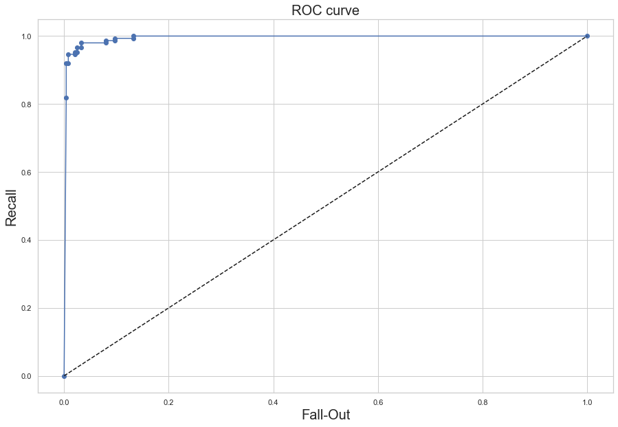


```python
# test 성능 확인
# 1) Confusion matrix

from sklearn.metrics import confusion_matrix

y_pred = pd.DataFrame(qda.predict(X_test))

confusion_matrix(y_test, y_pred, labels=['benign','malignant'])
```


    array([[103,   5],
           [  3,  60]])


```python
# test 성능 확인
# 2) classification report

from sklearn.metrics import classification_report

print(classification_report(y_test, y_pred, target_names=['benign','malignant']))
```

                  precision    recall  f1-score   support
    
          benign       0.97      0.95      0.96       108
       malignant       0.92      0.95      0.94        63
    
        accuracy                           0.95       171
       macro avg       0.95      0.95      0.95       171
    weighted avg       0.95      0.95      0.95       171
    


```python
# test 성능 확인
# 3) ROC Curve

from sklearn.metrics import roc_curve

# positive : malignant (음성) 설정
fpr, tpr, thresholds = roc_curve(y_test, qda.predict_proba(X_test)[:, 1], pos_label = 'malignant')
fpr, tpr, thresholds
```


    (array([0.        , 0.        , 0.00925926, 0.00925926, 0.01851852,
            0.01851852, 0.02777778, 0.02777778, 0.03703704, 0.03703704,
            0.0462963 , 0.0462963 , 0.08333333, 0.08333333, 0.88888889,
            0.88888889, 1.        ]),
     array([0.        , 0.79365079, 0.80952381, 0.82539683, 0.82539683,
            0.84126984, 0.84126984, 0.93650794, 0.93650794, 0.95238095,
            0.95238095, 0.96825397, 0.96825397, 0.98412698, 0.98412698,
            1.        , 1.        ]),
     array([2.00000000e+00, 1.00000000e+00, 1.00000000e+00, 1.00000000e+00,
            9.99999985e-01, 9.99999982e-01, 9.99999958e-01, 9.99671476e-01,
            9.80211152e-01, 9.76377678e-01, 9.58006590e-01, 4.83590494e-01,
            2.73690852e-03, 2.44839428e-03, 5.02785777e-25, 8.96663162e-26,
            0.00000000e+00]))


```python
%matplotlib inline
plt.figure(figsize=(15,10))
plt.plot(fpr, tpr, 'o-', label="QDA")
plt.plot([0, 1], [0, 1], 'k--', label="random guess")
plt.xlabel('Fall-Out',fontsize=30)
plt.ylabel('Recall',fontsize=30)
plt.title('ROC Curve',fontsize=30)
plt.show()
```


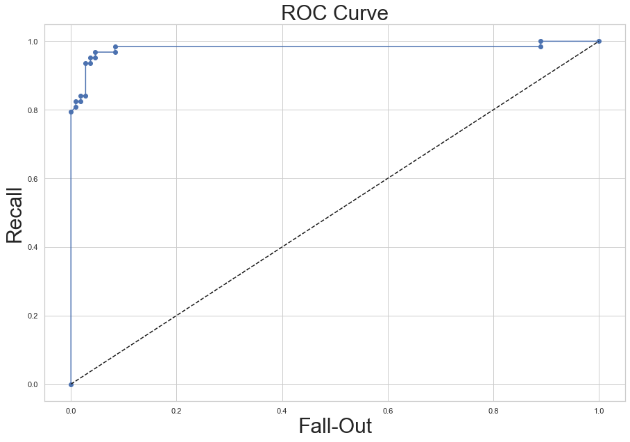


### 2. LDA


```python
from sklearn.discriminant_analysis import LinearDiscriminantAnalysis

lda = LinearDiscriminantAnalysis(n_components=3, solver="svd", store_covariance=True).fit(X_train, y_train)
```


```python
from sklearn.metrics import confusion_matrix

y_pred = pd.DataFrame(lda.predict(X_test))

confusion_matrix(y_test, y_pred, labels=['benign','malignant'])
```


    array([[108,   0],
           [  5,  58]])


```python
from sklearn.metrics import classification_report

print(classification_report(y_test, y_pred, target_names=['benign','malignant']))
```

                  precision    recall  f1-score   support
    
          benign       0.96      1.00      0.98       108
       malignant       1.00      0.92      0.96        63
    
        accuracy                           0.97       171
       macro avg       0.98      0.96      0.97       171
    weighted avg       0.97      0.97      0.97       171
    


```python
from sklearn.metrics import roc_curve

# positive : malignant (음성) 설정
fpr, tpr, thresholds = roc_curve(y_test, lda.predict_proba(X_test)[:, 1], pos_label = 'malignant')
fpr, tpr, thresholds
```


    (array([0.        , 0.        , 0.        , 0.01851852, 0.01851852,
            0.03703704, 0.03703704, 0.0462963 , 0.0462963 , 0.07407407,
            0.07407407, 0.09259259, 0.09259259, 1.        ]),
     array([0.        , 0.01587302, 0.92063492, 0.92063492, 0.93650794,
            0.93650794, 0.95238095, 0.95238095, 0.96825397, 0.96825397,
            0.98412698, 0.98412698, 1.        , 1.        ]),
     array([2.00000000e+00, 9.99999999e-01, 5.19384057e-01, 2.05939448e-01,
            1.95965973e-01, 1.38471938e-01, 1.30648832e-01, 1.18075149e-01,
            1.15941342e-01, 7.17729388e-02, 4.83960711e-02, 4.18006368e-02,
            3.88358264e-02, 7.27340504e-10]))


```python
%matplotlib inline
plt.figure(figsize=(15,10))
plt.plot(fpr, tpr, 'o-', label="LDA")
plt.plot([0, 1], [0, 1], 'k--', label="random guess")
plt.xlabel('Fall-Out',fontsize=30)
plt.ylabel('Recall',fontsize=30)
plt.title('ROC Curve',fontsize=30)
plt.show()
```


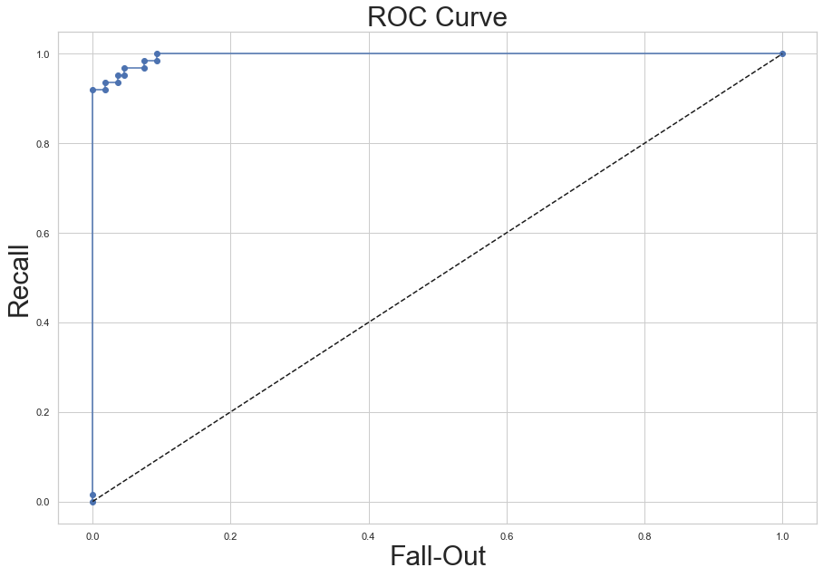


### qda / lda 비교


```python
from sklearn.metrics import auc

fpr1, tpr1, thresholds1 = roc_curve(y_test, qda.decision_function(X_test),pos_label = 'malignant')
fpr2, tpr2, thresholds1 = roc_curve(y_test, lda.decision_function(X_test),pos_label = 'malignant')

plt.figure(figsize=(13,7))
plt.plot(fpr1, tpr1, 'o-', ms=2, label="QDA")
plt.plot(fpr2, tpr2, 'o-', ms=2, label="LDA")
plt.legend(fontsize=30)
plt.plot([0, 1], [0, 1], 'k--', label="random guess")
plt.xlabel('Fall-Out',fontsize=30)
plt.ylabel('Recall',fontsize=30)
plt.title('ROC Curve',fontsize=30)
plt.show()

auc_qda = auc(fpr1,tpr1)
auc_lda = auc(fpr2,tpr2)
print("LDA의 AUC : {}, QDA의 AUC : {}".format(round(auc_lda,4),round(auc_qda),4))
```


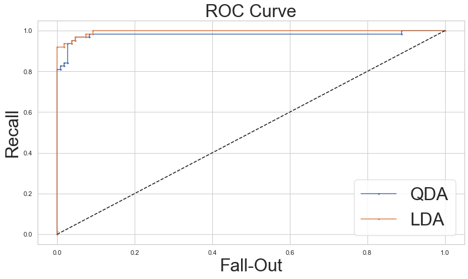


    LDA의 AUC : 0.9957, QDA의 AUC : 1.0


### 3. NB model


```python
from sklearn.naive_bayes import GaussianNB
NB = GaussianNB().fit(X_train, y_train)
```


```python
from sklearn.metrics import confusion_matrix

y_pred = pd.DataFrame(NB.predict(X_test))

confusion_matrix(y_test, y_pred, labels=['benign','malignant'])
```


    array([[101,   7],
           [  6,  57]])


```python
from sklearn.metrics import classification_report

print(classification_report(y_test, y_pred, target_names=['benign','malignant']))
```

                  precision    recall  f1-score   support
    
          benign       0.94      0.94      0.94       108
       malignant       0.89      0.90      0.90        63
    
        accuracy                           0.92       171
       macro avg       0.92      0.92      0.92       171
    weighted avg       0.92      0.92      0.92       171
    


```python
from sklearn.metrics import roc_curve

# positive : malignant (음성) 설정
fpr, tpr, thresholds = roc_curve(y_test, NB.predict_proba(X_test)[:, 1], pos_label = 'malignant')
fpr, tpr, thresholds
```


    (array([0.        , 0.        , 0.        , 0.00925926, 0.00925926,
            0.01851852, 0.01851852, 0.02777778, 0.02777778, 0.05555556,
            0.05555556, 0.08333333, 0.08333333, 0.09259259, 0.09259259,
            0.12962963, 0.12962963, 0.14814815, 0.14814815, 1.        ]),
     array([0.        , 0.65079365, 0.73015873, 0.73015873, 0.79365079,
            0.79365079, 0.82539683, 0.82539683, 0.88888889, 0.88888889,
            0.9047619 , 0.9047619 , 0.92063492, 0.92063492, 0.95238095,
            0.95238095, 0.98412698, 0.98412698, 1.        , 1.        ]),
     array([2.00000000e+00, 1.00000000e+00, 1.00000000e+00, 1.00000000e+00,
            9.99999999e-01, 9.99999998e-01, 9.99999623e-01, 9.99999609e-01,
            9.99671971e-01, 9.90186253e-01, 9.87793795e-01, 3.21823178e-01,
            5.64477028e-02, 1.08073538e-02, 5.62649951e-03, 3.75271241e-04,
            5.59962085e-05, 3.16274781e-05, 2.48020595e-05, 6.04751628e-19]))


```python
%matplotlib inline
plt.figure(figsize=(15,10))
plt.plot(fpr, tpr, 'o-', label="Naive-Bayes")
plt.plot([0, 1], [0, 1], 'k--', label="random guess")
plt.xlabel('Fall-Out',fontsize=30)
plt.ylabel('Recall',fontsize=30)
plt.title('ROC Curve',fontsize=30)
plt.show()
```


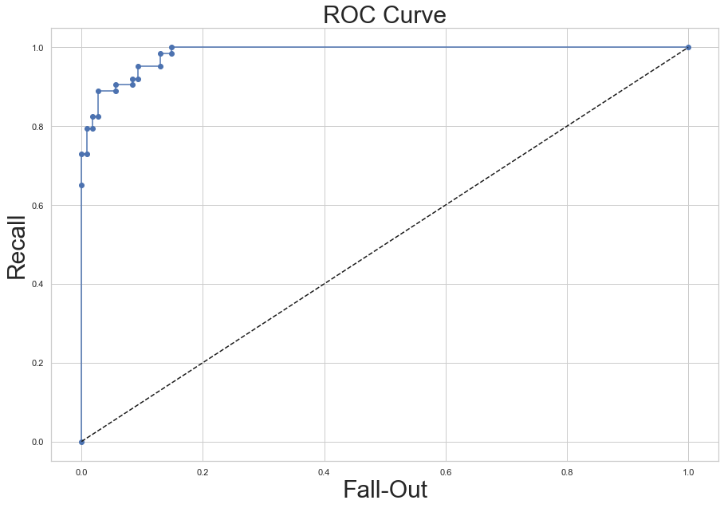


### QDA / LDA / NB 비교


```python
from sklearn.metrics import auc

fpr1, tpr1, thresholds1 = roc_curve(y_test, qda.decision_function(X_test),pos_label = 'malignant')
fpr2, tpr2, thresholds2 = roc_curve(y_test, lda.decision_function(X_test),pos_label = 'malignant')
fpr3, tpr3, thresholds3 = roc_curve(y_test, NB.predict_proba(X_test)[:, 1],pos_label = 'malignant')

plt.figure(figsize=(15,10))
plt.plot(fpr1, tpr1, 'o-', ms=2, label="QDA")
plt.plot(fpr2, tpr2, 'o-', ms=2, label="LDA")
plt.plot(fpr3, tpr3, 'o-', ms=2, label="Naive-Bayes")
plt.legend(fontsize=30)
plt.plot([0, 1], [0, 1], 'k--', label="random guess")
plt.xlabel('Fall-Out',fontsize=30)
plt.ylabel('Recall',fontsize=30)
plt.title('ROC Curve',fontsize=30)
plt.show()

auc_qda = auc(fpr1,tpr1)
auc_lda = auc(fpr2,tpr2)
auc_NB = auc(fpr3,tpr3)
print("LDA의 AUC : {} / QDA의 AUC : {} / Naive-Bayes의 AUC : {}".
      format(round(auc_lda,4),round(auc_qda,4),round(auc_NB,4)))

```


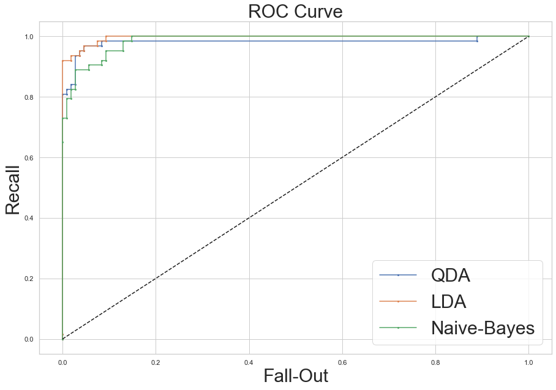


    LDA의 AUC : 0.9957 / QDA의 AUC : 0.9802 / Naive-Bayes의 AUC : 0.9854


### 4. Logistic Regression


```python
X_train.tail(1)
```


<div>
<style scoped>
    .dataframe tbody tr th:only-of-type {
        vertical-align: middle;
    }

    .dataframe tbody tr th {
        vertical-align: top;
    }

    .dataframe thead th {
        text-align: right;
    }
</style>
<table border="1" class="dataframe">
  <thead>
    <tr style="text-align: right;">
      <th></th>
      <th>mean radius</th>
      <th>mean texture</th>
      <th>mean perimeter</th>
      <th>mean area</th>
      <th>mean smoothness</th>
      <th>mean compactness</th>
      <th>mean concavity</th>
      <th>mean concave points</th>
      <th>mean symmetry</th>
      <th>mean fractal dimension</th>
      <th>...</th>
      <th>worst radius</th>
      <th>worst texture</th>
      <th>worst perimeter</th>
      <th>worst area</th>
      <th>worst smoothness</th>
      <th>worst compactness</th>
      <th>worst concavity</th>
      <th>worst concave points</th>
      <th>worst symmetry</th>
      <th>worst fractal dimension</th>
    </tr>
  </thead>
  <tbody>
    <tr>
      <th>559</th>
      <td>11.51</td>
      <td>23.93</td>
      <td>74.52</td>
      <td>403.5</td>
      <td>0.09261</td>
      <td>0.1021</td>
      <td>0.1112</td>
      <td>0.04105</td>
      <td>0.1388</td>
      <td>0.0657</td>
      <td>...</td>
      <td>12.48</td>
      <td>37.16</td>
      <td>82.28</td>
      <td>474.2</td>
      <td>0.1298</td>
      <td>0.2517</td>
      <td>0.363</td>
      <td>0.09653</td>
      <td>0.2112</td>
      <td>0.08732</td>
    </tr>
  </tbody>
</table>
<p>1 rows × 30 columns</p>
</div>


```python
X_test.tail(1)
```


<div>
<style scoped>
    .dataframe tbody tr th:only-of-type {
        vertical-align: middle;
    }

    .dataframe tbody tr th {
        vertical-align: top;
    }

    .dataframe thead th {
        text-align: right;
    }
</style>
<table border="1" class="dataframe">
  <thead>
    <tr style="text-align: right;">
      <th></th>
      <th>mean radius</th>
      <th>mean texture</th>
      <th>mean perimeter</th>
      <th>mean area</th>
      <th>mean smoothness</th>
      <th>mean compactness</th>
      <th>mean concavity</th>
      <th>mean concave points</th>
      <th>mean symmetry</th>
      <th>mean fractal dimension</th>
      <th>...</th>
      <th>worst radius</th>
      <th>worst texture</th>
      <th>worst perimeter</th>
      <th>worst area</th>
      <th>worst smoothness</th>
      <th>worst compactness</th>
      <th>worst concavity</th>
      <th>worst concave points</th>
      <th>worst symmetry</th>
      <th>worst fractal dimension</th>
    </tr>
  </thead>
  <tbody>
    <tr>
      <th>553</th>
      <td>9.333</td>
      <td>21.94</td>
      <td>59.01</td>
      <td>264.0</td>
      <td>0.0924</td>
      <td>0.05605</td>
      <td>0.03996</td>
      <td>0.01282</td>
      <td>0.1692</td>
      <td>0.06576</td>
      <td>...</td>
      <td>9.845</td>
      <td>25.05</td>
      <td>62.86</td>
      <td>295.8</td>
      <td>0.1103</td>
      <td>0.08298</td>
      <td>0.07993</td>
      <td>0.02564</td>
      <td>0.2435</td>
      <td>0.07393</td>
    </tr>
  </tbody>
</table>
<p>1 rows × 30 columns</p>
</div>


```python
y_train.tail(1)
```


<div>
<style scoped>
    .dataframe tbody tr th:only-of-type {
        vertical-align: middle;
    }

    .dataframe tbody tr th {
        vertical-align: top;
    }

    .dataframe thead th {
        text-align: right;
    }
</style>
<table border="1" class="dataframe">
  <thead>
    <tr style="text-align: right;">
      <th></th>
      <th>class</th>
    </tr>
  </thead>
  <tbody>
    <tr>
      <th>559</th>
      <td>benign</td>
    </tr>
  </tbody>
</table>
</div>


```python
y_test.tail(1)
```


<div>
<style scoped>
    .dataframe tbody tr th:only-of-type {
        vertical-align: middle;
    }

    .dataframe tbody tr th {
        vertical-align: top;
    }

    .dataframe thead th {
        text-align: right;
    }
</style>
<table border="1" class="dataframe">
  <thead>
    <tr style="text-align: right;">
      <th></th>
      <th>class</th>
    </tr>
  </thead>
  <tbody>
    <tr>
      <th>553</th>
      <td>benign</td>
    </tr>
  </tbody>
</table>
</div>


```python
from sklearn.linear_model import LogisticRegression

Logit= LogisticRegression().fit(X_train,y_train)
```


```python
from sklearn.metrics import confusion_matrix

y_pred = pd.DataFrame(Logit.predict(X_test))

confusion_matrix(y_test, y_pred, labels=['benign','malignant'])
```


    array([[102,   6],
           [  1,  62]])


```python
from sklearn.metrics import classification_report

print(classification_report(y_test, y_pred, target_names=['benign','malignant']))
```

                  precision    recall  f1-score   support
    
          benign       0.99      0.94      0.97       108
       malignant       0.91      0.98      0.95        63
    
        accuracy                           0.96       171
       macro avg       0.95      0.96      0.96       171
    weighted avg       0.96      0.96      0.96       171
    


```python
from sklearn.metrics import roc_curve

# positive : malignant (음성) 설정
fpr, tpr, thresholds = roc_curve(y_test, Logit.predict_proba(X_test)[:, 1], pos_label = 'malignant')
fpr, tpr, thresholds
```


    (array([0.        , 0.        , 0.        , 0.00925926, 0.00925926,
            0.01851852, 0.01851852, 0.14814815, 0.14814815, 1.        ]),
     array([0.        , 0.04761905, 0.80952381, 0.80952381, 0.95238095,
            0.95238095, 0.98412698, 0.98412698, 1.        , 1.        ]),
     array([2.00000000e+00, 1.00000000e+00, 9.66319050e-01, 9.63345931e-01,
            7.98272953e-01, 7.84537427e-01, 7.47048800e-01, 1.52004970e-01,
            1.47245393e-01, 1.23144543e-04]))


```python
%matplotlib inline
plt.figure(figsize=(15,10))
plt.plot(fpr, tpr, 'o-', label="Logit")
plt.plot([0, 1], [0, 1], 'k--', label="random guess")
plt.xlabel('Fall-Out',fontsize=30)
plt.ylabel('Recall',fontsize=30)
plt.title('ROC Curve',fontsize=30)
plt.show()
```


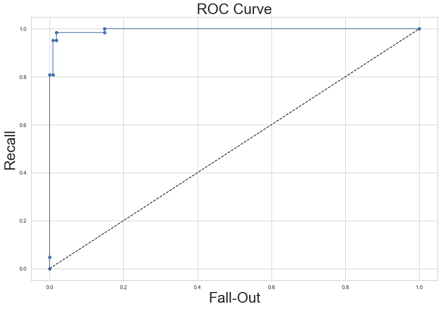


```python
from sklearn.metrics import auc

fpr1, tpr1, thresholds1 = roc_curve(y_test, qda.decision_function(X_test),pos_label = 'malignant')
fpr2, tpr2, thresholds2 = roc_curve(y_test, lda.decision_function(X_test),pos_label = 'malignant')
fpr3, tpr3, thresholds3 = roc_curve(y_test, NB.predict_proba(X_test)[:, 1],pos_label = 'malignant')
fpr4, tpr4, thresholds4 = roc_curve(y_test, Logit.predict_proba(X_test)[:, 1],pos_label = 'malignant')

plt.figure(figsize=(15,10))
plt.plot(fpr1, tpr1, 'o-', ms=2, label="QDA")
plt.plot(fpr2, tpr2, 'o-', ms=2, label="LDA")
plt.plot(fpr3, tpr3, 'o-', ms=2, label="Naive-Bayes")
plt.plot(fpr4, tpr4, 'o-', ms=2, label="Logit")
plt.legend(fontsize=30)
plt.plot([0, 1], [0, 1], 'k--', label="random guess")
plt.xlabel('Fall-Out',fontsize=30)
plt.ylabel('Recall',fontsize=30)
plt.title('ROC Curve',fontsize=30)
plt.show()

auc_qda = auc(fpr1,tpr1)
auc_lda = auc(fpr2,tpr2)
auc_NB = auc(fpr3,tpr3)
auc_Logit = auc(fpr4,tpr4)
print("LDA의 AUC : {} / QDA의 AUC : {} / Naive-Bayes의 AUC : {} / Logistic : {}".
      format(round(auc_lda,4),round(auc_qda,4),round(auc_NB,4),round(auc_Logit,4)))

```


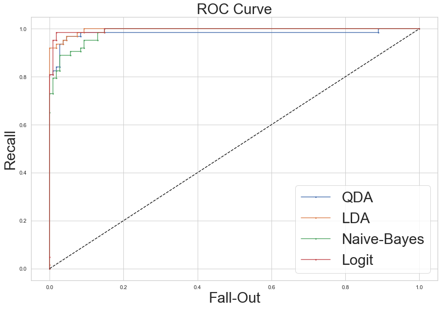


    LDA의 AUC : 0.9957 / QDA의 AUC : 0.9802 / Naive-Bayes의 AUC : 0.9854 / Logistic : 0.9957


### 5. Decision Tree


```python
import io
import pydot
# from Ipython.core.display import Image
from sklearn.tree import export_graphviz
```


```python
from sklearn.tree import DecisionTreeClassifier

DT = DecisionTreeClassifier(criterion = 'entropy', max_depth = 3, random_state = 2).fit(X_train,y_train)
```


```python
from sklearn.metrics import confusion_matrix

y_pred = pd.DataFrame(DT.predict(X_test))

confusion_matrix(y_test, y_pred, labels=['benign','malignant'])
```


    array([[102,   6],
           [  2,  61]])


```python
from sklearn.metrics import classification_report

print(classification_report(y_test, y_pred, target_names=['benign','malignant']))
```

                  precision    recall  f1-score   support
    
          benign       0.98      0.94      0.96       108
       malignant       0.91      0.97      0.94        63
    
        accuracy                           0.95       171
       macro avg       0.95      0.96      0.95       171
    weighted avg       0.95      0.95      0.95       171
    


```python
from sklearn.metrics import roc_curve

# positive : malignant (음성) 설정
fpr, tpr, thresholds = roc_curve(y_test, DT.predict_proba(X_test)[:, 1], pos_label = 'malignant')
fpr, tpr, thresholds
```


    (array([0.        , 0.00925926, 0.05555556, 0.09259259, 0.34259259,
            1.        ]),
     array([0.        , 0.77777778, 0.96825397, 0.98412698, 0.98412698,
            1.        ]),
     array([2.        , 1.        , 0.8       , 0.41666667, 0.06849315,
            0.        ]))


```python
%matplotlib inline
plt.figure(figsize=(15,10))
plt.plot(fpr, tpr, 'o-', label="DT")
plt.plot([0, 1], [0, 1], 'k--', label="random guess")
plt.xlabel('Fall-Out',fontsize=30)
plt.ylabel('Recall',fontsize=30)
plt.title('ROC Curve',fontsize=30)
plt.show()
```


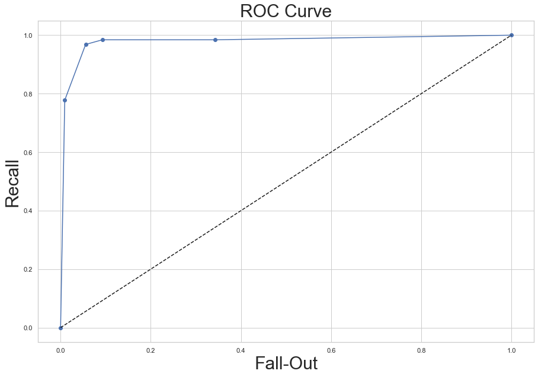


```python
from sklearn.metrics import auc

fpr1, tpr1, thresholds1 = roc_curve(y_test, qda.decision_function(X_test),pos_label = 'malignant')
fpr2, tpr2, thresholds2 = roc_curve(y_test, lda.decision_function(X_test),pos_label = 'malignant')
fpr3, tpr3, thresholds3 = roc_curve(y_test, NB.predict_proba(X_test)[:, 1],pos_label = 'malignant')
fpr4, tpr4, thresholds4 = roc_curve(y_test, Logit.predict_proba(X_test)[:, 1],pos_label = 'malignant')
fpr5, tpr5, thresholds5 = roc_curve(y_test, DT.predict_proba(X_test)[:, 1],pos_label = 'malignant')

plt.figure(figsize=(15,10))
plt.plot(fpr1, tpr1, 'o-', ms=2, label="QDA")
plt.plot(fpr2, tpr2, 'o-', ms=2, label="LDA")
plt.plot(fpr3, tpr3, 'o-', ms=2, label="Naive-Bayes")
plt.plot(fpr4, tpr4, 'o-', ms=2, label="Logit")
plt.plot(fpr5, tpr5, 'o-', ms=2, label="Decision-Tree")
plt.legend(fontsize=30)
plt.plot([0, 1], [0, 1], 'k--', label="random guess")
plt.xlabel('Fall-Out',fontsize=30)
plt.ylabel('Recall',fontsize=30)
plt.title('ROC Curve',fontsize=30)
plt.show()

auc_qda = auc(fpr1,tpr1)
auc_lda = auc(fpr2,tpr2)
auc_NB = auc(fpr3,tpr3)
auc_Logit = auc(fpr4,tpr4)
auc_DT = auc(fpr5,tpr5)
print("LDA의 AUC : {} / QDA의 AUC : {} / Naive-Bayes의 AUC : {} / Logistic : {} / DT : {}".
      format(round(auc_lda,4),round(auc_qda,4),round(auc_NB,4),round(auc_Logit,4),round(auc_Logit,4)))

```


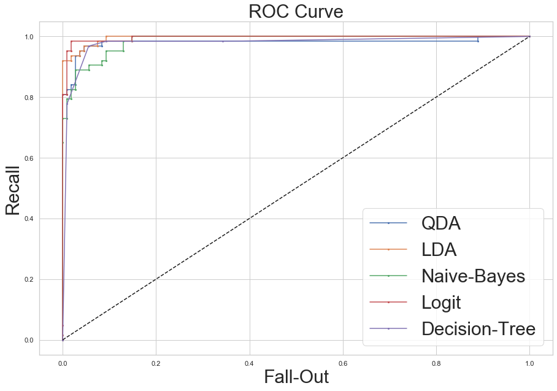


    LDA의 AUC : 0.9957 / QDA의 AUC : 0.9802 / Naive-Bayes의 AUC : 0.9854 / Logistic : 0.9957 / DT : 0.9957


### 6. Bagging


```python
from sklearn.ensemble import BaggingClassifier
```


```python
bagging = BaggingClassifier(DecisionTreeClassifier(max_depth=2),n_estimators=100,random_state=0).fit(
    X_train,y_train)
```


```python
from sklearn.metrics import confusion_matrix

y_pred = pd.DataFrame(bagging.predict(X_test))

confusion_matrix(y_test, y_pred, labels=['benign','malignant'])
```


    array([[105,   3],
           [  8,  55]])


```python
from sklearn.metrics import classification_report

print(classification_report(y_test, y_pred, target_names=['benign','malignant']))
```

                  precision    recall  f1-score   support
    
          benign       0.93      0.97      0.95       108
       malignant       0.95      0.87      0.91        63
    
        accuracy                           0.94       171
       macro avg       0.94      0.92      0.93       171
    weighted avg       0.94      0.94      0.94       171
    


```python
from sklearn.metrics import roc_curve

# positive : malignant (음성) 설정
fpr, tpr, thresholds = roc_curve(y_test, bagging.predict_proba(X_test)[:, 1], pos_label = 'malignant')
```


```python
%matplotlib inline
plt.figure(figsize=(15,10))
plt.plot(fpr, tpr, 'o-', label="bagging")
plt.plot([0, 1], [0, 1], 'k--', label="random guess")
plt.xlabel('Fall-Out',fontsize=30)
plt.ylabel('Recall',fontsize=30)
plt.title('ROC Curve',fontsize=30)
plt.show()
```


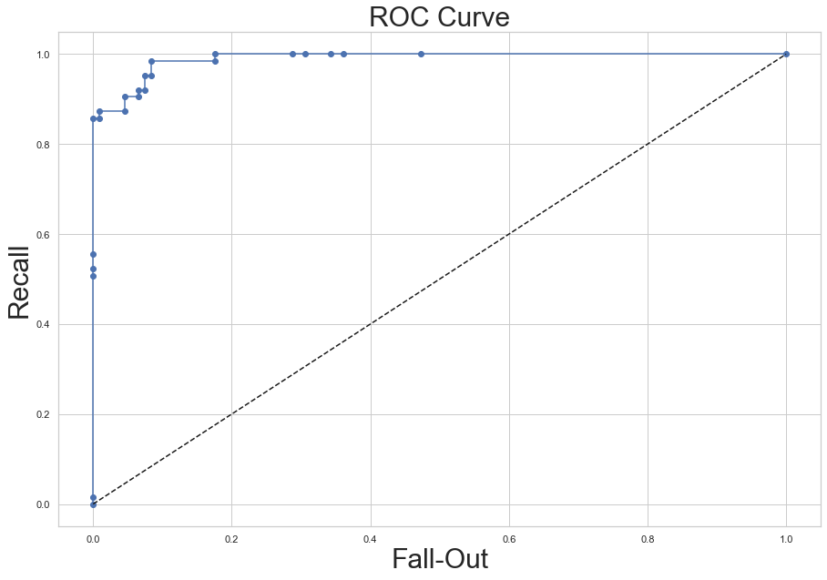


```python
from sklearn.metrics import auc

fpr1, tpr1, thresholds1 = roc_curve(y_test, qda.decision_function(X_test),pos_label = 'malignant')
fpr2, tpr2, thresholds2 = roc_curve(y_test, lda.decision_function(X_test),pos_label = 'malignant')
fpr3, tpr3, thresholds3 = roc_curve(y_test, NB.predict_proba(X_test)[:, 1],pos_label = 'malignant')
fpr4, tpr4, thresholds4 = roc_curve(y_test, Logit.predict_proba(X_test)[:, 1],pos_label = 'malignant')
fpr5, tpr5, thresholds5 = roc_curve(y_test, DT.predict_proba(X_test)[:, 1],pos_label = 'malignant')
fpr6, tpr6, thresholds6 = roc_curve(y_test, bagging.predict_proba(X_test)[:, 1],pos_label = 'malignant')

plt.figure(figsize=(15,10))
plt.plot(fpr1, tpr1, 'o-', ms=2, label="QDA")
plt.plot(fpr2, tpr2, 'o-', ms=2, label="LDA")
plt.plot(fpr3, tpr3, 'o-', ms=2, label="Naive-Bayes")
plt.plot(fpr4, tpr4, 'o-', ms=2, label="Logit")
plt.plot(fpr5, tpr5, 'o-', ms=2, label="Decision-Tree")
plt.plot(fpr6, tpr6, 'o-', ms=2, label="bagging_DT-base")
plt.legend(fontsize=30)
plt.plot([0, 1], [0, 1], 'k--', label="random guess")
plt.xlabel('Fall-Out',fontsize=30)
plt.ylabel('Recall',fontsize=30)
plt.title('ROC Curve',fontsize=30)
plt.show()

auc_qda = auc(fpr1,tpr1)
auc_lda = auc(fpr2,tpr2)
auc_NB = auc(fpr3,tpr3)
auc_Logit = auc(fpr4,tpr4)
auc_DT = auc(fpr5,tpr5)
auc_bagging = auc(fpr6,tpr6)
print("LDA의 AUC : {} / QDA의 AUC : {} / Naive-Bayes의 AUC : {} / Logistic : {} / DT : {} / bagging : {}".
      format(round(auc_lda,4),round(auc_qda,4),round(auc_NB,4),round(auc_Logit,4),round(auc_Logit,4),round(auc_bagging,4)))

```


    LDA의 AUC : 0.9957 / QDA의 AUC : 0.9802 / Naive-Bayes의 AUC : 0.9854 / Logistic : 0.9957 / DT : 0.9957 / bagging : 0.9896


### 7. Random Forest


```python
from sklearn.ensemble import RandomForestClassifier
```


```python
rf = RandomForestClassifier(max_depth=2,n_estimators=100,random_state=0).fit(X_train,y_train)
```


```python
from sklearn.metrics import confusion_matrix

y_pred = pd.DataFrame(rf.predict(X_test))

confusion_matrix(y_test, y_pred, labels=['benign','malignant'])
```


    array([[102,   6],
           [  5,  58]])


```python
from sklearn.metrics import classification_report

print(classification_report(y_test, y_pred, target_names=['benign','malignant']))
```

                  precision    recall  f1-score   support
    
          benign       0.95      0.94      0.95       108
       malignant       0.91      0.92      0.91        63
    
        accuracy                           0.94       171
       macro avg       0.93      0.93      0.93       171
    weighted avg       0.94      0.94      0.94       171
    


```python
from sklearn.metrics import roc_curve

# positive : malignant (음성) 설정
fpr, tpr, thresholds = roc_curve(y_test, rf.predict_proba(X_test)[:, 1], pos_label = 'malignant')
```


```python
%matplotlib inline
plt.figure(figsize=(15,10))
plt.plot(fpr, tpr, 'o-', label="random forest")
plt.plot([0, 1], [0, 1], 'k--', label="random guess")
plt.xlabel('Fall-Out',fontsize=30)
plt.ylabel('Recall',fontsize=30)
plt.title('ROC Curve',fontsize=30)
plt.show()
```


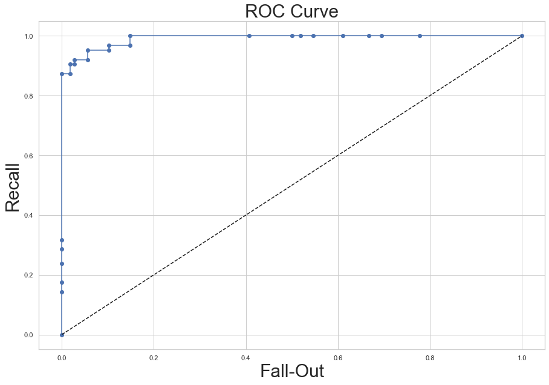


```python
from sklearn.metrics import auc

fpr1, tpr1, thresholds1 = roc_curve(y_test, qda.decision_function(X_test),pos_label = 'malignant')
fpr2, tpr2, thresholds2 = roc_curve(y_test, lda.decision_function(X_test),pos_label = 'malignant')
fpr3, tpr3, thresholds3 = roc_curve(y_test, NB.predict_proba(X_test)[:, 1],pos_label = 'malignant')
fpr4, tpr4, thresholds4 = roc_curve(y_test, Logit.predict_proba(X_test)[:, 1],pos_label = 'malignant')
fpr5, tpr5, thresholds5 = roc_curve(y_test, DT.predict_proba(X_test)[:, 1],pos_label = 'malignant')
fpr6, tpr6, thresholds6 = roc_curve(y_test, bagging.predict_proba(X_test)[:, 1],pos_label = 'malignant')
fpr7, tpr7, thresholds7 = roc_curve(y_test, rf.predict_proba(X_test)[:, 1],pos_label = 'malignant')

plt.figure(figsize=(15,10))
plt.plot(fpr1, tpr1, 'o-', ms=2, label="QDA")
plt.plot(fpr2, tpr2, 'o-', ms=2, label="LDA")
plt.plot(fpr3, tpr3, 'o-', ms=2, label="Naive-Bayes")
plt.plot(fpr4, tpr4, 'o-', ms=2, label="Logit")
plt.plot(fpr5, tpr5, 'o-', ms=2, label="Decision-Tree")
plt.plot(fpr6, tpr6, 'o-', ms=2, label="bagging_DT-base")
plt.plot(fpr7, tpr7, 'o-', ms=2, label="random forest")
plt.legend(fontsize=30)
plt.plot([0, 1], [0, 1], 'k--', label="random guess")
plt.xlabel('Fall-Out',fontsize=30)
plt.ylabel('Recall',fontsize=30)
plt.title('ROC Curve',fontsize=30)
plt.show()

auc_qda = auc(fpr1,tpr1)
auc_lda = auc(fpr2,tpr2)
auc_NB = auc(fpr3,tpr3)
auc_Logit = auc(fpr4,tpr4)
auc_DT = auc(fpr5,tpr5)
auc_bagging = auc(fpr6,tpr6)
auc_rf = auc(fpr7,tpr7)
print("LDA의 AUC : {} / QDA의 AUC : {} / Naive-Bayes의 AUC : {} / Logistic : {} / DT : {} / bagging : {} / rf : {}".
      format(round(auc_lda,4),round(auc_qda,4),round(auc_NB,4),round(auc_Logit,4),
             round(auc_Logit,4),round(auc_bagging,4),round(auc_rf,4)))

```


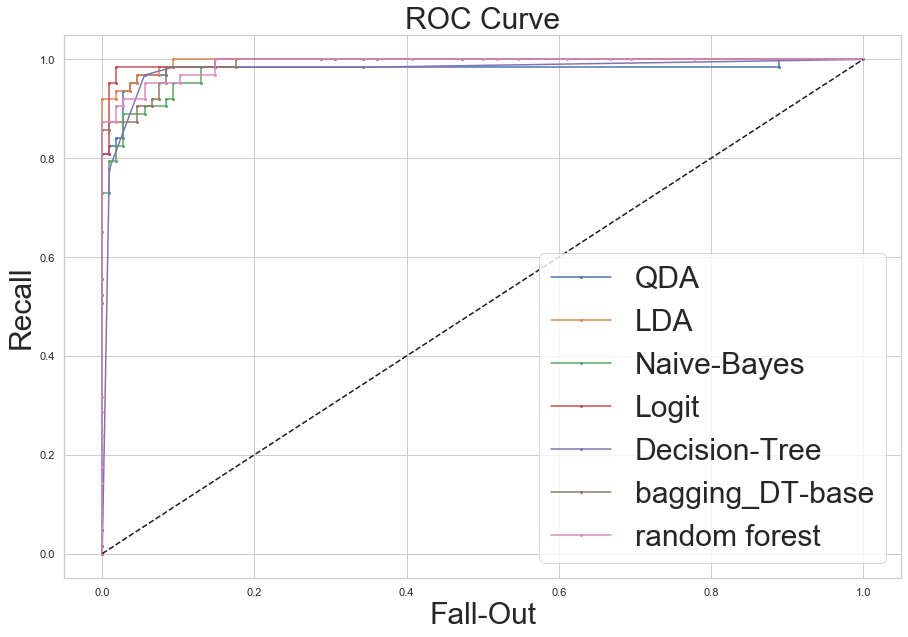


    LDA의 AUC : 0.9957 / QDA의 AUC : 0.9802 / Naive-Bayes의 AUC : 0.9854 / Logistic : 0.9957 / DT : 0.9957 / bagging : 0.9896 / rf : 0.9909


### 8. Ada boost


```python
from sklearn.ensemble import AdaBoostClassifier
```


```python
from sklearn.metrics import confusion_matrix

y_pred = pd.DataFrame(xgb.predict(X_test))

confusion_matrix(y_test, y_pred, labels=['benign','malignant'])
```


    array([[106,   2],
           [  5,  58]])


```python
from sklearn.metrics import classification_report

print(classification_report(y_test, y_pred, target_names=['benign','malignant']))
```

                  precision    recall  f1-score   support
    
          benign       0.95      0.98      0.97       108
       malignant       0.97      0.92      0.94        63
    
        accuracy                           0.96       171
       macro avg       0.96      0.95      0.96       171
    weighted avg       0.96      0.96      0.96       171
    


```python
from sklearn.metrics import roc_curve

# positive : malignant (음성) 설정
fpr, tpr, thresholds = roc_curve(y_test, xgb.predict_proba(X_test)[:, 1], pos_label = 'malignant')
```


```python
%matplotlib inline
plt.figure(figsize=(15,10))
plt.plot(fpr, tpr, 'o-', label="XGoost")
plt.plot([0, 1], [0, 1], 'k--', label="random guess")
plt.xlabel('Fall-Out',fontsize=30)
plt.ylabel('Recall',fontsize=30)
plt.title('ROC Curve',fontsize=30)
plt.show()
```


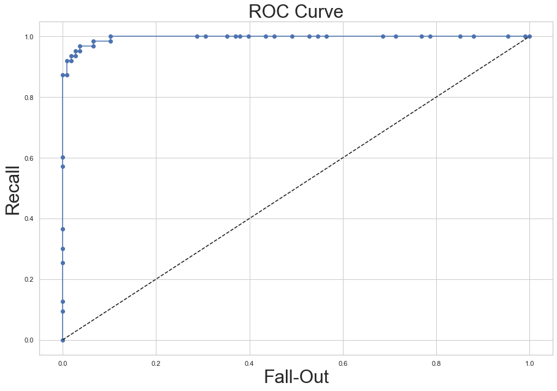


```python
from sklearn.metrics import auc

fpr1, tpr1, thresholds1 = roc_curve(y_test, qda.decision_function(X_test),pos_label = 'malignant')
fpr2, tpr2, thresholds2 = roc_curve(y_test, lda.decision_function(X_test),pos_label = 'malignant')
fpr3, tpr3, thresholds3 = roc_curve(y_test, NB.predict_proba(X_test)[:, 1],pos_label = 'malignant')
fpr4, tpr4, thresholds4 = roc_curve(y_test, Logit.predict_proba(X_test)[:, 1],pos_label = 'malignant')
fpr5, tpr5, thresholds5 = roc_curve(y_test, DT.predict_proba(X_test)[:, 1],pos_label = 'malignant')
fpr6, tpr6, thresholds6 = roc_curve(y_test, bagging.predict_proba(X_test)[:, 1],pos_label = 'malignant')
fpr7, tpr7, thresholds7 = roc_curve(y_test, rf.predict_proba(X_test)[:, 1],pos_label = 'malignant')
fpr8, tpr8, thresholds8 = roc_curve(y_test, ada.predict_proba(X_test)[:, 1],pos_label = 'malignant')
fpr9, tpr9, thresholds9 = roc_curve(y_test, xgb.predict_proba(X_test)[:, 1],pos_label = 'malignant')

plt.figure(figsize=(15,10))
plt.plot(fpr1, tpr1, 'o-', ms=2, label="QDA")
plt.plot(fpr2, tpr2, 'o-', ms=2, label="LDA")
plt.plot(fpr3, tpr3, 'o-', ms=2, label="Naive-Bayes")
plt.plot(fpr4, tpr4, 'o-', ms=2, label="Logit")
plt.plot(fpr5, tpr5, 'o-', ms=2, label="Decision-Tree")
plt.plot(fpr6, tpr6, 'o-', ms=2, label="bagging_DT-base")
plt.plot(fpr7, tpr7, 'o-', ms=2, label="random forest")
plt.plot(fpr8, tpr8, 'o-', ms=2, label="Ada Boost")
plt.plot(fpr9, tpr9, 'o-', ms=2, label="XGBoost")
plt.legend(fontsize=30)
plt.plot([0, 1], [0, 1], 'k--', label="random guess")
plt.xlabel('Fall-Out',fontsize=30)
plt.ylabel('Recall',fontsize=30)
plt.title('ROC Curve',fontsize=30)
plt.show()

auc_qda = auc(fpr1,tpr1)
auc_lda = auc(fpr2,tpr2)
auc_NB = auc(fpr3,tpr3)
auc_Logit = auc(fpr4,tpr4)
auc_DT = auc(fpr5,tpr5)
auc_bagging = auc(fpr6,tpr6)
auc_rf = auc(fpr7,tpr7)
auc_ada = auc(fpr8,tpr8)
auc_xgb = auc(fpr9,tpr9)
print("LDA의 AUC : {} / QDA의 AUC : {} / Naive-Bayes의 AUC : {} / Logistic : {} / DT : {} / bagging : {} / rf : {} / ada : {}".
      format(round(auc_lda,4),round(auc_qda,4),round(auc_NB,4),round(auc_Logit,4),
             round(auc_Logit,4),round(auc_bagging,4),round(auc_rf,4),round(auc_ada,4),round(auc_xgb,4)))

```


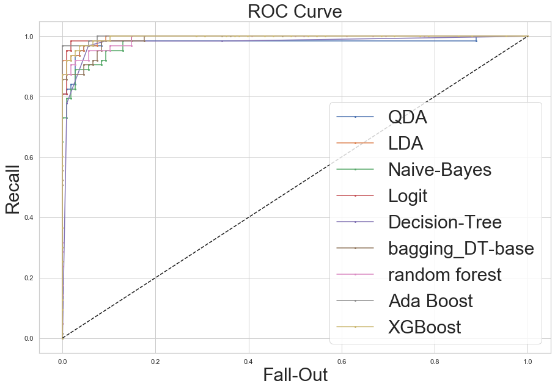


    LDA의 AUC : 0.9957 / QDA의 AUC : 0.9802 / Naive-Bayes의 AUC : 0.9854 / Logistic : 0.9957 / DT : 0.9957 / bagging : 0.9896 / rf : 0.9909 / ada : 0.9979


### 8. Gradient boost (XGBoost)


```python
# conda install py-xgboost
```


```python
import xgboost
```


```python
xgb = xgboost.XGBClassifier(n_extimators = 100, max_depth = 1, random_state = 0).fit(X_train,y_train)
```


```python
from sklearn.metrics import confusion_matrix

y_pred = pd.DataFrame(xgb.predict(X_test))

confusion_matrix(y_test, y_pred, labels=['benign','malignant'])
```


    array([[106,   2],
           [  5,  58]])


```python
from sklearn.metrics import classification_report

print(classification_report(y_test, y_pred, target_names=['benign','malignant']))
```

                  precision    recall  f1-score   support
    
          benign       0.95      0.98      0.97       108
       malignant       0.97      0.92      0.94        63
    
        accuracy                           0.96       171
       macro avg       0.96      0.95      0.96       171
    weighted avg       0.96      0.96      0.96       171
    


```python
from sklearn.metrics import roc_curve

# positive : malignant (음성) 설정
fpr, tpr, thresholds = roc_curve(y_test, xgb.predict_proba(X_test)[:, 1], pos_label = 'malignant')
```


```python
%matplotlib inline
plt.figure(figsize=(15,10))
plt.plot(fpr, tpr, 'o-', label="XGoost")
plt.plot([0, 1], [0, 1], 'k--', label="random guess")
plt.xlabel('Fall-Out',fontsize=30)
plt.ylabel('Recall',fontsize=30)
plt.title('ROC Curve',fontsize=30)
plt.show()
```


```python
from sklearn.metrics import auc

fpr1, tpr1, thresholds1 = roc_curve(y_test, qda.decision_function(X_test),pos_label = 'malignant')
fpr2, tpr2, thresholds2 = roc_curve(y_test, lda.decision_function(X_test),pos_label = 'malignant')
fpr3, tpr3, thresholds3 = roc_curve(y_test, NB.predict_proba(X_test)[:, 1],pos_label = 'malignant')
fpr4, tpr4, thresholds4 = roc_curve(y_test, Logit.predict_proba(X_test)[:, 1],pos_label = 'malignant')
fpr5, tpr5, thresholds5 = roc_curve(y_test, DT.predict_proba(X_test)[:, 1],pos_label = 'malignant')
fpr6, tpr6, thresholds6 = roc_curve(y_test, bagging.predict_proba(X_test)[:, 1],pos_label = 'malignant')
fpr7, tpr7, thresholds7 = roc_curve(y_test, rf.predict_proba(X_test)[:, 1],pos_label = 'malignant')
fpr8, tpr8, thresholds8 = roc_curve(y_test, ada.predict_proba(X_test)[:, 1],pos_label = 'malignant')
fpr9, tpr9, thresholds9 = roc_curve(y_test, xgb.predict_proba(X_test)[:, 1],pos_label = 'malignant')

plt.figure(figsize=(15,10))
plt.plot(fpr1, tpr1, 'o-', ms=2, label="QDA")
plt.plot(fpr2, tpr2, 'o-', ms=2, label="LDA")
plt.plot(fpr3, tpr3, 'o-', ms=2, label="Naive-Bayes")
plt.plot(fpr4, tpr4, 'o-', ms=2, label="Logit")
plt.plot(fpr5, tpr5, 'o-', ms=2, label="Decision-Tree")
plt.plot(fpr6, tpr6, 'o-', ms=2, label="bagging_DT-base")
plt.plot(fpr7, tpr7, 'o-', ms=2, label="random forest")
plt.plot(fpr8, tpr8, 'o-', ms=2, label="Ada Boost")
plt.plot(fpr9, tpr9, 'o-', ms=2, label="XGBoost")
plt.legend(fontsize=30)
plt.plot([0, 1], [0, 1], 'k--', label="random guess")
plt.xlabel('Fall-Out',fontsize=30)
plt.ylabel('Recall',fontsize=30)
plt.title('ROC Curve',fontsize=30)
plt.show()

auc_qda = auc(fpr1,tpr1)
auc_lda = auc(fpr2,tpr2)
auc_NB = auc(fpr3,tpr3)
auc_Logit = auc(fpr4,tpr4)
auc_DT = auc(fpr5,tpr5)
auc_bagging = auc(fpr6,tpr6)
auc_rf = auc(fpr7,tpr7)
auc_ada = auc(fpr8,tpr8)
auc_xgb = auc(fpr9,tpr9)
print("LDA의 AUC : {} / QDA의 AUC : {} / Naive-Bayes의 AUC : {} / Logistic : {} / DT : {} / bagging : {} / rf : {} / ada : {} / xgb : {}".
      format(round(auc_lda,4),round(auc_qda,4),round(auc_NB,4),round(auc_Logit,4),
             round(auc_Logit,4),round(auc_bagging,4),round(auc_rf,4),round(auc_ada,4),round(auc_xgb,4)))

```


    LDA의 AUC : 0.9957 / QDA의 AUC : 0.9802 / Naive-Bayes의 AUC : 0.9854 / Logistic : 0.9957 / DT : 0.9957 / bagging : 0.9896 / rf : 0.9909 / ada : 0.9979 / xgb : 0.9956


### 9. Gradient boost (LightGBM)


```python
# conda install py-lightgbm
# !pip install lightgbm
# !pip install lightgbm
```

    DEPRECATION: Python 2.7 reached the end of its life on January 1st, 2020. Please upgrade your Python as Python 2.7 is no longer maintained. pip 21.0 will drop support for Python 2.7 in January 2021. More details about Python 2 support in pip, can be found at https://pip.pypa.io/en/latest/development/release-process/#python-2-support
    Defaulting to user installation because normal site-packages is not writeable
    Requirement already satisfied: lightgbm in /Users/kimjeongseob/Library/Python/2.7/lib/python/site-packages (2.3.1)
    Requirement already satisfied: scikit-learn in /Users/kimjeongseob/Library/Python/2.7/lib/python/site-packages (from lightgbm) (0.20.4)
    Requirement already satisfied: scipy in /System/Library/Frameworks/Python.framework/Versions/2.7/Extras/lib/python (from lightgbm) (0.13.0b1)
    Requirement already satisfied: numpy in /Users/kimjeongseob/Library/Python/2.7/lib/python/site-packages (from lightgbm) (1.16.6)


```python
import lightgbm
```


    ---------------------------------------------------------------------------

    ModuleNotFoundError                       Traceback (most recent call last)

    <ipython-input-132-b18b3f8a6dc8> in <module>
    ----> 1 import lightgbm
    

    ModuleNotFoundError: No module named 'lightgbm'


```python

```


```python

```


```python

```


```python

```


```python

```


```python

```


```python

```


```python

```


```python

```
