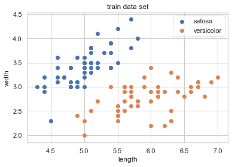
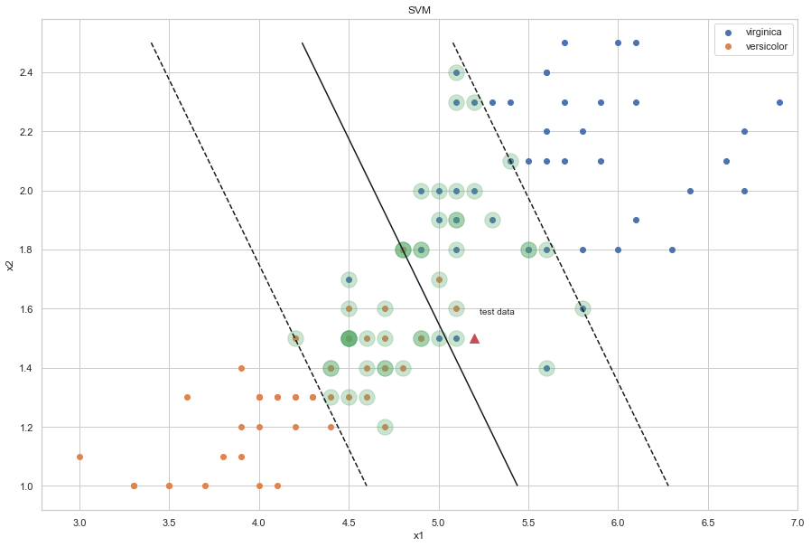

# 10.02 SVM 실습(sklearn)

    - iris dataset example
    
    

### 1. IRIS dataset 실습 - SVM predict model

```
특징 변수를 꽃받침의 길이와 폭만 사용
붓꽃 종을 Setosa와 Versicolour만 대상으로 함
```


```python
# 1. 데이터 로드
from sklearn.datasets import load_iris

data_ = load_iris()
dir(data_)

# 2. 데이터프레임 생성
data = pd.DataFrame(data_.data,columns = data_.feature_names)

# 3. species 데이터 시리즈 생성 -> species 종으로 데이터 프레임 결합
sy = pd.Series(data_.target,dtype = 'category')
sy = sy.cat.rename_categories(data_.target_names)

data['species'] = sy
data
```


<div>
<style scoped>
    .dataframe tbody tr th:only-of-type {
        vertical-align: middle;
    }

    .dataframe tbody tr th {
        vertical-align: top;
    }

    .dataframe thead th {
        text-align: right;
    }
</style>
<table border="1" class="dataframe">
  <thead>
    <tr style="text-align: right;">
      <th></th>
      <th>sepal length (cm)</th>
      <th>sepal width (cm)</th>
      <th>petal length (cm)</th>
      <th>petal width (cm)</th>
      <th>species</th>
    </tr>
  </thead>
  <tbody>
    <tr>
      <th>0</th>
      <td>5.1</td>
      <td>3.5</td>
      <td>1.4</td>
      <td>0.2</td>
      <td>setosa</td>
    </tr>
    <tr>
      <th>1</th>
      <td>4.9</td>
      <td>3.0</td>
      <td>1.4</td>
      <td>0.2</td>
      <td>setosa</td>
    </tr>
    <tr>
      <th>2</th>
      <td>4.7</td>
      <td>3.2</td>
      <td>1.3</td>
      <td>0.2</td>
      <td>setosa</td>
    </tr>
    <tr>
      <th>3</th>
      <td>4.6</td>
      <td>3.1</td>
      <td>1.5</td>
      <td>0.2</td>
      <td>setosa</td>
    </tr>
    <tr>
      <th>4</th>
      <td>5.0</td>
      <td>3.6</td>
      <td>1.4</td>
      <td>0.2</td>
      <td>setosa</td>
    </tr>
    <tr>
      <th>...</th>
      <td>...</td>
      <td>...</td>
      <td>...</td>
      <td>...</td>
      <td>...</td>
    </tr>
    <tr>
      <th>145</th>
      <td>6.7</td>
      <td>3.0</td>
      <td>5.2</td>
      <td>2.3</td>
      <td>virginica</td>
    </tr>
    <tr>
      <th>146</th>
      <td>6.3</td>
      <td>2.5</td>
      <td>5.0</td>
      <td>1.9</td>
      <td>virginica</td>
    </tr>
    <tr>
      <th>147</th>
      <td>6.5</td>
      <td>3.0</td>
      <td>5.2</td>
      <td>2.0</td>
      <td>virginica</td>
    </tr>
    <tr>
      <th>148</th>
      <td>6.2</td>
      <td>3.4</td>
      <td>5.4</td>
      <td>2.3</td>
      <td>virginica</td>
    </tr>
    <tr>
      <th>149</th>
      <td>5.9</td>
      <td>3.0</td>
      <td>5.1</td>
      <td>1.8</td>
      <td>virginica</td>
    </tr>
  </tbody>
</table>
<p>150 rows × 5 columns</p>
</div>


```python
# 4. 독립변수 2차원, 종속변수 2차원(species)으로 데이터 축소

data2 = data[['sepal length (cm)','sepal width (cm)','species']]
data2 = data2[data2['species'] != 'virginica']
data2
```


<div>
<style scoped>
    .dataframe tbody tr th:only-of-type {
        vertical-align: middle;
    }

    .dataframe tbody tr th {
        vertical-align: top;
    }

    .dataframe thead th {
        text-align: right;
    }
</style>
<table border="1" class="dataframe">
  <thead>
    <tr style="text-align: right;">
      <th></th>
      <th>sepal length (cm)</th>
      <th>sepal width (cm)</th>
      <th>species</th>
    </tr>
  </thead>
  <tbody>
    <tr>
      <th>0</th>
      <td>5.1</td>
      <td>3.5</td>
      <td>setosa</td>
    </tr>
    <tr>
      <th>1</th>
      <td>4.9</td>
      <td>3.0</td>
      <td>setosa</td>
    </tr>
    <tr>
      <th>2</th>
      <td>4.7</td>
      <td>3.2</td>
      <td>setosa</td>
    </tr>
    <tr>
      <th>3</th>
      <td>4.6</td>
      <td>3.1</td>
      <td>setosa</td>
    </tr>
    <tr>
      <th>4</th>
      <td>5.0</td>
      <td>3.6</td>
      <td>setosa</td>
    </tr>
    <tr>
      <th>...</th>
      <td>...</td>
      <td>...</td>
      <td>...</td>
    </tr>
    <tr>
      <th>95</th>
      <td>5.7</td>
      <td>3.0</td>
      <td>versicolor</td>
    </tr>
    <tr>
      <th>96</th>
      <td>5.7</td>
      <td>2.9</td>
      <td>versicolor</td>
    </tr>
    <tr>
      <th>97</th>
      <td>6.2</td>
      <td>2.9</td>
      <td>versicolor</td>
    </tr>
    <tr>
      <th>98</th>
      <td>5.1</td>
      <td>2.5</td>
      <td>versicolor</td>
    </tr>
    <tr>
      <th>99</th>
      <td>5.7</td>
      <td>2.8</td>
      <td>versicolor</td>
    </tr>
  </tbody>
</table>
<p>100 rows × 3 columns</p>
</div>


```python
# 종속변수, 독립변수 데이터셋 분리

X = data2[['sepal length (cm)','sepal width (cm)']]
y = data2['species']
```


```python
# 5. 데이터 셋 분포 확인 위해 scatter plot 도표

plt.scatter(data2['sepal length (cm)'][data2.species == 'setosa'], data2['sepal width (cm)'][data2.species == 'setosa'], marker='o', label="setosa")
plt.scatter(data2['sepal length (cm)'][data2.species == 'versicolor'], data2['sepal width (cm)'][data2.species == 'versicolor'], marker='o', label="versicolor")
plt.xlabel("length")
plt.ylabel("width")
plt.legend()
plt.title('train data set')
plt.show()
```





```python
# 6. SVC 클래스 활용한 SVM 학습

from sklearn.svm import SVC
model = SVC(kernel='linear', C=1e10).fit(X, y)
```


```python
# 7. 훈련 결과 확인

print("클래스 별 서포트 벡터 갯수 : {}".format(model.n_support_))
print("클래스 별 서포트 벡터 위치 : {}".format(model.support_))
print("클래스 별 서포트 벡터 값 : {}".format(model.support_vectors_))
print("클래스 별 서포트 벡터 클래스 값 : {}".format(y[model.support_]))
```

    클래스 별 서포트 벡터 갯수 : [2 2]
    클래스 별 서포트 벡터 위치 : [36 41 57 84]
    클래스 별 서포트 벡터 값 : [[5.5 3.5]
     [4.5 2.3]
     [4.9 2.4]
     [5.4 3. ]]
    클래스 별 서포트 벡터 클래스 값 : 36        setosa
    41        setosa
    57    versicolor
    84    versicolor
    Name: species, dtype: category
    Categories (3, object): [setosa, versicolor, virginica]


```python
# 8. SVM 경계선 및 현황 시각화

plt.figure(figsize=(15,10))

xx = np.linspace(4, 7, 10)
yy = np.linspace(2, 4.5, 10)
X1, X2 = np.meshgrid(xx, yy)

Z = np.empty(X1.shape)
for (i, j), val in np.ndenumerate(X1):
    x1 = val
    x2 = X2[i, j]
    p = model.decision_function([[x1, x2]])
    Z[i, j] = p[0]
levels = [-1, 0, 1]
linestyles = ['dashed', 'solid', 'dashed']
plt.scatter(data2['sepal length (cm)'][data2.species == 'setosa'], data2['sepal width (cm)'][data2.species == 'setosa'], marker='o', label="setosa")
plt.scatter(data2['sepal length (cm)'][data2.species == 'versicolor'], data2['sepal width (cm)'][data2.species == 'versicolor'], marker='o', label="versicolor")
plt.contour(X1, X2, Z, levels, colors='k', linestyles=linestyles)
plt.scatter(model.support_vectors_[:, 0], model.support_vectors_[:, 1], s=300, alpha=0.3)

x_new = [5.5, 3.3]
plt.scatter(x_new[0], x_new[1], marker='^', s=100)
plt.text(x_new[0] + 0.03, x_new[1] + 0.08, "test data")

plt.xlabel("x1")
plt.ylabel("x2")
plt.legend()
plt.title("SVM")

plt.show()
```


```python
# 9. test data predict

x_new = [[5.5,3.3]]

model.predict(x_new)
```


    array(['versicolor'], dtype=object)


### 2. IRIS dataset 실습 - SVM predict model
    
###    slack variable 변화

```
특징 변수를 꽃잎 길이와 폭만 사용
붓꽃 종을 virginica와 Versicolour만 대상으로 함
```


```python
# 0. 독립변수 2차원, 종속변수 2차원(species)으로 데이터 축소

data3 = data[['petal length (cm)','petal width (cm)','species']]
data3 = data3[data3['species'] != 'setosa']
data3
```


<div>
<style scoped>
    .dataframe tbody tr th:only-of-type {
        vertical-align: middle;
    }

    .dataframe tbody tr th {
        vertical-align: top;
    }

    .dataframe thead th {
        text-align: right;
    }
</style>
<table border="1" class="dataframe">
  <thead>
    <tr style="text-align: right;">
      <th></th>
      <th>petal length (cm)</th>
      <th>petal width (cm)</th>
      <th>species</th>
    </tr>
  </thead>
  <tbody>
    <tr>
      <th>50</th>
      <td>4.7</td>
      <td>1.4</td>
      <td>versicolor</td>
    </tr>
    <tr>
      <th>51</th>
      <td>4.5</td>
      <td>1.5</td>
      <td>versicolor</td>
    </tr>
    <tr>
      <th>52</th>
      <td>4.9</td>
      <td>1.5</td>
      <td>versicolor</td>
    </tr>
    <tr>
      <th>53</th>
      <td>4.0</td>
      <td>1.3</td>
      <td>versicolor</td>
    </tr>
    <tr>
      <th>54</th>
      <td>4.6</td>
      <td>1.5</td>
      <td>versicolor</td>
    </tr>
    <tr>
      <th>...</th>
      <td>...</td>
      <td>...</td>
      <td>...</td>
    </tr>
    <tr>
      <th>145</th>
      <td>5.2</td>
      <td>2.3</td>
      <td>virginica</td>
    </tr>
    <tr>
      <th>146</th>
      <td>5.0</td>
      <td>1.9</td>
      <td>virginica</td>
    </tr>
    <tr>
      <th>147</th>
      <td>5.2</td>
      <td>2.0</td>
      <td>virginica</td>
    </tr>
    <tr>
      <th>148</th>
      <td>5.4</td>
      <td>2.3</td>
      <td>virginica</td>
    </tr>
    <tr>
      <th>149</th>
      <td>5.1</td>
      <td>1.8</td>
      <td>virginica</td>
    </tr>
  </tbody>
</table>
<p>100 rows × 3 columns</p>
</div>


```python
# 1. 종속변수, 독립변수 데이터셋 분리

X_new = data3[['petal length (cm)','petal width (cm)']]
y_new = data3[data3['species']!='setosa'].species
```


```python
# 1-1. 데이터셋의 인덱스 초기화

X_new = X_new.reset_index().drop(columns=['index'])
y_new = y_new.reset_index().drop(columns=['index'])
```


```python
# 1-2. 데이터셋의 인덱스 초기화 -> 시리즈 형태로 변화

y_new_ = list(y_new.species)
y_new = pd.Series(y_new_)
y_new
```


    0     versicolor
    1     versicolor
    2     versicolor
    3     versicolor
    4     versicolor
             ...    
    95     virginica
    96     virginica
    97     virginica
    98     virginica
    99     virginica
    Length: 100, dtype: object


```python
# 2. 데이터 셋 분포 확인 위해 scatter plot 도표

plt.scatter(data3['petal length (cm)'][data3.species == 'virginica'], data3['petal width (cm)'][data3.species == 'virginica'], marker='o', label="virginica")
plt.scatter(data3['petal length (cm)'][data3.species == 'versicolor'], data3['petal width (cm)'][data3.species == 'versicolor'], marker='o', label="versicolor")
plt.xlabel("length")
plt.ylabel("width")
plt.legend()
plt.title('train data set')
plt.show()
```


```python
# 3. SVC 클래스 활용한 SVM 학습

from sklearn.svm import SVC
model_new = SVC(kernel='linear', C=10).fit(X_new, y_new)
model_new_smallc = SVC(kernel='linear', C=0.1).fit(X_new, y_new)
```


```python
# 7. 훈련 결과 확인

print("클래스 별 서포트 벡터 갯수 : {}".format(model_new.n_support_))
print("클래스 별 서포트 벡터 위치 : {}".format(model_new.support_))
print("클래스 별 서포트 벡터 값 : {}".format(model_new.support_vectors_))
print("클래스 별 서포트 벡터 클래스 값 : {}".format(y_new[model_new.support_]))
```

    클래스 별 서포트 벡터 갯수 : [7 8]
    클래스 별 서포트 벡터 위치 : [ 2  6 20 22 27 33 36 56 69 73 76 77 83 84 88]
    클래스 별 서포트 벡터 값 : [[4.9 1.5]
     [4.7 1.6]
     [4.8 1.8]
     [4.9 1.5]
     [5.  1.7]
     [5.1 1.6]
     [4.7 1.5]
     [4.5 1.7]
     [5.  1.5]
     [4.9 1.8]
     [4.8 1.8]
     [4.9 1.8]
     [5.1 1.5]
     [5.6 1.4]
     [4.8 1.8]]
    클래스 별 서포트 벡터 클래스 값 : 2     versicolor
    6     versicolor
    20    versicolor
    22    versicolor
    27    versicolor
    33    versicolor
    36    versicolor
    56     virginica
    69     virginica
    73     virginica
    76     virginica
    77     virginica
    83     virginica
    84     virginica
    88     virginica
    dtype: object


```python
# 8. SVM 경계선 및 현황 시각화

plt.figure(figsize=(15,10))

xx = np.linspace(3, 7, 10)
yy = np.linspace(1, 2.5, 10)
X1, X2 = np.meshgrid(xx, yy)

Z = np.empty(X1.shape)
for (i, j), val in np.ndenumerate(X1):
    x1 = val
    x2 = X2[i, j]
    p = model_new.decision_function([[x1, x2]])
    Z[i, j] = p[0]
levels = [-1, 0, 1]
linestyles = ['dashed', 'solid', 'dashed']
plt.scatter(data3['petal length (cm)'][data3.species == 'virginica'], data3['petal width (cm)'][data3.species == 'virginica'], marker='o', label="virginica")
plt.scatter(data3['petal length (cm)'][data3.species == 'versicolor'], data3['petal width (cm)'][data3.species == 'versicolor'], marker='o', label="versicolor")
plt.contour(X1, X2, Z, levels, colors='k', linestyles=linestyles)
plt.scatter(model_new.support_vectors_[:, 0], model_new.support_vectors_[:, 1], s=300, alpha=0.3)

x_new = [5.2, 1.5]
plt.scatter(x_new[0], x_new[1], marker='^', s=100)
plt.text(x_new[0] + 0.03, x_new[1] + 0.08, "test data")

plt.xlabel("x1")
plt.ylabel("x2")
plt.legend()
plt.title("SVM")

plt.show()
```


```python
# 8. SVM 경계선 및 현황 시각화 (small C)
# 시사점 : small C 의 경우, 마진이 넓어지며 안정적인 경계선을 갖게 됨을 확인 가능 -> 보다 새로운 데이터에도 안정적인 성능을 내는 모델이 될 것.

plt.figure(figsize=(15,10))

xx = np.linspace(3, 7, 10)
yy = np.linspace(1, 2.5, 10)
X1, X2 = np.meshgrid(xx, yy)

Z = np.empty(X1.shape)
for (i, j), val in np.ndenumerate(X1):
    x1 = val
    x2 = X2[i, j]
    p = model_new_smallc.decision_function([[x1, x2]])
    Z[i, j] = p[0]
levels = [-1, 0, 1]
linestyles = ['dashed', 'solid', 'dashed']
plt.scatter(data3['petal length (cm)'][data3.species == 'virginica'], data3['petal width (cm)'][data3.species == 'virginica'], marker='o', label="virginica")
plt.scatter(data3['petal length (cm)'][data3.species == 'versicolor'], data3['petal width (cm)'][data3.species == 'versicolor'], marker='o', label="versicolor")
plt.contour(X1, X2, Z, levels, colors='k', linestyles=linestyles)
plt.scatter(model_new_smallc.support_vectors_[:, 0], model_new_smallc.support_vectors_[:, 1], s=300, alpha=0.3)

x_new = [5.2, 1.5]
plt.scatter(x_new[0], x_new[1], marker='^', s=100)
plt.text(x_new[0] + 0.03, x_new[1] + 0.08, "test data")

plt.xlabel("x1")
plt.ylabel("x2")
plt.legend()
plt.title("SVM")

plt.show()
```





```python
print("클래스 별 서포트 벡터 갯수 : {}".format(model_new_smallc.n_support_))
```

    클래스 별 서포트 벡터 갯수 : [25 25]


```python
print("클래스 별 서포트 벡터 갯수 : {}".format(model_new_smallc.n_support_))
print("클래스 별 서포트 벡터 위치 : {}".format(model_new_smallc.support_))
print("클래스 별 서포트 벡터 클래스 값 : {}".format(y_new[model_new_smallc.support_]))
```

    클래스 별 서포트 벡터 갯수 : [25 25]
    클래스 별 서포트 벡터 위치 : [ 0  1  2  4  5  6  8 11 13 15 16 18 20 22 23 25 26 27 28 33 34 35 36 37
     41 51 53 56 60 61 63 64 66 69 71 73 76 77 79 83 84 87 88 89 91 92 95 96
     97 99]
    클래스 별 서포트 벡터 클래스 값 : 0     versicolor
    1     versicolor
    2     versicolor
    4     versicolor
    5     versicolor
    6     versicolor
    8     versicolor
    11    versicolor
    13    versicolor
    15    versicolor
    16    versicolor
    18    versicolor
    20    versicolor
    22    versicolor
    23    versicolor
    25    versicolor
    26    versicolor
    27    versicolor
    28    versicolor
    33    versicolor
    34    versicolor
    35    versicolor
    36    versicolor
    37    versicolor
    41    versicolor
    51     virginica
    53     virginica
    56     virginica
    60     virginica
    61     virginica
    63     virginica
    64     virginica
    66     virginica
    69     virginica
    71     virginica
    73     virginica
    76     virginica
    77     virginica
    79     virginica
    83     virginica
    84     virginica
    87     virginica
    88     virginica
    89     virginica
    91     virginica
    92     virginica
    95     virginica
    96     virginica
    97     virginica
    99     virginica
    dtype: object


### 3. MNIST Digit Image 실습 - SVM predict model


```python
# 1. 데이터 로드 및 시각화 확인

from sklearn.datasets import load_digits
digits = load_digits()

N = 2
M = 5
np.random.seed(0)
fig = plt.figure(figsize=(9, 5))
plt.subplots_adjust(top=1, bottom=0, hspace=0, wspace=0.05)
klist = np.random.choice(range(len(digits.data)), N * M)
for i in range(N):
    for j in range(M):
        k = klist[i * M + j]
        ax = fig.add_subplot(N, M, i * M + j + 1)
        ax.imshow(digits.images[k], cmap=plt.cm.bone)
        ax.grid(False)
        ax.xaxis.set_ticks([])
        ax.yaxis.set_ticks([])
        plt.title(digits.target[k])
plt.tight_layout()
plt.show()
```


```python
# 2. train-test set 분리 + train set 학습(SVM - SVC클래스 활용)

from sklearn.model_selection import train_test_split
X_train, X_test, y_train, y_test = train_test_split(digits.data, digits.target, test_size=0.4, random_state=0)

from sklearn.svm import SVC
svc = SVC(kernel='linear').fit(X_train, y_train)
```


```python
# 3. 실제 값 vs 예측 값(SVM) 비교

N = 2
M = 5
np.random.seed(4)
fig = plt.figure(figsize=(9, 5))
plt.subplots_adjust(top=1, bottom=0, hspace=0, wspace=0.05)
klist = np.random.choice(range(len(y_test)), N * M)
for i in range(N):
    for j in range(M):
        k = klist[i * M + j]
        ax = fig.add_subplot(N, M, i * M + j + 1)
        ax.imshow(X_test[k:(k + 1), :].reshape(8,8), cmap=plt.cm.bone)
        ax.grid(False)
        ax.xaxis.set_ticks([])
        ax.yaxis.set_ticks([])
        plt.title("%d => %d" %
                  (y_test[k], svc.predict(X_test[k:(k + 1), :])[0]))
plt.tight_layout()
plt.show()
```


```python
# 4. 성능 확인

from sklearn.metrics import classification_report, accuracy_score

y_pred_train = svc.predict(X_train)
y_pred_test = svc.predict(X_test)
```


```python
# train set 대상 분류 성능은 100%

print(classification_report(y_train, y_pred_train))
```

                  precision    recall  f1-score   support
    
               0       1.00      1.00      1.00       118
               1       1.00      1.00      1.00       109
               2       1.00      1.00      1.00       106
               3       1.00      1.00      1.00       113
               4       1.00      1.00      1.00       118
               5       1.00      1.00      1.00        93
               6       1.00      1.00      1.00       105
               7       1.00      1.00      1.00       114
               8       1.00      1.00      1.00        96
               9       1.00      1.00      1.00       106
    
        accuracy                           1.00      1078
       macro avg       1.00      1.00      1.00      1078
    weighted avg       1.00      1.00      1.00      1078
    


```python
# test set 대상 분류 성능은 약간 오차가 있음

print(classification_report(y_test, y_pred_test))
```

                  precision    recall  f1-score   support
    
               0       1.00      1.00      1.00        60
               1       0.95      0.97      0.96        73
               2       1.00      0.99      0.99        71
               3       0.95      0.99      0.97        70
               4       0.98      1.00      0.99        63
               5       0.97      0.97      0.97        89
               6       0.99      0.99      0.99        76
               7       1.00      0.98      0.99        65
               8       0.96      0.92      0.94        78
               9       0.97      0.96      0.97        74
    
        accuracy                           0.97       719
       macro avg       0.98      0.98      0.98       719
    weighted avg       0.98      0.97      0.97       719
    

