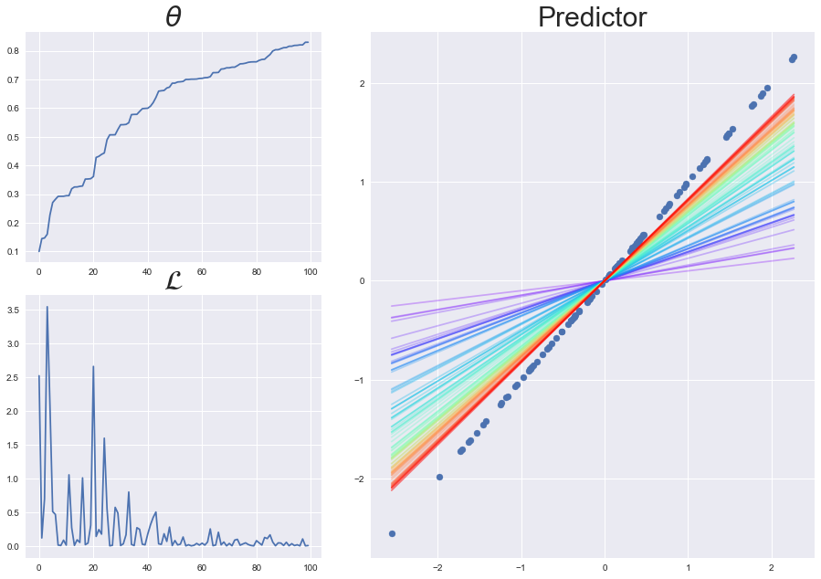
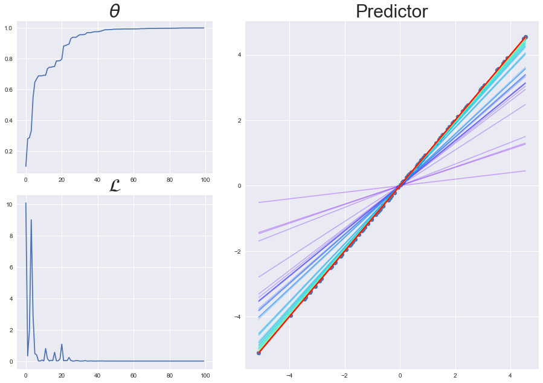
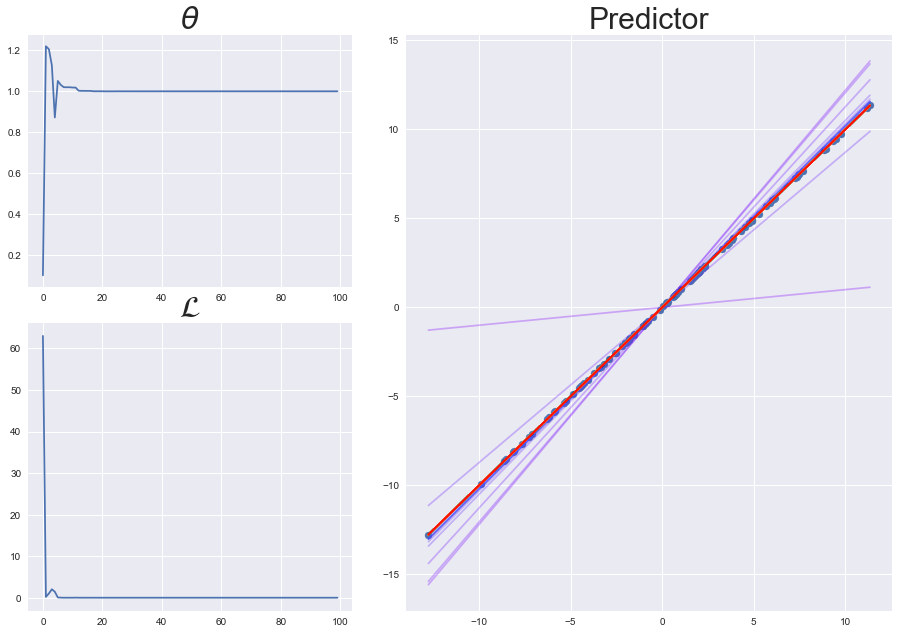
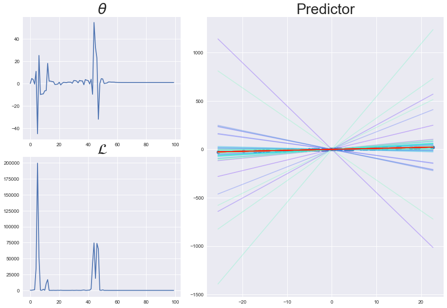
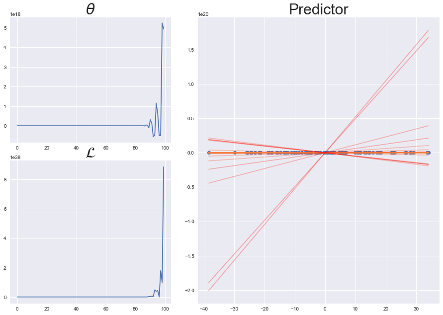
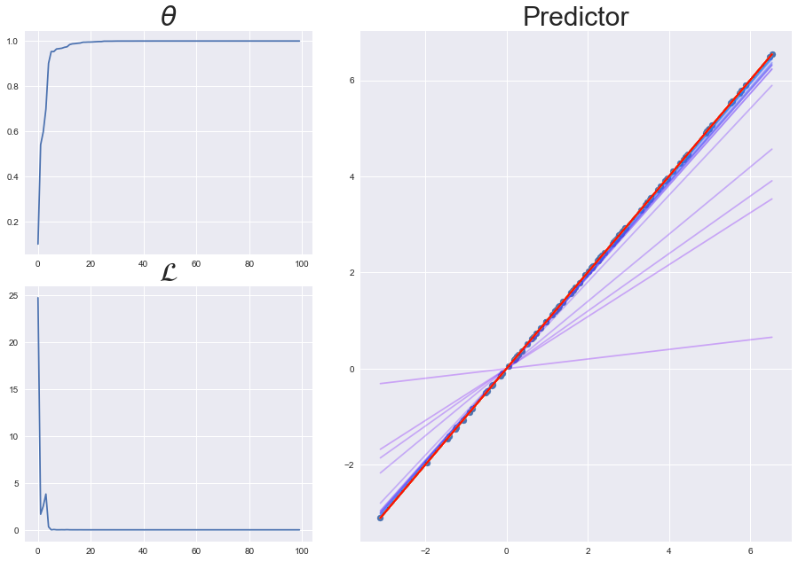
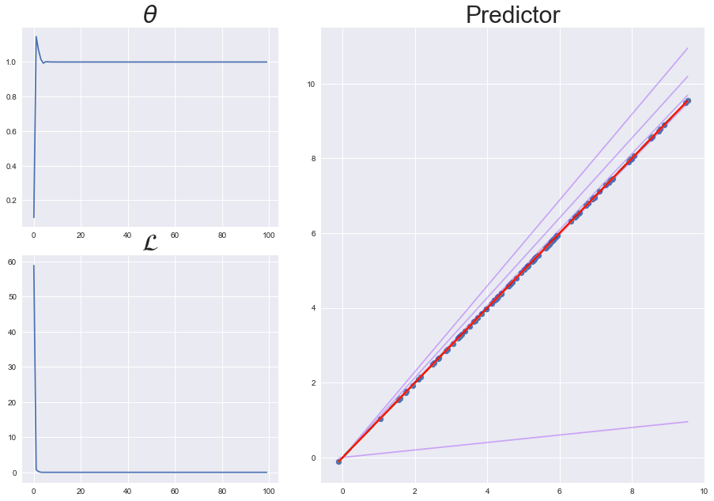
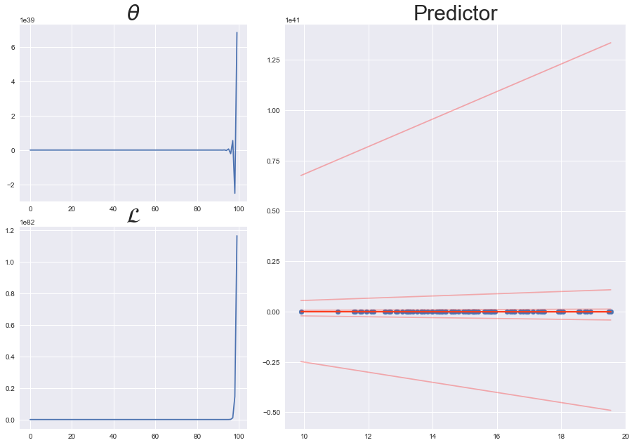

# Single-variate Linear Regression without Bias Term


```python
%matplotlib inline
import numpy as np
import matplotlib.pyplot as plt
import matplotlib.cm as cm

import os
import sys
utils_path = os.path.dirname(os.path.abspath(__name__)) + '/../utils/'
if utils_path not in sys.path:    
    sys.path.append(utils_path)

import basic_nodes as nodes
from LR_dataset_generator import LR_dataset_generator
    
plt.style.use('seaborn')
np.random.seed(0)
```


```python

node1 = nodes.mul_node()

node2 = nodes.minus_node()
node3 = nodes.square_node()

def trainer(dataset, th, lr, epochs):
    th_list = []
    loss_list = []

    for epoch in range(epochs):
        for data_sample in dataset:
            x, y = data_sample[1], data_sample[-1]

            z1 = node1.forward(th, x)
            z2 = node2.forward(y, z1)
            l = node3.forward(z2)

            dz2 = node3.backward(1)
            dy, dz1 = node2.backward(dz2)
            dth, dx = node1.backward(dz1)

            th_list.append(th)
            loss_list.append(l)

            th = th - lr*dth

    
    fig = plt.figure(figsize = (15,10))
    left, bottom = 0.1, 0.1
    width, height = 0.3, 0.4
    spacing = 0.05

    ax_th = fig.add_axes([left, bottom + height + spacing, width,
                            1-(2*bottom + height + spacing)])
    ax_loss = fig.add_axes([left, bottom, width, height])
    ax_pred = fig.add_axes([left + width + spacing, bottom,
                           1 - (2*left + width + spacing), 2*height])

    ax_th.set_title(r'$\theta$', fontsize = 30)
    ax_loss.set_title(r'$\mathcal{L}$', fontsize = 30)
    ax_pred.set_title('Predictor', fontsize = 30)
    ax_th.plot(th_list)
    ax_loss.plot(loss_list)

    ax_pred.scatter(dataset[:,1], dataset[:,-1])
    cmap = cm.get_cmap('rainbow', lut = len(th_list))
    x_range = np.array([np.min(dataset[:,1]), np.max(dataset[:,1])])
    for th_idx, th in enumerate(th_list):
        pred = th*x_range

        ax_pred.plot(x_range, pred, color = cmap(th_idx),
                    alpha = 0.3)
```


```python
np.random.seed(0)
data_gen = LR_dataset_generator(feature_dim = 1)

distribution_params = {1:{'mean':0, 'std':1}}
data_gen.set_distribution_params(distribution_params)

dataset = data_gen.make_dataset()

th = 0.1
lr = 0.008
epochs = 1

trainer(dataset, th, lr, epochs)
```





```python
np.random.seed(0)
data_gen = LR_dataset_generator(feature_dim = 1)

distribution_params = {
    1:{'mean':0, 'std':2},
}
data_gen.set_distribution_params(distribution_params)

dataset = data_gen.make_dataset()

th = 0.1
lr = 0.008
epochs = 1

trainer(dataset, th, lr, epochs)
```





```python
np.random.seed(0)
data_gen = LR_dataset_generator(feature_dim = 1)

distribution_params = {
    1:{'mean':0, 'std':5},
}
data_gen.set_distribution_params(distribution_params)

dataset = data_gen.make_dataset()

th = 0.1
lr = 0.008
epochs = 1

trainer(dataset, th, lr, epochs)
```





```python
np.random.seed(0)
data_gen = LR_dataset_generator(feature_dim = 1)

distribution_params = {
    1:{'mean':0, 'std':10},
}
data_gen.set_distribution_params(distribution_params)

dataset = data_gen.make_dataset()

th = 0.1
lr = 0.008
epochs = 1

trainer(dataset, th, lr, epochs)
```





```python
np.random.seed(0)
data_gen = LR_dataset_generator(feature_dim = 1)

distribution_params = {
    1:{'mean':0, 'std':15},
}
data_gen.set_distribution_params(distribution_params)

dataset = data_gen.make_dataset()

th = 0.1
lr = 0.008
epochs = 1

trainer(dataset, th, lr, epochs)
```





```python

```


```python
np.random.seed(0)
data_gen = LR_dataset_generator(feature_dim = 1)

distribution_params = {
    1:{'mean':0, 'std':2},
}
data_gen.set_distribution_params(distribution_params)

dataset = data_gen.make_dataset()

th = 0.1
lr = 0.008
epochs = 1

trainer(dataset, th, lr, epochs)
```


```python
np.random.seed(0)
data_gen = LR_dataset_generator(feature_dim = 1)

distribution_params = {
    1:{'mean':2, 'std':2},
}
data_gen.set_distribution_params(distribution_params)

dataset = data_gen.make_dataset()

th = 0.1
lr = 0.008
epochs = 1

trainer(dataset, th, lr, epochs)
```





```python
np.random.seed(0)
data_gen = LR_dataset_generator(feature_dim = 1)

distribution_params = {
    1:{'mean':5, 'std':2},
}
data_gen.set_distribution_params(distribution_params)

dataset = data_gen.make_dataset()

th = 0.1
lr = 0.008
epochs = 1

trainer(dataset, th, lr, epochs)
```





```python
np.random.seed(0)
data_gen = LR_dataset_generator(feature_dim = 1)

distribution_params = {
    1:{'mean':15, 'std':2},
}
data_gen.set_distribution_params(distribution_params)

dataset = data_gen.make_dataset()

th = 0.1
lr = 0.008
epochs = 1

trainer(dataset, th, lr, epochs)
```




