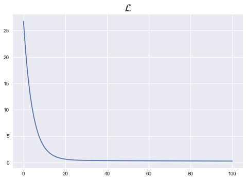
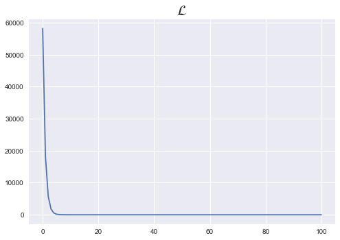

```python
import torch
import torch.nn as nn
import torch.nn.functional as F
import torch.optim as optim
```

# 1. SVLR


```python
class Linear_regression(nn.Module):
    def __init__(self):
        super().__init__()
        self.linear = nn.Linear(1,1)
        
    def forward(self,x):
        return self.linear(x)
```


```python
model = Linear_regression()
```


```python
x_train = torch.FloatTensor([[1], [2], [3]])
y_train = torch.FloatTensor([[2], [4], [6]])
```


```python
%matplotlib inline

loss_list = []
for epoch in range(100+1):
    
    # forward
    prediction = model(x_train)
    cost = F.mse_loss(prediction,y_train)
    
    # backward
    optimizer = optim.SGD(model.parameters(),lr = 1e-2)
    optimizer.zero_grad()
    cost.backward()
    optimizer.step()
    
    loss_list.append(cost.item())
    
    if epoch%10 == 0:
        print(f'epoch = {epoch}, cost = {cost.item()}, w,b = {list(model.parameters())}')
        print()
        
plt.style.use("seaborn")
plt.plot(loss_list)
plt.title(r"$\mathcal{L}$",fontsize=20)
```

    epoch = 0, cost = 26.745691299438477, w,b = [Parameter containing:
    tensor([[-0.5308]], requires_grad=True), Parameter containing:
    tensor([0.9434], requires_grad=True)]
    
    epoch = 10, cost = 2.9138810634613037, w,b = [Parameter containing:
    tensor([[0.7130]], requires_grad=True), Parameter containing:
    tensor([1.4416], requires_grad=True)]
    
    epoch = 20, cost = 0.62737637758255, w,b = [Parameter containing:
    tensor([[1.1088]], requires_grad=True), Parameter containing:
    tensor([1.5680], requires_grad=True)]
    
    epoch = 30, cost = 0.39321231842041016, w,b = [Parameter containing:
    tensor([[1.2427]], requires_grad=True), Parameter containing:
    tensor([1.5803], requires_grad=True)]
    
    epoch = 40, cost = 0.3552432060241699, w,b = [Parameter containing:
    tensor([[1.2955]], requires_grad=True), Parameter containing:
    tensor([1.5580], requires_grad=True)]
    
    epoch = 50, cost = 0.3366924226284027, w,b = [Parameter containing:
    tensor([[1.3229]], requires_grad=True), Parameter containing:
    tensor([1.5257], requires_grad=True)]
    
    epoch = 60, cost = 0.3206923305988312, w,b = [Parameter containing:
    tensor([[1.3424]], requires_grad=True), Parameter containing:
    tensor([1.4908], requires_grad=True)]
    
    epoch = 70, cost = 0.3056042194366455, w,b = [Parameter containing:
    tensor([[1.3590]], requires_grad=True), Parameter containing:
    tensor([1.4558], requires_grad=True)]
    
    epoch = 80, cost = 0.29124021530151367, w,b = [Parameter containing:
    tensor([[1.3746]], requires_grad=True), Parameter containing:
    tensor([1.4213], requires_grad=True)]
    
    epoch = 90, cost = 0.2775527536869049, w,b = [Parameter containing:
    tensor([[1.3895]], requires_grad=True), Parameter containing:
    tensor([1.3876], requires_grad=True)]
    
    epoch = 100, cost = 0.2645086944103241, w,b = [Parameter containing:
    tensor([[1.4041]], requires_grad=True), Parameter containing:
    tensor([1.3546], requires_grad=True)]
    


    Text(0.5, 1.0, '$\\mathcal{L}$')





# 2. MVLR


```python
class MVLR(nn.Module):
    def __init__(self):
        super().__init__()
        self.linear = nn.Linear(3,1)
        
    def forward(self,x):
        return self.linear(x)
```


```python
x_train = torch.FloatTensor([[73, 80, 75],
                             [93, 88, 93],
                             [89, 91, 90],
                             [96, 98, 100],
                             [73, 66, 70]])
y_train = torch.FloatTensor([[152], [185], [180], [196], [142]])
```


```python
model = MVLR()
```


```python
loss_list = []

for epoch in range(100+1):
    
    # forward
    prediction = model(x_train)
    cost = F.mse_loss(prediction, y_train)
    
    # backward
    optimizer = optim.SGD(model.parameters(),lr=1e-5)
    optimizer.zero_grad()
    
    cost.backward()
    optimizer.step()
    
    loss_list.append(cost.item())
    
    if epoch%10 == 0:
        print(f'epoch = {epoch}, cost = {cost.item()}, w,b = {list(model.parameters())}')
        print()
        
plt.style.use("seaborn")
plt.plot(loss_list)
plt.title(r"$\mathcal{L}$",fontsize=20)
```

    epoch = 0, cost = 58180.6796875, w,b = [Parameter containing:
    tensor([[ 0.3169, -0.1491,  0.2673]], requires_grad=True), Parameter containing:
    tensor([-0.2368], requires_grad=True)]
    
    epoch = 10, cost = 0.9959132075309753, w,b = [Parameter containing:
    tensor([[0.8390, 0.3726, 0.7954]], requires_grad=True), Parameter containing:
    tensor([-0.2307], requires_grad=True)]
    
    epoch = 20, cost = 0.46305957436561584, w,b = [Parameter containing:
    tensor([[0.8406, 0.3743, 0.7969]], requires_grad=True), Parameter containing:
    tensor([-0.2307], requires_grad=True)]
    
    epoch = 30, cost = 0.46279555559158325, w,b = [Parameter containing:
    tensor([[0.8406, 0.3744, 0.7968]], requires_grad=True), Parameter containing:
    tensor([-0.2307], requires_grad=True)]
    
    epoch = 40, cost = 0.4625623822212219, w,b = [Parameter containing:
    tensor([[0.8406, 0.3745, 0.7967]], requires_grad=True), Parameter containing:
    tensor([-0.2307], requires_grad=True)]
    
    epoch = 50, cost = 0.46231478452682495, w,b = [Parameter containing:
    tensor([[0.8406, 0.3747, 0.7965]], requires_grad=True), Parameter containing:
    tensor([-0.2307], requires_grad=True)]
    
    epoch = 60, cost = 0.4620630145072937, w,b = [Parameter containing:
    tensor([[0.8406, 0.3748, 0.7964]], requires_grad=True), Parameter containing:
    tensor([-0.2307], requires_grad=True)]
    
    epoch = 70, cost = 0.4618162214756012, w,b = [Parameter containing:
    tensor([[0.8406, 0.3749, 0.7963]], requires_grad=True), Parameter containing:
    tensor([-0.2306], requires_grad=True)]
    
    epoch = 80, cost = 0.46157947182655334, w,b = [Parameter containing:
    tensor([[0.8406, 0.3750, 0.7962]], requires_grad=True), Parameter containing:
    tensor([-0.2306], requires_grad=True)]
    
    epoch = 90, cost = 0.46134310960769653, w,b = [Parameter containing:
    tensor([[0.8406, 0.3751, 0.7961]], requires_grad=True), Parameter containing:
    tensor([-0.2306], requires_grad=True)]
    
    epoch = 100, cost = 0.4610903859138489, w,b = [Parameter containing:
    tensor([[0.8406, 0.3752, 0.7960]], requires_grad=True), Parameter containing:
    tensor([-0.2306], requires_grad=True)]
    


    Text(0.5, 1.0, '$\\mathcal{L}$')




