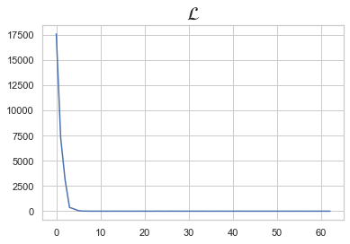

```python
import torch
import torch.nn as nn
import torch.nn.functional as F
import torch.optim as optim
```

# 1. Data Load

```
from torch.utils.data import TensorDataset # 텐서데이터셋 
from torch.utils.data import DataLoader

- 1. Dataset 정의

dataset = TensorDataset(x_train,y_train)


- 2. DataLoader에 전달

dataloader = DataLoader( 데이터셋, 배치크기, 셔플여부 )


- 3. [활용]

for batch_idx, samples in enumerate(dataloader):

    x_train, y_train = samples

```


```python
from torch.utils.data import TensorDataset # 텐서데이터셋 
from torch.utils.data import DataLoader
```

TensorDataset : 기본적으로 텐서를 입력으로 받음. 텐서 형태로 데이터를 정의


```python
x_train  =  torch.FloatTensor([[73,  80,  75], 
                               [93,  88,  93], 
                               [89,  91,  90], 
                               [96,  98,  100],   
                               [73,  66,  70]])  
y_train  =  torch.FloatTensor([[152],  [185],  [180],  [196],  [142]])
```

이제 이를 TensorDataset 의 입력으로 사용하고, dataset으로 저장


```python
dataset = TensorDataset(x_train,y_train)
```

**dataset을 정의했으니, DataLoader에 전달**


```python
dataloader = DataLoader(dataset, batch_size = 2, shuffle = True)
```


```python
model = nn.Linear(3,1)
optimizer = optim.SGD(model.parameters(),lr=1e-5)
```


```python
nb_epochs = 20
loss_list = []
for epoch in range(nb_epochs + 1):
      for batch_idx, samples in enumerate(dataloader):
#         print(batch_idx)
#         print(samples)
        x_train, y_train = samples
        # H(x) 계산
        prediction = model(x_train)

        # cost 계산
        cost = F.mse_loss(prediction, y_train)

        # cost로 H(x) 계산
        optimizer.zero_grad()
        cost.backward()
        optimizer.step()
        loss_list.append(cost)

        print('Epoch {:4d}/{} Batch {}/{} Cost: {:.6f}'.format(
            epoch, nb_epochs, batch_idx+1, len(dataloader),
            cost.item()
            ))
```

    Epoch    0/20 Batch 1/3 Cost: 17607.935547
    Epoch    0/20 Batch 2/3 Cost: 7285.620117
    Epoch    0/20 Batch 3/3 Cost: 3100.863037
    Epoch    1/20 Batch 1/3 Cost: 374.088501
    Epoch    1/20 Batch 2/3 Cost: 224.580490
    Epoch    1/20 Batch 3/3 Cost: 52.428066
    Epoch    2/20 Batch 1/3 Cost: 12.392537
    Epoch    2/20 Batch 2/3 Cost: 7.753749
    Epoch    2/20 Batch 3/3 Cost: 0.546570
    Epoch    3/20 Batch 1/3 Cost: 3.499715
    Epoch    3/20 Batch 2/3 Cost: 0.622077
    Epoch    3/20 Batch 3/3 Cost: 0.090020
    Epoch    4/20 Batch 1/3 Cost: 0.051993
    Epoch    4/20 Batch 2/3 Cost: 2.553336
    Epoch    4/20 Batch 3/3 Cost: 1.508089
    Epoch    5/20 Batch 1/3 Cost: 2.779361
    Epoch    5/20 Batch 2/3 Cost: 0.004355
    Epoch    5/20 Batch 3/3 Cost: 0.986648
    Epoch    6/20 Batch 1/3 Cost: 0.187372
    Epoch    6/20 Batch 2/3 Cost: 2.602979
    Epoch    6/20 Batch 3/3 Cost: 1.173005
    Epoch    7/20 Batch 1/3 Cost: 0.196949
    Epoch    7/20 Batch 2/3 Cost: 0.074881
    Epoch    7/20 Batch 3/3 Cost: 5.563627
    Epoch    8/20 Batch 1/3 Cost: 0.743593
    Epoch    8/20 Batch 2/3 Cost: 0.639537
    Epoch    8/20 Batch 3/3 Cost: 4.626740
    Epoch    9/20 Batch 1/3 Cost: 1.738493
    Epoch    9/20 Batch 2/3 Cost: 1.763463
    Epoch    9/20 Batch 3/3 Cost: 0.001097
    Epoch   10/20 Batch 1/3 Cost: 1.932005
    Epoch   10/20 Batch 2/3 Cost: 1.082096
    Epoch   10/20 Batch 3/3 Cost: 0.243678
    Epoch   11/20 Batch 1/3 Cost: 2.699120
    Epoch   11/20 Batch 2/3 Cost: 0.001738
    Epoch   11/20 Batch 3/3 Cost: 0.257703
    Epoch   12/20 Batch 1/3 Cost: 0.266326
    Epoch   12/20 Batch 2/3 Cost: 2.730965
    Epoch   12/20 Batch 3/3 Cost: 0.010265
    Epoch   13/20 Batch 1/3 Cost: 0.132244
    Epoch   13/20 Batch 2/3 Cost: 0.358819
    Epoch   13/20 Batch 3/3 Cost: 5.163524
    Epoch   14/20 Batch 1/3 Cost: 0.845330
    Epoch   14/20 Batch 2/3 Cost: 2.388288
    Epoch   14/20 Batch 3/3 Cost: 0.030894
    Epoch   15/20 Batch 1/3 Cost: 0.690128
    Epoch   15/20 Batch 2/3 Cost: 2.321957
    Epoch   15/20 Batch 3/3 Cost: 0.058780
    Epoch   16/20 Batch 1/3 Cost: 0.568477
    Epoch   16/20 Batch 2/3 Cost: 2.421080
    Epoch   16/20 Batch 3/3 Cost: 0.582379
    Epoch   17/20 Batch 1/3 Cost: 0.075418
    Epoch   17/20 Batch 2/3 Cost: 2.351240
    Epoch   17/20 Batch 3/3 Cost: 1.628023
    Epoch   18/20 Batch 1/3 Cost: 0.207711
    Epoch   18/20 Batch 2/3 Cost: 2.830966
    Epoch   18/20 Batch 3/3 Cost: 0.000002
    Epoch   19/20 Batch 1/3 Cost: 0.635899
    Epoch   19/20 Batch 2/3 Cost: 2.715918
    Epoch   19/20 Batch 3/3 Cost: 0.015193
    Epoch   20/20 Batch 1/3 Cost: 1.971251
    Epoch   20/20 Batch 2/3 Cost: 1.019903
    Epoch   20/20 Batch 3/3 Cost: 0.008835


```python
%matplotlib inline
plt.plot(loss_list)
plt.title(r"$\mathcal{L}$",fontsize=20)
```


    Text(0.5, 1.0, '$\\mathcal{L}$')




