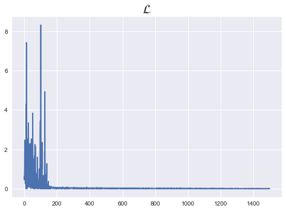

```python
import torch
import torch.nn as nn
import torch.nn.functional as F
import torch.optim as optim

from torch.utils.data import Dataset
from torch.utils.data import TensorDataset
from torch.utils.data import DataLoader

torch.manual_seed(1)
```


    <torch._C.Generator at 0x7fa81b138d10>


```python
x_data = [[1, 2], [2, 3], [3, 1], [4, 3], [5, 3], [6, 2]]
y_data = [[0], [0], [0], [1], [1], [1]]
x_train = torch.FloatTensor(x_data)
y_train = torch.FloatTensor(y_data)
```


```python
print(x_train.shape,y_train.shape)
```

    torch.Size([6, 2]) torch.Size([6, 1])


```python
dataset = TensorDataset(x_train,y_train)
dataloader = DataLoader(dataset,batch_size=2,shuffle=True)
```


```python
class Binary_classifier(nn.Module):
    def __init__(self):
        super().__init__()
        self.linear = nn.Linear(2,1)
        self.sigmoid = nn.Sigmoid()
        
    def forward(self,x):
        model = nn.Sequential(self.linear,self.sigmoid)
        model = model(x)
        return model
```


```python
model = Binary_classifier()
```


```python
%matplotlib inline
nb_epochs = 500
loss_list = []
optimizer = optim.SGD(model.parameters(),lr=1)

for epoch in range(nb_epochs):
    for idx, samples in enumerate(dataloader):
        x_batch, y_batch = samples
        
        # forward
        y_pred = model(x_batch)
        cost = F.binary_cross_entropy(y_pred,y_batch)
        
        # backward
        optimizer.zero_grad()
        cost.backward()
        optimizer.step()
        
        binary_pred = y_pred >= torch.FloatTensor([0.5])
        accurate_pred = binary_pred == y_batch
        
        accuracy = accurate_pred.float().sum() / len(accurate_pred)
        
        loss_list.append(cost.item())
        
        if epoch % 100 ==0:
            print('Epoch {:4d}/{}, Cost: {:.6f}, accuracy : {:.4f}'.format(epoch, nb_epochs, cost.item(),accuracy))
        
plt.style.use("seaborn")
plt.plot(loss_list)
plt.title(r"$\mathcal{L}$",fontsize=20)
```

    Epoch    0/500, Cost: 0.632441, accuracy : 0.5000
    Epoch    0/500, Cost: 0.449046, accuracy : 0.5000
    Epoch    0/500, Cost: 1.110273, accuracy : 0.5000
    Epoch  100/500, Cost: 0.058610, accuracy : 1.0000
    Epoch  100/500, Cost: 0.000860, accuracy : 1.0000
    Epoch  100/500, Cost: 0.058289, accuracy : 1.0000
    Epoch  200/500, Cost: 0.000728, accuracy : 1.0000
    Epoch  200/500, Cost: 0.034686, accuracy : 1.0000
    Epoch  200/500, Cost: 0.022952, accuracy : 1.0000
    Epoch  300/500, Cost: 0.000421, accuracy : 1.0000
    Epoch  300/500, Cost: 0.029850, accuracy : 1.0000
    Epoch  300/500, Cost: 0.014401, accuracy : 1.0000
    Epoch  400/500, Cost: 0.000077, accuracy : 1.0000
    Epoch  400/500, Cost: 0.022954, accuracy : 1.0000
    Epoch  400/500, Cost: 0.018056, accuracy : 1.0000


    Text(0.5, 1.0, '$\\mathcal{L}$')





```python
y_pred = model(x_train)
binary_pred = y_pred >= torch.FloatTensor([0.5])
binary_pred.float()
```


    tensor([[0.],
            [0.],
            [1.],
            [1.],
            [1.],
            [1.]])


```python
accurate_pred = binary_pred.float() == y_train
```


```python
accurate_pred.float().sum() / len(accurate_pred)
```


    tensor(0.8333)


