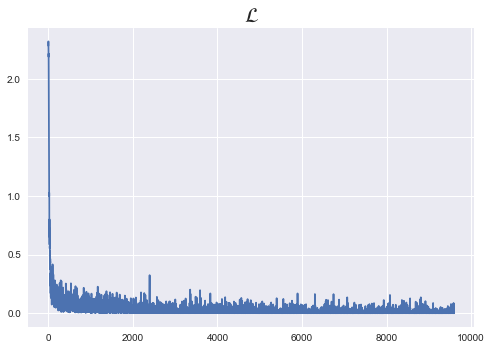

```python
import torch
import torch.nn as nn
```

# 1. Model (Deep CNN)

```

1. layer 1, convolution
    입력 : ?, 1, 28, 28
    출력 : ?, 32, 28, 28
    ker_size : 3
    패딩 : 1
    str : 1
    + ReLu
    + maxpool(2)
    
2. layer 2, convolution
    입력 : ?, 32, 14, 14
    출력 : ?, 64, 14, 14
    ker_size : 3
    패딩 : 1
    str : 1
    + ReLu
    + maxpool(2)
    
3. layer 3, convolution
    입력 : ?, 64, 7, 7
    출력 : ?, 128, 7, 7
    ker_size : 3
    패딩 : 1
    str : 1
    + ReLu
    + maxpool(2) -> padding = 1 로 사이즈 보전
    
4. layer 4, F_C layer  # Flatten
    입력 : ?, 128, 4, 4
    출력 : ?, 128*4*4
    + ReLu
    
5. layer 5, F_C layer  # output
    입력 : ?, 128*4*4
    출력 : ?, 10
    + Softmax
```


```python
import torch
import torchvision.datasets as dsets
import torchvision.transforms as transforms
import torch.nn.init
```


```python
device = 'cuda' if torch.cuda.is_available() else 'cpu'

# 랜덤시드 고정
torch.manual_seed(777)

# GPU일 경우, 랜덤시드 고정
if device == 'cuda':
    torch.cuda.manual_seed_all(777)
```


```python
learning_rate = 0.001
training_epoch = 15
batch_size = 100
```

**데이터셋 정의**


```python
mnist_train = dsets.MNIST(root='MNIST_data/',
                          train=True,
                          transform=transforms.ToTensor(), # 텐서로 변환!
                          download=True)

mnist_test = dsets.MNIST(root='MNISt_data/',
                         train=False,
                         transform=transforms.ToTensor(), # 텐서로 변환!
                         download=True) 
```


```python
data_loader = torch.utils.data.DataLoader(mnist_train,batch_size=batch_size,shuffle=True,drop_last=True)
```

**모델 설계**


```python
class CNN(torch.nn.Module):
    def __init__(self):
        super(CNN,self).__init__()
        
        self.keep_prob = 0.5 # dropout 대비 잔존율
        
        # layer 1
        self.layer1 = torch.nn.Sequential(
            torch.nn.Conv2d(1,32,kernel_size=3,padding=1,stride=1),
            torch.nn.ReLU(),
            torch.nn.MaxPool2d(kernel_size=2,stride=2))
        
        # layer 2
        self.layer2 = torch.nn.Sequential(
            torch.nn.Conv2d(32,64,kernel_size=3,padding=1,stride=1),
            torch.nn.ReLU(),
            torch.nn.MaxPool2d(kernel_size=2,stride=2))
        
        # layer 3
        self.layer3 = torch.nn.Sequential(
            torch.nn.Conv2d(64,128,kernel_size=3,padding=1,stride=1),
            torch.nn.ReLU(),
            torch.nn.MaxPool2d(kernel_size=2,stride=2,padding=1)) 
            # padding=1 해줘야, FC_layer넘길 때, 4*4*128 넘길 수 있음(안 그럼, 3*3*128이 넘어감)
        
        # layer 4 (Flatten이 된 상태로 받을 것)
        # layer 4 : 4*4*128 -> 625 outputs
        # 가중치 초기화(xavier)
        self.fc1 = torch.nn.Linear(128*4*4,625,bias=True)
        torch.nn.init.xavier_uniform_(self.fc1.weight)
        self.layer4 = torch.nn.Sequential(
            self.fc1,
            torch.nn.ReLU(),
            torch.nn.Dropout(p=1-self.keep_prob))
        
        # layer 5 (Final)
        # layer 5 : 625 -> 10
        # 가중치 초기화(xavier)
        self.fc2 = torch.nn.Linear(625,10,bias=True)
        torch.nn.init.xavier_uniform_(self.fc2.weight)
        # 비용함수에 softmax가 들어있으므로 따로 구현 X

        
    def forward(self,x):
        out = self.layer1(x)
        out = self.layer2(out)
        out = self.layer3(out)
        out = out.view(out.size(0),-1) # Flatten
        out = self.layer4(out)
        out = self.fc2(out)
        
        return out
        
```


```python
model = CNN().to(device)
```


```python
criterion = torch.nn.CrossEntropyLoss().to(device)
optimizer = torch.optim.Adam(model.parameters(),lr=learning_rate)
```


```python
total_batch = len(data_loader)
print("총 배치수 : {}".format(total_batch))
```

    총 배치수 : 600


```python
%matplotlib inline

loss_list=[]
for epoch in range(training_epoch+1):
    for idx, samples in enumerate(data_loader):
        x_batch,y_batch = samples
        
        # forward
        pred = model(x_batch)
        cost = criterion(pred,y_batch)
        
        # backward
        optimizer.zero_grad()
        cost.backward()
        optimizer.step()
        
        loss_list.append(cost.item())
        
        avg_cost = cost.item()/total_batch
        
    print("epoch : {}, cost : {}".format(epoch, avg_cost))

plt.style.use("seaborn")
plt.plot(loss_list)
plt.title("$\mathcal{L}$",fontsize=20)
```

    epoch : 0, cost : 0.00018158946186304093
    epoch : 1, cost : 4.361962899565697e-05
    epoch : 2, cost : 2.223015297204256e-05
    epoch : 3, cost : 3.971590660512447e-05
    epoch : 4, cost : 2.2517436494429907e-05
    epoch : 5, cost : 4.079636807243029e-06
    epoch : 6, cost : 8.818842470645905e-05
    epoch : 7, cost : 6.784983600179354e-05
    epoch : 8, cost : 1.9078544961909454e-05
    epoch : 9, cost : 1.0224650031886994e-06
    epoch : 10, cost : 4.461974992106358e-06
    epoch : 11, cost : 9.201411254859219e-08
    epoch : 12, cost : 1.235305176426967e-05
    epoch : 13, cost : 4.6322417135039964e-05
    epoch : 14, cost : 2.2145390200118224e-05
    epoch : 15, cost : 1.6355266173680624e-07


    Text(0.5, 1.0, '$\\mathcal{L}$')





# Test


```python
with torch.no_grad():
    x_test = mnist_test.test_data.view(len(mnist_test),1,28,28).float().to(device)
    y_test = mnist_test.test_labels.to(device)
    
    pred = model(x_test)
    correct_pred = torch.argmax(pred,1) == y_test
    accuracy = correct_pred.float().mean()
    print('accuracy :', accuracy.item())
    
```

    accuracy : 0.9160000085830688


### 층을 더 깊게 쌓았지만, 정확도가 줄어드는 모습

- 원인을 파악해 더 개선해볼 필요 있음


```python
torch.argmax(torch.FloatTensor([[1,5,3,4,2],[2,3,6,5,4]]),1) == torch.FloatTensor([1,2])
```


    tensor([True, True])


```python
torch.argmax(torch.FloatTensor([[1,2,3,4,5],[6,3,4,5,2]]),1)
```


    tensor([4, 0])


