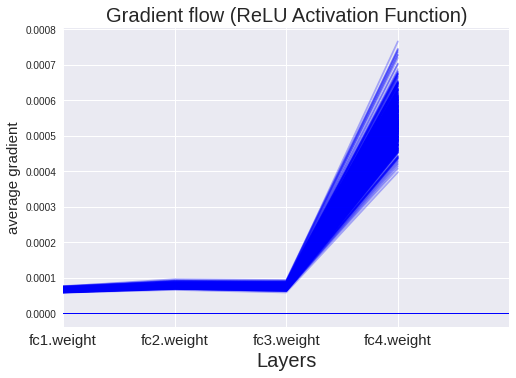
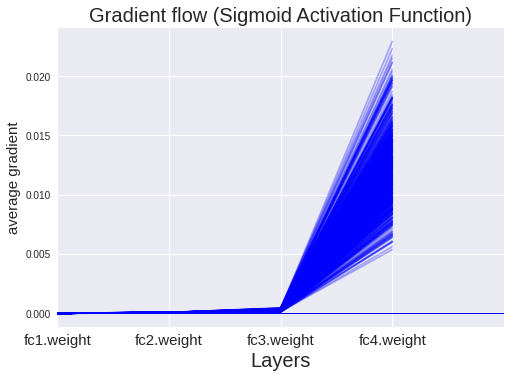

```python
import torch
import torch.nn as nn
import torchvision
import torchvision.transforms as transforms

import matplotlib.pyplot as plt
from matplotlib.lines import Line2D
import matplotlib.cm as cm
import numpy as np
import seaborn as sns

# Device configuration
device = torch.device('cuda' if torch.cuda.is_available() else 'cpu')

# Hyper-parameters 
input_size = 784
hidden_size = 500
num_classes = 10
num_epochs = 40
batch_size = 100
learning_rate = 0.001
```

    /usr/local/lib/python3.6/dist-packages/statsmodels/tools/_testing.py:19: FutureWarning: pandas.util.testing is deprecated. Use the functions in the public API at pandas.testing instead.
      import pandas.util.testing as tm


```python
def get_tensor_info(tensor):
    """
    해당 tensor의 정보를 출력하는 함수
    requires_grad: 해당 tensor의 gradient를 계산이 가능한가?
    is_reaf: gradient를 grad에 저장할 것인가?
    grad_fn: local gradient
    grad: 해당 tensor의 gradient값
    """
    info = []
    for name in ['requires_grad', 'is_leaf', 'grad_fn', 'grad']:
        if name == 'grad':
            info.append(f'{name}({tensor.mean()})')
        else:
            info.append(f'{name}({getattr(tensor, name)})')
        
    return ' '.join(info)
```

### MNIST dataset 정의하기


```python
# MNIST dataset 
train_dataset = torchvision.datasets.MNIST(root='../data', 
                                           train=True, 
                                           transform=transforms.ToTensor(),  
                                           download=True)

test_dataset = torchvision.datasets.MNIST(root='../data', 
                                          train=False, 
                                          transform=transforms.ToTensor())
```

### 정해진 조건(batch_size, transform, shuffle등등)으로 데이터를 공급할수 있는 dataloader 정의하기


```python
# Data loader
train_loader = torch.utils.data.DataLoader(dataset=train_dataset, 
                                           batch_size=batch_size, 
                                           shuffle=True)

test_loader = torch.utils.data.DataLoader(dataset=test_dataset, 
                                          batch_size=batch_size, 
                                          shuffle=False)
```

### 4-Layer linear 모델 정의하기


```python
# class NeuralNet(nn.Module):
#     def __init__(self, input_size, hidden_size, num_classes):
#         super(NeuralNet, self).__init__()
#         self.fc1 = nn.Linear(input_size, hidden_size) 
#         self.relu = nn.ReLU()
#         self.fc2 = nn.Linear(hidden_size, num_classes)  
#         self.relu = nn.ReLU()
#         self.fc3 = nn.Linear(hidden_size, num_classes)  
#         self.relu = nn.ReLU()
#         self.fc4 = nn.Linear(hidden_size, num_classes)  
    
#     def forward(self, x):
#         out = self.fc1(x)
#         out = self.relu(out)
#         out = self.fc2(out)
#         out = self.relu(out)
#         out = self.fc3(out)
#         out = self.relu(out)
#         out = self.fc4(out)
#         return out

# model = NeuralNet(input_size, hidden_size, num_classes).to(device)
```

### model parameter(weight, bias) 확인하기
- nn.Linear함수는 default로 bias가 True로 되어 있어 [output_dim, input_dim], [output_dim] 2개 array의 파라미터를 가지고 있다.
- nn.Linear 매개변수로 bias를 False로 하면 [output_dim, input_dim] array 1개의 파라미터만 생성된다.

#### bias가 True 일때


```python
# params = list(model.parameters())

# print(f'bias True 일때 parameter array 총 개수:{len(params)}')
# for i in range(len(params)):
#     print(f'parameter array shape: {params[i].shape}')
```

#### bias가 False 일때


```python
`# class NeuralNet(nn.Module):
#     def __init__(self, input_size, hidden_size, num_classes):
#         super(NeuralNet, self).__init__()
#         self.fc1 = nn.Linear(input_size, hidden_size, bias=False) 
#         self.relu = nn.Tanh()
#         self.fc2 = nn.Linear(hidden_size, num_classes, bias=False)  
    
#     def forward(self, x):
#         out = self.fc1(x)
#         out = self.relu(out)
#         out = self.fc2(out)
#         return out

# model = NeuralNet(input_size, hidden_size, num_classes).to(device)
```


```python
class NeuralNet(nn.Module):
    def __init__(self, input_size, hidden_size, num_classes):
        super(NeuralNet, self).__init__()
        self.relu = nn.ReLU()
        self.fc1 = nn.Linear(input_size, hidden_size, bias=False) 
        self.fc2 = nn.Linear(hidden_size, hidden_size, bias=False)  
        self.fc3 = nn.Linear(hidden_size, hidden_size, bias=False)  
        self.fc4 = nn.Linear(hidden_size, num_classes, bias=False)  
    
    def forward(self, x):
        out = self.fc1(x)
        out = self.relu(out)
        out = self.fc2(out)
        out = self.relu(out)
        out = self.fc3(out)
        out = self.relu(out)
        out = self.fc4(out)
        return out

model = NeuralNet(input_size, hidden_size, num_classes).to(device)
```


```python
params = list(model.parameters())

print(f'bias True 일때 parameter array 총 개수:{len(params)}')
for i in range(len(params)):
    print(f'parameter array shape: {params[i].shape}')
```

    bias True 일때 parameter array 총 개수:4
    parameter array shape: torch.Size([500, 784])
    parameter array shape: torch.Size([500, 500])
    parameter array shape: torch.Size([500, 500])
    parameter array shape: torch.Size([10, 500])


### Loss값 및 gradient값 확인하기


```python
# Loss and optimizer
criterion = nn.CrossEntropyLoss()
optimizer = torch.optim.SGD(model.parameters(), lr=learning_rate)
```

## backpropagation전 후 weight 값 확인하기


```python
optimizer.zero_grad()
params = list(model.parameters())
print(f'zero_grad:')
for i in range(len(params)):
    print(f'    grad {params[i].grad}')
```

    zero_grad:
        grad None
        grad None
        grad None
        grad None


```python
for i, (images, labels) in enumerate(train_loader):
    images = images.reshape(-1, 28*28).to(device)
    labels = labels.to(device)

    output = model(images)
    loss = criterion(output, labels)
    
    print('================================================')
    optimizer.zero_grad() # 각 해당 텐서의 grad 값을 0으로 만듬
    
    zero_grad_list = []
    params = list(model.parameters())
    print(f'zero_grad:')
    # for i in range(len(params)):
    #     print(f'    grad {params[i].grad.mean()}')
    #     print(f'    layer{i} weight {params[i].mean().detach().item()}')
    # print('----------------------------------------------')
        
    loss.backward()
    backward_list = []
    params = list(model.parameters())
    print(f'backward:')
    for i in range(len(params)):
        a = params[i].mean().detach().item()
        print(f'    grad {params[i].grad.mean()}')
        print(f'    layer{i} weight {params[i].mean().detach().item()}')
    print('----------------------------------------------')
    
    optimizer.step()
    step_list = []
    params = list(model.parameters())
    print(f'gradient step:')
    for i in range(len(params)):
        b = params[i].mean().detach().item()
        print(f'    grad {params[i].grad.mean()}')
        print(f'    layer{i} weight {params[i].mean().detach().item()}, weight_updated : {(a-b)}')
    print('================================================')
    break
```

    ================================================
    zero_grad:
    backward:
        grad -4.190067102172179e-06
        layer0 weight -4.4913402234669775e-05
        grad -4.731729404738871e-06
        layer1 weight 2.6551879273029044e-05
        grad -3.3105754937423626e-06
        layer2 weight -1.6275698726531118e-05
        grad 2.51457079984696e-12
        layer3 weight 0.0006980531616136432
    ----------------------------------------------
    gradient step:
        grad -4.190067102172179e-06
        layer0 weight -4.4909211283084005e-05, weight_updated : 0.0007429623728967272
        grad -4.731729404738871e-06
        layer1 weight 2.655661774042528e-05, weight_updated : 0.0006714965438732179
        grad -3.3105754937423626e-06
        layer2 weight -1.627238634682726e-05, weight_updated : 0.0007143255479604704
        grad 2.51457079984696e-12
        layer3 weight 0.0006980531616136432, weight_updated : 0.0
    ================================================


```python
for i, (images, labels) in enumerate(train_loader):
    images = images.reshape(-1, 28*28).to(device)
    labels = labels.to(device)

    output = model(images)
    loss = criterion(output, labels)
    
    print('================================================')
    optimizer.zero_grad() # 각 해당 텐서의 grad 값을 0으로 만듬
    
    zero_grad_list = []
    params = list(model.parameters())
    print(f'zero_grad:')
    for i in range(len(params)):
        print(f'    grad : {params[i].grad.mean()}')
        print(f'    layer{i+1} weight : {params[i].mean().detach().item()}')
        print()
    print('----------------------------------------------')
    
    loss.backward()
    backward_list = []
    params = list(model.parameters())
    print(f'backward:')
    for i in range(len(params)):
        a = params[i].mean().detach().item()
        print(f'    grad : {params[i].grad.mean()}')
        print(f'    layer{i+1} weight : {params[i].mean().detach().item()}')
        print()
    print('----------------------------------------------')
    
    optimizer.step()
    step_list = []
    params = list(model.parameters())
    print(f'gradient step:')
    for i in range(len(params)):
        b = params[i].mean().detach().item()
        print(f'    grad : {params[i].grad.mean()}')
        print(f'    layer{i+1} weight : {params[i].mean().detach().item()}, weight_updated : {(a-b)}')
        print()
    print('================================================')

    #print(loss.item())
```

    스트리밍 출력 내용이 길어서 마지막 5000줄이 삭제되었습니다.
    
        grad : -1.5605035059707006e-06
        layer2 weight : 2.7883896109415218e-05, weight_updated : 0.0006701693819195498
    
        grad : -1.6331684946635505e-06
        layer3 weight : -1.5321100363507867e-05, weight_updated : 0.0007133743783924729
    
        grad : 1.4901160817412662e-12
        layer4 weight : 0.0006980533362366259, weight_updated : -5.820766091346741e-11
    
    ================================================
    ================================================
    zero_grad:
        grad : 0.0
        layer1 weight : -4.3936561269219965e-05
    
        grad : 0.0
        layer2 weight : 2.7883896109415218e-05
    
        grad : 0.0
        layer3 weight : -1.5321100363507867e-05
    
        grad : 0.0
        layer4 weight : 0.0006980533362366259
    
    ----------------------------------------------
    backward:
        grad : -4.766629899677355e-06
        layer1 weight : -4.3936561269219965e-05
    
        grad : -2.6662044092518045e-06
        layer2 weight : 2.7883896109415218e-05
    
        grad : -5.73391116631683e-06
        layer3 weight : -1.5321100363507867e-05
    
        grad : 2.7939677481325642e-12
        layer4 weight : 0.0006980533362366259
    
    ----------------------------------------------
    gradient step:
        grad : -4.766629899677355e-06
        layer1 weight : -4.3931795516982675e-05, weight_updated : 0.0007419851317536086
    
        grad : -2.6662044092518045e-06
        layer2 weight : 2.788655001495499e-05, weight_updated : 0.0006701667862216709
    
        grad : -5.73391116631683e-06
        layer3 weight : -1.5315365089918487e-05, weight_updated : 0.0007133687013265444
    
        grad : 2.7939677481325642e-12
        layer4 weight : 0.0006980533362366259, weight_updated : 0.0
    
    ================================================
    ================================================
    zero_grad:
        grad : 0.0
        layer1 weight : -4.3931795516982675e-05
    
        grad : 0.0
        layer2 weight : 2.788655001495499e-05
    
        grad : 0.0
        layer3 weight : -1.5315365089918487e-05
    
        grad : 0.0
        layer4 weight : 0.0006980533362366259
    
    ----------------------------------------------
    backward:
        grad : -3.6921396713296417e-06
        layer1 weight : -4.3931795516982675e-05
    
        grad : -4.777862613991601e-06
        layer2 weight : 2.788655001495499e-05
    
        grad : -1.0776154795166804e-06
        layer3 weight : -1.5315365089918487e-05
    
        grad : 1.6018747092672037e-11
        layer4 weight : 0.0006980533362366259
    
    ----------------------------------------------
    gradient step:
        grad : -3.6921396713296417e-06
        layer1 weight : -4.392809933051467e-05, weight_updated : 0.0007419814355671406
    
        grad : -4.777862613991601e-06
        layer2 weight : 2.7891337595065124e-05, weight_updated : 0.0006701619986415608
    
        grad : -1.0776154795166804e-06
        layer3 weight : -1.531428461021278e-05, weight_updated : 0.0007133676208468387
    
        grad : 1.6018747092672037e-11
        layer4 weight : 0.000698053278028965, weight_updated : 5.820766091346741e-11
    
    ================================================
    ================================================
    zero_grad:
        grad : 0.0
        layer1 weight : -4.392809933051467e-05
    
        grad : 0.0
        layer2 weight : 2.7891337595065124e-05
    
        grad : 0.0
        layer3 weight : -1.531428461021278e-05
    
        grad : 0.0
        layer4 weight : 0.000698053278028965
    
    ----------------------------------------------
    backward:
        grad : -2.7603175567492144e-06
        layer1 weight : -4.392809933051467e-05
    
        grad : -4.234746938891476e-06
        layer2 weight : 2.7891337595065124e-05
    
        grad : -5.378415153245442e-06
        layer3 weight : -1.531428461021278e-05
    
        grad : -9.3132251043071e-13
        layer4 weight : 0.000698053278028965
    
    ----------------------------------------------
    gradient step:
        grad : -2.7603175567492144e-06
        layer1 weight : -4.3925341742578894e-05, weight_updated : 0.0007419786197715439
    
        grad : -4.234746938891476e-06
        layer2 weight : 2.7895575840375386e-05, weight_updated : 0.0006701577021885896
    
        grad : -5.378415153245442e-06
        layer3 weight : -1.530891313450411e-05, weight_updated : 0.0007133621911634691
    
        grad : -9.3132251043071e-13
        layer4 weight : 0.0006980533362366259, weight_updated : -5.820766091346741e-11
    
    ================================================
    ================================================
    zero_grad:
        grad : 0.0
        layer1 weight : -4.3925341742578894e-05
    
        grad : 0.0
        layer2 weight : 2.7895575840375386e-05
    
        grad : 0.0
        layer3 weight : -1.530891313450411e-05
    
        grad : 0.0
        layer4 weight : 0.0006980533362366259
    
    ----------------------------------------------
    backward:
        grad : -4.855011411564192e-06
        layer1 weight : -4.3925341742578894e-05
    
        grad : -6.436786861740984e-06
        layer2 weight : 2.7895575840375386e-05
    
        grad : -5.558741577260662e-06
        layer3 weight : -1.530891313450411e-05
    
        grad : 9.313225537987968e-12
        layer4 weight : 0.0006980533362366259
    
    ----------------------------------------------
    gradient step:
        grad : -4.855011411564192e-06
        layer1 weight : -4.3920485040871426e-05, weight_updated : 0.0007419738212774973
    
        grad : -6.436786861740984e-06
        layer2 weight : 2.790200051094871e-05, weight_updated : 0.0006701513357256772
    
        grad : -5.558741577260662e-06
        layer3 weight : -1.5303345207939856e-05, weight_updated : 0.0007133566814445658
    
        grad : 9.313225537987968e-12
        layer4 weight : 0.0006980533362366259, weight_updated : 0.0
    
    ================================================
    ================================================
    zero_grad:
        grad : 0.0
        layer1 weight : -4.3920485040871426e-05
    
        grad : 0.0
        layer2 weight : 2.790200051094871e-05
    
        grad : 0.0
        layer3 weight : -1.5303345207939856e-05
    
        grad : 0.0
        layer4 weight : 0.0006980533362366259
    
    ----------------------------------------------
    backward:
        grad : -6.992380804149434e-06
        layer1 weight : -4.3920485040871426e-05
    
        grad : -7.440683930326486e-06
        layer2 weight : 2.790200051094871e-05
    
        grad : -8.06155276222853e-06
        layer3 weight : -1.5303345207939856e-05
    
        grad : -8.940696273607163e-12
        layer4 weight : 0.0006980533362366259
    
    ----------------------------------------------
    gradient step:
        grad : -6.992380804149434e-06
        layer1 weight : -4.391348920762539e-05, weight_updated : 0.0007419668254442513
    
        grad : -7.440683930326486e-06
        layer2 weight : 2.7909441996598616e-05, weight_updated : 0.0006701438942400273
    
        grad : -8.06155276222853e-06
        layer3 weight : -1.529528890387155e-05, weight_updated : 0.0007133486251404975
    
        grad : -8.940696273607163e-12
        layer4 weight : 0.0006980533944442868, weight_updated : -5.820766091346741e-11
    
    ================================================
    ================================================
    zero_grad:
        grad : 0.0
        layer1 weight : -4.391348920762539e-05
    
        grad : 0.0
        layer2 weight : 2.7909441996598616e-05
    
        grad : 0.0
        layer3 weight : -1.529528890387155e-05
    
        grad : 0.0
        layer4 weight : 0.0006980533944442868
    
    ----------------------------------------------
    backward:
        grad : -5.5140399126685224e-06
        layer1 weight : -4.391348920762539e-05
    
        grad : -7.2188195190392435e-06
        layer2 weight : 2.7909441996598616e-05
    
        grad : -4.538061602943344e-06
        layer3 weight : -1.529528890387155e-05
    
        grad : 7.450580408706331e-13
        layer4 weight : 0.0006980533944442868
    
    ----------------------------------------------
    gradient step:
        grad : -5.5140399126685224e-06
        layer1 weight : -4.390798494569026e-05, weight_updated : 0.0007419613793899771
    
        grad : -7.2188195190392435e-06
        layer2 weight : 2.791667247947771e-05, weight_updated : 0.0006701367219648091
    
        grad : -4.538061602943344e-06
        layer3 weight : -1.5290752344299108e-05, weight_updated : 0.0007133441467885859
    
        grad : 7.450580408706331e-13
        layer4 weight : 0.0006980533362366259, weight_updated : 5.820766091346741e-11
    
    ================================================
    ================================================
    zero_grad:
        grad : 0.0
        layer1 weight : -4.390798494569026e-05
    
        grad : 0.0
        layer2 weight : 2.791667247947771e-05
    
        grad : 0.0
        layer3 weight : -1.5290752344299108e-05
    
        grad : 0.0
        layer4 weight : 0.0006980533362366259
    
    ----------------------------------------------
    backward:
        grad : -1.4453938774749986e-06
        layer1 weight : -4.390798494569026e-05
    
        grad : -3.2375560294894967e-06
        layer2 weight : 2.791667247947771e-05
    
        grad : -9.368538371745672e-07
        layer3 weight : -1.5290752344299108e-05
    
        grad : -7.45058008344568e-12
        layer4 weight : 0.0006980533362366259
    
    ----------------------------------------------
    gradient step:
        grad : -1.4453938774749986e-06
        layer1 weight : -4.3906540668103844e-05, weight_updated : 0.0007419598769047298
    
        grad : -3.2375560294894967e-06
        layer2 weight : 2.7919910280616023e-05, weight_updated : 0.0006701334259560099
    
        grad : -9.368538371745672e-07
        layer3 weight : -1.5289813745766878e-05, weight_updated : 0.0007133431499823928
    
        grad : -7.45058008344568e-12
        layer4 weight : 0.0006980533944442868, weight_updated : -5.820766091346741e-11
    
    ================================================
    ================================================
    zero_grad:
        grad : 0.0
        layer1 weight : -4.3906540668103844e-05
    
        grad : 0.0
        layer2 weight : 2.7919910280616023e-05
    
        grad : 0.0
        layer3 weight : -1.5289813745766878e-05
    
        grad : 0.0
        layer4 weight : 0.0006980533944442868
    
    ----------------------------------------------
    backward:
        grad : -4.75841443403624e-06
        layer1 weight : -4.3906540668103844e-05
    
        grad : -5.115546173328767e-06
        layer2 weight : 2.7919910280616023e-05
    
        grad : -1.9793239971477306e-06
        layer3 weight : -1.5289813745766878e-05
    
        grad : 5.5879354962651284e-12
        layer4 weight : 0.0006980533944442868
    
    ----------------------------------------------
    gradient step:
        grad : -4.75841443403624e-06
        layer1 weight : -4.390177855384536e-05, weight_updated : 0.0007419551729981322
    
        grad : -5.115546173328767e-06
        layer2 weight : 2.79250289167976e-05, weight_updated : 0.0006701283655274892
    
        grad : -1.9793239971477306e-06
        layer3 weight : -1.5287836504285224e-05, weight_updated : 0.000713341230948572
    
        grad : 5.5879354962651284e-12
        layer4 weight : 0.0006980534526519477, weight_updated : -5.820766091346741e-11
    
    ================================================
    ================================================
    zero_grad:
        grad : 0.0
        layer1 weight : -4.390177855384536e-05
    
        grad : 0.0
        layer2 weight : 2.79250289167976e-05
    
        grad : 0.0
        layer3 weight : -1.5287836504285224e-05
    
        grad : 0.0
        layer4 weight : 0.0006980534526519477
    
    ----------------------------------------------
    backward:
        grad : -2.664577550604008e-06
        layer1 weight : -4.390177855384536e-05
    
        grad : -3.5003497487196e-06
        layer2 weight : 2.79250289167976e-05
    
        grad : -5.577249794441741e-06
        layer3 weight : -1.5287836504285224e-05
    
        grad : 1.1548399389549324e-11
        layer4 weight : 0.0006980534526519477
    
    ----------------------------------------------
    gradient step:
        grad : -2.664577550604008e-06
        layer1 weight : -4.389911555335857e-05, weight_updated : 0.0007419525682053063
    
        grad : -3.5003497487196e-06
        layer2 weight : 2.792853229038883e-05, weight_updated : 0.0006701249203615589
    
        grad : -5.577249794441741e-06
        layer3 weight : -1.5282261301763356e-05, weight_updated : 0.0007133357139537111
    
        grad : 1.1548399389549324e-11
        layer4 weight : 0.0006980534526519477, weight_updated : 0.0
    
    ================================================
    ================================================
    zero_grad:
        grad : 0.0
        layer1 weight : -4.389911555335857e-05
    
        grad : 0.0
        layer2 weight : 2.792853229038883e-05
    
        grad : 0.0
        layer3 weight : -1.5282261301763356e-05
    
        grad : 0.0
        layer4 weight : 0.0006980534526519477
    
    ----------------------------------------------
    backward:
        grad : -4.911750693281647e-06
        layer1 weight : -4.389911555335857e-05
    
        grad : -4.721183813671814e-06
        layer2 weight : 2.792853229038883e-05
    
        grad : -4.303302830521716e-06
        layer3 weight : -1.5282261301763356e-05
    
        grad : -1.6763805621433647e-11
        layer4 weight : 0.0006980534526519477
    
    ----------------------------------------------
    gradient step:
        grad : -4.911750693281647e-06
        layer1 weight : -4.389420064399019e-05, weight_updated : 0.0007419476532959379
    
        grad : -4.721183813671814e-06
        layer2 weight : 2.793324711092282e-05, weight_updated : 0.0006701202055410249
    
        grad : -4.303302830521716e-06
        layer3 weight : -1.527795393485576e-05, weight_updated : 0.0007133314065868035
    
        grad : -1.6763805621433647e-11
        layer4 weight : 0.0006980533362366259, weight_updated : 1.1641532182693481e-10
    
    ================================================
    ================================================
    zero_grad:
        grad : 0.0
        layer1 weight : -4.389420064399019e-05
    
        grad : 0.0
        layer2 weight : 2.793324711092282e-05
    
        grad : 0.0
        layer3 weight : -1.527795393485576e-05
    
        grad : 0.0
        layer4 weight : 0.0006980533362366259
    
    ----------------------------------------------
    backward:
        grad : -2.857868594219326e-06
        layer1 weight : -4.389420064399019e-05
    
        grad : -5.722238711314276e-06
        layer2 weight : 2.793324711092282e-05
    
        grad : -5.115076874062652e-06
        layer3 weight : -1.527795393485576e-05
    
        grad : 2.6077031159421615e-12
        layer4 weight : 0.0006980533362366259
    
    ----------------------------------------------
    gradient step:
        grad : -2.857868594219326e-06
        layer1 weight : -4.3891352106584236e-05, weight_updated : 0.0007419446883432101
    
        grad : -5.722238711314276e-06
        layer2 weight : 2.7938973289565183e-05, weight_updated : 0.0006701143629470607
    
        grad : -5.115076874062652e-06
        layer3 weight : -1.5272838936652988e-05, weight_updated : 0.0007133261751732789
    
        grad : 2.6077031159421615e-12
        layer4 weight : 0.0006980534526519477, weight_updated : -1.1641532182693481e-10
    
    ================================================
    ================================================
    zero_grad:
        grad : 0.0
        layer1 weight : -4.3891352106584236e-05
    
        grad : 0.0
        layer2 weight : 2.7938973289565183e-05
    
        grad : 0.0
        layer3 weight : -1.5272838936652988e-05
    
        grad : 0.0
        layer4 weight : 0.0006980534526519477
    
    ----------------------------------------------
    backward:
        grad : -3.024375473614782e-06
        layer1 weight : -4.3891352106584236e-05
    
        grad : -7.918081792013254e-06
        layer2 weight : 2.7938973289565183e-05
    
        grad : -2.7293210678180913e-06
        layer3 weight : -1.5272838936652988e-05
    
        grad : 1.490116016689136e-11
        layer4 weight : 0.0006980534526519477
    
    ----------------------------------------------
    gradient step:
        grad : -3.024375473614782e-06
        layer1 weight : -4.3888325308216736e-05, weight_updated : 0.0007419417779601645
    
        grad : -7.918081792013254e-06
        layer2 weight : 2.7946898626396433e-05, weight_updated : 0.0006701065540255513
    
        grad : -2.7293210678180913e-06
        layer3 weight : -1.5270114090526477e-05, weight_updated : 0.0007133235667424742
    
        grad : 1.490116016689136e-11
        layer4 weight : 0.0006980533362366259, weight_updated : 1.1641532182693481e-10
    
    ================================================
    ================================================
    zero_grad:
        grad : 0.0
        layer1 weight : -4.3888325308216736e-05
    
        grad : 0.0
        layer2 weight : 2.7946898626396433e-05
    
        grad : 0.0
        layer3 weight : -1.5270114090526477e-05
    
        grad : 0.0
        layer4 weight : 0.0006980533362366259
    
    ----------------------------------------------
    backward:
        grad : -3.299667469036649e-06
        layer1 weight : -4.3888325308216736e-05
    
        grad : -4.361812443676172e-06
        layer2 weight : 2.7946898626396433e-05
    
        grad : -8.955308885560953e-07
        layer3 weight : -1.5270114090526477e-05
    
        grad : 1.5273690298633902e-11
        layer4 weight : 0.0006980533362366259
    
    ----------------------------------------------
    gradient step:
        grad : -3.299667469036649e-06
        layer1 weight : -4.3885025661438704e-05, weight_updated : 0.0007419383618980646
    
        grad : -4.361812443676172e-06
        layer2 weight : 2.7951251468039118e-05, weight_updated : 0.0006701020847685868
    
        grad : -8.955308885560953e-07
        layer3 weight : -1.5269219147739932e-05, weight_updated : 0.0007133225553843658
    
        grad : 1.5273690298633902e-11
        layer4 weight : 0.0006980533944442868, weight_updated : -5.820766091346741e-11
    
    ================================================
    ================================================
    zero_grad:
        grad : 0.0
        layer1 weight : -4.3885025661438704e-05
    
        grad : 0.0
        layer2 weight : 2.7951251468039118e-05
    
        grad : 0.0
        layer3 weight : -1.5269219147739932e-05
    
        grad : 0.0
        layer4 weight : 0.0006980533944442868
    
    ----------------------------------------------
    backward:
        grad : -5.015926944906823e-06
        layer1 weight : -4.3885025661438704e-05
    
        grad : -4.605249614542117e-06
        layer2 weight : 2.7951251468039118e-05
    
        grad : -4.21780487158685e-06
        layer3 weight : -1.5269219147739932e-05
    
        grad : 2.011656639877568e-11
        layer4 weight : 0.0006980533944442868
    
    ----------------------------------------------
    gradient step:
        grad : -5.015926944906823e-06
        layer1 weight : -4.3880008888663724e-05, weight_updated : 0.0007419334033329505
    
        grad : -4.605249614542117e-06
        layer2 weight : 2.7955857149208896e-05, weight_updated : 0.0006700975372950779
    
        grad : -4.21780487158685e-06
        layer3 weight : -1.52649954543449e-05, weight_updated : 0.0007133183898986317
    
        grad : 2.011656639877568e-11
        layer4 weight : 0.0006980534526519477, weight_updated : -5.820766091346741e-11
    
    ================================================
    ================================================
    zero_grad:
        grad : 0.0
        layer1 weight : -4.3880008888663724e-05
    
        grad : 0.0
        layer2 weight : 2.7955857149208896e-05
    
        grad : 0.0
        layer3 weight : -1.52649954543449e-05
    
        grad : 0.0
        layer4 weight : 0.0006980534526519477
    
    ----------------------------------------------
    backward:
        grad : -5.107851393404417e-06
        layer1 weight : -4.3880008888663724e-05
    
        grad : -4.8718952712079044e-06
        layer2 weight : 2.7955857149208896e-05
    
        grad : -3.95345068682218e-06
        layer3 weight : -1.52649954543449e-05
    
        grad : 1.713633575317619e-11
        layer4 weight : 0.0006980534526519477
    
    ----------------------------------------------
    gradient step:
        grad : -5.107851393404417e-06
        layer1 weight : -4.3874904804397374e-05, weight_updated : 0.0007419283574563451
    
        grad : -4.8718952712079044e-06
        layer2 weight : 2.796072840283159e-05, weight_updated : 0.0006700927242491161
    
        grad : -3.95345068682218e-06
        layer3 weight : -1.5261039152392186e-05, weight_updated : 0.0007133144918043399
    
        grad : 1.713633575317619e-11
        layer4 weight : 0.0006980534526519477, weight_updated : 0.0
    
    ================================================
    ================================================
    zero_grad:
        grad : 0.0
        layer1 weight : -4.3874904804397374e-05
    
        grad : 0.0
        layer2 weight : 2.796072840283159e-05
    
        grad : 0.0
        layer3 weight : -1.5261039152392186e-05
    
        grad : 0.0
        layer4 weight : 0.0006980534526519477
    
    ----------------------------------------------
    backward:
        grad : -2.8424842639651615e-06
        layer1 weight : -4.3874904804397374e-05
    
        grad : -2.4792425392661244e-06
        layer2 weight : 2.796072840283159e-05
    
        grad : -1.4064277138459147e-06
        layer3 weight : -1.5261039152392186e-05
    
        grad : -4.470348136803581e-12
        layer4 weight : 0.0006980534526519477
    
    ----------------------------------------------
    gradient step:
        grad : -2.8424842639651615e-06
        layer1 weight : -4.3872063542949036e-05, weight_updated : 0.0007419255161948968
    
        grad : -2.4792425392661244e-06
        layer2 weight : 2.796321496134624e-05, weight_updated : 0.0006700902376906015
    
        grad : -1.4064277138459147e-06
        layer3 weight : -1.525962579762563e-05, weight_updated : 0.0007133130784495734
    
        grad : -4.470348136803581e-12
        layer4 weight : 0.0006980534526519477, weight_updated : 0.0
    
    ================================================
    ================================================
    zero_grad:
        grad : 0.0
        layer1 weight : -4.3872063542949036e-05
    
        grad : 0.0
        layer2 weight : 2.796321496134624e-05
    
        grad : 0.0
        layer3 weight : -1.525962579762563e-05
    
        grad : 0.0
        layer4 weight : 0.0006980534526519477
    
    ----------------------------------------------
    backward:
        grad : -6.444806786021218e-06
        layer1 weight : -4.3872063542949036e-05
    
        grad : -6.381060757121304e-06
        layer2 weight : 2.796321496134624e-05
    
        grad : -1.0186816325585824e-05
        layer3 weight : -1.525962579762563e-05
    
        grad : 6.7055224220458065e-12
        layer4 weight : 0.0006980534526519477
    
    ----------------------------------------------
    gradient step:
        grad : -6.444806786021218e-06
        layer1 weight : -4.386561704450287e-05, weight_updated : 0.0007419190696964506
    
        grad : -6.381060757121304e-06
        layer2 weight : 2.796958142425865e-05, weight_updated : 0.0006700838712276891
    
        grad : -1.0186816325585824e-05
        layer3 weight : -1.5249448551912792e-05, weight_updated : 0.0007133029012038605
    
        grad : 6.7055224220458065e-12
        layer4 weight : 0.0006980534526519477, weight_updated : 0.0
    
    ================================================
    ================================================
    zero_grad:
        grad : 0.0
        layer1 weight : -4.386561704450287e-05
    
        grad : 0.0
        layer2 weight : 2.796958142425865e-05
    
        grad : 0.0
        layer3 weight : -1.5249448551912792e-05
    
        grad : 0.0
        layer4 weight : 0.0006980534526519477
    
    ----------------------------------------------
    backward:
        grad : -3.710889586727717e-06
        layer1 weight : -4.386561704450287e-05
    
        grad : -4.413263468450168e-06
        layer2 weight : 2.796958142425865e-05
    
        grad : -1.7475715594628127e-06
        layer3 weight : -1.5249448551912792e-05
    
        grad : 7.450580408706331e-13
        layer4 weight : 0.0006980534526519477
    
    ----------------------------------------------
    gradient step:
        grad : -3.710889586727717e-06
        layer1 weight : -4.386190994409844e-05, weight_updated : 0.0007419153625960462
    
        grad : -4.413263468450168e-06
        layer2 weight : 2.7973999749519862e-05, weight_updated : 0.0006700794529024279
    
        grad : -1.7475715594628127e-06
        layer3 weight : -1.524770323158009e-05, weight_updated : 0.0007133011558835278
    
        grad : 7.450580408706331e-13
        layer4 weight : 0.0006980534526519477, weight_updated : 0.0
    
    ================================================
    ================================================
    zero_grad:
        grad : 0.0
        layer1 weight : -4.386190994409844e-05
    
        grad : 0.0
        layer2 weight : 2.7973999749519862e-05
    
        grad : 0.0
        layer3 weight : -1.524770323158009e-05
    
        grad : 0.0
        layer4 weight : 0.0006980534526519477
    
    ----------------------------------------------
    backward:
        grad : -1.1799232879639021e-06
        layer1 weight : -4.386190994409844e-05
    
        grad : -4.879806510871276e-06
        layer2 weight : 2.7973999749519862e-05
    
        grad : -3.3962417091970565e-06
        layer3 weight : -1.524770323158009e-05
    
        grad : -1.3783574108472418e-11
        layer4 weight : 0.0006980534526519477
    
    ----------------------------------------------
    gradient step:
        grad : -1.1799232879639021e-06
        layer1 weight : -4.386071668704972e-05, weight_updated : 0.0007419141693389975
    
        grad : -4.879806510871276e-06
        layer2 weight : 2.7978900106973015e-05, weight_updated : 0.0006700745525449747
    
        grad : -3.3962417091970565e-06
        layer3 weight : -1.5244309906847775e-05, weight_updated : 0.0007132977625587955
    
        grad : -1.3783574108472418e-11
        layer4 weight : 0.0006980533362366259, weight_updated : 1.1641532182693481e-10
    
    ================================================
    ================================================
    zero_grad:
        grad : 0.0
        layer1 weight : -4.386071668704972e-05
    
        grad : 0.0
        layer2 weight : 2.7978900106973015e-05
    
        grad : 0.0
        layer3 weight : -1.5244309906847775e-05
    
        grad : 0.0
        layer4 weight : 0.0006980533362366259
    
    ----------------------------------------------
    backward:
        grad : -2.6667692054616055e-06
        layer1 weight : -4.386071668704972e-05
    
        grad : -3.031270580322598e-06
        layer2 weight : 2.7978900106973015e-05
    
        grad : -1.2672689990722574e-06
        layer3 weight : -1.5244309906847775e-05
    
        grad : -7.45058008344568e-12
        layer4 weight : 0.0006980533362366259
    
    ----------------------------------------------
    gradient step:
        grad : -2.6667692054616055e-06
        layer1 weight : -4.385805004858412e-05, weight_updated : 0.00074191138628521
    
        grad : -3.031270580322598e-06
        layer2 weight : 2.7981917810393497e-05, weight_updated : 0.0006700714184262324
    
        grad : -1.2672689990722574e-06
        layer3 weight : -1.5243038433254696e-05, weight_updated : 0.0007132963746698806
    
        grad : -7.45058008344568e-12
        layer4 weight : 0.0006980533944442868, weight_updated : -5.820766091346741e-11
    
    ================================================
    ================================================
    zero_grad:
        grad : 0.0
        layer1 weight : -4.385805004858412e-05
    
        grad : 0.0
        layer2 weight : 2.7981917810393497e-05
    
        grad : 0.0
        layer3 weight : -1.5243038433254696e-05
    
        grad : 0.0
        layer4 weight : 0.0006980533944442868
    
    ----------------------------------------------
    backward:
        grad : -6.1663458836846985e-06
        layer1 weight : -4.385805004858412e-05
    
        grad : -5.606230843113735e-06
        layer2 weight : 2.7981917810393497e-05
    
        grad : -5.5466111916757654e-06
        layer3 weight : -1.5243038433254696e-05
    
        grad : -2.384185730786026e-11
        layer4 weight : 0.0006980533944442868
    
    ----------------------------------------------
    gradient step:
        grad : -6.1663458836846985e-06
        layer1 weight : -4.385188003652729e-05, weight_updated : 0.0007419052744808141
    
        grad : -5.606230843113735e-06
        layer2 weight : 2.7987522116745822e-05, weight_updated : 0.000670065872327541
    
        grad : -5.5466111916757654e-06
        layer3 weight : -1.5237506886478513e-05, weight_updated : 0.0007132909013307653
    
        grad : -2.384185730786026e-11
        layer4 weight : 0.0006980534526519477, weight_updated : -5.820766091346741e-11
    
    ================================================
    ================================================
    zero_grad:
        grad : 0.0
        layer1 weight : -4.385188003652729e-05
    
        grad : 0.0
        layer2 weight : 2.7987522116745822e-05
    
        grad : 0.0
        layer3 weight : -1.5237506886478513e-05
    
        grad : 0.0
        layer4 weight : 0.0006980534526519477
    
    ----------------------------------------------
    backward:
        grad : -4.170241481915582e-06
        layer1 weight : -4.385188003652729e-05
    
        grad : -4.8002839321270585e-06
        layer2 weight : 2.7987522116745822e-05
    
        grad : -5.57572047910071e-06
        layer3 weight : -1.5237506886478513e-05
    
        grad : -1.8160790579702102e-11
        layer4 weight : 0.0006980534526519477
    
    ----------------------------------------------
    gradient step:
        grad : -4.170241481915582e-06
        layer1 weight : -4.384772546472959e-05, weight_updated : 0.0007419011781166773
    
        grad : -4.8002839321270585e-06
        layer2 weight : 2.7992324248771183e-05, weight_updated : 0.0006700611284031766
    
        grad : -5.57572047910071e-06
        layer3 weight : -1.5231914403557312e-05, weight_updated : 0.000713285367055505
    
        grad : -1.8160790579702102e-11
        layer4 weight : 0.0006980533944442868, weight_updated : 5.820766091346741e-11
    
    ================================================
    ================================================
    zero_grad:
        grad : 0.0
        layer1 weight : -4.384772546472959e-05
    
        grad : 0.0
        layer2 weight : 2.7992324248771183e-05
    
        grad : 0.0
        layer3 weight : -1.5231914403557312e-05
    
        grad : 0.0
        layer4 weight : 0.0006980533944442868
    
    ----------------------------------------------
    backward:
        grad : -5.673057785315905e-06
        layer1 weight : -4.384772546472959e-05
    
        grad : -6.2949006860435475e-06
        layer2 weight : 2.7992324248771183e-05
    
        grad : -6.249162652238738e-06
        layer3 weight : -1.5231914403557312e-05
    
        grad : 4.470348136803581e-12
        layer4 weight : 0.0006980533944442868
    
    ----------------------------------------------
    gradient step:
        grad : -5.673057785315905e-06
        layer1 weight : -4.384204657981172e-05, weight_updated : 0.0007418954410240985
    
        grad : -6.2949006860435475e-06
        layer2 weight : 2.7998610676149838e-05, weight_updated : 0.000670054783768137
    
        grad : -6.249162652238738e-06
        layer3 weight : -1.5225662536977325e-05, weight_updated : 0.0007132790569812641
    
        grad : 4.470348136803581e-12
        layer4 weight : 0.0006980533944442868, weight_updated : 0.0
    
    ================================================
    ================================================
    zero_grad:
        grad : 0.0
        layer1 weight : -4.384204657981172e-05
    
        grad : 0.0
        layer2 weight : 2.7998610676149838e-05
    
        grad : 0.0
        layer3 weight : -1.5225662536977325e-05
    
        grad : 0.0
        layer4 weight : 0.0006980533944442868
    
    ----------------------------------------------
    backward:
        grad : -5.364954176911851e-06
        layer1 weight : -4.384204657981172e-05
    
        grad : -5.347632395569235e-06
        layer2 weight : 2.7998610676149838e-05
    
        grad : -5.390784735936904e-06
        layer3 weight : -1.5225662536977325e-05
    
        grad : 1.9744038001756614e-11
        layer4 weight : 0.0006980533944442868
    
    ----------------------------------------------
    gradient step:
        grad : -5.364954176911851e-06
        layer1 weight : -4.383668056107126e-05, weight_updated : 0.0007418900750053581
    
        grad : -5.347632395569235e-06
        layer2 weight : 2.8003974875900894e-05, weight_updated : 0.0006700494195683859
    
        grad : -5.390784735936904e-06
        layer3 weight : -1.5220277418848127e-05, weight_updated : 0.000713273671863135
    
        grad : 1.9744038001756614e-11
        layer4 weight : 0.0006980533944442868, weight_updated : 0.0
    
    ================================================
    ================================================
    zero_grad:
        grad : 0.0
        layer1 weight : -4.383668056107126e-05
    
        grad : 0.0
        layer2 weight : 2.8003974875900894e-05
    
        grad : 0.0
        layer3 weight : -1.5220277418848127e-05
    
        grad : 0.0
        layer4 weight : 0.0006980533944442868
    
    ----------------------------------------------
    backward:
        grad : -6.84781298332382e-06
        layer1 weight : -4.383668056107126e-05
    
        grad : -5.229893758951221e-06
        layer2 weight : 2.8003974875900894e-05
    
        grad : -7.721241672697943e-06
        layer3 weight : -1.5220277418848127e-05
    
        grad : 1.86264502086142e-12
        layer4 weight : 0.0006980533944442868
    
    ----------------------------------------------
    gradient step:
        grad : -6.84781298332382e-06
        layer1 weight : -4.3829833884956315e-05, weight_updated : 0.0007418832283292431
    
        grad : -5.229893758951221e-06
        layer2 weight : 2.800918991852086e-05, weight_updated : 0.000670044204525766
    
        grad : -7.721241672697943e-06
        layer3 weight : -1.5212562175292987e-05, weight_updated : 0.0007132659566195798
    
        grad : 1.86264502086142e-12
        layer4 weight : 0.0006980533362366259, weight_updated : 5.820766091346741e-11
    
    ================================================
    ================================================
    zero_grad:
        grad : 0.0
        layer1 weight : -4.3829833884956315e-05
    
        grad : 0.0
        layer2 weight : 2.800918991852086e-05
    
        grad : 0.0
        layer3 weight : -1.5212562175292987e-05
    
        grad : 0.0
        layer4 weight : 0.0006980533362366259
    
    ----------------------------------------------
    backward:
        grad : -2.4062994725682074e-06
        layer1 weight : -4.3829833884956315e-05
    
        grad : -4.578199423121987e-06
        layer2 weight : 2.800918991852086e-05
    
        grad : 1.0966199397444143e-06
        layer3 weight : -1.5212562175292987e-05
    
        grad : -6.519257789855404e-13
        layer4 weight : 0.0006980533362366259
    
    ----------------------------------------------
    gradient step:
        grad : -2.4062994725682074e-06
        layer1 weight : -4.382743645692244e-05, weight_updated : 0.0007418807726935484
    
        grad : -4.578199423121987e-06
        layer2 weight : 2.8013782866764814e-05, weight_updated : 0.0006700395533698611
    
        grad : 1.0966199397444143e-06
        layer3 weight : -1.5213653568935115e-05, weight_updated : 0.000713266989805561
    
        grad : -6.519257789855404e-13
        layer4 weight : 0.0006980534526519477, weight_updated : -1.1641532182693481e-10
    
    ================================================
    ================================================
    zero_grad:
        grad : 0.0
        layer1 weight : -4.382743645692244e-05
    
        grad : 0.0
        layer2 weight : 2.8013782866764814e-05
    
        grad : 0.0
        layer3 weight : -1.5213653568935115e-05
    
        grad : 0.0
        layer4 weight : 0.0006980534526519477
    
    ----------------------------------------------
    backward:
        grad : -4.833513230551034e-06
        layer1 weight : -4.382743645692244e-05
    
        grad : -5.245992724667303e-06
        layer2 weight : 2.8013782866764814e-05
    
        grad : -2.100809069816023e-06
        layer3 weight : -1.5213653568935115e-05
    
        grad : -8.940696273607163e-12
        layer4 weight : 0.0006980534526519477
    
    ----------------------------------------------
    gradient step:
        grad : -4.833513230551034e-06
        layer1 weight : -4.38225943071302e-05, weight_updated : 0.0007418760469590779
    
        grad : -5.245992724667303e-06
        layer2 weight : 2.8019019737257622e-05, weight_updated : 0.0006700344329146901
    
        grad : -2.100809069816023e-06
        layer3 weight : -1.5211551726679318e-05, weight_updated : 0.0007132650043786271
    
        grad : -8.940696273607163e-12
        layer4 weight : 0.0006980533362366259, weight_updated : 1.1641532182693481e-10
    
    ================================================
    ================================================
    zero_grad:
        grad : 0.0
        layer1 weight : -4.38225943071302e-05
    
        grad : 0.0
        layer2 weight : 2.8019019737257622e-05
    
        grad : 0.0
        layer3 weight : -1.5211551726679318e-05
    
        grad : 0.0
        layer4 weight : 0.0006980533362366259
    
    ----------------------------------------------
    backward:
        grad : -2.725054400798399e-06
        layer1 weight : -4.38225943071302e-05
    
        grad : -3.099026343988953e-06
        layer2 weight : 2.8019019737257622e-05
    
        grad : -7.310862315534905e-07
        layer3 weight : -1.5211551726679318e-05
    
        grad : -2.2351740684017907e-12
        layer4 weight : 0.0006980533362366259
    
    ----------------------------------------------
    gradient step:
        grad : -2.725054400798399e-06
        layer1 weight : -4.38198730989825e-05, weight_updated : 0.0007418732093356084
    
        grad : -3.099026343988953e-06
        layer2 weight : 2.802211747621186e-05, weight_updated : 0.000670031218760414
    
        grad : -7.310862315534905e-07
        layer3 weight : -1.521081958344439e-05, weight_updated : 0.0007132641558200703
    
        grad : -2.2351740684017907e-12
        layer4 weight : 0.0006980534526519477, weight_updated : -1.1641532182693481e-10
    
    ================================================
    ================================================
    zero_grad:
        grad : 0.0
        layer1 weight : -4.38198730989825e-05
    
        grad : 0.0
        layer2 weight : 2.802211747621186e-05
    
        grad : 0.0
        layer3 weight : -1.521081958344439e-05
    
        grad : 0.0
        layer4 weight : 0.0006980534526519477
    
    ----------------------------------------------
    backward:
        grad : -1.5210563333312166e-06
        layer1 weight : -4.38198730989825e-05
    
        grad : -7.193272267613793e-06
        layer2 weight : 2.802211747621186e-05
    
        grad : -5.054957455286058e-06
        layer3 weight : -1.521081958344439e-05
    
        grad : -2.9802321634825324e-12
        layer4 weight : 0.0006980534526519477
    
    ----------------------------------------------
    gradient step:
        grad : -1.5210563333312166e-06
        layer1 weight : -4.381835606181994e-05, weight_updated : 0.0007418718087137677
    
        grad : -7.193272267613793e-06
        layer2 weight : 2.8029315217281692e-05, weight_updated : 0.000670024137434666
    
        grad : -5.054957455286058e-06
        layer3 weight : -1.5205768249870744e-05, weight_updated : 0.0007132592209018185
    
        grad : -2.9802321634825324e-12
        layer4 weight : 0.0006980534526519477, weight_updated : 0.0
    
    ================================================
    ================================================
    zero_grad:
        grad : 0.0
        layer1 weight : -4.381835606181994e-05
    
        grad : 0.0
        layer2 weight : 2.8029315217281692e-05
    
        grad : 0.0
        layer3 weight : -1.5205768249870744e-05
    
        grad : 0.0
        layer4 weight : 0.0006980534526519477
    
    ----------------------------------------------
    backward:
        grad : -3.869232841680059e-06
        layer1 weight : -4.381835606181994e-05
    
        grad : -5.9831386352016125e-06
        layer2 weight : 2.8029315217281692e-05
    
        grad : -5.4622146308247466e-06
        layer3 weight : -1.5205768249870744e-05
    
        grad : -3.7252902043531655e-13
        layer4 weight : 0.0006980534526519477
    
    ----------------------------------------------
    gradient step:
        grad : -3.869232841680059e-06
        layer1 weight : -4.381447797641158e-05, weight_updated : 0.0007418679306283593
    
        grad : -5.9831386352016125e-06
        layer2 weight : 2.8035297873429954e-05, weight_updated : 0.0006700181547785178
    
        grad : -5.4622146308247466e-06
        layer3 weight : -1.5200300367723685e-05, weight_updated : 0.0007132537530196714
    
        grad : -3.7252902043531655e-13
        layer4 weight : 0.0006980534526519477, weight_updated : 0.0
    
    ================================================
    ================================================
    zero_grad:
        grad : 0.0
        layer1 weight : -4.381447797641158e-05
    
        grad : 0.0
        layer2 weight : 2.8035297873429954e-05
    
        grad : 0.0
        layer3 weight : -1.5200300367723685e-05
    
        grad : 0.0
        layer4 weight : 0.0006980534526519477
    
    ----------------------------------------------
    backward:
        grad : -7.304270184249617e-06
        layer1 weight : -4.381447797641158e-05
    
        grad : -6.059333827579394e-06
        layer2 weight : 2.8035297873429954e-05
    
        grad : -5.6032258726190776e-06
        layer3 weight : -1.5200300367723685e-05
    
        grad : 7.823109347826485e-12
        layer4 weight : 0.0006980534526519477
    
    ----------------------------------------------
    gradient step:
        grad : -7.304270184249617e-06
        layer1 weight : -4.380717291496694e-05, weight_updated : 0.0007418606255669147
    
        grad : -6.059333827579394e-06
        layer2 weight : 2.8041366022080183e-05, weight_updated : 0.0006700120866298676
    
        grad : -5.6032258726190776e-06
        layer3 weight : -1.519469606137136e-05, weight_updated : 0.0007132481487133191
    
        grad : 7.823109347826485e-12
        layer4 weight : 0.0006980534526519477, weight_updated : 0.0
    
    ================================================
    ================================================
    zero_grad:
        grad : 0.0
        layer1 weight : -4.380717291496694e-05
    
        grad : 0.0
        layer2 weight : 2.8041366022080183e-05
    
        grad : 0.0
        layer3 weight : -1.519469606137136e-05
    
        grad : 0.0
        layer4 weight : 0.0006980534526519477
    
    ----------------------------------------------
    backward:
        grad : -4.944345164403785e-06
        layer1 weight : -4.380717291496694e-05
    
        grad : -2.917305209848564e-06
        layer2 weight : 2.8041366022080183e-05
    
        grad : -4.68202506453963e-06
        layer3 weight : -1.519469606137136e-05
    
        grad : 1.4156102505491486e-11
        layer4 weight : 0.0006980534526519477
    
    ----------------------------------------------
    gradient step:
        grad : -4.944345164403785e-06
        layer1 weight : -4.38022289017681e-05, weight_updated : 0.0007418556815537158
    
        grad : -2.917305209848564e-06
        layer2 weight : 2.8044280043104663e-05, weight_updated : 0.0006700091726088431
    
        grad : -4.68202506453963e-06
        layer3 weight : -1.5190029444056563e-05, weight_updated : 0.0007132434820960043
    
        grad : 1.4156102505491486e-11
        layer4 weight : 0.0006980534526519477, weight_updated : 0.0
    
    ================================================
    ================================================
    zero_grad:
        grad : 0.0
        layer1 weight : -4.38022289017681e-05
    
        grad : 0.0
        layer2 weight : 2.8044280043104663e-05
    
        grad : 0.0
        layer3 weight : -1.5190029444056563e-05
    
        grad : 0.0
        layer4 weight : 0.0006980534526519477
    
    ----------------------------------------------
    backward:
        grad : -5.675760348822223e-06
        layer1 weight : -4.38022289017681e-05
    
        grad : -5.750151558459038e-06
        layer2 weight : 2.8044280043104663e-05
    
        grad : -3.853697762679076e-06
        layer3 weight : -1.5190029444056563e-05
    
        grad : -2.6822089688183226e-11
        layer4 weight : 0.0006980534526519477
    
    ----------------------------------------------
    gradient step:
        grad : -5.675760348822223e-06
        layer1 weight : -4.379655729280785e-05, weight_updated : 0.0007418500099447556
    
        grad : -5.750151558459038e-06
        layer2 weight : 2.8050029868609272e-05, weight_updated : 0.0006700034227833385
    
        grad : -3.853697762679076e-06
        layer3 weight : -1.5186163182079326e-05, weight_updated : 0.0007132396158340271
    
        grad : -2.6822089688183226e-11
        layer4 weight : 0.0006980534526519477, weight_updated : 0.0
    
    ================================================
    ================================================
    zero_grad:
        grad : 0.0
        layer1 weight : -4.379655729280785e-05
    
        grad : 0.0
        layer2 weight : 2.8050029868609272e-05
    
        grad : 0.0
        layer3 weight : -1.5186163182079326e-05
    
        grad : 0.0
        layer4 weight : 0.0006980534526519477
    
    ----------------------------------------------
    backward:
        grad : -2.4036287413764512e-06
        layer1 weight : -4.379655729280785e-05
    
        grad : -6.038645551598165e-06
        layer2 weight : 2.8050029868609272e-05
    
        grad : -5.469980351335835e-06
        layer3 weight : -1.5186163182079326e-05
    
        grad : 1.3411044844091613e-11
        layer4 weight : 0.0006980534526519477
    
    ----------------------------------------------
    gradient step:
        grad : -2.4036287413764512e-06
        layer1 weight : -4.379415258881636e-05, weight_updated : 0.0007418476052407641
    
        grad : -6.038645551598165e-06
        layer2 weight : 2.8056052542524412e-05, weight_updated : 0.0006699974001094233
    
        grad : -5.469980351335835e-06
        layer3 weight : -1.5180688933469355e-05, weight_updated : 0.0007132341415854171
    
        grad : 1.3411044844091613e-11
        layer4 weight : 0.0006980533944442868, weight_updated : 5.820766091346741e-11
    
    ================================================
    ================================================
    zero_grad:
        grad : 0.0
        layer1 weight : -4.379415258881636e-05
    
        grad : 0.0
        layer2 weight : 2.8056052542524412e-05
    
        grad : 0.0
        layer3 weight : -1.5180688933469355e-05
    
        grad : 0.0
        layer4 weight : 0.0006980533944442868
    
    ----------------------------------------------
    backward:
        grad : -2.516525455575902e-06
        layer1 weight : -4.379415258881636e-05
    
        grad : -1.7587229876880883e-06
        layer2 weight : 2.8056052542524412e-05
    
        grad : -1.883639242805657e-06
        layer3 weight : -1.5180688933469355e-05
    
        grad : 7.450580408706331e-13
        layer4 weight : 0.0006980533944442868
    
    ----------------------------------------------
    gradient step:
        grad : -2.516525455575902e-06
        layer1 weight : -4.3791631469503045e-05, weight_updated : 0.0007418450259137899
    
        grad : -1.7587229876880883e-06
        layer2 weight : 2.8057818781235255e-05, weight_updated : 0.0006699955756630516
    
        grad : -1.883639242805657e-06
        layer3 weight : -1.5178811736404896e-05, weight_updated : 0.0007132322061806917
    
        grad : 7.450580408706331e-13
        layer4 weight : 0.0006980534526519477, weight_updated : -5.820766091346741e-11
    
    ================================================
    ================================================
    zero_grad:
        grad : 0.0
        layer1 weight : -4.3791631469503045e-05
    
        grad : 0.0
        layer2 weight : 2.8057818781235255e-05
    
        grad : 0.0
        layer3 weight : -1.5178811736404896e-05
    
        grad : 0.0
        layer4 weight : 0.0006980534526519477
    
    ----------------------------------------------
    backward:
        grad : -5.196540314500453e-06
        layer1 weight : -4.3791631469503045e-05
    
        grad : -5.534488082048483e-06
        layer2 weight : 2.8057818781235255e-05
    
        grad : -3.992163783550495e-06
        layer3 weight : -1.5178811736404896e-05
    
        grad : -7.450580408706331e-13
        layer4 weight : 0.0006980534526519477
    
    ----------------------------------------------
    gradient step:
        grad : -5.196540314500453e-06
        layer1 weight : -4.378644734970294e-05, weight_updated : 0.0007418399000016507
    
        grad : -5.534488082048483e-06
        layer2 weight : 2.8063350328011438e-05, weight_updated : 0.0006699901023239363
    
        grad : -3.992163783550495e-06
        layer3 weight : -1.5174819964158814e-05, weight_updated : 0.0007132282726161066
    
        grad : -7.450580408706331e-13
        layer4 weight : 0.0006980534526519477, weight_updated : 0.0
    
    ================================================
    ================================================
    zero_grad:
        grad : 0.0
        layer1 weight : -4.378644734970294e-05
    
        grad : 0.0
        layer2 weight : 2.8063350328011438e-05
    
        grad : 0.0
        layer3 weight : -1.5174819964158814e-05
    
        grad : 0.0
        layer4 weight : 0.0006980534526519477
    
    ----------------------------------------------
    backward:
        grad : -2.287262987010763e-06
        layer1 weight : -4.378644734970294e-05
    
        grad : -3.933801053790376e-06
        layer2 weight : 2.8063350328011438e-05
    
        grad : -5.5805080592108425e-06
        layer3 weight : -1.5174819964158814e-05
    
        grad : 7.450580408706331e-13
        layer4 weight : 0.0006980534526519477
    
    ----------------------------------------------
    gradient step:
        grad : -2.287262987010763e-06
        layer1 weight : -4.378414814709686e-05, weight_updated : 0.0007418376007990446
    
        grad : -3.933801053790376e-06
        layer2 weight : 2.8067282983101904e-05, weight_updated : 0.0006699861696688458
    
        grad : -5.5805080592108425e-06
        layer3 weight : -1.516924112365814e-05, weight_updated : 0.0007132226937756059
    
        grad : 7.450580408706331e-13
        layer4 weight : 0.0006980534526519477, weight_updated : 0.0
    
    ================================================
    ================================================
    zero_grad:
        grad : 0.0
        layer1 weight : -4.378414814709686e-05
    
        grad : 0.0
        layer2 weight : 2.8067282983101904e-05
    
        grad : 0.0
        layer3 weight : -1.516924112365814e-05
    
        grad : 0.0
        layer4 weight : 0.0006980534526519477
    
    ----------------------------------------------
    backward:
        grad : -3.1844290333538083e-06
        layer1 weight : -4.378414814709686e-05
    
        grad : -2.1535954601858975e-06
        layer2 weight : 2.8067282983101904e-05
    
        grad : -2.4527626010240056e-06
        layer3 weight : -1.516924112365814e-05
    
        grad : -2.2351740684017907e-12
        layer4 weight : 0.0006980534526519477
    
    ----------------------------------------------
    gradient step:
        grad : -3.1844290333538083e-06
        layer1 weight : -4.3780961277661845e-05, weight_updated : 0.0007418344139296096
    
        grad : -2.1535954601858975e-06
        layer2 weight : 2.8069442123523913e-05, weight_updated : 0.0006699840105284238
    
        grad : -2.4527626010240056e-06
        layer3 weight : -1.5166790035436861e-05, weight_updated : 0.0007132202426873846
    
        grad : -2.2351740684017907e-12
        layer4 weight : 0.0006980534526519477, weight_updated : 0.0
    
    ================================================
    ================================================
    zero_grad:
        grad : 0.0
        layer1 weight : -4.3780961277661845e-05
    
        grad : 0.0
        layer2 weight : 2.8069442123523913e-05
    
        grad : 0.0
        layer3 weight : -1.5166790035436861e-05
    
        grad : 0.0
        layer4 weight : 0.0006980534526519477
    
    ----------------------------------------------
    backward:
        grad : -8.438641998509411e-07
        layer1 weight : -4.3780961277661845e-05
    
        grad : -7.215914592961781e-06
        layer2 weight : 2.8069442123523913e-05
    
        grad : -5.364698608900653e-06
        layer3 weight : -1.5166790035436861e-05
    
        grad : -2.6077031159421615e-12
        layer4 weight : 0.0006980534526519477
    
    ----------------------------------------------
    gradient step:
        grad : -8.438641998509411e-07
        layer1 weight : -4.378012090455741e-05, weight_updated : 0.0007418335735565051
    
        grad : -7.215914592961781e-06
        layer2 weight : 2.8076656235498376e-05, weight_updated : 0.0006699767964164494
    
        grad : -5.364698608900653e-06
        layer3 weight : -1.5161426745180506e-05, weight_updated : 0.0007132148793971282
    
        grad : -2.6077031159421615e-12
        layer4 weight : 0.0006980535108596087, weight_updated : -5.820766091346741e-11
    
    ================================================
    ================================================
    zero_grad:
        grad : 0.0
        layer1 weight : -4.378012090455741e-05
    
        grad : 0.0
        layer2 weight : 2.8076656235498376e-05
    
        grad : 0.0
        layer3 weight : -1.5161426745180506e-05
    
        grad : 0.0
        layer4 weight : 0.0006980535108596087
    
    ----------------------------------------------
    backward:
        grad : -3.5167815894965315e-06
        layer1 weight : -4.378012090455741e-05
    
        grad : -5.328606675902847e-06
        layer2 weight : 2.8076656235498376e-05
    
        grad : -2.6531211005931254e-06
        layer3 weight : -1.5161426745180506e-05
    
        grad : -2.2351741985060514e-11
        layer4 weight : 0.0006980535108596087
    
    ----------------------------------------------
    gradient step:
        grad : -3.5167815894965315e-06
        layer1 weight : -4.3776606617029756e-05, weight_updated : 0.0007418301174766384
    
        grad : -5.328606675902847e-06
        layer2 weight : 2.808199315040838e-05, weight_updated : 0.0006699715177092003
    
        grad : -2.6531211005931254e-06
        layer3 weight : -1.5158761925704312e-05, weight_updated : 0.000713212272785313
    
        grad : -2.2351741985060514e-11
        layer4 weight : 0.0006980534526519477, weight_updated : 5.820766091346741e-11
    
    ================================================
    ================================================
    zero_grad:
        grad : 0.0
        layer1 weight : -4.3776606617029756e-05
    
        grad : 0.0
        layer2 weight : 2.808199315040838e-05
    
        grad : 0.0
        layer3 weight : -1.5158761925704312e-05
    
        grad : 0.0
        layer4 weight : 0.0006980534526519477
    
    ----------------------------------------------
    backward:
        grad : -4.251996415405301e-06
        layer1 weight : -4.3776606617029756e-05
    
        grad : -2.4209725779655855e-06
        layer2 weight : 2.808199315040838e-05
    
        grad : -3.5532393667381257e-06
        layer3 weight : -1.5158761925704312e-05
    
        grad : -1.5273690298633902e-11
        layer4 weight : 0.0006980534526519477
    
    ----------------------------------------------
    gradient step:
        grad : -4.251996415405301e-06
        layer1 weight : -4.377236109576188e-05, weight_updated : 0.0007418258137477096
    
        grad : -2.4209725779655855e-06
        layer2 weight : 2.8084406949346885e-05, weight_updated : 0.0006699690457026009
    
        grad : -3.5532393667381257e-06
        layer3 weight : -1.5155223991314415e-05, weight_updated : 0.0007132086766432622
    
        grad : -1.5273690298633902e-11
        layer4 weight : 0.0006980534526519477, weight_updated : 0.0
    
    ================================================
    ================================================
    zero_grad:
        grad : 0.0
        layer1 weight : -4.377236109576188e-05
    
        grad : 0.0
        layer2 weight : 2.8084406949346885e-05
    
        grad : 0.0
        layer3 weight : -1.5155223991314415e-05
    
        grad : 0.0
        layer4 weight : 0.0006980534526519477
    
    ----------------------------------------------
    backward:
        grad : -8.884382623364218e-06
        layer1 weight : -4.377236109576188e-05
    
        grad : -1.2928504474984948e-05
        layer2 weight : 2.8084406949346885e-05
    
        grad : -7.760478183627129e-06
        layer3 weight : -1.5155223991314415e-05
    
        grad : -9.546055786124885e-12
        layer4 weight : 0.0006980534526519477
    
    ----------------------------------------------
    gradient step:
        grad : -8.884382623364218e-06
        layer1 weight : -4.376346987555735e-05, weight_updated : 0.0007418169225275051
    
        grad : -1.2928504474984948e-05
        layer2 weight : 2.809733632602729e-05, weight_updated : 0.0006699561163259204
    
        grad : -7.760478183627129e-06
        layer3 weight : -1.5147462363529485e-05, weight_updated : 0.0007132009150154772
    
        grad : -9.546055786124885e-12
        layer4 weight : 0.0006980533944442868, weight_updated : 5.820766091346741e-11
    
    ================================================
    ================================================
    zero_grad:
        grad : 0.0
        layer1 weight : -4.376346987555735e-05
    
        grad : 0.0
        layer2 weight : 2.809733632602729e-05
    
        grad : 0.0
        layer3 weight : -1.5147462363529485e-05
    
        grad : 0.0
        layer4 weight : 0.0006980533944442868
    
    ----------------------------------------------
    backward:
        grad : -1.5632307395208045e-06
        layer1 weight : -4.376346987555735e-05
    
        grad : -3.824620762316044e-06
        layer2 weight : 2.809733632602729e-05
    
        grad : -3.4237041290907655e-06
        layer3 weight : -1.5147462363529485e-05
    
        grad : 2.272427038207958e-11
        layer4 weight : 0.0006980533944442868
    
    ----------------------------------------------
    gradient step:
        grad : -1.5632307395208045e-06
        layer1 weight : -4.37619055446703e-05, weight_updated : 0.0007418152999889571
    
        grad : -3.824620762316044e-06
        layer2 weight : 2.8101150746806525e-05, weight_updated : 0.0006699522436974803
    
        grad : -3.4237041290907655e-06
        layer3 weight : -1.514402811153559e-05, weight_updated : 0.0007131974225558224
    
        grad : 2.272427038207958e-11
        layer4 weight : 0.0006980534526519477, weight_updated : -5.820766091346741e-11
    
    ================================================
    ================================================
    zero_grad:
        grad : 0.0
        layer1 weight : -4.37619055446703e-05
    
        grad : 0.0
        layer2 weight : 2.8101150746806525e-05
    
        grad : 0.0
        layer3 weight : -1.514402811153559e-05
    
        grad : 0.0
        layer4 weight : 0.0006980534526519477
    
    ----------------------------------------------
    backward:
        grad : -4.980166067980463e-06
        layer1 weight : -4.37619055446703e-05
    
        grad : -5.245207830739673e-06
        layer2 weight : 2.8101150746806525e-05
    
        grad : -5.081410563434474e-06
        layer3 weight : -1.514402811153559e-05
    
        grad : -1.192092865393013e-11
        layer4 weight : 0.0006980534526519477
    
    ----------------------------------------------
    gradient step:
        grad : -4.980166067980463e-06
        layer1 weight : -4.375693606561981e-05, weight_updated : 0.0007418103887175675
    
        grad : -5.245207830739673e-06
        layer2 weight : 2.8106403988203965e-05, weight_updated : 0.0006699470486637438
    
        grad : -5.081410563434474e-06
        layer3 weight : -1.5138946764636785e-05, weight_updated : 0.0007131923994165845
    
        grad : -1.192092865393013e-11
        layer4 weight : 0.0006980535108596087, weight_updated : -5.820766091346741e-11
    
    ================================================
    ================================================
    zero_grad:
        grad : 0.0
        layer1 weight : -4.375693606561981e-05
    
        grad : 0.0
        layer2 weight : 2.8106403988203965e-05
    
        grad : 0.0
        layer3 weight : -1.5138946764636785e-05
    
        grad : 0.0
        layer4 weight : 0.0006980535108596087
    
    ----------------------------------------------
    backward:
        grad : -5.9424805840535555e-06
        layer1 weight : -4.375693606561981e-05
    
        grad : -6.4453524828422815e-06
        layer2 weight : 2.8106403988203965e-05
    
        grad : -7.617707069584867e-06
        layer3 weight : -1.5138946764636785e-05
    
        grad : 4.097819306103645e-12
        layer4 weight : 0.0006980535108596087
    
    ----------------------------------------------
    gradient step:
        grad : -5.9424805840535555e-06
        layer1 weight : -4.375098433229141e-05, weight_updated : 0.0007418044951919001
    
        grad : -6.4453524828422815e-06
        layer2 weight : 2.811285412462894e-05, weight_updated : 0.0006699406567349797
    
        grad : -7.617707069584867e-06
        layer3 weight : -1.5131328837014735e-05, weight_updated : 0.0007131848396966234
    
        grad : 4.097819306103645e-12
        layer4 weight : 0.0006980535108596087, weight_updated : 0.0
    
    ================================================
    ================================================
    zero_grad:
        grad : 0.0
        layer1 weight : -4.375098433229141e-05
    
        grad : 0.0
        layer2 weight : 2.811285412462894e-05
    
        grad : 0.0
        layer3 weight : -1.5131328837014735e-05
    
        grad : 0.0
        layer4 weight : 0.0006980535108596087
    
    ----------------------------------------------
    backward:
        grad : -7.454758588210098e-07
        layer1 weight : -4.375098433229141e-05
    
        grad : -2.3882821551524103e-06
        layer2 weight : 2.811285412462894e-05
    
        grad : -2.1089772417326458e-06
        layer3 weight : -1.5131328837014735e-05
    
        grad : -7.45058008344568e-12
        layer4 weight : 0.0006980535108596087
    
    ----------------------------------------------
    gradient step:
        grad : -7.454758588210098e-07
        layer1 weight : -4.375024218461476e-05, weight_updated : 0.0007418037530442234
    
        grad : -2.3882821551524103e-06
        layer2 weight : 2.8115242457715794e-05, weight_updated : 0.0006699382684018929
    
        grad : -2.1089772417326458e-06
        layer3 weight : -1.5129220628296025e-05, weight_updated : 0.0007131827314879047
    
        grad : -7.45058008344568e-12
        layer4 weight : 0.0006980534526519477, weight_updated : 5.820766091346741e-11
    
    ================================================
    ================================================
    zero_grad:
        grad : 0.0
        layer1 weight : -4.375024218461476e-05
    
        grad : 0.0
        layer2 weight : 2.8115242457715794e-05
    
        grad : 0.0
        layer3 weight : -1.5129220628296025e-05
    
        grad : 0.0
        layer4 weight : 0.0006980534526519477
    
    ----------------------------------------------
    backward:
        grad : -5.4712108976673335e-06
        layer1 weight : -4.375024218461476e-05
    
        grad : -6.661314728262369e-06
        layer2 weight : 2.8115242457715794e-05
    
        grad : -5.955277174507501e-06
        layer3 weight : -1.5129220628296025e-05
    
        grad : 4.842877401184387e-12
        layer4 weight : 0.0006980534526519477
    
    ----------------------------------------------
    gradient step:
        grad : -5.4712108976673335e-06
        layer1 weight : -4.374477794044651e-05, weight_updated : 0.0007417982305923942
    
        grad : -6.661314728262369e-06
        layer2 weight : 2.8121887226006947e-05, weight_updated : 0.0006699315654259408
    
        grad : -5.955277174507501e-06
        layer3 weight : -1.5123260709515307e-05, weight_updated : 0.000713176713361463
    
        grad : 4.842877401184387e-12
        layer4 weight : 0.0006980534526519477, weight_updated : 0.0
    
    ================================================
    ================================================
    zero_grad:
        grad : 0.0
        layer1 weight : -4.374477794044651e-05
    
        grad : 0.0
        layer2 weight : 2.8121887226006947e-05
    
        grad : 0.0
        layer3 weight : -1.5123260709515307e-05
    
        grad : 0.0
        layer4 weight : 0.0006980534526519477
    
    ----------------------------------------------
    backward:
        grad : -5.736785169574432e-06
        layer1 weight : -4.374477794044651e-05
    
        grad : -8.358834747923538e-06
        layer2 weight : 2.8121887226006947e-05
    
        grad : -4.600397460308159e-06
        layer3 weight : -1.5123260709515307e-05
    
        grad : -7.45058008344568e-12
        layer4 weight : 0.0006980534526519477
    
    ----------------------------------------------
    gradient step:
        grad : -5.736785169574432e-06
        layer1 weight : -4.373903357191011e-05, weight_updated : 0.0007417924862238578
    
        grad : -8.358834747923538e-06
        layer2 weight : 2.8130256396252662e-05, weight_updated : 0.0006699231962556951
    
        grad : -4.600397460308159e-06
        layer3 weight : -1.5118664123292547e-05, weight_updated : 0.0007131721167752403
    
        grad : -7.45058008344568e-12
        layer4 weight : 0.0006980534526519477, weight_updated : 0.0
    
    ================================================
    ================================================
    zero_grad:
        grad : 0.0
        layer1 weight : -4.373903357191011e-05
    
        grad : 0.0
        layer2 weight : 2.8130256396252662e-05
    
        grad : 0.0
        layer3 weight : -1.5118664123292547e-05
    
        grad : 0.0
        layer4 weight : 0.0006980534526519477
    
    ----------------------------------------------
    backward:
        grad : -1.4299829445008072e-06
        layer1 weight : -4.373903357191011e-05
    
        grad : -1.9004074829354067e-06
        layer2 weight : 2.8130256396252662e-05
    
        grad : -1.832233806453587e-06
        layer3 weight : -1.5118664123292547e-05
    
        grad : -4.470348136803581e-12
        layer4 weight : 0.0006980534526519477
    
    ----------------------------------------------
    gradient step:
        grad : -1.4299829445008072e-06
        layer1 weight : -4.373761112219654e-05, weight_updated : 0.0007417910637741443
    
        grad : -1.9004074829354067e-06
        layer2 weight : 2.813216451613698e-05, weight_updated : 0.0006699212881358108
    
        grad : -1.832233806453587e-06
        layer3 weight : -1.5116817849047948e-05, weight_updated : 0.0007131702705009957
    
        grad : -4.470348136803581e-12
        layer4 weight : 0.0006980535108596087, weight_updated : -5.820766091346741e-11
    
    ================================================
    ================================================
    zero_grad:
        grad : 0.0
        layer1 weight : -4.373761112219654e-05
    
        grad : 0.0
        layer2 weight : 2.813216451613698e-05
    
        grad : 0.0
        layer3 weight : -1.5116817849047948e-05
    
        grad : 0.0
        layer4 weight : 0.0006980535108596087
    
    ----------------------------------------------
    backward:
        grad : -1.788855115592014e-06
        layer1 weight : -4.373761112219654e-05
    
        grad : -6.120304192336334e-07
        layer2 weight : 2.813216451613698e-05
    
        grad : 1.5670573816350952e-07
        layer3 weight : -1.5116817849047948e-05
    
        grad : 2.197921185331797e-11
        layer4 weight : 0.0006980535108596087
    
    ----------------------------------------------
    gradient step:
        grad : -1.788855115592014e-06
        layer1 weight : -4.373581396066584e-05, weight_updated : 0.0007417893248202745
    
        grad : -6.120304192336334e-07
        layer2 weight : 2.8132766601629555e-05, weight_updated : 0.0006699207442579791
    
        grad : 1.5670573816350952e-07
        layer3 weight : -1.5116988834051881e-05, weight_updated : 0.0007131704996936605
    
        grad : 2.197921185331797e-11
        layer4 weight : 0.0006980534526519477, weight_updated : 5.820766091346741e-11
    
    ================================================
    ================================================
    zero_grad:
        grad : 0.0
        layer1 weight : -4.373581396066584e-05
    
        grad : 0.0
        layer2 weight : 2.8132766601629555e-05
    
        grad : 0.0
        layer3 weight : -1.5116988834051881e-05
    
        grad : 0.0
        layer4 weight : 0.0006980534526519477
    
    ----------------------------------------------
    backward:
        grad : -3.140007038382464e-06
        layer1 weight : -4.373581396066584e-05
    
        grad : -5.510824394150404e-06
        layer2 weight : 2.8132766601629555e-05
    
        grad : -6.829388439655304e-06
        layer3 weight : -1.5116988834051881e-05
    
        grad : 2.0489096530518225e-11
        layer4 weight : 0.0006980534526519477
    
    ----------------------------------------------
    gradient step:
        grad : -3.140007038382464e-06
        layer1 weight : -4.373267438495532e-05, weight_updated : 0.000741786127036903
    
        grad : -5.510824394150404e-06
        layer2 weight : 2.8138274501543492e-05, weight_updated : 0.0006699151781504042
    
        grad : -6.829388439655304e-06
        layer3 weight : -1.5110163076315075e-05, weight_updated : 0.0007131636157282628
    
        grad : 2.0489096530518225e-11
        layer4 weight : 0.0006980534526519477, weight_updated : 0.0
    
    ================================================
    ================================================
    zero_grad:
        grad : 0.0
        layer1 weight : -4.373267438495532e-05
    
        grad : 0.0
        layer2 weight : 2.8138274501543492e-05
    
        grad : 0.0
        layer3 weight : -1.5110163076315075e-05
    
        grad : 0.0
        layer4 weight : 0.0006980534526519477
    
    ----------------------------------------------
    backward:
        grad : -5.826873348269146e-06
        layer1 weight : -4.373267438495532e-05
    
        grad : -4.915529643767513e-06
        layer2 weight : 2.8138274501543492e-05
    
        grad : -6.623632543778513e-06
        layer3 weight : -1.5110163076315075e-05
    
        grad : -9.126961339478434e-12
        layer4 weight : 0.0006980534526519477
    
    ----------------------------------------------
    gradient step:
        grad : -5.826873348269146e-06
        layer1 weight : -4.372684998088516e-05, weight_updated : 0.0007417803026328329
    
        grad : -4.915529643767513e-06
        layer2 weight : 2.8143200324848294e-05, weight_updated : 0.0006699102523270994
    
        grad : -6.623632543778513e-06
        layer3 weight : -1.5103546502359677e-05, weight_updated : 0.0007131569991543074
    
        grad : -9.126961339478434e-12
        layer4 weight : 0.0006980535108596087, weight_updated : -5.820766091346741e-11
    
    ================================================
    ================================================
    zero_grad:
        grad : 0.0
        layer1 weight : -4.372684998088516e-05
    
        grad : 0.0
        layer2 weight : 2.8143200324848294e-05
    
        grad : 0.0
        layer3 weight : -1.5103546502359677e-05
    
        grad : 0.0
        layer4 weight : 0.0006980535108596087
    
    ----------------------------------------------
    backward:
        grad : -5.802950909128413e-06
        layer1 weight : -4.372684998088516e-05
    
        grad : -6.894401849422138e-06
        layer2 weight : 2.8143200324848294e-05
    
        grad : -4.5233082346385345e-06
        layer3 weight : -1.5103546502359677e-05
    
        grad : -1.490116016689136e-11
        layer4 weight : 0.0006980535108596087
    
    ----------------------------------------------
    gradient step:
        grad : -5.802950909128413e-06
        layer1 weight : -4.372103649075143e-05, weight_updated : 0.0007417745473503601
    
        grad : -6.894401849422138e-06
        layer2 weight : 2.8150088837719522e-05, weight_updated : 0.0006699034220218891
    
        grad : -4.5233082346385345e-06
        layer3 weight : -1.5099014490260743e-05, weight_updated : 0.0007131525253498694
    
        grad : -1.490116016689136e-11
        layer4 weight : 0.0006980534526519477, weight_updated : 5.820766091346741e-11
    
    ================================================
    ================================================
    zero_grad:
        grad : 0.0
        layer1 weight : -4.372103649075143e-05
    
        grad : 0.0
        layer2 weight : 2.8150088837719522e-05
    
        grad : 0.0
        layer3 weight : -1.5099014490260743e-05
    
        grad : 0.0
        layer4 weight : 0.0006980534526519477
    
    ----------------------------------------------
    backward:
        grad : -3.3773073937481968e-06
        layer1 weight : -4.372103649075143e-05
    
        grad : -5.675977718055947e-06
        layer2 weight : 2.8150088837719522e-05
    
        grad : -4.294051450415282e-06
        layer3 weight : -1.5099014490260743e-05
    
        grad : -1.490116016689136e-11
        layer4 weight : 0.0006980534526519477
    
    ----------------------------------------------
    gradient step:
        grad : -3.3773073937481968e-06
        layer1 weight : -4.3717664084397256e-05, weight_updated : 0.000741771116736345
    
        grad : -5.675977718055947e-06
        layer2 weight : 2.8155762265669182e-05, weight_updated : 0.0006698976903862786
    
        grad : -4.294051450415282e-06
        layer3 weight : -1.5094720765773673e-05, weight_updated : 0.0007131481734177214
    
        grad : -1.490116016689136e-11
        layer4 weight : 0.0006980534526519477, weight_updated : 0.0
    
    ================================================
    ================================================
    zero_grad:
        grad : 0.0
        layer1 weight : -4.3717664084397256e-05
    
        grad : 0.0
        layer2 weight : 2.8155762265669182e-05
    
        grad : 0.0
        layer3 weight : -1.5094720765773673e-05
    
        grad : 0.0
        layer4 weight : 0.0006980534526519477
    
    ----------------------------------------------
    backward:
        grad : -4.0639383769303095e-06
        layer1 weight : -4.3717664084397256e-05
    
        grad : -5.094508651382057e-06
        layer2 weight : 2.8155762265669182e-05
    
        grad : -6.0546813074324746e-06
        layer3 weight : -1.5094720765773673e-05
    
        grad : -8.19563861220729e-12
        layer4 weight : 0.0006980534526519477
    
    ----------------------------------------------
    gradient step:
        grad : -4.0639383769303095e-06
        layer1 weight : -4.371360773802735e-05, weight_updated : 0.0007417670603899751
    
        grad : -5.094508651382057e-06
        layer2 weight : 2.816086634993553e-05, weight_updated : 0.0006698925863020122
    
        grad : -6.0546813074324746e-06
        layer3 weight : -1.5088665350049268e-05, weight_updated : 0.000713142118001997
    
        grad : -8.19563861220729e-12
        layer4 weight : 0.0006980535108596087, weight_updated : -5.820766091346741e-11
    
    ================================================
    ================================================
    zero_grad:
        grad : 0.0
        layer1 weight : -4.371360773802735e-05
    
        grad : 0.0
        layer2 weight : 2.816086634993553e-05
    
        grad : 0.0
        layer3 weight : -1.5088665350049268e-05
    
        grad : 0.0
        layer4 weight : 0.0006980535108596087
    
    ----------------------------------------------
    backward:
        grad : -4.8477390919288155e-06
        layer1 weight : -4.371360773802735e-05
    
        grad : -5.265462732495507e-06
        layer2 weight : 2.816086634993553e-05
    
        grad : -6.007840966049116e-06
        layer3 weight : -1.5088665350049268e-05
    
        grad : -1.4901160817412662e-12
        layer4 weight : 0.0006980535108596087
    
    ----------------------------------------------
    gradient step:
        grad : -4.8477390919288155e-06
        layer1 weight : -4.370875467429869e-05, weight_updated : 0.0007417622655339073
    
        grad : -5.265462732495507e-06
        layer2 weight : 2.816612322931178e-05, weight_updated : 0.0006698873876302969
    
        grad : -6.007840966049116e-06
        layer3 weight : -1.5082652680575848e-05, weight_updated : 0.0007131361635401845
    
        grad : -1.4901160817412662e-12
        layer4 weight : 0.0006980534526519477, weight_updated : 5.820766091346741e-11
    
    ================================================
    ================================================
    zero_grad:
        grad : 0.0
        layer1 weight : -4.370875467429869e-05
    
        grad : 0.0
        layer2 weight : 2.816612322931178e-05
    
        grad : 0.0
        layer3 weight : -1.5082652680575848e-05
    
        grad : 0.0
        layer4 weight : 0.0006980534526519477
    
    ----------------------------------------------
    backward:
        grad : -3.755002580874134e-06
        layer1 weight : -4.370875467429869e-05
    
        grad : -3.292243036412401e-06
        layer2 weight : 2.816612322931178e-05
    
        grad : 2.3519754677181481e-07
        layer3 weight : -1.5082652680575848e-05
    
        grad : 1.2293457918310935e-11
        layer4 weight : 0.0006980534526519477
    
    ----------------------------------------------
    gradient step:
        grad : -3.755002580874134e-06
        layer1 weight : -4.370500028016977e-05, weight_updated : 0.0007417584529321175
    
        grad : -3.292243036412401e-06
        layer2 weight : 2.816942651406862e-05, weight_updated : 0.0006698840261378791
    
        grad : 2.3519754677181481e-07
        layer3 weight : -1.5082897334650625e-05, weight_updated : 0.0007131363499865984
    
        grad : 1.2293457918310935e-11
        layer4 weight : 0.0006980535108596087, weight_updated : -5.820766091346741e-11
    
    ================================================
    ================================================
    zero_grad:
        grad : 0.0
        layer1 weight : -4.370500028016977e-05
    
        grad : 0.0
        layer2 weight : 2.816942651406862e-05
    
        grad : 0.0
        layer3 weight : -1.5082897334650625e-05
    
        grad : 0.0
        layer4 weight : 0.0006980535108596087
    
    ----------------------------------------------
    backward:
        grad : -5.730540124204708e-06
        layer1 weight : -4.370500028016977e-05
    
        grad : -7.33719525669585e-06
        layer2 weight : 2.816942651406862e-05
    
        grad : -5.831033831782406e-06
        layer3 weight : -1.5082897334650625e-05
    
        grad : 1.4901160817412662e-12
        layer4 weight : 0.0006980535108596087
    
    ----------------------------------------------
    gradient step:
        grad : -5.730540124204708e-06
        layer1 weight : -4.3699263187590986e-05, weight_updated : 0.0007417527740471996
    
        grad : -7.33719525669585e-06
        layer2 weight : 2.81767534033861e-05, weight_updated : 0.0006698767574562225
    
        grad : -5.831033831782406e-06
        layer3 weight : -1.5077052921697032e-05, weight_updated : 0.0007131305637813057
    
        grad : 1.4901160817412662e-12
        layer4 weight : 0.0006980535108596087, weight_updated : 0.0
    
    ================================================
    ================================================
    zero_grad:
        grad : 0.0
        layer1 weight : -4.3699263187590986e-05
    
        grad : 0.0
        layer2 weight : 2.81767534033861e-05
    
        grad : 0.0
        layer3 weight : -1.5077052921697032e-05
    
        grad : 0.0
        layer4 weight : 0.0006980535108596087
    
    ----------------------------------------------
    backward:
        grad : -2.0882716853520833e-06
        layer1 weight : -4.3699263187590986e-05
    
        grad : -1.8602094087327714e-06
        layer2 weight : 2.81767534033861e-05
    
        grad : -1.5903892744972836e-06
        layer3 weight : -1.5077052921697032e-05
    
        grad : -2.0395964431263458e-11
        layer4 weight : 0.0006980535108596087
    
    ----------------------------------------------
    gradient step:
        grad : -2.0882716853520833e-06
        layer1 weight : -4.369717862573452e-05, weight_updated : 0.0007417506894853432
    
        grad : -1.8602094087327714e-06
        layer2 weight : 2.817861968651414e-05, weight_updated : 0.0006698748911730945
    
        grad : -1.5903892744972836e-06
        layer3 weight : -1.5075467672431841e-05, weight_updated : 0.0007131289785320405
    
        grad : -2.0395964431263458e-11
        layer4 weight : 0.0006980535108596087, weight_updated : 0.0
    
    ================================================
    ================================================
    zero_grad:
        grad : 0.0
        layer1 weight : -4.369717862573452e-05
    
        grad : 0.0
        layer2 weight : 2.817861968651414e-05
    
        grad : 0.0
        layer3 weight : -1.5075467672431841e-05
    
        grad : 0.0
        layer4 weight : 0.0006980535108596087
    
    ----------------------------------------------
    backward:
        grad : -2.102553253280348e-06
        layer1 weight : -4.369717862573452e-05
    
        grad : -2.942439095932059e-06
        layer2 weight : 2.817861968651414e-05
    
        grad : 1.2624292367036105e-06
        layer3 weight : -1.5075467672431841e-05
    
        grad : -3.5390256263728714e-12
        layer4 weight : 0.0006980535108596087
    
    ----------------------------------------------
    gradient step:
        grad : -2.102553253280348e-06
        layer1 weight : -4.369507951196283e-05, weight_updated : 0.0007417485903715715
    
        grad : -2.942439095932059e-06
        layer2 weight : 2.818156463035848e-05, weight_updated : 0.0006698719462292502
    
        grad : 1.2624292367036105e-06
        layer3 weight : -1.5076732779562008e-05, weight_updated : 0.0007131302436391707
    
        grad : -3.5390256263728714e-12
        layer4 weight : 0.0006980535108596087, weight_updated : 0.0
    
    ================================================
    ================================================
    zero_grad:
        grad : 0.0
        layer1 weight : -4.369507951196283e-05
    
        grad : 0.0
        layer2 weight : 2.818156463035848e-05
    
        grad : 0.0
        layer3 weight : -1.5076732779562008e-05
    
        grad : 0.0
        layer4 weight : 0.0006980535108596087
    
    ----------------------------------------------
    backward:
        grad : -5.946312285232125e-06
        layer1 weight : -4.369507951196283e-05
    
        grad : -9.475896149524488e-06
        layer2 weight : 2.818156463035848e-05
    
        grad : -3.837900749203982e-06
        layer3 weight : -1.5076732779562008e-05
    
        grad : 1.4901160817412662e-12
        layer4 weight : 0.0006980535108596087
    
    ----------------------------------------------
    gradient step:
        grad : -5.946312285232125e-06
        layer1 weight : -4.3689131416613236e-05, weight_updated : 0.0007417426422762219
    
        grad : -9.475896149524488e-06
        layer2 weight : 2.819102883222513e-05, weight_updated : 0.0006698624820273835
    
        grad : -3.837900749203982e-06
        layer3 weight : -1.5072899259394035e-05, weight_updated : 0.0007131264101190027
    
        grad : 1.4901160817412662e-12
        layer4 weight : 0.0006980534526519477, weight_updated : 5.820766091346741e-11
    
    ================================================
    ================================================
    zero_grad:
        grad : 0.0
        layer1 weight : -4.3689131416613236e-05
    
        grad : 0.0
        layer2 weight : 2.819102883222513e-05
    
        grad : 0.0
        layer3 weight : -1.5072899259394035e-05
    
        grad : 0.0
        layer4 weight : 0.0006980534526519477
    
    ----------------------------------------------
    backward:
        grad : -3.5432467484497465e-06
        layer1 weight : -4.3689131416613236e-05
    
        grad : -2.877075985452393e-06
        layer2 weight : 2.819102883222513e-05
    
        grad : -3.6499682209978346e-06
        layer3 weight : -1.5072899259394035e-05
    
        grad : 3.3527612110229033e-12
        layer4 weight : 0.0006980534526519477
    
    ----------------------------------------------
    gradient step:
        grad : -3.5432467484497465e-06
        layer1 weight : -4.368559530121274e-05, weight_updated : 0.0007417390479531605
    
        grad : -2.877075985452393e-06
        layer2 weight : 2.819391193042975e-05, weight_updated : 0.000669859540721518
    
        grad : -3.6499682209978346e-06
        layer3 weight : -1.5069248547661118e-05, weight_updated : 0.0007131227011996089
    
        grad : 3.3527612110229033e-12
        layer4 weight : 0.0006980534526519477, weight_updated : 0.0
    
    ================================================
    ================================================
    zero_grad:
        grad : 0.0
        layer1 weight : -4.368559530121274e-05
    
        grad : 0.0
        layer2 weight : 2.819391193042975e-05
    
        grad : 0.0
        layer3 weight : -1.5069248547661118e-05
    
        grad : 0.0
        layer4 weight : 0.0006980534526519477
    
    ----------------------------------------------
    backward:
        grad : -3.6941084999853047e-06
        layer1 weight : -4.368559530121274e-05
    
        grad : -6.4864548221521545e-06
        layer2 weight : 2.819391193042975e-05
    
        grad : -4.21933373218053e-06
        layer3 weight : -1.5069248547661118e-05
    
        grad : -5.215406231884323e-12
        layer4 weight : 0.0006980534526519477
    
    ----------------------------------------------
    gradient step:
        grad : -3.6941084999853047e-06
        layer1 weight : -4.3681902752723545e-05, weight_updated : 0.0007417353554046713
    
        grad : -6.4864548221521545e-06
        layer2 weight : 2.820038571371697e-05, weight_updated : 0.0006698530669382308
    
        grad : -4.21933373218053e-06
        layer3 weight : -1.5065029401739594e-05, weight_updated : 0.0007131184820536873
    
        grad : -5.215406231884323e-12
        layer4 weight : 0.0006980535108596087, weight_updated : -5.820766091346741e-11
    
    ================================================
    ================================================
    zero_grad:
        grad : 0.0
        layer1 weight : -4.3681902752723545e-05
    
        grad : 0.0
        layer2 weight : 2.820038571371697e-05
    
        grad : 0.0
        layer3 weight : -1.5065029401739594e-05
    
        grad : 0.0
        layer4 weight : 0.0006980535108596087
    
    ----------------------------------------------
    backward:
        grad : -5.917657745158067e-06
        layer1 weight : -4.3681902752723545e-05
    
        grad : -5.39205484528793e-06
        layer2 weight : 2.820038571371697e-05
    
        grad : -7.279098099388648e-06
        layer3 weight : -1.5065029401739594e-05
    
        grad : 9.685754802368773e-12
        layer4 weight : 0.0006980535108596087
    
    ----------------------------------------------
    gradient step:
        grad : -5.917657745158067e-06
        layer1 weight : -4.36759801232256e-05, weight_updated : 0.0007417294909828342
    
        grad : -5.39205484528793e-06
        layer2 weight : 2.82057881122455e-05, weight_updated : 0.0006698477227473632
    
        grad : -7.279098099388648e-06
        layer3 weight : -1.5057750715641305e-05, weight_updated : 0.00071311126157525
    
        grad : 9.685754802368773e-12
        layer4 weight : 0.0006980534526519477, weight_updated : 5.820766091346741e-11
    
    ================================================
    ================================================
    zero_grad:
        grad : 0.0
        layer1 weight : -4.36759801232256e-05
    
        grad : 0.0
        layer2 weight : 2.82057881122455e-05
    
        grad : 0.0
        layer3 weight : -1.5057750715641305e-05
    
        grad : 0.0
        layer4 weight : 0.0006980534526519477
    
    ----------------------------------------------
    backward:
        grad : -1.0199755706707947e-06
        layer1 weight : -4.36759801232256e-05
    
        grad : -6.150117769720964e-06
        layer2 weight : 2.82057881122455e-05
    
        grad : -4.4103780965087935e-06
        layer3 weight : -1.5057750715641305e-05
    
        grad : 9.965151100133074e-12
        layer4 weight : 0.0006980534526519477
    
    ----------------------------------------------
    gradient step:
        grad : -1.0199755706707947e-06
        layer1 weight : -4.3674954213202e-05, weight_updated : 0.0007417284068651497
    
        grad : -6.150117769720964e-06
        layer2 weight : 2.8211939934408292e-05, weight_updated : 0.0006698415127175394
    
        grad : -4.4103780965087935e-06
        layer3 weight : -1.505333148088539e-05, weight_updated : 0.0007131067841328331
    
        grad : 9.965151100133074e-12
        layer4 weight : 0.0006980534526519477, weight_updated : 0.0
    
    ================================================
    ================================================
    zero_grad:
        grad : 0.0
        layer1 weight : -4.3674954213202e-05
    
        grad : 0.0
        layer2 weight : 2.8211939934408292e-05
    
        grad : 0.0
        layer3 weight : -1.505333148088539e-05
    
        grad : 0.0
        layer4 weight : 0.0006980534526519477
    
    ----------------------------------------------
    backward:
        grad : -5.157381110620918e-06
        layer1 weight : -4.3674954213202e-05
    
        grad : -5.13221993969637e-06
        layer2 weight : 2.8211939934408292e-05
    
        grad : -7.119120255083544e-06
        layer3 weight : -1.505333148088539e-05
    
        grad : 1.4342367571362757e-11
        layer4 weight : 0.0006980534526519477
    
    ----------------------------------------------
    gradient step:
        grad : -5.157381110620918e-06
        layer1 weight : -4.366980283521116e-05, weight_updated : 0.0007417232554871589
    
        grad : -5.13221993969637e-06
        layer2 weight : 2.8217056751600467e-05, weight_updated : 0.0006698363959003473
    
        grad : -7.119120255083544e-06
        layer3 weight : -1.504622650827514e-05, weight_updated : 0.0007130996791602229
    
        grad : 1.4342367571362757e-11
        layer4 weight : 0.0006980534526519477, weight_updated : 0.0
    
    ================================================
    ================================================
    zero_grad:
        grad : 0.0
        layer1 weight : -4.366980283521116e-05
    
        grad : 0.0
        layer2 weight : 2.8217056751600467e-05
    
        grad : 0.0
        layer3 weight : -1.504622650827514e-05
    
        grad : 0.0
        layer4 weight : 0.0006980534526519477
    
    ----------------------------------------------
    backward:
        grad : -4.893928689853055e-06
        layer1 weight : -4.366980283521116e-05
    
        grad : -4.322519544075476e-06
        layer2 weight : 2.8217056751600467e-05
    
        grad : -4.182677912467625e-06
        layer3 weight : -1.504622650827514e-05
    
        grad : 8.940696273607163e-12
        layer4 weight : 0.0006980534526519477
    
    ----------------------------------------------
    gradient step:
        grad : -4.893928689853055e-06
        layer1 weight : -4.366490611573681e-05, weight_updated : 0.0007417183587676845
    
        grad : -4.322519544075476e-06
        layer2 weight : 2.8221389584359713e-05, weight_updated : 0.000669832063067588
    
        grad : -4.182677912467625e-06
        layer3 weight : -1.504203009972116e-05, weight_updated : 0.0007130954827516689
    
        grad : 8.940696273607163e-12
        layer4 weight : 0.0006980534526519477, weight_updated : 0.0
    
    ================================================
    ================================================
    zero_grad:
        grad : 0.0
        layer1 weight : -4.366490611573681e-05
    
        grad : 0.0
        layer2 weight : 2.8221389584359713e-05
    
        grad : 0.0
        layer3 weight : -1.504203009972116e-05
    
        grad : 0.0
        layer4 weight : 0.0006980534526519477
    
    ----------------------------------------------
    backward:
        grad : -3.88921944249887e-06
        layer1 weight : -4.366490611573681e-05
    
        grad : -4.902345608570613e-06
        layer2 weight : 2.8221389584359713e-05
    
        grad : -4.123129656363744e-06
        layer3 weight : -1.504203009972116e-05
    
        grad : 9.685754802368773e-12
        layer4 weight : 0.0006980534526519477
    
    ----------------------------------------------
    gradient step:
        grad : -3.88921944249887e-06
        layer1 weight : -4.3661013478413224e-05, weight_updated : 0.000741714466130361
    
        grad : -4.902345608570613e-06
        layer2 weight : 2.822629176080227e-05, weight_updated : 0.0006698271608911455
    
        grad : -4.123129656363744e-06
        layer3 weight : -1.5037906450743321e-05, weight_updated : 0.0007130913591026911
    
        grad : 9.685754802368773e-12
        layer4 weight : 0.0006980535108596087, weight_updated : -5.820766091346741e-11
    
    ================================================
    ================================================
    zero_grad:
        grad : 0.0
        layer1 weight : -4.3661013478413224e-05
    
        grad : 0.0
        layer2 weight : 2.822629176080227e-05
    
        grad : 0.0
        layer3 weight : -1.5037906450743321e-05
    
        grad : 0.0
        layer4 weight : 0.0006980535108596087
    
    ----------------------------------------------
    backward:
        grad : -4.203720891382545e-06
        layer1 weight : -4.3661013478413224e-05
    
        grad : -6.159230906632729e-06
        layer2 weight : 2.822629176080227e-05
    
        grad : -2.8547899546538247e-06
        layer3 weight : -1.5037906450743321e-05
    
        grad : 2.6077031159421615e-12
        layer4 weight : 0.0006980535108596087
    
    ----------------------------------------------
    gradient step:
        grad : -4.203720891382545e-06
        layer1 weight : -4.365680433693342e-05, weight_updated : 0.0007417103151965421
    
        grad : -6.159230906632729e-06
        layer2 weight : 2.8232449039933272e-05, weight_updated : 0.0006698210618196754
    
        grad : -2.8547899546538247e-06
        layer3 weight : -1.5035067008284386e-05, weight_updated : 0.000713088577867893
    
        grad : 2.6077031159421615e-12
        layer4 weight : 0.0006980534526519477, weight_updated : 5.820766091346741e-11
    
    ================================================
    ================================================
    zero_grad:
        grad : 0.0
        layer1 weight : -4.365680433693342e-05
    
        grad : 0.0
        layer2 weight : 2.8232449039933272e-05
    
        grad : 0.0
        layer3 weight : -1.5035067008284386e-05
    
        grad : 0.0
        layer4 weight : 0.0006980534526519477
    
    ----------------------------------------------
    backward:
        grad : -3.2440980248793494e-06
        layer1 weight : -4.365680433693342e-05
    
        grad : -3.868117801175686e-06
        layer2 weight : 2.8232449039933272e-05
    
        grad : -4.476315098145278e-06
        layer3 weight : -1.5035067008284386e-05
    
        grad : -1.86264502086142e-12
        layer4 weight : 0.0006980534526519477
    
    ----------------------------------------------
    gradient step:
        grad : -3.2440980248793494e-06
        layer1 weight : -4.365357381175272e-05, weight_updated : 0.0007417070264637005
    
        grad : -3.868117801175686e-06
        layer2 weight : 2.8236319849384017e-05, weight_updated : 0.0006698171328025637
    
        grad : -4.476315098145278e-06
        layer3 weight : -1.5030594113341067e-05, weight_updated : 0.0007130840467652888
    
        grad : -1.86264502086142e-12
        layer4 weight : 0.0006980535108596087, weight_updated : -5.820766091346741e-11
    
    ================================================
    ================================================
    zero_grad:
        grad : 0.0
        layer1 weight : -4.365357381175272e-05
    
        grad : 0.0
        layer2 weight : 2.8236319849384017e-05
    
        grad : 0.0
        layer3 weight : -1.5030594113341067e-05
    
        grad : 0.0
        layer4 weight : 0.0006980535108596087
    
    ----------------------------------------------
    backward:
        grad : -5.445606802823022e-06
        layer1 weight : -4.365357381175272e-05
    
        grad : -5.361059265851509e-06
        layer2 weight : 2.8236319849384017e-05
    
        grad : -2.562565214248025e-06
        layer3 weight : -1.5030594113341067e-05
    
        grad : 1.3411044844091613e-11
        layer4 weight : 0.0006980535108596087
    
    ----------------------------------------------
    gradient step:
        grad : -5.445606802823022e-06
        layer1 weight : -4.36481241194997e-05, weight_updated : 0.0007417016349791083
    
        grad : -5.361059265851509e-06
        layer2 weight : 2.824167677317746e-05, weight_updated : 0.0006698118340864312
    
        grad : -2.562565214248025e-06
        layer3 weight : -1.5028019333840348e-05, weight_updated : 0.000713081530193449
    
        grad : 1.3411044844091613e-11
        layer4 weight : 0.0006980535108596087, weight_updated : 0.0
    
    ================================================
    ================================================
    zero_grad:
        grad : 0.0
        layer1 weight : -4.36481241194997e-05
    
        grad : 0.0
        layer2 weight : 2.824167677317746e-05
    
        grad : 0.0
        layer3 weight : -1.5028019333840348e-05
    
        grad : 0.0
        layer4 weight : 0.0006980535108596087
    
    ----------------------------------------------
    backward:
        grad : -7.175697191996733e-06
        layer1 weight : -4.36481241194997e-05
    
        grad : -8.459129276161548e-06
        layer2 weight : 2.824167677317746e-05
    
        grad : -7.608755822730018e-06
        layer3 weight : -1.5028019333840348e-05
    
        grad : -2.2351740684017907e-12
        layer4 weight : 0.0006980535108596087
    
    ----------------------------------------------
    gradient step:
        grad : -7.175697191996733e-06
        layer1 weight : -4.36409427493345e-05, weight_updated : 0.0007416944536089431
    
        grad : -8.459129276161548e-06
        layer2 weight : 2.825014053087216e-05, weight_updated : 0.0006698033703287365
    
        grad : -7.608755822730018e-06
        layer3 weight : -1.5020395039755385e-05, weight_updated : 0.000713073905899364
    
        grad : -2.2351740684017907e-12
        layer4 weight : 0.0006980534526519477, weight_updated : 5.820766091346741e-11
    
    ================================================
    ================================================
    zero_grad:
        grad : 0.0
        layer1 weight : -4.36409427493345e-05
    
        grad : 0.0
        layer2 weight : 2.825014053087216e-05
    
        grad : 0.0
        layer3 weight : -1.5020395039755385e-05
    
        grad : 0.0
        layer4 weight : 0.0006980534526519477
    
    ----------------------------------------------
    backward:
        grad : -3.3734270346030826e-06
        layer1 weight : -4.36409427493345e-05
    
        grad : -4.3004683902836405e-06
        layer2 weight : 2.825014053087216e-05
    
        grad : -7.287622338481015e-06
        layer3 weight : -1.5020395039755385e-05
    
        grad : 1.4156102505491486e-11
        layer4 weight : 0.0006980534526519477
    
    ----------------------------------------------
    gradient step:
        grad : -3.3734270346030826e-06
        layer1 weight : -4.363757398095913e-05, weight_updated : 0.0007416910266329069
    
        grad : -4.3004683902836405e-06
        layer2 weight : 2.825444062182214e-05, weight_updated : 0.0006697990120301256
    
        grad : -7.287622338481015e-06
        layer3 weight : -1.5013109077699482e-05, weight_updated : 0.0007130665617296472
    
        grad : 1.4156102505491486e-11
        layer4 weight : 0.0006980535108596087, weight_updated : -5.820766091346741e-11
    
    ================================================
    ================================================
    zero_grad:
        grad : 0.0
        layer1 weight : -4.363757398095913e-05
    
        grad : 0.0
        layer2 weight : 2.825444062182214e-05
    
        grad : 0.0
        layer3 weight : -1.5013109077699482e-05
    
        grad : 0.0
        layer4 weight : 0.0006980535108596087
    
    ----------------------------------------------
    backward:
        grad : -5.253735707810847e-06
        layer1 weight : -4.363757398095913e-05
    
        grad : -8.03719103714684e-06
        layer2 weight : 2.825444062182214e-05
    
        grad : -4.770888153871056e-06
        layer3 weight : -1.5013109077699482e-05
    
        grad : -1.639127722441458e-11
        layer4 weight : 0.0006980535108596087
    
    ----------------------------------------------
    gradient step:
        grad : -5.253735707810847e-06
        layer1 weight : -4.363232073956169e-05, weight_updated : 0.0007416858315991703
    
        grad : -8.03719103714684e-06
        layer2 weight : 2.82624732790282e-05, weight_updated : 0.0006697910375805805
    
        grad : -4.770888153871056e-06
        layer3 weight : -1.5008348782430403e-05, weight_updated : 0.000713061859642039
    
        grad : -1.639127722441458e-11
        layer4 weight : 0.0006980535108596087, weight_updated : 0.0
    
    ================================================
    ================================================
    zero_grad:
        grad : 0.0
        layer1 weight : -4.363232073956169e-05
    
        grad : 0.0
        layer2 weight : 2.82624732790282e-05
    
        grad : 0.0
        layer3 weight : -1.5008348782430403e-05
    
        grad : 0.0
        layer4 weight : 0.0006980535108596087
    
    ----------------------------------------------
    backward:
        grad : -4.578468178806361e-06
        layer1 weight : -4.363232073956169e-05
    
        grad : -5.717331987398211e-06
        layer2 weight : 2.82624732790282e-05
    
        grad : -3.269145054218825e-06
        layer3 weight : -1.5008348782430403e-05
    
        grad : -2.384185730786026e-11
        layer4 weight : 0.0006980535108596087
    
    ----------------------------------------------
    gradient step:
        grad : -4.578468178806361e-06
        layer1 weight : -4.3627736886264756e-05, weight_updated : 0.0007416812477458734
    
        grad : -5.717331987398211e-06
        layer2 weight : 2.8268206733628176e-05, weight_updated : 0.0006697853041259805
    
        grad : -3.269145054218825e-06
        layer3 weight : -1.5005073692009319e-05, weight_updated : 0.000713058584551618
    
        grad : -2.384185730786026e-11
        layer4 weight : 0.0006980533944442868, weight_updated : 1.1641532182693481e-10
    
    ================================================
    ================================================
    zero_grad:
        grad : 0.0
        layer1 weight : -4.3627736886264756e-05
    
        grad : 0.0
        layer2 weight : 2.8268206733628176e-05
    
        grad : 0.0
        layer3 weight : -1.5005073692009319e-05
    
        grad : 0.0
        layer4 weight : 0.0006980533944442868
    
    ----------------------------------------------
    backward:
        grad : -5.001313638786087e-06
        layer1 weight : -4.3627736886264756e-05
    
        grad : -6.168142476781213e-07
        layer2 weight : 2.8268206733628176e-05
    
        grad : -3.462915401541977e-06
        layer3 weight : -1.5005073692009319e-05
    
        grad : -5.960464326965065e-12
        layer4 weight : 0.0006980533944442868
    
    ----------------------------------------------
    gradient step:
        grad : -5.001313638786087e-06
        layer1 weight : -4.362274194136262e-05, weight_updated : 0.0007416761363856494
    
        grad : -6.168142476781213e-07
        layer2 weight : 2.826881427608896e-05, weight_updated : 0.0006697845801681979
    
        grad : -3.462915401541977e-06
        layer3 weight : -1.5001617612142581e-05, weight_updated : 0.0007130550120564294
    
        grad : -5.960464326965065e-12
        layer4 weight : 0.0006980534526519477, weight_updated : -5.820766091346741e-11
    
    ================================================
    ================================================
    zero_grad:
        grad : 0.0
        layer1 weight : -4.362274194136262e-05
    
        grad : 0.0
        layer2 weight : 2.826881427608896e-05
    
        grad : 0.0
        layer3 weight : -1.5001617612142581e-05
    
        grad : 0.0
        layer4 weight : 0.0006980534526519477
    
    ----------------------------------------------
    backward:
        grad : -4.469467967282981e-06
        layer1 weight : -4.362274194136262e-05
    
        grad : -6.737000603607157e-06
        layer2 weight : 2.826881427608896e-05
    
        grad : -3.14880026053288e-06
        layer3 weight : -1.5001617612142581e-05
    
        grad : 7.823109347826485e-12
        layer4 weight : 0.0006980534526519477
    
    ----------------------------------------------
    gradient step:
        grad : -4.469467967282981e-06
        layer1 weight : -4.361827450338751e-05, weight_updated : 0.0007416717271553352
    
        grad : -6.737000603607157e-06
        layer2 weight : 2.8275542717892677e-05, weight_updated : 0.0006697779099340551
    
        grad : -3.14880026053288e-06
        layer3 weight : -1.4998474398453254e-05, weight_updated : 0.000713051927050401
    
        grad : 7.823109347826485e-12
        layer4 weight : 0.0006980535108596087, weight_updated : -5.820766091346741e-11
    
    ================================================
    ================================================
    zero_grad:
        grad : 0.0
        layer1 weight : -4.361827450338751e-05
    
        grad : 0.0
        layer2 weight : 2.8275542717892677e-05
    
        grad : 0.0
        layer3 weight : -1.4998474398453254e-05
    
        grad : 0.0
        layer4 weight : 0.0006980535108596087
    
    ----------------------------------------------
    backward:
        grad : -7.146422831283417e-06
        layer1 weight : -4.361827450338751e-05
    
        grad : -4.473988610698143e-06
        layer2 weight : 2.8275542717892677e-05
    
        grad : -6.852671504020691e-06
        layer3 weight : -1.4998474398453254e-05
    
        grad : 7.450580408706331e-13
        layer4 weight : 0.0006980535108596087
    
    ----------------------------------------------
    gradient step:
        grad : -7.146422831283417e-06
        layer1 weight : -4.361112223705277e-05, weight_updated : 0.0007416646330966614
    
        grad : -4.473988610698143e-06
        layer2 weight : 2.8280010155867785e-05, weight_updated : 0.0006697735007037409
    
        grad : -6.852671504020691e-06
        layer3 weight : -1.499161317042308e-05, weight_updated : 0.0007130451240300317
    
        grad : 7.450580408706331e-13
        layer4 weight : 0.0006980535108596087, weight_updated : 0.0
    
    ================================================
    ================================================
    zero_grad:
        grad : 0.0
        layer1 weight : -4.361112223705277e-05
    
        grad : 0.0
        layer2 weight : 2.8280010155867785e-05
    
        grad : 0.0
        layer3 weight : -1.499161317042308e-05
    
        grad : 0.0
        layer4 weight : 0.0006980535108596087
    
    ----------------------------------------------
    backward:
        grad : -3.341618821650627e-06
        layer1 weight : -4.361112223705277e-05
    
        grad : -3.895865120284725e-06
        layer2 weight : 2.8280010155867785e-05
    
        grad : -7.316484698094428e-07
        layer3 weight : -1.499161317042308e-05
    
        grad : 2.0861624927537292e-11
        layer4 weight : 0.0006980535108596087
    
    ----------------------------------------------
    gradient step:
        grad : -3.341618821650627e-06
        layer1 weight : -4.360777893452905e-05, weight_updated : 0.0007416612897941377
    
        grad : -3.895865120284725e-06
        layer2 weight : 2.828391188813839e-05, weight_updated : 0.0006697695989714703
    
        grad : -7.316484698094428e-07
        layer3 weight : -1.4990891941124573e-05, weight_updated : 0.0007130444028007332
    
        grad : 2.0861624927537292e-11
        layer4 weight : 0.0006980535108596087, weight_updated : 0.0
    
    ================================================
    ================================================
    zero_grad:
        grad : 0.0
        layer1 weight : -4.360777893452905e-05
    
        grad : 0.0
        layer2 weight : 2.828391188813839e-05
    
        grad : 0.0
        layer3 weight : -1.4990891941124573e-05
    
        grad : 0.0
        layer4 weight : 0.0006980535108596087
    
    ----------------------------------------------
    backward:
        grad : -1.3315545857039979e-06
        layer1 weight : -4.360777893452905e-05
    
        grad : -1.973266307686572e-06
        layer2 weight : 2.828391188813839e-05
    
        grad : -4.1469300526841835e-07
        layer3 weight : -1.4990891941124573e-05
    
        grad : 1.1175870992530257e-11
        layer4 weight : 0.0006980535108596087
    
    ----------------------------------------------
    gradient step:
        grad : -1.3315545857039979e-06
        layer1 weight : -4.360644379630685e-05, weight_updated : 0.0007416599546559155
    
        grad : -1.973266307686572e-06
        layer2 weight : 2.8285892767598853e-05, weight_updated : 0.0006697676180920098
    
        grad : -4.1469300526841835e-07
        layer3 weight : -1.4990469026088249e-05, weight_updated : 0.0007130439798856969
    
        grad : 1.1175870992530257e-11
        layer4 weight : 0.0006980535108596087, weight_updated : 0.0
    
    ================================================
    ================================================
    zero_grad:
        grad : 0.0
        layer1 weight : -4.360644379630685e-05
    
        grad : 0.0
        layer2 weight : 2.8285892767598853e-05
    
        grad : 0.0
        layer3 weight : -1.4990469026088249e-05
    
        grad : 0.0
        layer4 weight : 0.0006980535108596087
    
    ----------------------------------------------
    backward:
        grad : -5.4470747272716835e-06
        layer1 weight : -4.360644379630685e-05
    
        grad : -5.604793386737583e-06
        layer2 weight : 2.8285892767598853e-05
    
        grad : -5.5345067266898695e-06
        layer3 weight : -1.4990469026088249e-05
    
        grad : -1.2665986315330002e-11
        layer4 weight : 0.0006980535108596087
    
    ----------------------------------------------
    gradient step:
        grad : -5.4470747272716835e-06
        layer1 weight : -4.3601005017990246e-05, weight_updated : 0.0007416545158775989
    
        grad : -5.604793386737583e-06
        layer2 weight : 2.8291497073951177e-05, weight_updated : 0.0006697620137856575
    
        grad : -5.5345067266898695e-06
        layer3 weight : -1.4984932022343855e-05, weight_updated : 0.0007130384428819525
    
        grad : -1.2665986315330002e-11
        layer4 weight : 0.0006980535108596087, weight_updated : 0.0
    
    ================================================
    ================================================
    zero_grad:
        grad : 0.0
        layer1 weight : -4.3601005017990246e-05
    
        grad : 0.0
        layer2 weight : 2.8291497073951177e-05
    
        grad : 0.0
        layer3 weight : -1.4984932022343855e-05
    
        grad : 0.0
        layer4 weight : 0.0006980535108596087
    
    ----------------------------------------------
    backward:
        grad : -5.986647920508403e-06
        layer1 weight : -4.3601005017990246e-05
    
        grad : -6.529500751639716e-06
        layer2 weight : 2.8291497073951177e-05
    
        grad : -7.277821168827359e-06
        layer3 weight : -1.4984932022343855e-05
    
        grad : 3.6321581159404204e-11
        layer4 weight : 0.0006980535108596087
    
    ----------------------------------------------
    gradient step:
        grad : -5.986647920508403e-06
        layer1 weight : -4.3595016904873773e-05, weight_updated : 0.0007416485277644824
    
        grad : -6.529500751639716e-06
        layer2 weight : 2.8298027245909907e-05, weight_updated : 0.0006697554836136987
    
        grad : -7.277821168827359e-06
        layer3 weight : -1.497764969826676e-05, weight_updated : 0.0007130311605578754
    
        grad : 3.6321581159404204e-11
        layer4 weight : 0.0006980535108596087, weight_updated : 0.0
    
    ================================================
    ================================================
    zero_grad:
        grad : 0.0
        layer1 weight : -4.3595016904873773e-05
    
        grad : 0.0
        layer2 weight : 2.8298027245909907e-05
    
        grad : 0.0
        layer3 weight : -1.497764969826676e-05
    
        grad : 0.0
        layer4 weight : 0.0006980535108596087
    
    ----------------------------------------------
    backward:
        grad : -2.1890919015277177e-06
        layer1 weight : -4.3595016904873773e-05
    
        grad : -6.014421956024307e-07
        layer2 weight : 2.8298027245909907e-05
    
        grad : -5.286757186695468e-06
        layer3 weight : -1.497764969826676e-05
    
        grad : -2.9802321634825324e-12
        layer4 weight : 0.0006980535108596087
    
    ----------------------------------------------
    gradient step:
        grad : -2.1890919015277177e-06
        layer1 weight : -4.359281956567429e-05, weight_updated : 0.0007416463304252829
    
        grad : -6.014421956024307e-07
        layer2 weight : 2.8298625693423674e-05, weight_updated : 0.000669754885166185
    
        grad : -5.286757186695468e-06
        layer3 weight : -1.4972356439102441e-05, weight_updated : 0.0007130258672987111
    
        grad : -2.9802321634825324e-12
        layer4 weight : 0.0006980535108596087, weight_updated : 0.0
    
    ================================================
    ================================================
    zero_grad:
        grad : 0.0
        layer1 weight : -4.359281956567429e-05
    
        grad : 0.0
        layer2 weight : 2.8298625693423674e-05
    
        grad : 0.0
        layer3 weight : -1.4972356439102441e-05
    
        grad : 0.0
        layer4 weight : 0.0006980535108596087
    
    ----------------------------------------------
    backward:
        grad : -3.993266091129044e-06
        layer1 weight : -4.359281956567429e-05
    
        grad : -2.848764552254579e-06
        layer2 weight : 2.8298625693423674e-05
    
        grad : -3.1094798487174558e-06
        layer3 weight : -1.4972356439102441e-05
    
        grad : 6.519257789855404e-12
        layer4 weight : 0.0006980535108596087
    
    ----------------------------------------------
    gradient step:
        grad : -3.993266091129044e-06
        layer1 weight : -4.358883234090172e-05, weight_updated : 0.0007416423432005104
    
        grad : -2.848764552254579e-06
        layer2 weight : 2.8301472411840223e-05, weight_updated : 0.0006697520384477684
    
        grad : -3.1094798487174558e-06
        layer3 weight : -1.4969261428632308e-05, weight_updated : 0.000713022772288241
    
        grad : 6.519257789855404e-12
        layer4 weight : 0.0006980535108596087, weight_updated : 0.0
    
    ================================================
    ================================================
    zero_grad:
        grad : 0.0
        layer1 weight : -4.358883234090172e-05
    
        grad : 0.0
        layer2 weight : 2.8301472411840223e-05
    
        grad : 0.0
        layer3 weight : -1.4969261428632308e-05
    
        grad : 0.0
        layer4 weight : 0.0006980535108596087
    
    ----------------------------------------------
    backward:
        grad : -4.561692549032159e-06
        layer1 weight : -4.358883234090172e-05
    
        grad : -5.708991011488251e-06
        layer2 weight : 2.8301472411840223e-05
    
        grad : -5.416640306066256e-06
        layer3 weight : -1.4969261428632308e-05
    
        grad : 7.45058008344568e-12
        layer4 weight : 0.0006980535108596087
    
    ----------------------------------------------
    gradient step:
        grad : -4.561692549032159e-06
        layer1 weight : -4.358427759143524e-05, weight_updated : 0.0007416377884510439
    
        grad : -5.708991011488251e-06
        layer2 weight : 2.8307178581599146e-05, weight_updated : 0.0006697463322780095
    
        grad : -5.416640306066256e-06
        layer3 weight : -1.4963846297177952e-05, weight_updated : 0.0007130173571567866
    
        grad : 7.45058008344568e-12
        layer4 weight : 0.0006980535108596087, weight_updated : 0.0
    
    ================================================
    ================================================
    zero_grad:
        grad : 0.0
        layer1 weight : -4.358427759143524e-05
    
        grad : 0.0
        layer2 weight : 2.8307178581599146e-05
    
        grad : 0.0
        layer3 weight : -1.4963846297177952e-05
    
        grad : 0.0
        layer4 weight : 0.0006980535108596087
    
    ----------------------------------------------
    backward:
        grad : -5.308937488734955e-06
        layer1 weight : -4.358427759143524e-05
    
        grad : -6.094583113736007e-06
        layer2 weight : 2.8307178581599146e-05
    
        grad : -4.8160027290578e-06
        layer3 weight : -1.4963846297177952e-05
    
        grad : -7.823109347826485e-12
        layer4 weight : 0.0006980535108596087
    
    ----------------------------------------------
    gradient step:
        grad : -5.308937488734955e-06
        layer1 weight : -4.357896250439808e-05, weight_updated : 0.0007416324733640067
    
        grad : -6.094583113736007e-06
        layer2 weight : 2.8313274015090428e-05, weight_updated : 0.0006697402368445182
    
        grad : -4.8160027290578e-06
        layer3 weight : -1.4959018699300941e-05, weight_updated : 0.0007130125295589096
    
        grad : -7.823109347826485e-12
        layer4 weight : 0.0006980534526519477, weight_updated : 5.820766091346741e-11
    
    ================================================
    ================================================
    zero_grad:
        grad : 0.0
        layer1 weight : -4.357896250439808e-05
    
        grad : 0.0
        layer2 weight : 2.8313274015090428e-05
    
        grad : 0.0
        layer3 weight : -1.4959018699300941e-05
    
        grad : 0.0
        layer4 weight : 0.0006980534526519477
    
    ----------------------------------------------
    backward:
        grad : -2.562236886660685e-06
        layer1 weight : -4.357896250439808e-05
    
        grad : -4.7607236410840414e-06
        layer2 weight : 2.8313274015090428e-05
    
        grad : -5.121463800605852e-06
        layer3 weight : -1.4959018699300941e-05
    
        grad : -8.19563861220729e-12
        layer4 weight : 0.0006980534526519477
    
    ----------------------------------------------
    gradient step:
        grad : -2.562236886660685e-06
        layer1 weight : -4.357639772933908e-05, weight_updated : 0.0007416298503812868
    
        grad : -4.7607236410840414e-06
        layer2 weight : 2.831803976732772e-05, weight_updated : 0.00066973541288462
    
        grad : -5.121463800605852e-06
        layer3 weight : -1.4953905520087574e-05, weight_updated : 0.0007130073581720353
    
        grad : -8.19563861220729e-12
        layer4 weight : 0.0006980535108596087, weight_updated : -5.820766091346741e-11
    
    ================================================
    ================================================
    zero_grad:
        grad : 0.0
        layer1 weight : -4.357639772933908e-05
    
        grad : 0.0
        layer2 weight : 2.831803976732772e-05
    
        grad : 0.0
        layer3 weight : -1.4953905520087574e-05
    
        grad : 0.0
        layer4 weight : 0.0006980535108596087
    
    ----------------------------------------------
    backward:
        grad : -1.8583740484245936e-06
        layer1 weight : -4.357639772933908e-05
    
        grad : -3.899437160725938e-06
        layer2 weight : 2.831803976732772e-05
    
        grad : -2.7626060727925505e-06
        layer3 weight : -1.4953905520087574e-05
    
        grad : -1.4156102505491486e-11
        layer4 weight : 0.0006980535108596087
    
    ----------------------------------------------
    gradient step:
        grad : -1.8583740484245936e-06
        layer1 weight : -4.357454599812627e-05, weight_updated : 0.0007416280568577349
    
        grad : -3.899437160725938e-06
        layer2 weight : 2.8321917852736078e-05, weight_updated : 0.0006697315930068726
    
        grad : -2.7626060727925505e-06
        layer3 weight : -1.4951131561247166e-05, weight_updated : 0.0007130046424208558
    
        grad : -1.4156102505491486e-11
        layer4 weight : 0.0006980534526519477, weight_updated : 5.820766091346741e-11
    
    ================================================
    ================================================
    zero_grad:
        grad : 0.0
        layer1 weight : -4.357454599812627e-05
    
        grad : 0.0
        layer2 weight : 2.8321917852736078e-05
    
        grad : 0.0
        layer3 weight : -1.4951131561247166e-05
    
        grad : 0.0
        layer4 weight : 0.0006980534526519477
    
    ----------------------------------------------
    backward:
        grad : -4.532317234406946e-06
        layer1 weight : -4.357454599812627e-05
    
        grad : -4.142877969570691e-06
        layer2 weight : 2.8321917852736078e-05
    
        grad : -6.118799319665413e-06
        layer3 weight : -1.4951131561247166e-05
    
        grad : 1.86264502086142e-12
        layer4 weight : 0.0006980534526519477
    
    ----------------------------------------------
    gradient step:
        grad : -4.532317234406946e-06
        layer1 weight : -4.3570009438553825e-05, weight_updated : 0.0007416234620905016
    
        grad : -4.142877969570691e-06
        layer2 weight : 2.8326086976449005e-05, weight_updated : 0.0006697273656754987
    
        grad : -6.118799319665413e-06
        layer3 weight : -1.4945029761292972e-05, weight_updated : 0.0007129984824132407
    
        grad : 1.86264502086142e-12
        layer4 weight : 0.0006980535108596087, weight_updated : -5.820766091346741e-11
    
    ================================================
    ================================================
    zero_grad:
        grad : 0.0
        layer1 weight : -4.3570009438553825e-05
    
        grad : 0.0
        layer2 weight : 2.8326086976449005e-05
    
        grad : 0.0
        layer3 weight : -1.4945029761292972e-05
    
        grad : 0.0
        layer4 weight : 0.0006980535108596087
    
    ----------------------------------------------
    backward:
        grad : -7.565961368527496e-06
        layer1 weight : -4.3570009438553825e-05
    
        grad : -6.5128938331326935e-06
        layer2 weight : 2.8326086976449005e-05
    
        grad : -8.024633643799461e-06
        layer3 weight : -1.4945029761292972e-05
    
        grad : 9.965151100133074e-12
        layer4 weight : 0.0006980535108596087
    
    ----------------------------------------------
    gradient step:
        grad : -7.565961368527496e-06
        layer1 weight : -4.356243880465627e-05, weight_updated : 0.0007416159496642649
    
        grad : -6.5128938331326935e-06
        layer2 weight : 2.8332591682556085e-05, weight_updated : 0.0006697209191770526
    
        grad : -8.024633643799461e-06
        layer3 weight : -1.4937004380044527e-05, weight_updated : 0.0007129905152396532
    
        grad : 9.965151100133074e-12
        layer4 weight : 0.0006980535108596087, weight_updated : 0.0
    
    ================================================
    ================================================
    zero_grad:
        grad : 0.0
        layer1 weight : -4.356243880465627e-05
    
        grad : 0.0
        layer2 weight : 2.8332591682556085e-05
    
        grad : 0.0
        layer3 weight : -1.4937004380044527e-05
    
        grad : 0.0
        layer4 weight : 0.0006980535108596087
    
    ----------------------------------------------
    backward:
        grad : -4.276145773474127e-06
        layer1 weight : -4.356243880465627e-05
    
        grad : -4.461571734282188e-06
        layer2 weight : 2.8332591682556085e-05
    
        grad : -1.7512979866296519e-06
        layer3 weight : -1.4937004380044527e-05
    
        grad : 5.960464326965065e-12
        layer4 weight : 0.0006980535108596087
    
    ----------------------------------------------
    gradient step:
        grad : -4.276145773474127e-06
        layer1 weight : -4.355816781753674e-05, weight_updated : 0.0007416116786771454
    
        grad : -4.461571734282188e-06
        layer2 weight : 2.8337055482552387e-05, weight_updated : 0.0006697164553770563
    
        grad : -1.7512979866296519e-06
        layer3 weight : -1.4935238141333684e-05, weight_updated : 0.0007129887490009423
    
        grad : 5.960464326965065e-12
        layer4 weight : 0.0006980536272749305, weight_updated : -1.1641532182693481e-10
    
    ================================================
    ================================================
    zero_grad:
        grad : 0.0
        layer1 weight : -4.355816781753674e-05
    
        grad : 0.0
        layer2 weight : 2.8337055482552387e-05
    
        grad : 0.0
        layer3 weight : -1.4935238141333684e-05
    
        grad : 0.0
        layer4 weight : 0.0006980536272749305
    
    ----------------------------------------------
    backward:
        grad : -5.685580617864616e-06
        layer1 weight : -4.355816781753674e-05
    
        grad : -5.141338533576345e-06
        layer2 weight : 2.8337055482552387e-05
    
        grad : -5.910730124014663e-06
        layer3 weight : -1.4935238141333684e-05
    
        grad : -1.4901160817412662e-12
        layer4 weight : 0.0006980536272749305
    
    ----------------------------------------------
    gradient step:
        grad : -5.685580617864616e-06
        layer1 weight : -4.355247801868245e-05, weight_updated : 0.0007416061052936129
    
        grad : -5.141338533576345e-06
        layer2 weight : 2.8342205041553825e-05, weight_updated : 0.0006697114222333767
    
        grad : -5.910730124014663e-06
        layer3 weight : -1.4929340068192687e-05, weight_updated : 0.0007129829673431232
    
        grad : -1.4901160817412662e-12
        layer4 weight : 0.0006980535108596087, weight_updated : 1.1641532182693481e-10
    
    ================================================
    ================================================
    zero_grad:
        grad : 0.0
        layer1 weight : -4.355247801868245e-05
    
        grad : 0.0
        layer2 weight : 2.8342205041553825e-05
    
        grad : 0.0
        layer3 weight : -1.4929340068192687e-05
    
        grad : 0.0
        layer4 weight : 0.0006980535108596087
    
    ----------------------------------------------
    backward:
        grad : -6.788921382394619e-06
        layer1 weight : -4.355247801868245e-05
    
        grad : -3.964188181271311e-06
        layer2 weight : 2.8342205041553825e-05
    
        grad : -7.226743946375791e-06
        layer3 weight : -1.4929340068192687e-05
    
        grad : 1.4528631769872291e-11
        layer4 weight : 0.0006980535108596087
    
    ----------------------------------------------
    gradient step:
        grad : -6.788921382394619e-06
        layer1 weight : -4.354568591224961e-05, weight_updated : 0.0007415991967718583
    
        grad : -3.964188181271311e-06
        layer2 weight : 2.8346154067548923e-05, weight_updated : 0.0006697073567920597
    
        grad : -7.226743946375791e-06
        layer3 weight : -1.4922109585313592e-05, weight_updated : 0.0007129756204449222
    
        grad : 1.4528631769872291e-11
        layer4 weight : 0.0006980535690672696, weight_updated : -5.820766091346741e-11
    
    ================================================
    ================================================
    zero_grad:
        grad : 0.0
        layer1 weight : -4.354568591224961e-05
    
        grad : 0.0
        layer2 weight : 2.8346154067548923e-05
    
        grad : 0.0
        layer3 weight : -1.4922109585313592e-05
    
        grad : 0.0
        layer4 weight : 0.0006980535690672696
    
    ----------------------------------------------
    backward:
        grad : -6.577807653229684e-06
        layer1 weight : -4.354568591224961e-05
    
        grad : -5.041931217419915e-06
        layer2 weight : 2.8346154067548923e-05
    
        grad : -3.2833247587404912e-06
        layer3 weight : -1.4922109585313592e-05
    
        grad : 4.097819306103645e-12
        layer4 weight : 0.0006980535690672696
    
    ----------------------------------------------
    gradient step:
        grad : -6.577807653229684e-06
        layer1 weight : -4.3539112084545195e-05, weight_updated : 0.0007415926811518148
    
        grad : -5.041931217419915e-06
        layer2 weight : 2.835119994415436e-05, weight_updated : 0.0006697023691231152
    
        grad : -3.2833247587404912e-06
        layer3 weight : -1.4918817214493174e-05, weight_updated : 0.0007129723862817627
    
        grad : 4.097819306103645e-12
        layer4 weight : 0.0006980536272749305, weight_updated : -5.820766091346741e-11
    
    ================================================
    ================================================
    zero_grad:
        grad : 0.0
        layer1 weight : -4.3539112084545195e-05
    
        grad : 0.0
        layer2 weight : 2.835119994415436e-05
    
        grad : 0.0
        layer3 weight : -1.4918817214493174e-05
    
        grad : 0.0
        layer4 weight : 0.0006980536272749305
    
    ----------------------------------------------
    backward:
        grad : -4.892107426712755e-06
        layer1 weight : -4.3539112084545195e-05
    
        grad : -6.275666237343103e-06
        layer2 weight : 2.835119994415436e-05
    
        grad : -3.2159662168851355e-06
        layer3 weight : -1.4918817214493174e-05
    
        grad : 0.0
        layer4 weight : 0.0006980536272749305
    
    ----------------------------------------------
    gradient step:
        grad : -4.892107426712755e-06
        layer1 weight : -4.3534222641028464e-05, weight_updated : 0.0007415878499159589
    
        grad : -6.275666237343103e-06
        layer2 weight : 2.8357482733554207e-05, weight_updated : 0.0006696961445413763
    
        grad : -3.2159662168851355e-06
        layer3 weight : -1.4915609426680021e-05, weight_updated : 0.0007129692367016105
    
        grad : 0.0
        layer4 weight : 0.0006980535108596087, weight_updated : 1.1641532182693481e-10
    
    ================================================
    ================================================
    zero_grad:
        grad : 0.0
        layer1 weight : -4.3534222641028464e-05
    
        grad : 0.0
        layer2 weight : 2.8357482733554207e-05
    
        grad : 0.0
        layer3 weight : -1.4915609426680021e-05
    
        grad : 0.0
        layer4 weight : 0.0006980535108596087
    
    ----------------------------------------------
    backward:
        grad : -2.4701319034647895e-06
        layer1 weight : -4.3534222641028464e-05
    
        grad : -1.9146564227412455e-06
        layer2 weight : 2.8357482733554207e-05
    
        grad : -3.8373450479411986e-06
        layer3 weight : -1.4915609426680021e-05
    
        grad : -8.568167876588095e-12
        layer4 weight : 0.0006980535108596087
    
    ----------------------------------------------
    gradient step:
        grad : -2.4701319034647895e-06
        layer1 weight : -4.353174881543964e-05, weight_updated : 0.0007415852596750483
    
        grad : -1.9146564227412455e-06
        layer2 weight : 2.8359401767374948e-05, weight_updated : 0.0006696941090922337
    
        grad : -3.8373450479411986e-06
        layer3 weight : -1.4911774087522645e-05, weight_updated : 0.0007129652849471313
    
        grad : -8.568167876588095e-12
        layer4 weight : 0.0006980535108596087, weight_updated : 0.0
    
    ================================================
    ================================================
    zero_grad:
        grad : 0.0
        layer1 weight : -4.353174881543964e-05
    
        grad : 0.0
        layer2 weight : 2.8359401767374948e-05
    
        grad : 0.0
        layer3 weight : -1.4911774087522645e-05
    
        grad : 0.0
        layer4 weight : 0.0006980535108596087
    
    ----------------------------------------------
    backward:
        grad : -4.531728336587548e-06
        layer1 weight : -4.353174881543964e-05
    
        grad : -7.2845305112423375e-06
        layer2 weight : 2.8359401767374948e-05
    
        grad : -7.134458996915782e-07
        layer3 weight : -1.4911774087522645e-05
    
        grad : 0.0
        layer4 weight : 0.0006980535108596087
    
    ----------------------------------------------
    gradient step:
        grad : -4.531728336587548e-06
        layer1 weight : -4.352722316980362e-05, weight_updated : 0.0007415807340294123
    
        grad : -7.2845305112423375e-06
        layer2 weight : 2.836669227690436e-05, weight_updated : 0.0006696868185827043
    
        grad : -7.134458996915782e-07
        layer3 weight : -1.4911044672771823e-05, weight_updated : 0.0007129645555323805
    
        grad : 0.0
        layer4 weight : 0.0006980535108596087, weight_updated : 0.0
    
    ================================================
    ================================================
    zero_grad:
        grad : 0.0
        layer1 weight : -4.352722316980362e-05
    
        grad : 0.0
        layer2 weight : 2.836669227690436e-05
    
        grad : 0.0
        layer3 weight : -1.4911044672771823e-05
    
        grad : 0.0
        layer4 weight : 0.0006980535108596087
    
    ----------------------------------------------
    backward:
        grad : -5.903586952626938e-06
        layer1 weight : -4.352722316980362e-05
    
        grad : -8.03008606453659e-06
        layer2 weight : 2.836669227690436e-05
    
        grad : -4.416052888700506e-06
        layer3 weight : -1.4911044672771823e-05
    
        grad : 5.960464326965065e-12
        layer4 weight : 0.0006980535108596087
    
    ----------------------------------------------
    gradient step:
        grad : -5.903586952626938e-06
        layer1 weight : -4.3521326006157324e-05, weight_updated : 0.000741574836865766
    
        grad : -8.03008606453659e-06
        layer2 weight : 2.837469946825877e-05, weight_updated : 0.0006696788113913499
    
        grad : -4.416052888700506e-06
        layer3 weight : -1.4906635442457628e-05, weight_updated : 0.0007129601463020663
    
        grad : 5.960464326965065e-12
        layer4 weight : 0.0006980535108596087, weight_updated : 0.0
    
    ================================================
    ================================================
    zero_grad:
        grad : 0.0
        layer1 weight : -4.3521326006157324e-05
    
        grad : 0.0
        layer2 weight : 2.837469946825877e-05
    
        grad : 0.0
        layer3 weight : -1.4906635442457628e-05
    
        grad : 0.0
        layer4 weight : 0.0006980535108596087
    
    ----------------------------------------------
    backward:
        grad : -5.483826498675626e-06
        layer1 weight : -4.3521326006157324e-05
    
        grad : -5.437268555397168e-06
        layer2 weight : 2.837469946825877e-05
    
        grad : -6.26965766059584e-06
        layer3 weight : -1.4906635442457628e-05
    
        grad : -1.061707666227818e-11
        layer4 weight : 0.0006980535108596087
    
    ----------------------------------------------
    gradient step:
        grad : -5.483826498675626e-06
        layer1 weight : -4.3515832658158615e-05, weight_updated : 0.0007415693435177673
    
        grad : -5.437268555397168e-06
        layer2 weight : 2.8380141884554178e-05, weight_updated : 0.0006696733689750545
    
        grad : -6.26965766059584e-06
        layer3 weight : -1.4900373571435921e-05, weight_updated : 0.0007129538844310446
    
        grad : -1.061707666227818e-11
        layer4 weight : 0.0006980535108596087, weight_updated : 0.0
    
    ================================================
    ================================================
    zero_grad:
        grad : 0.0
        layer1 weight : -4.3515832658158615e-05
    
        grad : 0.0
        layer2 weight : 2.8380141884554178e-05
    
        grad : 0.0
        layer3 weight : -1.4900373571435921e-05
    
        grad : 0.0
        layer4 weight : 0.0006980535108596087
    
    ----------------------------------------------
    backward:
        grad : -3.722600695255096e-06
        layer1 weight : -4.3515832658158615e-05
    
        grad : -5.318851435731631e-06
        layer2 weight : 2.8380141884554178e-05
    
        grad : -4.1498401515127625e-06
        layer3 weight : -1.4900373571435921e-05
    
        grad : -1.0803341728149451e-11
        layer4 weight : 0.0006980535108596087
    
    ----------------------------------------------
    gradient step:
        grad : -3.722600695255096e-06
        layer1 weight : -4.351211464381777e-05, weight_updated : 0.0007415656255034264
    
        grad : -5.318851435731631e-06
        layer2 weight : 2.8385464247548953e-05, weight_updated : 0.0006696680466120597
    
        grad : -4.1498401515127625e-06
        layer3 weight : -1.4896218999638222e-05, weight_updated : 0.0007129497298592469
    
        grad : -1.0803341728149451e-11
        layer4 weight : 0.0006980535108596087, weight_updated : 0.0
    
    ================================================
    ================================================
    zero_grad:
        grad : 0.0
        layer1 weight : -4.351211464381777e-05
    
        grad : 0.0
        layer2 weight : 2.8385464247548953e-05
    
        grad : 0.0
        layer3 weight : -1.4896218999638222e-05
    
        grad : 0.0
        layer4 weight : 0.0006980535108596087
    
    ----------------------------------------------
    backward:
        grad : -5.028740815760102e-06
        layer1 weight : -4.351211464381777e-05
    
        grad : -8.086515663308091e-06
        layer2 weight : 2.8385464247548953e-05
    
        grad : -2.852288162102923e-06
        layer3 weight : -1.4896218999638222e-05
    
        grad : -1.1175870342008953e-12
        layer4 weight : 0.0006980535108596087
    
    ----------------------------------------------
    gradient step:
        grad : -5.028740815760102e-06
        layer1 weight : -4.350708331912756e-05, weight_updated : 0.0007415605941787362
    
        grad : -8.086515663308091e-06
        layer2 weight : 2.839354783645831e-05, weight_updated : 0.0006696599630231503
    
        grad : -2.852288162102923e-06
        layer3 weight : -1.4893379557179287e-05, weight_updated : 0.0007129468904167879
    
        grad : -1.1175870342008953e-12
        layer4 weight : 0.0006980535108596087, weight_updated : 0.0
    
    ================================================
    ================================================
    zero_grad:
        grad : 0.0
        layer1 weight : -4.350708331912756e-05
    
        grad : 0.0
        layer2 weight : 2.839354783645831e-05
    
        grad : 0.0
        layer3 weight : -1.4893379557179287e-05
    
        grad : 0.0
        layer4 weight : 0.0006980535108596087
    
    ----------------------------------------------
    backward:
        grad : -4.609335064742481e-06
        layer1 weight : -4.350708331912756e-05
    
        grad : -5.431591489468701e-06
        layer2 weight : 2.839354783645831e-05
    
        grad : -4.099505076737842e-06
        layer3 weight : -1.4893379557179287e-05
    
        grad : 0.0
        layer4 weight : 0.0006980535108596087
    
    ----------------------------------------------
    gradient step:
        grad : -4.609335064742481e-06
        layer1 weight : -4.350248127593659e-05, weight_updated : 0.0007415559921355452
    
        grad : -5.431591489468701e-06
        layer2 weight : 2.839899025275372e-05, weight_updated : 0.0006696545206068549
    
        grad : -4.099505076737842e-06
        layer3 weight : -1.4889265003148466e-05, weight_updated : 0.0007129427758627571
    
        grad : 0.0
        layer4 weight : 0.0006980535108596087, weight_updated : 0.0
    
    ================================================
    ================================================
    zero_grad:
        grad : 0.0
        layer1 weight : -4.350248127593659e-05
    
        grad : 0.0
        layer2 weight : 2.839899025275372e-05
    
        grad : 0.0
        layer3 weight : -1.4889265003148466e-05
    
        grad : 0.0
        layer4 weight : 0.0006980535108596087
    
    ----------------------------------------------
    backward:
        grad : -3.4955796763824765e-06
        layer1 weight : -4.350248127593659e-05
    
        grad : -6.434432179958094e-06
        layer2 weight : 2.839899025275372e-05
    
        grad : -4.653939413401531e-06
        layer3 weight : -1.4889265003148466e-05
    
        grad : -1.2479722116820469e-11
        layer4 weight : 0.0006980535108596087
    
    ----------------------------------------------
    gradient step:
        grad : -3.4955796763824765e-06
        layer1 weight : -4.3498981540324166e-05, weight_updated : 0.0007415524923999328
    
        grad : -6.434432179958094e-06
        layer2 weight : 2.840541856130585e-05, weight_updated : 0.0006696480922983028
    
        grad : -4.653939413401531e-06
        layer3 weight : -1.4884624761180021e-05, weight_updated : 0.0007129381356207887
    
        grad : -1.2479722116820469e-11
        layer4 weight : 0.0006980535690672696, weight_updated : -5.820766091346741e-11
    
    ================================================
    ================================================
    zero_grad:
        grad : 0.0
        layer1 weight : -4.3498981540324166e-05
    
        grad : 0.0
        layer2 weight : 2.840541856130585e-05
    
        grad : 0.0
        layer3 weight : -1.4884624761180021e-05
    
        grad : 0.0
        layer4 weight : 0.0006980535690672696
    
    ----------------------------------------------
    backward:
        grad : -5.295748451317195e-06
        layer1 weight : -4.3498981540324166e-05
    
        grad : -8.989739399112295e-06
        layer2 weight : 2.840541856130585e-05
    
        grad : -5.4708061725250445e-06
        layer3 weight : -1.4884624761180021e-05
    
        grad : -1.0430812463768646e-11
        layer4 weight : 0.0006980535690672696
    
    ----------------------------------------------
    gradient step:
        grad : -5.295748451317195e-06
        layer1 weight : -4.349368828115985e-05, weight_updated : 0.0007415472573484294
    
        grad : -8.989739399112295e-06
        layer2 weight : 2.8414402549969964e-05, weight_updated : 0.0006696391665172996
    
        grad : -5.4708061725250445e-06
        layer3 weight : -1.4879133232170716e-05, weight_updated : 0.0007129327022994403
    
        grad : -1.0430812463768646e-11
        layer4 weight : 0.0006980535690672696, weight_updated : 0.0
    
    ================================================
    ================================================
    zero_grad:
        grad : 0.0
        layer1 weight : -4.349368828115985e-05
    
        grad : 0.0
        layer2 weight : 2.8414402549969964e-05
    
        grad : 0.0
        layer3 weight : -1.4879133232170716e-05
    
        grad : 0.0
        layer4 weight : 0.0006980535690672696
    
    ----------------------------------------------
    backward:
        grad : -4.0307900235347915e-06
        layer1 weight : -4.349368828115985e-05
    
        grad : -2.144050995411817e-06
        layer2 weight : 2.8414402549969964e-05
    
        grad : -8.844380090522463e-07
        layer3 weight : -1.4879133232170716e-05
    
        grad : -2.831220501098297e-11
        layer4 weight : 0.0006980535690672696
    
    ----------------------------------------------
    gradient step:
        grad : -4.0307900235347915e-06
        layer1 weight : -4.3489650124683976e-05, weight_updated : 0.0007415432191919535
    
        grad : -2.144050995411817e-06
        layer2 weight : 2.8416558052413166e-05, weight_updated : 0.0006696370110148564
    
        grad : -8.844380090522463e-07
        layer3 weight : -1.4878246474836487e-05, weight_updated : 0.000712931815542106
    
        grad : -2.831220501098297e-11
        layer4 weight : 0.0006980535108596087, weight_updated : 5.820766091346741e-11
    
    ================================================
    ================================================
    zero_grad:
        grad : 0.0
        layer1 weight : -4.3489650124683976e-05
    
        grad : 0.0
        layer2 weight : 2.8416558052413166e-05
    
        grad : 0.0
        layer3 weight : -1.4878246474836487e-05
    
        grad : 0.0
        layer4 weight : 0.0006980535108596087
    
    ----------------------------------------------
    backward:
        grad : -5.262205831968458e-06
        layer1 weight : -4.3489650124683976e-05
    
        grad : -6.9922984948789235e-06
        layer2 weight : 2.8416558052413166e-05
    
        grad : -8.466034159937408e-06
        layer3 weight : -1.4878246474836487e-05
    
        grad : -1.3411044844091613e-11
        layer4 weight : 0.0006980535108596087
    
    ----------------------------------------------
    gradient step:
        grad : -5.262205831968458e-06
        layer1 weight : -4.348439324530773e-05, weight_updated : 0.0007415379041049164
    
        grad : -6.9922984948789235e-06
        layer2 weight : 2.8423530238796957e-05, weight_updated : 0.0006696299806208117
    
        grad : -8.466034159937408e-06
        layer3 weight : -1.486978362663649e-05, weight_updated : 0.0007129232944862451
    
        grad : -1.3411044844091613e-11
        layer4 weight : 0.0006980535108596087, weight_updated : 0.0
    
    ================================================
    ================================================
    zero_grad:
        grad : 0.0
        layer1 weight : -4.348439324530773e-05
    
        grad : 0.0
        layer2 weight : 2.8423530238796957e-05
    
        grad : 0.0
        layer3 weight : -1.486978362663649e-05
    
        grad : 0.0
        layer4 weight : 0.0006980535108596087
    
    ----------------------------------------------
    backward:
        grad : -5.908931598241907e-06
        layer1 weight : -4.348439324530773e-05
    
        grad : -7.674318112549372e-06
        layer2 weight : 2.8423530238796957e-05
    
        grad : -5.961056103842566e-06
        layer3 weight : -1.486978362663649e-05
    
        grad : -2.2351740684017907e-12
        layer4 weight : 0.0006980535108596087
    
    ----------------------------------------------
    gradient step:
        grad : -5.908931598241907e-06
        layer1 weight : -4.34784778917674e-05, weight_updated : 0.000741531988751376
    
        grad : -7.674318112549372e-06
        layer2 weight : 2.843121728801634e-05, weight_updated : 0.0006696222935715923
    
        grad : -5.961056103842566e-06
        layer3 weight : -1.4863830074318685e-05, weight_updated : 0.0007129173409339273
    
        grad : -2.2351740684017907e-12
        layer4 weight : 0.0006980535108596087, weight_updated : 0.0
    
    ================================================
    ================================================
    zero_grad:
        grad : 0.0
        layer1 weight : -4.34784778917674e-05
    
        grad : 0.0
        layer2 weight : 2.843121728801634e-05
    
        grad : 0.0
        layer3 weight : -1.4863830074318685e-05
    
        grad : 0.0
        layer4 weight : 0.0006980535108596087
    
    ----------------------------------------------
    backward:
        grad : -4.96620123158209e-06
        layer1 weight : -4.34784778917674e-05
    
        grad : -6.52111521048937e-06
        layer2 weight : 2.843121728801634e-05
    
        grad : -3.848681444651447e-06
        layer3 weight : -1.4863830074318685e-05
    
        grad : 1.4342367571362757e-11
        layer4 weight : 0.0006980535108596087
    
    ----------------------------------------------
    gradient step:
        grad : -4.96620123158209e-06
        layer1 weight : -4.3473515688674524e-05, weight_updated : 0.0007415270265482832
    
        grad : -6.52111521048937e-06
        layer2 weight : 2.8437740184017457e-05, weight_updated : 0.0006696157706755912
    
        grad : -3.848681444651447e-06
        layer3 weight : -1.485997017880436e-05, weight_updated : 0.000712913481038413
    
        grad : 1.4342367571362757e-11
        layer4 weight : 0.0006980535108596087, weight_updated : 0.0
    
    ================================================
    ================================================
    zero_grad:
        grad : 0.0
        layer1 weight : -4.3473515688674524e-05
    
        grad : 0.0
        layer2 weight : 2.8437740184017457e-05
    
        grad : 0.0
        layer3 weight : -1.485997017880436e-05
    
        grad : 0.0
        layer4 weight : 0.0006980535108596087
    
    ----------------------------------------------
    backward:
        grad : -3.2122609354701126e-06
        layer1 weight : -4.3473515688674524e-05
    
        grad : -3.5455168472253717e-06
        layer2 weight : 2.8437740184017457e-05
    
        grad : -3.859966454911046e-06
        layer3 weight : -1.485997017880436e-05
    
        grad : 5.215406231884323e-12
        layer4 weight : 0.0006980535108596087
    
    ----------------------------------------------
    gradient step:
        grad : -3.2122609354701126e-06
        layer1 weight : -4.347030699136667e-05, weight_updated : 0.0007415238178509753
    
        grad : -3.5455168472253717e-06
        layer2 weight : 2.8441272661439143e-05, weight_updated : 0.0006696122381981695
    
        grad : -3.859966454911046e-06
        layer3 weight : -1.485612301621586e-05, weight_updated : 0.0007129096338758245
    
        grad : 5.215406231884323e-12
        layer4 weight : 0.0006980535108596087, weight_updated : 0.0
    
    ================================================
    ================================================
    zero_grad:
        grad : 0.0
        layer1 weight : -4.347030699136667e-05
    
        grad : 0.0
        layer2 weight : 2.8441272661439143e-05
    
        grad : 0.0
        layer3 weight : -1.485612301621586e-05
    
        grad : 0.0
        layer4 weight : 0.0006980535108596087
    
    ----------------------------------------------
    backward:
        grad : -7.700993592152372e-06
        layer1 weight : -4.347030699136667e-05
    
        grad : -8.147884727804922e-06
        layer2 weight : 2.8441272661439143e-05
    
        grad : -5.2658824643003754e-06
        layer3 weight : -1.485612301621586e-05
    
        grad : 1.1175870342008953e-12
        layer4 weight : 0.0006980535108596087
    
    ----------------------------------------------
    gradient step:
        grad : -7.700993592152372e-06
        layer1 weight : -4.346260175225325e-05, weight_updated : 0.0007415161126118619
    
        grad : -8.147884727804922e-06
        layer2 weight : 2.8449439923861064e-05, weight_updated : 0.0006696040709357476
    
        grad : -5.2658824643003754e-06
        layer3 weight : -1.485084885644028e-05, weight_updated : 0.0007129043597160489
    
        grad : 1.1175870342008953e-12
        layer4 weight : 0.0006980535108596087, weight_updated : 0.0
    
    ================================================
    ================================================
    zero_grad:
        grad : 0.0
        layer1 weight : -4.346260175225325e-05
    
        grad : 0.0
        layer2 weight : 2.8449439923861064e-05
    
        grad : 0.0
        layer3 weight : -1.485084885644028e-05
    
        grad : 0.0
        layer4 weight : 0.0006980535108596087
    
    ----------------------------------------------
    backward:
        grad : -3.2203968203248223e-06
        layer1 weight : -4.346260175225325e-05
    
        grad : -3.1903152830636827e-06
        layer2 weight : 2.8449439923861064e-05
    
        grad : -4.544967850961257e-06
        layer3 weight : -1.485084885644028e-05
    
        grad : 1.8626451021765827e-13
        layer4 weight : 0.0006980535108596087
    
    ----------------------------------------------
    gradient step:
        grad : -3.2203968203248223e-06
        layer1 weight : -4.345938577898778e-05, weight_updated : 0.0007415128966385964
    
        grad : -3.1903152830636827e-06
        layer2 weight : 2.845261769834906e-05, weight_updated : 0.0006696008931612596
    
        grad : -4.544967850961257e-06
        layer3 weight : -1.4846309568383731e-05, weight_updated : 0.0007128998204279924
    
        grad : 1.8626451021765827e-13
        layer4 weight : 0.0006980535108596087, weight_updated : 0.0
    
    ================================================
    ================================================
    zero_grad:
        grad : 0.0
        layer1 weight : -4.345938577898778e-05
    
        grad : 0.0
        layer2 weight : 2.845261769834906e-05
    
        grad : 0.0
        layer3 weight : -1.4846309568383731e-05
    
        grad : 0.0
        layer4 weight : 0.0006980535108596087
    
    ----------------------------------------------
    backward:
        grad : -4.272519618098158e-06
        layer1 weight : -4.345938577898778e-05
    
        grad : -4.548348442767747e-06
        layer2 weight : 2.845261769834906e-05
    
        grad : -3.7729212181147886e-06
        layer3 weight : -1.4846309568383731e-05
    
        grad : -1.490116016689136e-11
        layer4 weight : 0.0006980535108596087
    
    ----------------------------------------------
    gradient step:
        grad : -4.272519618098158e-06
        layer1 weight : -4.345510751591064e-05, weight_updated : 0.0007415086183755193
    
        grad : -4.548348442767747e-06
        layer2 weight : 2.8457161533879116e-05, weight_updated : 0.0006695963493257295
    
        grad : -3.7729212181147886e-06
        layer3 weight : -1.4842529708403163e-05, weight_updated : 0.0007128960405680118
    
        grad : -1.490116016689136e-11
        layer4 weight : 0.0006980535108596087, weight_updated : 0.0
    
    ================================================
    ================================================
    zero_grad:
        grad : 0.0
        layer1 weight : -4.345510751591064e-05
    
        grad : 0.0
        layer2 weight : 2.8457161533879116e-05
    
        grad : 0.0
        layer3 weight : -1.4842529708403163e-05
    
        grad : 0.0
        layer4 weight : 0.0006980535108596087
    
    ----------------------------------------------
    backward:
        grad : -1.8692145431487006e-06
        layer1 weight : -4.345510751591064e-05
    
        grad : -5.54695475329936e-07
        layer2 weight : 2.8457161533879116e-05
    
        grad : -2.1076032226119423e-06
        layer3 weight : -1.4842529708403163e-05
    
        grad : 9.685754802368773e-12
        layer4 weight : 0.0006980535108596087
    
    ----------------------------------------------
    gradient step:
        grad : -1.8692145431487006e-06
        layer1 weight : -4.345323395682499e-05, weight_updated : 0.0007415067448164336
    
        grad : -5.54695475329936e-07
        layer2 weight : 2.8457721782615408e-05, weight_updated : 0.0006695957890769932
    
        grad : -2.1076032226119423e-06
        layer3 weight : -1.484041968069505e-05, weight_updated : 0.0007128939305403037
    
        grad : 9.685754802368773e-12
        layer4 weight : 0.0006980535690672696, weight_updated : -5.820766091346741e-11
    
    ================================================
    ================================================
    zero_grad:
        grad : 0.0
        layer1 weight : -4.345323395682499e-05
    
        grad : 0.0
        layer2 weight : 2.8457721782615408e-05
    
        grad : 0.0
        layer3 weight : -1.484041968069505e-05
    
        grad : 0.0
        layer4 weight : 0.0006980535690672696
    
    ----------------------------------------------
    backward:
        grad : -2.3290267563425004e-06
        layer1 weight : -4.345323395682499e-05
    
        grad : -1.3478136224875925e-06
        layer2 weight : 2.8457721782615408e-05
    
        grad : -9.982971960198483e-07
        layer3 weight : -1.484041968069505e-05
    
        grad : 9.685754802368773e-12
        layer4 weight : 0.0006980535690672696
    
    ----------------------------------------------
    gradient step:
        grad : -2.3290267563425004e-06
        layer1 weight : -4.3450909288367257e-05, weight_updated : 0.0007415044783556368
    
        grad : -1.3478136224875925e-06
        layer2 weight : 2.8459067834774032e-05, weight_updated : 0.0006695945012324955
    
        grad : -9.982971960198483e-07
        layer3 weight : -1.4839423783996608e-05, weight_updated : 0.0007128929928512662
    
        grad : 9.685754802368773e-12
        layer4 weight : 0.0006980535690672696, weight_updated : 0.0
    
    ================================================
    ================================================
    zero_grad:
        grad : 0.0
        layer1 weight : -4.3450909288367257e-05
    
        grad : 0.0
        layer2 weight : 2.8459067834774032e-05
    
        grad : 0.0
        layer3 weight : -1.4839423783996608e-05
    
        grad : 0.0
        layer4 weight : 0.0006980535690672696
    
    ----------------------------------------------
    backward:
        grad : -5.578580385190435e-06
        layer1 weight : -4.3450909288367257e-05
    
        grad : -4.017418177681975e-06
        layer2 weight : 2.8459067834774032e-05
    
        grad : -4.611415988620138e-06
        layer3 weight : -1.4839423783996608e-05
    
        grad : 1.4901160817412662e-12
        layer4 weight : 0.0006980535690672696
    
    ----------------------------------------------
    gradient step:
        grad : -5.578580385190435e-06
        layer1 weight : -4.3445343180792406e-05, weight_updated : 0.000741498912248062
    
        grad : -4.017418177681975e-06
        layer2 weight : 2.8463089620345272e-05, weight_updated : 0.0006695904794469243
    
        grad : -4.611415988620138e-06
        layer3 weight : -1.4834816283837426e-05, weight_updated : 0.000712888385351107
    
        grad : 1.4901160817412662e-12
        layer4 weight : 0.0006980535108596087, weight_updated : 5.820766091346741e-11
    
    ================================================
    ================================================
    zero_grad:
        grad : 0.0
        layer1 weight : -4.3445343180792406e-05
    
        grad : 0.0
        layer2 weight : 2.8463089620345272e-05
    
        grad : 0.0
        layer3 weight : -1.4834816283837426e-05
    
        grad : 0.0
        layer4 weight : 0.0006980535108596087
    
    ----------------------------------------------
    backward:
        grad : -2.9021484806435183e-06
        layer1 weight : -4.3445343180792406e-05
    
        grad : -2.98062650472275e-06
        layer2 weight : 2.8463089620345272e-05
    
        grad : -1.4612485301768174e-06
        layer3 weight : -1.4834816283837426e-05
    
        grad : 5.215406231884323e-12
        layer4 weight : 0.0006980535108596087
    
    ----------------------------------------------
    gradient step:
        grad : -2.9021484806435183e-06
        layer1 weight : -4.344243279774673e-05, weight_updated : 0.0007414959436573554
    
        grad : -2.98062650472275e-06
        layer2 weight : 2.846606366802007e-05, weight_updated : 0.0006695874471915886
    
        grad : -1.4612485301768174e-06
        layer3 weight : -1.4833339264441747e-05, weight_updated : 0.0007128868501240504
    
        grad : 5.215406231884323e-12
        layer4 weight : 0.0006980535690672696, weight_updated : -5.820766091346741e-11
    
    ================================================


## 연결된 computation graph 타고 올라가기 


```python
print("Loss part :              ", loss.grad_fn)
print("FC Layer 4(Activation) : ", loss.grad_fn.next_functions[0][0])
print("FC Layer 4 :             ",loss.grad_fn.next_functions[0][0].next_functions[0][0])
print("Fc Layer 3 :             ",loss.grad_fn.next_functions[0][0].next_functions[0][0].next_functions[0][0])
print("Fc Layer 3 :             ",loss.grad_fn.next_functions[0][0].next_functions[0][0].next_functions[0][0].next_functions[0][0])
print("Fc Layer 2 :             ",loss.grad_fn.next_functions[0][0].next_functions[0][0].next_functions[0][0].next_functions[0][0].next_functions[0][0])
print("Fc Layer 2 :             ",loss.grad_fn.next_functions[0][0].next_functions[0][0].next_functions[0][0].next_functions[0][0].next_functions[0][0].next_functions[0][0])
print("Fc Layer 1 :             ",loss.grad_fn.next_functions[0][0].next_functions[0][0].next_functions[0][0].next_functions[0][0].next_functions[0][0].next_functions[0][0].next_functions[0][0])
print("Fc Layer 1(Input) :      ",loss.grad_fn.next_functions[0][0].next_functions[0][0].next_functions[0][0].next_functions[0][0].next_functions[0][0].next_functions[0][0].next_functions[0][0].next_functions[0][0])
```

    Loss part :               <NllLossBackward object at 0x7fc2449f7a20>
    FC Layer 4(Activation) :  <LogSoftmaxBackward object at 0x7fc2449f79e8>
    FC Layer 4 :              <MmBackward object at 0x7fc2449f7a20>
    Fc Layer 3 :              <ReluBackward0 object at 0x7fc2449f7a58>
    Fc Layer 3 :              <MmBackward object at 0x7fc2449f79e8>
    Fc Layer 2 :              <ReluBackward0 object at 0x7fc2449f7a90>
    Fc Layer 2 :              <MmBackward object at 0x7fc2449f79e8>
    Fc Layer 1 :              <ReluBackward0 object at 0x7fc2449f7a58>
    Fc Layer 1(Input) :       <MmBackward object at 0x7fc2449f7a90>


```python
# 어느 layer에서 grad값이 0이라면, gradient가 흐르지 않는 것이므로, 확인해줘야 함.
def plot_grad_flow(named_parameters):
    plt.style.use("seaborn")
    ave_grads = []
    layers = []

    for n, p in named_parameters:
        if (p.requires_grad) and ("bias" not in n):
            layers.append(n)
            ave_grads.append(p.grad.abs().mean())

    plt.plot(ave_grads, alpha=0.3, color='b')
    plt.hlines(0, 0, len(ave_grads), linewidth=1, color= 'b')
    plt.xticks(range(0,len(ave_grads)+1, 1), layers, fontsize=15)
    plt.xlim(xmin=0, xmax=len(ave_grads))
    plt.xlabel("Layers", fontsize=20)
    plt.ylabel("average gradient", fontsize=15)
    plt.title("Gradient flow (ReLU Activation Function)", fontsize=20)
    plt.grid(True)
```


```python
# average gradient(y) : 각 레이어별 모든 Weight의 gradient들의 평균값 (실제로 grad값은 음수지만, 여기선 절대값 취해서 봄)
# '선'의 갯수 : batch 갯수 (1 epoch만 돌린 것)
# 모든 batch에 대해 모든 layer에서 gardient vanishing 발생하지 않음(평균 gradient 값이 0으로 가는 batch는 없음) 
# Q. 그렇다면, 평균이 아닌, 각 batch별로 1개의 Weight정도는 0이 되는 경우는 가능? (평균값이 0이 아닌 것 뿐이기에)
# Q. 왜 f4 vs f1-3의 gradient값의 차이가 큰 것일까.. fc4 : output layer : cost_function(CrossEntropy) 거치면서 softmax 거치게 되는 것 아닌가.. 그럼 fc1-3 layer와 다를 게 없을 텐데..

%matplotlib inline
for (images, labels) in train_loader:
    images = images.reshape(-1, 28*28).to(device)
    labels = labels.to(device)

    output = model(images)
    loss = criterion(output, labels)

    optimizer.zero_grad()
    loss.backward()
    optimizer.step()
    
    plot_grad_flow(model.named_parameters())
```





```python
# # 어느 layer에서 grad값이 0이라면, gradient가 흐르지 않는 것이므로, 확인해줘야 함.
# def plot_grad_flow(named_parameters):
#     plt.style.use("seaborn")
#     ave_grads = []
#     layers = []

#     print(named_parameters)

#     for n, p in named_parameters:
#         print(n)
#         print(p.grad.abs().mean())
```


```python
# %matplotlib inline
# for (images, labels) in train_loader:
#     images = images.reshape(-1, 28*28).to(device)
#     labels = labels.to(device)

#     output = model(images)
#     loss = criterion(output, labels)

#     optimizer.zero_grad()
#     loss.backward()
#     optimizer.step()
    
#     plot_grad_flow(model.named_parameters())
```


```python
class NeuralNet(nn.Module):
    def __init__(self, input_size, hidden_size, num_classes):
        super(NeuralNet, self).__init__()
        self.sigmoid = nn.Sigmoid()
        self.fc1 = nn.Linear(input_size, hidden_size, bias=False)         
        self.fc2 = nn.Linear(hidden_size, hidden_size, bias=False)  
        self.fc3 = nn.Linear(hidden_size, hidden_size, bias=False)  
        self.fc4 = nn.Linear(hidden_size, num_classes, bias=False)  
    
    def forward(self, x):
        out = self.fc1(x)
        out = self.sigmoid(out)
        out = self.fc2(out)
        out = self.sigmoid(out)
        out = self.fc3(out)
        out = self.sigmoid(out)
        out = self.fc4(out)
        return out

model = NeuralNet(input_size, hidden_size, num_classes).to(device)
```


```python
# Loss and optimizer
criterion = nn.CrossEntropyLoss()
optimizer = torch.optim.SGD(model.parameters(), lr=learning_rate)
```


```python
# 어느 layer에서 grad값이 0이라면, gradient가 흐르지 않는 것이므로, 확인해줘야 함.
def plot_grad_flow(named_parameters):
    plt.style.use("seaborn")
    ave_grads = []
    layers = []

    for n, p in named_parameters:
        if (p.requires_grad) and ("bias" not in n):
            layers.append(n)
            ave_grads.append(p.grad.abs().mean())

    plt.plot(ave_grads, alpha=0.3, color='b')
    plt.hlines(0, 0, len(ave_grads), linewidth=1, color= 'b')
    plt.xticks(range(0,len(ave_grads)+1, 1), layers, fontsize=15)
    plt.xlim(xmin=0, xmax=len(ave_grads))
    plt.xlabel("Layers", fontsize=20)
    plt.ylabel("average gradient", fontsize=15)
    plt.title("Gradient flow (Sigmoid Activation Function)", fontsize=20)
    plt.grid(True)
```


```python
# average gradient(y) : 각 레이어별 모든 Weight의 gradient들의 평균값 (실제로 grad값은 음수지만, 여기선 절대값 취해서 봄)
# '선'의 갯수 : batch 갯수 (1 epoch만 돌린 것)
# 모든 batch에 대해 모든 layer에서 gardient vanishing 발생하지 않음(평균 gradient 값이 0으로 가는 batch는 없음) 
# Q. 그렇다면, 평균이 아닌, 각 batch별로 1개의 Weight정도는 0이 되는 경우는 가능? (평균값이 0이 아닌 것 뿐이기에)
# Q. 왜 f4 vs f1-3의 gradient값의 차이가 큰 것일까.. fc4 : output layer : cost_function(CrossEntropy) 거치면서 softmax 거치게 되는 것 아닌가.. 그럼 fc1-3 layer와 다를 게 없을 텐데..

%matplotlib inline
for (images, labels) in train_loader:
    images = images.reshape(-1, 28*28).to(device)
    labels = labels.to(device)

    output = model(images)
    loss = criterion(output, labels)

    optimizer.zero_grad()
    loss.backward()
    optimizer.step()
    
    plot_grad_flow(model.named_parameters())
```





```python

```
