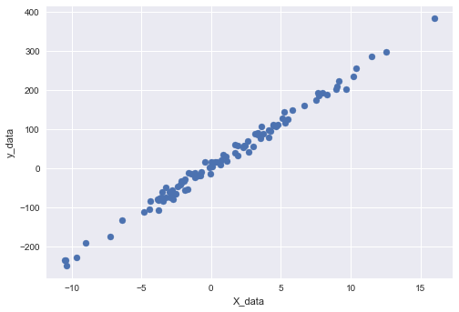
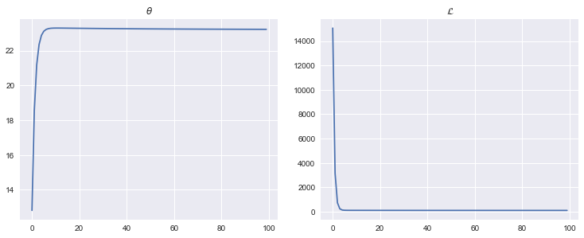

**1. Library**


```python
import torch
import torch.nn as nn
import torch.nn.functional as F
import torch.optim as optim
```

**2. Trainable variable**


```python
x_train = torch.FloatTensor([[1],[2],[3]])
y_train = torch.FloatTensor([[2],[4],[6]])
```


```python
print(x_train,y_train,sep='\n')
```

    tensor([[1.],
            [2.],
            [3.]])
    tensor([[2.],
            [4.],
            [6.]])


**3. Parameter**

- requires_grad = True 설정해, 향후 학습 시 추적 가능하게 설정해야 함
- requires_grad시, 파라미터는 float / tensor 형태여야함(int, ndarray 불가)


```python
w = torch.zeros(1,requires_grad=True)
w
```


    tensor([0.], requires_grad=True)


```python
b = torch.zeros(1,requires_grad=True)
b
```


    tensor([0.], requires_grad=True)


**4. hypothesis**


```python
h = w*x_train+b
h
```


    tensor([[0.],
            [0.],
            [0.]], grad_fn=<AddBackward0>)


**5. cost**


```python
def cost_function(x,y,w,b):
    x_train = x
    y_true = y
    w = w
    b = b
    
    y_pred = x*w+b
    cost = torch.mean((y_pred-y_true)**2)
    
    return cost
```


```python
cost = cost_function(x_train,y_train,w,b)
```

**6. gradient descent**

- 1) optimizer 선언
- 2) optimizer 내 grad 초기화
- 3) backward
- 4) step()


```python
optimizer = optim.SGD([w,b],lr=0.01)
optimizer.zero_grad()
cost.backward()
optimizer.step()
```

**7. Practice**


```python
import matplotlib.cm as cm

def make_dataset(data_sample,dim_feature=1):
    x = torch.FloatTensor(np.random.normal(scale=5, size=(data_sample,dim_feature)))
    y = x*23.4 + torch.FloatTensor(np.random.normal(loc=3, scale=10, size=(data_sample,1)))
    
    plt.style.use("seaborn")
    plt.scatter(x,y)
    plt.xlabel("X_data")
    plt.ylabel("y_data")
    
    return x,y

th_list, loss_list = [], []
    
def Linear_regression(x,y,n_epochs):
    
    w = torch.tensor(0.01, requires_grad=True)
    b = torch.tensor(0.01, requires_grad=True)
    
    for n_epoch in range(n_epochs):
        y_pred = x*w + b
        y_true = y
        cost = torch.mean((y_pred - y_true)**2)

        optimizer = optim.SGD([w,b],lr=0.01)
        optimizer.zero_grad()
        cost.backward()
        optimizer.step()
        
        th_list.append(w.item())
        loss_list.append(cost.item())

        if n_epoch%10 == 0:
            print(f"epoch : {n_epoch}, cost = {cost.item()}, w_grad = {w.item()}, b_grad = {b.item()}")

            
    fig = plt.figure(figsize=(15,10))

    left, bottom = 0.1, 0.1
    width, height = 0.3, 0.4
    spacing = 0.05
    
    ax_th = fig.add_axes([left, bottom + height + spacing, width,
                            1-(2*bottom + height + spacing)])
    ax_loss = fig.add_axes([left + width + spacing, bottom + height + spacing,
                           width, 1-(2*bottom + height + spacing)])
    
    ax_th.set_title(r'$\theta$')
    ax_loss.set_title(r'$\mathcal{L}$')
    
    ax_th.plot(th_list)
    ax_loss.plot(loss_list)
```


```python
%matplotlib inline
x, y = make_dataset(100,1)
```





```python
Linear_regression(x,y,100)
```

    epoch : 0, cost = 15061.2626953125, w_grad = 12.808013916015625, b_grad = 0.5438955426216125
    epoch : 10, cost = 119.79537200927734, w_grad = 23.29285430908203, b_grad = 1.4776756763458252
    epoch : 20, cost = 117.70941162109375, w_grad = 23.2799015045166, b_grad = 1.9267054796218872
    epoch : 30, cost = 116.29727172851562, w_grad = 23.2662410736084, b_grad = 2.2962021827697754
    epoch : 40, cost = 115.34051513671875, w_grad = 23.254995346069336, b_grad = 2.600344181060791
    epoch : 50, cost = 114.69230651855469, w_grad = 23.245737075805664, b_grad = 2.8506906032562256
    epoch : 60, cost = 114.25309753417969, w_grad = 23.23811912536621, b_grad = 3.0567567348480225
    epoch : 70, cost = 113.95552825927734, w_grad = 23.231847763061523, b_grad = 3.226375102996826
    epoch : 80, cost = 113.75391387939453, w_grad = 23.2266845703125, b_grad = 3.3659920692443848
    epoch : 90, cost = 113.61731719970703, w_grad = 23.222434997558594, b_grad = 3.480914354324341




