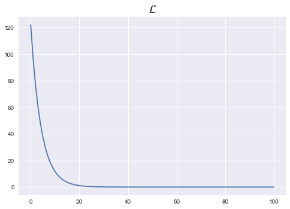
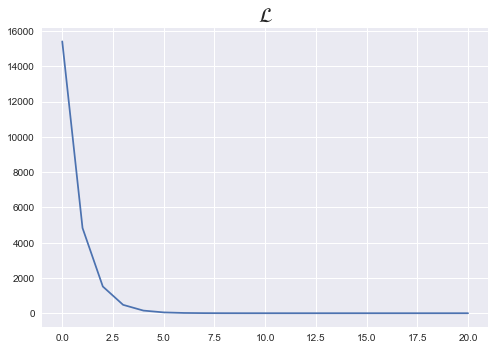

```python
%matplotlib inline
import torch
import torch.nn as nn
import torch.nn.functional as F
import torch.optim as optim
```

### Pytorch module을 활용한 선형회귀

```
- nn.Linear(input_dim, output_dim)

    - 내부적으로 dim에 맞게, w와 b를 랜덤초기화 생성함
    
    - model.parameters() 로 w,b 출력 가능
    
    - prediction = model(x_train)
    
    
- F.mse_loss(prediction, y_true)
```


```python
x_train = torch.FloatTensor([[1],[2],[3]])
y_train = x_train*5 + 1
```


```python
model = nn.Linear(1,1)
y_pred = model(x_train)
cost = F.mse_loss(y_pred,y_train)
```


```python
y_pred
```


    tensor([[-0.2180],
            [ 0.5130],
            [ 1.2441]], grad_fn=<AddmmBackward>)


```python
w,b = model.parameters()
```


```python
print(w,b)
```

    Parameter containing:
    tensor([[0.7310]], requires_grad=True) Parameter containing:
    tensor([-0.9490], requires_grad=True)


```python
loss_list = []

for epoch in range(100+1):
    
    y_pred = model(x_train)
    cost = F.mse_loss(y_pred,y_train)
    
    optimizer = optim.SGD(model.parameters(),lr=0.01)
    optimizer.zero_grad()
    cost.backward()
    optimizer.step()
    
    loss_list.append(cost)
    
    if epoch%10 == 0:
        print(f'epoch = {epoch}, cost = {cost.item()}, w,b = {list(model.parameters())}')
        print()
        
plt.style.use("seaborn")
plt.plot(loss_list)
plt.title(r"$\mathcal{L}$",fontsize=20)
```

    epoch = 0, cost = 122.1261215209961, w,b = [Parameter containing:
    tensor([[1.2074]], requires_grad=True), Parameter containing:
    tensor([-0.7393], requires_grad=True)]
    
    epoch = 10, cost = 11.629199028015137, w,b = [Parameter containing:
    tensor([[3.8472]], requires_grad=True), Parameter containing:
    tensor([0.4236], requires_grad=True)]
    
    epoch = 20, cost = 1.1077395677566528, w,b = [Parameter containing:
    tensor([[4.6613]], requires_grad=True), Parameter containing:
    tensor([0.7834], requires_grad=True)]
    
    epoch = 30, cost = 0.10587555915117264, w,b = [Parameter containing:
    tensor([[4.9121]], requires_grad=True), Parameter containing:
    tensor([0.8953], requires_grad=True)]
    
    epoch = 40, cost = 0.010459204204380512, w,b = [Parameter containing:
    tensor([[4.9891]], requires_grad=True), Parameter containing:
    tensor([0.9308], requires_grad=True)]
    
    epoch = 50, cost = 0.0013561866944655776, w,b = [Parameter containing:
    tensor([[5.0125]], requires_grad=True), Parameter containing:
    tensor([0.9426], requires_grad=True)]
    
    epoch = 60, cost = 0.0004725203907582909, w,b = [Parameter containing:
    tensor([[5.0193]], requires_grad=True), Parameter containing:
    tensor([0.9471], requires_grad=True)]
    
    epoch = 70, cost = 0.0003722397377714515, w,b = [Parameter containing:
    tensor([[5.0211]], requires_grad=True), Parameter containing:
    tensor([0.9493], requires_grad=True)]
    
    epoch = 80, cost = 0.0003473116084933281, w,b = [Parameter containing:
    tensor([[5.0213]], requires_grad=True), Parameter containing:
    tensor([0.9508], requires_grad=True)]
    
    epoch = 90, cost = 0.0003302680270280689, w,b = [Parameter containing:
    tensor([[5.0210]], requires_grad=True), Parameter containing:
    tensor([0.9521], requires_grad=True)]
    
    epoch = 100, cost = 0.00031467931694351137, w,b = [Parameter containing:
    tensor([[5.0205]], requires_grad=True), Parameter containing:
    tensor([0.9533], requires_grad=True)]
    


    Text(0.5, 1.0, '$\\mathcal{L}$')





### Pytorch module을 활용한 다중 선형회귀

```
- nn.Linear(input_dim, output_dim)

    - 내부적으로 dim에 맞게, w와 b를 랜덤초기화 생성함
    
    - model.parameters() 로 w,b 출력 가능
    
    - prediction = model(x_train)
    
    
- F.mse_loss(prediction, y_true)
```


```python
x_train = torch.FloatTensor([[73, 80, 75],
                             [93, 88, 93],
                             [89, 91, 90],
                             [96, 98, 100],
                             [73, 66, 70]])
y_train = torch.FloatTensor([[152], [185], [180], [196], [142]])
```


```python
loss_list = []
model = nn.Linear(3,1)

for epoch in range(20+1):
    
    # forward
    prediction = model(x_train)
    cost = F.mse_loss(prediction,y_train)
    
    # backward
    optimizer = optim.SGD(list(model.parameters()),lr=1e-5)
    optimizer.zero_grad()
    cost.backward()
    
    # update
    optimizer.step()
    
    loss_list.append(cost)
    
    if epoch%10 == 0:
        print(f'epoch = {epoch}, cost = {cost.item()}, w,b = {list(model.parameters())}')
        print()
        
plt.style.use("seaborn")
plt.plot(loss_list)
plt.title(r"$\mathcal{L}$",fontsize=20)
```

    epoch = 0, cost = 15408.265625, w,b = [Parameter containing:
    tensor([[0.5106, 0.1450, 0.5438]], requires_grad=True), Parameter containing:
    tensor([-0.1603], requires_grad=True)]
    
    epoch = 10, cost = 0.6238671541213989, w,b = [Parameter containing:
    tensor([[0.7793, 0.4134, 0.8156]], requires_grad=True), Parameter containing:
    tensor([-0.1571], requires_grad=True)]
    
    epoch = 20, cost = 0.48263660073280334, w,b = [Parameter containing:
    tensor([[0.7803, 0.4142, 0.8163]], requires_grad=True), Parameter containing:
    tensor([-0.1571], requires_grad=True)]
    


    Text(0.5, 1.0, '$\\mathcal{L}$')




