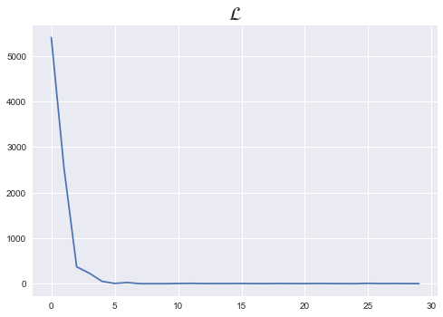

```python
%matplotlib inline
```

# 1. Custom Dataset

- torch.utils.data.Dataset 클래스를 상속받아, 메소드 오버라이딩으로 커스텀 데이터셋 생성

```python

class CustomDataset(torch.utils.data.Dataset):
    def __init__(self):
        데이터 셋의 전처리 해주는 부분
        
    def __len__(self):
        데이터셋의 길이, 즉 총 샘플의 수를 적어주는 부분
        len(dataset) 했을 때 데이터셋의 크기를 리턴할 len
        
    def __getitem__(self,idx):
        데이터셋에서 특정 1개의 샘플을 가져오는 함수
        dataset[i] 했을 때 i번째 샘플을 가져오도록 하는 인덱싱을 위한 get_item
    
```

# 2. Custom Dataset Practice _ Linear Regression


```python
import torch
import torch.nn as nn
import torch.nn.functional as F
import torch.optim as optim
from torch.utils.data import Dataset
from torch.utils.data import DataLoader
```

### 1. Dataset 상속


```python
class CustomDataset(Dataset):
    def __init__(self):
        self.x_data = [[73, 80, 75],
                   [93, 88, 93],
                   [89, 91, 90],
                   [96, 98, 100],
                   [73, 66, 70]]
        self.y_data = [[152], [185], [180], [196], [142]]
    
    # 데이터의 총 갯수를 반환
    def __len__(self):
        return len(self.x_data)
    
    # 인덱스를 입력받아 그에 매핑되는 입출력 데이터를 파이토치의 Tensor 형태로 return
    def __getitem__(self, idx):
        x = torch.FloatTensor(self.x_data[idx])
        y = torch.FloatTensor(self.y_data[idx])
        return x,y
  
```


```python
dataset = CustomDataset()
dataloader = DataLoader(dataset,batch_size=2,shuffle=True)
```


```python
dataset.x_data
```


    [[73, 80, 75], [93, 88, 93], [89, 91, 90], [96, 98, 100], [73, 66, 70]]


```python
len(dataset)
```


    5


```python
dataset[0]
```


    (tensor([73., 80., 75.]), tensor([152.]))


```python
model = nn.Linear(3,1)
optimizer = optim.SGD(model.parameters(),lr=1e-5)
```


```python
nb_epochs = 10
loss_list = []

for epoch in range(nb_epochs):
    for idx, samples in enumerate(dataloader):
        x_batch, y_batch = samples
        
        # forward
        optimizer.zero_grad()
        prediction = model(x_batch)
        cost = F.mse_loss(prediction,y_batch)
        
        # backward
        cost.backward()
        optimizer.step()
        loss_list.append(cost)
        
        print('Epoch {:4d}/{} Batch {}/{} Cost: {:.6f}'.format(
        epoch, nb_epochs, idx+1, len(dataloader),
        cost.item()
        ))
        
plt.style.use("seaborn")
plt.plot(loss_list)
plt.title(r"$\mathcal{L}$",fontsize=20)        
```

    Epoch    0/10 Batch 1/3 Cost: 5404.311523
    Epoch    0/10 Batch 2/3 Cost: 2545.112793
    Epoch    0/10 Batch 3/3 Cost: 371.150208
    Epoch    1/10 Batch 1/3 Cost: 230.321472
    Epoch    1/10 Batch 2/3 Cost: 52.190624
    Epoch    1/10 Batch 3/3 Cost: 5.210927
    Epoch    2/10 Batch 1/3 Cost: 25.317406
    Epoch    2/10 Batch 2/3 Cost: 0.067525
    Epoch    2/10 Batch 3/3 Cost: 0.043789
    Epoch    3/10 Batch 1/3 Cost: 0.082783
    Epoch    3/10 Batch 2/3 Cost: 4.311364
    Epoch    3/10 Batch 3/3 Cost: 7.004526
    Epoch    4/10 Batch 1/3 Cost: 2.175486
    Epoch    4/10 Batch 2/3 Cost: 3.128819
    Epoch    4/10 Batch 3/3 Cost: 2.856263
    Epoch    5/10 Batch 1/3 Cost: 3.823729
    Epoch    5/10 Batch 2/3 Cost: 2.125547
    Epoch    5/10 Batch 3/3 Cost: 1.444831
    Epoch    6/10 Batch 1/3 Cost: 3.784012
    Epoch    6/10 Batch 2/3 Cost: 2.458465
    Epoch    6/10 Batch 3/3 Cost: 1.463562
    Epoch    7/10 Batch 1/3 Cost: 4.148466
    Epoch    7/10 Batch 2/3 Cost: 2.271896
    Epoch    7/10 Batch 3/3 Cost: 1.240754
    Epoch    8/10 Batch 1/3 Cost: 0.570323
    Epoch    8/10 Batch 2/3 Cost: 7.690439
    Epoch    8/10 Batch 3/3 Cost: 2.257789
    Epoch    9/10 Batch 1/3 Cost: 3.986002
    Epoch    9/10 Batch 2/3 Cost: 2.194746
    Epoch    9/10 Batch 3/3 Cost: 1.319575


    Text(0.5, 1.0, '$\\mathcal{L}$')




