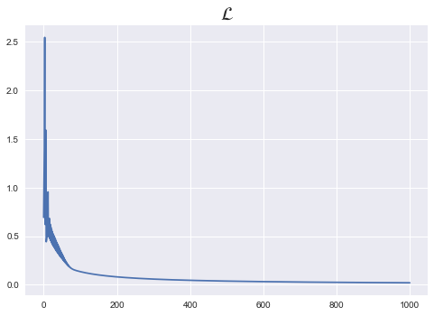

# 1. Logistic Regression


```python
import torch
import torch.nn as nn
import torch.nn.functional as F
import torch.optim as optim
```


```python
torch.manual_seed(1)
```


    <torch._C.Generator at 0x7ff81dc65dd0>


```python
x_train = torch.FloatTensor(np.array([[1,2],[2,3],[3,1],[4,3],[5,3],[6,2]]))
y_train = torch.FloatTensor(np.array([[0],[0],[0],[1],[1],[1]]))
```


```python
print(x_train.shape)
print(y_train.shape)
```

    torch.Size([6, 2])
    torch.Size([6, 1])


```python
W = torch.zeros((2,1),requires_grad=True)
b = torch.zeros(1,requires_grad=True)
```


```python
hypothesis = 1/(1+torch.exp(-(x_train.matmul(W)+b)))
```


```python
hypothesis
```


    tensor([[0.5000],
            [0.5000],
            [0.5000],
            [0.5000],
            [0.5000],
            [0.5000]], grad_fn=<MulBackward0>)


```python
hypothesis = torch.sigmoid(x_train.matmul(W)+b)
hypothesis
```


    tensor([[0.5000],
            [0.5000],
            [0.5000],
            [0.5000],
            [0.5000],
            [0.5000]], grad_fn=<SigmoidBackward>)


```python
print(hypothesis,y_train,sep='\n')
```

    tensor([[0.5000],
            [0.5000],
            [0.5000],
            [0.5000],
            [0.5000],
            [0.5000]], grad_fn=<SigmoidBackward>)
    tensor([[0.],
            [0.],
            [0.],
            [1.],
            [1.],
            [1.]])


```python
# CE = -y log(p) - (1-y) log(1-p)
-y_train[0]*torch.log(hypothesis[0]) - (1-y_train[0])*torch.log(1-hypothesis[0])
```


    tensor([0.6931], grad_fn=<SubBackward0>)


```python
losses = -y_train*torch.log(hypothesis) - (1-y_train)*torch.log(1-hypothesis)
```


```python
losses
```


    tensor([[0.6931],
            [0.6931],
            [0.6931],
            [0.6931],
            [0.6931],
            [0.6931]], grad_fn=<SubBackward0>)


```python
cost = torch.mean(losses)
cost
```


    tensor(0.6931, grad_fn=<MeanBackward0>)


```python
F.binary_cross_entropy(hypothesis,y_train)
```


    tensor(0.6931, grad_fn=<BinaryCrossEntropyBackward>)


**종합**


```python
x_train = torch.FloatTensor(np.array([[1,2],[2,3],[3,1],[4,3],[5,3],[6,2]]))
y_train = torch.FloatTensor(np.array([[0],[0],[0],[1],[1],[1]]))
```


```python
%matplotlib inline
W = torch.zeros((2,1),requires_grad=True)
b = torch.zeros(1,requires_grad=True)
optimizer = optim.SGD([W,b],lr=1)
nb_epochs = 1000
loss_list = []

for epoch in range(nb_epochs+1):
    
    # forward
    hypothesis = torch.sigmoid(x_train.matmul(W)+b)
    cost = torch.mean(F.binary_cross_entropy(hypothesis,y_train))
    
    # backward
    optimizer.zero_grad()
    cost.backward()
    optimizer.step()
    
    loss_list.append(cost)
    
    if epoch % 100 ==0:
        print('Epoch {:4d}/{}, Cost: {:.6f}'.format(epoch, nb_epochs, cost.item()))
        
plt.style.use("seaborn")
plt.plot(loss_list)
plt.title(r"$\mathcal{L}$",fontsize=20)
```

    Epoch    0/1000, Cost: 0.693147
    Epoch  100/1000, Cost: 0.134722
    Epoch  200/1000, Cost: 0.080643
    Epoch  300/1000, Cost: 0.057900
    Epoch  400/1000, Cost: 0.045300
    Epoch  500/1000, Cost: 0.037261
    Epoch  600/1000, Cost: 0.031673
    Epoch  700/1000, Cost: 0.027556
    Epoch  800/1000, Cost: 0.024394
    Epoch  900/1000, Cost: 0.021888
    Epoch 1000/1000, Cost: 0.019852


    Text(0.5, 1.0, '$\\mathcal{L}$')




