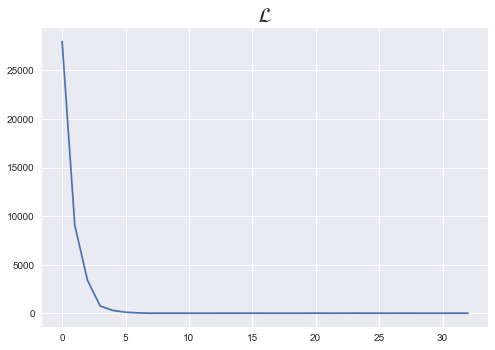
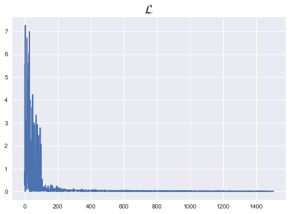

# 1. Library


```python
import torch
import torch.nn as nn
import torch.nn.functional as F
import torch.optim as optim

from torch.utils.data import Dataset
from torch.utils.data import DataLoader 
```

# 2. Custom Dataset 생성

- Custom Dataset
- Batch 단위 데이터 설정


```python
x_data = [[73, 80, 75],
                   [93, 88, 93],
                   [89, 91, 90],
                   [96, 98, 100],
                   [73, 66, 70]]
y_data = [[152], [185], [180], [196], [142]]
```


```python
x_data
```


    [[73, 80, 75], [93, 88, 93], [89, 91, 90], [96, 98, 100], [73, 66, 70]]


```python
y_data
```


    [[152], [185], [180], [196], [142]]


```python
class Custom_Dataset(Dataset):
    def __init__(self,x,y):
        self._x = x
        self._y = y
        
    def __len__(self):
        return len(self._x)
    
    def __getitem__(self,idx):
        x = torch.FloatTensor(self._x[idx])
        y = torch.FloatTensor(self._y[idx])
        return x,y
```


```python
dataset = Custom_Dataset(x_data,y_data)
dataloader = DataLoader(dataset, batch_size=2, shuffle=True)
```

# 3. model 생성

- nn.Module을 상속받아 생성


```python
class Linear(nn.Module):
    def __init__(self):
        super().__init__()
        self.linear = nn.Linear(3,1)
        
    def forward(self,x):
        return self.linear(x)

```


```python
model = Linear()
```


```python
%matplotlib inline
nb_epochs = 10
lr = 1e-5
loss_list = []
optimizer = optim.SGD(model.parameters(), lr)

for epoch in range(nb_epochs+1):
    for idx, samples in enumerate(dataloader):
        x_batch, y_batch = samples
        
        # forward
        optimizer.zero_grad()
        prediction = model(x_batch)
        cost = F.mse_loss(prediction, y_batch)
        
        # backward
        cost.backward()
        optimizer.step()
        
        loss_list.append(cost)
        
        if epoch % 10 == 0:
            print(f'epoch : {epoch}, batch : {idx+1}/{len(dataloader)} cost : {cost.item()}')
        
        
plt.style.use("seaborn")
plt.plot(loss_list)
plt.title(r"$\mathcal{L}$",fontsize=20)
```

    epoch : 0, batch : 1/3 cost : 27985.578125
    epoch : 0, batch : 2/3 cost : 9042.2578125
    epoch : 0, batch : 3/3 cost : 3392.4013671875
    epoch : 10, batch : 1/3 cost : 0.14232802391052246
    epoch : 10, batch : 2/3 cost : 5.522786617279053
    epoch : 10, batch : 3/3 cost : 0.0995536521077156


    Text(0.5, 1.0, '$\\mathcal{L}$')





```python
%reset
```

    Once deleted, variables cannot be recovered. Proceed (y/[n])? y


# 1. Logistic Regression

- binary classification


```python
import matplotlib.pyplot as plt
%matplotlib inline
import torch
import torch.nn as nn
import torch.nn.functional as F
import torch.optim as optim

from torch.utils.data import Dataset
from torch.utils.data import DataLoader
```


```python
x_data = [[1, 2], [2, 3], [3, 1], [4, 3], [5, 3], [6, 2]]
y_data = [[0], [0], [0], [1], [1], [1]]
x_train = torch.FloatTensor(x_data)
y_train = torch.FloatTensor(y_data)
```

### 1) trainable variable


```python
class CustomDataset(Dataset):
    def __init__(self,x,y):
        self._x = x
        self._y = y
        
    def __len__(self):
        return len(self._x)
    
    def __getitem__(self,idx):
        x = torch.FloatTensor(self._x[idx])
        y = torch.FloatTensor(self._y[idx])
        return x,y
```


```python
dataset = CustomDataset(x_train,y_train)
dataloader = DataLoader(dataset, batch_size=2, shuffle=True)
```

### 2) trian


```python
class BinaryClassifier(nn.Module):
    def __init__(self):
        super().__init__()
        self.linear = nn.Linear(2,1)
        self.sigmoid = nn.Sigmoid()
        
    def forward(self,x):
        model = nn.Sequential(self.linear, self.sigmoid)
        return model(x)
```


```python
model = BinaryClassifier()
```


```python
nb_epoch = 500
lr = 1
loss_list = []
optimizer = optim.SGD(model.parameters(),lr)

for epoch in range(nb_epoch+1):
    for idx, samples in enumerate(dataloader):
        x_batch, y_batch = samples
        
        #forward
        prediction = model(x_batch)
        cost = F.binary_cross_entropy(prediction,y_batch)
        
        # backward
        optimizer.zero_grad()
        cost.backward()
        optimizer.step()
        
        loss_list.append(cost)
        
        pred_binary = prediction >= torch.FloatTensor([0.5])
        pred_accurate = pred_binary.float() == y_batch
        accuracy = pred_accurate.float().sum()/len(pred_accurate)
        
        if epoch % 100 == 0:
            print(f'epoch : {epoch}, batch : {idx+1}/{len(dataloader)}, cost : {cost.item()},  accuaracy : {accuracy}')
        
        
plt.style.use("seaborn")
plt.plot(loss_list)
plt.title(r"$\mathcal{L}$",fontsize=20)
```

    epoch : 0, batch : 1/3, cost : 0.873956561088562,  accuaracy : 0.5
    epoch : 0, batch : 2/3, cost : 0.2620071470737457,  accuaracy : 1.0
    epoch : 0, batch : 3/3, cost : 5.569793701171875,  accuaracy : 0.0
    epoch : 100, batch : 1/3, cost : 0.02553759142756462,  accuaracy : 1.0
    epoch : 100, batch : 2/3, cost : 0.022480027750134468,  accuaracy : 1.0
    epoch : 100, batch : 3/3, cost : 0.07537086308002472,  accuaracy : 1.0
    epoch : 200, batch : 1/3, cost : 0.03623070940375328,  accuaracy : 1.0
    epoch : 200, batch : 2/3, cost : 0.026826685294508934,  accuaracy : 1.0
    epoch : 200, batch : 3/3, cost : 0.0002900187100749463,  accuaracy : 1.0
    epoch : 300, batch : 1/3, cost : 0.014645399525761604,  accuaracy : 1.0
    epoch : 300, batch : 2/3, cost : 0.02330169640481472,  accuaracy : 1.0
    epoch : 300, batch : 3/3, cost : 0.015282846987247467,  accuaracy : 1.0
    epoch : 400, batch : 1/3, cost : 0.013663364574313164,  accuaracy : 1.0
    epoch : 400, batch : 2/3, cost : 0.00025167077546939254,  accuaracy : 1.0
    epoch : 400, batch : 3/3, cost : 0.028473034501075745,  accuaracy : 1.0
    epoch : 500, batch : 1/3, cost : 0.011182460002601147,  accuaracy : 1.0
    epoch : 500, batch : 2/3, cost : 0.0001943982351804152,  accuaracy : 1.0
    epoch : 500, batch : 3/3, cost : 0.02359193190932274,  accuaracy : 1.0


    Text(0.5, 1.0, '$\\mathcal{L}$')





```python
%reset
```

    Once deleted, variables cannot be recovered. Proceed (y/[n])? ㅛ
    Once deleted, variables cannot be recovered. Proceed (y/[n])? y


# 3. Softmax Lossfunction


```python
import torch
import torch.nn as nn
import torch.nn.functional as F
import torch.optim as optim
```


```python
torch.manual_seed(1)
```


    <torch._C.Generator at 0x7f9489365d90>


```python
# forward

x = torch.rand(3,5,requires_grad=True)
x
```


    tensor([[0.7576, 0.2793, 0.4031, 0.7347, 0.0293],
            [0.7999, 0.3971, 0.7544, 0.5695, 0.4388],
            [0.6387, 0.5247, 0.6826, 0.3051, 0.4635]], requires_grad=True)


```python
# class니까 integer로 명확하게
y = torch.FloatTensor([0,2,1]).long()
y
```


    tensor([0, 2, 1])


```python
# onehot
y_ = y.view(-1,1)
y_
```


    tensor([[0],
            [2],
            [1]])


```python
y_zero = torch.zeros_like(x)
y_zero
```


    tensor([[0., 0., 0., 0., 0.],
            [0., 0., 0., 0., 0.],
            [0., 0., 0., 0., 0.]])


```python
y_onehot = y_zero.scatter(1,y_,1)
y_onehot
```


    tensor([[1., 0., 0., 0., 0.],
            [0., 0., 1., 0., 0.],
            [0., 1., 0., 0., 0.]])


```python
pred = F.softmax(x,dim=1)
pred
```


    tensor([[0.2645, 0.1639, 0.1855, 0.2585, 0.1277],
            [0.2430, 0.1624, 0.2322, 0.1930, 0.1694],
            [0.2226, 0.1986, 0.2326, 0.1594, 0.1868]], grad_fn=<SoftmaxBackward>)


```python
# loss

loss = (y_onehot*-torch.log(pred)).sum(dim=1).mean()
loss
```


    tensor(1.4689, grad_fn=<MeanBackward0>)


```python
# F.log_softmax == torch.log(F.softmax(x))활용

F.log_softmax(x,dim=1)
```


    tensor([[-1.3301, -1.8084, -1.6846, -1.3530, -2.0584],
            [-1.4147, -1.8174, -1.4602, -1.6450, -1.7758],
            [-1.5025, -1.6165, -1.4586, -1.8360, -1.6776]],
           grad_fn=<LogSoftmaxBackward>)


```python
torch.log(F.softmax(x,dim=1))
```


    tensor([[-1.3301, -1.8084, -1.6846, -1.3530, -2.0584],
            [-1.4147, -1.8174, -1.4602, -1.6450, -1.7758],
            [-1.5025, -1.6165, -1.4586, -1.8360, -1.6776]], grad_fn=<LogBackward>)


```python
# F.nll_loss(x,y) == (y - F.log_softmax(x))

F.nll_loss(F.log_softmax(x,dim=1),y)
```


    tensor(1.4689, grad_fn=<NllLossBackward>)


```python
# F.cross_entorpy(x,y) ===>>> x (3,5), y(3,), shape는 샘플갯수 == y length 이기만 하면 됨!
# 그럼 알아서, 각 샘플 당(row) Softamx_cross_entropy 값 구해서, y_class 와 비교해서 cost 산출함

cost = F.cross_entropy(x,y)
cost
```


    tensor(1.4689, grad_fn=<NllLossBackward>)


