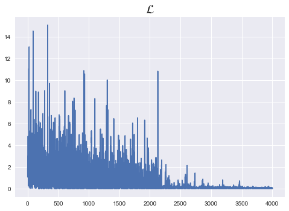
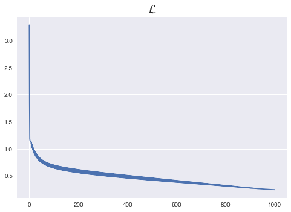

```python
%matplotlib inline
import torch
import torch.nn as nn
import torch.nn.functional as F
import torch.optim as optim

from torch.utils.data import TensorDataset
from torch.utils.data import DataLoader

torch.manual_seed(1)
```


    <torch._C.Generator at 0x7fe9ef365dd0>


```python
x_train = [[1, 2, 1, 1],
           [2, 1, 3, 2],
           [3, 1, 3, 4],
           [4, 1, 5, 5],
           [1, 7, 5, 5],
           [1, 2, 5, 6],
           [1, 6, 6, 6],
           [1, 7, 7, 7]]
y_train = [2, 2, 2, 1, 1, 1, 0, 0]
```


```python
x_data = torch.FloatTensor(x_train)
y_data = torch.LongTensor(y_train)
```


```python
print(x_data.shape,y_data.shape)
```

    torch.Size([8, 4]) torch.Size([8])


```python
class Softmax_Classifier(nn.Module):
    def __init__(self):
        super().__init__()
        self.linear = nn.Linear(4,3)
    
    def forward(self,x):
        return self.linear(x)
```


```python
model = Softmax_Classifier()
```


```python
# dataset = TensorDataset(x_data,y_data)
# dataloader = DataLoader(dataset,batch_size=2,shuffle=True)
```


```python
n_epochs = 1000
lr = 0.1
loss_list = []
optimizer = optim.SGD(model.parameters(),lr)

for epoch in range(n_epochs+1):
    for idx, samples in enumerate(dataloader):
        x_batch,y_batch = samples
        
        # forward
        pred = model(x_batch)
        cost = F.cross_entropy(pred,y_batch)
        
        # backward
        optimizer.zero_grad()
        cost.backward()
        optimizer.step()
        
        loss_list.append(cost.item())
        
        if epoch % 10 ==0:
            print('Epoch {:4d}/{}, Cost: {:.6f}'.format(epoch, n_epochs, cost.item()))
        
plt.style.use("seaborn")
plt.plot(loss_list)
plt.title(r"$\mathcal{L}$",fontsize=20)
    
```

    Epoch    0/1000, Cost: 1.986451
    Epoch    0/1000, Cost: 1.084350
    Epoch    0/1000, Cost: 2.722252
    Epoch    0/1000, Cost: 2.546151
    Epoch   10/1000, Cost: 0.333079
    Epoch   10/1000, Cost: 3.362807
    Epoch   10/1000, Cost: 0.043753
    Epoch   10/1000, Cost: 4.397962
    Epoch   20/1000, Cost: 0.725944
    Epoch   20/1000, Cost: 0.813842
    Epoch   20/1000, Cost: 2.239413
    Epoch   20/1000, Cost: 3.740557
    Epoch   30/1000, Cost: 4.414694
    Epoch   30/1000, Cost: 0.484693
    Epoch   30/1000, Cost: 0.782467
    Epoch   30/1000, Cost: 1.337133
    Epoch   40/1000, Cost: 2.193757
    Epoch   40/1000, Cost: 0.705626
    Epoch   40/1000, Cost: 1.134010
    Epoch   40/1000, Cost: 0.241961
    Epoch   50/1000, Cost: 0.104471
    Epoch   50/1000, Cost: 3.182760
    Epoch   50/1000, Cost: 0.109177
    Epoch   50/1000, Cost: 1.215164
    Epoch   60/1000, Cost: 2.852389
    Epoch   60/1000, Cost: 0.062763
    Epoch   60/1000, Cost: 0.797507
    Epoch   60/1000, Cost: 0.436915
    Epoch   70/1000, Cost: 9.068081
    Epoch   70/1000, Cost: 0.028360
    Epoch   70/1000, Cost: 2.244585
    Epoch   70/1000, Cost: 0.410832
    Epoch   80/1000, Cost: 0.386342
    Epoch   80/1000, Cost: 0.532959
    Epoch   80/1000, Cost: 0.268487
    Epoch   80/1000, Cost: 3.436175
    Epoch   90/1000, Cost: 5.614843
    Epoch   90/1000, Cost: 0.154923
    Epoch   90/1000, Cost: 0.424572
    Epoch   90/1000, Cost: 0.224663
    Epoch  100/1000, Cost: 5.029701
    Epoch  100/1000, Cost: 0.161297
    Epoch  100/1000, Cost: 3.237209
    Epoch  100/1000, Cost: 5.106636
    Epoch  110/1000, Cost: 0.229238
    Epoch  110/1000, Cost: 1.941719
    Epoch  110/1000, Cost: 0.622129
    Epoch  110/1000, Cost: 0.406830
    Epoch  120/1000, Cost: 0.098916
    Epoch  120/1000, Cost: 0.044188
    Epoch  120/1000, Cost: 2.856983
    Epoch  120/1000, Cost: 0.260377
    Epoch  130/1000, Cost: 0.014826
    Epoch  130/1000, Cost: 0.506802
    Epoch  130/1000, Cost: 0.617208
    Epoch  130/1000, Cost: 2.112740
    Epoch  140/1000, Cost: 3.799349
    Epoch  140/1000, Cost: 0.391757
    Epoch  140/1000, Cost: 0.744667
    Epoch  140/1000, Cost: 1.722460
    Epoch  150/1000, Cost: 4.551688
    Epoch  150/1000, Cost: 5.763482
    Epoch  150/1000, Cost: 2.790919
    Epoch  150/1000, Cost: 0.394254
    Epoch  160/1000, Cost: 5.495385
    Epoch  160/1000, Cost: 0.804468
    Epoch  160/1000, Cost: 0.036034
    Epoch  160/1000, Cost: 1.759877
    Epoch  170/1000, Cost: 0.016562
    Epoch  170/1000, Cost: 0.032899
    Epoch  170/1000, Cost: 0.910708
    Epoch  170/1000, Cost: 2.526545
    Epoch  180/1000, Cost: 2.766366
    Epoch  180/1000, Cost: 4.830215
    Epoch  180/1000, Cost: 4.078483
    Epoch  180/1000, Cost: 0.318930
    Epoch  190/1000, Cost: 0.019887
    Epoch  190/1000, Cost: 0.947835
    Epoch  190/1000, Cost: 2.183874
    Epoch  190/1000, Cost: 5.574011
    Epoch  200/1000, Cost: 3.516375
    Epoch  200/1000, Cost: 2.514672
    Epoch  200/1000, Cost: 0.926255
    Epoch  200/1000, Cost: 1.027241
    Epoch  210/1000, Cost: 0.562899
    Epoch  210/1000, Cost: 0.010096
    Epoch  210/1000, Cost: 0.513313
    Epoch  210/1000, Cost: 4.527745
    Epoch  220/1000, Cost: 0.239011
    Epoch  220/1000, Cost: 0.010117
    Epoch  220/1000, Cost: 1.966743
    Epoch  220/1000, Cost: 0.025793
    Epoch  230/1000, Cost: 1.440747
    Epoch  230/1000, Cost: 0.550947
    Epoch  230/1000, Cost: 0.177636
    Epoch  230/1000, Cost: 0.090220
    Epoch  240/1000, Cost: 0.531356
    Epoch  240/1000, Cost: 3.564937
    Epoch  240/1000, Cost: 4.374398
    Epoch  240/1000, Cost: 0.012648
    Epoch  250/1000, Cost: 0.772414
    Epoch  250/1000, Cost: 2.520125
    Epoch  250/1000, Cost: 1.789207
    Epoch  250/1000, Cost: 0.811950
    Epoch  260/1000, Cost: 1.176494
    Epoch  260/1000, Cost: 0.801068
    Epoch  260/1000, Cost: 0.145516
    Epoch  260/1000, Cost: 5.356641
    Epoch  270/1000, Cost: 0.639784
    Epoch  270/1000, Cost: 0.126398
    Epoch  270/1000, Cost: 0.607612
    Epoch  270/1000, Cost: 3.106128
    Epoch  280/1000, Cost: 0.038535
    Epoch  280/1000, Cost: 3.745087
    Epoch  280/1000, Cost: 2.493456
    Epoch  280/1000, Cost: 0.299280
    Epoch  290/1000, Cost: 0.143549
    Epoch  290/1000, Cost: 0.093375
    Epoch  290/1000, Cost: 0.642261
    Epoch  290/1000, Cost: 1.879363
    Epoch  300/1000, Cost: 2.676379
    Epoch  300/1000, Cost: 0.078415
    Epoch  300/1000, Cost: 1.348385
    Epoch  300/1000, Cost: 0.744781
    Epoch  310/1000, Cost: 0.001707
    Epoch  310/1000, Cost: 2.192466
    Epoch  310/1000, Cost: 3.335495
    Epoch  310/1000, Cost: 0.170110
    Epoch  320/1000, Cost: 0.790831
    Epoch  320/1000, Cost: 0.621185
    Epoch  320/1000, Cost: 0.627431
    Epoch  320/1000, Cost: 1.231061
    Epoch  330/1000, Cost: 0.428997
    Epoch  330/1000, Cost: 0.003676
    Epoch  330/1000, Cost: 1.498340
    Epoch  330/1000, Cost: 0.004068
    Epoch  340/1000, Cost: 0.293165
    Epoch  340/1000, Cost: 0.106083
    Epoch  340/1000, Cost: 0.621655
    Epoch  340/1000, Cost: 0.799732
    Epoch  350/1000, Cost: 0.174653
    Epoch  350/1000, Cost: 0.359050
    Epoch  350/1000, Cost: 0.083626
    Epoch  350/1000, Cost: 1.048517
    Epoch  360/1000, Cost: 1.889392
    Epoch  360/1000, Cost: 0.011146
    Epoch  360/1000, Cost: 2.631323
    Epoch  360/1000, Cost: 1.238590
    Epoch  370/1000, Cost: 0.174676
    Epoch  370/1000, Cost: 0.904314
    Epoch  370/1000, Cost: 0.001307
    Epoch  370/1000, Cost: 2.240074
    Epoch  380/1000, Cost: 0.171751
    Epoch  380/1000, Cost: 0.489482
    Epoch  380/1000, Cost: 3.419664
    Epoch  380/1000, Cost: 0.425671
    Epoch  390/1000, Cost: 0.008828
    Epoch  390/1000, Cost: 1.240062
    Epoch  390/1000, Cost: 0.027809
    Epoch  390/1000, Cost: 1.182983
    Epoch  400/1000, Cost: 0.010656
    Epoch  400/1000, Cost: 2.578546
    Epoch  400/1000, Cost: 0.003244
    Epoch  400/1000, Cost: 3.595966
    Epoch  410/1000, Cost: 0.186623
    Epoch  410/1000, Cost: 0.203554
    Epoch  410/1000, Cost: 0.190551
    Epoch  410/1000, Cost: 0.009042
    Epoch  420/1000, Cost: 1.301494
    Epoch  420/1000, Cost: 0.073648
    Epoch  420/1000, Cost: 0.002913
    Epoch  420/1000, Cost: 4.594869
    Epoch  430/1000, Cost: 0.054034
    Epoch  430/1000, Cost: 0.127249
    Epoch  430/1000, Cost: 0.104088
    Epoch  430/1000, Cost: 0.667073
    Epoch  440/1000, Cost: 2.284001
    Epoch  440/1000, Cost: 1.204889
    Epoch  440/1000, Cost: 1.458750
    Epoch  440/1000, Cost: 0.493319
    Epoch  450/1000, Cost: 2.446368
    Epoch  450/1000, Cost: 0.517403
    Epoch  450/1000, Cost: 0.026129
    Epoch  450/1000, Cost: 0.176156
    Epoch  460/1000, Cost: 0.169426
    Epoch  460/1000, Cost: 0.115910
    Epoch  460/1000, Cost: 0.042761
    Epoch  460/1000, Cost: 0.313018
    Epoch  470/1000, Cost: 0.000171
    Epoch  470/1000, Cost: 1.764567
    Epoch  470/1000, Cost: 0.470810
    Epoch  470/1000, Cost: 0.808973
    Epoch  480/1000, Cost: 0.212234
    Epoch  480/1000, Cost: 0.045577
    Epoch  480/1000, Cost: 0.079036
    Epoch  480/1000, Cost: 0.209002
    Epoch  490/1000, Cost: 0.070810
    Epoch  490/1000, Cost: 0.612424
    Epoch  490/1000, Cost: 0.035585
    Epoch  490/1000, Cost: 0.533884
    Epoch  500/1000, Cost: 0.696784
    Epoch  500/1000, Cost: 1.604073
    Epoch  500/1000, Cost: 0.586661
    Epoch  500/1000, Cost: 1.211206
    Epoch  510/1000, Cost: 0.067945
    Epoch  510/1000, Cost: 0.008438
    Epoch  510/1000, Cost: 0.051452
    Epoch  510/1000, Cost: 0.967422
    Epoch  520/1000, Cost: 0.406087
    Epoch  520/1000, Cost: 0.455027
    Epoch  520/1000, Cost: 1.329839
    Epoch  520/1000, Cost: 0.026946
    Epoch  530/1000, Cost: 0.075045
    Epoch  530/1000, Cost: 0.107069
    Epoch  530/1000, Cost: 0.003104
    Epoch  530/1000, Cost: 0.450277
    Epoch  540/1000, Cost: 0.005927
    Epoch  540/1000, Cost: 0.056615
    Epoch  540/1000, Cost: 0.161480
    Epoch  540/1000, Cost: 0.153667
    Epoch  550/1000, Cost: 0.073446
    Epoch  550/1000, Cost: 0.136132
    Epoch  550/1000, Cost: 0.027143
    Epoch  550/1000, Cost: 0.112895
    Epoch  560/1000, Cost: 0.165067
    Epoch  560/1000, Cost: 0.043517
    Epoch  560/1000, Cost: 0.168102
    Epoch  560/1000, Cost: 0.078841
    Epoch  570/1000, Cost: 0.062261
    Epoch  570/1000, Cost: 0.048735
    Epoch  570/1000, Cost: 0.393132
    Epoch  570/1000, Cost: 0.033416
    Epoch  580/1000, Cost: 0.029160
    Epoch  580/1000, Cost: 0.296148
    Epoch  580/1000, Cost: 0.018166
    Epoch  580/1000, Cost: 0.830585
    Epoch  590/1000, Cost: 0.110509
    Epoch  590/1000, Cost: 0.165750
    Epoch  590/1000, Cost: 0.069575
    Epoch  590/1000, Cost: 0.072824
    Epoch  600/1000, Cost: 0.162454
    Epoch  600/1000, Cost: 0.074464
    Epoch  600/1000, Cost: 0.186864
    Epoch  600/1000, Cost: 0.170309
    Epoch  610/1000, Cost: 0.097831
    Epoch  610/1000, Cost: 0.113193
    Epoch  610/1000, Cost: 0.157663
    Epoch  610/1000, Cost: 0.080568
    Epoch  620/1000, Cost: 0.188694
    Epoch  620/1000, Cost: 0.131975
    Epoch  620/1000, Cost: 0.056570
    Epoch  620/1000, Cost: 0.160165
    Epoch  630/1000, Cost: 0.086427
    Epoch  630/1000, Cost: 0.050639
    Epoch  630/1000, Cost: 0.083278
    Epoch  630/1000, Cost: 0.167441
    Epoch  640/1000, Cost: 0.121460
    Epoch  640/1000, Cost: 0.032588
    Epoch  640/1000, Cost: 0.130449
    Epoch  640/1000, Cost: 0.249759
    Epoch  650/1000, Cost: 0.126782
    Epoch  650/1000, Cost: 0.111304
    Epoch  650/1000, Cost: 0.033681
    Epoch  650/1000, Cost: 0.148231
    Epoch  660/1000, Cost: 0.098769
    Epoch  660/1000, Cost: 0.127474
    Epoch  660/1000, Cost: 0.166841
    Epoch  660/1000, Cost: 0.008756
    Epoch  670/1000, Cost: 0.212326
    Epoch  670/1000, Cost: 0.017286
    Epoch  670/1000, Cost: 0.214701
    Epoch  670/1000, Cost: 0.142118
    Epoch  680/1000, Cost: 0.223649
    Epoch  680/1000, Cost: 0.055608
    Epoch  680/1000, Cost: 0.309741
    Epoch  680/1000, Cost: 0.066797
    Epoch  690/1000, Cost: 0.083831
    Epoch  690/1000, Cost: 0.039448
    Epoch  690/1000, Cost: 0.022522
    Epoch  690/1000, Cost: 0.197260
    Epoch  700/1000, Cost: 0.039193
    Epoch  700/1000, Cost: 0.057090
    Epoch  700/1000, Cost: 0.072873
    Epoch  700/1000, Cost: 0.136185
    Epoch  710/1000, Cost: 0.040668
    Epoch  710/1000, Cost: 0.104781
    Epoch  710/1000, Cost: 0.034247
    Epoch  710/1000, Cost: 0.179748
    Epoch  720/1000, Cost: 0.236565
    Epoch  720/1000, Cost: 0.018461
    Epoch  720/1000, Cost: 0.459276
    Epoch  720/1000, Cost: 0.034720
    Epoch  730/1000, Cost: 0.110572
    Epoch  730/1000, Cost: 0.087611
    Epoch  730/1000, Cost: 0.001561
    Epoch  730/1000, Cost: 0.154064
    Epoch  740/1000, Cost: 0.212286
    Epoch  740/1000, Cost: 0.072516
    Epoch  740/1000, Cost: 0.009272
    Epoch  740/1000, Cost: 0.212298
    Epoch  750/1000, Cost: 0.198796
    Epoch  750/1000, Cost: 0.061522
    Epoch  750/1000, Cost: 0.021015
    Epoch  750/1000, Cost: 0.098539
    Epoch  760/1000, Cost: 0.081594
    Epoch  760/1000, Cost: 0.020824
    Epoch  760/1000, Cost: 0.051092
    Epoch  760/1000, Cost: 0.139571
    Epoch  770/1000, Cost: 0.140578
    Epoch  770/1000, Cost: 0.109541
    Epoch  770/1000, Cost: 0.091421
    Epoch  770/1000, Cost: 0.001651
    Epoch  780/1000, Cost: 0.078017
    Epoch  780/1000, Cost: 0.108517
    Epoch  780/1000, Cost: 0.013690
    Epoch  780/1000, Cost: 0.190894
    Epoch  790/1000, Cost: 0.036090
    Epoch  790/1000, Cost: 0.190697
    Epoch  790/1000, Cost: 0.128417
    Epoch  790/1000, Cost: 0.055655
    Epoch  800/1000, Cost: 0.097349
    Epoch  800/1000, Cost: 0.049200
    Epoch  800/1000, Cost: 0.008427
    Epoch  800/1000, Cost: 0.148272
    Epoch  810/1000, Cost: 0.067118
    Epoch  810/1000, Cost: 0.008234
    Epoch  810/1000, Cost: 0.178838
    Epoch  810/1000, Cost: 0.178563
    Epoch  820/1000, Cost: 0.060940
    Epoch  820/1000, Cost: 0.126887
    Epoch  820/1000, Cost: 0.006501
    Epoch  820/1000, Cost: 0.066469
    Epoch  830/1000, Cost: 0.000333
    Epoch  830/1000, Cost: 0.162851
    Epoch  830/1000, Cost: 0.120459
    Epoch  830/1000, Cost: 0.099935
    Epoch  840/1000, Cost: 0.031284
    Epoch  840/1000, Cost: 0.219044
    Epoch  840/1000, Cost: 0.190899
    Epoch  840/1000, Cost: 0.025545
    Epoch  850/1000, Cost: 0.192923
    Epoch  850/1000, Cost: 0.000501
    Epoch  850/1000, Cost: 0.110194
    Epoch  850/1000, Cost: 0.092951
    Epoch  860/1000, Cost: 0.021843
    Epoch  860/1000, Cost: 0.095242
    Epoch  860/1000, Cost: 0.120698
    Epoch  860/1000, Cost: 0.074090
    Epoch  870/1000, Cost: 0.034038
    Epoch  870/1000, Cost: 0.027071
    Epoch  870/1000, Cost: 0.254528
    Epoch  870/1000, Cost: 0.005678
    Epoch  880/1000, Cost: 0.074203
    Epoch  880/1000, Cost: 0.058805
    Epoch  880/1000, Cost: 0.028841
    Epoch  880/1000, Cost: 0.114145
    Epoch  890/1000, Cost: 0.102385
    Epoch  890/1000, Cost: 0.103205
    Epoch  890/1000, Cost: 0.023525
    Epoch  890/1000, Cost: 0.040092
    Epoch  900/1000, Cost: 0.030082
    Epoch  900/1000, Cost: 0.035228
    Epoch  900/1000, Cost: 0.200440
    Epoch  900/1000, Cost: 0.081428
    Epoch  910/1000, Cost: 0.104582
    Epoch  910/1000, Cost: 0.029135
    Epoch  910/1000, Cost: 0.153429
    Epoch  910/1000, Cost: 0.033124
    Epoch  920/1000, Cost: 0.240392
    Epoch  920/1000, Cost: 0.168260
    Epoch  920/1000, Cost: 0.000568
    Epoch  920/1000, Cost: 0.084956
    Epoch  930/1000, Cost: 0.094922
    Epoch  930/1000, Cost: 0.072535
    Epoch  930/1000, Cost: 0.030060
    Epoch  930/1000, Cost: 0.082092
    Epoch  940/1000, Cost: 0.045636
    Epoch  940/1000, Cost: 0.019216
    Epoch  940/1000, Cost: 0.072838
    Epoch  940/1000, Cost: 0.120970
    Epoch  950/1000, Cost: 0.081374
    Epoch  950/1000, Cost: 0.074202
    Epoch  950/1000, Cost: 0.091463
    Epoch  950/1000, Cost: 0.083398
    Epoch  960/1000, Cost: 0.071482
    Epoch  960/1000, Cost: 0.029684
    Epoch  960/1000, Cost: 0.049318
    Epoch  960/1000, Cost: 0.150379
    Epoch  970/1000, Cost: 0.062083
    Epoch  970/1000, Cost: 0.012640
    Epoch  970/1000, Cost: 0.050374
    Epoch  970/1000, Cost: 0.199238
    Epoch  980/1000, Cost: 0.011252
    Epoch  980/1000, Cost: 0.016515
    Epoch  980/1000, Cost: 0.176266
    Epoch  980/1000, Cost: 0.046121
    Epoch  990/1000, Cost: 0.064737
    Epoch  990/1000, Cost: 0.027557
    Epoch  990/1000, Cost: 0.075138
    Epoch  990/1000, Cost: 0.055218
    Epoch 1000/1000, Cost: 0.025451
    Epoch 1000/1000, Cost: 0.081997
    Epoch 1000/1000, Cost: 0.067358
    Epoch 1000/1000, Cost: 0.022770


    Text(0.5, 1.0, '$\\mathcal{L}$')





```python
n_epochs = 1000
lr = 0.1
loss_list = []
optimizer = optim.SGD(model.parameters(),lr)

for epoch in range(n_epochs+1):
        
    # forward
    pred = model(x_data)
    cost = F.cross_entropy(pred,y_data)

    # backward
    optimizer.zero_grad()
    cost.backward()
    optimizer.step()

    loss_list.append(cost.item())

    if epoch % 10 ==0:
        print('Epoch {:4d}/{}, Cost: {:.6f}'.format(epoch, n_epochs, cost.item()))
        
plt.style.use("seaborn")
plt.plot(loss_list)
plt.title(r"$\mathcal{L}$",fontsize=20)
    
```

    Epoch    0/1000, Cost: 3.288347
    Epoch   10/1000, Cost: 1.052615
    Epoch   20/1000, Cost: 0.916325
    Epoch   30/1000, Cost: 0.839155
    Epoch   40/1000, Cost: 0.785695
    Epoch   50/1000, Cost: 0.746576
    Epoch   60/1000, Cost: 0.716815
    Epoch   70/1000, Cost: 0.693313
    Epoch   80/1000, Cost: 0.674101
    Epoch   90/1000, Cost: 0.657919
    Epoch  100/1000, Cost: 0.643941
    Epoch  110/1000, Cost: 0.631618
    Epoch  120/1000, Cost: 0.620569
    Epoch  130/1000, Cost: 0.610526
    Epoch  140/1000, Cost: 0.601292
    Epoch  150/1000, Cost: 0.592722
    Epoch  160/1000, Cost: 0.584704
    Epoch  170/1000, Cost: 0.577152
    Epoch  180/1000, Cost: 0.569998
    Epoch  190/1000, Cost: 0.563187
    Epoch  200/1000, Cost: 0.556674
    Epoch  210/1000, Cost: 0.550423
    Epoch  220/1000, Cost: 0.544403
    Epoch  230/1000, Cost: 0.538588
    Epoch  240/1000, Cost: 0.532958
    Epoch  250/1000, Cost: 0.527492
    Epoch  260/1000, Cost: 0.522177
    Epoch  270/1000, Cost: 0.516997
    Epoch  280/1000, Cost: 0.511940
    Epoch  290/1000, Cost: 0.506997
    Epoch  300/1000, Cost: 0.502158
    Epoch  310/1000, Cost: 0.497415
    Epoch  320/1000, Cost: 0.492760
    Epoch  330/1000, Cost: 0.488187
    Epoch  340/1000, Cost: 0.483690
    Epoch  350/1000, Cost: 0.479263
    Epoch  360/1000, Cost: 0.474902
    Epoch  370/1000, Cost: 0.470603
    Epoch  380/1000, Cost: 0.466361
    Epoch  390/1000, Cost: 0.462173
    Epoch  400/1000, Cost: 0.458036
    Epoch  410/1000, Cost: 0.453945
    Epoch  420/1000, Cost: 0.449899
    Epoch  430/1000, Cost: 0.445894
    Epoch  440/1000, Cost: 0.441928
    Epoch  450/1000, Cost: 0.437998
    Epoch  460/1000, Cost: 0.434103
    Epoch  470/1000, Cost: 0.430240
    Epoch  480/1000, Cost: 0.426407
    Epoch  490/1000, Cost: 0.422602
    Epoch  500/1000, Cost: 0.418824
    Epoch  510/1000, Cost: 0.415070
    Epoch  520/1000, Cost: 0.411338
    Epoch  530/1000, Cost: 0.407628
    Epoch  540/1000, Cost: 0.403937
    Epoch  550/1000, Cost: 0.400265
    Epoch  560/1000, Cost: 0.396608
    Epoch  570/1000, Cost: 0.392967
    Epoch  580/1000, Cost: 0.389339
    Epoch  590/1000, Cost: 0.385724
    Epoch  600/1000, Cost: 0.382119
    Epoch  610/1000, Cost: 0.378524
    Epoch  620/1000, Cost: 0.374937
    Epoch  630/1000, Cost: 0.371357
    Epoch  640/1000, Cost: 0.367783
    Epoch  650/1000, Cost: 0.364213
    Epoch  660/1000, Cost: 0.360647
    Epoch  670/1000, Cost: 0.357082
    Epoch  680/1000, Cost: 0.353519
    Epoch  690/1000, Cost: 0.349956
    Epoch  700/1000, Cost: 0.346392
    Epoch  710/1000, Cost: 0.342825
    Epoch  720/1000, Cost: 0.339255
    Epoch  730/1000, Cost: 0.335681
    Epoch  740/1000, Cost: 0.332102
    Epoch  750/1000, Cost: 0.328517
    Epoch  760/1000, Cost: 0.324926
    Epoch  770/1000, Cost: 0.321327
    Epoch  780/1000, Cost: 0.317720
    Epoch  790/1000, Cost: 0.314105
    Epoch  800/1000, Cost: 0.310481
    Epoch  810/1000, Cost: 0.306848
    Epoch  820/1000, Cost: 0.303207
    Epoch  830/1000, Cost: 0.299558
    Epoch  840/1000, Cost: 0.295902
    Epoch  850/1000, Cost: 0.292240
    Epoch  860/1000, Cost: 0.288575
    Epoch  870/1000, Cost: 0.284910
    Epoch  880/1000, Cost: 0.281249
    Epoch  890/1000, Cost: 0.277598
    Epoch  900/1000, Cost: 0.273967
    Epoch  910/1000, Cost: 0.270365
    Epoch  920/1000, Cost: 0.266808
    Epoch  930/1000, Cost: 0.263314
    Epoch  940/1000, Cost: 0.259910
    Epoch  950/1000, Cost: 0.256626
    Epoch  960/1000, Cost: 0.253498
    Epoch  970/1000, Cost: 0.250567
    Epoch  980/1000, Cost: 0.247873
    Epoch  990/1000, Cost: 0.245446
    Epoch 1000/1000, Cost: 0.243299


    Text(0.5, 1.0, '$\\mathcal{L}$')




