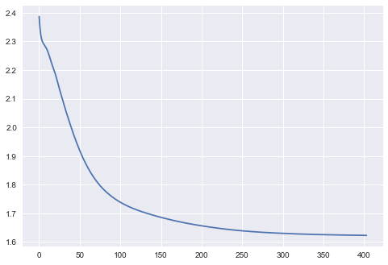

```python
from sklearn.datasets import load_digits
```


```python
import torch
import torch.nn as nn
import torch.nn.functional as F
import torch.optim as optim
```


```python
digits = load_digits()
```


```python
digits.images[0]
```


    array([[ 0.,  0.,  5., 13.,  9.,  1.,  0.,  0.],
           [ 0.,  0., 13., 15., 10., 15.,  5.,  0.],
           [ 0.,  3., 15.,  2.,  0., 11.,  8.,  0.],
           [ 0.,  4., 12.,  0.,  0.,  8.,  8.,  0.],
           [ 0.,  5.,  8.,  0.,  0.,  9.,  8.,  0.],
           [ 0.,  4., 11.,  0.,  1., 12.,  7.,  0.],
           [ 0.,  2., 14.,  5., 10., 12.,  0.,  0.],
           [ 0.,  0.,  6., 13., 10.,  0.,  0.,  0.]])


```python
digits.images[0].shape
```


    (8, 8)


```python
digits.images.shape
```


    (1797, 8, 8)


```python
digits.target.shape
```


    (1797,)


```python
digits.target[0]
```


    0


```python
%matplotlib inline
images_and_labels = list(zip(digits.images, digits.target))

for idx, (image, label) in enumerate(images_and_labels[:5]):
    plt.subplot(1,5,idx+1)
    plt.axis('off')
    plt.imshow(image, cmap=plt.cm.gray_r)
```


```python
digits.data[0]
```


    array([ 0.,  0.,  5., 13.,  9.,  1.,  0.,  0.,  0.,  0., 13., 15., 10.,
           15.,  5.,  0.,  0.,  3., 15.,  2.,  0., 11.,  8.,  0.,  0.,  4.,
           12.,  0.,  0.,  8.,  8.,  0.,  0.,  5.,  8.,  0.,  0.,  9.,  8.,
            0.,  0.,  4., 11.,  0.,  1., 12.,  7.,  0.,  0.,  2., 14.,  5.,
           10., 12.,  0.,  0.,  0.,  0.,  6., 13., 10.,  0.,  0.,  0.])


```python
digits.data[0].shape
```


    (64,)


```python
digits.target[0]
```


    0


```python
x = digits.data
y = digits.target
```

# 1. MLP


```python
model = nn.Sequential(nn.Linear(64,32),nn.ReLU(),
                     nn.Linear(32,16),nn.ReLU(),
                     nn.Linear(16,10),nn.ReLU())
```


```python
x = torch.tensor(x, dtype=torch.float32)
y = torch.tensor(y, dtype=torch.int64)
```


```python
optimizer = optim.Adam(model.parameters())
```


```python
loss_list = []
```


```python
for epoch in range(100+1):
    
    # forward
    pred = model(x)
    cost = F.cross_entropy(pred,y)
    
    # backward
    optimizer.zero_grad()
    cost.backward()
    optimizer.step()
    
    loss_list.append(cost)
    
    if epoch%10 == 0:
        print(f"epoch : {epoch}, cost : {cost.item()}")

plt.style.use("seaborn")
plt.plot(loss_list)
```

    epoch : 0, cost : 1.6297861337661743
    epoch : 10, cost : 1.6286628246307373
    epoch : 20, cost : 1.6276689767837524
    epoch : 30, cost : 1.62681245803833
    epoch : 40, cost : 1.6260619163513184
    epoch : 50, cost : 1.6254043579101562
    epoch : 60, cost : 1.6248308420181274
    epoch : 70, cost : 1.6243165731430054
    epoch : 80, cost : 1.6238676309585571
    epoch : 90, cost : 1.6234744787216187
    epoch : 100, cost : 1.6231356859207153


    [<matplotlib.lines.Line2D at 0x7ff262b258d0>]




