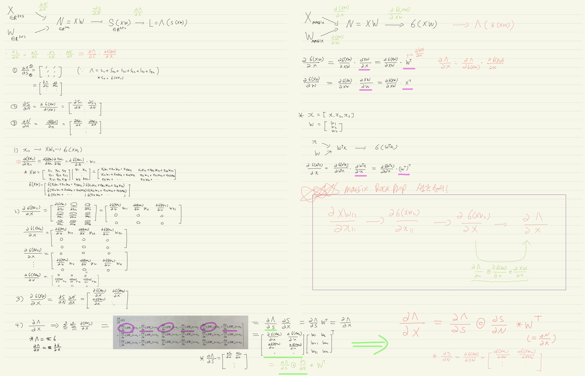

# 1. Numpy

- Numpy는 element-wise 연산 기능 제공


```python
a = [1,2,3]
b = [4,5,6]
print("a+b :",a+b)
try:
    print(a*b)
except TypeError:
    print("a*b : 파이썬 리스트에 대해 a*b와 같은 연산을 할 수 없음")
    
print()
a = np.array([1,2,3])
b = np.array([4,5,6])
print("a+b :",a+b)
print("a*b :",a*b)
```

    a+b : [1, 2, 3, 4, 5, 6]
    a*b : 파이썬 리스트에 대해 a*b와 같은 연산을 할 수 없음
    
    a+b : [5 7 9]
    a*b : [ 4 10 18]


**ndarray의 axis**
- axis 0 : 열 기준
- axis 1 : 행 기준

    - ndarray.sum(axis=0) : 열 기준으로 sum 후 차원 축소


```python
a = np.array([[1,2],[3,4]])
print(a)
print('a.sum(axis=0):',a.sum(axis=0)) # 열 기준으로 sum
print('a.sum(axis=1):',a.sum(axis=1)) # 행 기준으로 sum
```

    [[1 2]
     [3 4]]
    a.sum(axis=0): [4 6]
    a.sum(axis=1): [3 7]


```python
a = np.array([[1,2,3],
              [4,5,6]])
b = np.array([10,20,30])
print('a+b:\n', a+b)
```

    a+b:
     [[11 22 33]
     [14 25 36]]


```python
from typing import Callable

def deriv(func: Callable[[np.ndarray],np.ndarray],
         input_: np.ndarray,
         delta: float = 0.001) -> np.ndarray:
    
    '''
    배열의 input의 각 요소에 대해 함수 func의 도함수값 계산
    '''
    return (func(input_+delta) - func(input_-delta))/(2*delta)
```


```python
def square(x: np.ndarray) -> np.ndarray:
    return np.power(x,2)

def leaky_relu(x: np.ndarray) -> np.ndarray:
    return np.max(0.2*x,x)

def sigmoid(x: np.ndarray) -> np.ndarray:
    return 1/(1+np.exp(-x))
```

**함성함수**

- assert : 방어적 조건문 프로그래밍
    - assert condition, "메시지"
        - 방어하고자 하는 조건 : condition, 만약 condition이 아니면 "메시지" 출력


```python
from typing import*

# ndarray를 인자로 받고 ndarray를 반환하는 함수
Array_function = Callable[[np.ndarray],np.ndarray]

# chain은 함수의 리스트
Chain = List[Array_function]

def chain_length_2(chain: Chain,
                  a: np.ndarray) -> np.ndarray:
    '''
    두 함수를 chain 평가
    '''
    assert len(chain) == 2,\
    "인자 chain 의 길이는 2여야 함"
    
    f1 = chain[0]
    f2 = chain[1]
    
    return f2(f1(x))
```

**Callable 이해**

- callable(a) : a라는 object가 callable 한지 확인(return boolean)
- Callable[[np.ndarray],np.ndarray] : 호출 가능한 자료형으로 만든 것


```python
class temp():
    def __init__(self):
        self.x = 1
        
    def __call__(self):
        return "호출가능"
    
class temp_notcallable():
    def __init__(self):
        self.x = 1
```


```python
temp_test = temp()
temp_test_notcallabe = temp_notcallable()
```


```python
callable(temp)
```


    True


```python
temp_test()
```


    '호출가능'


```python
callable(temp_test)
```


    True


```python
callable(temp_notcallable)
```


    True


```python
callable(temp_test_notcallabe)
```


    False


**Chain-rule**


```python
def chain_deriv_2(chain: Chain,
                 input_range: np.ndarray) -> np.ndarray:
    '''
    두 함수로 구성된 합성함수의 도함수를 구하기 위해, Chain-rule을 사용함
    (f2(f1(x))' = f2'(f1(x)) * f1'(x)
    '''
    
    assert len(chain) == 2,\
    "인자 chain의 길이는 2여야 함(2개 함수의 합성을 다룸)"
    
    assert input_range.ndim == 1,\
    "input_range는 1차원 ndarray여야 함(단변수 함수를 다룸)"
    
    f1 = chain[0]
    f2 = chain[1]
    
    # (df2/df1) * (df1/dx)
    # df1/dx
    df1_dx = deriv(f1,input_range)
    df2_df1 = deriv(f2,f1(input_range))
    
    return df2_df1*df1_dx
```

# 2. forward, backward


```python
def matmul_forward(x:np.ndarray,w:np.ndarray)->np.ndarray:
    '''
    forward 연산을 행렬곱으로 계산
    x : (1 x N)
    w : (N x 1)
    '''
    # 행렬곱 연산
    N = np.dot(x,w)
    
    return N
```


```python
def matmul_backward_first(x: np.ndarray,
                          w: np.ndarray)->np.ndarray:
    '''
    첫 번째 인자에 대한 행렬곱의 역방향 계산 수행
    '''
    # backward 연산
    dNdX = np.transpose(w,(1,0))
    return dNdX    
```


```python
def matrix_forward_extra(x:np.ndarray,
                         w:np.ndarray,
                         sigma:Array_function) -> np.ndarray:
    '''
    행렬곱이 포함된 함수와 sigmoid함수의 합성함수의 forward 연산
    '''
    # 행렬곱
    N = np.dot(x,w)
    # sigmoid 함수
    S = sigma(N)
    return S
```


```python
def matrix_function_backward_1(x:np.ndarray,
                               w:np.ndarray,
                               sigma:Array_function)->np.ndarray:
    '''
    첫 번째 요소에 대한 행렬함수의 도함수 계산
    dSdX
    '''
    # 행렬곱
    N = np.dot(x,w)
    # sigmoid
    S = sigma(N)
    
    # backward(1) -> vector
    dNdx = np.transpose(w,(1,0))
    # backward(2) -> vector
    dSdN = deriv(sigma,N)
    return np.dot(dSdN,dNdx) # vector 간 곱 : 점곱
```


```python
def matrix_function_forward_sum(x:np.ndarray,
                                w:np.ndarray,
                                sigma:Array_function)->np.ndarray:
    '''
    두 개의 ndarray x와 w를 입력받으며 sigma함수를 포함하는 합성함수의 순방향 계산
    '''
    # 행렬곱
    N = np.dot(x,w)
    # sigmoid
    S = sigma(N)
    # 행렬 요소의 합을 구함
    L = np.sum(S)
    return L
```


```python
def matrix_function_backward_sum_1(x: np.ndarray,
                                   w: np.ndarray,
                                   sigma: Array_function)->np.ndarray:
    '''
    행렬곱(WX)과 요소의 합(sum of sigma(WX)) 연산이 포함된 함수의
    첫 번째 인자 행렬에 대한 도함수를 계산하는 과정 구현
    '''
    # forward
    # 행렬곱
    N = np.dot(x,w)
    # sigmoid
    S = sigma(N)
    # 요소의 합
    L = np.sum(S)
    
    # backward
    # dLdS
    dLdS = np.ones_like(S)
    # dSdN
    dSdN = deriv(sigma,N)
    # dNdX
    dNdX = np.transpose(w,(1,0))
    
    # dLdN
    dLdN = dLdS*dSdN
    # dLdX
    dLdX = np.dot(dLdN,dNdX)
    
    # dLdX = dLdS (hadamard) dSdN (matmul) W.T (62p, 굿노트 필기 정리)
    return dLdX

```


```python
from IPython.display import Image
Image("/Users/kimjeongseob/Desktop/Study/1. Study/2. Code/3.Deep_Learning_code/5. Deep Learning from Scratch/img/matrix_backprop.jpeg")
```





```python
np.random.seed(190204)
X = np.random.randn(3,3)
W = np.random.randn(3,2)

print("X:")
print(X)

print("L:")
print(round(matrix_function_forward_sum(X,W,sigmoid),4))
print()
print("dLdX:")
print(matrix_function_backward_sum_1(X,W,sigmoid))
```

    X:
    [[-1.57752816 -0.6664228   0.63910406]
     [-0.56152218  0.73729959 -1.42307821]
     [-1.44348429 -0.39128029  0.1539322 ]]
    L:
    2.3755
    
    dLdX:
    [[ 0.2488887  -0.37478057  0.01121962]
     [ 0.12604152 -0.27807404 -0.13945837]
     [ 0.22992798 -0.36623443 -0.02252592]]

