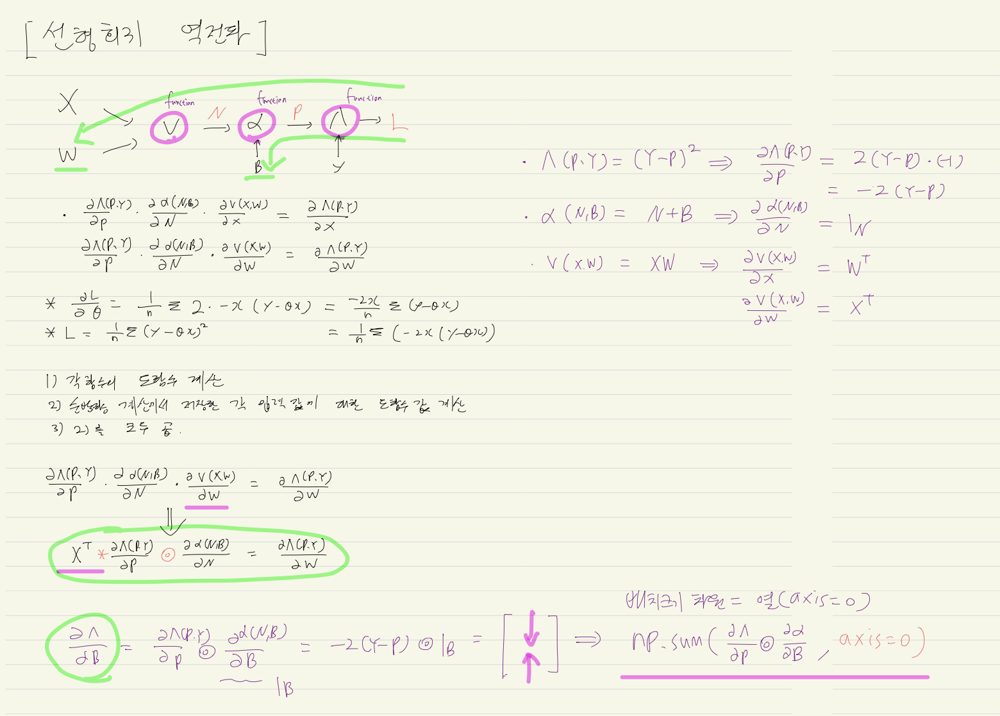
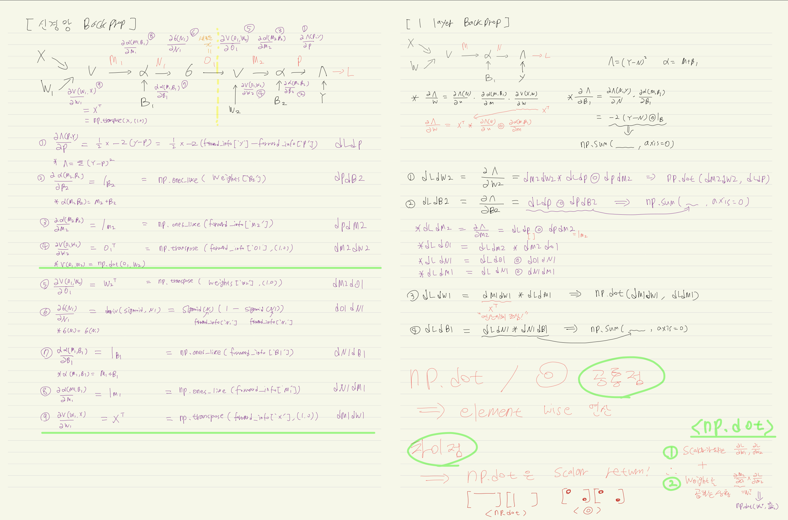

# 1. 선형회귀 forward


```python
from typing import*

def forward_linear_regression(X_batch:np.ndarray,
                              y_batch:np.ndarray,
                              weights:Dict[str,np.ndarray])->Tuple[float, Dict[str,np.ndarray]]:
    '''
    선형회귀 순방향 계산 과정
    '''
    # X와 Y의 배치 크기가 같은지 확인
    assert X_batch.shape[0] == Y_batch.shape[0]
    
    # 행렬곱 계산이 가능한지 확인
    assert X_batch.shape[1] == weights['W'].shape[0]
    
    # B의 모양이 1x1 인지 확인
    assert weights['B'].shape[0] == weights['B'].shape[1] == 1
    
    # 순방향 계산 수행
    N = np.dot(X_batch,weights['W'])
    # bias 연산
    P = N + weights['B']
    # Loss 연산
    loss = np.mean(np.power(y_batch-P,2))
    
    # forward 연산 중간값 저장(dynamic programming)
    forward_info : Dict[str,np.ndarray] = {}
    forward_info['X'] = X_batch
    forward_info['N'] = N
    forward_info['P'] = P
    forward_info['y'] = y_batch
    
    return loss, forward_info
```

# 2. 선형회귀 backprop


```python
def loss_gradients(forward_info: Dict[str,np.ndarray],
                   weights: Dict[str,np.ndarray]) -> Dict[str,np.ndarray]:
    
    '''
    선형회귀 모형의 dLdW와 dLdB 연산
    '''
    batch_size = forward_info['X'].shape[0]
    dLdP = -2*(forward_info['Y'] - forward_info['P'])
    dPdN = np.ones_like(forward_info['N'])
    dPdB = np.ones_like(weights['B'])
    
    # 아다마르곱
    dLdN = dLdP * dPdN
    
    dNdW = np.transpose(forward_info['X'],(1,0))
    
    # 행렬곱
    dLdW = np.dot(dNdW,dLdN)
    
    # 배치 크기에 해당하는 차원에 따라 합을 계산함
    dLdB = (dLdP*dPdB).sum(axis=0)
    
    loss_gradients: Dict[str,np.ndarray] = {}
    loss_gradients['W'] = dLdW
    loss_gradients['B'] = dLdB
    
    return loss_gradients

```


```python
from IPython.display import Image
Image("/Users/kimjeongseob/Desktop/Study/1. Study/2. Code/3.Deep_Learning_code/5. Deep Learning from Scratch/img/Linear_regression_backprop.jpeg")
```





# 3. 신경망 구현


```python
def forward_loss(X: np.ndarray,
                 y: np.ndarray,
                 weights: Dict[str,np.ndarray],
                 ) -> Tuple[Dict[str,np.ndarray], float]:
    '''
    신경망 모델의 순방향 계산 및 손실값을 단계별로 수행
    '''
    # layer 1
    M1 = np.dot(X,weights['W1'])
    N1 = M1 + weights['B1']
    O1 = sigmoid(N1)
    
    # layer 2
    M2 = np.dot(O1,weights['W2'])
    P = M2 + weights['B2']
    loss = np.mean(np.power((y - P),2))
    
    # forward_info 저장
    forward_info: Dict[str,np.ndarray] = {}
    forward_info['X'] = X
    forward_info['M1'] = M1
    forward_info['N1'] = N1
    forward_info['O1'] = O1
    forward_info['M2'] = M2
    forward_info['P'] = P
    forward_info['y'] = y
    
    return forward_info, loss
    
```


```python
from IPython.display import Image
Image("/Users/kimjeongseob/Desktop/Study/1. Study/2. Code/3.Deep_Learning_code/5. Deep Learning from Scratch/img/NN_backporp.jpeg")
```





