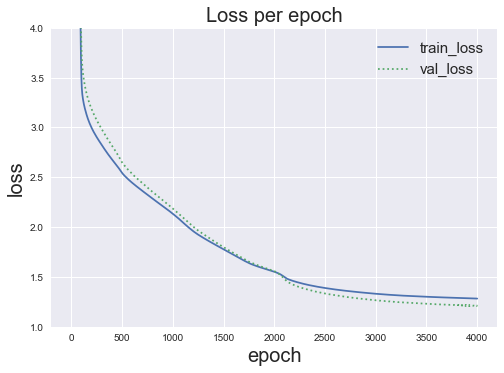

```python
import torch
import torch.nn as nn
import torch.nn.functional as F
import torch.optim as optim
```


```python
%matplotlib inline
```

# 1. Data Generation


$$ e \sim \mathcal{N} (0, 0.5) $$
$$y = \ 2 sin(x_1) + -log({1 \over 2}x_1^2) + cos(x_2) + log({1 \over 2}x_2^2) + e$$  


**Data Set**
$$X_{train} \in \mathcal{R}^{1600 \times 2}, Y_{train} \in \mathcal{R}^{1600}$$  
$$X_{val} \in \mathcal{R}^{400 \times 2}, Y_{val} \in \mathcal{R}^{400}$$  
$$X_{test} \in \mathcal{R}^{400 \times 2}, Y_{test} \in \mathcal{R}^{400}$$


```python
# x, y 모두 uniform distribution에서 생성
np.random.seed(777)

x1 = np.random.rand(2400)*10
x2 = np.random.rand(2400)*10
x = np.array([x1,x2]).transpose()
e = np.random.normal(loc=0, scale=0.5, size=2400)
y = 2*np.sin(x1)+(-1)*np.log((1/2)*x1**2)+np.cos(x2)+np.log((1/2)*x2**2)+e
```


```python
# train, val, test dataset으로 분리
train_x, train_y = x[:1600,:], y[:1600]
val_x, val_y = x[1600:2000,:], y[1600:2000]
test_x, test_y = x[2000:2400,:], y[2000:2400]
```


```python
train_x = torch.tensor(train_x).float()
train_y = torch.tensor(train_y).float()
val_x = torch.tensor(val_x).float()
val_y = torch.tensor(val_y).float()
test_x = torch.tensor(test_x).float()
test_y = torch.tensor(test_y).float()
```


```python
# visualize each data

# train data
fig = plt.figure(figsize=(20,5))
ax1 = fig.add_subplot(1,3,1,projection='3d')
ax1.scatter(train_x[:,0],train_x[:,1],train_y, c=train_y, cmap='jet')
ax1.set_title("train set distribution",fontsize=15)

# validation data
ax2 = fig.add_subplot(1,3,2,projection='3d')
ax2.scatter(val_x[:,0],val_x[:,1],val_y, c=val_y, cmap='jet')
ax2.set_title("validation set distribution",fontsize=15)

# test data
ax3 = fig.add_subplot(1,3,3,projection='3d')
ax3.scatter(test_x[:,0],test_x[:,1],test_y, c=test_y, cmap='jet')
ax3.set_title("test set distribution",fontsize=15)
```


    Text(0.5, 0.92, 'test set distribution')


# 2. Model Define


```python
class LinearReg(nn.Module):
    def __init__(self):
        super(LinearReg,self).__init__()
        self.linear = nn.Linear(2,1,bias=True)
        
    def forward(self,x):
        return self.linear(x)
    
class MLP(nn.Module):
    def __init__(self):
        super(MLP,self).__init__()
        self.linear1 = nn.Linear(2,200,bias=True)
        self.linear2 = nn.Linear(200,1,bias=True)
        self.relu = nn.ReLU()
        
    def forward(self,x):
        model = nn.Sequential(self.linear1, self.relu, self.linear2)
        return model(x)
```


```python
model_linear = LinearReg()
model = MLP()
```

# 3. Cost function / optimizer Define


```python
cost_fn = nn.MSELoss()
optimizer = optim.SGD(model.parameters(),lr=0.005)
```

# 4. trian / evaluation


```python
list_epoch = []
list_train_loss = []
list_val_loss = []
list_mae= []
list_mae_epoch = []

epoch = 4000
for i in range(epoch+1):
    
    # train
    model.train()
    
        # forward
    pred = model(train_x)
    cost = cost_fn(pred.squeeze(),train_y)
    
        # backward
    optimizer.zero_grad()
    cost.backward()
    optimizer.step()  # train에서만 update!
    
    list_epoch.append(i)
    list_train_loss.append(cost.item())
    
    
    # validation
    model.eval()
    
        # forward
    pred = model(val_x)
    cost = cost_fn(pred.squeeze(),val_y)
    
        # backward
    optimizer.zero_grad()
    cost.backward()
    list_val_loss.append(cost.item())
    
    
    # Visualize(test set 대상)
    if i%800 == 0:
        
        model.eval()
        optimizer.zero_grad()
        pred_test = model(test_x).detach().numpy() # debugging
        
        fig = plt.figure(figsize=(15,5))
        plt.style.use("seaborn")
        
        # true_y scattering
        ax1 = fig.add_subplot(1,2,1,projection='3d')
        ax1.scatter(test_x[:,0],test_x[:,1],test_y, c=test_y, cmap='rainbow')
        
        ax1.set_title("True y(test)")
        ax1.set_xlabel("x1")
        ax1.set_ylabel("x2")
        ax1.set_zlabel("y")
        
        # predicted_y scattering
        ax2 = fig.add_subplot(1,2,2,projection='3d')
        ax2.scatter(test_x[:,0],test_x[:,1], pred_test, c=pred_test[:,0], cmap='rainbow')
        
        ax2.set_title("Predicted y(test)")
        ax2.set_xlabel("x1")
        ax2.set_ylabel("x2")
        ax2.set_zlabel("y")
        
        plt.show()
        print("epoch : {}, cost : {}".format(i,cost)) 
```


    epoch : 0, cost : 249.61041259765625


    epoch : 800, cost : 2.354006290435791


    epoch : 1600, cost : 1.7393664121627808


    epoch : 2400, cost : 1.3548811674118042


    epoch : 3200, cost : 1.2495239973068237


    epoch : 4000, cost : 1.2108551263809204


```python
print(len(list_epoch))
print(len(list_train_loss))
print(len(list_val_loss))
```

    4001
    4001
    4001


```python
plt.style.use("seaborn")
plt.plot(list_epoch,list_train_loss, label='train_loss')
plt.plot(list_epoch,list_val_loss, ':' , label='val_loss')
plt.xlabel("epoch",fontsize=20)
plt.ylabel("loss",fontsize=20)
plt.legend(fontsize=15)
plt.ylim(1,4)
plt.title("Loss per epoch",fontsize=20)
```


    Text(0.5, 1.0, 'Loss per epoch')




