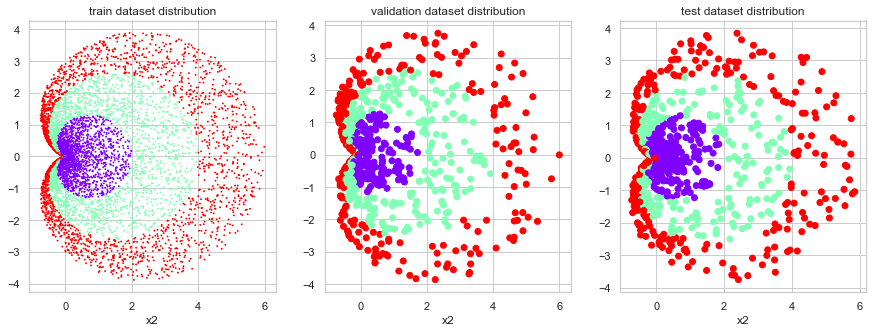
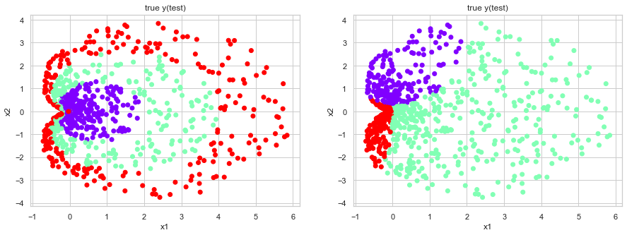
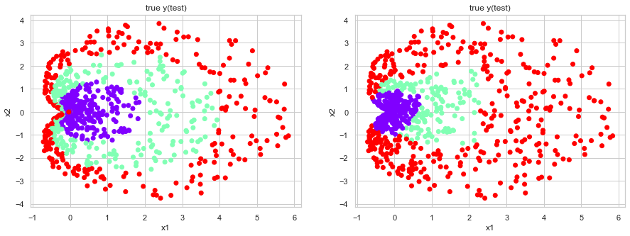
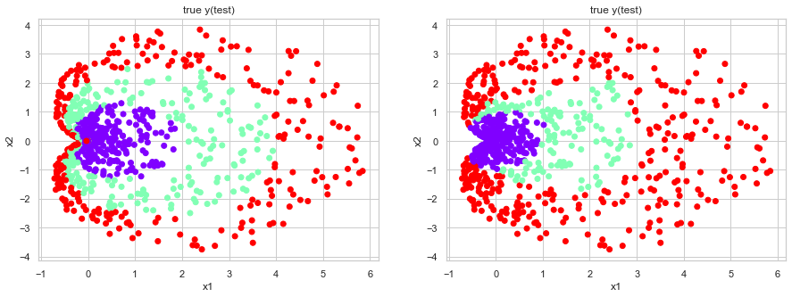
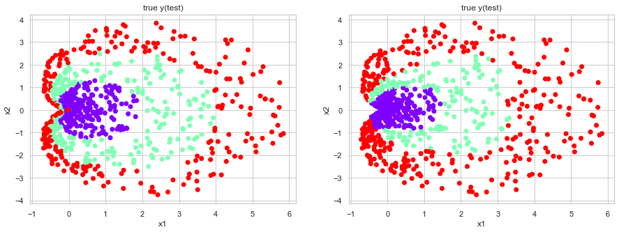
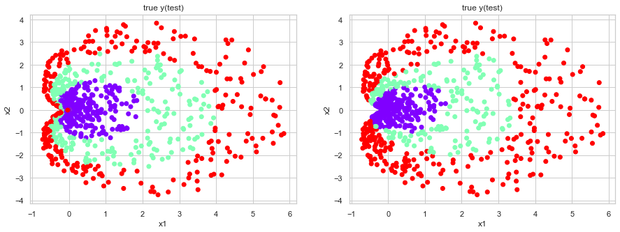
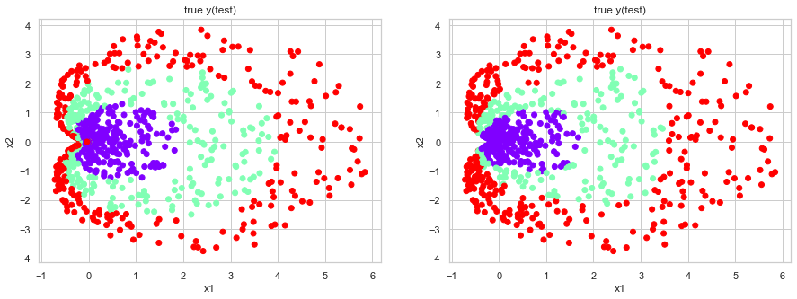
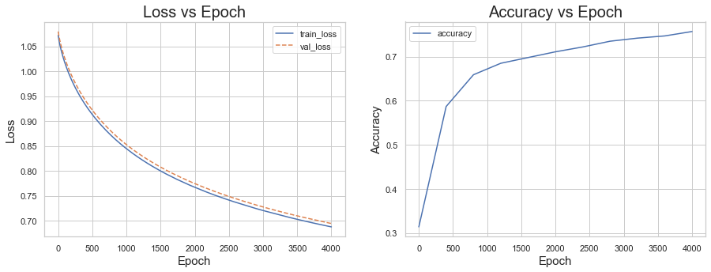

# 1. Data Generation

**Data Set**  
$$X_{train} \in \mathcal{R}^{8000 \times 2}, Y_{train} \in \mathcal{Z}^{8000}$$  
$$X_{val} \in \mathcal{R}^{1000 \times 2}, Y_{val} \in \mathcal{Z}^{1000}$$  
$$X_{test} \in \mathcal{R}^{1000 \times 2}, Y_{test} \in \mathcal{Z}^{1000}$$


```python
%matplotlib inline
r = np.random.rand(10000)*3
theta = np.random.rand(10000)*2*np.pi
y = r.astype(int)
r = r*(np.cos(theta)+1)
x1 = r*np.cos(theta)
x2 = r*np.sin(theta)
x = np.array([x1,x2]).T

# train / val / test set split
train_x, train_y = x[:8000,:], y[:8000]
val_x, val_y = x[8000:9000, :], y[8000:9000]
test_x, test_y = x[9000:, :], y[9000:]

# visualize each dataset
fig = plt.figure(figsize=(15,5))

ax1 = fig.add_subplot(1,3,1)
ax1.scatter(train_x[:,0],train_x[:,1], c= train_y, s=0.7, cmap='rainbow')
ax1.set_xlabel("x1")
ax1.set_xlabel("x2")
ax1.set_title("train dataset distribution")

ax2 = fig.add_subplot(1,3,2)
ax2.scatter(val_x[:,0],val_x[:,1], c= val_y, cmap='rainbow')
ax2.set_xlabel("x1")
ax2.set_xlabel("x2")
ax2.set_title("validation dataset distribution")

ax3 = fig.add_subplot(1,3,3)
ax3.scatter(test_x[:,0],test_x[:,1], c= test_y, cmap='rainbow')
ax3.set_xlabel("x1")
ax3.set_xlabel("x2")
ax3.set_title("test dataset distribution")

plt.show()
```





```python
train_x = torch.tensor(train_x).float()
train_y = torch.tensor(train_y).long()
val_x = torch.tensor(val_x).float()
val_y = torch.tensor(val_y).long()
test_x = torch.tensor(test_x).float()
test_y = torch.tensor(test_y).long()
```

# 2. Define model

[Multi-label classification model]
1. linear transformation
2. non-linear transformation(using softmax, if binary -> logistic)


```python
import torch
import torch.nn as nn
import torch.optim as optim
```


```python
class Linear(nn.Module):
    def __init__(self):
        super(Linear,self).__init__()
        self.linear = nn.Linear(2,3,bias=True)
        
    def forward(self,x):
        return self.linear(x)
    
    
class MLP(nn.Module):
    def __init__(self):
        super(MLP,self).__init__()
        self.linear1 = nn.Linear(2,200,bias=True)
        self.ReLU = nn.ReLU()
        self.linear2 = nn.Linear(200,3,bias=True)
        
    def forward(self,x):
        model = nn.Sequential(self.linear1, self.ReLU, self.linear2)
        return model(x)
```

# 3. Define Cost function


```python
model = MLP()
cost_fn = nn.CrossEntropyLoss()
optimizer = optim.SGD(model.parameters(),lr=1e-3)
```

# 4. Train / Evaluate


```python
print("{} parameters".format(sum(p.numel() for p in model.parameters() if p.requires_grad)))

list_epoch = []
list_train_loss = []
list_val_loss = []
list_acc = []
list_acc_epoch = []

epoch = 4000

for i in range(epoch+1):
    
    # train
    model.train()
    
    # forward
    pred = model(train_x)
    cost = cost_fn(pred,train_y)
    
    # backward
    optimizer.zero_grad()
    cost.backward()
    optimizer.step()
    
    list_epoch.append(i)
    list_train_loss.append(cost.item())
    
    # validation
    model.eval()
    
    # forward
    pred = model(val_x)
    cost = cost_fn(pred,val_y)
    
    # backward
    optimizer.zero_grad()
    cost.backward()
    optimizer.step()
    
    list_val_loss.append(cost.item())
    
    
    # evaluation
    if i%400 == 0:
        model.eval()
        optimizer.zero_grad()
        
        pred_test = model(test_x)
        pred_test_cls = pred_test.argmax(dim=1)
        accurate_pred = pred_test_cls == test_y
        accurate_pred_float = accurate_pred.float()
        accuracy = accurate_pred_float.sum()/len(pred_test)
        
        list_acc.append(accuracy)
        list_acc_epoch.append(i)
        
        fig = plt.figure(figsize=(15,5))
        
        # true y scattering
        ax1 = fig.add_subplot(1,2,1)
        ax1.scatter(test_x[:,0],test_x[:,1], c=test_y, cmap='rainbow')
        ax1.set_xlabel("x1")
        ax1.set_ylabel("x2")
        ax1.set_title("true y(test)")
        
        # predicted y scattering
        ax2 = fig.add_subplot(1,2,2)
        ax2.scatter(test_x[:,0],test_x[:,1], c=pred_test.detach().max(dim=1)[1].numpy(), cmap='rainbow')
        ax2.set_xlabel("x1")
        ax2.set_ylabel("x2")
        ax2.set_title("true y(test)")

        plt.show()
        print("epoch : {}, accuracy : {} %".format(i, accuracy))
```

    1203 parameters





    epoch : 0, accuracy : 0.3140000104904175 %





    epoch : 400, accuracy : 0.5220000147819519 %





    epoch : 800, accuracy : 0.5709999799728394 %


    epoch : 1200, accuracy : 0.6119999885559082 %





    epoch : 1600, accuracy : 0.6320000290870667 %





    epoch : 2000, accuracy : 0.6460000276565552 %


    epoch : 2400, accuracy : 0.6600000262260437 %


    epoch : 2800, accuracy : 0.6690000295639038 %





    epoch : 3200, accuracy : 0.6800000071525574 %


    epoch : 3600, accuracy : 0.6899999976158142 %


    epoch : 4000, accuracy : 0.6970000267028809 %


```python
fig = plt.figure(figsize=(15,5))

# loss
ax1 = fig.add_subplot(1,2,1)
ax1.plot(list_epoch,list_train_loss,label="train_loss")
ax1.plot(list_epoch,list_val_loss, '--', label="val_loss")
ax1.set_title("Loss vs Epoch",fontsize=20)
ax1.legend()
ax1.set_xlabel("Epoch",fontsize=15)
ax1.set_ylabel("Loss",fontsize=15)

# accuracy
ax2 = fig.add_subplot(1,2,2)
ax2.plot(list_acc_epoch,list_acc,label="accuracy")
ax2.set_title("Accuracy vs Epoch",fontsize=20)
ax2.legend()
ax2.set_xlabel("Epoch",fontsize=15)
ax2.set_ylabel("Accuracy",fontsize=15)
```


    Text(0, 0.5, 'Accuracy')




