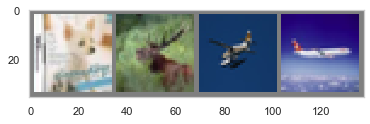

```python
import torch
import torchvision
import torchvision.transforms as transforms
```


```python
transform = transforms.Compose(
    [transforms.ToTensor(),
     transforms.Normalize((0.5, 0.5, 0.5), (0.5, 0.5, 0.5))])

trainset = torchvision.datasets.CIFAR10(root='./data', train=True,
                                        download=True, transform=transform)
trainloader = torch.utils.data.DataLoader(trainset, batch_size=4,
                                          shuffle=True, num_workers=2)

testset = torchvision.datasets.CIFAR10(root='./data', train=False,
                                       download=True, transform=transform)
testloader = torch.utils.data.DataLoader(testset, batch_size=4,
                                         shuffle=False, num_workers=2)

classes = ('plane', 'car', 'bird', 'cat',
           'deer', 'dog', 'frog', 'horse', 'ship', 'truck')
```

    Downloading https://www.cs.toronto.edu/~kriz/cifar-10-python.tar.gz to ./data/cifar-10-python.tar.gz


    HBox(children=(FloatProgress(value=1.0, bar_style='info', max=1.0), HTML(value='')))


    Extracting ./data/cifar-10-python.tar.gz to ./data
    Files already downloaded and verified


```python
%matplotlib inline
import matplotlib.pyplot as plt
import numpy as np

# 이미지를 보여주기 위한 함수

def imshow(img):
    img = img / 2 + 0.5     # unnormalize
    npimg = img.numpy()
    plt.imshow(np.transpose(npimg, (1, 2, 0)))
    plt.grid(False)
    plt.show()


# 학습용 이미지를 무작위로 가져오기
dataiter = iter(trainloader)
images, labels = dataiter.next()

# 이미지 보여주기
imshow(torchvision.utils.make_grid(images))
# 정답(label) 출력
print(' '.join('%5s' % classes[labels[j]] for j in range(4)))
```





      dog  deer plane plane


```python
print(type(images), images.shape)
print(type(labels), labels.shape)
```

    <class 'torch.Tensor'> torch.Size([4, 3, 32, 32])
    <class 'torch.Tensor'> torch.Size([4])


```python
labels
```


    tensor([7, 1, 2, 9])


```python
images.shape
```


    torch.Size([4, 3, 32, 32])


# 1. model


```python
import torch
import torch.nn as nn
import torch.optim as optim
import torch.nn.functional as F
```


```python
class MLP(nn.Module):
    
    def __init__(self, in_dim, out_dim, hid_dim, n_layer, act):
        super(MLP,self).__init__()
        self.act = act
        self.in_dim = in_dim
        self.out_dim = out_dim
        self.hid_dim = hid_dim
        self.act = act
        self.n_layer = n_layer
        
        self.fc = nn.Linear(self.in_dim, self.hid_dim)
        
        self.linears = nn.ModuleList()
        
        for _ in range(n_layer-1):
            self.linears.append(nn.Linear(self.hid_dim, self.hid_dim))
        self.fc2 = nn.Linear(self.hid_dim, self.out_dim)
        
        if self.act == 'relu':
            self.act = nn.ReLU()
            
    def forward(self,x):
        out = self.act(self.fc(x))
        
        for fc in self.linears:
            out = self.act(fc(out))
        out = self.fc2(out)  # output layer는 별도로 activation function 취하지 않음
        
        return out
    
```


```python
net = MLP(3*32*32, 10, 100, 2, 'relu')
    
print(net)
```

    MLP(
      (fc): Linear(in_features=3072, out_features=100, bias=True)
      (linears): ModuleList(
        (0): Linear(in_features=100, out_features=100, bias=True)
      )
      (fc2): Linear(in_features=100, out_features=10, bias=True)
      (act): ReLU()
    )


# 2. Loss function, Optimizer


```python
criterion = nn.CrossEntropyLoss()
optimizer = optim.SGD(net.parameters(), lr=0.001, momentum=0.9)
```


```python
print(criterion)
print(optimizer)
```

    CrossEntropyLoss()
    SGD (
    Parameter Group 0
        dampening: 0
        lr: 0.001
        momentum: 0.9
        nesterov: False
        weight_decay: 0
    )


# 3. Train


```python
for epoch in range(2):   # 데이터셋을 수차례 반복합니다.

    running_loss = 0.0
    for i, data in enumerate(trainloader, 0):
        # [inputs, labels]의 목록인 data로부터 입력을 받은 후;
        inputs, labels = data
        inputs = inputs.view(inputs.size(0), -1)

        # 변화도(Gradient) 매개변수를 0으로 만들고
        optimizer.zero_grad()

        # 순전파 + 역전파 + 최적화를 한 후
        outputs = net(inputs)
        loss = criterion(outputs, labels)
        loss.backward()
        optimizer.step()

        # 통계를 출력합니다.
        running_loss += loss.item()
        if i % 2000 == 1999:    # print every 2000 mini-batches
            print('[%d, %5d] loss: %.3f' %
                  (epoch + 1, i + 1, running_loss / 2000))
            running_loss = 0.0

print('Finished Training')
```

    [1,  2000] loss: 1.929
    [1,  4000] loss: 1.729
    [1,  6000] loss: 1.667
    [1,  8000] loss: 1.631
    [1, 10000] loss: 1.614
    [1, 12000] loss: 1.553
    [2,  2000] loss: 1.491
    [2,  4000] loss: 1.502
    [2,  6000] loss: 1.479
    [2,  8000] loss: 1.452
    [2, 10000] loss: 1.453
    [2, 12000] loss: 1.435
    Finished Training


# 4. Test


```python
### measure test accuracy ###
correct = 0
total = 0
with torch.no_grad():
    for data in testloader:
        images, labels = data
        images = images.view(images.size(0),-1)
        outputs = net(images)
        _, predicted = torch.max(outputs.data, 1)
        total += labels.size(0)
        correct += (predicted == labels).sum().item()

print('Accuracy of the network on the 10000 test images: %d %%' % (
    100 * correct / total))
```

    Accuracy of the network on the 10000 test images: 49 %


# 5. Hyperparameter tuning


```python
transform = transforms.Compose(
    [transforms.ToTensor(),
     transforms.Normalize((0.5, 0.5, 0.5), (0.5, 0.5, 0.5))])

trainset = torchvision.datasets.CIFAR10(root='./data', train=True,
                                        download=True, transform=transform)
trainloader = torch.utils.data.DataLoader(trainset, batch_size=4,
                                          shuffle=True, num_workers=2)
trainset, valset = torch.utils.data.random_split(trainset, [40000, 10000])

testset = torchvision.datasets.CIFAR10(root='./data', train=False,
                                       download=True, transform=transform)
testloader = torch.utils.data.DataLoader(testset, batch_size=4,
                                         shuffle=False, num_workers=2)
valloader = torch.utils.data.DataLoader(valset, batch_size=4, 
                                        shuffle=False)

classes = ('plane', 'car', 'bird', 'cat',
           'deer', 'dog', 'frog', 'horse', 'ship', 'truck')
```

    Files already downloaded and verified
    Files already downloaded and verified


```python
### measure val accuracy, val loss ###

correct = 0
total = 0
val_loss = 0
with torch.no_grad():
    for data in valloader:
        images, labels = data
        images = images.view(images.size(0),-1)
        outputs = net(images)
        loss = criterion(outputs, labels)
        val_loss += loss.item()
        _, predicted = torch.max(outputs.data, 1)
        total += labels.size(0)
        correct += (predicted == labels).sum().item()
        
    val_loss = val_loss/len(valloader)
    
acc = 100*correct / total
print('Accuracy of the network on the 10000 val images: {:2.2f}%, val_loss : {:2.2f}'.format(acc, val_loss))
```

    Accuracy of the network on the 10000 val images: 52.14%, val_loss : 1.36


### Experiment


```python
def experiment(args):
    net = MLP(args.in_dim, args.out_dim, args.hid_dim, args.n_layer, args.act)

    criterion = nn.CrossEntropyLoss()
    optimizer = optim.SGD(net.parameters(), lr=args.lr, momentum=args.mm)
    
    for epoch in range(args.epoch):   # 데이터셋을 수차례 반복합니다.
        
        #=== train ===#
        net.train()
        running_loss = 0.0
        train_loss = 0.0
        for i, data in enumerate(trainloader, 0):
            # [inputs, labels]의 목록인 data로부터 입력을 받은 후;
            inputs, labels = data
            inputs = inputs.view(inputs.size(0), -1)

            # 변화도(Gradient) 매개변수를 0으로 만들고
            optimizer.zero_grad()

            # 순전파 + 역전파 + 최적화를 한 후
            outputs = net(inputs)
            loss = criterion(outputs, labels)
            loss.backward()
            optimizer.step()

            # 통계를 출력합니다.
            running_loss += loss.item()
            train_loss += loss.item()
            if i % 2000 == 1999:    # print every 2000 mini-batches
                print('[%d, %5d] loss: %.3f' %
                      (epoch + 1, i + 1, running_loss / 2000))
                running_loss = 0.0
                
                
                 
        # ==== Validation ====== #
        net.eval()
        optimizer.zero_grad()
        
        correct = 0
        total = 0
        val_loss = 0 
        with torch.no_grad():
            for data in valloader:
                images, labels = data
                images = images.view(inputs.size(0), -1)
                
                outputs = net(images)

                loss = criterion(outputs, labels)
                val_loss += loss.item()

                _, predicted = torch.max(outputs.data, 1)
                total += labels.size(0)
                correct += (predicted == labels).sum().item()

            val_loss = val_loss / len(valloader)
            val_acc = 100 * correct / total
            
        print('Epoch {}, Train Loss: {}, Val Loss: {}, Val Acc: {}'.format(epoch, train_loss, val_loss, val_acc))
            
            
    # ==== Evaluation ==== #
    net.eval()
    optimizer.zero_grad()

    correct = 0
    total = 0
    with torch.no_grad():
        for data in testloader:
            images, labels = data
            images = images.view(-1, 3072)

            outputs = net(images)
            _, predicted = torch.max(outputs.data, 1)
            total += labels.size(0)
            correct += (predicted == labels).sum().item()

        test_acc = 100 * correct / total
    return test_acc

```


```python
import argparse

seed = 123
np.random.seed(seed)
torch.manual_seed(seed)

parser = argparse.ArgumentParser()
args = parser.parse_args("")

args.n_layer = 5
args.in_dim = 3072
args.out_dim = 10
args.hid_dim = 100
args.act = 'relu'
args.lr = 1e-3
args.mm = 0.9
args.epoch = 2
```


```python
experiment(args)
```

    [1,  2000] loss: 2.296
    [1,  4000] loss: 2.103
    [1,  6000] loss: 1.925
    [1,  8000] loss: 1.779
    [1, 10000] loss: 1.711
    [1, 12000] loss: 1.685
    Epoch 0, Train Loss: 23817.68580916524, Val Loss: 1.653086518597603, Val Acc: 40.64
    [2,  2000] loss: 1.610
    [2,  4000] loss: 1.570
    [2,  6000] loss: 1.578
    [2,  8000] loss: 1.549
    [2, 10000] loss: 1.539
    [2, 12000] loss: 1.517
    Epoch 1, Train Loss: 19482.94918397069, Val Loss: 1.443833620017767, Val Acc: 48.74


    47.64


```python
list_var1 = [4, 5, 6]
list_var2 = [50, 100, 150]

for var1 in list_var1:
    for var2 in list_var2:
        args.n_layer = var1
        args.hid_dim = var2
        result = experiment(args)
        print(result)
```

    [1,  2000] loss: 2.228
    [1,  4000] loss: 1.954
    [1,  6000] loss: 1.804
    [1,  8000] loss: 1.734
    [1, 10000] loss: 1.688
    [1, 12000] loss: 1.662
    Epoch 0, Train Loss: 22949.273116230965, Val Loss: 1.5978022063851356, Val Acc: 43.17
    [2,  2000] loss: 1.598
    [2,  4000] loss: 1.594
    [2,  6000] loss: 1.575
    [2,  8000] loss: 1.562
    [2, 10000] loss: 1.541
    [2, 12000] loss: 1.522
    Epoch 1, Train Loss: 19537.120576694608, Val Loss: 1.543736782091856, Val Acc: 44.9
    44.36
    [1,  2000] loss: 2.203
    [1,  4000] loss: 1.885
    [1,  6000] loss: 1.781
    [1,  8000] loss: 1.725
    [1, 10000] loss: 1.659
    [1, 12000] loss: 1.624
    Epoch 0, Train Loss: 22554.424747526646, Val Loss: 1.580858955204487, Val Acc: 43.49
    [2,  2000] loss: 1.561
    [2,  4000] loss: 1.526
    [2,  6000] loss: 1.532
    [2,  8000] loss: 1.513
    [2, 10000] loss: 1.499
    [2, 12000] loss: 1.497
    Epoch 1, Train Loss: 18996.84994955361, Val Loss: 1.44064718054533, Val Acc: 48.63
    47.01
    [1,  2000] loss: 2.173
    [1,  4000] loss: 1.884
    [1,  6000] loss: 1.777
    [1,  8000] loss: 1.706
    [1, 10000] loss: 1.643
    [1, 12000] loss: 1.619
    Epoch 0, Train Loss: 22408.9463211596, Val Loss: 1.5524236517429353, Val Acc: 44.18
    [2,  2000] loss: 1.536
    [2,  4000] loss: 1.529
    [2,  6000] loss: 1.508
    [2,  8000] loss: 1.497
    [2, 10000] loss: 1.488
    [2, 12000] loss: 1.457
    Epoch 1, Train Loss: 18762.295488923788, Val Loss: 1.383320823198557, Val Acc: 50.93
    49.26
    [1,  2000] loss: 2.297
    [1,  4000] loss: 2.126
    [1,  6000] loss: 1.997
    [1,  8000] loss: 1.880
    [1, 10000] loss: 1.805
    [1, 12000] loss: 1.757
    Epoch 0, Train Loss: 24591.892322182655, Val Loss: 1.6868436036109924, Val Acc: 39.52
    [2,  2000] loss: 1.669
    [2,  4000] loss: 1.665
    [2,  6000] loss: 1.638
    [2,  8000] loss: 1.623
    [2, 10000] loss: 1.592
    [2, 12000] loss: 1.577
    Epoch 1, Train Loss: 20301.576366841793, Val Loss: 1.507500323677063, Val Acc: 46.25
    45.46
    [1,  2000] loss: 2.292
    [1,  4000] loss: 2.069
    [1,  6000] loss: 1.917
    [1,  8000] loss: 1.849
    [1, 10000] loss: 1.742
    [1, 12000] loss: 1.685
    Epoch 0, Train Loss: 23942.67491158843, Val Loss: 1.6370371439814568, Val Acc: 40.09
    [2,  2000] loss: 1.625
    [2,  4000] loss: 1.608
    [2,  6000] loss: 1.597
    [2,  8000] loss: 1.551
    [2, 10000] loss: 1.548
    [2, 12000] loss: 1.530
    Epoch 1, Train Loss: 19673.92266574502, Val Loss: 1.445621304178238, Val Acc: 48.16
    46.8
    [1,  2000] loss: 2.292
    [1,  4000] loss: 2.052
    [1,  6000] loss: 1.886
    [1,  8000] loss: 1.820
    [1, 10000] loss: 1.717
    [1, 12000] loss: 1.688
    Epoch 0, Train Loss: 23751.15723001957, Val Loss: 1.6176173822641373, Val Acc: 41.94
    [2,  2000] loss: 1.593
    [2,  4000] loss: 1.575
    [2,  6000] loss: 1.556
    [2,  8000] loss: 1.536
    [2, 10000] loss: 1.525
    [2, 12000] loss: 1.511
    Epoch 1, Train Loss: 19326.55795790255, Val Loss: 1.465835019952059, Val Acc: 46.92
    45.32
    [1,  2000] loss: 2.303
    [1,  4000] loss: 2.245
    [1,  6000] loss: 2.066
    [1,  8000] loss: 1.998
    [1, 10000] loss: 1.901
    [1, 12000] loss: 1.855
    Epoch 0, Train Loss: 25649.461042404175, Val Loss: 1.862686149406433, Val Acc: 29.92
    [2,  2000] loss: 1.775
    [2,  4000] loss: 1.740
    [2,  6000] loss: 1.697
    [2,  8000] loss: 1.674
    [2, 10000] loss: 1.651
    [2, 12000] loss: 1.613
    Epoch 1, Train Loss: 21112.29188773036, Val Loss: 1.589981800377369, Val Acc: 42.26
    42.52
    [1,  2000] loss: 2.304
    [1,  4000] loss: 2.301
    [1,  6000] loss: 2.219
    [1,  8000] loss: 2.021
    [1, 10000] loss: 1.932
    [1, 12000] loss: 1.855
    Epoch 0, Train Loss: 26189.547845304012, Val Loss: 1.8186398881196977, Val Acc: 31.75
    [2,  2000] loss: 1.777
    [2,  4000] loss: 1.727
    [2,  6000] loss: 1.696
    [2,  8000] loss: 1.643
    [2, 10000] loss: 1.607
    [2, 12000] loss: 1.600
    Epoch 1, Train Loss: 20917.44014824927, Val Loss: 1.5582297607183457, Val Acc: 42.93
    43.26
    [1,  2000] loss: 2.303
    [1,  4000] loss: 2.301
    [1,  6000] loss: 2.237
    [1,  8000] loss: 1.990
    [1, 10000] loss: 1.888
    [1, 12000] loss: 1.867
    Epoch 0, Train Loss: 26065.976185142994, Val Loss: 1.77200488114357, Val Acc: 33.58
    [2,  2000] loss: 1.737
    [2,  4000] loss: 1.710
    [2,  6000] loss: 1.668
    [2,  8000] loss: 1.630
    [2, 10000] loss: 1.608
    [2, 12000] loss: 1.586
    Epoch 1, Train Loss: 20660.933627963066, Val Loss: 1.5335257438659669, Val Acc: 45.5
    45.49

