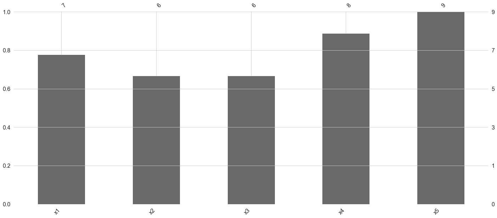
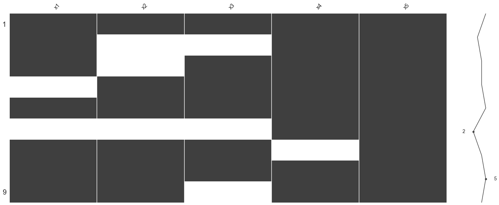
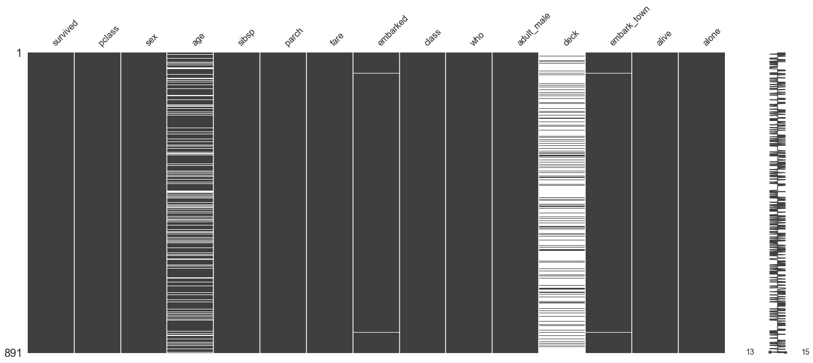
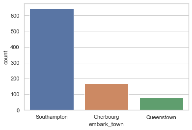
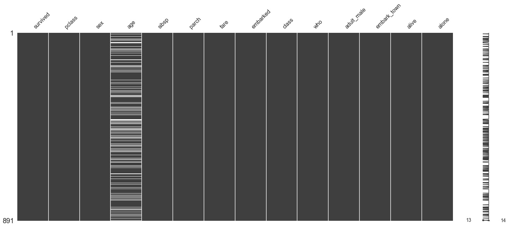
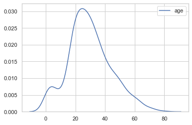
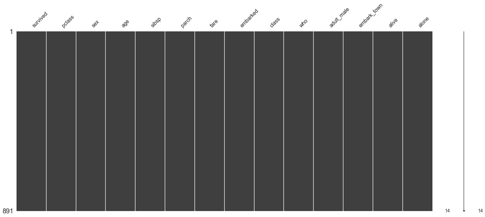
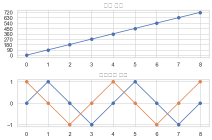

# 02.01 데이터 전처리 기초


    - missingno 패키지: 결측 데이터 검색
    - sklearn.impute 패키지: 결측 데이터 대체
    - patsy 패키지: 데이터 선택, 변환, 추가, 스케일링
    - sklearn.preprocessing 패키지: 스케일링, 변환

## 1. missingno 패키지

    - 결측 데이터 검색

### 0) 결측치 확인 - 데이터프레임.isnull()


```python
from io import StringIO

csv_data = StringIO("""
x1,x2,x3,x4,x5
1,0.1,"1",2019-01-01,A
2,,,2019-01-02,B
3,,"3",2019-01-03,C
,0.4,"4",2019-01-04,A
5,0.5,"5",2019-01-05,B
,,,2019-01-06,C
7,0.7,"7",,A
8,0.8,"8",2019-01-08,B
9,0.9,,2019-01-09,C
""")

df = pd.read_csv(csv_data, dtype={"x1": pd.Int64Dtype()}, parse_dates=[3])
df
```


<div>
<style scoped>
    .dataframe tbody tr th:only-of-type {
        vertical-align: middle;
    }

    .dataframe tbody tr th {
        vertical-align: top;
    }

    .dataframe thead th {
        text-align: right;
    }
</style>
<table border="1" class="dataframe">
  <thead>
    <tr style="text-align: right;">
      <th></th>
      <th>x1</th>
      <th>x2</th>
      <th>x3</th>
      <th>x4</th>
      <th>x5</th>
    </tr>
  </thead>
  <tbody>
    <tr>
      <th>0</th>
      <td>1</td>
      <td>0.1</td>
      <td>1.0</td>
      <td>2019-01-01</td>
      <td>A</td>
    </tr>
    <tr>
      <th>1</th>
      <td>2</td>
      <td>NaN</td>
      <td>NaN</td>
      <td>2019-01-02</td>
      <td>B</td>
    </tr>
    <tr>
      <th>2</th>
      <td>3</td>
      <td>NaN</td>
      <td>3.0</td>
      <td>2019-01-03</td>
      <td>C</td>
    </tr>
    <tr>
      <th>3</th>
      <td>&lt;NA&gt;</td>
      <td>0.4</td>
      <td>4.0</td>
      <td>2019-01-04</td>
      <td>A</td>
    </tr>
    <tr>
      <th>4</th>
      <td>5</td>
      <td>0.5</td>
      <td>5.0</td>
      <td>2019-01-05</td>
      <td>B</td>
    </tr>
    <tr>
      <th>5</th>
      <td>&lt;NA&gt;</td>
      <td>NaN</td>
      <td>NaN</td>
      <td>2019-01-06</td>
      <td>C</td>
    </tr>
    <tr>
      <th>6</th>
      <td>7</td>
      <td>0.7</td>
      <td>7.0</td>
      <td>NaT</td>
      <td>A</td>
    </tr>
    <tr>
      <th>7</th>
      <td>8</td>
      <td>0.8</td>
      <td>8.0</td>
      <td>2019-01-08</td>
      <td>B</td>
    </tr>
    <tr>
      <th>8</th>
      <td>9</td>
      <td>0.9</td>
      <td>NaN</td>
      <td>2019-01-09</td>
      <td>C</td>
    </tr>
  </tbody>
</table>
</div>


```python
df.dtypes
```


    x1             Int64
    x2           float64
    x3           float64
    x4    datetime64[ns]
    x5            object
    dtype: object


```python
# 결측 데이터 현황 파악

df.isnull()
```


<div>
<style scoped>
    .dataframe tbody tr th:only-of-type {
        vertical-align: middle;
    }

    .dataframe tbody tr th {
        vertical-align: top;
    }

    .dataframe thead th {
        text-align: right;
    }
</style>
<table border="1" class="dataframe">
  <thead>
    <tr style="text-align: right;">
      <th></th>
      <th>x1</th>
      <th>x2</th>
      <th>x3</th>
      <th>x4</th>
      <th>x5</th>
    </tr>
  </thead>
  <tbody>
    <tr>
      <th>0</th>
      <td>False</td>
      <td>False</td>
      <td>False</td>
      <td>False</td>
      <td>False</td>
    </tr>
    <tr>
      <th>1</th>
      <td>False</td>
      <td>True</td>
      <td>True</td>
      <td>False</td>
      <td>False</td>
    </tr>
    <tr>
      <th>2</th>
      <td>False</td>
      <td>True</td>
      <td>False</td>
      <td>False</td>
      <td>False</td>
    </tr>
    <tr>
      <th>3</th>
      <td>True</td>
      <td>False</td>
      <td>False</td>
      <td>False</td>
      <td>False</td>
    </tr>
    <tr>
      <th>4</th>
      <td>False</td>
      <td>False</td>
      <td>False</td>
      <td>False</td>
      <td>False</td>
    </tr>
    <tr>
      <th>5</th>
      <td>True</td>
      <td>True</td>
      <td>True</td>
      <td>False</td>
      <td>False</td>
    </tr>
    <tr>
      <th>6</th>
      <td>False</td>
      <td>False</td>
      <td>False</td>
      <td>True</td>
      <td>False</td>
    </tr>
    <tr>
      <th>7</th>
      <td>False</td>
      <td>False</td>
      <td>False</td>
      <td>False</td>
      <td>False</td>
    </tr>
    <tr>
      <th>8</th>
      <td>False</td>
      <td>False</td>
      <td>True</td>
      <td>False</td>
      <td>False</td>
    </tr>
  </tbody>
</table>
</div>


```python
df.isnull().sum()
```


    x1    2
    x2    3
    x3    3
    x4    1
    x5    0
    dtype: int64


### 1) 결측치 확인 - missingno 패키지 활용


```python
# missingno 패키지 활용한 결측치 파악

import missingno as msno

msno.matrix(df)
```


    <matplotlib.axes._subplots.AxesSubplot at 0x122c8be10>


```python
msno.bar(df)
```


    <matplotlib.axes._subplots.AxesSubplot at 0x122c82390>





### 2) 결측치 확인 - missingno 패키지 활용 (타이타닉 예제)


```python
# 타이타닉 데이터에서의 missingno

titanic = sns.load_dataset("titanic")
titanic.shape
```


    (891, 15)


```python
msno.matrix(df)
```


    <matplotlib.axes._subplots.AxesSubplot at 0x12b452a90>





```python
msno.bar(df)
```


    <matplotlib.axes._subplots.AxesSubplot at 0x12abf2c10>


### 3) 결측치 처리

    - 결측 데이터 존재 열 삭제 (dropna)
    - 결측치 대체 (scikit-learn SimpleImputer 패키지)
    

### 3-1) 결측치 처리 : 열 삭제


```python
# 결측 데이터 존재 열 삭제 dropna

df
```


<div>
<style scoped>
    .dataframe tbody tr th:only-of-type {
        vertical-align: middle;
    }

    .dataframe tbody tr th {
        vertical-align: top;
    }

    .dataframe thead th {
        text-align: right;
    }
</style>
<table border="1" class="dataframe">
  <thead>
    <tr style="text-align: right;">
      <th></th>
      <th>x1</th>
      <th>x2</th>
      <th>x3</th>
      <th>x4</th>
      <th>x5</th>
    </tr>
  </thead>
  <tbody>
    <tr>
      <th>0</th>
      <td>1</td>
      <td>0.1</td>
      <td>1.0</td>
      <td>2019-01-01</td>
      <td>A</td>
    </tr>
    <tr>
      <th>1</th>
      <td>2</td>
      <td>NaN</td>
      <td>NaN</td>
      <td>2019-01-02</td>
      <td>B</td>
    </tr>
    <tr>
      <th>2</th>
      <td>3</td>
      <td>NaN</td>
      <td>3.0</td>
      <td>2019-01-03</td>
      <td>C</td>
    </tr>
    <tr>
      <th>3</th>
      <td>&lt;NA&gt;</td>
      <td>0.4</td>
      <td>4.0</td>
      <td>2019-01-04</td>
      <td>A</td>
    </tr>
    <tr>
      <th>4</th>
      <td>5</td>
      <td>0.5</td>
      <td>5.0</td>
      <td>2019-01-05</td>
      <td>B</td>
    </tr>
    <tr>
      <th>5</th>
      <td>&lt;NA&gt;</td>
      <td>NaN</td>
      <td>NaN</td>
      <td>2019-01-06</td>
      <td>C</td>
    </tr>
    <tr>
      <th>6</th>
      <td>7</td>
      <td>0.7</td>
      <td>7.0</td>
      <td>NaT</td>
      <td>A</td>
    </tr>
    <tr>
      <th>7</th>
      <td>8</td>
      <td>0.8</td>
      <td>8.0</td>
      <td>2019-01-08</td>
      <td>B</td>
    </tr>
    <tr>
      <th>8</th>
      <td>9</td>
      <td>0.9</td>
      <td>NaN</td>
      <td>2019-01-09</td>
      <td>C</td>
    </tr>
  </tbody>
</table>
</div>


```python
df.dropna(axis=1,thresh=7)
```


<div>
<style scoped>
    .dataframe tbody tr th:only-of-type {
        vertical-align: middle;
    }

    .dataframe tbody tr th {
        vertical-align: top;
    }

    .dataframe thead th {
        text-align: right;
    }
</style>
<table border="1" class="dataframe">
  <thead>
    <tr style="text-align: right;">
      <th></th>
      <th>x1</th>
      <th>x4</th>
      <th>x5</th>
    </tr>
  </thead>
  <tbody>
    <tr>
      <th>0</th>
      <td>1</td>
      <td>2019-01-01</td>
      <td>A</td>
    </tr>
    <tr>
      <th>1</th>
      <td>2</td>
      <td>2019-01-02</td>
      <td>B</td>
    </tr>
    <tr>
      <th>2</th>
      <td>3</td>
      <td>2019-01-03</td>
      <td>C</td>
    </tr>
    <tr>
      <th>3</th>
      <td>&lt;NA&gt;</td>
      <td>2019-01-04</td>
      <td>A</td>
    </tr>
    <tr>
      <th>4</th>
      <td>5</td>
      <td>2019-01-05</td>
      <td>B</td>
    </tr>
    <tr>
      <th>5</th>
      <td>&lt;NA&gt;</td>
      <td>2019-01-06</td>
      <td>C</td>
    </tr>
    <tr>
      <th>6</th>
      <td>7</td>
      <td>NaT</td>
      <td>A</td>
    </tr>
    <tr>
      <th>7</th>
      <td>8</td>
      <td>2019-01-08</td>
      <td>B</td>
    </tr>
    <tr>
      <th>8</th>
      <td>9</td>
      <td>2019-01-09</td>
      <td>C</td>
    </tr>
  </tbody>
</table>
</div>


```python
# thresh 인수 활용 - titanic 데이터에서 비결측치가 50% 미만이면 열 삭제

msno.matrix(titanic)
```


    <matplotlib.axes._subplots.AxesSubplot at 0x12b5c5610>





```python
# 15개 컬럼 중, deck 컬럼 제거됨 (50% 이상 결측치 존재)
titanic = titanic.dropna(axis=1,thresh = len(titanic)*0.5)
titanic
```


<div>
<style scoped>
    .dataframe tbody tr th:only-of-type {
        vertical-align: middle;
    }

    .dataframe tbody tr th {
        vertical-align: top;
    }

    .dataframe thead th {
        text-align: right;
    }
</style>
<table border="1" class="dataframe">
  <thead>
    <tr style="text-align: right;">
      <th></th>
      <th>survived</th>
      <th>pclass</th>
      <th>sex</th>
      <th>age</th>
      <th>sibsp</th>
      <th>parch</th>
      <th>fare</th>
      <th>embarked</th>
      <th>class</th>
      <th>who</th>
      <th>adult_male</th>
      <th>embark_town</th>
      <th>alive</th>
      <th>alone</th>
    </tr>
  </thead>
  <tbody>
    <tr>
      <th>0</th>
      <td>0</td>
      <td>3</td>
      <td>male</td>
      <td>22.0</td>
      <td>1</td>
      <td>0</td>
      <td>7.2500</td>
      <td>S</td>
      <td>Third</td>
      <td>man</td>
      <td>True</td>
      <td>Southampton</td>
      <td>no</td>
      <td>False</td>
    </tr>
    <tr>
      <th>1</th>
      <td>1</td>
      <td>1</td>
      <td>female</td>
      <td>38.0</td>
      <td>1</td>
      <td>0</td>
      <td>71.2833</td>
      <td>C</td>
      <td>First</td>
      <td>woman</td>
      <td>False</td>
      <td>Cherbourg</td>
      <td>yes</td>
      <td>False</td>
    </tr>
    <tr>
      <th>2</th>
      <td>1</td>
      <td>3</td>
      <td>female</td>
      <td>26.0</td>
      <td>0</td>
      <td>0</td>
      <td>7.9250</td>
      <td>S</td>
      <td>Third</td>
      <td>woman</td>
      <td>False</td>
      <td>Southampton</td>
      <td>yes</td>
      <td>True</td>
    </tr>
    <tr>
      <th>3</th>
      <td>1</td>
      <td>1</td>
      <td>female</td>
      <td>35.0</td>
      <td>1</td>
      <td>0</td>
      <td>53.1000</td>
      <td>S</td>
      <td>First</td>
      <td>woman</td>
      <td>False</td>
      <td>Southampton</td>
      <td>yes</td>
      <td>False</td>
    </tr>
    <tr>
      <th>4</th>
      <td>0</td>
      <td>3</td>
      <td>male</td>
      <td>35.0</td>
      <td>0</td>
      <td>0</td>
      <td>8.0500</td>
      <td>S</td>
      <td>Third</td>
      <td>man</td>
      <td>True</td>
      <td>Southampton</td>
      <td>no</td>
      <td>True</td>
    </tr>
    <tr>
      <th>...</th>
      <td>...</td>
      <td>...</td>
      <td>...</td>
      <td>...</td>
      <td>...</td>
      <td>...</td>
      <td>...</td>
      <td>...</td>
      <td>...</td>
      <td>...</td>
      <td>...</td>
      <td>...</td>
      <td>...</td>
      <td>...</td>
    </tr>
    <tr>
      <th>886</th>
      <td>0</td>
      <td>2</td>
      <td>male</td>
      <td>27.0</td>
      <td>0</td>
      <td>0</td>
      <td>13.0000</td>
      <td>S</td>
      <td>Second</td>
      <td>man</td>
      <td>True</td>
      <td>Southampton</td>
      <td>no</td>
      <td>True</td>
    </tr>
    <tr>
      <th>887</th>
      <td>1</td>
      <td>1</td>
      <td>female</td>
      <td>19.0</td>
      <td>0</td>
      <td>0</td>
      <td>30.0000</td>
      <td>S</td>
      <td>First</td>
      <td>woman</td>
      <td>False</td>
      <td>Southampton</td>
      <td>yes</td>
      <td>True</td>
    </tr>
    <tr>
      <th>888</th>
      <td>0</td>
      <td>3</td>
      <td>female</td>
      <td>NaN</td>
      <td>1</td>
      <td>2</td>
      <td>23.4500</td>
      <td>S</td>
      <td>Third</td>
      <td>woman</td>
      <td>False</td>
      <td>Southampton</td>
      <td>no</td>
      <td>False</td>
    </tr>
    <tr>
      <th>889</th>
      <td>1</td>
      <td>1</td>
      <td>male</td>
      <td>26.0</td>
      <td>0</td>
      <td>0</td>
      <td>30.0000</td>
      <td>C</td>
      <td>First</td>
      <td>man</td>
      <td>True</td>
      <td>Cherbourg</td>
      <td>yes</td>
      <td>True</td>
    </tr>
    <tr>
      <th>890</th>
      <td>0</td>
      <td>3</td>
      <td>male</td>
      <td>32.0</td>
      <td>0</td>
      <td>0</td>
      <td>7.7500</td>
      <td>Q</td>
      <td>Third</td>
      <td>man</td>
      <td>True</td>
      <td>Queenstown</td>
      <td>no</td>
      <td>True</td>
    </tr>
  </tbody>
</table>
<p>891 rows × 14 columns</p>
</div>


### 3-2) 결측치 처리 : 대체 (imputation)

    - sckit-learn, SimpleImputer 클래스 사용
    
    - 데이터가 실수 연속값인 경우에는 평균 또는 중앙값을 사용할 수 있다. 
    - 값의 분포가 대칭적이면 평균이 좋고 값의 분포가 심하게 비대칭인 경우에는 중앙값이 적당하다.
    - 데이터가 범주값이거나 정수값인 경우에는 최빈값을 사용할 수 있다.

### 3-3) 결측치 처리 : 타이타닉 예제 (1)
    - 최빈값 대체 : 범주형 데이터


```python
titanic.tail(1)
```


<div>
<style scoped>
    .dataframe tbody tr th:only-of-type {
        vertical-align: middle;
    }

    .dataframe tbody tr th {
        vertical-align: top;
    }

    .dataframe thead th {
        text-align: right;
    }
</style>
<table border="1" class="dataframe">
  <thead>
    <tr style="text-align: right;">
      <th></th>
      <th>survived</th>
      <th>pclass</th>
      <th>sex</th>
      <th>age</th>
      <th>sibsp</th>
      <th>parch</th>
      <th>fare</th>
      <th>embarked</th>
      <th>class</th>
      <th>who</th>
      <th>adult_male</th>
      <th>embark_town</th>
      <th>alive</th>
      <th>alone</th>
    </tr>
  </thead>
  <tbody>
    <tr>
      <th>890</th>
      <td>0</td>
      <td>3</td>
      <td>male</td>
      <td>32.0</td>
      <td>0</td>
      <td>0</td>
      <td>7.75</td>
      <td>Q</td>
      <td>Third</td>
      <td>man</td>
      <td>True</td>
      <td>Queenstown</td>
      <td>no</td>
      <td>True</td>
    </tr>
  </tbody>
</table>
</div>


```python
from sklearn.impute import SimpleImputer
```


```python
# 대체하기 전 embark_town 분포
sns.countplot(x=titanic.embark_town)
```


    <matplotlib.axes._subplots.AxesSubplot at 0x12c4700d0>





```python
# SimpleImputer 클래스로 결측치 대체
imputer_embark_town = SimpleImputer(strategy = 'most_frequent')
titanic.embark_town = imputer_embark_town.fit_transform(titanic[['embark_town']])
titanic.embarked = imputer_embark_town.fit_transform(titanic[['embarked']])
```


```python
msno.matrix(titanic)
```


    <matplotlib.axes._subplots.AxesSubplot at 0x12b60d310>





### 3-3) 결측치 처리 : 타이타닉 예제 (2)
    - 실수 + 비대칭 분포 : 중앙값 대체


```python
# age데이터는 (-)왜도의 비대칭 데이터 -> 결측치는 중앙값으로 대체

sns.kdeplot(titanic.age)
```


    <matplotlib.axes._subplots.AxesSubplot at 0x12c458290>





```python
# strategy = median으로 imputer 객체 생성

imputer_age = SimpleImputer(strategy='median')
titanic.age = imputer_age.fit_transform(titanic[['age']])
```


```python
msno.matrix(titanic)
```


    <matplotlib.axes._subplots.AxesSubplot at 0x12c8a4c10>





## 2. patsy 패키지

    - 데이터 가공
    - dmatrix ==>> 기존의 데이터프레임 안에서 열을 조합해서 가공시켜줌


```python
# patsy의 demo_data 함수로 예제 데이터 생성

from patsy import demo_data
from patsy import dmatrix

df = pd.DataFrame(demo_data("x1", "x2", "x3", "x4", "x5"))
df
```


<div>
<style scoped>
    .dataframe tbody tr th:only-of-type {
        vertical-align: middle;
    }

    .dataframe tbody tr th {
        vertical-align: top;
    }

    .dataframe thead th {
        text-align: right;
    }
</style>
<table border="1" class="dataframe">
  <thead>
    <tr style="text-align: right;">
      <th></th>
      <th>x1</th>
      <th>x2</th>
      <th>x3</th>
      <th>x4</th>
      <th>x5</th>
    </tr>
  </thead>
  <tbody>
    <tr>
      <th>0</th>
      <td>1.764052</td>
      <td>-0.977278</td>
      <td>0.144044</td>
      <td>0.333674</td>
      <td>-2.552990</td>
    </tr>
    <tr>
      <th>1</th>
      <td>0.400157</td>
      <td>0.950088</td>
      <td>1.454274</td>
      <td>1.494079</td>
      <td>0.653619</td>
    </tr>
    <tr>
      <th>2</th>
      <td>0.978738</td>
      <td>-0.151357</td>
      <td>0.761038</td>
      <td>-0.205158</td>
      <td>0.864436</td>
    </tr>
    <tr>
      <th>3</th>
      <td>2.240893</td>
      <td>-0.103219</td>
      <td>0.121675</td>
      <td>0.313068</td>
      <td>-0.742165</td>
    </tr>
    <tr>
      <th>4</th>
      <td>1.867558</td>
      <td>0.410599</td>
      <td>0.443863</td>
      <td>-0.854096</td>
      <td>2.269755</td>
    </tr>
  </tbody>
</table>
</div>


```python
dmatrix('x1 + 0',df)
```


    DesignMatrix with shape (5, 1)
           x1
      1.76405
      0.40016
      0.97874
      2.24089
      1.86756
      Terms:
        'x1' (column 0)


```python
dmatrix('x1 + 1',df)
```


    DesignMatrix with shape (5, 2)
      Intercept       x1
              1  1.76405
              1  0.40016
              1  0.97874
              1  2.24089
              1  1.86756
      Terms:
        'Intercept' (column 0)
        'x1' (column 1)


```python
dmatrix('x1 + x2 + x3 + 0',df)
```


    DesignMatrix with shape (5, 3)
           x1        x2       x3
      1.76405  -0.97728  0.14404
      0.40016   0.95009  1.45427
      0.97874  -0.15136  0.76104
      2.24089  -0.10322  0.12168
      1.86756   0.41060  0.44386
      Terms:
        'x1' (column 0)
        'x2' (column 1)
        'x3' (column 2)


```python
dmatrix('x1 + x2 + x3',df)
```


    DesignMatrix with shape (5, 4)
      Intercept       x1        x2       x3
              1  1.76405  -0.97728  0.14404
              1  0.40016   0.95009  1.45427
              1  0.97874  -0.15136  0.76104
              1  2.24089  -0.10322  0.12168
              1  1.86756   0.41060  0.44386
      Terms:
        'Intercept' (column 0)
        'x1' (column 1)
        'x2' (column 2)
        'x3' (column 3)


```python
dmatrix('x1 + np.log(np.abs(x2))',df)
```


    DesignMatrix with shape (5, 3)
      Intercept       x1  np.log(np.abs(x2))
              1  1.76405            -0.02298
              1  0.40016            -0.05120
              1  0.97874            -1.88811
              1  2.24089            -2.27090
              1  1.86756            -0.89014
      Terms:
        'Intercept' (column 0)
        'x1' (column 1)
        'np.log(np.abs(x2))' (column 2)


```python
def times(x):
    return x*10

dmatrix('x1 + times(x2)',df)
```


    DesignMatrix with shape (5, 3)
      Intercept       x1  times(x2)
              1  1.76405   -9.77278
              1  0.40016    9.50088
              1  0.97874   -1.51357
              1  2.24089   -1.03219
              1  1.86756    4.10599
      Terms:
        'Intercept' (column 0)
        'x1' (column 1)
        'times(x2)' (column 2)


```python
# 상호작용항 생성

dmatrix('x1 + x2 + x1:x2',df)
```


    DesignMatrix with shape (5, 4)
      Intercept       x1        x2     x1:x2
              1  1.76405  -0.97728  -1.72397
              1  0.40016   0.95009   0.38018
              1  0.97874  -0.15136  -0.14814
              1  2.24089  -0.10322  -0.23130
              1  1.86756   0.41060   0.76682
      Terms:
        'Intercept' (column 0)
        'x1' (column 1)
        'x2' (column 2)
        'x1:x2' (column 3)


```python
dmatrix('x1 + x2 + I(x1+x2)',df)
```


    DesignMatrix with shape (5, 4)
      Intercept       x1        x2  I(x1 + x2)
              1  1.76405  -0.97728     0.78677
              1  0.40016   0.95009     1.35025
              1  0.97874  -0.15136     0.82738
              1  2.24089  -0.10322     2.13767
              1  1.86756   0.41060     2.27816
      Terms:
        'Intercept' (column 0)
        'x1' (column 1)
        'x2' (column 2)
        'I(x1 + x2)' (column 3)


### 2-1) 스케일링
    
    - center(): 평균을 0으로 스케일링
    - standardize(): 평균을 0으로하고 표준편차를 1로 스케일링
    - scale(): standardize() 과 같음
    


```python
# 평균 0 으로 스케일링

dm = dmatrix('center(x1)',df)
dm = pd.DataFrame(dm,columns=['a','b'])
dm['b'].mean()
```


    -8.881784197001253e-17


```python
dm = dmatrix('center(x1)',df)
dm.design_info.factor_infos
```


    {EvalFactor('center(x1)'): FactorInfo(factor=EvalFactor('center(x1)'),
                type='numerical',
                state=<factor state>,
                num_columns=1)}


## 3. sklearn.preprocessing 패키지

    - StandardSclaer, RobustScaler, PolynomialFeatures, FunctionTransformer

### 3-1) StandardScaler -> 0 주위 분포로 스케일링 (분산 1)

    - 평균 0, 분산 1


```python
x = np.arange(7).reshape(-1,1)
x
```


    array([[0],
           [1],
           [2],
           [3],
           [4],
           [5],
           [6]])


```python
from sklearn.preprocessing import StandardScaler

scaler = StandardScaler()
X = scaler.fit_transform(x)
print(X,X.mean(),sep='\n')
```

    [[-1.5]
     [-1. ]
     [-0.5]
     [ 0. ]
     [ 0.5]
     [ 1. ]
     [ 1.5]]
    0.0


### 3-2) RobustScaler -> 아웃라이어 존재 시 0 주위 분포로 스케일링 (IQR 1)

    - 중앙값 0, IQR 1

    - IQR = interquartile range, Q1과 Q3 사이의 구간
    - IQR = 50% 데이터 분포
    
    - Q1 : 중앙값 아래에서의 중앙값
    - Q3 : 중앙값 위에서의 중앙값
    - 따라서, 4개의 구간 생성
        ~ Q1 : 25%
        Q1 - median : 누적 50%
        median - Q3 : 누적 75%
        Q3 ~ : 누적 100%

[IQR 설명 블로그글](https://m.blog.naver.com/PostView.nhn?blogId=sw4r&logNo=221021173204&proxyReferer=https:%2F%2Fwww.google.com%2F)


```python
x2 = np.vstack([x,[[1000]]])
x2
```


    array([[   0],
           [   1],
           [   2],
           [   3],
           [   4],
           [   5],
           [   6],
           [1000]])


```python
x2.mean()
```


    127.625


```python
from sklearn.preprocessing import RobustScaler

scaler = RobustScaler()
X2 = scaler.fit_transform(x2)
X2
```


    array([[-1.00000000e+00],
           [-7.14285714e-01],
           [-4.28571429e-01],
           [-1.42857143e-01],
           [ 1.42857143e-01],
           [ 4.28571429e-01],
           [ 7.14285714e-01],
           [ 2.84714286e+02]])


### 3-3) PolynomialFeatures

    - degree만큼 승수를 적용해 변환


```python
from sklearn.preprocessing import PolynomialFeatures

poly = PolynomialFeatures(degree=2)
poly.fit_transform(X)
```


    array([[ 1.  , -1.5 ,  2.25],
           [ 1.  , -1.  ,  1.  ],
           [ 1.  , -0.5 ,  0.25],
           [ 1.  ,  0.  ,  0.  ],
           [ 1.  ,  0.5 ,  0.25],
           [ 1.  ,  1.  ,  1.  ],
           [ 1.  ,  1.5 ,  2.25]])


### 3-4) FunctionTransformer

    - 사용자가 지정한 함수를 적용해 변환


```python
X = 90 * np.arange(9).reshape(-1, 1) 
X
```


    array([[  0],
           [ 90],
           [180],
           [270],
           [360],
           [450],
           [540],
           [630],
           [720]])


```python
# 삼각함수인 경우, 0도 - 360도 - 720도는 함수값이 같은 함수값이 나와야 함
# 이를 위해 삼각함수로 인식하게끔 변환 함수를 적용함

from sklearn.preprocessing import FunctionTransformer

def degree2sincos(X):
    x0 = np.sin(X * np.pi / 180)
    x1 = np.cos(X * np.pi / 180)
    X_new = np.hstack([x0, x1])
    return X_new

X2 = FunctionTransformer(degree2sincos).fit_transform(X)

plt.subplot(211)
plt.plot(X, marker="o")
plt.yticks(X.flatten())
plt.title("각도 표현")
plt.subplot(212)
plt.plot(X2, marker="o")
plt.title("삼각함수 표현")
plt.tight_layout()
plt.show()
```




