# 05.01 분류용 예제 데이터

## 1. sklearn - iris 데이터

    - 클래스 : 2개


```python
from sklearn.datasets import load_iris
iris = load_iris()
print(iris.DESCR)
```

    .. _iris_dataset:
    
    Iris plants dataset
    --------------------
    
    **Data Set Characteristics:**
    
        :Number of Instances: 150 (50 in each of three classes)
        :Number of Attributes: 4 numeric, predictive attributes and the class
        :Attribute Information:
            - sepal length in cm
            - sepal width in cm
            - petal length in cm
            - petal width in cm
            - class:
                    - Iris-Setosa
                    - Iris-Versicolour
                    - Iris-Virginica
                    
        :Summary Statistics:
    
        ============== ==== ==== ======= ===== ====================
                        Min  Max   Mean    SD   Class Correlation
        ============== ==== ==== ======= ===== ====================
        sepal length:   4.3  7.9   5.84   0.83    0.7826
        sepal width:    2.0  4.4   3.05   0.43   -0.4194
        petal length:   1.0  6.9   3.76   1.76    0.9490  (high!)
        petal width:    0.1  2.5   1.20   0.76    0.9565  (high!)
        ============== ==== ==== ======= ===== ====================
    
        :Missing Attribute Values: None
        :Class Distribution: 33.3% for each of 3 classes.
        :Creator: R.A. Fisher
        :Donor: Michael Marshall (MARSHALL%PLU@io.arc.nasa.gov)
        :Date: July, 1988
    
    The famous Iris database, first used by Sir R.A. Fisher. The dataset is taken
    from Fisher's paper. Note that it's the same as in R, but not as in the UCI
    Machine Learning Repository, which has two wrong data points.
    
    This is perhaps the best known database to be found in the
    pattern recognition literature.  Fisher's paper is a classic in the field and
    is referenced frequently to this day.  (See Duda & Hart, for example.)  The
    data set contains 3 classes of 50 instances each, where each class refers to a
    type of iris plant.  One class is linearly separable from the other 2; the
    latter are NOT linearly separable from each other.
    
    .. topic:: References
    
       - Fisher, R.A. "The use of multiple measurements in taxonomic problems"
         Annual Eugenics, 7, Part II, 179-188 (1936); also in "Contributions to
         Mathematical Statistics" (John Wiley, NY, 1950).
       - Duda, R.O., & Hart, P.E. (1973) Pattern Classification and Scene Analysis.
         (Q327.D83) John Wiley & Sons.  ISBN 0-471-22361-1.  See page 218.
       - Dasarathy, B.V. (1980) "Nosing Around the Neighborhood: A New System
         Structure and Classification Rule for Recognition in Partially Exposed
         Environments".  IEEE Transactions on Pattern Analysis and Machine
         Intelligence, Vol. PAMI-2, No. 1, 67-71.
       - Gates, G.W. (1972) "The Reduced Nearest Neighbor Rule".  IEEE Transactions
         on Information Theory, May 1972, 431-433.
       - See also: 1988 MLC Proceedings, 54-64.  Cheeseman et al"s AUTOCLASS II
         conceptual clustering system finds 3 classes in the data.
       - Many, many more ...


```python
df = pd.DataFrame(iris.data, columns=iris.feature_names)
sy = pd.Series(iris.target, dtype="category")
sy = sy.cat.rename_categories(iris.target_names)
df['species'] = sy
df.tail()
```


<div>
<style scoped>
    .dataframe tbody tr th:only-of-type {
        vertical-align: middle;
    }

    .dataframe tbody tr th {
        vertical-align: top;
    }

    .dataframe thead th {
        text-align: right;
    }
</style>
<table border="1" class="dataframe">
  <thead>
    <tr style="text-align: right;">
      <th></th>
      <th>sepal length (cm)</th>
      <th>sepal width (cm)</th>
      <th>petal length (cm)</th>
      <th>petal width (cm)</th>
      <th>species</th>
    </tr>
  </thead>
  <tbody>
    <tr>
      <th>145</th>
      <td>6.7</td>
      <td>3.0</td>
      <td>5.2</td>
      <td>2.3</td>
      <td>virginica</td>
    </tr>
    <tr>
      <th>146</th>
      <td>6.3</td>
      <td>2.5</td>
      <td>5.0</td>
      <td>1.9</td>
      <td>virginica</td>
    </tr>
    <tr>
      <th>147</th>
      <td>6.5</td>
      <td>3.0</td>
      <td>5.2</td>
      <td>2.0</td>
      <td>virginica</td>
    </tr>
    <tr>
      <th>148</th>
      <td>6.2</td>
      <td>3.4</td>
      <td>5.4</td>
      <td>2.3</td>
      <td>virginica</td>
    </tr>
    <tr>
      <th>149</th>
      <td>5.9</td>
      <td>3.0</td>
      <td>5.1</td>
      <td>1.8</td>
      <td>virginica</td>
    </tr>
  </tbody>
</table>
</div>


```python
sns.pairplot(df, hue="species")
plt.show()
```


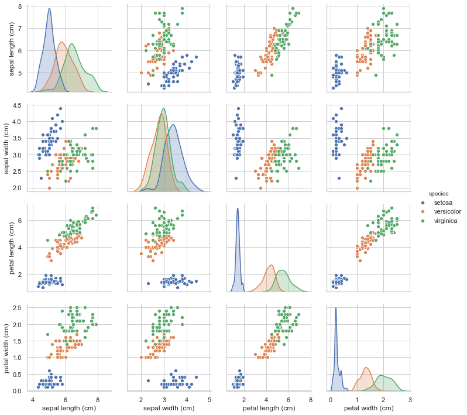


```python
sns.distplot(df[df.species != "setosa"]["petal length (cm)"], hist=True, rug=True, label="setosa")
sns.distplot(df[df.species == "setosa"]["petal length (cm)"], hist=True, rug=True, label="others")
plt.legend()
plt.show()
```


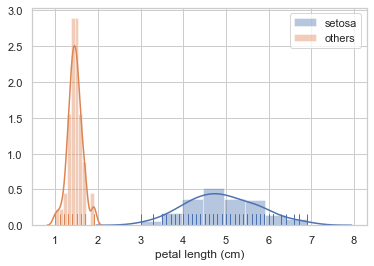


### 1-1). sklearn - iris 데이터

    - 연습 : virginica, versicolor 종의 판별 길이('petal length') 구하기


```python
sns.distplot(df[df.species == "virginica"]["petal length (cm)"], hist=True, rug=True, label="virginica")
sns.distplot(df[df.species == "versicolor"]["petal length (cm)"], hist=True, rug=True, label="versicolor")
plt.legend()
plt.show()
```


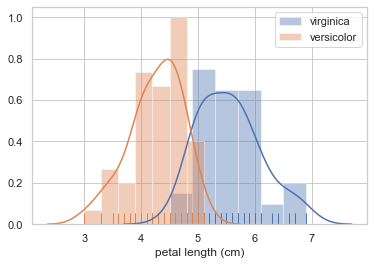


```python
# 기준점 : 4.7cm 이상 = virginica / 이하 = versicolor
# 모델 생성 -> 채점 결과 데이터프레임 생성

df_m = df[['petal length (cm)','species']]
df_m = df_m[df_m.species != 'setosa']

df_result_t = pd.DataFrame({'thresh' : np.linspace(4,5,10)})
df_result_t['point'] = 0

for idx, thresh in enumerate(np.linspace(4,5,10)):
    
    df_m['predict'] = df_m['petal length (cm)'].apply(lambda x: 'virginica' if x >=thresh else 'versicolor')
    df_m['score'] = [1 if df_m.species.loc[i] == df_m.predict.loc[i] else 0
                     for i in range(50,150)]
    df_result_t['point'].loc[idx] = df_m.score.sum()

df_result_t = df_result_t.sort_values('point',ascending=False).reset_index().drop(columns='index')

df_result_t
```


<div>
<style scoped>
    .dataframe tbody tr th:only-of-type {
        vertical-align: middle;
    }

    .dataframe tbody tr th {
        vertical-align: top;
    }

    .dataframe thead th {
        text-align: right;
    }
</style>
<table border="1" class="dataframe">
  <thead>
    <tr style="text-align: right;">
      <th></th>
      <th>thresh</th>
      <th>point</th>
    </tr>
  </thead>
  <tbody>
    <tr>
      <th>0</th>
      <td>4.777778</td>
      <td>93</td>
    </tr>
    <tr>
      <th>1</th>
      <td>4.888889</td>
      <td>93</td>
    </tr>
    <tr>
      <th>2</th>
      <td>5.000000</td>
      <td>92</td>
    </tr>
    <tr>
      <th>3</th>
      <td>4.666667</td>
      <td>88</td>
    </tr>
    <tr>
      <th>4</th>
      <td>4.555556</td>
      <td>85</td>
    </tr>
    <tr>
      <th>5</th>
      <td>4.444444</td>
      <td>79</td>
    </tr>
    <tr>
      <th>6</th>
      <td>4.333333</td>
      <td>75</td>
    </tr>
    <tr>
      <th>7</th>
      <td>4.222222</td>
      <td>73</td>
    </tr>
    <tr>
      <th>8</th>
      <td>4.111111</td>
      <td>69</td>
    </tr>
    <tr>
      <th>9</th>
      <td>4.000000</td>
      <td>61</td>
    </tr>
  </tbody>
</table>
</div>


```python
plt.plot(df_result_t.thresh,df_result_t.point)
```


    [<matplotlib.lines.Line2D at 0x121e4c150>]


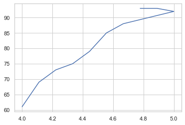


## 2. sklearn - 와인 데이터

    - 클래스 3개
    


```python
from sklearn.datasets import load_wine
wine = load_wine()
print(wine.DESCR)
```

    .. _wine_dataset:
    
    Wine recognition dataset
    ------------------------
    
    **Data Set Characteristics:**
    
        :Number of Instances: 178 (50 in each of three classes)
        :Number of Attributes: 13 numeric, predictive attributes and the class
        :Attribute Information:
     		- Alcohol
     		- Malic acid
     		- Ash
    		- Alcalinity of ash  
     		- Magnesium
    		- Total phenols
     		- Flavanoids
     		- Nonflavanoid phenols
     		- Proanthocyanins
    		- Color intensity
     		- Hue
     		- OD280/OD315 of diluted wines
     		- Proline
    
        - class:
                - class_0
                - class_1
                - class_2
    		
        :Summary Statistics:
        
        ============================= ==== ===== ======= =====
                                       Min   Max   Mean     SD
        ============================= ==== ===== ======= =====
        Alcohol:                      11.0  14.8    13.0   0.8
        Malic Acid:                   0.74  5.80    2.34  1.12
        Ash:                          1.36  3.23    2.36  0.27
        Alcalinity of Ash:            10.6  30.0    19.5   3.3
        Magnesium:                    70.0 162.0    99.7  14.3
        Total Phenols:                0.98  3.88    2.29  0.63
        Flavanoids:                   0.34  5.08    2.03  1.00
        Nonflavanoid Phenols:         0.13  0.66    0.36  0.12
        Proanthocyanins:              0.41  3.58    1.59  0.57
        Colour Intensity:              1.3  13.0     5.1   2.3
        Hue:                          0.48  1.71    0.96  0.23
        OD280/OD315 of diluted wines: 1.27  4.00    2.61  0.71
        Proline:                       278  1680     746   315
        ============================= ==== ===== ======= =====
    
        :Missing Attribute Values: None
        :Class Distribution: class_0 (59), class_1 (71), class_2 (48)
        :Creator: R.A. Fisher
        :Donor: Michael Marshall (MARSHALL%PLU@io.arc.nasa.gov)
        :Date: July, 1988
    
    This is a copy of UCI ML Wine recognition datasets.
    https://archive.ics.uci.edu/ml/machine-learning-databases/wine/wine.data
    
    The data is the results of a chemical analysis of wines grown in the same
    region in Italy by three different cultivators. There are thirteen different
    measurements taken for different constituents found in the three types of
    wine.
    
    Original Owners: 
    
    Forina, M. et al, PARVUS - 
    An Extendible Package for Data Exploration, Classification and Correlation. 
    Institute of Pharmaceutical and Food Analysis and Technologies,
    Via Brigata Salerno, 16147 Genoa, Italy.
    
    Citation:
    
    Lichman, M. (2013). UCI Machine Learning Repository
    [https://archive.ics.uci.edu/ml]. Irvine, CA: University of California,
    School of Information and Computer Science. 
    
    .. topic:: References
    
      (1) S. Aeberhard, D. Coomans and O. de Vel, 
      Comparison of Classifiers in High Dimensional Settings, 
      Tech. Rep. no. 92-02, (1992), Dept. of Computer Science and Dept. of  
      Mathematics and Statistics, James Cook University of North Queensland. 
      (Also submitted to Technometrics). 
    
      The data was used with many others for comparing various 
      classifiers. The classes are separable, though only RDA 
      has achieved 100% correct classification. 
      (RDA : 100%, QDA 99.4%, LDA 98.9%, 1NN 96.1% (z-transformed data)) 
      (All results using the leave-one-out technique) 
    
      (2) S. Aeberhard, D. Coomans and O. de Vel, 
      "THE CLASSIFICATION PERFORMANCE OF RDA" 
      Tech. Rep. no. 92-01, (1992), Dept. of Computer Science and Dept. of 
      Mathematics and Statistics, James Cook University of North Queensland. 
      (Also submitted to Journal of Chemometrics).
    


```python
df = pd.DataFrame(wine.data, columns=wine.feature_names)
sy = pd.Series(wine.target, dtype="category")
sy = sy.cat.rename_categories(wine.target_names)
df['class'] = sy
df.tail()
```


<div>
<style scoped>
    .dataframe tbody tr th:only-of-type {
        vertical-align: middle;
    }

    .dataframe tbody tr th {
        vertical-align: top;
    }

    .dataframe thead th {
        text-align: right;
    }
</style>
<table border="1" class="dataframe">
  <thead>
    <tr style="text-align: right;">
      <th></th>
      <th>alcohol</th>
      <th>malic_acid</th>
      <th>ash</th>
      <th>alcalinity_of_ash</th>
      <th>magnesium</th>
      <th>total_phenols</th>
      <th>flavanoids</th>
      <th>nonflavanoid_phenols</th>
      <th>proanthocyanins</th>
      <th>color_intensity</th>
      <th>hue</th>
      <th>od280/od315_of_diluted_wines</th>
      <th>proline</th>
      <th>class</th>
    </tr>
  </thead>
  <tbody>
    <tr>
      <th>173</th>
      <td>13.71</td>
      <td>5.65</td>
      <td>2.45</td>
      <td>20.5</td>
      <td>95.0</td>
      <td>1.68</td>
      <td>0.61</td>
      <td>0.52</td>
      <td>1.06</td>
      <td>7.7</td>
      <td>0.64</td>
      <td>1.74</td>
      <td>740.0</td>
      <td>class_2</td>
    </tr>
    <tr>
      <th>174</th>
      <td>13.40</td>
      <td>3.91</td>
      <td>2.48</td>
      <td>23.0</td>
      <td>102.0</td>
      <td>1.80</td>
      <td>0.75</td>
      <td>0.43</td>
      <td>1.41</td>
      <td>7.3</td>
      <td>0.70</td>
      <td>1.56</td>
      <td>750.0</td>
      <td>class_2</td>
    </tr>
    <tr>
      <th>175</th>
      <td>13.27</td>
      <td>4.28</td>
      <td>2.26</td>
      <td>20.0</td>
      <td>120.0</td>
      <td>1.59</td>
      <td>0.69</td>
      <td>0.43</td>
      <td>1.35</td>
      <td>10.2</td>
      <td>0.59</td>
      <td>1.56</td>
      <td>835.0</td>
      <td>class_2</td>
    </tr>
    <tr>
      <th>176</th>
      <td>13.17</td>
      <td>2.59</td>
      <td>2.37</td>
      <td>20.0</td>
      <td>120.0</td>
      <td>1.65</td>
      <td>0.68</td>
      <td>0.53</td>
      <td>1.46</td>
      <td>9.3</td>
      <td>0.60</td>
      <td>1.62</td>
      <td>840.0</td>
      <td>class_2</td>
    </tr>
    <tr>
      <th>177</th>
      <td>14.13</td>
      <td>4.10</td>
      <td>2.74</td>
      <td>24.5</td>
      <td>96.0</td>
      <td>2.05</td>
      <td>0.76</td>
      <td>0.56</td>
      <td>1.35</td>
      <td>9.2</td>
      <td>0.61</td>
      <td>1.60</td>
      <td>560.0</td>
      <td>class_2</td>
    </tr>
  </tbody>
</table>
</div>


```python
sns.pairplot(vars=["alcohol", "alcalinity_of_ash", "total_phenols", "flavanoids"], 
             hue="class", data=df)
plt.show()
```


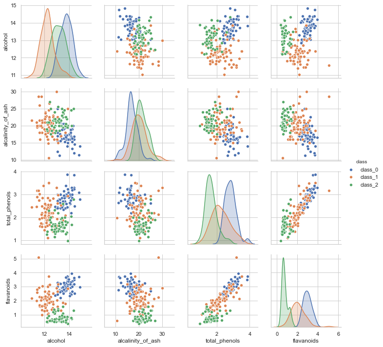


## 3. sklearn - 유방암 진단 데이터

    - 클래스 : 2개
   


```python
from sklearn.datasets import load_breast_cancer
cancer = load_breast_cancer()
print(cancer.DESCR)
```

    .. _breast_cancer_dataset:
    
    Breast cancer wisconsin (diagnostic) dataset
    --------------------------------------------
    
    **Data Set Characteristics:**
    
        :Number of Instances: 569
    
        :Number of Attributes: 30 numeric, predictive attributes and the class
    
        :Attribute Information:
            - radius (mean of distances from center to points on the perimeter)
            - texture (standard deviation of gray-scale values)
            - perimeter
            - area
            - smoothness (local variation in radius lengths)
            - compactness (perimeter^2 / area - 1.0)
            - concavity (severity of concave portions of the contour)
            - concave points (number of concave portions of the contour)
            - symmetry 
            - fractal dimension ("coastline approximation" - 1)
    
            The mean, standard error, and "worst" or largest (mean of the three
            largest values) of these features were computed for each image,
            resulting in 30 features.  For instance, field 3 is Mean Radius, field
            13 is Radius SE, field 23 is Worst Radius.
    
            - class:
                    - WDBC-Malignant
                    - WDBC-Benign
    
        :Summary Statistics:
    
        ===================================== ====== ======
                                               Min    Max
        ===================================== ====== ======
        radius (mean):                        6.981  28.11
        texture (mean):                       9.71   39.28
        perimeter (mean):                     43.79  188.5
        area (mean):                          143.5  2501.0
        smoothness (mean):                    0.053  0.163
        compactness (mean):                   0.019  0.345
        concavity (mean):                     0.0    0.427
        concave points (mean):                0.0    0.201
        symmetry (mean):                      0.106  0.304
        fractal dimension (mean):             0.05   0.097
        radius (standard error):              0.112  2.873
        texture (standard error):             0.36   4.885
        perimeter (standard error):           0.757  21.98
        area (standard error):                6.802  542.2
        smoothness (standard error):          0.002  0.031
        compactness (standard error):         0.002  0.135
        concavity (standard error):           0.0    0.396
        concave points (standard error):      0.0    0.053
        symmetry (standard error):            0.008  0.079
        fractal dimension (standard error):   0.001  0.03
        radius (worst):                       7.93   36.04
        texture (worst):                      12.02  49.54
        perimeter (worst):                    50.41  251.2
        area (worst):                         185.2  4254.0
        smoothness (worst):                   0.071  0.223
        compactness (worst):                  0.027  1.058
        concavity (worst):                    0.0    1.252
        concave points (worst):               0.0    0.291
        symmetry (worst):                     0.156  0.664
        fractal dimension (worst):            0.055  0.208
        ===================================== ====== ======
    
        :Missing Attribute Values: None
    
        :Class Distribution: 212 - Malignant, 357 - Benign
    
        :Creator:  Dr. William H. Wolberg, W. Nick Street, Olvi L. Mangasarian
    
        :Donor: Nick Street
    
        :Date: November, 1995
    
    This is a copy of UCI ML Breast Cancer Wisconsin (Diagnostic) datasets.
    https://goo.gl/U2Uwz2
    
    Features are computed from a digitized image of a fine needle
    aspirate (FNA) of a breast mass.  They describe
    characteristics of the cell nuclei present in the image.
    
    Separating plane described above was obtained using
    Multisurface Method-Tree (MSM-T) [K. P. Bennett, "Decision Tree
    Construction Via Linear Programming." Proceedings of the 4th
    Midwest Artificial Intelligence and Cognitive Science Society,
    pp. 97-101, 1992], a classification method which uses linear
    programming to construct a decision tree.  Relevant features
    were selected using an exhaustive search in the space of 1-4
    features and 1-3 separating planes.
    
    The actual linear program used to obtain the separating plane
    in the 3-dimensional space is that described in:
    [K. P. Bennett and O. L. Mangasarian: "Robust Linear
    Programming Discrimination of Two Linearly Inseparable Sets",
    Optimization Methods and Software 1, 1992, 23-34].
    
    This database is also available through the UW CS ftp server:
    
    ftp ftp.cs.wisc.edu
    cd math-prog/cpo-dataset/machine-learn/WDBC/
    
    .. topic:: References
    
       - W.N. Street, W.H. Wolberg and O.L. Mangasarian. Nuclear feature extraction 
         for breast tumor diagnosis. IS&T/SPIE 1993 International Symposium on 
         Electronic Imaging: Science and Technology, volume 1905, pages 861-870,
         San Jose, CA, 1993.
       - O.L. Mangasarian, W.N. Street and W.H. Wolberg. Breast cancer diagnosis and 
         prognosis via linear programming. Operations Research, 43(4), pages 570-577, 
         July-August 1995.
       - W.H. Wolberg, W.N. Street, and O.L. Mangasarian. Machine learning techniques
         to diagnose breast cancer from fine-needle aspirates. Cancer Letters 77 (1994) 
         163-171.


```python
df = pd.DataFrame(cancer.data, columns=cancer.feature_names)
sy = pd.Series(cancer.target, dtype="category")
sy = sy.cat.rename_categories(cancer.target_names)
df['class'] = sy
df.tail()
```


<div>
<style scoped>
    .dataframe tbody tr th:only-of-type {
        vertical-align: middle;
    }

    .dataframe tbody tr th {
        vertical-align: top;
    }

    .dataframe thead th {
        text-align: right;
    }
</style>
<table border="1" class="dataframe">
  <thead>
    <tr style="text-align: right;">
      <th></th>
      <th>mean radius</th>
      <th>mean texture</th>
      <th>mean perimeter</th>
      <th>mean area</th>
      <th>mean smoothness</th>
      <th>mean compactness</th>
      <th>mean concavity</th>
      <th>mean concave points</th>
      <th>mean symmetry</th>
      <th>mean fractal dimension</th>
      <th>...</th>
      <th>worst texture</th>
      <th>worst perimeter</th>
      <th>worst area</th>
      <th>worst smoothness</th>
      <th>worst compactness</th>
      <th>worst concavity</th>
      <th>worst concave points</th>
      <th>worst symmetry</th>
      <th>worst fractal dimension</th>
      <th>class</th>
    </tr>
  </thead>
  <tbody>
    <tr>
      <th>564</th>
      <td>21.56</td>
      <td>22.39</td>
      <td>142.00</td>
      <td>1479.0</td>
      <td>0.11100</td>
      <td>0.11590</td>
      <td>0.24390</td>
      <td>0.13890</td>
      <td>0.1726</td>
      <td>0.05623</td>
      <td>...</td>
      <td>26.40</td>
      <td>166.10</td>
      <td>2027.0</td>
      <td>0.14100</td>
      <td>0.21130</td>
      <td>0.4107</td>
      <td>0.2216</td>
      <td>0.2060</td>
      <td>0.07115</td>
      <td>malignant</td>
    </tr>
    <tr>
      <th>565</th>
      <td>20.13</td>
      <td>28.25</td>
      <td>131.20</td>
      <td>1261.0</td>
      <td>0.09780</td>
      <td>0.10340</td>
      <td>0.14400</td>
      <td>0.09791</td>
      <td>0.1752</td>
      <td>0.05533</td>
      <td>...</td>
      <td>38.25</td>
      <td>155.00</td>
      <td>1731.0</td>
      <td>0.11660</td>
      <td>0.19220</td>
      <td>0.3215</td>
      <td>0.1628</td>
      <td>0.2572</td>
      <td>0.06637</td>
      <td>malignant</td>
    </tr>
    <tr>
      <th>566</th>
      <td>16.60</td>
      <td>28.08</td>
      <td>108.30</td>
      <td>858.1</td>
      <td>0.08455</td>
      <td>0.10230</td>
      <td>0.09251</td>
      <td>0.05302</td>
      <td>0.1590</td>
      <td>0.05648</td>
      <td>...</td>
      <td>34.12</td>
      <td>126.70</td>
      <td>1124.0</td>
      <td>0.11390</td>
      <td>0.30940</td>
      <td>0.3403</td>
      <td>0.1418</td>
      <td>0.2218</td>
      <td>0.07820</td>
      <td>malignant</td>
    </tr>
    <tr>
      <th>567</th>
      <td>20.60</td>
      <td>29.33</td>
      <td>140.10</td>
      <td>1265.0</td>
      <td>0.11780</td>
      <td>0.27700</td>
      <td>0.35140</td>
      <td>0.15200</td>
      <td>0.2397</td>
      <td>0.07016</td>
      <td>...</td>
      <td>39.42</td>
      <td>184.60</td>
      <td>1821.0</td>
      <td>0.16500</td>
      <td>0.86810</td>
      <td>0.9387</td>
      <td>0.2650</td>
      <td>0.4087</td>
      <td>0.12400</td>
      <td>malignant</td>
    </tr>
    <tr>
      <th>568</th>
      <td>7.76</td>
      <td>24.54</td>
      <td>47.92</td>
      <td>181.0</td>
      <td>0.05263</td>
      <td>0.04362</td>
      <td>0.00000</td>
      <td>0.00000</td>
      <td>0.1587</td>
      <td>0.05884</td>
      <td>...</td>
      <td>30.37</td>
      <td>59.16</td>
      <td>268.6</td>
      <td>0.08996</td>
      <td>0.06444</td>
      <td>0.0000</td>
      <td>0.0000</td>
      <td>0.2871</td>
      <td>0.07039</td>
      <td>benign</td>
    </tr>
  </tbody>
</table>
<p>5 rows × 31 columns</p>
</div>


```python
sns.pairplot(vars=["worst radius", "worst texture", "worst perimeter", "worst area"], 
             hue="class", data=df)
plt.show()
```


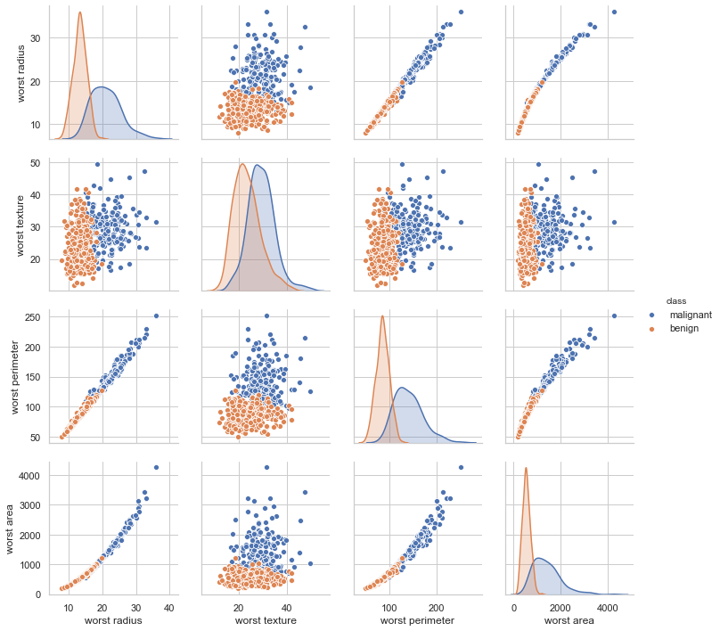


## 4. sklearn - 대표 수종 데이터

    - 클래스 : 7개 분류


```python
from sklearn.datasets import fetch_covtype
covtype = fetch_covtype()
print(covtype.DESCR)
```

    Downloading https://ndownloader.figshare.com/files/5976039


    .. _covtype_dataset:
    
    Forest covertypes
    -----------------
    
    The samples in this dataset correspond to 30×30m patches of forest in the US,
    collected for the task of predicting each patch's cover type,
    i.e. the dominant species of tree.
    There are seven covertypes, making this a multiclass classification problem.
    Each sample has 54 features, described on the
    `dataset's homepage <https://archive.ics.uci.edu/ml/datasets/Covertype>`__.
    Some of the features are boolean indicators,
    while others are discrete or continuous measurements.
    
    **Data Set Characteristics:**
    
        =================   ============
        Classes                        7
        Samples total             581012
        Dimensionality                54
        Features                     int
        =================   ============
    
    :func:`sklearn.datasets.fetch_covtype` will load the covertype dataset;
    it returns a dictionary-like object
    with the feature matrix in the ``data`` member
    and the target values in ``target``.
    The dataset will be downloaded from the web if necessary.
    


```python
# 1-10 : 실수데이터, 11-54 : 범주형 데이터

df = pd.DataFrame(covtype.data, 
                  columns=["x{:02d}".format(i + 1) for i in range(covtype.data.shape[1])],
                  dtype=int)
sy = pd.Series(covtype.target, dtype="category")
df['covtype'] = sy
df.tail()
```


<div>
<style scoped>
    .dataframe tbody tr th:only-of-type {
        vertical-align: middle;
    }

    .dataframe tbody tr th {
        vertical-align: top;
    }

    .dataframe thead th {
        text-align: right;
    }
</style>
<table border="1" class="dataframe">
  <thead>
    <tr style="text-align: right;">
      <th></th>
      <th>x01</th>
      <th>x02</th>
      <th>x03</th>
      <th>x04</th>
      <th>x05</th>
      <th>x06</th>
      <th>x07</th>
      <th>x08</th>
      <th>x09</th>
      <th>x10</th>
      <th>...</th>
      <th>x46</th>
      <th>x47</th>
      <th>x48</th>
      <th>x49</th>
      <th>x50</th>
      <th>x51</th>
      <th>x52</th>
      <th>x53</th>
      <th>x54</th>
      <th>covtype</th>
    </tr>
  </thead>
  <tbody>
    <tr>
      <th>581007</th>
      <td>2396</td>
      <td>153</td>
      <td>20</td>
      <td>85</td>
      <td>17</td>
      <td>108</td>
      <td>240</td>
      <td>237</td>
      <td>118</td>
      <td>837</td>
      <td>...</td>
      <td>0</td>
      <td>0</td>
      <td>0</td>
      <td>0</td>
      <td>0</td>
      <td>0</td>
      <td>0</td>
      <td>0</td>
      <td>0</td>
      <td>3</td>
    </tr>
    <tr>
      <th>581008</th>
      <td>2391</td>
      <td>152</td>
      <td>19</td>
      <td>67</td>
      <td>12</td>
      <td>95</td>
      <td>240</td>
      <td>237</td>
      <td>119</td>
      <td>845</td>
      <td>...</td>
      <td>0</td>
      <td>0</td>
      <td>0</td>
      <td>0</td>
      <td>0</td>
      <td>0</td>
      <td>0</td>
      <td>0</td>
      <td>0</td>
      <td>3</td>
    </tr>
    <tr>
      <th>581009</th>
      <td>2386</td>
      <td>159</td>
      <td>17</td>
      <td>60</td>
      <td>7</td>
      <td>90</td>
      <td>236</td>
      <td>241</td>
      <td>130</td>
      <td>854</td>
      <td>...</td>
      <td>0</td>
      <td>0</td>
      <td>0</td>
      <td>0</td>
      <td>0</td>
      <td>0</td>
      <td>0</td>
      <td>0</td>
      <td>0</td>
      <td>3</td>
    </tr>
    <tr>
      <th>581010</th>
      <td>2384</td>
      <td>170</td>
      <td>15</td>
      <td>60</td>
      <td>5</td>
      <td>90</td>
      <td>230</td>
      <td>245</td>
      <td>143</td>
      <td>864</td>
      <td>...</td>
      <td>0</td>
      <td>0</td>
      <td>0</td>
      <td>0</td>
      <td>0</td>
      <td>0</td>
      <td>0</td>
      <td>0</td>
      <td>0</td>
      <td>3</td>
    </tr>
    <tr>
      <th>581011</th>
      <td>2383</td>
      <td>165</td>
      <td>13</td>
      <td>60</td>
      <td>4</td>
      <td>67</td>
      <td>231</td>
      <td>244</td>
      <td>141</td>
      <td>875</td>
      <td>...</td>
      <td>0</td>
      <td>0</td>
      <td>0</td>
      <td>0</td>
      <td>0</td>
      <td>0</td>
      <td>0</td>
      <td>0</td>
      <td>0</td>
      <td>3</td>
    </tr>
  </tbody>
</table>
<p>5 rows × 55 columns</p>
</div>


```python
pd.DataFrame(df.nunique()).T
```


<div>
<style scoped>
    .dataframe tbody tr th:only-of-type {
        vertical-align: middle;
    }

    .dataframe tbody tr th {
        vertical-align: top;
    }

    .dataframe thead th {
        text-align: right;
    }
</style>
<table border="1" class="dataframe">
  <thead>
    <tr style="text-align: right;">
      <th></th>
      <th>x01</th>
      <th>x02</th>
      <th>x03</th>
      <th>x04</th>
      <th>x05</th>
      <th>x06</th>
      <th>x07</th>
      <th>x08</th>
      <th>x09</th>
      <th>x10</th>
      <th>...</th>
      <th>x46</th>
      <th>x47</th>
      <th>x48</th>
      <th>x49</th>
      <th>x50</th>
      <th>x51</th>
      <th>x52</th>
      <th>x53</th>
      <th>x54</th>
      <th>covtype</th>
    </tr>
  </thead>
  <tbody>
    <tr>
      <th>0</th>
      <td>1978</td>
      <td>361</td>
      <td>67</td>
      <td>551</td>
      <td>700</td>
      <td>5785</td>
      <td>207</td>
      <td>185</td>
      <td>255</td>
      <td>5827</td>
      <td>...</td>
      <td>2</td>
      <td>2</td>
      <td>2</td>
      <td>2</td>
      <td>2</td>
      <td>2</td>
      <td>2</td>
      <td>2</td>
      <td>2</td>
      <td>7</td>
    </tr>
  </tbody>
</table>
<p>1 rows × 55 columns</p>
</div>


```python
df.iloc[:, 10:54] = df.iloc[:, 10:54].astype('category')
```


```python
# x14 feature : type 4번 분류에 완전한 기준을 갖고 있음

df_count = df.pivot_table(index="covtype", columns="x14", aggfunc="size")
sns.heatmap(df_count, cmap=sns.light_palette("gray", as_cmap=True), annot=True, fmt="0")
plt.show()
```


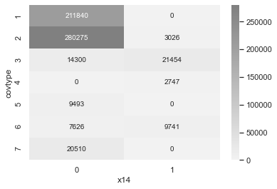


## 5. sklearn - 숫자 필기 이미지

    - 클래스 : 10개


```python
from sklearn.datasets import load_digits
digits = load_digits()
print(digits.DESCR)
```

    .. _digits_dataset:
    
    Optical recognition of handwritten digits dataset
    --------------------------------------------------
    
    **Data Set Characteristics:**
    
        :Number of Instances: 5620
        :Number of Attributes: 64
        :Attribute Information: 8x8 image of integer pixels in the range 0..16.
        :Missing Attribute Values: None
        :Creator: E. Alpaydin (alpaydin '@' boun.edu.tr)
        :Date: July; 1998
    
    This is a copy of the test set of the UCI ML hand-written digits datasets
    https://archive.ics.uci.edu/ml/datasets/Optical+Recognition+of+Handwritten+Digits
    
    The data set contains images of hand-written digits: 10 classes where
    each class refers to a digit.
    
    Preprocessing programs made available by NIST were used to extract
    normalized bitmaps of handwritten digits from a preprinted form. From a
    total of 43 people, 30 contributed to the training set and different 13
    to the test set. 32x32 bitmaps are divided into nonoverlapping blocks of
    4x4 and the number of on pixels are counted in each block. This generates
    an input matrix of 8x8 where each element is an integer in the range
    0..16. This reduces dimensionality and gives invariance to small
    distortions.
    
    For info on NIST preprocessing routines, see M. D. Garris, J. L. Blue, G.
    T. Candela, D. L. Dimmick, J. Geist, P. J. Grother, S. A. Janet, and C.
    L. Wilson, NIST Form-Based Handprint Recognition System, NISTIR 5469,
    1994.
    
    .. topic:: References
    
      - C. Kaynak (1995) Methods of Combining Multiple Classifiers and Their
        Applications to Handwritten Digit Recognition, MSc Thesis, Institute of
        Graduate Studies in Science and Engineering, Bogazici University.
      - E. Alpaydin, C. Kaynak (1998) Cascading Classifiers, Kybernetika.
      - Ken Tang and Ponnuthurai N. Suganthan and Xi Yao and A. Kai Qin.
        Linear dimensionalityreduction using relevance weighted LDA. School of
        Electrical and Electronic Engineering Nanyang Technological University.
        2005.
      - Claudio Gentile. A New Approximate Maximal Margin Classification
        Algorithm. NIPS. 2000.


```python
np.random.seed(0)
N = 4
M = 10
fig = plt.figure(figsize=(10, 5))
plt.subplots_adjust(top=1, bottom=0, hspace=0, wspace=0.05)
for i in range(N):
    for j in range(M):
        k = i*M+j
        ax = fig.add_subplot(N, M, k+1)
        ax.imshow(digits.images[k], cmap=plt.cm.bone, interpolation="none")
        ax.grid(False)
        ax.xaxis.set_ticks([])
        ax.yaxis.set_ticks([])
        plt.title(digits.target_names[digits.target[k]])
plt.tight_layout()
plt.show()
```


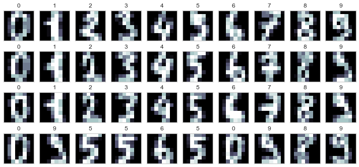


## 6. sklearn - 올리베티 얼굴 이미지

    - 클래스 : 40명


```python
from sklearn.datasets import fetch_olivetti_faces
olivetti = fetch_olivetti_faces()
print(olivetti.DESCR)
```

    .. _olivetti_faces_dataset:
    
    The Olivetti faces dataset
    --------------------------
    
    `This dataset contains a set of face images`_ taken between April 1992 and 
    April 1994 at AT&T Laboratories Cambridge. The
    :func:`sklearn.datasets.fetch_olivetti_faces` function is the data
    fetching / caching function that downloads the data
    archive from AT&T.
    
    .. _This dataset contains a set of face images: http://www.cl.cam.ac.uk/research/dtg/attarchive/facedatabase.html
    
    As described on the original website:
    
        There are ten different images of each of 40 distinct subjects. For some
        subjects, the images were taken at different times, varying the lighting,
        facial expressions (open / closed eyes, smiling / not smiling) and facial
        details (glasses / no glasses). All the images were taken against a dark
        homogeneous background with the subjects in an upright, frontal position 
        (with tolerance for some side movement).
    
    **Data Set Characteristics:**
    
        =================   =====================
        Classes                                40
        Samples total                         400
        Dimensionality                       4096
        Features            real, between 0 and 1
        =================   =====================
    
    The image is quantized to 256 grey levels and stored as unsigned 8-bit 
    integers; the loader will convert these to floating point values on the 
    interval [0, 1], which are easier to work with for many algorithms.
    
    The "target" for this database is an integer from 0 to 39 indicating the
    identity of the person pictured; however, with only 10 examples per class, this
    relatively small dataset is more interesting from an unsupervised or
    semi-supervised perspective.
    
    The original dataset consisted of 92 x 112, while the version available here
    consists of 64x64 images.
    
    When using these images, please give credit to AT&T Laboratories Cambridge.
    


```python
np.random.seed(0)
N = 2
M = 5
fig = plt.figure(figsize=(8, 5))
plt.subplots_adjust(top=1, bottom=0, hspace=0, wspace=0.05)
klist = np.random.choice(range(len(olivetti.data)), N * M)
for i in range(N):
    for j in range(M):
        k = klist[i*M+j]
        ax = fig.add_subplot(N, M, i*M+j+1)
        ax.imshow(olivetti.images[k], cmap=plt.cm.bone)
        ax.grid(False)
        ax.xaxis.set_ticks([])
        ax.yaxis.set_ticks([])
        plt.title(olivetti.target[k])
plt.tight_layout()
plt.show()
```


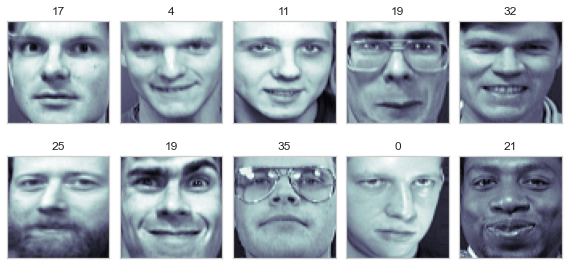


## 7. sklearn - Labeled Faces in the Wild (LFW) 데이터

    - 클래스 : 약 5,800명


```python
from sklearn.datasets import fetch_lfw_people
lfw_people = fetch_lfw_people(min_faces_per_person=70, resize=0.4)
print(lfw_people.DESCR)
```

    Downloading LFW metadata: https://ndownloader.figshare.com/files/5976012
    Downloading LFW metadata: https://ndownloader.figshare.com/files/5976009
    Downloading LFW metadata: https://ndownloader.figshare.com/files/5976006
    Downloading LFW data (~200MB): https://ndownloader.figshare.com/files/5976015


    .. _labeled_faces_in_the_wild_dataset:
    
    The Labeled Faces in the Wild face recognition dataset
    ------------------------------------------------------
    
    This dataset is a collection of JPEG pictures of famous people collected
    over the internet, all details are available on the official website:
    
        http://vis-www.cs.umass.edu/lfw/
    
    Each picture is centered on a single face. The typical task is called
    Face Verification: given a pair of two pictures, a binary classifier
    must predict whether the two images are from the same person.
    
    An alternative task, Face Recognition or Face Identification is:
    given the picture of the face of an unknown person, identify the name
    of the person by referring to a gallery of previously seen pictures of
    identified persons.
    
    Both Face Verification and Face Recognition are tasks that are typically
    performed on the output of a model trained to perform Face Detection. The
    most popular model for Face Detection is called Viola-Jones and is
    implemented in the OpenCV library. The LFW faces were extracted by this
    face detector from various online websites.
    
    **Data Set Characteristics:**
    
        =================   =======================
        Classes                                5749
        Samples total                         13233
        Dimensionality                         5828
        Features            real, between 0 and 255
        =================   =======================
    
    Usage
    ~~~~~
    
    ``scikit-learn`` provides two loaders that will automatically download,
    cache, parse the metadata files, decode the jpeg and convert the
    interesting slices into memmapped numpy arrays. This dataset size is more
    than 200 MB. The first load typically takes more than a couple of minutes
    to fully decode the relevant part of the JPEG files into numpy arrays. If
    the dataset has  been loaded once, the following times the loading times
    less than 200ms by using a memmapped version memoized on the disk in the
    ``~/scikit_learn_data/lfw_home/`` folder using ``joblib``.
    
    The first loader is used for the Face Identification task: a multi-class
    classification task (hence supervised learning)::
    
      >>> from sklearn.datasets import fetch_lfw_people
      >>> lfw_people = fetch_lfw_people(min_faces_per_person=70, resize=0.4)
    
      >>> for name in lfw_people.target_names:
      ...     print(name)
      ...
      Ariel Sharon
      Colin Powell
      Donald Rumsfeld
      George W Bush
      Gerhard Schroeder
      Hugo Chavez
      Tony Blair
    
    The default slice is a rectangular shape around the face, removing
    most of the background::
    
      >>> lfw_people.data.dtype
      dtype('float32')
    
      >>> lfw_people.data.shape
      (1288, 1850)
    
      >>> lfw_people.images.shape
      (1288, 50, 37)
    
    Each of the ``1140`` faces is assigned to a single person id in the ``target``
    array::
    
      >>> lfw_people.target.shape
      (1288,)
    
      >>> list(lfw_people.target[:10])
      [5, 6, 3, 1, 0, 1, 3, 4, 3, 0]
    
    The second loader is typically used for the face verification task: each sample
    is a pair of two picture belonging or not to the same person::
    
      >>> from sklearn.datasets import fetch_lfw_pairs
      >>> lfw_pairs_train = fetch_lfw_pairs(subset='train')
    
      >>> list(lfw_pairs_train.target_names)
      ['Different persons', 'Same person']
    
      >>> lfw_pairs_train.pairs.shape
      (2200, 2, 62, 47)
    
      >>> lfw_pairs_train.data.shape
      (2200, 5828)
    
      >>> lfw_pairs_train.target.shape
      (2200,)
    
    Both for the :func:`sklearn.datasets.fetch_lfw_people` and
    :func:`sklearn.datasets.fetch_lfw_pairs` function it is
    possible to get an additional dimension with the RGB color channels by
    passing ``color=True``, in that case the shape will be
    ``(2200, 2, 62, 47, 3)``.
    
    The :func:`sklearn.datasets.fetch_lfw_pairs` datasets is subdivided into
    3 subsets: the development ``train`` set, the development ``test`` set and
    an evaluation ``10_folds`` set meant to compute performance metrics using a
    10-folds cross validation scheme.
    
    .. topic:: References:
    
     * `Labeled Faces in the Wild: A Database for Studying Face Recognition
       in Unconstrained Environments.
       <http://vis-www.cs.umass.edu/lfw/lfw.pdf>`_
       Gary B. Huang, Manu Ramesh, Tamara Berg, and Erik Learned-Miller.
       University of Massachusetts, Amherst, Technical Report 07-49, October, 2007.
    
    
    Examples
    ~~~~~~~~
    
    :ref:`sphx_glr_auto_examples_applications_plot_face_recognition.py`
    


```python
np.random.seed(0)
N = 2
M = 5
fig = plt.figure(figsize=(8, 5))
plt.subplots_adjust(top=1, bottom=0, hspace=0.1, wspace=0.05)
klist = np.random.choice(range(len(lfw_people.data)), N * M)
for i in range(N):
    for j in range(M):
        k = klist[i*M+j]
        ax = fig.add_subplot(N, M, i*M+j+1)
        ax.imshow(lfw_people.images[k], cmap=plt.cm.bone)
        ax.grid(False)
        ax.xaxis.set_ticks([])
        ax.yaxis.set_ticks([])
        plt.title(lfw_people.target_names[lfw_people.target[k]])
plt.tight_layout()
plt.show()
```


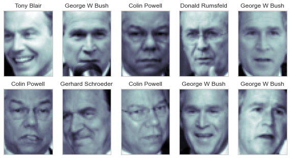


```python
from sklearn.datasets import fetch_lfw_pairs
lfw_pairs = fetch_lfw_pairs(resize=0.4)
print(lfw_pairs.DESCR)
```

    .. _labeled_faces_in_the_wild_dataset:
    
    The Labeled Faces in the Wild face recognition dataset
    ------------------------------------------------------
    
    This dataset is a collection of JPEG pictures of famous people collected
    over the internet, all details are available on the official website:
    
        http://vis-www.cs.umass.edu/lfw/
    
    Each picture is centered on a single face. The typical task is called
    Face Verification: given a pair of two pictures, a binary classifier
    must predict whether the two images are from the same person.
    
    An alternative task, Face Recognition or Face Identification is:
    given the picture of the face of an unknown person, identify the name
    of the person by referring to a gallery of previously seen pictures of
    identified persons.
    
    Both Face Verification and Face Recognition are tasks that are typically
    performed on the output of a model trained to perform Face Detection. The
    most popular model for Face Detection is called Viola-Jones and is
    implemented in the OpenCV library. The LFW faces were extracted by this
    face detector from various online websites.
    
    **Data Set Characteristics:**
    
        =================   =======================
        Classes                                5749
        Samples total                         13233
        Dimensionality                         5828
        Features            real, between 0 and 255
        =================   =======================
    
    Usage
    ~~~~~
    
    ``scikit-learn`` provides two loaders that will automatically download,
    cache, parse the metadata files, decode the jpeg and convert the
    interesting slices into memmapped numpy arrays. This dataset size is more
    than 200 MB. The first load typically takes more than a couple of minutes
    to fully decode the relevant part of the JPEG files into numpy arrays. If
    the dataset has  been loaded once, the following times the loading times
    less than 200ms by using a memmapped version memoized on the disk in the
    ``~/scikit_learn_data/lfw_home/`` folder using ``joblib``.
    
    The first loader is used for the Face Identification task: a multi-class
    classification task (hence supervised learning)::
    
      >>> from sklearn.datasets import fetch_lfw_people
      >>> lfw_people = fetch_lfw_people(min_faces_per_person=70, resize=0.4)
    
      >>> for name in lfw_people.target_names:
      ...     print(name)
      ...
      Ariel Sharon
      Colin Powell
      Donald Rumsfeld
      George W Bush
      Gerhard Schroeder
      Hugo Chavez
      Tony Blair
    
    The default slice is a rectangular shape around the face, removing
    most of the background::
    
      >>> lfw_people.data.dtype
      dtype('float32')
    
      >>> lfw_people.data.shape
      (1288, 1850)
    
      >>> lfw_people.images.shape
      (1288, 50, 37)
    
    Each of the ``1140`` faces is assigned to a single person id in the ``target``
    array::
    
      >>> lfw_people.target.shape
      (1288,)
    
      >>> list(lfw_people.target[:10])
      [5, 6, 3, 1, 0, 1, 3, 4, 3, 0]
    
    The second loader is typically used for the face verification task: each sample
    is a pair of two picture belonging or not to the same person::
    
      >>> from sklearn.datasets import fetch_lfw_pairs
      >>> lfw_pairs_train = fetch_lfw_pairs(subset='train')
    
      >>> list(lfw_pairs_train.target_names)
      ['Different persons', 'Same person']
    
      >>> lfw_pairs_train.pairs.shape
      (2200, 2, 62, 47)
    
      >>> lfw_pairs_train.data.shape
      (2200, 5828)
    
      >>> lfw_pairs_train.target.shape
      (2200,)
    
    Both for the :func:`sklearn.datasets.fetch_lfw_people` and
    :func:`sklearn.datasets.fetch_lfw_pairs` function it is
    possible to get an additional dimension with the RGB color channels by
    passing ``color=True``, in that case the shape will be
    ``(2200, 2, 62, 47, 3)``.
    
    The :func:`sklearn.datasets.fetch_lfw_pairs` datasets is subdivided into
    3 subsets: the development ``train`` set, the development ``test`` set and
    an evaluation ``10_folds`` set meant to compute performance metrics using a
    10-folds cross validation scheme.
    
    .. topic:: References:
    
     * `Labeled Faces in the Wild: A Database for Studying Face Recognition
       in Unconstrained Environments.
       <http://vis-www.cs.umass.edu/lfw/lfw.pdf>`_
       Gary B. Huang, Manu Ramesh, Tamara Berg, and Erik Learned-Miller.
       University of Massachusetts, Amherst, Technical Report 07-49, October, 2007.
    
    
    Examples
    ~~~~~~~~
    
    :ref:`sphx_glr_auto_examples_applications_plot_face_recognition.py`
    


```python
np.random.seed(0)
N = 2
M = 5
fig = plt.figure(figsize=(8, 5))
plt.subplots_adjust(top=1, bottom=0, hspace=0.01, wspace=0.05)
klist = np.random.choice(range(len(lfw_pairs.data)), M)
for j in range(M):
    k = klist[j]
    ax1 = fig.add_subplot(N, M, j+1)
    ax1.imshow(lfw_pairs.pairs[k][0], cmap=plt.cm.bone)
    ax1.grid(False)
    ax1.xaxis.set_ticks([])
    ax1.yaxis.set_ticks([])
    plt.title(lfw_pairs.target_names[lfw_pairs.target[k]])
    ax2 = fig.add_subplot(N, M, j+1 + M)
    ax2.imshow(lfw_pairs.pairs[k][1], cmap=plt.cm.bone)
    ax2.grid(False)
    ax2.xaxis.set_ticks([])
    ax2.yaxis.set_ticks([])
plt.tight_layout()
plt.show()
```


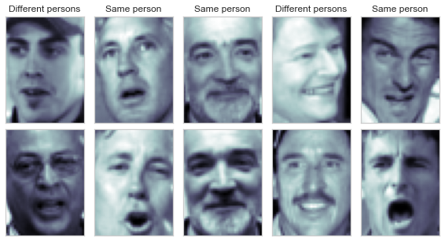

