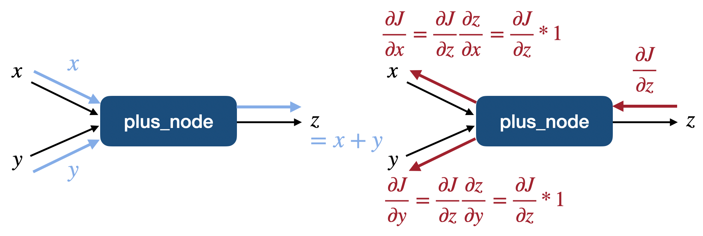
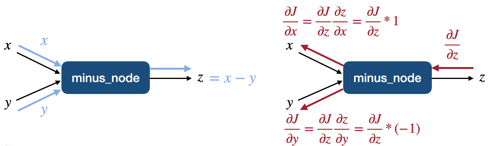
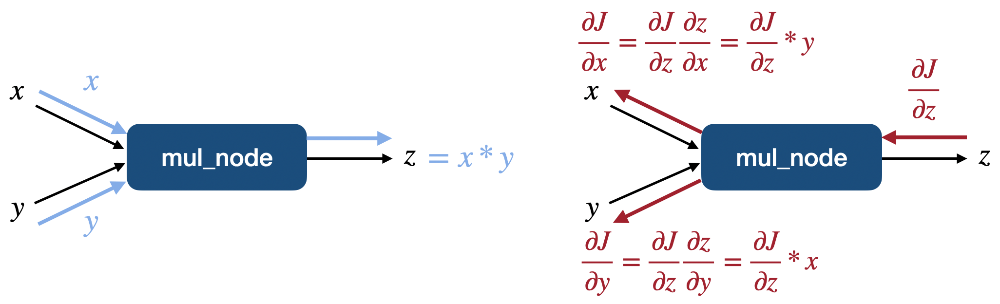
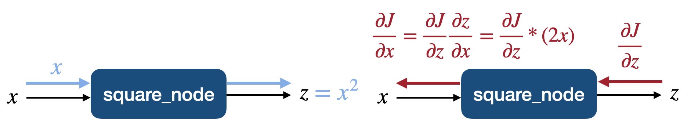
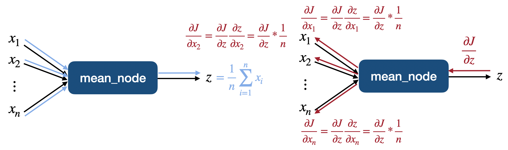

# Chapter.3 Single-variate Linear Regression without Bias Term

## Programming Assignment.3-04 Basic Building Nodes

PA 3-04에서는 forward/backward propagation을 이해하고, deep learning network를 구성하기 위한 기본 단위인 basic building node를 구현합니다.

이를 위해 구현되는 node는 총 5개로 다음과 같이 5개의 Step을 통해 구현합니다.  
plus node는 먼저 예시로 제공하고 나머지 4개는 실습과제로 제공합니다.
<ul>
    <li> Step.1 Plus Node </li>
    <li> Step.2 Minus Node </li>
    <li> Step.3 Multiply Node </li>
    <li> Step.4 Square Node </li>
    <li> Step.5 Mean Node </li>
</ul>


```python
import numpy as np
```

***
## Step.1 Plus Node

다음 그림의 plus node를 구현합니다.  



```python
class plus_node:
    def __init__(self):
        self._x, self._y = None, None
        self._z = None
        
    def forward(self, x, y):
        self._x, self._y = x, y
        self._z = self._x + self._y
        return self._z
    
    def backward(self, dz):
        return dz, dz
```

위 구현된 plus_node가 잘 작동하는지 확인하기 위해 다음의 cell을 실행시켜봅니다.


```python
test_x, test_y = 2, 3
test_dz = 2

plus_test = plus_node()

z = plus_test.forward(test_x, test_y)
dz = plus_test.backward(test_dz)

print("z:", z)
print("dz:", dz)
```

    z: 5
    dz: (2, 2)


**Expected Output**  
z: 5  
dz: (2, 2)

***
## Step.2 Minus Node

**Programming**  
다음의 연산을 진행하는 minus_node를 구현하세요.




```python
class minus_node:
    def __init__(self):
        ##### Start Your Code(Initializer) #####
        self.x, self.y = None,None
        self.z = None
        ##### End Your Code(Initializer) #####
        
    def forward(self, x, y):
        ##### Start Your Code(Forward Propagation) #####
        self.x, self.y = x,y
        self.z = self.x-self.y
        return self.z
        ##### End Your Code(Forward Propagation) #####
    
    def backward(self, dz):
        ##### Start Your Code(Backpropagation) #####
        return dz, -1*dz
        ##### End Your Code(Backpropagation) #####
```

위 구현된 minus_node가 잘 작동하는지 확인하기 위해 다음의 cell을 실행시켜봅니다.


```python
test_x, test_y = 2, 3
test_dz = 2

minus_test = minus_node()

z = minus_test.forward(test_x, test_y)
dz = minus_test.backward(test_dz)

print("z:", z)
print("dz:", dz)
```

    z: -1
    dz: (2, -2)


**Expected Output**  
z: -1  
dz: (2, -2)

***
## Step.3 Multiply Node

**Programming**  
다음의 연산을 진행하는 mul_node를 구현하세요.




```python
class mul_node:
    def __init__(self):
        ##### Start Your Code(Initializer) #####
        self.x,self.y = None,None
        self.z = None
        ##### End Your Code(Initializer) #####
    
    def forward(self, x, y):
        ##### Start Your Code(Forward Propagation) #####
        self.x, self.y = x,y
        self.z = self.x*self.y
        return self.z
        ##### End Your Code(Forward Propagation) #####
    
    def backward(self, dz):
        ##### Start Your Code(Backpropagation) #####
        return self.y*dz, self.x*dz
        ##### End Your Code(Backpropagation) #####
```

위 구현된 mul_node가 잘 작동하는지 확인하기 위해 다음의 cell을 실행시켜봅니다.


```python
test_x, test_y = 2, 3
test_dz = 2

mul_test = mul_node()

z = mul_test.forward(test_x, test_y)
dz = mul_test.backward(test_dz)

print("z:", z)
print("dz:", dz)
```

    z: 6
    dz: (6, 4)


**Expected Output**  
z: 6  
dz: (6, 4)

***
## Step.4 Square Node

**Programming**  
다음의 연산을 진행하는 square_node를 구현하세요.




```python
class square_node:
    def __init__(self):
        ##### Start Your Code(Initializer) #####
        self.x = None
        self.z = None
        ##### End Your Code(Initializer) #####
    
    def forward(self, x):
        ##### Start Your Code(Forward Propagation) #####
        self.x = x
        self.z = self.x*self.x
        return self.z
        ##### End Your Code(Forward Propagation) #####
    
    def backward(self, dz):
        ##### Start Your Code(Backpropagation) #####
        return 2*self.x*dz
        ##### End Your Code(Backpropagation) #####
    
```

위 구현된 square_node가 잘 작동하는지 확인하기 위해 다음의 cell을 실행시켜봅니다.


```python
test_x = 3
test_dz = 2

square_test = square_node()

z = square_test.forward(test_x)
dz = square_test.backward(test_dz)

print("z:", z)
print("dz:", dz)
```

    z: 9
    dz: 12


**Expected Output**  
z: 9  
dz: 12

***
## Step.5 Mean Node

**Programming**  
다음의 연산을 진행하는 mean_node를 구현하세요.




```python
class mean_node:
    def __init__(self):
        ##### Start Your Code(Initializer) #####
        self.x = None
        self.z = None
        ##### End Your Code(Initializer) #####
    
    def forward(self, x):
        ##### Start Your Code(Forward Propagation) #####
        self.x = x
        self.z = np.mean(self.x)
        return self.z
        ##### End Your Code(Forward Propagation) #####
    
    def backward(self, dz):
        ##### Start Your Code(Backpropagation) #####
        return np.ones_like(self.x)*(1/len(self.x))*dz
        ##### End Your Code(Backpropagation) #####
```

위 구현된 mean_node가 잘 작동하는지 확인하기 위해 다음의 cell을 실행시켜봅니다.


```python
test_x = np.array([1, 2, 3, 4, 5])
test_dz = 2

mean_test = mean_node()

z = mean_test.forward(test_x)
dz = mean_test.backward(test_dz)

print("z:", z)
print("dz:", dz)
```

    z: 3.0
    dz: [0.4 0.4 0.4 0.4 0.4]


**Expected Output**  
z: 3.0  
dz: [0.4 0.4 0.4 0.4 0.4]

### 보충실습: sys.path 추가

Python는 특정 module을 import할 때 프로젝트 관련 directory에 해당 module이 없으면 system path에서 module을 찾습니다.

위의 basic building node들은 basic_nodes.py 안에 구현되며 uilts directory안에 만들어질 것이기 때문에  
이 directory를 system path에 추가해줍니다.

먼저 directory를 찾아가기 위해 os library를 import해주며  
system path에 path를 추가하기 위해 sys library를 import 해줍니다.

그리고 sys.path에 utils directory가 없으면 새로 추가해줍니다.  
이는 sys.path에 중복해서 추가하는 것을 방지하기 위함입니다.

다음 코드는 상위폴더로 이동하여 utils package를 찾고, 이를 sys.path에 추가하는 코드입니다.  
그리고 추가된 sys.path를 출력합니다.  
(단, 경로는 사용자에 따라 다를 수 있습니다.)

이 코드가 실행된 뒤에는 마치 built-in package를 import 할 때와 같이 basic_nodes를 import 할 수 있습니다.  
따라서 이 basic_nodes를 import하고 그 안에 들어있는 plus_node()를 instantiation 해봅니다.


```python
import os
import sys
utils_path = os.path.dirname(os.path.abspath(__name__)) + '/../utils/'
if utils_path not in sys.path:    
    sys.path.append(utils_path)
print(os.sys.path[-1], '\n')
```

    /Users/kimjeongseob/Desktop/딥러닝/3. 수학적 딥러닝/답안/The-Principles-of-Deep-Learning1-Artificial-Neurons-master/CH_03 PA Single-variate Linear Regression without Bias Term/../utils/ 
    


```python
import basic_nodes as nodes

plus_test = nodes.plus_node()
print(plus_test)
```

    <basic_nodes.plus_node object at 0x7fd31664c790>

