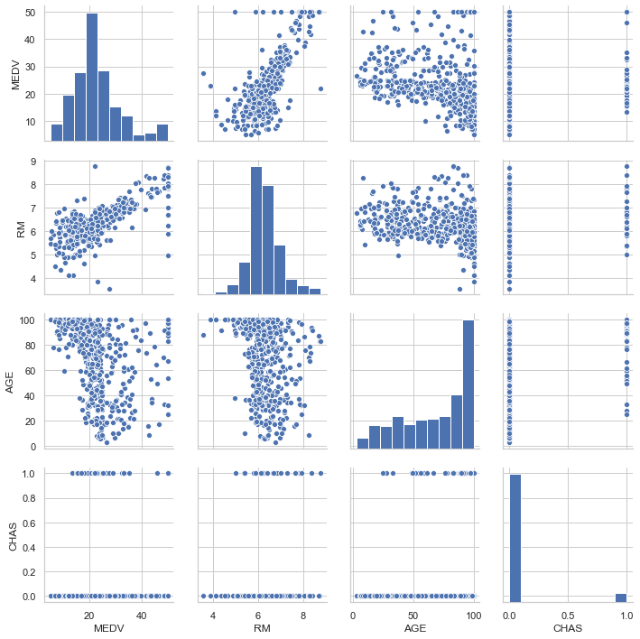
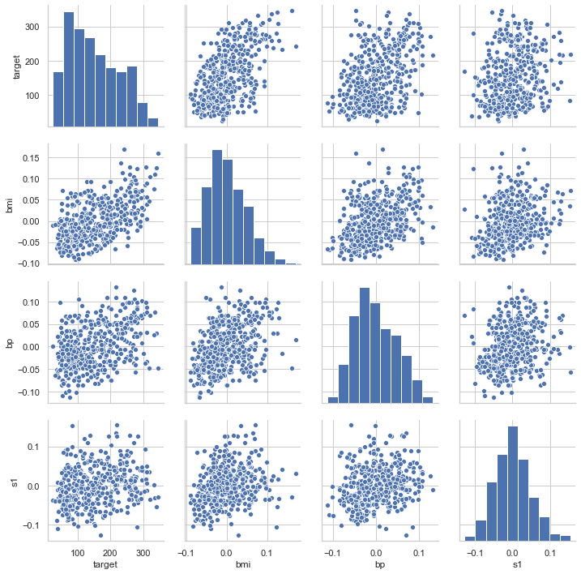
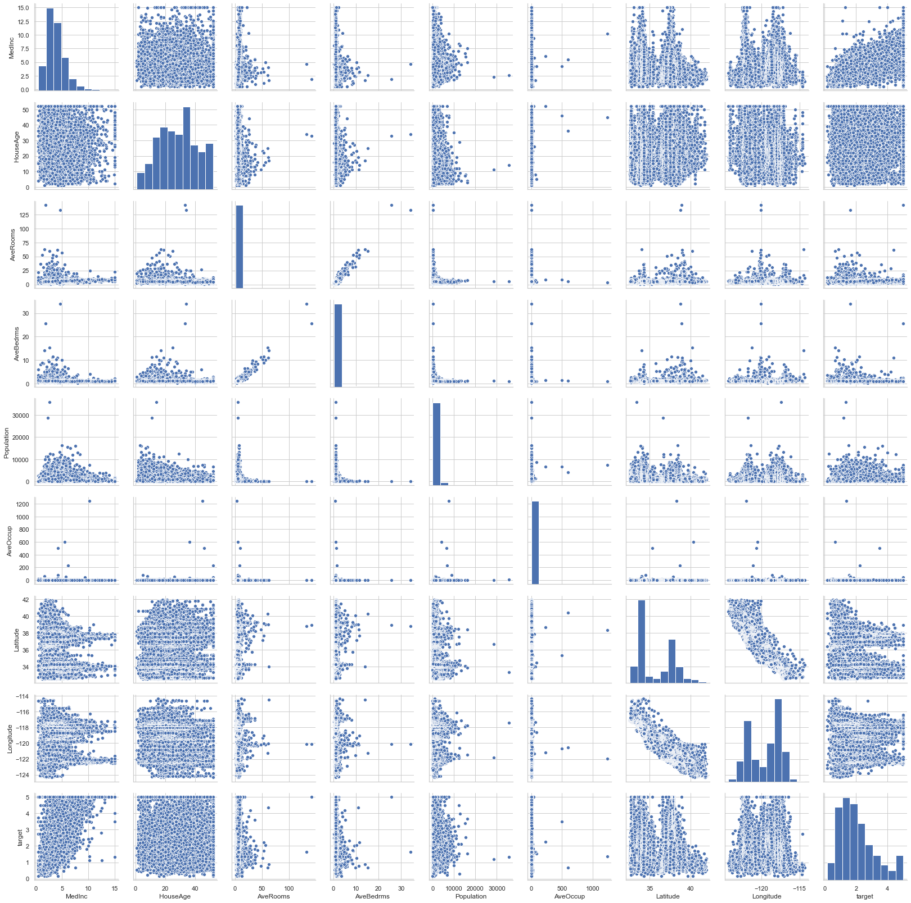
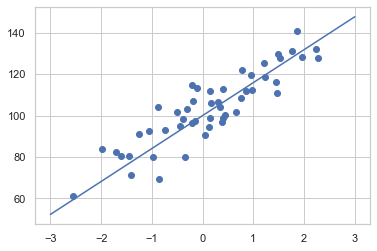
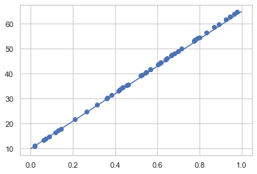
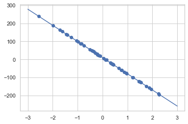

# 04.01 회귀분석 예제

    - 보스턴 집값 데이터
    - 당뇨병 진행도 데이터
    - 캘리포니아 집값 데이터
    - 가상 데이터 : make_regression

### 1) 보스턴 집값 예측


```python
from sklearn.datasets import load_boston

boston = load_boston()
dir(boston)
```


    ['DESCR', 'data', 'feature_names', 'filename', 'target']


```python
# 독립변수, 종속변수 행렬 생성

dfx = pd.DataFrame(boston.data, columns = boston.feature_names)
dfy = pd.DataFrame(boston.target, columns = ['MEDV'])

# 독립변수, 종속변수 프레임을 하나로 결합 -> 열방향으로 결합 (axis=1)

df = pd.concat([dfx,dfy],axis=1)
df
```


<div>
<style scoped>
    .dataframe tbody tr th:only-of-type {
        vertical-align: middle;
    }

    .dataframe tbody tr th {
        vertical-align: top;
    }

    .dataframe thead th {
        text-align: right;
    }
</style>
<table border="1" class="dataframe">
  <thead>
    <tr style="text-align: right;">
      <th></th>
      <th>CRIM</th>
      <th>ZN</th>
      <th>INDUS</th>
      <th>CHAS</th>
      <th>NOX</th>
      <th>RM</th>
      <th>AGE</th>
      <th>DIS</th>
      <th>RAD</th>
      <th>TAX</th>
      <th>PTRATIO</th>
      <th>B</th>
      <th>LSTAT</th>
      <th>MEDV</th>
    </tr>
  </thead>
  <tbody>
    <tr>
      <th>0</th>
      <td>0.00632</td>
      <td>18.0</td>
      <td>2.31</td>
      <td>0.0</td>
      <td>0.538</td>
      <td>6.575</td>
      <td>65.2</td>
      <td>4.0900</td>
      <td>1.0</td>
      <td>296.0</td>
      <td>15.3</td>
      <td>396.90</td>
      <td>4.98</td>
      <td>24.0</td>
    </tr>
    <tr>
      <th>1</th>
      <td>0.02731</td>
      <td>0.0</td>
      <td>7.07</td>
      <td>0.0</td>
      <td>0.469</td>
      <td>6.421</td>
      <td>78.9</td>
      <td>4.9671</td>
      <td>2.0</td>
      <td>242.0</td>
      <td>17.8</td>
      <td>396.90</td>
      <td>9.14</td>
      <td>21.6</td>
    </tr>
    <tr>
      <th>2</th>
      <td>0.02729</td>
      <td>0.0</td>
      <td>7.07</td>
      <td>0.0</td>
      <td>0.469</td>
      <td>7.185</td>
      <td>61.1</td>
      <td>4.9671</td>
      <td>2.0</td>
      <td>242.0</td>
      <td>17.8</td>
      <td>392.83</td>
      <td>4.03</td>
      <td>34.7</td>
    </tr>
    <tr>
      <th>3</th>
      <td>0.03237</td>
      <td>0.0</td>
      <td>2.18</td>
      <td>0.0</td>
      <td>0.458</td>
      <td>6.998</td>
      <td>45.8</td>
      <td>6.0622</td>
      <td>3.0</td>
      <td>222.0</td>
      <td>18.7</td>
      <td>394.63</td>
      <td>2.94</td>
      <td>33.4</td>
    </tr>
    <tr>
      <th>4</th>
      <td>0.06905</td>
      <td>0.0</td>
      <td>2.18</td>
      <td>0.0</td>
      <td>0.458</td>
      <td>7.147</td>
      <td>54.2</td>
      <td>6.0622</td>
      <td>3.0</td>
      <td>222.0</td>
      <td>18.7</td>
      <td>396.90</td>
      <td>5.33</td>
      <td>36.2</td>
    </tr>
    <tr>
      <th>...</th>
      <td>...</td>
      <td>...</td>
      <td>...</td>
      <td>...</td>
      <td>...</td>
      <td>...</td>
      <td>...</td>
      <td>...</td>
      <td>...</td>
      <td>...</td>
      <td>...</td>
      <td>...</td>
      <td>...</td>
      <td>...</td>
    </tr>
    <tr>
      <th>501</th>
      <td>0.06263</td>
      <td>0.0</td>
      <td>11.93</td>
      <td>0.0</td>
      <td>0.573</td>
      <td>6.593</td>
      <td>69.1</td>
      <td>2.4786</td>
      <td>1.0</td>
      <td>273.0</td>
      <td>21.0</td>
      <td>391.99</td>
      <td>9.67</td>
      <td>22.4</td>
    </tr>
    <tr>
      <th>502</th>
      <td>0.04527</td>
      <td>0.0</td>
      <td>11.93</td>
      <td>0.0</td>
      <td>0.573</td>
      <td>6.120</td>
      <td>76.7</td>
      <td>2.2875</td>
      <td>1.0</td>
      <td>273.0</td>
      <td>21.0</td>
      <td>396.90</td>
      <td>9.08</td>
      <td>20.6</td>
    </tr>
    <tr>
      <th>503</th>
      <td>0.06076</td>
      <td>0.0</td>
      <td>11.93</td>
      <td>0.0</td>
      <td>0.573</td>
      <td>6.976</td>
      <td>91.0</td>
      <td>2.1675</td>
      <td>1.0</td>
      <td>273.0</td>
      <td>21.0</td>
      <td>396.90</td>
      <td>5.64</td>
      <td>23.9</td>
    </tr>
    <tr>
      <th>504</th>
      <td>0.10959</td>
      <td>0.0</td>
      <td>11.93</td>
      <td>0.0</td>
      <td>0.573</td>
      <td>6.794</td>
      <td>89.3</td>
      <td>2.3889</td>
      <td>1.0</td>
      <td>273.0</td>
      <td>21.0</td>
      <td>393.45</td>
      <td>6.48</td>
      <td>22.0</td>
    </tr>
    <tr>
      <th>505</th>
      <td>0.04741</td>
      <td>0.0</td>
      <td>11.93</td>
      <td>0.0</td>
      <td>0.573</td>
      <td>6.030</td>
      <td>80.8</td>
      <td>2.5050</td>
      <td>1.0</td>
      <td>273.0</td>
      <td>21.0</td>
      <td>396.90</td>
      <td>7.88</td>
      <td>11.9</td>
    </tr>
  </tbody>
</table>
<p>506 rows × 14 columns</p>
</div>


```python
# 종속변수, 독립변수 간 관계 1차 파악을 위해 산점도 생성

sns.pairplot(df[["MEDV", "RM", "AGE", "CHAS"]])

# [산점도를 통한 발견]
# 1. 종속변수와 독립변수(RM)은 선형 상관관계가 의심됨을 확인
# 2. chas가 1이면 rm값이 보통 높게 시작되는 것을 확인
```


    <seaborn.axisgrid.PairGrid at 0x126056290>





### 2) 당뇨병 진행도 예측


```python
from sklearn.datasets import load_diabetes

diabetes = load_diabetes()
df = pd.DataFrame(diabetes.data, columns=diabetes.feature_names)
df["target"] = diabetes.target
df.tail()
```


<div>
<style scoped>
    .dataframe tbody tr th:only-of-type {
        vertical-align: middle;
    }

    .dataframe tbody tr th {
        vertical-align: top;
    }

    .dataframe thead th {
        text-align: right;
    }
</style>
<table border="1" class="dataframe">
  <thead>
    <tr style="text-align: right;">
      <th></th>
      <th>age</th>
      <th>sex</th>
      <th>bmi</th>
      <th>bp</th>
      <th>s1</th>
      <th>s2</th>
      <th>s3</th>
      <th>s4</th>
      <th>s5</th>
      <th>s6</th>
      <th>target</th>
    </tr>
  </thead>
  <tbody>
    <tr>
      <th>437</th>
      <td>0.041708</td>
      <td>0.050680</td>
      <td>0.019662</td>
      <td>0.059744</td>
      <td>-0.005697</td>
      <td>-0.002566</td>
      <td>-0.028674</td>
      <td>-0.002592</td>
      <td>0.031193</td>
      <td>0.007207</td>
      <td>178.0</td>
    </tr>
    <tr>
      <th>438</th>
      <td>-0.005515</td>
      <td>0.050680</td>
      <td>-0.015906</td>
      <td>-0.067642</td>
      <td>0.049341</td>
      <td>0.079165</td>
      <td>-0.028674</td>
      <td>0.034309</td>
      <td>-0.018118</td>
      <td>0.044485</td>
      <td>104.0</td>
    </tr>
    <tr>
      <th>439</th>
      <td>0.041708</td>
      <td>0.050680</td>
      <td>-0.015906</td>
      <td>0.017282</td>
      <td>-0.037344</td>
      <td>-0.013840</td>
      <td>-0.024993</td>
      <td>-0.011080</td>
      <td>-0.046879</td>
      <td>0.015491</td>
      <td>132.0</td>
    </tr>
    <tr>
      <th>440</th>
      <td>-0.045472</td>
      <td>-0.044642</td>
      <td>0.039062</td>
      <td>0.001215</td>
      <td>0.016318</td>
      <td>0.015283</td>
      <td>-0.028674</td>
      <td>0.026560</td>
      <td>0.044528</td>
      <td>-0.025930</td>
      <td>220.0</td>
    </tr>
    <tr>
      <th>441</th>
      <td>-0.045472</td>
      <td>-0.044642</td>
      <td>-0.073030</td>
      <td>-0.081414</td>
      <td>0.083740</td>
      <td>0.027809</td>
      <td>0.173816</td>
      <td>-0.039493</td>
      <td>-0.004220</td>
      <td>0.003064</td>
      <td>57.0</td>
    </tr>
  </tbody>
</table>
</div>


```python
sns.pairplot(df[["target", "bmi", "bp", "s1"]])

# [산점도를 통한 발견]
# target(종속변수)와 독립변수(bmi, bp)가 선형상관관계임을 확인
# 독립변수(bmi,bp)간 선형상관관계 확인 ===>>> 다중공선성!!
```


    <seaborn.axisgrid.PairGrid at 0x127611f50>





### 3) 연습문제 - 캘리포니아 주택 데이터


```python
from sklearn.datasets import fetch_california_housing

house = fetch_california_housing()
df_h = pd.DataFrame(house.data, columns=house.feature_names)
df_h['target'] = house.target
df_h
```


<div>
<style scoped>
    .dataframe tbody tr th:only-of-type {
        vertical-align: middle;
    }

    .dataframe tbody tr th {
        vertical-align: top;
    }

    .dataframe thead th {
        text-align: right;
    }
</style>
<table border="1" class="dataframe">
  <thead>
    <tr style="text-align: right;">
      <th></th>
      <th>MedInc</th>
      <th>HouseAge</th>
      <th>AveRooms</th>
      <th>AveBedrms</th>
      <th>Population</th>
      <th>AveOccup</th>
      <th>Latitude</th>
      <th>Longitude</th>
      <th>target</th>
    </tr>
  </thead>
  <tbody>
    <tr>
      <th>0</th>
      <td>8.3252</td>
      <td>41.0</td>
      <td>6.984127</td>
      <td>1.023810</td>
      <td>322.0</td>
      <td>2.555556</td>
      <td>37.88</td>
      <td>-122.23</td>
      <td>4.526</td>
    </tr>
    <tr>
      <th>1</th>
      <td>8.3014</td>
      <td>21.0</td>
      <td>6.238137</td>
      <td>0.971880</td>
      <td>2401.0</td>
      <td>2.109842</td>
      <td>37.86</td>
      <td>-122.22</td>
      <td>3.585</td>
    </tr>
    <tr>
      <th>2</th>
      <td>7.2574</td>
      <td>52.0</td>
      <td>8.288136</td>
      <td>1.073446</td>
      <td>496.0</td>
      <td>2.802260</td>
      <td>37.85</td>
      <td>-122.24</td>
      <td>3.521</td>
    </tr>
    <tr>
      <th>3</th>
      <td>5.6431</td>
      <td>52.0</td>
      <td>5.817352</td>
      <td>1.073059</td>
      <td>558.0</td>
      <td>2.547945</td>
      <td>37.85</td>
      <td>-122.25</td>
      <td>3.413</td>
    </tr>
    <tr>
      <th>4</th>
      <td>3.8462</td>
      <td>52.0</td>
      <td>6.281853</td>
      <td>1.081081</td>
      <td>565.0</td>
      <td>2.181467</td>
      <td>37.85</td>
      <td>-122.25</td>
      <td>3.422</td>
    </tr>
    <tr>
      <th>...</th>
      <td>...</td>
      <td>...</td>
      <td>...</td>
      <td>...</td>
      <td>...</td>
      <td>...</td>
      <td>...</td>
      <td>...</td>
      <td>...</td>
    </tr>
    <tr>
      <th>20635</th>
      <td>1.5603</td>
      <td>25.0</td>
      <td>5.045455</td>
      <td>1.133333</td>
      <td>845.0</td>
      <td>2.560606</td>
      <td>39.48</td>
      <td>-121.09</td>
      <td>0.781</td>
    </tr>
    <tr>
      <th>20636</th>
      <td>2.5568</td>
      <td>18.0</td>
      <td>6.114035</td>
      <td>1.315789</td>
      <td>356.0</td>
      <td>3.122807</td>
      <td>39.49</td>
      <td>-121.21</td>
      <td>0.771</td>
    </tr>
    <tr>
      <th>20637</th>
      <td>1.7000</td>
      <td>17.0</td>
      <td>5.205543</td>
      <td>1.120092</td>
      <td>1007.0</td>
      <td>2.325635</td>
      <td>39.43</td>
      <td>-121.22</td>
      <td>0.923</td>
    </tr>
    <tr>
      <th>20638</th>
      <td>1.8672</td>
      <td>18.0</td>
      <td>5.329513</td>
      <td>1.171920</td>
      <td>741.0</td>
      <td>2.123209</td>
      <td>39.43</td>
      <td>-121.32</td>
      <td>0.847</td>
    </tr>
    <tr>
      <th>20639</th>
      <td>2.3886</td>
      <td>16.0</td>
      <td>5.254717</td>
      <td>1.162264</td>
      <td>1387.0</td>
      <td>2.616981</td>
      <td>39.37</td>
      <td>-121.24</td>
      <td>0.894</td>
    </tr>
  </tbody>
</table>
<p>20640 rows × 9 columns</p>
</div>


```python
sns.pairplot(df_h)
```


    <seaborn.axisgrid.PairGrid at 0x1272e94d0>





```python
# [산점도를 통한 발견]
# 1. target과 선형상관관계가 의심되는 독립변수는 MedInc 뿐
# 2. Averooms - Avebedrooms 간 상관관계. 즉, 독립변수 간 상관관계로 다중공선성 의심
# 3. Latitude - Longitude 간 상관관계.
```

### 4) 가상 데이터 _ make_regression


```python
from sklearn.datasets import make_regression

X, y, w = make_regression(
    n_samples=50, n_features=1, bias=100, noise=10, coef=True, random_state=0
)

xx = np.linspace(-3,3,100)
line = w*xx + 100
plt.scatter(X,y)
plt.plot(xx,line)
```


    [<matplotlib.lines.Line2D at 0x12ae0fed0>]





### 5) make_regression 함수 구현

```


make_regression과 같은 기능을 하는 함수 make_regression2를 만들어라. 
단 make_regression2는 coef=True, n_features=1 라고 가정한다. 

즉 항상 가중치 계수를 반환하고 1차원 독립변수만 생성할 수 있다. 
따라서 make_regression2는 다음과 같은 인수만 가진다.


n_samples
bias
noise
random_state


따라서 함수 사용법은 다음과 같아야 한다.
X, y, w = make_regression2(n_samples, bias, noise, random_state)
```


```python
def make_reg2(n_samples, bias, noise, random_state):
    
    # 1. 독립변수 데이터 행렬 X를 생성
    np.random.seed(random_state)
    X = np.random.rand(n_samples,1)
    
    # 2. 종속변수와 독립변수를 연결하는 가중치 벡터 w를 무작위로 만듬
    np.random.seed(random_state)
    w = 100*np.random.rand(1)
    
    # 3. X와 w를 내적 -> y절편 b값을 더해 독립변수와 완전 선형인 벡터 y_0를 만듬
    y_0 = X*w + bias
    
    # 4. 기댓값이 0이고, 표준편차가 noise인 정규분포를 이용하여 잡음 epsilon을 만듬
    np.random.seed(random_state)
    e = np.random.rand(n_samples).reshape(-1,1)
    
    # 5. 독립변수와 완전선형인 종속변수 벡터 y_0에 잡음 epsilon을 더해 종속변수 데이터 y를 만듬
    y = y_0 + e
    
    xx = np.linspace(0,1,100)
    line = w*xx + bias
    plt.scatter(X,y)
    plt.plot(xx,line)
    
    return

make_reg2(50,10,1,0)
```





```python
# 보다 나은 코드
# np.random.normal(size= ,scale= )을 활용해 난수 생성 -> 범위가 -3에서 3사이에 들어옴

def make_regression2(n_samples, bias, noise, random_state):
    
    np.random.seed(random_state)
    X = np.random.normal(size=n_samples)
    w = 100*np.random.normal(size=1)[0]
    y0 = X*w + bias
    e = np.random.normal(scale=noise, size=n_samples)
    y = y0 + e
    
    xx = np.linspace(-3,3,100)
    line = w*xx + bias
    plt.scatter(X,y)
    plt.plot(xx,line)
    
    return
    
make_regression2(50,10,1,0)
```




