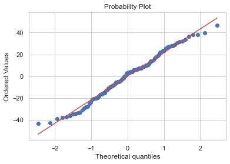
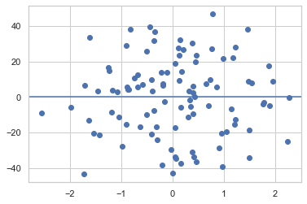

# 05.01 확률론적 선형회귀 모형

## 1. 확률론적 선형회귀 모형
       
    - 잔차의 정규성 가정
    - 잔차의 기대값 = 0


```python
from sklearn.datasets import make_regression

X0, y, w = make_regression(n_samples=100, n_features=1, noise=20,
                              coef=True, random_state=0)

dfX0 = pd.DataFrame(X0, columns=["X1"])
dfX = sm.add_constant(dfX0)
dfy = pd.DataFrame(y, columns=["y"])

model = sm.OLS(dfy, dfX)
result = model.fit()
```


```python
# 잔차의 Q_Q 플롯 결과, 정규성을 보임

sp.stats.probplot(result.resid, plot=plt)
plt.show()
```





```python
# 정규성 검정 결과
# 귀무가설 채택, H0 : 잔차는 정규분포를 따른다.

test = sm.stats.omni_normtest(result.resid)
print(test)
```

    NormaltestResult(statistic=3.5225056601675333, pvalue=0.17182945580489326)


```python
# 정규성 검정 결과
# pvalue = 0.35, 귀무가설 채택

test = sm.stats.jarque_bera(result.resid)
print(test)
```

    (2.0585394799860923, 0.35726776369010976, -0.07259247821264342, 2.3122712717761096)


```python
# Exogeneity 가정 : 잔차의 기대값은 x에 관계없이 항상 0
# 잔차는 독립변수 x에 관계없이 일정(한 분포

plt.plot(X0,result.resid,'o')
plt.axhline(y=0)
print("잔차의 평균 : {} ".format(result.resid.mean()))
```

    잔차의 평균 : 7.105427357601002e-16 





## 2. 단일 계수 t-검정

### $H0 : w_{i} = 0$


```python
print(result.summary())
```

                                OLS Regression Results                            
    ==============================================================================
    Dep. Variable:                      y   R-squared:                       0.803
    Model:                            OLS   Adj. R-squared:                  0.801
    Method:                 Least Squares   F-statistic:                     400.3
    Date:                Mon, 18 May 2020   Prob (F-statistic):           2.21e-36
    Time:                        15:44:53   Log-Likelihood:                -448.09
    No. Observations:                 100   AIC:                             900.2
    Df Residuals:                      98   BIC:                             905.4
    Df Model:                           1                                         
    Covariance Type:            nonrobust                                         
    ==============================================================================
                     coef    std err          t      P>|t|      [0.025      0.975]
    ------------------------------------------------------------------------------
    const         -1.6284      2.163     -0.753      0.453      -5.920       2.663
    X1            42.8534      2.142     20.008      0.000      38.603      47.104
    ==============================================================================
    Omnibus:                        3.523   Durbin-Watson:                   1.984
    Prob(Omnibus):                  0.172   Jarque-Bera (JB):                2.059
    Skew:                          -0.073   Prob(JB):                        0.357
    Kurtosis:                       2.312   Cond. No.                         1.06
    ==============================================================================
    
    Warnings:
    [1] Standard Errors assume that the covariance matrix of the errors is correctly specified.


### $H0 : w_{i} = 40$

        - 분석 결과, w1 = 40 이라 해도 문제가 없음을 알 수 있음


```python
print(result.t_test("X1 = 40"))
```

                                 Test for Constraints                             
    ==============================================================================
                     coef    std err          t      P>|t|      [0.025      0.975]
    ------------------------------------------------------------------------------
    c0            42.8534      2.142      1.332      0.186      38.603      47.104
    ==============================================================================

