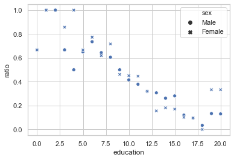

# 06.01 분류, 회귀  :  로지스틱 회귀분석
    - 회귀분석 외 분류문제도 해결 가능


```python
# 시그모이드 함수 = 로지스틱, 하이퍼볼릭 탄젠트, 오차함수

xx = np.linspace(-5, 5, 1000)
plt.plot(xx, 1/(1+np.exp(-xx)), 'r-', label="로지스틱함수")
plt.plot(xx, sp.special.erf(0.5*np.sqrt(np.pi)*xx), 'g:', label="오차함수")
plt.plot(xx, np.tanh(xx), 'b--', label="하이퍼볼릭탄젠트함수")
plt.ylim([-1.1, 1.1])
plt.legend(loc=2)
plt.xlabel("x")
plt.show()
```


# 1. statsmodels 패키지를 통한 로지스틱회귀(분류)

    - OLS 클래스 대신, Logit 클래스 사용


```python
# 가상데이터 생성 -> 데이터의 분포 확인 (2개의 클래스로 각 데이터 분포됨을 확인)

from sklearn.datasets import make_classification

X0, y = make_classification(n_features=1, n_redundant=0, n_informative=1,
                            n_clusters_per_class=1, random_state=4)

plt.scatter(X0, y, c=y, s=100, edgecolor="k", linewidth=2)
sns.distplot(X0[y == 0, :], label="y = 0", hist=False)
sns.distplot(X0[y == 1, :], label="y = 1", hist=False)
plt.ylim(-0.2, 1.2)
plt.show()
```


```python
# OLS클래스를 활용한 로지스틱회귀분석 실시
# 시그모이드 함수의 Z. 즉 Z = w.Tx 의 w 값 추정됨. w의 상수항은 0으로 봐도 무방함을 알 수 있음.
# 이를 통해, 판별식(z)를 알 수 있다. Z=0일 때 판별경계선이 되므로, 이 때의 x값이 경계선을 이룰 것.(선형)

X = sm.add_constant(X0)
logit_mod = sm.Logit(y, X)
logit_res = logit_mod.fit(disp=0)
print(logit_res.summary())
```

                               Logit Regression Results                           
    ==============================================================================
    Dep. Variable:                      y   No. Observations:                  100
    Model:                          Logit   Df Residuals:                       98
    Method:                           MLE   Df Model:                            1
    Date:                Sat, 23 May 2020   Pseudo R-squ.:                  0.7679
    Time:                        16:00:51   Log-Likelihood:                -16.084
    converged:                       True   LL-Null:                       -69.295
    Covariance Type:            nonrobust   LLR p-value:                 5.963e-25
    ==============================================================================
                     coef    std err          z      P>|z|      [0.025      0.975]
    ------------------------------------------------------------------------------
    const          0.2515      0.477      0.527      0.598      -0.683       1.186
    x1             4.2382      0.902      4.699      0.000       2.470       6.006
    ==============================================================================


```python
# 로지스틱 회귀 결과.

xx = np.linspace(-3, 3, 100)
mu = logit_res.predict(sm.add_constant(xx))
plt.plot(xx, mu, lw=3)
plt.scatter(X0, y, c=y, s=100, edgecolor="k", lw=2)
plt.scatter(X0, logit_res.predict(X), label=r"$\hat{y}$", marker='s', c=y,
            s=100, edgecolor="k", lw=1)
plt.xlim(-3, 3)
plt.xlabel("x")
plt.ylabel(r"$\mu$")
plt.title(r"$\hat{y} = \mu(x)$")
plt.legend()
plt.show()
```


# 2. sk-learn 패키지를 통한 로지스틱회귀 (분류)

    - logistic_regression() 클래스 제공


```python
from sklearn.linear_model import LogisticRegression

model_sk = LogisticRegression().fit(X0, y)

xx = np.linspace(-3, 3, 100)
mu = 1.0/(1 + np.exp(-model_sk.coef_[0][0]*xx - model_sk.intercept_[0]))
plt.plot(xx, mu)
plt.scatter(X0, y, c=y, s=100, edgecolor="k", lw=2)
plt.scatter(X0, model_sk.predict(X0), label=r"$\hat{y}$", marker='s', c=y,
            s=100, edgecolor="k", lw=1, alpha=0.5)
plt.xlim(-3, 3)
plt.xlabel("x")
plt.ylabel(r"$\mu$")
plt.title(r"$\hat{y}$ = sign $\mu(x)$")
plt.legend()
plt.show()
```


### 붓꽃 분류 예제 1 : 단변수 로지스틱 회귀

```
1. 붓꽃 분류문제에서 클래스가 세토사와 베르시칼라 데이터만 사용하고 (setosa=0, versicolor=1) 독립변수로는 꽃받침 길이(Sepal Length)와 상수항만 사용하여 StatsModels 패키지의 로지스틱 회귀모형으로 결과를 예측하고 보고서를 출력한다. 이 보고서에서 어떤 값이 세토사와 베르시칼라를 구분하는 기준값(threshold)으로 사용되고 있는가?
```


```python
import statsmodels.api as sm

# 1. 데이터 호출

from sklearn.datasets import load_iris
iris = load_iris()
```


```python
# 2. 세토사(0), 베르시컬러(1) 데이터만 추출

dfx = pd.DataFrame(iris.data, columns = iris.feature_names)
dfx['species'] = iris.target
data = dfx.copy()
data = data[data['species'] != 2]
data
```


<div>
<style scoped>
    .dataframe tbody tr th:only-of-type {
        vertical-align: middle;
    }

    .dataframe tbody tr th {
        vertical-align: top;
    }

    .dataframe thead th {
        text-align: right;
    }
</style>
<table border="1" class="dataframe">
  <thead>
    <tr style="text-align: right;">
      <th></th>
      <th>sepal length (cm)</th>
      <th>sepal width (cm)</th>
      <th>petal length (cm)</th>
      <th>petal width (cm)</th>
      <th>species</th>
    </tr>
  </thead>
  <tbody>
    <tr>
      <th>0</th>
      <td>5.1</td>
      <td>3.5</td>
      <td>1.4</td>
      <td>0.2</td>
      <td>0</td>
    </tr>
    <tr>
      <th>1</th>
      <td>4.9</td>
      <td>3.0</td>
      <td>1.4</td>
      <td>0.2</td>
      <td>0</td>
    </tr>
    <tr>
      <th>2</th>
      <td>4.7</td>
      <td>3.2</td>
      <td>1.3</td>
      <td>0.2</td>
      <td>0</td>
    </tr>
    <tr>
      <th>3</th>
      <td>4.6</td>
      <td>3.1</td>
      <td>1.5</td>
      <td>0.2</td>
      <td>0</td>
    </tr>
    <tr>
      <th>4</th>
      <td>5.0</td>
      <td>3.6</td>
      <td>1.4</td>
      <td>0.2</td>
      <td>0</td>
    </tr>
    <tr>
      <th>...</th>
      <td>...</td>
      <td>...</td>
      <td>...</td>
      <td>...</td>
      <td>...</td>
    </tr>
    <tr>
      <th>95</th>
      <td>5.7</td>
      <td>3.0</td>
      <td>4.2</td>
      <td>1.2</td>
      <td>1</td>
    </tr>
    <tr>
      <th>96</th>
      <td>5.7</td>
      <td>2.9</td>
      <td>4.2</td>
      <td>1.3</td>
      <td>1</td>
    </tr>
    <tr>
      <th>97</th>
      <td>6.2</td>
      <td>2.9</td>
      <td>4.3</td>
      <td>1.3</td>
      <td>1</td>
    </tr>
    <tr>
      <th>98</th>
      <td>5.1</td>
      <td>2.5</td>
      <td>3.0</td>
      <td>1.1</td>
      <td>1</td>
    </tr>
    <tr>
      <th>99</th>
      <td>5.7</td>
      <td>2.8</td>
      <td>4.1</td>
      <td>1.3</td>
      <td>1</td>
    </tr>
  </tbody>
</table>
<p>100 rows × 5 columns</p>
</div>


```python
# 3. 독립변수 데이터 추출(sepal length (cm) / 종속변수 데이터 추출

X = data['sepal length (cm)']
Y = data['species']
```


```python
# 4. 모델 생성, 로지스틱 회귀분석

X0 = sm.add_constant(X)  # 상수항 추가 잊지말기
logit_mod = sm.Logit(Y, X0)
logit_res = logit_mod.fit(disp=0)
print(logit_res.summary())
```

                               Logit Regression Results                           
    ==============================================================================
    Dep. Variable:                species   No. Observations:                  100
    Model:                          Logit   Df Residuals:                       98
    Method:                           MLE   Df Model:                            1
    Date:                Sun, 24 May 2020   Pseudo R-squ.:                  0.5368
    Time:                        12:06:59   Log-Likelihood:                -32.106
    converged:                       True   LL-Null:                       -69.315
    Covariance Type:            nonrobust   LLR p-value:                 6.320e-18
    =====================================================================================
                            coef    std err          z      P>|z|      [0.025      0.975]
    -------------------------------------------------------------------------------------
    const               -27.8315      5.434     -5.122      0.000     -38.481     -17.182
    sepal length (cm)     5.1403      1.007      5.107      0.000       3.168       7.113
    =====================================================================================


```python
# 5. 시각화

plt.plot(np.linspace(4,7,100),logit_res.predict(sm.add_constant(np.linspace(4,7,100))))
plt.scatter(X,Y,lw=3)
plt.scatter(X,logit_res.predict(X0), label = r"$\hat{y}$",c=Y,s=100,marker='s',edgecolor='k')
plt.legend()
plt.show()
```


```python
# 6. threshold 찾기

threshold = logit_res.params[1]/logit_res.params[0]
print("threshold : {}".format(threshold))
```

    threshold : -0.18469522628498686


```
2. 위 결과를 분류결과표(confusion matrix)와 분류결과보고서(classification report)로 나타내라.
```


```python
# Confusion Matrix

from sklearn.metrics import confusion_matrix

y_true = Y
y_pred = round(logit_res.predict(X0),0)
confusion_matrix(y_true, y_pred)
```


    array([[45,  5],
           [ 6, 44]])


```python
# classifcation report

from sklearn.metrics import classification_report

print(classification_report(y_true, y_pred, target_names=['class 0', 'class 1']))
```

                  precision    recall  f1-score   support
    
         class 0       0.88      0.90      0.89        50
         class 1       0.90      0.88      0.89        50
    
        accuracy                           0.89       100
       macro avg       0.89      0.89      0.89       100
    weighted avg       0.89      0.89      0.89       100
    


```
3. 이 모형에 대해 ROC커브를 그리고 AUC를 구한다. 이 때 Scikit-Learn의 LogisticRegression을 사용하지 않고 위에서 StatsModels로 구한 모형을 사용한다.
```


```python
# ROC Curve 구현
# Roc curve : recall - fallout curvce
```


```python
# recall, fallout score
recall = 45/(45+5)
fallout = 6/(6+44)
print("recall : {}, fallout : {}".format(recall,fallout))
```

    recall : 0.9, fallout : 0.12


```python
# Roc curve
# sklearn - roc_curve 명령 사용하되, 인수로 판별함수값을 넣는 자리에 statsmodels의 판별함수값 계산 명령 사용해야함
# logistic_regression(sklearn) -> decision_function(X), logit(statsmodels) -> logit_res.fittedvalues
# fittedvalues라는 속성으로 판별함수 값 생성

from sklearn.metrics import roc_curve

fpr, tpr, thresholds = roc_curve(Y, logit_res.fittedvalues)
```


```python
plt.plot(fpr, tpr, 'o-', label="Logistic Regression")
plt.plot([0, 1], [0, 1], 'k--', label="random guess")
plt.show()
```


### 붓꽃 예제 2 : 다변수 로지스틱회귀

```
1. 붓꽃 분류문제에서 클래스가 베르시칼라(versicolor)와 버지니카(virginica) 데이터만 사용하여(versicolor=0, virginica=1) 로지스틱 회귀모형으로 결과를 예측하고 보고서를 출력한다. 독립변수는 모두 사용한다. 이 보고서에서 버지니카와 베르시칼라를 구분하는 경계면의 방정식을 찾아라.
```


```python
from sklearn.datasets import load_iris
iris = load_iris()
```


```python
# 1. versicolor, virginica 데이터 추출
# np.in1d(x,y) : 첫번째 배열에 두번째 배열의 원소가 있는지 여부의 불리언 배열 반환

idx = np.in1d(iris.target, [1,2])
X0 = iris.data[idx, :]
X = sm.add_constant(X0)
y = iris.target[idx]-1
y
```


    array([0, 0, 0, 0, 0, 0, 0, 0, 0, 0, 0, 0, 0, 0, 0, 0, 0, 0, 0, 0, 0, 0,
           0, 0, 0, 0, 0, 0, 0, 0, 0, 0, 0, 0, 0, 0, 0, 0, 0, 0, 0, 0, 0, 0,
           0, 0, 0, 0, 0, 0, 1, 1, 1, 1, 1, 1, 1, 1, 1, 1, 1, 1, 1, 1, 1, 1,
           1, 1, 1, 1, 1, 1, 1, 1, 1, 1, 1, 1, 1, 1, 1, 1, 1, 1, 1, 1, 1, 1,
           1, 1, 1, 1, 1, 1, 1, 1, 1, 1, 1, 1])


```python
# 2. 로지스틱 회귀모형 실시

logit_res = sm.Logit(Y, X).fit(disp=0)
print(logit_res.summary())
```

                               Logit Regression Results                           
    ==============================================================================
    Dep. Variable:                species   No. Observations:                  100
    Model:                          Logit   Df Residuals:                       95
    Method:                           MLE   Df Model:                            4
    Date:                Sun, 24 May 2020   Pseudo R-squ.:                  0.9142
    Time:                        13:29:32   Log-Likelihood:                -5.9493
    converged:                       True   LL-Null:                       -69.315
    Covariance Type:            nonrobust   LLR p-value:                 1.947e-26
    ==============================================================================
                     coef    std err          z      P>|z|      [0.025      0.975]
    ------------------------------------------------------------------------------
    const        -42.6378     25.708     -1.659      0.097     -93.024       7.748
    x1            -2.4652      2.394     -1.030      0.303      -7.158       2.228
    x2            -6.6809      4.480     -1.491      0.136     -15.461       2.099
    x3             9.4294      4.737      1.990      0.047       0.145      18.714
    x4            18.2861      9.743      1.877      0.061      -0.809      37.381
    ==============================================================================
    
    Possibly complete quasi-separation: A fraction 0.60 of observations can be
    perfectly predicted. This might indicate that there is complete
    quasi-separation. In this case some parameters will not be identified.


```python
# 3. 경계면 방정식 찾기

print("경계면 방정식 : '{} + {} x1 + {} x2 + {} x3 + {} x4 = 0'".format(
    round(logit_res.params[0],2),round(logit_res.params[1],2),round(logit_res.params[2],2),
    round(logit_res.params[3],2),round(logit_res.params[4],2)
))
```

    경계면 방정식 : '-42.64 + -2.47 x1 + -6.68 x2 + 9.43 x3 + 18.29 x4 = 0'


```
2. 위 결과를 분류결과표와 분류결과보고서로 나타내라.
```


```python
from sklearn.metrics import confusion_matrix

y_true = Y
y_pred = list(logit_res.predict(X))
y_pred = [round(x,0) for x in y_pred]
confusion_matrix(y_true, y_pred)
```


    array([[49,  1],
           [ 1, 49]])


```
3. 이 모형에 대해 ROC커브를 그리고 AUC를 구하라. 이 때 Scikit-Learn의 LogisticRegression을 사용하지 않고 위에서 StatsModels로 구한 모형을 사용한다.
```


```python
from sklearn.metrics import roc_curve

fpr, tpr, thresholds = roc_curve(Y, logit_res.fittedvalues)
```


```python
plt.plot(fpr, tpr, 'o-', label="Logistic Regression")
plt.plot([0, 1], [0, 1], 'k--', label="random guess")
plt.show()
```


# 3. Regression에의 로지스틱 회귀 (회귀)

- logtistic 회귀는 분류문제 뿐만 아니라 종속변수 y가 0부터 1까지 막혀있는 regression에도 적용 가능
    (종속변수 y가 0과 1사이가 아니더라도, 스케일링을 통해 종속변수y를 0과 1 사이로 줄여주면 적용 가능!)
    
$$\hat{y} = \mu(x)$$

- **Regression 답게, 추정값($\hat{y}$)은 그대로 사용된다.** (분류는 판별함수 값에 따라 이진 분류값으로 변형됨(판별함수 값 = 0.7이면 추정값은 '1'로 변형됨)


- **로지스틱 회귀를 사용해야 하는 경우**


    - 종속변수 추정($\hat{y}$)이 logitstic회귀처럼, 특정 범위 안에서 존재해야 할 때..
    
        ex) 0 < y < 100 인 y를 회귀분석 해야할 때 (예를 들면, '비율'을 추정해야 할 때)

### 예제 데이터
```
다음 데이터 1974년도에 "여성은 가정을 보살피고 국가를 운영하는 일은 남자에게 맡겨두어야 한다."라는 주장에 대한 찬성, 반대 입장을 조사한 결과

ratio : 찬성비율(성 편견을 갖는 비율)
```


```python
data_wrole = sm.datasets.get_rdataset("womensrole", package="HSAUR")
```


```python
df_wrole = data_wrole.data
df_wrole["ratio"] = df_wrole.agree / (df_wrole.agree + df_wrole.disagree)
df_wrole.head()
```


<div>
<style scoped>
    .dataframe tbody tr th:only-of-type {
        vertical-align: middle;
    }

    .dataframe tbody tr th {
        vertical-align: top;
    }

    .dataframe thead th {
        text-align: right;
    }
</style>
<table border="1" class="dataframe">
  <thead>
    <tr style="text-align: right;">
      <th></th>
      <th>education</th>
      <th>sex</th>
      <th>agree</th>
      <th>disagree</th>
      <th>ratio</th>
    </tr>
  </thead>
  <tbody>
    <tr>
      <th>0</th>
      <td>0</td>
      <td>Male</td>
      <td>4</td>
      <td>2</td>
      <td>0.666667</td>
    </tr>
    <tr>
      <th>1</th>
      <td>1</td>
      <td>Male</td>
      <td>2</td>
      <td>0</td>
      <td>1.000000</td>
    </tr>
    <tr>
      <th>2</th>
      <td>2</td>
      <td>Male</td>
      <td>4</td>
      <td>0</td>
      <td>1.000000</td>
    </tr>
    <tr>
      <th>3</th>
      <td>3</td>
      <td>Male</td>
      <td>6</td>
      <td>3</td>
      <td>0.666667</td>
    </tr>
    <tr>
      <th>4</th>
      <td>4</td>
      <td>Male</td>
      <td>5</td>
      <td>5</td>
      <td>0.500000</td>
    </tr>
  </tbody>
</table>
</div>


```python
# 교육을 많이 받을 수록 찬성비율이 낮아짐

sns.scatterplot(x="education", y="ratio", style="sex", data=df_wrole)
plt.grid(True)
plt.show()
```





```python
# 비율(ratio)을 종속변수로 로지스틱 회귀분석 실시
# 분석결과, 성별 계수가 귀무가설을 채택해도 무방하다는 결과를 확인. 즉, 성별은 찬성비율 예측에 상관관계가 없는 변수. 
# 성별 변수 => 현재 축소랭크 더미변수화 된 상태로, 계수값은 여성과의 ratio의 차이를 나타냄
# (약 -0.19 정도 낮다고 나오지만, p값으로 볼 때, 0으로 봐도 무방. 즉, 남성과 여성 간 ratio의 차이는 없다.)

model_wrole = sm.Logit.from_formula("ratio ~ education + C(sex)", df_wrole)
result_wrole = model_wrole.fit()
print(result_wrole.summary())
```

    Optimization terminated successfully.
             Current function value: 0.448292
             Iterations 6
                               Logit Regression Results                           
    ==============================================================================
    Dep. Variable:                  ratio   No. Observations:                   41
    Model:                          Logit   Df Residuals:                       38
    Method:                           MLE   Df Model:                            2
    Date:                Sun, 24 May 2020   Pseudo R-squ.:                  0.3435
    Time:                        13:53:09   Log-Likelihood:                -18.380
    converged:                       True   LL-Null:                       -27.997
    Covariance Type:            nonrobust   LLR p-value:                 6.660e-05
    ==================================================================================
                         coef    std err          z      P>|z|      [0.025      0.975]
    ----------------------------------------------------------------------------------
    Intercept          2.0442      0.889      2.299      0.022       0.302       3.787
    C(sex)[T.Male]    -0.1968      0.736     -0.267      0.789      -1.640       1.247
    education         -0.2127      0.071     -2.987      0.003      -0.352      -0.073
    ==================================================================================


```python
# education만 변수로 놓고 다시 로지스틱 회귀분석 실시
# 여전히 education은 유의미해보임

model_wrole2 = sm.Logit.from_formula("ratio ~ education", df_wrole)
result_wrole2 = model_wrole2.fit()
print(result_wrole2.summary())
```

    Optimization terminated successfully.
             Current function value: 0.449186
             Iterations 6
                               Logit Regression Results                           
    ==============================================================================
    Dep. Variable:                  ratio   No. Observations:                   41
    Model:                          Logit   Df Residuals:                       39
    Method:                           MLE   Df Model:                            1
    Date:                Sun, 24 May 2020   Pseudo R-squ.:                  0.3422
    Time:                        13:58:53   Log-Likelihood:                -18.417
    converged:                       True   LL-Null:                       -27.997
    Covariance Type:            nonrobust   LLR p-value:                 1.202e-05
    ==============================================================================
                     coef    std err          z      P>|z|      [0.025      0.975]
    ------------------------------------------------------------------------------
    Intercept      1.9345      0.781      2.478      0.013       0.405       3.464
    education     -0.2117      0.071     -2.983      0.003      -0.351      -0.073
    ==============================================================================


```python
# 성별을 제외한, 유의미해 보이는 education - ratio 간 로지스틱 회귀분석 결과 시각화
# education이 20년보다 긴 데이터가 있어도, 종속변수 값은 0 밑으로 내려가지 않음
# 로지스틱이 아닌 선형회귀라면, education이 20보다 큰 데이터의 ratio 예측값을 (-) 값으로 출력했을 것

sns.scatterplot(x="education", y="ratio", data=df_wrole)
xx = np.linspace(0, 20, 100)
df_wrole_p = pd.DataFrame({"education": xx})
plt.plot(xx, result_wrole2.predict(df_wrole_p), "r-", lw=4, label="예측")
plt.legend()
plt.show()
```


