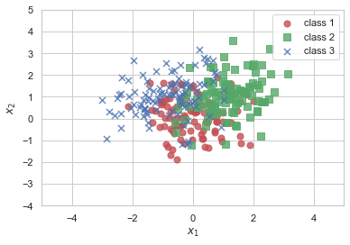
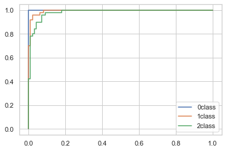

# 07.01 선형판별분석법과 이차판별분석법

    - Linear Discriminant Analysis
    - Quadratic Discriminant Analysis
    
    
```

QDA : 베이즈 정리를 활용한 조건부확률값 생성(데이터 : 다변수 정규분포 가정)
LDA : QDA + 공통된 공분산행렬 가정
Navie Bayes : LDA + 모든 데이터의 독립 가정

```

    
   

### 1. 생성모형

1) 사전확률 구하기(각 클래스별) : 보통, 각 클래스별 빈도수 비율을 구해서 사용하는 게 일반적 (최악의 경우, non-informative 활용)

2) 가능도 계산(각 클래스별) 

: 데이터의 분포 가정 -> 학습데이터의 모수 활용해 분포 완성 -> 각 클래스별 x데이터의 조건부확률값(k클래스 일 때, x데이터가 나올 확률) 계산

```
[1. QDA : 독립변수x (데이터)는 다변수 정규분포를 따름을 가정]
*판별식(경계선) : 곡선

    <코드>
    0. QDA 학습

    from sklearn.discriminant_analysis import QuadraticDiscriminantAnalysis

    qda = QuadraticDiscriminantAnalysis(store_covariance=True).fit(X, y)


    1. 모수값 구하기 (다변수 정규분포의 모수 : 평균벡터, 공분산행렬)

    qda.means_[0] : 1클래스 데이터의 평균값
    qda.means_[1] : 2클래스 데이터의 평균값
    qda.covariance_[0] : 1클래스 데이터의 공분산값
    qda.covariance_[1] : 2클래스 데이터의 공분산값


    2. 분포 지정 -> pdf생성 -> 조건부확률값 계산(클래스 별(조건부) pdf값 구하면 됨)

    rv = sp.stats.multivariate_normal(mean = qda.means_[0],cov = qda.covariance_[0])
    rv.pdf([2,-1])


[2. LDA : QDA와 동일, but 모든 공분산행렬이 같다고 가정]
*데이터갯수가 많아지면, 공분산행렬 연산량이 너무 커짐. 모든 클래스의 공분산 행렬을 동일하다 가정했을 때의 오차보다, 다르게 했을 때의 단점이 더 크다는 판단
*판별식(경계선) : 직선


QDA : 베이즈 정리를 활용한 조건부확률값 생성(데이터 : 다변수 정규분포 가정)
LDA : QDA + 공통된 공분산행렬 가정
Navie Bayes : LDA + 모든 데이터의 독립 가정


```


*정규화상수는 큰 의미 없어, 굳이 계산하지 않음*

### 1) QDA 실습

    - 데이터(독립변수 x) = 다변수 정규분포 가정

    - sklearn - QuadraticDiscriminantAnalysis 클래스 활용


```python
N=100
rv1 = sp.stats.multivariate_normal([ 0, 0], [[0.7, 0.0], [0.0, 0.7]])
rv2 = sp.stats.multivariate_normal([ 1, 1], [[0.8, 0.2], [0.2, 0.8]])
rv3 = sp.stats.multivariate_normal([-1, 1], [[0.8, 0.2], [0.2, 0.8]])
np.random.seed(0)
X1 = rv1.rvs(N)
X2 = rv2.rvs(N)
X3 = rv3.rvs(N)
y1 = np.zeros(N)
y2 = np.ones(N)
y3 = 2 * np.ones(N)
X = np.vstack([X1, X2, X3])
y = np.hstack([y1, y2, y3])

plt.scatter(X1[:, 0], X1[:, 1], alpha=0.8, s=50, marker="o", color='r', label="class 1")
plt.scatter(X2[:, 0], X2[:, 1], alpha=0.8, s=50, marker="s", color='g', label="class 2")
plt.scatter(X3[:, 0], X3[:, 1], alpha=0.8, s=50, marker="x", color='b', label="class 3")
plt.xlim(-5, 5)
plt.ylim(-4, 5)
plt.xlabel("$x_1$")
plt.ylabel("$x_2$")
plt.legend()
plt.show()
```





```python
from sklearn.discriminant_analysis import QuadraticDiscriminantAnalysis

qda = QuadraticDiscriminantAnalysis(store_covariance=True).fit(X, y)
```


```python
# 사전확률 구하기
qda.priors_
```


    array([0.33333333, 0.33333333, 0.33333333])


```python
# 가능도 구하기 
# 연습) 1class 의 x(2,1) 확률 구하기
```


```python
# 1. 데이터의 분포 가정 = MVN
# 2. 학습 데이터로 모수 구하기 (평균, 표준편차) * QDA에선, 클래스마다 모수값이 다르므로, 다 구해줘야 함

# 각 클래스 별 평균
X1.mean(axis=0), X2.mean(axis=0), X3.mean(axis=0)
```


    (array([-0.00080125,  0.1194572 ]),
     array([1.16303727, 1.03930605]),
     array([-0.8640604 ,  1.02295794]))


```python
# 각 클래스 별 공분산행렬
np.cov(X1.T), np.cov(X2.T), np.cov(X3.T)
```


    (array([[ 0.73846319, -0.01762041],
            [-0.01762041,  0.72961278]]), array([[0.66534246, 0.21132313],
            [0.21132313, 0.78806006]]), array([[0.9351386 , 0.22880955],
            [0.22880955, 0.79142383]]))


```python
# 각 클래스 별 평균(sklearn - qda 클래스 활용)
qda.means_
```


    array([[-8.01254084e-04,  1.19457204e-01],
           [ 1.16303727e+00,  1.03930605e+00],
           [-8.64060404e-01,  1.02295794e+00]])


```python
qda.means_[0]
```


    array([-0.00080125,  0.1194572 ])


```python
# 각 클래스 별 공분산행렬(sklearn - qda 클래스 활용)
qda.covariance_
```


    [array([[ 0.73846319, -0.01762041],
            [-0.01762041,  0.72961278]]), array([[0.66534246, 0.21132313],
            [0.21132313, 0.78806006]]), array([[0.9351386 , 0.22880955],
            [0.22880955, 0.79142383]])]


```python
# 3. 가능도 구하기(모수로 분포 그리고 -> pdf값 구하기)
# 코드로는, 객체 구현 -> pdf 산출

rv_mvn1 = sp.stats.multivariate_normal(mean=qda.means_[0],cov=qda.covariance_[0])
rv_mvn2 = sp.stats.multivariate_normal(mean=qda.means_[1],cov=qda.covariance_[1])
rv_mvn3 = sp.stats.multivariate_normal(mean=qda.means_[2],cov=qda.covariance_[2])
rv_mvn1.pdf([2,-1]),rv_mvn2.pdf([2,-1]),rv_mvn3.pdf([2,-1])

# 출력 결과, (2,-1)의 가능도가 제일 높은 클래스는 1클래스이므로, 역시 1클래스로 분류될 것이다.
```


    (0.006562123656856293, 0.0034060346804690735, 1.5412251295785986e-05)


```python
# QDA를 이용한 판별경계선 시각화

x1min, x1max = -5, 5
x2min, x2max = -4, 5
XX1, XX2 = np.meshgrid(np.arange(x1min, x1max, (x1max-x1min)/1000),
                       np.arange(x2min, x2max, (x2max-x2min)/1000))
YY = np.reshape(qda.predict(np.array([XX1.ravel(), XX2.ravel()]).T), XX1.shape)
cmap = mpl.colors.ListedColormap(sns.color_palette(["r", "g", "b"]).as_hex())
plt.contourf(XX1, XX2, YY, cmap=cmap, alpha=0.5)
plt.scatter(X1[:, 0], X1[:, 1], alpha=0.8, s=50, marker="o", color='r', label="클래스 1")
plt.scatter(X2[:, 0], X2[:, 1], alpha=0.8, s=50, marker="s", color='g', label="클래스 2")
plt.scatter(X3[:, 0], X3[:, 1], alpha=0.8, s=50, marker="x", color='b', label="클래스 3")
plt.xlim(x1min, x1max)
plt.ylim(x2min, x2max)
plt.xlabel("$x_1$")
plt.ylabel("$x_2$")
plt.title("이차판별분석법 결과")
plt.legend()
plt.show()
```


**연습문제**

**"QDA 적용 + 성능평가(ROC curve) : iris 데이터"**

    - 다중클래스 : OvR 접근법 활용


```python
from sklearn.preprocessing import label_binarize
from sklearn.datasets import load_iris
from sklearn.metrics import confusion_matrix
from sklearn.metrics import classification_report

iris = load_iris()

# 데이터 생성    *label_binarize ==>> OvR을 위한 원핫인코딩 명령
X = np.array(iris.data)
y_label = label_binarize(iris.target,[0,1,2])
y = iris.target
```


```python
# QDA 학습
qda = QuadraticDiscriminantAnalysis(store_covariance=True).fit(X, y)

# 분류결과표 출력
y_pred = qda.predict(X)
y_true = y
confusion_matrix(y_true, y_pred)
```


    array([[50,  0,  0],
           [ 0, 48,  2],
           [ 0,  1, 49]])


```python
# 분류리포트

print(classification_report(y_true, y_pred, target_names=iris.target_names))
```

                  precision    recall  f1-score   support
    
          setosa       1.00      1.00      1.00        50
      versicolor       0.98      0.96      0.97        50
       virginica       0.96      0.98      0.97        50
    
        accuracy                           0.98       150
       macro avg       0.98      0.98      0.98       150
    weighted avg       0.98      0.98      0.98       150
    


```python
# 각 클래스 별 ROC curve
from sklearn.metrics import roc_curve

fpr = [None]*3
tpr = [None]*3
thr = [None]*3

for i in range(3):
    fpr[i], tpr[i], thr[i] = roc_curve(y_label[:, i], qda.decision_function(X)[:, i])
    plt.plot(fpr[i], tpr[i], label = "{}class".format(i))
    
plt.legend()
plt.show()
```





### 2) LDA 실습

    - 데이터(독립변수 x) = 다변수 정규분포 가정

    - 공통된 공분산행렬 가정
    
    - sklearn - LinearDiscriminantAnalysis 클래스 활용


```python
from sklearn.discriminant_analysis import LinearDiscriminantAnalysis

lda = LinearDiscriminantAnalysis(n_components=3, solver="svd", store_covariance=True).fit(X, y)
```


```python
y_pred = lda.predict(X)
y_true = y
confusion_matrix(y_true, y_pred)
```


    array([[50,  0,  0],
           [ 0, 48,  2],
           [ 0,  1, 49]])


```python
print(classification_report(y_true, y_pred, target_names=iris.target_names))
```

                  precision    recall  f1-score   support
    
          setosa       1.00      1.00      1.00        50
      versicolor       0.98      0.96      0.97        50
       virginica       0.96      0.98      0.97        50
    
        accuracy                           0.98       150
       macro avg       0.98      0.98      0.98       150
    weighted avg       0.98      0.98      0.98       150
    

