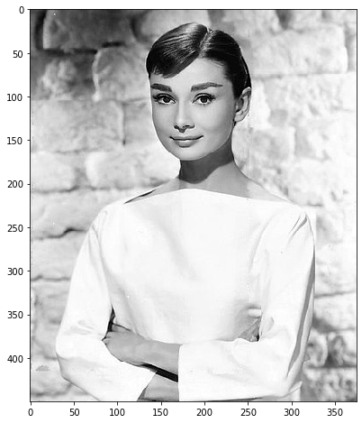
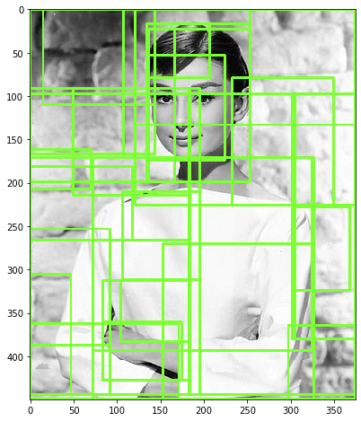
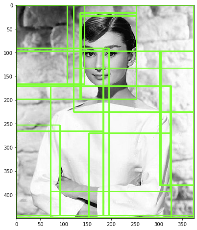
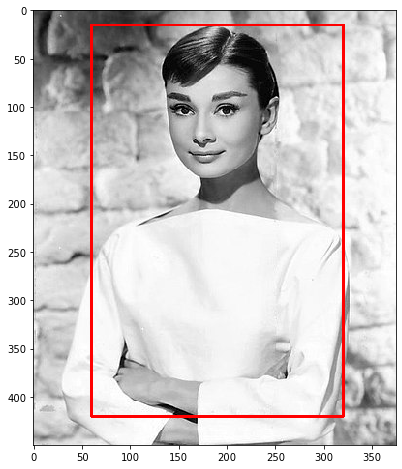
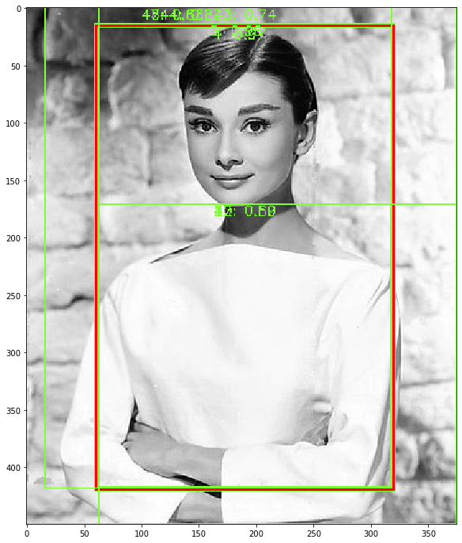

###  selective search를 이용하여 Object Detection을 위한 Region Proposal 영역을 도출

- selective search 참고 github : https://github.com/AlpacaDB/selectivesearch

#### selectivesearch를 설치하고 이미지를 로드


```python
#!pip install selectivesearch
```


```python
import selectivesearch
import cv2
import matplotlib.pyplot as plt
%matplotlib inline

### 오드리헵번 이미지를 cv2로 로드하고 matplotlib으로 시각화 
img = cv2.imread('../../data/image/audrey01.jpg')
img_rgb = cv2.cvtColor(img, cv2.COLOR_BGR2RGB)
print('img shape:', img.shape)

plt.figure(figsize=(8, 8))
plt.imshow(img_rgb)
plt.show()
```

    
    Bad key "text.kerning_factor" on line 4 in
    /home/kimjeongseob/anaconda3/envs/tf113/lib/python3.6/site-packages/matplotlib/mpl-data/stylelib/_classic_test_patch.mplstyle.
    You probably need to get an updated matplotlibrc file from
    https://github.com/matplotlib/matplotlib/blob/v3.1.3/matplotlibrc.template
    or from the matplotlib source distribution


    img shape: (450, 375, 3)





```python
#selectivesearch.selective_search()는 이미지의 Region Proposal정보를 반환 
#인수 'img_rgb' : bgr을 rgb로 바꿔준 이미지를 selective search하라는 것
#인수 'scale' : 알고리즘 조정 인수. 큰 object를 찾도록 하는지, 작은 object를 찾도록 하는지
#인수 'min_size' : 절대값 조정 인수. 추천되는  bounding box 중, 최소한 min_size보다는 큰 bounding box를 찾으라는 것 (2000 = 50 by 40의 직사각 bounding box를 의키)
#'regions'에 region이 반환됨 (41개의 bounding box. 'regions'라는 list에 dict로 41개가 담겨져 있음)

_, regions = selectivesearch.selective_search(img_rgb, scale=100, min_size=2000)

print(type(regions), len(regions))
```

    <class 'list'> 41


#### 반환된 Region Proposal(후보 영역)에 대한 정보 보기. 
반환된 regions 변수는 리스트 타입으로 세부 원소로 딕셔너리를 가지고 있음. 
개별 딕셔너리내 KEY값별 의미
* rect 키값은 x,y 시작 좌표와 너비, 높이 값을 가지며 이 값이 Detected Object 후보를 나타내는 Bounding box임. 
* size는 Bounding box의 크기
* labels는 해당 rect로 지정된 Bounding Box내에 있는 오브젝트들의 고유 ID
* 아래로 내려갈 수록 너비와 높이 값이 큰 Bounding box이며 하나의 Bounding box에 여러개의 오브젝트가 있을 확률이 커짐. 


```python
# 0,0,107,167 -> 좌상단(0,0), width = 107, height = 167
# labels가 2개 이상 -> ex) labels : [7.0, 11.0] = 7번 라벨과 11번 라벨이 합쳐졌다는 것

regions
```


    [{'rect': (0, 0, 107, 167), 'size': 11166, 'labels': [0.0]},
     {'rect': (15, 0, 129, 110), 'size': 8771, 'labels': [1.0]},
     {'rect': (121, 0, 253, 133), 'size': 17442, 'labels': [2.0]},
     {'rect': (134, 17, 73, 62), 'size': 2713, 'labels': [3.0]},
     {'rect': (166, 23, 87, 176), 'size': 8639, 'labels': [4.0]},
     {'rect': (136, 53, 88, 121), 'size': 4617, 'labels': [5.0]},
     {'rect': (232, 79, 117, 147), 'size': 7701, 'labels': [6.0]},
     {'rect': (50, 91, 133, 123), 'size': 7042, 'labels': [7.0]},
     {'rect': (305, 97, 69, 283), 'size': 11373, 'labels': [8.0]},
     {'rect': (0, 161, 70, 46), 'size': 2363, 'labels': [9.0]},
     {'rect': (72, 171, 252, 222), 'size': 34467, 'labels': [10.0]},
     {'rect': (0, 181, 118, 85), 'size': 5270, 'labels': [11.0]},
     {'rect': (106, 210, 89, 101), 'size': 2868, 'labels': [12.0]},
     {'rect': (302, 228, 66, 96), 'size': 2531, 'labels': [13.0]},
     {'rect': (0, 253, 92, 134), 'size': 7207, 'labels': [14.0]},
     {'rect': (153, 270, 173, 179), 'size': 10360, 'labels': [15.0]},
     {'rect': (0, 305, 47, 139), 'size': 4994, 'labels': [16.0]},
     {'rect': (104, 312, 80, 71), 'size': 3595, 'labels': [17.0]},
     {'rect': (84, 360, 91, 67), 'size': 2762, 'labels': [18.0]},
     {'rect': (0, 362, 171, 87), 'size': 7705, 'labels': [19.0]},
     {'rect': (297, 364, 77, 85), 'size': 5164, 'labels': [20.0]},
     {'rect': (0, 91, 183, 175), 'size': 12312, 'labels': [7.0, 11.0]},
     {'rect': (136, 23, 117, 176), 'size': 13256, 'labels': [4.0, 5.0]},
     {'rect': (72, 171, 254, 278), 'size': 44827, 'labels': [10.0, 15.0]},
     {'rect': (134, 17, 119, 182), 'size': 15969, 'labels': [4.0, 5.0, 3.0]},
     {'rect': (302, 97, 72, 283), 'size': 13904, 'labels': [8.0, 13.0]},
     {'rect': (121, 0, 253, 226), 'size': 25143, 'labels': [2.0, 6.0]},
     {'rect': (0, 91, 183, 175), 'size': 14675, 'labels': [7.0, 11.0, 9.0]},
     {'rect': (0, 0, 144, 167), 'size': 19937, 'labels': [0.0, 1.0]},
     {'rect': (0, 0, 253, 199),
      'size': 35906,
      'labels': [0.0, 1.0, 4.0, 5.0, 3.0]},
     {'rect': (0, 253, 92, 191), 'size': 12201, 'labels': [14.0, 16.0]},
     {'rect': (0, 91, 183, 353),
      'size': 26876,
      'labels': [14.0, 16.0, 7.0, 11.0, 9.0]},
     {'rect': (0, 171, 326, 278), 'size': 52532, 'labels': [10.0, 15.0, 19.0]},
     {'rect': (0, 97, 374, 352),
      'size': 66436,
      'labels': [10.0, 15.0, 19.0, 8.0, 13.0]},
     {'rect': (84, 312, 100, 115), 'size': 6357, 'labels': [17.0, 18.0]},
     {'rect': (0, 91, 184, 353),
      'size': 33233,
      'labels': [17.0, 18.0, 14.0, 16.0, 7.0, 11.0, 9.0]},
     {'rect': (0, 91, 195, 353),
      'size': 36101,
      'labels': [17.0, 18.0, 14.0, 16.0, 7.0, 11.0, 9.0, 12.0]},
     {'rect': (0, 0, 374, 444),
      'size': 61244,
      'labels': [17.0, 18.0, 14.0, 16.0, 7.0, 11.0, 9.0, 12.0, 2.0, 6.0]},
     {'rect': (0, 0, 374, 449),
      'size': 127680,
      'labels': [17.0,
       18.0,
       14.0,
       16.0,
       7.0,
       11.0,
       9.0,
       12.0,
       2.0,
       6.0,
       10.0,
       15.0,
       19.0,
       8.0,
       13.0]},
     {'rect': (0, 0, 374, 449),
      'size': 132844,
      'labels': [17.0,
       18.0,
       14.0,
       16.0,
       7.0,
       11.0,
       9.0,
       12.0,
       2.0,
       6.0,
       10.0,
       15.0,
       19.0,
       8.0,
       13.0,
       20.0]},
     {'rect': (0, 0, 374, 449),
      'size': 168750,
      'labels': [17.0,
       18.0,
       14.0,
       16.0,
       7.0,
       11.0,
       9.0,
       12.0,
       2.0,
       6.0,
       10.0,
       15.0,
       19.0,
       8.0,
       13.0,
       20.0,
       0.0,
       1.0,
       4.0,
       5.0,
       3.0]}]


```python
# rect정보만 출력해서 보기
cand_rects = [cand['rect'] for cand in regions]
print(cand_rects)
```

    [(0, 0, 107, 167), (15, 0, 129, 110), (121, 0, 253, 133), (134, 17, 73, 62), (166, 23, 87, 176), (136, 53, 88, 121), (232, 79, 117, 147), (50, 91, 133, 123), (305, 97, 69, 283), (0, 161, 70, 46), (72, 171, 252, 222), (0, 181, 118, 85), (106, 210, 89, 101), (302, 228, 66, 96), (0, 253, 92, 134), (153, 270, 173, 179), (0, 305, 47, 139), (104, 312, 80, 71), (84, 360, 91, 67), (0, 362, 171, 87), (297, 364, 77, 85), (0, 91, 183, 175), (136, 23, 117, 176), (72, 171, 254, 278), (134, 17, 119, 182), (302, 97, 72, 283), (121, 0, 253, 226), (0, 91, 183, 175), (0, 0, 144, 167), (0, 0, 253, 199), (0, 253, 92, 191), (0, 91, 183, 353), (0, 171, 326, 278), (0, 97, 374, 352), (84, 312, 100, 115), (0, 91, 184, 353), (0, 91, 195, 353), (0, 0, 374, 444), (0, 0, 374, 449), (0, 0, 374, 449), (0, 0, 374, 449)]


**bounding box를 시각화 하기**


```python
# green_rgb = bounding box의 색상을 녹색(125,225,51)으로 rgb값을 준 것
# opencv의 rectangle()을 이용하여 시각화
# rectangle()은 이미지와 좌상단 좌표, 우하단 좌표, box컬러색, 두께등을 인자로 입력하면 원본 이미지에 box를 그려줌. 

# 작은 obejct까지 bounding box로 하고 싶다면, selective search 인수의 'min_size'를 작게 해줘야 함
# 총 41개의 bounding box가 출력

green_rgb = (125, 255, 51)
img_rgb_copy = img_rgb.copy()
for rect in cand_rects:ㄴ
    
    left = rect[0]
    top = rect[1]
    # rect[2], rect[3]은 너비와 높이이므로 우하단 좌표를 구하기 위해 좌상단 좌표에 각각을 더함. 
    right = left + rect[2]
    bottom = top + rect[3]
    
    img_rgb_copy = cv2.rectangle(img_rgb_copy, (left, top), (right, bottom), color=green_rgb, thickness=2)
    
plt.figure(figsize=(8, 8))
plt.imshow(img_rgb_copy)
plt.show()
```





#### bounding box의 크기가 큰 후보만 추출

    - if size > 특정 size 통해서 추출


```python
cand_rects = [cand['rect'] for cand in regions if cand['size'] > 10000]

green_rgb = (125, 255, 51)
img_rgb_copy = img_rgb.copy()
for rect in cand_rects:
    
    left = rect[0]
    top = rect[1]
    # rect[2], rect[3]은 너비와 높이이므로 우하단 좌표를 구하기 위해 좌상단 좌표에 각각을 더함. 
    right = left + rect[2]
    bottom = top + rect[3]
    
    img_rgb_copy = cv2.rectangle(img_rgb_copy, (left, top), (right, bottom), color=green_rgb, thickness=2)
    
plt.figure(figsize=(8, 8))
plt.imshow(img_rgb_copy)
plt.show()
```





### IOU 구하기

#### 입력인자로 후보 박스와 실제 박스를 받아서 IOU를 계산하는 함수 생성


```python
import numpy as np

# IoU를 구하는 함수 생성('compute_iou')
# cand_box : 예측한 후보 박스, gt_box : groud_truth box
 
def compute_iou(cand_box, gt_box):

    # Calculate intersection areas
    x1 = np.maximum(cand_box[0], gt_box[0])
    y1 = np.maximum(cand_box[1], gt_box[1])
    x2 = np.minimum(cand_box[2], gt_box[2])
    y2 = np.minimum(cand_box[3], gt_box[3])
    
    intersection = np.maximum(x2 - x1, 0) * np.maximum(y2 - y1, 0)
    
    cand_box_area = (cand_box[2] - cand_box[0]) * (cand_box[3] - cand_box[1])
    gt_box_area = (gt_box[2] - gt_box[0]) * (gt_box[3] - gt_box[1])
    union = cand_box_area + gt_box_area - intersection
    
    iou = intersection / union
    return iou
```


```python
import cv2
import matplotlib.pyplot as plt
%matplotlib inline

# 실제 box(Ground Truth)의 좌표를 아래와 같다고 가정. 
gt_box = [60, 15, 320, 420]

img = cv2.imread('../../data/image/audrey01.jpg')
img_rgb = cv2.cvtColor(img, cv2.COLOR_BGR2RGB)

red = (255, 0 , 0)
img_rgb = cv2.rectangle(img_rgb, (gt_box[0], gt_box[1]), (gt_box[2], gt_box[3]), color=red, thickness=2)

plt.figure(figsize=(8, 8))
plt.imshow(img_rgb)
plt.show()
```





```python
import selectivesearch

#selectivesearch.selective_search()는 이미지의 Region Proposal정보를 반환 
#selectivesearch알고리즘이 랜덤하게 돌기 때문에, 같은 이미지 같은 인수라도 결과는 다를 수 있음
_, regions = selectivesearch.selective_search(img_rgb, scale=100, min_size=2000)

print(type(regions), len(regions))
```

    <class 'list'> 53


```python
# 예측후보 box 확인

cand_rects = [cand['rect'] for cand in regions]
for index, cand_box in enumerate(cand_rects):
    cand_box = list(cand_box)
    
    # [2] = 우하단 x, [3] = 우하단 y 로 변환 ([2]는 width => 우하단 x, [3]은 height => 우하단 y, [0] = 좌상단 x, [1] = 좌상단 y)
    # 'compute_iou'함수의 cand_box 인수가 'x1, y1, x2, y2'(좌상단, 우하단 좌표)를 받게끔 되어있어, 이에 맞춰주는 과정
    cand_box[2] += cand_box[0]
    cand_box[3] += cand_box[1]
    
    iou = compute_iou(cand_box, gt_box)
    print('index:', index, "iou:", iou)
```


    [(0, 0, 58, 257),
     (16, 0, 270, 50),
     (284, 0, 90, 420),
     (59, 14, 262, 407),
     (62, 17, 256, 401),
     (63, 18, 114, 91),
     (134, 18, 73, 61),
     (197, 18, 120, 132),
     (166, 23, 87, 176),
     (136, 53, 88, 121),
     (232, 79, 85, 148),
     (63, 91, 120, 123),
     (323, 105, 51, 248),
     (0, 162, 57, 45),
     (63, 171, 254, 246),
     (0, 202, 57, 64),
     (106, 210, 89, 101),
     (63, 253, 80, 165),
     (0, 256, 57, 142),
     (0, 258, 171, 191),
     (0, 313, 50, 131),
     (104, 313, 80, 69),
     (323, 327, 51, 85),
     (84, 360, 91, 58),
     (153, 366, 151, 51),
     (171, 413, 203, 36),
     (171, 423, 139, 26),
     (197, 18, 120, 209),
     (16, 0, 270, 109),
     (136, 23, 117, 176),
     (134, 18, 119, 181),
     (0, 0, 58, 266),
     (63, 171, 254, 247),
     (0, 256, 57, 188),
     (0, 256, 171, 193),
     (63, 171, 254, 247),
     (284, 0, 90, 420),
     (16, 0, 270, 199),
     (0, 0, 58, 266),
     (284, 0, 90, 420),
     (84, 360, 290, 89),
     (0, 0, 171, 449),
     (197, 0, 177, 420),
     (63, 91, 132, 220),
     (0, 0, 195, 449),
     (84, 360, 290, 89),
     (84, 313, 290, 136),
     (63, 171, 311, 278),
     (63, 0, 311, 449),
     (16, 0, 302, 418),
     (0, 0, 374, 449),
     (0, 0, 374, 449),
     (0, 0, 374, 449)]


```python
cand_rects = [cand['rect'] for cand in regions if cand['size'] > 5000]
cand_rects.sort()
cand_rects
```


    [(0, 0, 58, 257),
     (0, 0, 58, 266),
     (0, 0, 58, 266),
     (0, 0, 171, 449),
     (0, 0, 195, 449),
     (0, 0, 374, 449),
     (0, 0, 374, 449),
     (0, 0, 374, 449),
     (0, 256, 57, 188),
     (0, 256, 171, 193),
     (16, 0, 270, 50),
     (16, 0, 270, 109),
     (16, 0, 270, 199),
     (16, 0, 302, 418),
     (62, 17, 256, 401),
     (63, 0, 311, 449),
     (63, 18, 114, 91),
     (63, 91, 120, 123),
     (63, 91, 132, 220),
     (63, 171, 254, 246),
     (63, 171, 254, 247),
     (63, 171, 254, 247),
     (63, 171, 311, 278),
     (84, 313, 290, 136),
     (84, 360, 290, 89),
     (84, 360, 290, 89),
     (134, 18, 119, 181),
     (136, 23, 117, 176),
     (153, 366, 151, 51),
     (166, 23, 87, 176),
     (197, 0, 177, 420),
     (197, 18, 120, 132),
     (197, 18, 120, 209),
     (232, 79, 85, 148),
     (284, 0, 90, 420),
     (284, 0, 90, 420),
     (284, 0, 90, 420),
     (323, 105, 51, 248)]


```python
img = cv2.imread('../../data/image/audrey01.jpg')
img_rgb = cv2.cvtColor(img, cv2.COLOR_BGR2RGB)
print('img shape:', img.shape)

green_rgb = (125, 255, 51)
cand_rects = [cand['rect'] for cand in regions if cand['size'] > 3000]
gt_box = [60, 15, 320, 420]
img_rgb = cv2.rectangle(img_rgb, (gt_box[0], gt_box[1]), (gt_box[2], gt_box[3]), color=red, thickness=2)

for index, cand_box in enumerate(cand_rects):
    
    cand_box = list(cand_box)
    cand_box[2] += cand_box[0]
    cand_box[3] += cand_box[1]
    
    iou = compute_iou(cand_box, gt_box)
    
    if iou > 0.5:
        print('index:', index, "iou:", iou, 'rectangle:',(cand_box[0], cand_box[1], cand_box[2], cand_box[3]) )
        cv2.rectangle(img_rgb, (cand_box[0], cand_box[1]), (cand_box[2], cand_box[3]), color=green_rgb, thickness=1)
        text = "{}: {:.2f}".format(index, iou)
        cv2.putText(img_rgb, text, (cand_box[0]+ 100, cand_box[1]+10), cv2.FONT_HERSHEY_SIMPLEX, 0.4, color=green_rgb, thickness=1)
    
plt.figure(figsize=(12, 12))
plt.imshow(img_rgb)
plt.show()
    
```

    img shape: (450, 375, 3)
    index: 3 iou: 0.9874899187876287 rectangle: (59, 14, 321, 421)
    index: 4 iou: 0.9748907882241216 rectangle: (62, 17, 318, 418)
    index: 12 iou: 0.5933903133903133 rectangle: (63, 171, 317, 417)
    index: 27 iou: 0.5958024691358025 rectangle: (63, 171, 317, 418)
    index: 30 iou: 0.5958024691358025 rectangle: (63, 171, 317, 418)
    index: 42 iou: 0.5008648690956052 rectangle: (63, 171, 374, 449)
    index: 43 iou: 0.7389566501483806 rectangle: (63, 0, 374, 449)
    index: 44 iou: 0.815085997397344 rectangle: (16, 0, 318, 418)
    index: 45 iou: 0.6270619201314865 rectangle: (0, 0, 374, 449)
    index: 46 iou: 0.6270619201314865 rectangle: (0, 0, 374, 449)
    index: 47 iou: 0.6270619201314865 rectangle: (0, 0, 374, 449)




