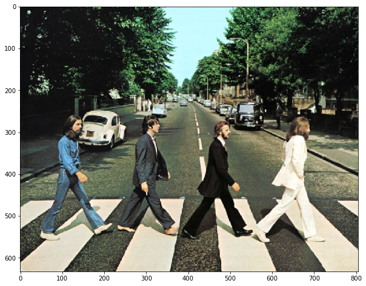
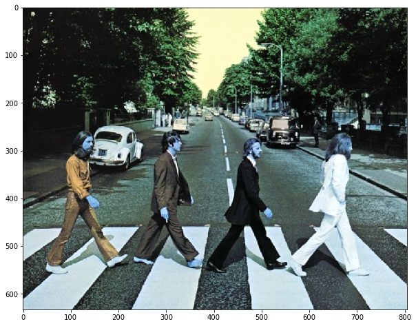

### OpenCV의 이미지와 영상 처리

* Python에서 사용되는 여러 image라이브러리를 간단히 살펴보고 OpenCV와의 차이 이해
* OpenCV의 단일 이미지 처리 방식 이해 
* OpenCV의 비디오 영상 처리 방식 이해

#### OpenCV 이미지 처리 이해 및 타 패키지 비교

#### PIL 패키지를 이용하여 이미지 로드하기


```python
import matplotlib.pyplot as plt
%matplotlib inline

from PIL import Image

# PIL은 oepn()으로 image file을 읽어서 ImageFile객체로 생성. 
pil_image = Image.open("../../data/image/beatles01.jpg")
print('image type:', type(pil_image))

plt.figure(figsize=(10, 10))
plt.imshow(pil_image)
#plt.show()
```

    image type: <class 'PIL.JpegImagePlugin.JpegImageFile'>


    <matplotlib.image.AxesImage at 0x7f7164c85978>





#### skimage(사이킷이미지)로 이미지 로드 하기
* skimage는 imread()를 이용하여 RGB 원본 이미지를 RGB 형태의 넘파이 배열로 반환함.  

    - skimage 는 numpy -> ndarray (배열) 기반!
    - sk_image shape = (633, 806, 3) 이라면, 행의 갯수 = 633개 라는 의미.


```python
from skimage import io

#skimage는 imread()를 이용하여 image를 numpy 배열로 반환함. 
sk_image = io.imread("../../data/image/beatles01.jpg")
print('sk_image type:', type(sk_image), ' sk_image shape:', sk_image.shape)

plt.figure(figsize=(10, 10))
plt.imshow(sk_image)
#plt.show()
```

    sk_image type: <class 'numpy.ndarray'>  sk_image shape: (633, 806, 3)


    <matplotlib.image.AxesImage at 0x7f7156488b00>


#### OpenCV로 이미지 로드하기
* OpenCV는 imread()를 이용하여 원본 RGB 이미지를 BGR 형태의 넘파이 배열로 반환함.  
* OpenCV의 imwrite()를 이용한다면 BGR 형태의 이미지 배열을 파일에 기록할 때 다시 RGB형태로 변환하므로 사용자는 RGB->BGR->RGB 변환에 신경쓰지 않아도 됨. 

**- imread로 읽을 시 : cv2.imread() -> cv2.cvtColor() 로 rgb로 변환!**

**- imwrtie 활용 시 : 자체적으로 rgb 변환해 저장하기 때문에, 따로 cv2.cvtColor() 메서드로 변환할 필요 없음!**


```python
import cv2

cv2_image = cv2.imread("../../data/image/beatles01.jpg")
cv2.imwrite("../../data/output/beatles02_cv.jpg", cv2_image)
print('cv_image type:', type(cv2_image), ' cv_image shape:', cv2_image.shape)

plt.figure(figsize=(10, 10))
img = plt.imread("../../data/output/beatles02_cv.jpg")
plt.imshow(img)
#plt.show()

```

    cv_image type: <class 'numpy.ndarray'>  cv_image shape: (633, 806, 3)


    <matplotlib.image.AxesImage at 0x7f71563f9240>


#### OpenCV의 imread()로 반환된 BGR 이미지 넘파이 배열을 그대로 시각화 하기
* OpenCV의 imread()는 RGB를 BGR로 변환하므로 원하지 않는 이미지가 출력됨


```python
# openCV는 imread 시, rgb가 아닌, bgr로 읽음

cv2_image = cv2.imread("../../data/image/beatles01.jpg")

plt.figure(figsize=(10, 10))
plt.imshow(cv2_image)
plt.show()
```





```python
sk_image = io.imread("../../data/image/beatles01.jpg")
print(sk_image.shape)
sk_image[:, :, 0]
```

    (633, 806, 3)


    array([[ 18,  17,  18, ...,  46,  38,  63],
           [ 18,  18,  18, ...,  72,  41,  37],
           [ 18,  18,  18, ...,  84,  56,  42],
           ...,
           [225, 226, 228, ..., 231, 228, 229],
           [225, 225, 226, ..., 229, 229, 227],
           [225, 225, 224, ..., 227, 227, 227]], dtype=uint8)


```python
# 앞선 bgr로 read된, sk_image의 0번(1번째) 채널의 값과 다름을 알 수 있다.

cv2_image = cv2.imread("../../data/image/beatles01.jpg")
print(type(cv2_image))
print(cv2_image.shape)
cv2_image[:, :, 0]
```

    <class 'numpy.ndarray'>
    (633, 806, 3)


    array([[ 19,  19,  20, ...,  47,  39,  64],
           [ 20,  20,  20, ...,  71,  40,  36],
           [ 20,  20,  20, ...,  82,  54,  40],
           ...,
           [198, 199, 201, ..., 190, 189, 188],
           [198, 198, 199, ..., 188, 188, 186],
           [199, 199, 198, ..., 186, 186, 186]], dtype=uint8)


```python
# 앞선 bgr로 read된, sk_image의 0번(1번째) 채널의 값과 같음을 알 수 있다.
# openCV로 이미지 read 시, rbg가 아닌, bgr로 읽음을 확인함

cv2_image[:, :, 2]
```


    array([[ 18,  18,  18, ...,  47,  39,  64],
           [ 19,  19,  18, ...,  72,  41,  37],
           [ 18,  18,  18, ...,  84,  56,  41],
           ...,
           [225, 226, 228, ..., 231, 230, 229],
           [225, 225, 226, ..., 229, 229, 227],
           [225, 225, 224, ..., 227, 227, 227]], dtype=uint8)


```python
# cv2.imread() -> cv2.cvtColor() 로 rgb로 변환!

cv2_image = cv2.imread("../../data/image/beatles01.jpg")
draw_image = cv2.cvtColor(cv2_image, cv2.COLOR_BGR2RGB)

plt.figure(figsize=(10, 10))
plt.imshow(draw_image)
plt.show()
```


#### OpenCV 영상처리
* OpenCV는 간편하게 비디오 영상처리를 할 수 있는 API를 제공
* VideoCapture 객체는 Video Streaming을 Frame 별로 Capture하여 처리할 수 있는 기능 제공
* VideoWriter 객체는 VideoCapture로 읽어들인 Frame을 동영상으로 Write하는 기능 제공


```python
# wget https://github.com/chulminkw/DLCV/blob/master/data/video/Night_Day_Chase.mp4?raw=true 으로 다운로드 가능. 
from IPython.display import clear_output, Image, display, Video, HTML
Video('../../data/video/Night_Day_Chase.mp4')
```


<video src="../../data/video/Night_Day_Chase.mp4" controls  >
      Your browser does not support the <code>video</code> element.
    </video>


```python
import cv2

video_input_path = '../../data/video/Night_Day_Chase.mp4'
# linux에서 video output의 확장자는 반드시 avi 로 설정 필요. 
video_output_path = '../../data/output/Night_Day_Chase_output.avi'

cap = cv2.VideoCapture(video_input_path)
# Codec은 *'XVID'로 설정. 
codec = cv2.VideoWriter_fourcc(*'XVID')

vid_size = (round(cap.get(cv2.CAP_PROP_FRAME_WIDTH)),round(cap.get(cv2.CAP_PROP_FRAME_HEIGHT))) #(200, 400)
vid_fps = cap.get(cv2.CAP_PROP_FPS )
    
vid_writer = cv2.VideoWriter(video_output_path, codec, vid_fps, vid_size) 

frame_cnt = int(cap.get(cv2.CAP_PROP_FRAME_COUNT))
print('총 Frame 갯수:', frame_cnt, 'FPS:', round(vid_fps), 'Frame 크기:', vid_size)
```

    총 Frame 갯수: 1383 FPS: 28 Frame 크기: (1216, 516)


```python
# 영상 처리 시에는, rgb로 변환해주는 코드 넣을 필요 없음(이미지 처리와 달리)

import time

green_color=(0, 255, 0)
red_color=(0, 0, 255)

start = time.time()
index=0
while True:
    hasFrame, img_frame = cap.read()
    if not hasFrame:
        print('더 이상 처리할 frame이 없습니다.')
        break
    index += 1
    print('frame :', index, '처리 완료')
    cv2.rectangle(img_frame, (300, 100, 800, 400), color=green_color, thickness=2)
    caption = "frame:{}".format(index)
    cv2.putText(img_frame, caption, (300, 95), cv2.FONT_HERSHEY_SIMPLEX, 0.7, red_color, 1)
    
    vid_writer.write(img_frame)

print('write 완료 시간:', round(time.time()-start,4))
vid_writer.release()
cap.release()   
```

    frame : 1 처리 완료
    frame : 2 처리 완료
    frame : 3 처리 완료
    frame : 4 처리 완료
    frame : 5 처리 완료
    frame : 6 처리 완료
    frame : 7 처리 완료
    frame : 8 처리 완료
    frame : 9 처리 완료
    frame : 10 처리 완료
    frame : 11 처리 완료
    frame : 12 처리 완료
    frame : 13 처리 완료
    frame : 14 처리 완료
    frame : 15 처리 완료
    frame : 16 처리 완료
    frame : 17 처리 완료
    frame : 18 처리 완료
    frame : 19 처리 완료
    frame : 20 처리 완료
    frame : 21 처리 완료
    frame : 22 처리 완료
    frame : 23 처리 완료
    frame : 24 처리 완료
    frame : 25 처리 완료
    frame : 26 처리 완료
    frame : 27 처리 완료
    frame : 28 처리 완료
    frame : 29 처리 완료
    frame : 30 처리 완료
    frame : 31 처리 완료
    frame : 32 처리 완료
    frame : 33 처리 완료
    frame : 34 처리 완료
    frame : 35 처리 완료
    frame : 36 처리 완료
    frame : 37 처리 완료
    frame : 38 처리 완료
    frame : 39 처리 완료
    frame : 40 처리 완료
    frame : 41 처리 완료
    frame : 42 처리 완료
    frame : 43 처리 완료
    frame : 44 처리 완료
    frame : 45 처리 완료
    frame : 46 처리 완료
    frame : 47 처리 완료
    frame : 48 처리 완료
    frame : 49 처리 완료
    frame : 50 처리 완료
    frame : 51 처리 완료
    frame : 52 처리 완료
    frame : 53 처리 완료
    frame : 54 처리 완료
    frame : 55 처리 완료
    frame : 56 처리 완료
    frame : 57 처리 완료
    frame : 58 처리 완료
    frame : 59 처리 완료
    frame : 60 처리 완료
    frame : 61 처리 완료
    frame : 62 처리 완료
    frame : 63 처리 완료
    frame : 64 처리 완료
    frame : 65 처리 완료
    frame : 66 처리 완료
    frame : 67 처리 완료
    frame : 68 처리 완료
    frame : 69 처리 완료
    frame : 70 처리 완료
    frame : 71 처리 완료
    frame : 72 처리 완료
    frame : 73 처리 완료
    frame : 74 처리 완료
    frame : 75 처리 완료
    frame : 76 처리 완료
    frame : 77 처리 완료
    frame : 78 처리 완료
    frame : 79 처리 완료
    frame : 80 처리 완료
    frame : 81 처리 완료
    frame : 82 처리 완료
    frame : 83 처리 완료
    frame : 84 처리 완료
    frame : 85 처리 완료
    frame : 86 처리 완료
    frame : 87 처리 완료
    frame : 88 처리 완료
    frame : 89 처리 완료
    frame : 90 처리 완료
    frame : 91 처리 완료
    frame : 92 처리 완료
    frame : 93 처리 완료
    frame : 94 처리 완료
    frame : 95 처리 완료
    frame : 96 처리 완료
    frame : 97 처리 완료
    frame : 98 처리 완료
    frame : 99 처리 완료
    frame : 100 처리 완료
    frame : 101 처리 완료
    frame : 102 처리 완료
    frame : 103 처리 완료
    frame : 104 처리 완료
    frame : 105 처리 완료
    frame : 106 처리 완료
    frame : 107 처리 완료
    frame : 108 처리 완료
    frame : 109 처리 완료
    frame : 110 처리 완료
    frame : 111 처리 완료
    frame : 112 처리 완료
    frame : 113 처리 완료
    frame : 114 처리 완료
    frame : 115 처리 완료
    frame : 116 처리 완료
    frame : 117 처리 완료
    frame : 118 처리 완료
    frame : 119 처리 완료
    frame : 120 처리 완료
    frame : 121 처리 완료
    frame : 122 처리 완료
    frame : 123 처리 완료
    frame : 124 처리 완료
    frame : 125 처리 완료
    frame : 126 처리 완료
    frame : 127 처리 완료
    frame : 128 처리 완료
    frame : 129 처리 완료
    frame : 130 처리 완료
    frame : 131 처리 완료
    frame : 132 처리 완료
    frame : 133 처리 완료
    frame : 134 처리 완료
    frame : 135 처리 완료
    frame : 136 처리 완료
    frame : 137 처리 완료
    frame : 138 처리 완료
    frame : 139 처리 완료
    frame : 140 처리 완료
    frame : 141 처리 완료
    frame : 142 처리 완료
    frame : 143 처리 완료
    frame : 144 처리 완료
    frame : 145 처리 완료
    frame : 146 처리 완료
    frame : 147 처리 완료
    frame : 148 처리 완료
    frame : 149 처리 완료
    frame : 150 처리 완료
    frame : 151 처리 완료
    frame : 152 처리 완료
    frame : 153 처리 완료
    frame : 154 처리 완료
    frame : 155 처리 완료
    frame : 156 처리 완료
    frame : 157 처리 완료
    frame : 158 처리 완료
    frame : 159 처리 완료
    frame : 160 처리 완료
    frame : 161 처리 완료
    frame : 162 처리 완료
    frame : 163 처리 완료
    frame : 164 처리 완료
    frame : 165 처리 완료
    frame : 166 처리 완료
    frame : 167 처리 완료
    frame : 168 처리 완료
    frame : 169 처리 완료
    frame : 170 처리 완료
    frame : 171 처리 완료
    frame : 172 처리 완료
    frame : 173 처리 완료
    frame : 174 처리 완료
    frame : 175 처리 완료
    frame : 176 처리 완료
    frame : 177 처리 완료
    frame : 178 처리 완료
    frame : 179 처리 완료
    frame : 180 처리 완료
    frame : 181 처리 완료
    frame : 182 처리 완료
    frame : 183 처리 완료
    frame : 184 처리 완료
    frame : 185 처리 완료
    frame : 186 처리 완료
    frame : 187 처리 완료
    frame : 188 처리 완료
    frame : 189 처리 완료
    frame : 190 처리 완료
    frame : 191 처리 완료
    frame : 192 처리 완료
    frame : 193 처리 완료
    frame : 194 처리 완료
    frame : 195 처리 완료
    frame : 196 처리 완료
    frame : 197 처리 완료
    frame : 198 처리 완료
    frame : 199 처리 완료
    frame : 200 처리 완료
    frame : 201 처리 완료
    frame : 202 처리 완료
    frame : 203 처리 완료
    frame : 204 처리 완료
    frame : 205 처리 완료
    frame : 206 처리 완료
    frame : 207 처리 완료
    frame : 208 처리 완료
    frame : 209 처리 완료
    frame : 210 처리 완료
    frame : 211 처리 완료
    frame : 212 처리 완료
    frame : 213 처리 완료
    frame : 214 처리 완료
    frame : 215 처리 완료
    frame : 216 처리 완료
    frame : 217 처리 완료
    frame : 218 처리 완료
    frame : 219 처리 완료
    frame : 220 처리 완료
    frame : 221 처리 완료
    frame : 222 처리 완료
    frame : 223 처리 완료
    frame : 224 처리 완료
    frame : 225 처리 완료
    frame : 226 처리 완료
    frame : 227 처리 완료
    frame : 228 처리 완료
    frame : 229 처리 완료
    frame : 230 처리 완료
    frame : 231 처리 완료
    frame : 232 처리 완료
    frame : 233 처리 완료
    frame : 234 처리 완료
    frame : 235 처리 완료
    frame : 236 처리 완료
    frame : 237 처리 완료
    frame : 238 처리 완료
    frame : 239 처리 완료
    frame : 240 처리 완료
    frame : 241 처리 완료
    frame : 242 처리 완료
    frame : 243 처리 완료
    frame : 244 처리 완료
    frame : 245 처리 완료
    frame : 246 처리 완료
    frame : 247 처리 완료
    frame : 248 처리 완료
    frame : 249 처리 완료
    frame : 250 처리 완료
    frame : 251 처리 완료
    frame : 252 처리 완료
    frame : 253 처리 완료
    frame : 254 처리 완료
    frame : 255 처리 완료
    frame : 256 처리 완료
    frame : 257 처리 완료
    frame : 258 처리 완료
    frame : 259 처리 완료
    frame : 260 처리 완료
    frame : 261 처리 완료
    frame : 262 처리 완료
    frame : 263 처리 완료
    frame : 264 처리 완료
    frame : 265 처리 완료
    frame : 266 처리 완료
    frame : 267 처리 완료
    frame : 268 처리 완료
    frame : 269 처리 완료
    frame : 270 처리 완료
    frame : 271 처리 완료
    frame : 272 처리 완료
    frame : 273 처리 완료
    frame : 274 처리 완료
    frame : 275 처리 완료
    frame : 276 처리 완료
    frame : 277 처리 완료
    frame : 278 처리 완료
    frame : 279 처리 완료
    frame : 280 처리 완료
    frame : 281 처리 완료
    frame : 282 처리 완료
    frame : 283 처리 완료
    frame : 284 처리 완료
    frame : 285 처리 완료
    frame : 286 처리 완료
    frame : 287 처리 완료
    frame : 288 처리 완료
    frame : 289 처리 완료
    frame : 290 처리 완료
    frame : 291 처리 완료
    frame : 292 처리 완료
    frame : 293 처리 완료
    frame : 294 처리 완료
    frame : 295 처리 완료
    frame : 296 처리 완료
    frame : 297 처리 완료
    frame : 298 처리 완료
    frame : 299 처리 완료
    frame : 300 처리 완료
    frame : 301 처리 완료
    frame : 302 처리 완료
    frame : 303 처리 완료
    frame : 304 처리 완료
    frame : 305 처리 완료
    frame : 306 처리 완료
    frame : 307 처리 완료
    frame : 308 처리 완료
    frame : 309 처리 완료
    frame : 310 처리 완료
    frame : 311 처리 완료
    frame : 312 처리 완료
    frame : 313 처리 완료
    frame : 314 처리 완료
    frame : 315 처리 완료
    frame : 316 처리 완료
    frame : 317 처리 완료
    frame : 318 처리 완료
    frame : 319 처리 완료
    frame : 320 처리 완료
    frame : 321 처리 완료
    frame : 322 처리 완료
    frame : 323 처리 완료
    frame : 324 처리 완료
    frame : 325 처리 완료
    frame : 326 처리 완료
    frame : 327 처리 완료
    frame : 328 처리 완료
    frame : 329 처리 완료
    frame : 330 처리 완료
    frame : 331 처리 완료
    frame : 332 처리 완료
    frame : 333 처리 완료
    frame : 334 처리 완료
    frame : 335 처리 완료
    frame : 336 처리 완료
    frame : 337 처리 완료
    frame : 338 처리 완료
    frame : 339 처리 완료
    frame : 340 처리 완료
    frame : 341 처리 완료
    frame : 342 처리 완료
    frame : 343 처리 완료
    frame : 344 처리 완료
    frame : 345 처리 완료
    frame : 346 처리 완료
    frame : 347 처리 완료
    frame : 348 처리 완료
    frame : 349 처리 완료
    frame : 350 처리 완료
    frame : 351 처리 완료
    frame : 352 처리 완료
    frame : 353 처리 완료
    frame : 354 처리 완료
    frame : 355 처리 완료
    frame : 356 처리 완료
    frame : 357 처리 완료
    frame : 358 처리 완료
    frame : 359 처리 완료
    frame : 360 처리 완료
    frame : 361 처리 완료
    frame : 362 처리 완료
    frame : 363 처리 완료
    frame : 364 처리 완료
    frame : 365 처리 완료
    frame : 366 처리 완료
    frame : 367 처리 완료
    frame : 368 처리 완료
    frame : 369 처리 완료
    frame : 370 처리 완료
    frame : 371 처리 완료
    frame : 372 처리 완료
    frame : 373 처리 완료
    frame : 374 처리 완료
    frame : 375 처리 완료
    frame : 376 처리 완료
    frame : 377 처리 완료
    frame : 378 처리 완료
    frame : 379 처리 완료
    frame : 380 처리 완료
    frame : 381 처리 완료
    frame : 382 처리 완료
    frame : 383 처리 완료
    frame : 384 처리 완료
    frame : 385 처리 완료
    frame : 386 처리 완료
    frame : 387 처리 완료
    frame : 388 처리 완료
    frame : 389 처리 완료
    frame : 390 처리 완료
    frame : 391 처리 완료
    frame : 392 처리 완료
    frame : 393 처리 완료
    frame : 394 처리 완료
    frame : 395 처리 완료
    frame : 396 처리 완료
    frame : 397 처리 완료
    frame : 398 처리 완료
    frame : 399 처리 완료
    frame : 400 처리 완료
    frame : 401 처리 완료
    frame : 402 처리 완료
    frame : 403 처리 완료
    frame : 404 처리 완료
    frame : 405 처리 완료
    frame : 406 처리 완료
    frame : 407 처리 완료
    frame : 408 처리 완료
    frame : 409 처리 완료
    frame : 410 처리 완료
    frame : 411 처리 완료
    frame : 412 처리 완료
    frame : 413 처리 완료
    frame : 414 처리 완료
    frame : 415 처리 완료
    frame : 416 처리 완료
    frame : 417 처리 완료
    frame : 418 처리 완료
    frame : 419 처리 완료
    frame : 420 처리 완료
    frame : 421 처리 완료
    frame : 422 처리 완료
    frame : 423 처리 완료
    frame : 424 처리 완료
    frame : 425 처리 완료
    frame : 426 처리 완료
    frame : 427 처리 완료
    frame : 428 처리 완료
    frame : 429 처리 완료
    frame : 430 처리 완료
    frame : 431 처리 완료
    frame : 432 처리 완료
    frame : 433 처리 완료
    frame : 434 처리 완료
    frame : 435 처리 완료
    frame : 436 처리 완료
    frame : 437 처리 완료
    frame : 438 처리 완료
    frame : 439 처리 완료
    frame : 440 처리 완료
    frame : 441 처리 완료
    frame : 442 처리 완료
    frame : 443 처리 완료
    frame : 444 처리 완료
    frame : 445 처리 완료
    frame : 446 처리 완료
    frame : 447 처리 완료
    frame : 448 처리 완료
    frame : 449 처리 완료
    frame : 450 처리 완료
    frame : 451 처리 완료
    frame : 452 처리 완료
    frame : 453 처리 완료
    frame : 454 처리 완료
    frame : 455 처리 완료
    frame : 456 처리 완료
    frame : 457 처리 완료
    frame : 458 처리 완료
    frame : 459 처리 완료
    frame : 460 처리 완료
    frame : 461 처리 완료
    frame : 462 처리 완료
    frame : 463 처리 완료
    frame : 464 처리 완료
    frame : 465 처리 완료
    frame : 466 처리 완료
    frame : 467 처리 완료
    frame : 468 처리 완료
    frame : 469 처리 완료
    frame : 470 처리 완료
    frame : 471 처리 완료
    frame : 472 처리 완료
    frame : 473 처리 완료
    frame : 474 처리 완료
    frame : 475 처리 완료
    frame : 476 처리 완료
    frame : 477 처리 완료
    frame : 478 처리 완료
    frame : 479 처리 완료
    frame : 480 처리 완료
    frame : 481 처리 완료
    frame : 482 처리 완료
    frame : 483 처리 완료
    frame : 484 처리 완료
    frame : 485 처리 완료
    frame : 486 처리 완료
    frame : 487 처리 완료
    frame : 488 처리 완료
    frame : 489 처리 완료
    frame : 490 처리 완료
    frame : 491 처리 완료
    frame : 492 처리 완료
    frame : 493 처리 완료
    frame : 494 처리 완료
    frame : 495 처리 완료
    frame : 496 처리 완료
    frame : 497 처리 완료
    frame : 498 처리 완료
    frame : 499 처리 완료
    frame : 500 처리 완료
    frame : 501 처리 완료
    frame : 502 처리 완료
    frame : 503 처리 완료
    frame : 504 처리 완료
    frame : 505 처리 완료
    frame : 506 처리 완료
    frame : 507 처리 완료
    frame : 508 처리 완료
    frame : 509 처리 완료
    frame : 510 처리 완료
    frame : 511 처리 완료
    frame : 512 처리 완료
    frame : 513 처리 완료
    frame : 514 처리 완료
    frame : 515 처리 완료
    frame : 516 처리 완료
    frame : 517 처리 완료
    frame : 518 처리 완료
    frame : 519 처리 완료
    frame : 520 처리 완료
    frame : 521 처리 완료
    frame : 522 처리 완료
    frame : 523 처리 완료
    frame : 524 처리 완료
    frame : 525 처리 완료
    frame : 526 처리 완료
    frame : 527 처리 완료
    frame : 528 처리 완료
    frame : 529 처리 완료
    frame : 530 처리 완료
    frame : 531 처리 완료
    frame : 532 처리 완료
    frame : 533 처리 완료
    frame : 534 처리 완료
    frame : 535 처리 완료
    frame : 536 처리 완료
    frame : 537 처리 완료
    frame : 538 처리 완료
    frame : 539 처리 완료
    frame : 540 처리 완료
    frame : 541 처리 완료
    frame : 542 처리 완료
    frame : 543 처리 완료
    frame : 544 처리 완료
    frame : 545 처리 완료
    frame : 546 처리 완료
    frame : 547 처리 완료
    frame : 548 처리 완료
    frame : 549 처리 완료
    frame : 550 처리 완료
    frame : 551 처리 완료
    frame : 552 처리 완료
    frame : 553 처리 완료
    frame : 554 처리 완료
    frame : 555 처리 완료
    frame : 556 처리 완료
    frame : 557 처리 완료
    frame : 558 처리 완료
    frame : 559 처리 완료
    frame : 560 처리 완료
    frame : 561 처리 완료
    frame : 562 처리 완료
    frame : 563 처리 완료
    frame : 564 처리 완료
    frame : 565 처리 완료
    frame : 566 처리 완료
    frame : 567 처리 완료
    frame : 568 처리 완료
    frame : 569 처리 완료
    frame : 570 처리 완료
    frame : 571 처리 완료
    frame : 572 처리 완료
    frame : 573 처리 완료
    frame : 574 처리 완료
    frame : 575 처리 완료
    frame : 576 처리 완료
    frame : 577 처리 완료
    frame : 578 처리 완료
    frame : 579 처리 완료
    frame : 580 처리 완료
    frame : 581 처리 완료
    frame : 582 처리 완료
    frame : 583 처리 완료
    frame : 584 처리 완료
    frame : 585 처리 완료
    frame : 586 처리 완료
    frame : 587 처리 완료
    frame : 588 처리 완료
    frame : 589 처리 완료
    frame : 590 처리 완료
    frame : 591 처리 완료
    frame : 592 처리 완료
    frame : 593 처리 완료
    frame : 594 처리 완료
    frame : 595 처리 완료
    frame : 596 처리 완료
    frame : 597 처리 완료
    frame : 598 처리 완료
    frame : 599 처리 완료
    frame : 600 처리 완료
    frame : 601 처리 완료
    frame : 602 처리 완료
    frame : 603 처리 완료
    frame : 604 처리 완료
    frame : 605 처리 완료
    frame : 606 처리 완료
    frame : 607 처리 완료
    frame : 608 처리 완료
    frame : 609 처리 완료
    frame : 610 처리 완료
    frame : 611 처리 완료
    frame : 612 처리 완료
    frame : 613 처리 완료
    frame : 614 처리 완료
    frame : 615 처리 완료
    frame : 616 처리 완료
    frame : 617 처리 완료
    frame : 618 처리 완료
    frame : 619 처리 완료
    frame : 620 처리 완료
    frame : 621 처리 완료
    frame : 622 처리 완료
    frame : 623 처리 완료
    frame : 624 처리 완료
    frame : 625 처리 완료
    frame : 626 처리 완료
    frame : 627 처리 완료
    frame : 628 처리 완료
    frame : 629 처리 완료
    frame : 630 처리 완료
    frame : 631 처리 완료
    frame : 632 처리 완료
    frame : 633 처리 완료
    frame : 634 처리 완료
    frame : 635 처리 완료
    frame : 636 처리 완료
    frame : 637 처리 완료
    frame : 638 처리 완료
    frame : 639 처리 완료
    frame : 640 처리 완료
    frame : 641 처리 완료
    frame : 642 처리 완료
    frame : 643 처리 완료
    frame : 644 처리 완료
    frame : 645 처리 완료
    frame : 646 처리 완료
    frame : 647 처리 완료
    frame : 648 처리 완료
    frame : 649 처리 완료
    frame : 650 처리 완료
    frame : 651 처리 완료
    frame : 652 처리 완료
    frame : 653 처리 완료
    frame : 654 처리 완료
    frame : 655 처리 완료
    frame : 656 처리 완료
    frame : 657 처리 완료
    frame : 658 처리 완료
    frame : 659 처리 완료
    frame : 660 처리 완료
    frame : 661 처리 완료
    frame : 662 처리 완료
    frame : 663 처리 완료
    frame : 664 처리 완료
    frame : 665 처리 완료
    frame : 666 처리 완료
    frame : 667 처리 완료
    frame : 668 처리 완료
    frame : 669 처리 완료
    frame : 670 처리 완료
    frame : 671 처리 완료
    frame : 672 처리 완료
    frame : 673 처리 완료
    frame : 674 처리 완료
    frame : 675 처리 완료
    frame : 676 처리 완료
    frame : 677 처리 완료
    frame : 678 처리 완료
    frame : 679 처리 완료
    frame : 680 처리 완료
    frame : 681 처리 완료
    frame : 682 처리 완료
    frame : 683 처리 완료
    frame : 684 처리 완료
    frame : 685 처리 완료
    frame : 686 처리 완료
    frame : 687 처리 완료
    frame : 688 처리 완료
    frame : 689 처리 완료
    frame : 690 처리 완료
    frame : 691 처리 완료
    frame : 692 처리 완료
    frame : 693 처리 완료
    frame : 694 처리 완료
    frame : 695 처리 완료
    frame : 696 처리 완료
    frame : 697 처리 완료
    frame : 698 처리 완료
    frame : 699 처리 완료
    frame : 700 처리 완료
    frame : 701 처리 완료
    frame : 702 처리 완료
    frame : 703 처리 완료
    frame : 704 처리 완료
    frame : 705 처리 완료
    frame : 706 처리 완료
    frame : 707 처리 완료
    frame : 708 처리 완료
    frame : 709 처리 완료
    frame : 710 처리 완료
    frame : 711 처리 완료
    frame : 712 처리 완료
    frame : 713 처리 완료
    frame : 714 처리 완료
    frame : 715 처리 완료
    frame : 716 처리 완료
    frame : 717 처리 완료
    frame : 718 처리 완료
    frame : 719 처리 완료
    frame : 720 처리 완료
    frame : 721 처리 완료
    frame : 722 처리 완료
    frame : 723 처리 완료
    frame : 724 처리 완료
    frame : 725 처리 완료
    frame : 726 처리 완료
    frame : 727 처리 완료
    frame : 728 처리 완료
    frame : 729 처리 완료
    frame : 730 처리 완료
    frame : 731 처리 완료
    frame : 732 처리 완료
    frame : 733 처리 완료
    frame : 734 처리 완료
    frame : 735 처리 완료
    frame : 736 처리 완료
    frame : 737 처리 완료
    frame : 738 처리 완료
    frame : 739 처리 완료
    frame : 740 처리 완료
    frame : 741 처리 완료
    frame : 742 처리 완료
    frame : 743 처리 완료
    frame : 744 처리 완료
    frame : 745 처리 완료
    frame : 746 처리 완료
    frame : 747 처리 완료
    frame : 748 처리 완료
    frame : 749 처리 완료
    frame : 750 처리 완료
    frame : 751 처리 완료
    frame : 752 처리 완료
    frame : 753 처리 완료
    frame : 754 처리 완료
    frame : 755 처리 완료
    frame : 756 처리 완료
    frame : 757 처리 완료
    frame : 758 처리 완료
    frame : 759 처리 완료
    frame : 760 처리 완료
    frame : 761 처리 완료
    frame : 762 처리 완료
    frame : 763 처리 완료
    frame : 764 처리 완료
    frame : 765 처리 완료
    frame : 766 처리 완료
    frame : 767 처리 완료
    frame : 768 처리 완료
    frame : 769 처리 완료
    frame : 770 처리 완료
    frame : 771 처리 완료
    frame : 772 처리 완료
    frame : 773 처리 완료
    frame : 774 처리 완료
    frame : 775 처리 완료
    frame : 776 처리 완료
    frame : 777 처리 완료
    frame : 778 처리 완료
    frame : 779 처리 완료
    frame : 780 처리 완료
    frame : 781 처리 완료
    frame : 782 처리 완료
    frame : 783 처리 완료
    frame : 784 처리 완료
    frame : 785 처리 완료
    frame : 786 처리 완료
    frame : 787 처리 완료
    frame : 788 처리 완료
    frame : 789 처리 완료
    frame : 790 처리 완료
    frame : 791 처리 완료
    frame : 792 처리 완료
    frame : 793 처리 완료
    frame : 794 처리 완료
    frame : 795 처리 완료
    frame : 796 처리 완료
    frame : 797 처리 완료
    frame : 798 처리 완료
    frame : 799 처리 완료
    frame : 800 처리 완료
    frame : 801 처리 완료
    frame : 802 처리 완료
    frame : 803 처리 완료
    frame : 804 처리 완료
    frame : 805 처리 완료
    frame : 806 처리 완료
    frame : 807 처리 완료
    frame : 808 처리 완료
    frame : 809 처리 완료
    frame : 810 처리 완료
    frame : 811 처리 완료
    frame : 812 처리 완료
    frame : 813 처리 완료
    frame : 814 처리 완료
    frame : 815 처리 완료
    frame : 816 처리 완료
    frame : 817 처리 완료
    frame : 818 처리 완료
    frame : 819 처리 완료
    frame : 820 처리 완료
    frame : 821 처리 완료
    frame : 822 처리 완료
    frame : 823 처리 완료
    frame : 824 처리 완료
    frame : 825 처리 완료
    frame : 826 처리 완료
    frame : 827 처리 완료
    frame : 828 처리 완료
    frame : 829 처리 완료
    frame : 830 처리 완료
    frame : 831 처리 완료
    frame : 832 처리 완료
    frame : 833 처리 완료
    frame : 834 처리 완료
    frame : 835 처리 완료
    frame : 836 처리 완료
    frame : 837 처리 완료
    frame : 838 처리 완료
    frame : 839 처리 완료
    frame : 840 처리 완료
    frame : 841 처리 완료
    frame : 842 처리 완료
    frame : 843 처리 완료
    frame : 844 처리 완료
    frame : 845 처리 완료
    frame : 846 처리 완료
    frame : 847 처리 완료
    frame : 848 처리 완료
    frame : 849 처리 완료
    frame : 850 처리 완료
    frame : 851 처리 완료
    frame : 852 처리 완료
    frame : 853 처리 완료
    frame : 854 처리 완료
    frame : 855 처리 완료
    frame : 856 처리 완료
    frame : 857 처리 완료
    frame : 858 처리 완료
    frame : 859 처리 완료
    frame : 860 처리 완료
    frame : 861 처리 완료
    frame : 862 처리 완료
    frame : 863 처리 완료
    frame : 864 처리 완료
    frame : 865 처리 완료
    frame : 866 처리 완료
    frame : 867 처리 완료
    frame : 868 처리 완료
    frame : 869 처리 완료
    frame : 870 처리 완료
    frame : 871 처리 완료
    frame : 872 처리 완료
    frame : 873 처리 완료
    frame : 874 처리 완료
    frame : 875 처리 완료
    frame : 876 처리 완료
    frame : 877 처리 완료
    frame : 878 처리 완료
    frame : 879 처리 완료
    frame : 880 처리 완료
    frame : 881 처리 완료
    frame : 882 처리 완료
    frame : 883 처리 완료
    frame : 884 처리 완료
    frame : 885 처리 완료
    frame : 886 처리 완료
    frame : 887 처리 완료
    frame : 888 처리 완료
    frame : 889 처리 완료
    frame : 890 처리 완료
    frame : 891 처리 완료
    frame : 892 처리 완료
    frame : 893 처리 완료
    frame : 894 처리 완료
    frame : 895 처리 완료
    frame : 896 처리 완료
    frame : 897 처리 완료
    frame : 898 처리 완료
    frame : 899 처리 완료
    frame : 900 처리 완료
    frame : 901 처리 완료
    frame : 902 처리 완료
    frame : 903 처리 완료
    frame : 904 처리 완료
    frame : 905 처리 완료
    frame : 906 처리 완료
    frame : 907 처리 완료
    frame : 908 처리 완료
    frame : 909 처리 완료
    frame : 910 처리 완료
    frame : 911 처리 완료
    frame : 912 처리 완료
    frame : 913 처리 완료
    frame : 914 처리 완료
    frame : 915 처리 완료
    frame : 916 처리 완료
    frame : 917 처리 완료
    frame : 918 처리 완료
    frame : 919 처리 완료
    frame : 920 처리 완료
    frame : 921 처리 완료
    frame : 922 처리 완료
    frame : 923 처리 완료
    frame : 924 처리 완료
    frame : 925 처리 완료
    frame : 926 처리 완료
    frame : 927 처리 완료
    frame : 928 처리 완료
    frame : 929 처리 완료
    frame : 930 처리 완료
    frame : 931 처리 완료
    frame : 932 처리 완료
    frame : 933 처리 완료
    frame : 934 처리 완료
    frame : 935 처리 완료
    frame : 936 처리 완료
    frame : 937 처리 완료
    frame : 938 처리 완료
    frame : 939 처리 완료
    frame : 940 처리 완료
    frame : 941 처리 완료
    frame : 942 처리 완료
    frame : 943 처리 완료
    frame : 944 처리 완료
    frame : 945 처리 완료
    frame : 946 처리 완료
    frame : 947 처리 완료
    frame : 948 처리 완료
    frame : 949 처리 완료
    frame : 950 처리 완료
    frame : 951 처리 완료
    frame : 952 처리 완료
    frame : 953 처리 완료
    frame : 954 처리 완료
    frame : 955 처리 완료
    frame : 956 처리 완료
    frame : 957 처리 완료
    frame : 958 처리 완료
    frame : 959 처리 완료
    frame : 960 처리 완료
    frame : 961 처리 완료
    frame : 962 처리 완료
    frame : 963 처리 완료
    frame : 964 처리 완료
    frame : 965 처리 완료
    frame : 966 처리 완료
    frame : 967 처리 완료
    frame : 968 처리 완료
    frame : 969 처리 완료
    frame : 970 처리 완료
    frame : 971 처리 완료
    frame : 972 처리 완료
    frame : 973 처리 완료
    frame : 974 처리 완료
    frame : 975 처리 완료
    frame : 976 처리 완료
    frame : 977 처리 완료
    frame : 978 처리 완료
    frame : 979 처리 완료
    frame : 980 처리 완료
    frame : 981 처리 완료
    frame : 982 처리 완료
    frame : 983 처리 완료
    frame : 984 처리 완료
    frame : 985 처리 완료
    frame : 986 처리 완료
    frame : 987 처리 완료
    frame : 988 처리 완료
    frame : 989 처리 완료
    frame : 990 처리 완료
    frame : 991 처리 완료
    frame : 992 처리 완료
    frame : 993 처리 완료
    frame : 994 처리 완료
    frame : 995 처리 완료
    frame : 996 처리 완료
    frame : 997 처리 완료
    frame : 998 처리 완료
    frame : 999 처리 완료
    frame : 1000 처리 완료
    frame : 1001 처리 완료
    frame : 1002 처리 완료
    frame : 1003 처리 완료
    frame : 1004 처리 완료
    frame : 1005 처리 완료
    frame : 1006 처리 완료
    frame : 1007 처리 완료
    frame : 1008 처리 완료
    frame : 1009 처리 완료
    frame : 1010 처리 완료
    frame : 1011 처리 완료
    frame : 1012 처리 완료
    frame : 1013 처리 완료
    frame : 1014 처리 완료
    frame : 1015 처리 완료
    frame : 1016 처리 완료
    frame : 1017 처리 완료
    frame : 1018 처리 완료
    frame : 1019 처리 완료
    frame : 1020 처리 완료
    frame : 1021 처리 완료
    frame : 1022 처리 완료
    frame : 1023 처리 완료
    frame : 1024 처리 완료
    frame : 1025 처리 완료
    frame : 1026 처리 완료
    frame : 1027 처리 완료
    frame : 1028 처리 완료
    frame : 1029 처리 완료
    frame : 1030 처리 완료
    frame : 1031 처리 완료
    frame : 1032 처리 완료
    frame : 1033 처리 완료
    frame : 1034 처리 완료
    frame : 1035 처리 완료
    frame : 1036 처리 완료
    frame : 1037 처리 완료
    frame : 1038 처리 완료
    frame : 1039 처리 완료
    frame : 1040 처리 완료
    frame : 1041 처리 완료
    frame : 1042 처리 완료
    frame : 1043 처리 완료
    frame : 1044 처리 완료
    frame : 1045 처리 완료
    frame : 1046 처리 완료
    frame : 1047 처리 완료
    frame : 1048 처리 완료
    frame : 1049 처리 완료
    frame : 1050 처리 완료
    frame : 1051 처리 완료
    frame : 1052 처리 완료
    frame : 1053 처리 완료
    frame : 1054 처리 완료
    frame : 1055 처리 완료
    frame : 1056 처리 완료
    frame : 1057 처리 완료
    frame : 1058 처리 완료
    frame : 1059 처리 완료
    frame : 1060 처리 완료
    frame : 1061 처리 완료
    frame : 1062 처리 완료
    frame : 1063 처리 완료
    frame : 1064 처리 완료
    frame : 1065 처리 완료
    frame : 1066 처리 완료
    frame : 1067 처리 완료
    frame : 1068 처리 완료
    frame : 1069 처리 완료
    frame : 1070 처리 완료
    frame : 1071 처리 완료
    frame : 1072 처리 완료
    frame : 1073 처리 완료
    frame : 1074 처리 완료
    frame : 1075 처리 완료
    frame : 1076 처리 완료
    frame : 1077 처리 완료
    frame : 1078 처리 완료
    frame : 1079 처리 완료
    frame : 1080 처리 완료
    frame : 1081 처리 완료
    frame : 1082 처리 완료
    frame : 1083 처리 완료
    frame : 1084 처리 완료
    frame : 1085 처리 완료
    frame : 1086 처리 완료
    frame : 1087 처리 완료
    frame : 1088 처리 완료
    frame : 1089 처리 완료
    frame : 1090 처리 완료
    frame : 1091 처리 완료
    frame : 1092 처리 완료
    frame : 1093 처리 완료
    frame : 1094 처리 완료
    frame : 1095 처리 완료
    frame : 1096 처리 완료
    frame : 1097 처리 완료
    frame : 1098 처리 완료
    frame : 1099 처리 완료
    frame : 1100 처리 완료
    frame : 1101 처리 완료
    frame : 1102 처리 완료
    frame : 1103 처리 완료
    frame : 1104 처리 완료
    frame : 1105 처리 완료
    frame : 1106 처리 완료
    frame : 1107 처리 완료
    frame : 1108 처리 완료
    frame : 1109 처리 완료
    frame : 1110 처리 완료
    frame : 1111 처리 완료
    frame : 1112 처리 완료
    frame : 1113 처리 완료
    frame : 1114 처리 완료
    frame : 1115 처리 완료
    frame : 1116 처리 완료
    frame : 1117 처리 완료
    frame : 1118 처리 완료
    frame : 1119 처리 완료
    frame : 1120 처리 완료
    frame : 1121 처리 완료
    frame : 1122 처리 완료
    frame : 1123 처리 완료
    frame : 1124 처리 완료
    frame : 1125 처리 완료
    frame : 1126 처리 완료
    frame : 1127 처리 완료
    frame : 1128 처리 완료
    frame : 1129 처리 완료
    frame : 1130 처리 완료
    frame : 1131 처리 완료
    frame : 1132 처리 완료
    frame : 1133 처리 완료
    frame : 1134 처리 완료
    frame : 1135 처리 완료
    frame : 1136 처리 완료
    frame : 1137 처리 완료
    frame : 1138 처리 완료
    frame : 1139 처리 완료
    frame : 1140 처리 완료
    frame : 1141 처리 완료
    frame : 1142 처리 완료
    frame : 1143 처리 완료
    frame : 1144 처리 완료
    frame : 1145 처리 완료
    frame : 1146 처리 완료
    frame : 1147 처리 완료
    frame : 1148 처리 완료
    frame : 1149 처리 완료
    frame : 1150 처리 완료
    frame : 1151 처리 완료
    frame : 1152 처리 완료
    frame : 1153 처리 완료
    frame : 1154 처리 완료
    frame : 1155 처리 완료
    frame : 1156 처리 완료
    frame : 1157 처리 완료
    frame : 1158 처리 완료
    frame : 1159 처리 완료
    frame : 1160 처리 완료
    frame : 1161 처리 완료
    frame : 1162 처리 완료
    frame : 1163 처리 완료
    frame : 1164 처리 완료
    frame : 1165 처리 완료
    frame : 1166 처리 완료
    frame : 1167 처리 완료
    frame : 1168 처리 완료
    frame : 1169 처리 완료
    frame : 1170 처리 완료
    frame : 1171 처리 완료
    frame : 1172 처리 완료
    frame : 1173 처리 완료
    frame : 1174 처리 완료
    frame : 1175 처리 완료
    frame : 1176 처리 완료
    frame : 1177 처리 완료
    frame : 1178 처리 완료
    frame : 1179 처리 완료
    frame : 1180 처리 완료
    frame : 1181 처리 완료
    frame : 1182 처리 완료
    frame : 1183 처리 완료
    frame : 1184 처리 완료
    frame : 1185 처리 완료
    frame : 1186 처리 완료
    frame : 1187 처리 완료
    frame : 1188 처리 완료
    frame : 1189 처리 완료
    frame : 1190 처리 완료
    frame : 1191 처리 완료
    frame : 1192 처리 완료
    frame : 1193 처리 완료
    frame : 1194 처리 완료
    frame : 1195 처리 완료
    frame : 1196 처리 완료
    frame : 1197 처리 완료
    frame : 1198 처리 완료
    frame : 1199 처리 완료
    frame : 1200 처리 완료
    frame : 1201 처리 완료
    frame : 1202 처리 완료
    frame : 1203 처리 완료
    frame : 1204 처리 완료
    frame : 1205 처리 완료
    frame : 1206 처리 완료
    frame : 1207 처리 완료
    frame : 1208 처리 완료
    frame : 1209 처리 완료
    frame : 1210 처리 완료
    frame : 1211 처리 완료
    frame : 1212 처리 완료
    frame : 1213 처리 완료
    frame : 1214 처리 완료
    frame : 1215 처리 완료
    frame : 1216 처리 완료
    frame : 1217 처리 완료
    frame : 1218 처리 완료
    frame : 1219 처리 완료
    frame : 1220 처리 완료
    frame : 1221 처리 완료
    frame : 1222 처리 완료
    frame : 1223 처리 완료
    frame : 1224 처리 완료
    frame : 1225 처리 완료
    frame : 1226 처리 완료
    frame : 1227 처리 완료
    frame : 1228 처리 완료
    frame : 1229 처리 완료
    frame : 1230 처리 완료
    frame : 1231 처리 완료
    frame : 1232 처리 완료
    frame : 1233 처리 완료
    frame : 1234 처리 완료
    frame : 1235 처리 완료
    frame : 1236 처리 완료
    frame : 1237 처리 완료
    frame : 1238 처리 완료
    frame : 1239 처리 완료
    frame : 1240 처리 완료
    frame : 1241 처리 완료
    frame : 1242 처리 완료
    frame : 1243 처리 완료
    frame : 1244 처리 완료
    frame : 1245 처리 완료
    frame : 1246 처리 완료
    frame : 1247 처리 완료
    frame : 1248 처리 완료
    frame : 1249 처리 완료
    frame : 1250 처리 완료
    frame : 1251 처리 완료
    frame : 1252 처리 완료
    frame : 1253 처리 완료
    frame : 1254 처리 완료
    frame : 1255 처리 완료
    frame : 1256 처리 완료
    frame : 1257 처리 완료
    frame : 1258 처리 완료
    frame : 1259 처리 완료
    frame : 1260 처리 완료
    frame : 1261 처리 완료
    frame : 1262 처리 완료
    frame : 1263 처리 완료
    frame : 1264 처리 완료
    frame : 1265 처리 완료
    frame : 1266 처리 완료
    frame : 1267 처리 완료
    frame : 1268 처리 완료
    frame : 1269 처리 완료
    frame : 1270 처리 완료
    frame : 1271 처리 완료
    frame : 1272 처리 완료
    frame : 1273 처리 완료
    frame : 1274 처리 완료
    frame : 1275 처리 완료
    frame : 1276 처리 완료
    frame : 1277 처리 완료
    frame : 1278 처리 완료
    frame : 1279 처리 완료
    frame : 1280 처리 완료
    frame : 1281 처리 완료
    frame : 1282 처리 완료
    frame : 1283 처리 완료
    frame : 1284 처리 완료
    frame : 1285 처리 완료
    frame : 1286 처리 완료
    frame : 1287 처리 완료
    frame : 1288 처리 완료
    frame : 1289 처리 완료
    frame : 1290 처리 완료
    frame : 1291 처리 완료
    frame : 1292 처리 완료
    frame : 1293 처리 완료
    frame : 1294 처리 완료
    frame : 1295 처리 완료
    frame : 1296 처리 완료
    frame : 1297 처리 완료
    frame : 1298 처리 완료
    frame : 1299 처리 완료
    frame : 1300 처리 완료
    frame : 1301 처리 완료
    frame : 1302 처리 완료
    frame : 1303 처리 완료
    frame : 1304 처리 완료
    frame : 1305 처리 완료
    frame : 1306 처리 완료
    frame : 1307 처리 완료
    frame : 1308 처리 완료
    frame : 1309 처리 완료
    frame : 1310 처리 완료
    frame : 1311 처리 완료
    frame : 1312 처리 완료
    frame : 1313 처리 완료
    frame : 1314 처리 완료
    frame : 1315 처리 완료
    frame : 1316 처리 완료
    frame : 1317 처리 완료
    frame : 1318 처리 완료
    frame : 1319 처리 완료
    frame : 1320 처리 완료
    frame : 1321 처리 완료
    frame : 1322 처리 완료
    frame : 1323 처리 완료
    frame : 1324 처리 완료
    frame : 1325 처리 완료
    frame : 1326 처리 완료
    frame : 1327 처리 완료
    frame : 1328 처리 완료
    frame : 1329 처리 완료
    frame : 1330 처리 완료
    frame : 1331 처리 완료
    frame : 1332 처리 완료
    frame : 1333 처리 완료
    frame : 1334 처리 완료
    frame : 1335 처리 완료
    frame : 1336 처리 완료
    frame : 1337 처리 완료
    frame : 1338 처리 완료
    frame : 1339 처리 완료
    frame : 1340 처리 완료
    frame : 1341 처리 완료
    frame : 1342 처리 완료
    frame : 1343 처리 완료
    frame : 1344 처리 완료
    frame : 1345 처리 완료
    frame : 1346 처리 완료
    frame : 1347 처리 완료
    frame : 1348 처리 완료
    frame : 1349 처리 완료
    frame : 1350 처리 완료
    frame : 1351 처리 완료
    frame : 1352 처리 완료
    frame : 1353 처리 완료
    frame : 1354 처리 완료
    frame : 1355 처리 완료
    frame : 1356 처리 완료
    frame : 1357 처리 완료
    frame : 1358 처리 완료
    frame : 1359 처리 완료
    frame : 1360 처리 완료
    frame : 1361 처리 완료
    frame : 1362 처리 완료
    frame : 1363 처리 완료
    frame : 1364 처리 완료
    frame : 1365 처리 완료
    frame : 1366 처리 완료
    frame : 1367 처리 완료
    frame : 1368 처리 완료
    frame : 1369 처리 완료
    frame : 1370 처리 완료
    frame : 1371 처리 완료
    frame : 1372 처리 완료
    frame : 1373 처리 완료
    frame : 1374 처리 완료
    frame : 1375 처리 완료
    frame : 1376 처리 완료
    frame : 1377 처리 완료
    frame : 1378 처리 완료
    frame : 1379 처리 완료
    frame : 1380 처리 완료
    frame : 1381 처리 완료
    frame : 1382 처리 완료
    frame : 1383 처리 완료
    더 이상 처리할 frame이 없습니다.
    write 완료 시간: 9.2757


```python
!gsutil cp ../../data/output/Night_Day_Chase_output.avi gs://my_bucket_dlcv0406/data/output/Night_Day_Chase_output.avi
```

    Copying file://../../data/output/Night_Day_Chase_output.avi [Content-Type=video/x-msvideo]...
    - [1 files][ 23.5 MiB/ 23.5 MiB]                                                
    Operation completed over 1 objects/23.5 MiB.                                     

