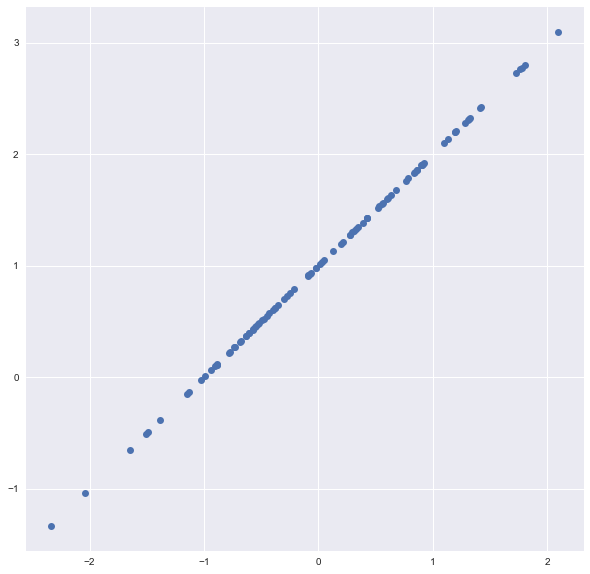
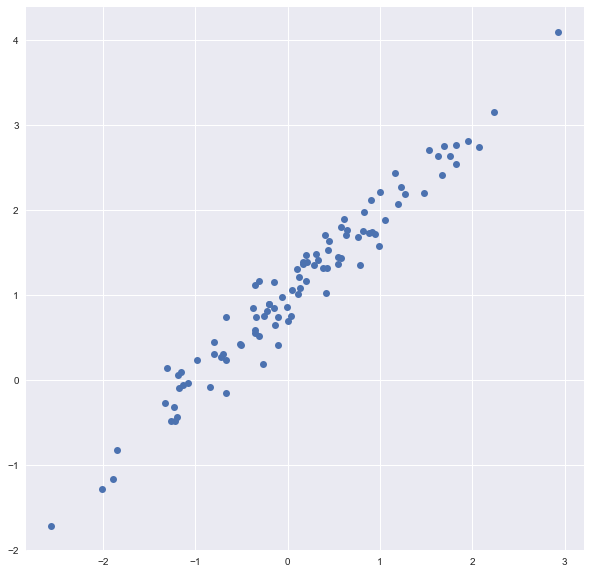
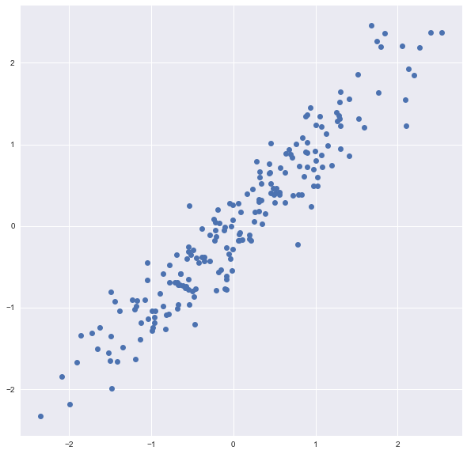

# 1. Python review

### 1. List는 ndarray와 달리 element-wise 연산을 제공하지 않는다. (벡터 연산은 ndarray로 numpy로 실시)


```python
a = [1,2,3]
b = [10,20,30]
a+b
```


    [1, 2, 3, 10, 20, 30]


### 2. [-3:] 의 의미


```python
a_ = 'abcde.txt'
a_[-3:]
```


    'txt'


### 3. list는 거의 모든 data type을 element로 가질 수 있다. 심지어 class도


```python
class temp():
    pass

a__ = [1,2,3,temp]
a__
```


    [1, 2, 3, __main__.temp]


### 4. list comprehension

- list comprehension은 하는 일이 1가지 뿐 : 리스트를 만드는 것.
- 따라서, list comprehension이 훨씬 더 명확함. 협업 시 상대방이 읽는 입장에서 더 명확하게 이해 가능


```python
a = [i for i in range(10)]
a
```


    [0, 1, 2, 3, 4, 5, 6, 7, 8, 9]


# 2. For loop, If statement

### 1. For loop 시, 반복 횟수를 explicit한 숫자로 적는 일은 갈수록 줄어들 것


```python
temp_list = [i+10 for i in range(10)]

for data_index in range(10):
    print(temp_list[data_index])
```

    10
    11
    12
    13
    14
    15
    16
    17
    18
    19


#### range(10) 이 아니라, range( len(temp_list) )로 해줘야, temp_list변동 시, 일일이 바꿔줘야 하는 수고로움 덜 수 있다


```python
temp_list = [i+10 for i in range(10)]

for data_index in range(len(temp_list)):
    print(data_index,temp_list[data_index])
```

    0 10
    1 11
    2 12
    3 13
    4 14
    5 15
    6 16
    7 17
    8 18
    9 19


### 2. enumerate


```python
temp_list = [i+10 for i in range(10)]

for index, data in enumerate(temp_list):
    print(index, data)
```

    0 10
    1 11
    2 12
    3 13
    4 14
    5 15
    6 16
    7 17
    8 18
    9 19


### 3. Practice : 최대값 / 최소값 찾기

#### 잘못된 코드


```python
temp_list = [i for i in range(10)]

maximum = 0
for data in temp_list:
    if maximum < data:
        maximum = data
print(temp_list)
print(maximum)    
```

    [0, 1, 2, 3, 4, 5, 6, 7, 8, 9]
    9


```python
# 최초 maximum을 0으로 잡아놓으면, 대상 데이터가 (-)음수일 경우, 최초의 maximum인 0 자체가 maximum이라 갱신되지 않는 문제가 발생함

temp_list = [i-100 for i in range(10)]

maximum = 0
for data in temp_list:
    if maximum < data:
        maximum = data
print(temp_list)
print(maximum)    
```

    [-100, -99, -98, -97, -96, -95, -94, -93, -92, -91]
    0


#### 제대로 된 코드


```python
# 최초 maximum을 None으로 잡고, 최초 maximum을 음수 데이터로 잡아주면, 그 후 다시 그 음수 범위 안에서 제대로 작동을 시작함

temp_list = [i-100 for i in range(10)]

maximum = None ## 여기가 중요
for data in temp_list:
    if maximum == None or maximum < data:
        maximum = data
print(temp_list)
print(maximum)
```

    [-100, -99, -98, -97, -96, -95, -94, -93, -92, -91]
    -91


#### 잘못된 코드 : integer와 None은 < > operation 지원 안함


```python
# 최초 maximum을 None으로 잡고, 최초 maximum을 음수 데이터로 잡아주면, 그 후 다시 그 음수 범위 안에서 제대로 작동을 시작함

temp_list = [i-100 for i in range(10)]

maximum = None ## 여기가 중요
for data in temp_list:
    if maximum < data or maximum == None: #최초의 maximum이 None이므로, < 연산이 해당 안됨
        maximum = data
print(temp_list)
print(maximum)
```


    ---------------------------------------------------------------------------

    TypeError                                 Traceback (most recent call last)

    <ipython-input-20-1aacac835d40> in <module>
          5 maximum = None ## 여기가 중요
          6 for data in temp_list:
    ----> 7     if maximum < data or maximum == None: #최초의 maximum이 None이므로, < 연산이 해당 안됨
          8         maximum = data
          9 print(temp_list)


    TypeError: '<' not supported between instances of 'NoneType' and 'int'


### 4. if / elif / else 중 else는 예외처리 용도로 많이 사용됨


```python
score_list = [(i+10) for i in range(90)] + [-1]

grade_list = [0,0,0]

for score in score_list:
    if score>=90 and score<100:
        grade_list[0] += 1
        
    elif score>=80 and score<90:
        grade_list[1] += 1
        
    elif score<80 and score>=0:
        grade_list[2] += 1
        
    else:
        print("Invalid score")

print(grade_list)
```

    Invalid score
    [10, 10, 70]


# 3. Dictionary

### 1. key-value 페어

dict.key(a,b) : a라는 키가 dict안에 없으면, b를 return 해줘라

# 4. Class

### 1. Initializer(생성자x), Instanciation

    - instanciation시, 바로 실행되는 게 class 내 initializer(__init__)

### 1-1. instance variable

    - self.x, self.y 처럼, tmp객체(instance)가 갖는 variable
    - class 내에서 instance variable(self.x, self.y)은 공유가능!


```python
class test_class():
    def __init__(self,x,y):
        self.x = x
        self.y = y
        
tmp = test_class(10,20)
print(tmp.x,tmp.y)
```

    10 20


### 1-2. class variable

    - class 전체가 공유하는 variable


```python
class node:
    
    # node_cnt가 class variable이다. self로 정의되는 instance가 특정해 갖는 게 아닌,
    # class 전체에서 공유되는 variable
    # instance를 통해 정의할 수 없음
    # 여러 instance들이 공유할 수 있음
    node_cnt = 0
    
    def __init__(self,x,y):
        self.x, self.y = x, y
        
        node.node_cnt += 1

node1 = node(10,20) # node1.x = 10, node1.y = 20, node1.node_cnt = 1
print(node1.x,node1.y,node1.node_cnt)
```

    10 20 1


# 5. Dataset generator

### 1) y = x + 1 

- x는 normal distribution


```python
%matplotlib inline
```


```python
N = 100
x_data = np.random.normal(0,1,size=(N,1))
y_data = x_data + 1

plt.style.use("seaborn")
fig, ax = plt.subplots(figsize=(10,10))
ax.plot(x_data,y_data,'bo')
print(x_data.shape,y_data.shape)
```

    (100, 1) (100, 1)





### 2) y = x + 1 + noise 

- x, noise는 normal distribution


```python
N = 100
x_data = np.random.normal(0,1,size=(N,1))
y_data = x_data + 1 + 0.2*np.random.normal(0,1,size=(N,1))

plt.style.use("seaborn")
fig, ax = plt.subplots(figsize=(10,10))
ax.plot(x_data,y_data,'bo')
print(x_data.shape,y_data.shape)
```

    (100, 1) (100, 1)





### 3) y = x1 + noise


```python
class dataset_generator:
    def __init__(self,n_sample=100,noise=0):
        self._n_sample = n_sample
        self._noise = noise
        
    def make_dataset(self):
        x_data = np.random.normal(0,1,size=(self._n_sample,1))
        y_data = x_data + self._noise*np.random.normal(0,1,size=(self._n_sample,1))
        
        return x_data,y_data
    
data_gen = dataset_generator(n_sample=200,noise=0.3)
x_data, y_data = data_gen.make_dataset()

plt.style.use("seaborn")
fig, ax = plt.subplots(figsize=(10,10))
ax.plot(x_data,y_data,'bo')
print(x_data.shape,y_data.shape)
```

    (200, 1) (200, 1)





```python
print(x_data.shape,y_data.shape)
```

    (200, 1) (200, 1)


### 3) y = x1 +  ...  + bias + noise

- feature dimension 추가
- coefficient 추가 (계수는 1, bias 는 0으로 초기값 지정)


```python
class dataset_generator:
    def __init__(self,feature_dim = 1,n_sample=100,noise=0):
        self._n_sample = n_sample
        self._noise = noise
        self._feature_dim = feature_dim
        
        self._coefficient = None
        self._init_set_coefficient()
        
    def _init_set_coefficient(self):
        self._coefficient = [1 for _ in range(self._feature_dim)] + [0]
        print(self._coefficient)
        
    def make_dataset(self):
        x_data = np.random.normal(0,1,size=(self._n_sample,1))
        y_data = x_data + self._noise*np.random.normal(0,1,size=(self._n_sample,1))
        
        return x_data,y_data
    
data_gen = dataset_generator(feature_dim=3,n_sample=200,noise=0.3)
# x_data, y_data = data_gen.make_dataset()

# plt.style.use("seaborn")
# fig, ax = plt.subplots(figsize=(10,10))
# ax.plot(x_data,y_data,'bo')
# print(x_data.shape,y_data.shape)
```

    [1, 1, 1, 0]


### 4) y = x1 +  ...  + bias + noise

- 사용자를 위한 함수 세팅
    - 1) set_n_sample


```python
class dataset_generator:
    def __init__(self,feature_dim = 1,n_sample=100,noise=0):
        self._n_sample = n_sample
        self._noise = noise
        self._feature_dim = feature_dim
        
        self._coefficient = None
        self._init_set_coefficient()
        
    def _init_set_coefficient(self):
        self._coefficient = [1 for _ in range(self._feature_dim)] + [0]
        print(self._coefficient)
        
    def set_n_sample(self,n_sample):
        self._n_sample = n_sample
        
#     def make_dataset(self):
#         x_data = np.random.normal(0,1,size=(self._n_sample,1))
#         y_data = x_data + self._noise*np.random.normal(0,1,size=(self._n_sample,1))
        
#         return x_data,y_data
    
data_gen = dataset_generator(feature_dim=3,noise=0.3)
print(data_gen._n_sample)
data_gen.set_n_sample(200)
print(data_gen._n_sample)
```

    [1, 1, 1, 0]
    100
    200


### 4) y = x1 +  ...  + bias + noise

- 사용자를 위한 함수 세팅

    - 2) set_noise
    - 3) set_coefficient


```python
class dataset_generator:
    def __init__(self,feature_dim = 1,n_sample=100,noise=0):
        self._n_sample = n_sample
        self._noise = noise
        self._feature_dim = feature_dim
        
        self._coefficient = None
        self._init_set_coefficient()
        
    def _init_set_coefficient(self):
        self._coefficient = [1 for _ in range(self._feature_dim)] + [0]
        
    def set_n_sample(self,n_sample):
        self._n_sample = n_sample
        
    def set_noise(sefl,noise):
        self._noise = noise

    def set_coefficient(self,coefficient_list):
        self._coefficient = coefficient_list        
        
        
#     def make_dataset(self):
#         x_data = np.random.normal(0,1,size=(self._n_sample,1))
#         y_data = x_data + self._noise*np.random.normal(0,1,size=(self._n_sample,1))
        
#         return x_data,y_data
    
data_gen = dataset_generator(feature_dim=3)
print(data_gen._coefficient)
data_gen.set_coefficient([2,-1,3,5])
print(data_gen._coefficient)
```

    [1, 1, 1, 0]
    [2, -1, 3, 5]


#### 지금까지 data_gen 객체의 메소드 설정
    - feature_dim 파라미터 설정 가능
    - set_n_sample 메소드
    - set_noise 메소드
    - set_coefficient 메소드
    
#### 이제 이러한 메소드를 활용해 'def make_dataset( )' 생성 차례


```python
class dataset_generator:
    def __init__(self,feature_dim = 1,n_sample=100,noise=0):
        self._n_sample = n_sample
        self._noise = noise
        self._feature_dim = feature_dim
        
        self._coefficient = None
        self._init_set_coefficient()
        
    def _init_set_coefficient(self):
        self._coefficient = [1 for _ in range(self._feature_dim)] + [0]
        
    def set_n_sample(self,n_sample):
        self._n_sample = n_sample
        
    def set_noise(sefl,noise):
        self._noise = noise

    def set_coefficient(self,coefficient_list):
        self._coefficient = coefficient_list        
        
        
    def make_dataset(self):
        x_data = np.random.normal(0,1,size=(self._n_sample,self._feature_dim))
        
        y_data = np.zeros(shape=(self._n_sample,1))
        
        for feature_idx in range(self._feature_dim):
            # .reshape(-1,1) 을 붙이지 않으면, x_data가 (100,) 로 됨. 
            # .reshape(-1,1) 붙여서 (100,1)이 되어야 x_data에 broadcasting 가능
            y_data += self._coefficient[feature_idx]*x_data[:,feature_idx].reshape(-1,1)
            
        # bias 붙이기 (y_data에)
        y_data += self._coefficient[-1]
        # nosie 붙이기 (y_data에)
        y_data += self._noise * np.random.normal(0,1,size=(self._n_sample,1))
            
        return x_data,y_data
    
    
data_gen = dataset_generator(feature_dim=3)
data_gen.set_coefficient([2,-1,3,5])
x_data,y_data = data_gen.make_dataset()
print(x_data.shape,y_data.shape)

```

    (100, 3) (100, 1)


#### visualizer 메소드 생성


```python
class dataset_generator:
    def __init__(self,feature_dim = 1,n_sample=100,noise=0):
        self._n_sample = n_sample
        self._noise = noise
        self._feature_dim = feature_dim
        
        self._coefficient = None
        self._init_set_coefficient()
        
    def _init_set_coefficient(self):
        self._coefficient = [1 for _ in range(self._feature_dim)] + [0]
        
    def set_n_sample(self,n_sample):
        self._n_sample = n_sample
        
    def set_noise(sefl,noise):
        self._noise = noise

    def set_coefficient(self,coefficient_list):
        self._coefficient = coefficient_list        
        
        
    def make_dataset(self):
        x_data = np.random.normal(0,1,size=(self._n_sample,self._feature_dim))
        
        y_data = np.zeros(shape=(self._n_sample,1))
        
        for feature_idx in range(self._feature_dim):
            # .reshape(-1,1) 을 붙이지 않으면, x_data가 (100,) 로 됨. 
            # .reshape(-1,1) 붙여서 (100,1)이 되어야 x_data에 broadcasting 가능
            y_data += self._coefficient[feature_idx]*x_data[:,feature_idx].reshape(-1,1)
            
        # bias 붙이기 (y_data에)
        y_data += self._coefficient[-1]
        # nosie 붙이기 (y_data에)
        y_data += self._noise * np.random.normal(0,1,size=(self._n_sample,1))
            
        return x_data,y_data
    
    def dataset_visualizer(self):
        if self._feature_dim == 1:
            pass
        else:
            class feature_dim_error(Exception):
                pass
            raise feature_dim_error("Visualization is valid for only feature_dim == 1")
        

data_gen = dataset_generator(feature_dim=3)
data_gen.set_coefficient([2,-1,3,5])
x_data,y_data = data_gen.make_dataset()
data_gen.dataset_visualizer()

```


    ---------------------------------------------------------------------------

    feature_dim_error                         Traceback (most recent call last)

    <ipython-input-66-36df7a6dddac> in <module>
         50 data_gen.set_coefficient([2,-1,3,5])
         51 x_data,y_data = data_gen.make_dataset()
    ---> 52 data_gen.dataset_visualizer()
    

    <ipython-input-66-36df7a6dddac> in dataset_visualizer(self)
         44             class feature_dim_error(Exception):
         45                 pass
    ---> 46             raise feature_dim_error("Visualization is valid for only feature_dim == 1")
         47 
         48 


    feature_dim_error: Visualization is valid for only feature_dim == 1

